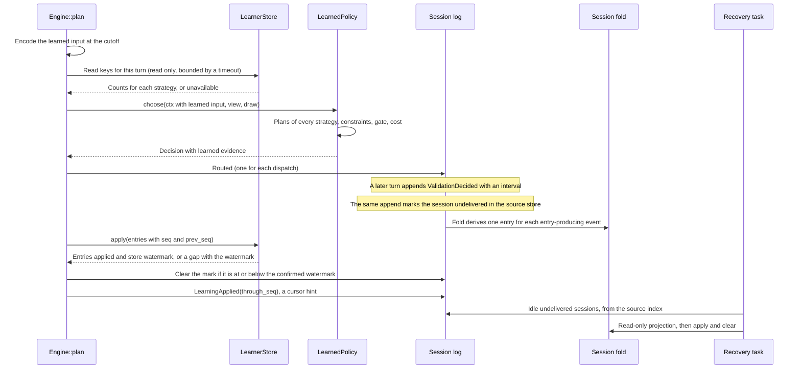

<!--
SPDX-FileCopyrightText: Copyright (c) 2026 NVIDIA CORPORATION & AFFILIATES. All rights reserved.
SPDX-License-Identifier: Apache-2.0
-->

# Online routing learner: implementation brief

> Status: proposal awaiting review, revision 3, 2026-09-22. The parent did not accept revisions 1 and 2. Section 20 records the dispositions of both reviews. The current published stage is `9fdfe41`. The source seams were read at `1658633`, the interval source. `9fdfe41` changes module documentation in `validate/brief.rs` only. It does not change transcript filtering behavior. No runtime learner exists. Nothing in this document is accepted policy. Every number in an example is a test fixture, not a deployment value.

## 1. Purpose and fixed inputs

This brief describes a live learner that selects a serving strategy on each turn, separately for each project. A strategy maps a tier signal to an admitted destination through the existing stage routing code. Frontier review intervals supply the quality signal. Candidate quotes and measured serving outcomes supply cost and latency.

The design obeys these settled rules from `PLAN-routing-strategy-bandit.md`:

- Local selection runs on every turn. It uses destination cache state, request complexity, context, and prior metadata.
- Jev classifications arrive in the background and enrich later features. No synchronous Jev selector exists.
- Classifier answers, classifier disagreement, and background estimates are not serving rewards.
- A complete frontier review interval without corrections is positive. A complete interval with corrections is negative. Gaps and missing context are Unknown.
- Interval credit does not invent individual blame. Correlated decisions in one interval do not count as independent evidence.
- Each decision keeps the features that existed at its cutoff. Late classifications and late reviews do not rewrite them.
- After the quality requirement is satisfied, the selector minimizes cost within a configurable latency limit. Learning is isolated by project.
- An oversized interval is Unknown. A new interval starts only after a parsed frontier checkpoint.
- Cache-marker ownership, opt-in egress that is off by default, local-only exclusion, and PR #18 as one unit are settled.

The bandit plan (sections 1 to 3) selects strategies, not unrestricted model identities. Later rulings removed the synchronous Jev strategy and the segment cadence. They did not replace strategy arms with target arms. This brief keeps strategy arms.

This brief does not decide numeric thresholds, behavior without quality evidence, C6 return-trip timing, or C3 fleet fail-open behavior. Live catalog, model, spend, and deployment inputs are absent. Section 17 separates the work that settled rules permit from the work that needs an owner decision.

## 2. Source seams at `1658633`

| Seam | Location | What the learner gets | What is missing |
|---|---|---|---|
| `RoutingPolicy::choose`, `RoutingContext` | `crates/roundhouse-core/src/routing/mod.rs` | Candidates with cache-aware quotes, `admissible`, signals, tier recipe, `ledger`, `budget` | Classification labels, learned state, project identity |
| `StagePolicy::choose`, `pick_tier`, `tier_pool` | `crates/roundhouse-core/src/routing/stage.rs` | Tier pick, recipe order, dominance cost guard on `Efficient` picks, degrade-to-local | A way to route a pick that `pick_tier` did not produce |
| `DecisionSource::is_signal_driven`, `opened_a_tier_escalation` | `routing/stage.rs`, `crates/roundhouse-server/src/engine.rs` | The handoff note opens only for signal-driven capable picks | A source for a strategy-forced pick |
| `SelectionSnapshot` | `crates/roundhouse-core/src/routing/selection.rs` | Features, `observed_through_seq`, classification window, selector evidence, objective. One snapshot for each turn, copied onto each `Routed`. | A learner branch in `SelectorBranch` |
| `ClassificationWindow`, `SessionState::classifications_through` | `crates/roundhouse-core/src/classify/mod.rs`, `crates/roundhouse-core/src/session.rs` | Bounded references to classifications available at the cutoff. Labels are in `SessionState::classifications()`. | Nothing for this design |
| `ReviewTracker`, `ReviewOutcome` | `crates/roundhouse-core/src/session/review.rs` | Accepted interval labels, covered `Routed` sequences, 64-turn and 256-decision bounds, a 16-outcome window | Strategy and key data for each covered decision |
| `Engine::plan` | `crates/roundhouse-server/src/engine.rs` | Features and window captured before `choose`. One `Routed` for each dispatch, written before its execution. | A learned-state read |
| `Engine::run_turn` tail | `crates/roundhouse-server/src/engine.rs` | Classification request, settlement repair, `settle`, fair-use draw, after the terminal event and before lease release | A learning update |
| `TurnBudget::admits`, `Admitted` | `crates/roundhouse-core/src/control/budget.rs`, `routing/mod.rs` | The grant check `expected_cost_usd <= ceiling_usd`, and the overflow valve state | Nothing for this design |
| `ProviderPricing::price_tokens`, `effective_write_per_mtok_usd`, `CacheLedger::model_for` | `crates/roundhouse-core/src/routing/ledger.rs` | The one pricing contract. Uncached input pays the effective write rate. | Nothing for this design |
| `SettlementKey::SessionWatermark` | `crates/roundhouse-core/src/control/spend.rs` | The per-session rule for ascending log sequences | It is a dollar ledger with holds and windows, so its store does not fit learned counts |
| `SessionStore::append_events`, the Redis `APPEND` script | `crates/roundhouse-core/src/store.rs`, `crates/roundhouse-store-redis/src/scripts.rs` | One atomic, lease-fenced append of source events. The Redis script checks the fencing token, reads `TIME`, and adds stream entries in one step. | An index of sessions whose learning entries are not yet delivered |
| `shared_backend::open`, `KeyFamily`, `build_key` | `crates/roundhouse-server/src/shared_backend.rs`, `crates/roundhouse-store-redis/src/keys.rs` | One Redis or memory choice for each deployment. Namespaced, versioned keys with a convention test. | A learner store and a `learn` family |
| `ProjectEntry` | `crates/roundhouse-server/src/control_config/config.rs` | Per-project `tiers` and `validate`. Admin `ProjectRecord` embeds the same entry. | A `learner` block |
| `serve` | `crates/roundhouse-server/src/main.rs` | Composes `StagePolicy` over `AffinityPolicy` when a recipe exists | Learner composition and a recovery task |
| `Arm::consults_judge` | `crates/roundhouse-core/src/validate/arm.rs` | Live and Shadow validation sessions track review intervals | Placebo and unenrolled sessions produce no labels |
| Local quotes | `crates/roundhouse-fleet/src/local.rs` | `expected_cost_usd: 0.0` and no rate card | A local capacity price |

## 3. Overview



The policy stays pure. The engine does all input and output: the store read, the deterministic draw, and the update. The fold turns the log into an ordered sequence of learning entries. The learner store applies each entry once, identified by its session and log sequence. The session store, which holds the source events, also holds the index that finds undelivered sessions.

## 4. Serving strategies

### 4.1 Strategy kinds

A strategy produces a tier pick. The extracted stage routing function turns the pick into a plan: the first target and ordered fallbacks from the admitted pool. Every strategy uses the same admission result, the recipe order, the dominance cost guard, and degrade-to-local.

| Strategy | Tier pick | Version source |
|---|---|---|
| `rules` | `pick_tier` with the recipe picker and threshold. This is the decision that `StagePolicy` makes today. | `STAGE_SELECTOR_REVISION` |
| `efficient` | Always `Efficient` | `STRATEGY_REVISION` |
| `capable` | Always `Capable` | `STRATEGY_REVISION` |

A calibrated form of `rules`, with a picker and threshold from the artifact, is deferred. Its pick is not in the key (section 5). Without that, it gains evidence on turns where it agrees with `rules`. It can then be chosen on turns where it disagrees, which is the selection bias that section 5 removes. A later revision can add it together with its pick in the key.

### 4.2 Scope

The learner requires a project tier recipe, because a strategy is a tier signal. Configuration refuses a `learner` block without `tiers`. Projects without a recipe keep `AffinityPolicy` and do not use the learner.

The configured strategy list has 2 or 3 entries from the table above, and it must contain `rules`. `rules` is the strategy that `shadow` mode serves, and the fallback that section 7.5 can name.

### 4.3 Seam changes

`StagePolicy::choose` calls `pick_tier` and then routes the pick. The first change extracts that routing into `StagePolicy::route_pick(recipe, pick, admitted) -> Result<Decision, RoutingError>`. The extraction does not change behavior. A test requires that `rules` through `route_pick` returns a decision equal to `StagePolicy::choose`.

A forced pick needs its own `DecisionSource::Strategy`. `is_signal_driven` returns `false` for it. As a result, `opened_a_tier_escalation` does not open a handoff note for a capable pick that no signal produced. `rules` keeps the source that `pick_tier` returned.

### 4.4 Artifacts and background evaluation

In revision 1 of the learned input, the calibration artifact supplies prior units for each strategy and key (section 6). A later revision can also define calibrated strategies in the artifact.

Each turn, the policy computes the plan of every configured strategy. The plans are pure and have no cost. The record keeps the first target of each plan. This is the zero-cost background evaluation: it shows which strategies agree with the served route. Agreement is a diagnostic, not an outcome of the strategies that did not serve.

This proposal purchases no background evaluation. Background runs of an alternative route remain in milestone B3, with their own budget and sampling configuration. Their results are not serving rewards.

### 4.5 Target arms

Target arms, one arm for each model identity, were the revision 1 proposal. They conflict with the retained plan. This revision does not propose them. Their adoption needs an explicit owner ruling.

## 5. Learned input: classification sequence and current turn

`LEARNING_INPUT_REVISION = 1` defines the learned input. The engine computes it once for each turn, from the `LocalFeatures` and `ClassificationWindow` that `plan` already captures before `choose`. Every recorded field affects selection.

The classification sequence is the newest `K = 3` classifications in the named window, ordered by source turn. A tie goes to the higher `available_seq`. Arrival order does not decide the order, because a delayed result for an old turn can land after a newer one. If the configured window names fewer than 3, the sequence is shorter. Each classification reduces to a complexity band:

| Band | Complexity labels |
|---|---|
| `none` | No classification in that position |
| `unknown` | `unknown` |
| `low` | `trivial`, `routine` |
| `high` | `involved`, `deep` |

| Input | Source | Values |
|---|---|---|
| `rules_pick` | The `rules` strategy pick for this turn, from the current `TurnSignals` | `efficient`, `capable` |
| `newest` | Band of the newest classification | `none`, `unknown`, `low`, `high` |
| `prior` | The older classifications of the sequence | `absent` (fewer than 2), `no_high`, `some_high` |
| `tool_turn` | The client declared tools on this turn | 0, 1 |

`rules_pick` carries the current request and prior metadata: severity, tool activity, depth, and the tests-passed heuristic. Input size and destination cache state enter through the quotes of each plan, not through the key.

The learned state has three key levels:

| Level | Key | Values |
|---|---|---|
| L2 | `rules_pick`, `newest`, `prior`, `tool_turn` | 48 |
| L1 | `rules_pick`, `newest` | 8 |
| L0 | `rules_pick` | 2 |

`rules_pick` is in every level for a reason. Within one key, `rules` then picks one tier, so agreement between `rules` and the fixed-tier strategies is nearly constant. Without it, the evidence for `efficient` in a key comes only from the turns where `rules` also picked efficient. Those turns are the easier part of the key, and the gate can then pass `efficient` on the harder turns of the same key.

Intent and context dependence are not in revision 1. They stay available in the log through the window references. A later revision can add them with offline support evidence and a new epoch.

A classification that lands during the turn has an `available_seq` above the cutoff, so `classifications_through` excludes it. `none` means that no classification was available. It is different from the classifier answer `unknown` and from low complexity.

## 6. Learned state and epochs

Learned state for one project and one epoch has two parts:

- Quality, for each level key and strategy: `pos_units`, `n_units`, and `sessions`.
- Operations, for each recipe target identity: the sum and count of latency residuals in milliseconds, and the failover count. It also holds the sums and count of predicted and observed cache reuse, in per-mille.

All counters are integers with the ranges in section 11.3. Integer addition gives the same state for every order of updates, so an offline rebuild matches the store exactly. Redis Lua also returns numbers as RESP integers, which is why the spend scripts pass dollars as strings.

An epoch is the identity of one learned model. Its id is SHA-256 over a canonical string of these parts, truncated to 16 bytes:

- the SHA-256 of the artifact bytes, without its metadata sidecar (section 14.5),
- the ordered strategy list,
- `LEARNING_INPUT_REVISION`, `LEARNED_SELECTOR_REVISION`, and `LEARNING_CREDIT_REVISION`.

A change to any part starts a new epoch. The artifact supplies its prior. The store never deletes the state of an old epoch. Each decision records its epoch and credit revision, and credit for that decision goes to that epoch. A provider that changes the model behind one identity does not change the epoch. The operator must issue a new artifact to start a new epoch.

## 7. Selection each turn

### 7.1 Modes

| Mode | Served decision | Learned evidence |
|---|---|---|
| `off` (the default) | `rules`, which is today's `StagePolicy` decision | None |
| `shadow` | `rules` | Recorded, with the learned choice marked not applied |
| `live` | The learned choice, or the configured infeasible behavior (7.5) | Recorded |

The engine records `RoutingPolicy::name` on each decision. A process that composes the learner writes the policy name `learned` for every project, including `off` projects. `StagePolicy` has the same property today. The learned evidence, not the policy name, identifies a learner decision.

### 7.2 Hard constraints

A served first target and every fallback must satisfy all of these:

1. Admission: the target is in the pool from `ctx.admissible(None)`, the call that `StagePolicy` already makes. The learner does not call admission again with other settings. Policy filters, credentials, cadence, the tool exclusion, and the budget stay as admission applied them.
2. Grant: if admission accepted the candidate under the grant, `ctx.budget.admits` must also accept a copy of the candidate with its adjusted cost (section 9). A cache correction can raise a cost above the grant, and then the candidate fails this constraint. If admission accepted the candidate only through the configured overflow valve (`ExhaustedOverflow`), the learner keeps that status and does not add or remove the candidate.
3. Latency: the adjusted TTFT (section 9) is at or below `latency_limit_ms`.
4. Quality: the strategy that owns the target passes the gate (7.4).

The dominance cost guard runs inside each strategy, on the unchanged quotes. The adjusted cost only compares strategy plans with each other and with the grant. It does not run the guard again.

### 7.3 Algorithm

`LearnedPolicy::choose` is a pure function of `RoutingContext`:

1. If the context has no learning input, return the `rules` decision. That is the case when the mode is `off`, the session has no principal, or the process composed no learner.
2. Compute the plan of every configured strategy with `route_pick` over one admitted pool.
3. For each strategy, evaluate constraints 2 and 3 on its first target, then the gate.
4. The exploit strategy is the passing strategy whose first target has the lowest adjusted cost. Ties go to the lower adjusted TTFT, then to the configured order.
5. If no strategy passes, apply section 7.5.
6. Build the fallbacks (7.6).
7. In `shadow` mode, return the `rules` decision and record the learned result as not applied.

If the store read failed or timed out, no strategy has a gate result. The turn then takes the section 7.5 path with the reason `StoreUnavailable` or `ReadTimedOut`. With `on_infeasible = serve_rules`, the turn serves `rules`. With `on_infeasible = refuse`, a learner-store outage fails every live turn of the project. Owner question 1 covers that consequence.

### 7.4 Quality gate

The gate function `wilson-v1` works on one level key and one strategy. With prior units from the artifact and live units from the store, `n = (prior_n + live_n) / CREDIT_SCALE` and `p = (prior_pos + live_pos) / (prior_n + live_n)`. It computes the Wilson score bounds `L` and `U` with the configured `z`. If `n` is zero, `L = 0` and `U = 1`.

For each strategy, the gate uses the most specific level whose key has `live_n >= min_evidence` for that strategy. If no level has that evidence, the result is `Unproven`. The record keeps the level that the gate used. The results are:

- `Pass`: `sessions >= min_sessions` at that level and `L >= quality_floor`.
- `Unproven`: not `Pass`, and `U >= quality_floor`, or no level has evidence.
- `BelowFloor`: `U < quality_floor`.

`min_evidence` counts only live units, so an artifact prior alone cannot pass the gate. This brief describes the mechanism. It makes no claim about the performance of the gate against another method.

### 7.5 No strategy satisfies the constraints

This case is infeasible. At cold start, every live turn is infeasible, because no strategy has live evidence. `shadow` mode is the only way to collect evidence without exploration. In `shadow` mode, `rules` serves and receives credit (section 8).

Without exploration, a live learner cannot change a route. `rules_pick` is in every key, and credit goes only to consistent trajectories. A fixed-tier strategy therefore gains evidence only in keys where it routes like `rules`, and there its plan equals the `rules` plan. Every passing strategy then serves the `rules` target, and every other turn is infeasible. In that case the live learner checks the quality, latency, and grant constraints on the `rules` route and applies `on_infeasible`. A route different from `rules` needs evidence from authorized exploration (question 1). The wiring is live in both cases. The limit comes from policy, not from missing code.

Revision 1 served the baseline in this case. That path bypassed the quality and latency constraints, so this revision removes it as a default. `on_infeasible` is a required project setting with no default:

| Value | Behavior |
|---|---|
| `serve_rules` | Serve the `rules` decision and record `ConstraintUnmet` with the unmet constraints |
| `refuse` | Fail the turn with a typed routing error that names the unmet constraints |

Owner question 1 decides which values are authorized.

Exploration of an `Unproven` strategy is also a quality bypass. It exists only if the owner authorizes it (question 1). The mechanism, if authorized, is:

- The exploration set holds `Unproven` strategies whose first targets satisfy constraints 1 to 3. Each one costs strictly less than the reference target. The reference is the exploit target, or the `rules` target when there is no exploit strategy.
- The engine computes a draw from SHA-256 over `"{LEARNER_DRAW_VERSION}\nrouting-explore\nsalt={salt}\nsession={session_id}\nresponse={response_id}\n"`. The salt is the control-plane `arm_salt`. The `routing-explore` domain separates this stream from `Arm::for_session`, as section 4 of the bandit plan requires.
- The policy explores only in `live` mode and only on a session whose validation arm consults the judge. The draw must also be below `exploration_rate`.
- The mechanism does not yet define which member of the set an exploring turn serves. This brief proposes no distribution over the members. Uniform choice is not a default. The distribution is part of owner question 1.

Without the member distribution, the probability that a turn served a given target cannot be computed when the set has more than one member. Section 14.2 needs that probability. It is the sum of the selection probabilities of every strategy whose plan has that first target.

Without authorization, the configuration refuses any `exploration` block.

### 7.6 Fallbacks

The fallbacks are the first targets of the other passing strategies, in the order of step 4, without duplicates. Each one satisfies constraints 1 to 4. Revision 1 appended the baseline target and its fallbacks. That bypassed the constraints, and this revision removes it. A strategy's own fallback targets are not included, because the quality evidence for a strategy comes from its first target only. If a dispatch fails and no fallback remains, the turn fails as a decision with no fallbacks fails today.

### 7.7 Recorded evidence

`SelectorBranch` gains `Learned(Box<LearnedEvidence>)`. The box keeps `SessionEventKind` at its current size. The existing `SelectionSnapshot::selector` carries it on every `Routed` of the turn. `LearnedEvidence` records:

- the mode, the epoch id, the credit revision, the learned input, and the three level keys,
- the store view that the policy read, or the reason it is unavailable,
- for each strategy: its pick, source, and first target. It also records the adjusted cost and TTFT, whether each adjustment applied, the constraint results, and the gate level and result,
- the selected strategy, or the infeasible result with its unmet constraints,
- the draw, whether exploration was possible and applied, and the probability that this turn served its first target (section 14.2). Without exploration, that probability is 1. With exploration, it is recorded only after the member distribution is authorized.
- the `rules` selector evidence, boxed.

Replay reads this record. It never reads the store again and never draws again. The rationale names the strategy, the tier, the epoch prefix, and the key. It never names a price, because `explain_last_route` republishes the rationale into the model context.

### 7.8 Examples

These examples become engine tests in slice L5. The recipe has `efficient: [local/small]` and `capable: [frontier/large]`. The thresholds are fixture values supplied by the test.

Rows 1 to 4 put `efficient` evidence into keys where `rules` picks capable. Serving cannot produce that state without exploration (section 7.5). The tests write it into the store directly. In production, it exists only after authorized exploration. The last row shows the result without exploration.

| Case | Inputs | `rules` | Learned `live` result |
|---|---|---|---|
| Cheap strategy proven | `rules_pick` capable. Key L2 has live evidence: `efficient` passes, `capable` passes. | `frontier/large` | `efficient`, `local/small` |
| Sequence changes the route | Same newest band `low`. Sequence A has `prior` `some_high`, where `efficient` is `BelowFloor`. Sequence B has `prior` `no_high`, where `efficient` passes. | `frontier/large` in both | A: `capable`. B: `efficient`. |
| Latency limit | `efficient` passes, but the adjusted TTFT of `local/small` exceeds the limit | `frontier/large` | `capable` if it passes, else infeasible |
| Cache correction and grant | A reuse shortfall raises the adjusted cost of `frontier/large` above the grant | `frontier/large` | `efficient` if it passes, else infeasible |
| Cold start | No live evidence | `frontier/large` | Infeasible. `on_infeasible` decides. |
| Store timeout | The read exceeds `read_timeout_ms` | `frontier/large` | Infeasible with `ReadTimedOut`. `serve_rules` serves `frontier/large`. `refuse` fails the turn. |
| Shadow | As the first row, mode `shadow` | `frontier/large` | `frontier/large` served. The record shows `efficient` as the learned choice. |
| No exploration | Only state that serving can produce | `frontier/large` | `frontier/large`, or infeasible |

## 8. Interval credit

### 8.1 Rows retained by the fold

`ReviewTracker` already keeps each covered decision until a checkpoint. `TrackedDecision` gains an optional `LearningRow`, copied from the `Routed` event:

- the epoch id, the credit revision, and the three level keys,
- the served target, as an index into the recipe,
- the first-target index of each strategy plan,
- whether the turn had a failed dispatch before this one.

The row is fixed-size and `Copy`. `MAX_REVIEW_DECISIONS` already bounds the number of rows. A decision without learned evidence has no row, and that includes records written before this change.

### 8.2 Credit rule (proposal)

This rule replaces the fractional split between arms that revision 1 proposed. It is owner question 2.

A strategy is consistent with an accepted interval if, on every covered turn, its plan had the same first target as the served dispatch. When the fold accepts a review with a `Positive` or `Negative` label, it credits each consistent strategy:

1. If any covered turn had a failover, credit nothing and count `failover_in_interval`. The served propensity of a failover turn is not the selection propensity.
2. If any covered decision lacks a row, belongs to another epoch, or has another credit revision, credit nothing and count the cause.
3. For each consistent strategy and each level, split `CREDIT_SCALE` units over the level keys that the interval visited. The share of a key is proportional to its number of covered turns. The remainder goes one unit at a time to the keys in order of first appearance.
4. `Positive` adds the units to `pos_units` and `n_units`. `Negative` adds them to `n_units` only.

For each strategy and each level, one interval adds at most `CREDIT_SCALE` units, whatever the number of decisions in it. A strategy receives evidence only for a trajectory that its own plans match on every turn. No strategy receives evidence for an action that another strategy took. The split over keys says where in the key space the interval ran. It does not assign blame to a turn.

In `shadow` mode, `rules` serves every turn. `rules` and each fixed-tier strategy that matched `rules` on every covered turn receive the interval. Because `rules_pick` is in every key, in a key where `rules` picks capable, `efficient` usually disagrees and receives no evidence. Without exploration, such a key does not accumulate evidence for `efficient`.

`Unknown` labels, labels that the fold did not verify, and overflowed intervals produce an entry with no quality deltas. The fold counts the cause. Reviews that the fold rejects, and `NotRun` validations, produce an entry with no deltas (section 11.1).

### 8.3 Operational rows

At each terminal event of a turn with learned evidence, the fold computes these operational deltas:

- Latency residual: only for a completed turn. The interval starts at the `Routed` event of the served dispatch and ends at the first non-empty `OutputTextDelta`. The residual is that interval minus the rounded quoted TTFT of the served candidate. A turn with no first output supplies no sample. Missing output is not zero latency.
- Failover: one count for the first dispatched target of a turn with more than one dispatch.
- Cache reuse: only for a served frontier dispatch that passes the `CacheEvidence` rules. Its usage has `Accounting::Reported` and a measured `cache_read_source`. Its input is nonzero, its cached input is not more than its input, and its prediction is divisible. The entry adds the predicted and observed ratios in per-mille and one sample.

The latency interval does not start at `TurnStarted`. At `1658633`, `run_turn` writes `TurnStarted` before `interjector.consider`. A turn-start interval therefore contains the synchronous judge call on review turns, the fleet quote, and the learner store read. That overhead does not depend on the target. In a per-target residual, it raises the adjusted TTFT of every target on reviewed sessions. `Routed` is committed before execution, so the served dispatch interval has the same basis as the quote.

## 9. Cost, latency, and cache pricing

The cost of a plan is the quote of its first target, `expected_cost_usd`, with one correction. The quote already includes the cache ledger prediction for frontier targets and the residency answer for local workers.

The correction applies only to a frontier target with at least `cache_min_samples` provider-measured pairs and a predicted total above zero:

1. `quoted_cached = isl_tokens - expected_prefill_tokens`, clamped to `0..=isl_tokens`.
2. `r = observed_total / predicted_total`, from the integer per-mille sums.
3. `adjusted_cached = min(floor(quoted_cached * r), matched_prefix_tokens, isl_tokens)`, and at least 0.
4. With `pricing` from `ctx.ledger.model_for(target)`, the adjusted cost is `expected_cost_usd + pricing.price_tokens(isl - adjusted_cached, adjusted_cached, 0) - pricing.price_tokens(isl - quoted_cached, quoted_cached, 0)`.

Step 4 uses the existing pricing contract, so uncached input pays `effective_write_per_mtok_usd`. A one-hour cache model with a write rate of two times input keeps that premium. Revision 1 used the plain input rate minus the read rate, which removed the premium. The parent model reproduces the difference. Take 100 tokens at an input rate of 1, a write rate of 2, and a read rate of 0.1. The corrected quote is 200, not 100.

If `predicted_total` is zero, the correction does not apply, and the record says `NoPredictedReuse`. All inputs are finite integers or finite quotes, so the result is finite. The cost of a reuse shortfall appears once, inside the adjusted cost. The learner adds no separate penalty for a cache miss.

Latency uses only the residual from 8.3. The adjusted TTFT is the quote plus the mean residual of the target, if the residual has at least `latency_min_samples` samples. Otherwise it is the quote, recorded as unadjusted. The cache correction does not also change TTFT, because the residual already contains the latency effect of lower reuse.

The learner calls a lower-than-predicted reuse ratio a reuse shortfall. Records, rationales, and metrics do not name eviction or cache pressure as its cause. The learner prices no return trip to a target that goes cold. C6 owns that question.

Quote corrections are predictions. They do not establish measured cost reduction. Section 14.4 keeps measured serving cost for offline evaluation. Judge and classifier charges are not in the per-turn cost, because they are not known before selection. A strategy can change review frequency and interval length, so this brief does not claim that those charges are equal across strategies. Offline evaluation reports them for each strategy (section 14.4).

Local candidates quote zero dollars and carry no rate card. Unless the owner decides otherwise (question 4), a strategy whose first target is local wins on cost whenever it satisfies the constraints.

## 10. Unknown data

| Case | Quality update | Record |
|---|---|---|
| No classification at the cutoff | Normal. Band `none`. | Learned input |
| Classification lands after the cutoff | Not an input of that decision | Window cutoff |
| Review label `Unknown` | None | Cause counter |
| Review rejected by the fold, or `NotRun` | None | Existing fold counters |
| Overflowed or oversized interval | None | Cause counter |
| Failover in the interval | None | `failover_in_interval` |
| Covered decision without a row, from another epoch, or from another credit revision | None | Cause counter |
| Strategy not consistent with the interval | None for that strategy | None |
| Turn without first output | No latency sample | None |
| Cache usage without provider measurement | No cache sample | Existing `CacheEvidence` counters |
| Session without a principal | Learner not used | `rules` served |
| Store read failed or timed out | Infeasible path | Reason in the record |

## 11. Durable updates, exactly once

### 11.1 Entries

An entry-producing event is any `ValidationDecided` or terminal event (`ResponseCompleted`, `ResponseIncomplete`) after the first `Routed` of the session that carries learned evidence. Each such event produces exactly one entry, even when its deltas are empty. The event kind alone decides existence. Credit and review rules can change deltas, but they never change which entries exist. As a result, a newer build that replays an older session produces the same chain of entries.

An entry has:

- `seq`: the log sequence of its source event. `(project, session, seq)` is its identity.
- `prev_seq`: the `seq` of the previous entry in the session, or 0 for the first.
- `credit_revision` and `review_rule_revision`.
- Integer deltas, grouped by epoch, level key, strategy, and target.

The deltas are a pure function of the log prefix through `seq`, the credit revision, and `REVIEW_RULE_REVISION`. The review revision matters because review acceptance decides the deltas, and that revision also covers the tracking bounds of the fold. Any node with the same two revisions that folds the same log computes the same entry. A decision whose recorded credit revision differs from the build's revision contributes no deltas, and the fold counts it. The one-way-door rule in section 13 keeps a fleet on one build before a project enables the learner.

### 11.2 Store transaction

```rust
#[async_trait]
pub trait LearnerStore: Send + Sync + 'static {
    /// The keys for one turn, one epoch. Makes no write.
    async fn read(&self, request: &ReadRequest) -> Result<ReadView, LearnerError>;
    /// Apply the entries above the (project, session) watermark, all or nothing.
    async fn apply(&self, batch: &LearningBatch) -> Result<Applied, LearnerError>;
    /// The (project, session) watermark. Makes no write.
    async fn watermark(&self, project: &ProjectId, session: &SessionId) -> Result<u64, LearnerError>;
}
```

A `LearningBatch` carries the project, the session id, and entries in ascending `seq`. `apply` has two phases. The check phase makes no write:

1. Read the watermark `wm` of `(project, session)`.
2. For each entry in order: if `seq <= wm`, skip it. Else if `prev_seq == wm`, stage its deltas and set `wm = seq`. Else return `ChainGap { store_watermark }`.
3. Compute every new counter value and check its range (11.3). Check the type of every key the write phase touches.

If every check passes, the write phase stores the new counter values, the `seen` members, and the new watermark. It returns the count of entries applied and the new watermark. The learner store keeps no registry of pending sessions. Section 11.7 puts discovery in the source store.

The comparison is for each entry, not for the batch as one unit. A resend after a lost acknowledgement contains the old entries and new ones. The store skips the old entries by identity. The `prev_seq` check makes sure that the store never skips an entry that it has not applied. Without it, a batch that starts after a missing entry advances the watermark past that entry, and the entry is lost.

The rule extends `SettlementKey::SessionWatermark`. It does not depend on the session lease. A node that lost its lease can still send a late request. Its entries come from the log, so they equal the entries of every other node. The identity rule treats it like any other request.

### 11.3 Arithmetic and failure behavior

| Counter | Range |
|---|---|
| `pos_units`, `n_units`, `sessions`, `lat_n`, `failover`, `cache_pred`, `cache_obs`, `cache_n` | `0..=2^53 - 1` |
| `lat_sum` | `-(2^53 - 1)..=2^53 - 1` |
| Entry `seq`, `prev_seq`, and the watermark | `0..=2^53 - 1`. The watermark only increases. |

The limit `2^53 - 1` is the largest integer that a Lua number holds exactly. The script compares sequences as Lua numbers, so sequences have the same limit as counters. The spend scripts already carry `seq` as a Lua number under the same limit, without stating it. A batch whose result puts any counter out of range returns `CounterRange`. A sequence above the limit, or a negative delta for a nonnegative counter, returns `Malformed`. In each case the store makes no change.

The script passes counter values to `redis.call` as numbers. It never builds them with `tostring` or with `..`, because Lua 5.1 formats those with `%.14g`, which loses digits above 14.

The two backends give these guarantees:

- Memory: one lock. The check phase works on a staged copy. The commit replaces the state only after every check passes. A test-support fault hook between the phases proves that a failure leaves no change.
- Redis: one Lua script. Redis runs a script without interleaving other commands. It does not undo writes that a script made before an error. The script therefore makes its first write only after every check passes. The write phase uses only `HSET` and `SADD` on keys whose types the check phase verified. An out-of-memory refusal or a server failure during the write phase is outside this guarantee. The contract tests cannot inject that failure, and this brief states the limit.

An atomic operation and an unchanged state after a failure are two different claims. When the engine gets a timeout or a connection error, it does not know whether the script ran. The engine then treats the result as unknown and sends the entries again later. The identity rule makes that safe.

A `CounterRange`, `Malformed`, or `WrongType` error does not go away with a retry. The engine stops updates for that project epoch, logs an error, and counts it in metrics. The recovery is a new epoch.

### 11.4 Redis layout

A new `KeyFamily::Learn` with name `learn` and version `v1` joins `KeyFamily::ALL`. All keys go through `build_key`, and the key-convention test covers them:

| Key parts | Type | Content |
|---|---|---|
| `{project}`, `wm` | Hash | Session id to watermark |
| `{project}`, `{epoch}`, `q`, `{level}`, `{key}` | Hash | `{strategy}:pos`, `{strategy}:n`, `{strategy}:sessions` |
| `{project}`, `{epoch}`, `ops` | Hash | `{target}:lat_sum`, `lat_n`, `failover`, `cache_pred`, `cache_obs`, `cache_n` |
| `{project}`, `{epoch}`, `seen`, `{session}` | Set | `{level}:{key}:{strategy}` members that the session touched |

`read` is one script call over the three quality keys of the turn and the operations key. Its cost is linear in the strategy count and the recipe size, and it does not depend on the number of keys or sessions. It makes no write, so a read-only replica can serve it. `apply` is one script call over the keys of one project.

The recovery design assumes that all keys of one project are in one replication unit, so a counter and its watermark cannot regress separately. The spend scripts make the same single-instance assumption. Redis Cluster support needs a hash-tag convention that the crate does not have.

The watermark hash and the `seen` sets keep one entry for each session forever. That is the same cost that `spend.rs` states for its watermarks and once-only identities. No compaction protocol exists.

### 11.5 Engine delivery

The fold keeps a learning cursor, not a loss policy:

- `hint`: the highest `through_seq` of a `LearningApplied` event. It is a hint, because the store watermark is the authority.
- `page`: the entries above the hint, in order, at most `LEARNING_PAGE = 64`. The page size is an implementation bound.
- `beyond`: the count of entries above the hint that the page does not hold. The fold keeps no later entry in the page while `beyond` is above zero, so the page order never skips an entry.

`SessionState::project_learning(store, session, hold_after)` is a read-only replay that fills the page with entries above `hold_after`. It is the backfill path.

`Engine::apply_learning(&session, admission)` runs in the `run_turn` tail, after `settle` and the fair-use draw, before lease release. It runs for steered, failed, and dispatched turns, because a review can land on any of them:

1. If the engine has no learner, or the session has no principal, stop.
2. If the page is empty and `beyond` is zero, stop.
3. If the page is empty and `beyond` is above zero, run one backfill from the hint.
4. Call `apply` with the page, under `apply_timeout_ms`.
5. On success with the returned store watermark `W`, call `SessionStore::clear_learning_mark(session, W)` (11.7). Then append `LearningApplied { through_seq: W }`. If either call fails, the mark stays, and the next turn or the recovery task finishes the work.
6. On `ChainGap { store_watermark }`, run one backfill from `store_watermark`, and send the new page on the next turn. This path restores counters after the store loses recent writes (11.6).
7. On a timeout or a connection error, stop. The next turn sends the same entries again. The source mark stays.

At most one backfill runs in each turn tail. A backfill is a full read-only replay, and it happens only after repeated failures. `LearningApplied` carries no response id. `SessionEvent::response_id` returns `None` for it, as for the classification events. It is not terminal, and the metrics pairing of dispatch to terminal ignores it.

A learner turn makes one learner-store read in `plan`. When entries are pending, the tail makes one learner-store script call, one session-store mark clear, and one append. An append that marks the session adds one hash write and one sorted-set write to the existing append script. Slice L5 counts these calls. This brief makes no claim about elapsed time.

### 11.6 Recovery cases

| Case | Result |
|---|---|
| Lost acknowledgement, then a new entry | The store skips the old entries and applies the new one once |
| Apply timed out with an unknown result | No acknowledgement. The resend skips what the first call applied. |
| The original request arrives after a larger retry | Every entry is at or below the watermark. Zero entries apply. |
| A node that lost its lease sends a late request | The same identity rule applies. Its entries equal the log-derived entries. |
| Overlapping requests from two nodes, or from the recovery task | Each entry applies once, in any order |
| A successor opens the session | It replays the log. A stale hint only causes skipped resends. |
| The store lost recent writes | `ChainGap` returns the store watermark. Backfill from it restores counters from the durable source events. |
| A batch puts a counter out of range | Refused with no change. Updates for the epoch stop and are reported. |
| A key has the wrong type | Refused before any write |
| Failure before the first apply | The append of the first entry-producing event marked the session in the source store. The recovery task finds it after it goes idle. |
| Every learner-store call of a session failed, and it never runs again | The source marks stay. The recovery task finds the session from the source index and delivers its entries when the learner store returns. |
| A delayed clear from an earlier turn arrives after a newer turn marked the session | The newer mark is above the confirmed watermark of the delayed clear, so the mark stays |
| Two marks in the same millisecond | The mark identity is a log sequence, not a time, so a clear for the earlier mark leaves the later one |
| The learner store refuses writes (a read-only replica, or out of memory) | The plan-time read still works. `apply` fails, the source marks stay, and delivery resumes when writes return. |
| The learner store lost state after a mark was cleared | The recovery audit (11.7) finds a watermark below the permanent mark and marks the session undelivered again |

### 11.7 Source-side discovery

Discovery lives in the session store, because the session store holds the source events. An index written in the same atomic step as the source append cannot miss an entry-producing event. A registry in the learner store can miss one: if every learner-store call fails, the registry never learns about the session. Revision 2 had that gap, and this section removes it.

The session store gains two structures in its own namespace, under `KeyFamily::Session`:

| Structure | Type | Content | Retention |
|---|---|---|---|
| `learning`, `marks` | Hash | Session id to its mark: the log sequence of its newest entry-producing event, and its project id | Permanent. It lists every session that ever produced a learning entry. |
| `learning`, `undelivered` | Sorted set | Session id, scored by the server time of the marking append | Until the mark is cleared |

`SessionStore::append_events` gains a `mark: Option<LearningMark>` argument. `LearningMark` names the index of the newest entry-producing event in the batch and the project id. No caller supplies it. At `1658633`, the only production caller of `append_events` is the private `Session::commit`, and every public `Session` write goes through it. `commit` computes the mark with a pure function, `learning_mark(&self.state, &kinds)`, from the fold and the batch. A new write method therefore cannot forget the mark. The existing append runs unchanged, and then, in the same atomic step, the store writes the mark:

- Redis: the `APPEND` script already checks the fencing token and adds the stream entries. With a mark, the same script also sets the hash field to the sequence that it assigned to the marked event. It adds the session to `undelivered` with the `TIME` that it already reads.
- Memory: the same lock covers the events and both structures.

A fenced or refused append writes neither events nor a mark. As a result, every durable entry-producing event of a learner session has a mark at or above its sequence.

The session store gains four more methods. None of them takes a lease, and none of them appends an event:

- `clear_learning_mark(session, confirmed_through)`: in one atomic step, remove the session from `undelivered` only if its mark sequence is at or below `confirmed_through`. The hash keeps the mark.
- `undelivered_learning(idle_after_ms, limit)`: a page of sessions whose score is at least `idle_after_ms` older than the store clock, with their marks. The store computes the cutoff from the clock that stamped the scores: Redis `TIME` in the script, and `now_ms` in the memory store. A node clock that runs behind the Redis clock therefore cannot hide every session.
- `learning_sessions(cursor, limit)`: a page of the permanent hash, for the audit and for offline enumeration.
- `requeue_learning(session, mark)`: in one atomic step, add the session to `undelivered` only if its mark still equals `mark`.

The mark sequence is the registration identity. The source store assigns it in the same step as the event, and it is unique within the session. It does not repeat while the session log keeps its acknowledged appends (section 19). It is not a wall-clock value. The score is a separate value that only schedules the recovery task.

The review asked for a fresh opaque token. This design uses the mark sequence and the predicate `mark <= confirmed watermark` instead. The predicate is at least as strong as token equality. A token proves only that the registration did not change. The predicate proves that every entry through the mark is delivered. One clear therefore covers any mark that its delivery reached. A token also has to be stored and returned by every remover, and the sequence already exists in both stores.

The clear predicate means "every entry through this mark is in the learner store". `confirmed_through` is a watermark that the learner store returned, so the predicate is true exactly when the clear is safe. A newer mark is above the watermark of any clear that did not deliver it. As a result, no clear can remove a newer mark. That covers a delayed clear from an earlier turn and a clear after a lost acknowledgement. It also covers a recovery clear and a clear from a node that lost its lease. Two marks in the same millisecond have different sequences.

A deployment-level recovery task starts in `serve` when any project has a learner mode other than `off`. It never appends to a session log and never takes a lease. Each tick:

1. Read up to `max_sessions_per_sweep` sessions from `undelivered_learning(idle_after_ms)`.
2. Read the learner-store watermark of the session. If the learner store is unavailable, end the tick. The marks stay.
3. Replay the session with `SessionState::project_learning` above that watermark. The task never uses `Session::open_observed`.
4. Apply pages until no entry remains, an error occurs, or `pages_per_session_per_sweep` is spent.
5. Call `clear_learning_mark` with the last confirmed watermark.

The task does not check the lease. The trait default of `SessionStore::is_leased` returns `true`. `MemoryStore` and `RedisSessionStore` override it at `1658633`, but a backend that inherits the default makes a lease skip stall recovery for every session. A skip is also not needed for correctness. The entry identity rule makes an apply safe while the owner runs, and the clear predicate keeps any newer mark. The idleness cutoff already keeps most active sessions out of the page, because each entry-producing append refreshes the score.

The audit covers learner-store loss after a clear. Each tick also reads up to `audit_sessions_per_sweep` sessions from `learning_sessions`, continuing from a cursor held in memory. For each session that is not in `undelivered`, the audit reads the learner-store watermark. If that watermark is below the mark, it calls `requeue_learning(session, mark)`. That method adds the session to `undelivered` only if its mark did not change. The full audit cycle takes the number of learner sessions divided by the audit page size, in ticks.

Two recovery tasks on two nodes can visit the same session. The entry identity rule makes the updates safe, and the clear predicate makes the index safe. A claim marker only saves work, and this proposal has none.

Discovery does not depend on the learner store. A session whose every learner-store call failed is still in `undelivered`. Delivery waits for the learner store, and no entry is lost. The index adds no scan to the turn path. The turn path writes one mark on an entry-producing append and clears one mark after a successful apply. Only the recovery task pages the index.

The permanent hash keeps one field for each learner session forever, which is the same cost as the learner watermark hash. The recovery design assumes that the session log and its index share one replication unit, which the existing multi-key session scripts already assume.

### 11.8 Concurrency and isolation

Sessions of one project on different nodes read and update the same keys. Each `apply` is atomic, and integer addition is commutative. As a result, no update is lost, and the final state does not depend on order. A read at selection can miss an update that another session applies at the same time. The record keeps the view that the policy read, so replay does not depend on timing.

Every key contains the project id from the session principal. The learner has no code path that reads one project and writes another. A session without a principal does not use the learner.

## 12. Configuration, startup, and API wiring

### 12.1 Project configuration

`ProjectEntry` gains `learner: Option<LearnerConfig>` with `deny_unknown_fields`:

```json
"learner": {
  "mode": "shadow",
  "strategies": ["rules", "efficient", "capable"],
  "artifact": "/etc/roundhouse/learner/project-a.json",
  "quality": { "floor": 0.0, "z": 0.0, "min_evidence": 0, "min_sessions": 0 },
  "latency_limit_ms": 0,
  "latency_min_samples": 0,
  "cache_min_samples": 0,
  "on_infeasible": "serve_rules",
  "read_timeout_ms": 0,
  "apply_timeout_ms": 0
}
```

The zeros are placeholders, not proposed values. `mode` defaults to `off`. Every other field is required when the mode is `shadow` or `live`, and none has a default. Loading refuses these values:

- a missing field, or a `learner` block in a project without `tiers`,
- a floor outside `0.0..=1.0`, a non-positive `z`, or a timeout of zero,
- fewer than 2 strategies, an unknown or repeated strategy, or a list without `rules`,
- an artifact whose strategy list differs,
- an `on_infeasible` value that the owner has not authorized,
- any `exploration` block, until the owner authorizes exploration.

Admin `ProjectRecord` embeds `ProjectEntry`, so the block travels through both the file and the admin plane. The resolved `Admission` gains `learner: Option<Arc<LearnerTerms>>`, resolved with `tiers`. `LearnerTerms` holds the configuration, the loaded artifact, and the epoch id.

The control-plane document gains a deployment-level `learner_recovery` block: `sweep_interval_ms`, `idle_after_ms`, `max_sessions_per_sweep`, `pages_per_session_per_sweep`, and `audit_sessions_per_sweep`. It is required when any project enables the learner, and it has no defaults.

### 12.2 Startup

- `shared_backend::open` adds a learner store to `Backends`: `RedisLearnerStore` when `ROUNDHOUSE_REDIS_URL` is set, else `MemoryLearnerStore`. The memory case logs that learned state is local to the node and ends with the process.
- `serve` loads and validates each configured artifact. An invalid artifact stops the boot.
- If any configured admission has a learner mode other than `off`, `serve` wraps `StagePolicy` in `LearnedPolicy`, calls `Engine::with_learner(RoutingLearner::new(store, salt))`, and starts the recovery task. Otherwise the composition and the policy name do not change.
- A project that gains a learner block through the admin plane after boot gets a warning once, like the unread-recipe warning. A restart composes the learner.

### 12.3 Engine selection path

In `Engine::plan`, after it captures `features` and `classifications`:

1. If the engine has a learner and `admission.learner` is not `off`, compute the learned input and the three keys. `rules_pick` comes from `pick_tier` on the same signals that `choose` receives.
2. Call `store.read` under `tokio::time::timeout(read_timeout_ms)`.
3. Compute the draw from the salt, the session id, and the response id.
4. Set `reviewed` from `session.state().arm()` and `consults_judge`.

`RoutingContext` gains `learning: Option<&LearningInput<'_>>` with the terms, the input, the keys, the view or its failure, the draw, and `reviewed`. The existing `self.bounded(deadline_at, ...)` still bounds `choose`. `SelectionSnapshot::of` copies the returned evidence unchanged. Every existing `RoutingContext` literal gets `learning: None`, which does not change behavior.

### 12.4 API surface

The `MetricsFold` reads the learned evidence on `Routed` events and the `LearningApplied` events. `/v1/metrics` gains a `learning` section in the existing scopes. It shows decisions by selected strategy, infeasible decisions by unmet constraint, and store read failures. It shows quality entries by label and cause. It also shows applied and duplicate entries, gap recoveries, and stopped epochs. `explain_last_route` shows the learned rationale, which carries no price.

## 13. Schema changes and compatibility

| Change | Mechanism |
|---|---|
| Learned input, keys, selection algorithm, or credit rule | Bump its revision. The epoch id changes, so the new state starts from the artifact prior. |
| Store layout | A new family version. The `v1` keys stay readable for rollback. |
| Session store | `append_events` gains the `mark` argument, and every caller changes with it. Four index methods join the trait and its contract suite. The `learning` keys join `KeyFamily::Session` through `build_key`. |
| Artifact format | `schema_revision` in the artifact. The loader refuses an unknown revision. |
| New event data | `SelectorBranch::Learned`, `DecisionSource::Strategy`, and `LearningApplied` are new variants. An older build cannot decode them. |

The last row is a one-way door. Every node must run the new build before any project enables `shadow` or `live`. The default `off` mode writes none of these variants, so a mixed fleet is safe until a project enables the learner.

## 14. Offline evaluation, calibration, promotion, and rollback

### 14.1 Input and cutoff

No session export or general session list exists at `1658633`. The calibrator lists learner sessions from the permanent source hash through `SessionStore::learning_sessions`, and filters them by the project id in each mark. It reads each log through `SessionStore::read_events`. The append that writes an entry-producing event also writes the mark. As a result, the list holds every session with a learning entry, whatever the learner store did.

The calibrator writes an input manifest: the sorted session ids, the last sequence read for each, and the SHA-256 of the event bytes. The manifest is the evaluation cutoff. Every result names the manifest digest.

A comparison with store counters needs a point-in-time copy of the store, for example a snapshot loaded into a disposable Redis. The rebuild of all entries at or below each session watermark in the copy must equal the counters in the copy. Without a copy, the report says `drift check not run`, because a live store changes during the read.

### 14.2 Evaluation unit and probabilities

The evaluation unit is an accepted interval with a `Positive` or `Negative` label, no failover, and learned evidence of one epoch on every covered decision. An interval is a trajectory: the served target at each covered turn.

Each turn records `p_log(t)`, the probability that the logging policy served that first target. It is the sum of the selection probabilities of every strategy whose plan had that first target. Without exploration, the selected strategy has probability 1, so `p_log(t)` is 1 for the served target and 0 for every other target. With exploration, `p_log(t)` needs the member distribution of section 7.5, which is not yet specified or authorized (question 1). Until then, the calibrator refuses to compute weights for a turn that explored.

The candidate is a frozen policy: an artifact and a fixed learned state, with no online updates during evaluation. Its action at each turn comes from the recorded plans, quotes, and learned input. Offline evaluation does not simulate online learning.

### 14.3 Weights, estimands, and support

The weight of a logged trajectory under a deterministic candidate is a product over every turn of the trajectory:

`w = product over t of indicator(candidate(h_t) == a_t) / p_log(t)`

A mismatch on any turn makes the whole weight zero. Revision 2 multiplied only over matching turns, which is wrong. Take the reviewer's case: a uniform A/B logger, a candidate that always picks A, and rewards A = 0 and B = 1. The written rule gives 0.5 and 1/3. The corrected weight gives 0 for both, which is the true value.

The corrected weight does not settle what an estimate means. The estimand is the question:

- **Logged-boundary conditional interval value.** Take an interval start from the histories that the logging policy produced. Follow the candidate from that start until the next review, with the earlier actions held as they were logged. Interval-local weights target at most this quantity. It is not the value of running the candidate for a whole session. In the reviewer's fixture, interval-local estimates give 0.75, and running the candidate for the session gives 1.0.
- **Session deployment value.** This needs weights from the session start through each outcome, with every action probability, including turns outside accepted intervals. The outcome count is itself policy-dependent, because a policy can change acceptance, failover, review frequency, and interval length. A positive-interval rate then needs a ratio of weighted expected positive-interval counts to weighted expected eligible-interval counts, not a mean of interval ratios. Support checks on observed histories cannot prove support at histories that only the candidate reaches.

Neither estimand has a complete specification in this brief. Even the conditional estimand needs a rule for its eligible outcomes, because accepted known-label intervals are selected after the actions. A simple mean over the filtered interval set is not established to estimate it. The choice of estimand is owner question 5. Until it is decided and specified, the calibrator reports:

- the support census: the fraction of trajectories where the candidate's actions all had a logging probability above zero,
- the factual diagnostics: the agreement rate, and the outcomes on intervals where the candidate agreed, labeled `factual, conditional on agreement, not policy value`,
- `policy value: not specified`.

No importance-weighted number is published as policy value, deployment evidence, or a promotion guarantee before question 5 has an answer. The weight function and the effective sample size `(sum w)^2 / sum w^2` are still computed and tested, because the zero-weight correction is mathematics, not policy.

Uncertainty comes from a session-clustered bootstrap with a recorded seed. Intervals of one session are correlated, so the session is the resampling unit. Resampling measures sampling variation only. It does not create support and does not correct a wrong estimand.

Without exploration, every candidate that disagrees with the logged policy on any turn has zero weight on that trajectory. Only the factual diagnostics are then available.

### 14.4 Measured cost and latency

For each served dispatch, the calibrator prices the terminal usage with the recorded `rate_card` through `ProviderPricing::price`, which is the settle price. Local dispatches have no dollar price and are flagged. Measured first-output intervals come from the log, on the basis of section 8.3.

Judge and classifier charges come from the side-call and classification records of each session. The report gives them for each strategy stratum. It makes no claim that they are equal across strategies. Measured cost and latency use the same weights, support census, and estimand status as quality.

### 14.5 Calibration artifact

The artifact is JSON with these fields:

- `schema_revision`, `input_revision`, `selector_revision`, `credit_revision`, and `gate: "wilson-v1"`,
- the ordered strategy list,
- prior units for each level key and strategy,
- the manifest digest and the source commit.

The artifact contains no wall-clock time. The same manifest, the same configuration, and the same source commit give byte-identical artifact bytes. A sidecar file `<artifact>.meta.json` holds the creation time and the host. The epoch id hashes the artifact bytes and never the sidecar. The calibrator can also write an artifact with zero prior units, which a new project uses to start.

### 14.6 Promotion and rollback

Promotion is a change to project configuration: a new artifact, or `shadow` to `live`. The owner decides from the report. This brief proposes no numeric promotion threshold. Until question 5 has an answer, the report contains no policy-value estimate, so it is not promotion evidence of that kind.

Rollback sets the mode to `shadow` or `off`, or names the previous artifact again. The previous artifact bytes give the previous epoch id, and the store still holds that state. Decisions record their epoch, so credit lands on the epoch under which each decision ran.

## 15. Model check of the update transaction

The parent model `/tmp/roundhouse-learner-proposal-counterexample.py` gives 4 passes and 2 failures against revision 1. The failures are the lost-acknowledgement duplicate (3 instead of 2) and the missing write premium (100 instead of 200).

An inline Python model of sections 9 and 11.2 ran with no new file. It covers the four parent scenarios and a stale in-flight request. It also covers a chain gap, overflow, and a fault before the write phase, with no change after each failure. A randomized case runs 2,000 trials of overlapping, shuffled windows followed by a full pass. Three cache-pricing cases include the parent's write-premium case. All 12 tests passed.

A second inline run modeled store loss. The store applied entries 10 and 20, then entry 30. After that, its counters and watermark went back to their state after entry 20. A page above the log hint of 30 returned `ChainGap` with watermark 20. Backfill from 20 gave a store total of 10, which equals the rebuild of all four entries.

Three mutations of the model each broke their guard:

| Mutation | Lost ack credited once | Gap keeps entry 20 | Overflow leaves no change |
|---|---|---|---|
| None | yes | yes | yes |
| Batch-level watermark | no | no | no |
| No `prev_seq` check | yes | no | yes |
| No staging | yes | yes | no |

This is a model of the proposed rules, not evidence about production code. The L3 and L4 contract suites carry these cases into Rust.

Revision 3 adds two checks, again inline with no new file. The parent registration model `/tmp/roundhouse-learner-registration-counterexample.py` gives 2 passes and 2 failures against revision 2. A delayed engine completion removed a newer registration, and a clear in the same millisecond removed a new registration. A model of section 11.7 passed 6 of 6 cases:

- a completed idle session is cleared,
- a newer mark survives a recovery clear,
- a newer mark survives a delayed engine clear,
- a mark in the same millisecond survives,
- a session whose every learner-store call failed is found from the source index and delivered after the learner store returns,
- a delivery beyond the mark clears it.

| Model rule | Late completion keeps the new mark | Same-millisecond mark kept | Outage session discovered |
|---|---|---|---|
| Section 11.7 | yes | yes | yes |
| Unconditional clear | no | no | yes |
| Clear on equal time | yes | no | yes |
| Revision 2 registry in the learner store | no (parent model) | no (parent model) | no |

The independent estimator script `/tmp/roundhouse-learner-ope-counterexamples.py` passed its assertions with exit 0. It confirms the zero-weight correction and the difference between interval-local and session values that section 14.3 now states.

## 16. Test-first sequence

Each slice starts with tests that fail for the stated reason. Passing controls stay live. Each slice gets independent mutation checks after its commit. Every run uses `timeout`.

### L1: strategies and learned input

Files: `crates/roundhouse-core/src/routing/stage.rs` (extraction) and `crates/roundhouse-core/src/routing/learn.rs`.

- `route_pick_with_the_rules_pick_equals_stage_policy_choose` (a control that must pass before and after the extraction)
- `a_forced_capable_pick_does_not_open_a_handoff_note`
- `every_strategy_keeps_the_dominance_cost_guard_and_degrade_to_local`
- `the_sequence_orders_by_source_turn_not_arrival`
- `identical_newest_labels_with_different_prior_sequences_give_different_l2_keys`
- `a_different_prior_sequence_changes_the_route_when_l2_evidence_differs`
- `no_available_classification_is_band_none_not_low`
- `a_classification_after_the_cutoff_is_not_an_input`
- `wilson_v1_bounds_match_fixed_vectors`
- `the_gate_uses_the_most_specific_level_with_evidence`
- `an_artifact_prior_alone_cannot_pass_the_gate`
- `the_exploit_strategy_is_the_cheapest_passing_plan`
- `an_adjusted_cost_above_the_grant_fails_the_grant_constraint`
- `an_overflow_admitted_candidate_keeps_its_status`
- `a_plan_over_the_latency_limit_fails_the_latency_constraint`
- `no_passing_strategy_is_infeasible_and_never_serves_an_unchecked_route`
- `without_exploration_the_learned_route_equals_rules_or_is_infeasible` (a property test over every store state that consistent credit can produce)
- `fallbacks_hold_only_targets_that_satisfy_every_constraint`
- `the_rationale_carries_no_price`
- `learned_evidence_round_trips_and_session_event_size_is_unchanged`
- `a_record_without_learned_evidence_still_decodes`

Exploration tests wait for owner question 1.

### L2: entries, credit, and cursor

Files: `crates/roundhouse-core/src/session/review.rs`, `crates/roundhouse-core/src/session.rs`, `crates/roundhouse-core/src/event.rs`, and `crates/roundhouse-core/tests/learning_entries.rs`.

- `every_entry_producing_event_yields_one_entry_even_with_empty_deltas`
- `entry_existence_does_not_depend_on_credit_revision`
- `prev_seq_links_each_entry_to_the_previous_one`
- `a_consistent_strategy_receives_one_interval_unit_split_over_keys`
- `an_inconsistent_strategy_receives_nothing`
- `a_failover_in_the_interval_credits_nothing`
- `another_epoch_or_credit_revision_credits_nothing`
- `an_unknown_label_yields_an_entry_without_quality_deltas`
- `a_late_review_does_not_change_recorded_inputs`
- `the_latency_interval_starts_at_the_served_routed_event`
- `a_review_turn_judge_call_does_not_enter_the_residual`
- `a_turn_without_first_output_supplies_no_latency_sample`
- `cache_rows_require_provider_measurement`
- `a_full_page_counts_beyond_and_holds_no_later_entry`
- `backfill_from_a_seq_refills_the_page_in_order`
- `learning_applied_moves_the_hint`
- `learning_applied_has_no_response_id_and_is_not_terminal`
- `replay_rebuilds_the_same_entries_and_cursor`

The credit tests exercise the rule in 8.2 as a proposal. Owner question 2 can change the rule before L2 merges.

### L3: store contract and memory store

Files: `crates/roundhouse-core/src/learn_store.rs`, a `contract` module, and a `learner_contract_suite!` macro.

- `apply_then_read_returns_the_integer_sums`
- `a_repeated_batch_applies_zero_entries`
- `a_lost_ack_then_a_new_entry_credits_each_entry_once` (the parent scenario: entry 10, then entries 10 and 20, total 2)
- `a_late_original_after_a_larger_retry_applies_zero_entries`
- `a_stale_request_with_a_newer_entry_applies_only_that_entry`
- `a_batch_that_skips_an_entry_returns_chain_gap_and_changes_nothing`
- `after_store_loss_a_gap_backfill_restores_the_rebuilt_totals`
- `an_out_of_range_result_is_refused_and_changes_nothing`
- `a_negative_delta_for_a_nonnegative_counter_is_refused`
- `a_sequence_above_the_exact_lua_range_is_refused`
- `a_fault_between_check_and_write_changes_nothing` (memory fault hook)
- `concurrent_batches_from_many_sessions_sum_exactly`
- `overlapping_windows_in_any_order_credit_each_entry_once`
- `a_session_counts_once_for_each_level_key_and_strategy`
- `projects_share_no_state`
- `epochs_share_no_state`
- `read_visits_only_the_keys_of_the_turn` (instrumented memory store, 1,000 keys)
- `read_makes_no_write`

### L3b: source-side discovery in the session store contract

Files: `crates/roundhouse-core/src/store.rs`, `crates/roundhouse-core/src/store/contract.rs`, and the session layer in `crates/roundhouse-core/src/session.rs`. The existing `store_contract_suite!` gains these cases, so `MemoryStore` and `RedisSessionStore` run the same list:

- `a_marked_append_writes_events_and_mark_in_one_step`
- `a_fenced_append_writes_neither_events_nor_mark`
- `the_mark_is_the_sequence_assigned_to_the_marked_event`
- `clear_removes_a_mark_at_or_below_the_confirmed_watermark`
- `a_delayed_clear_keeps_a_newer_mark` (the parent case: engine completion after a newer turn marked)
- `a_clear_after_a_same_millisecond_mark_keeps_it` (the parent case)
- `a_recovery_clear_keeps_a_mark_written_after_its_read`
- `clear_keeps_the_permanent_mark`
- `undelivered_pages_by_score_and_returns_marks`
- `the_idle_cutoff_uses_the_store_clock` (a node clock behind the store clock still gets idle sessions)
- `requeue_adds_only_when_the_mark_is_unchanged`
- `learning_sessions_pages_over_every_marked_session`
- `learning_mark_marks_every_entry_producing_append_after_the_first_learned_routed` (the pure session-layer function)
- `learning_mark_marks_nothing_before_learned_evidence`
- `commit_marks_through_every_public_write_that_can_emit_an_entry_producing_event`: one case each for `complete`, `complete_with_item`, `mark_incomplete`, and `record_control`, and for any later method whose batch can hold `ValidationDecided`, `ResponseCompleted`, or `ResponseIncomplete`

`a_delayed_clear_keeps_a_newer_mark` and `a_clear_after_a_same_millisecond_mark_keeps_it` carry the two failing cases of the parent model into the contract.

### L4: Redis store

Files: `crates/roundhouse-store-redis/src/learn.rs` and `learn/scripts.rs`.

- The L3 suite, gated on `ROUNDHOUSE_TEST_REDIS_URL` like the existing Redis suites.
- `a_wrong_type_key_is_refused_before_any_write`
- `the_scripts_return_only_integers`
- `every_learn_key_is_built_by_the_shared_builder` (the existing convention test, extended, also for the new session `learning` keys)
- `the_append_script_marks_with_the_assigned_sequence_under_the_same_fencing_check`

### L5: engine, configuration, startup, recovery, and API

Files: `crates/roundhouse-server/src/engine.rs`, `engine/learning.rs`, `control_config`, `shared_backend.rs`, `main.rs`, `metrics_api.rs`, and `crates/roundhouse-server/tests/learned_routing_engine.rs`.

- Each row of the table in 7.8, run through `Engine::run_turn` with loopback providers.
- `an_off_project_records_no_learned_evidence`
- `a_positive_review_updates_the_project_once_across_reopen_and_replay`
- `a_refused_ack_then_a_new_entry_applies_only_the_new_entry`
- `an_apply_timeout_then_retry_applies_each_entry_once`
- `a_successor_after_apply_without_ack_applies_only_its_new_entries`
- `a_crash_before_the_first_apply_is_recovered_by_the_recovery_task`
- `a_session_whose_every_learner_store_call_failed_is_delivered_after_recovery` (learner store down for the whole session, then up, with the session idle)
- `a_delayed_engine_clear_after_lease_turnover_keeps_the_new_turn_mark`
- `a_lost_ack_leaves_the_mark_and_the_recovery_task_clears_it_once_delivered`
- `the_recovery_task_never_appends_and_is_safe_while_the_owner_runs`
- `the_recovery_task_delivers_on_a_store_that_inherits_the_is_leased_default`
- `two_recovery_tasks_on_one_session_apply_each_entry_once`
- `the_audit_requeues_a_session_whose_learner_watermark_fell_below_its_mark`
- `two_projects_learn_independently_through_the_engine`
- `a_steered_turn_still_applies_pending_entries`
- `a_learner_turn_makes_one_read_one_apply_one_clear_and_one_append`
- `a_refuse_project_fails_the_turn_on_a_store_outage_and_a_serve_rules_project_does_not`
- Configuration: `a_learner_without_tiers_is_refused`, `a_strategy_list_without_rules_is_refused`, `a_live_learner_without_on_infeasible_is_refused`, `an_exploration_block_is_refused`, `an_unknown_learner_field_is_refused`.
- Startup: `a_learner_project_composes_the_learned_policy_and_recovery_task_at_boot`, `no_learner_project_leaves_the_policy_name_unchanged`, `an_admin_added_learner_warns_until_restart`.
- API: `metrics_expose_the_learning_section_for_each_scope`.
- Redis-gated: the reopen, successor, and recovery-task cases against `RedisSessionStore` and `RedisLearnerStore`.

### L6: latency and cache corrections

- `a_latency_residual_applies_only_after_its_minimum_samples`
- `a_reuse_shortfall_keeps_the_effective_write_premium` (the parent case: 100 becomes 200)
- `zero_predicted_reuse_applies_no_correction`
- `the_adjusted_cached_count_stays_within_the_prefix_and_input`
- `a_cache_miss_adds_no_separate_penalty`
- `the_cache_correction_does_not_change_ttft`
- `no_record_names_eviction`

### L7: offline calibrator

Files: a pure module in `crates/roundhouse-core/src/routing/learn/offline.rs` and a binary under `crates/roundhouse-server/src/bin/learner-calibrate/`.

- `the_same_manifest_gives_byte_identical_artifacts`
- `the_sidecar_time_does_not_change_the_epoch_id`
- `replay_equivalence_fails_on_a_changed_draw`
- `one_mismatched_turn_zeroes_the_trajectory_weight` (the reviewer case: IPS and SNIPS are 0, not 0.5 and 1/3)
- `interval_local_weights_do_not_report_session_value` (the reviewer fixture: 0.75 is not labeled as the session value 1.0)
- `no_policy_value_is_published_without_a_configured_estimand`
- `an_explored_turn_without_an_authorized_member_distribution_is_refused`
- `the_support_census_counts_trajectories_with_zero_logging_probability`
- `deterministic_logging_gives_only_labeled_agreement_diagnostics`
- `trajectory_probability_multiplies_turn_probabilities`
- `learner_sessions_are_enumerated_from_the_source_marks`
- `failover_intervals_are_excluded_and_counted`
- `the_bootstrap_resamples_sessions_with_the_recorded_seed`
- `measured_cost_uses_the_recorded_rate_card`
- `the_drift_check_does_not_run_without_a_point_in_time_copy`
- `rolling_back_the_artifact_reads_the_previous_epoch_state`

### L8: live enablement for one project

This slice changes project configuration only. It needs the owner answers, the numeric values, and live inputs.

## 17. Permitted work and owner decisions

| Work | Status |
|---|---|
| L1: strategies, learned input, gate mechanism, hard constraints, infeasible result | Permitted by settled rules. Tests supply thresholds. |
| L2: entries and cursor | Permitted |
| L2: credit rule in 8.2 | Proposal. Owner question 2. |
| L3, L3b, and L4: store contracts and source-side discovery | Permitted |
| L5: wiring, `off` and `shadow` modes, recovery task and audit | Permitted. `shadow` on a real project needs numeric values. |
| L5: `live` mode | Mechanism permitted. Use needs owner question 1 and numeric values. Without exploration, it serves the `rules` route or reports the turn as infeasible. |
| Exploration of `Unproven` strategies | Owner question 1. No mechanism ships before the answer. |
| Latency basis | Owner question 3 |
| Local capacity cost | Owner question 4 |
| Target arms instead of strategy arms | Not proposed. Needs an owner ruling. |
| Numeric thresholds for each project | Blocker. No value is authorized. |
| L7: weight function, support census, factual diagnostics | Permitted. The zero-weight correction is mathematics. |
| L7: any policy-value estimate | Owner question 5 |
| Promotion to `live` | Owner decision from an L7 report |
| Return-trip pricing | C6, pending. The learner prices none. |

## 18. Owner questions

1. **Live turns without quality evidence.** Sometimes no strategy satisfies quality and latency within the grant. Which `on_infeasible` values are authorized: serve `rules` and record the unmet constraints, or refuse the turn? `refuse` also fails every live turn during a learner-store outage. Separately, can `live` projects explore cheaper `Unproven` strategies, only on judge-reviewed sessions, at a configured rate? If yes, which distribution chooses among the members of the exploration set? This brief proposes none, and uniform choice is not a default. Every live turn is infeasible at cold start. This question decides whether the live learner can ever change a route. Without exploration, it serves the `rules` route or reports the turn as infeasible (section 7.5).
2. **Credit rule.** Is consistent-trajectory credit (section 8.2) accepted? It credits only strategies whose plans match the served target on every covered turn. It credits nothing for an interval with a failover. The alternative is a fractional split over selected strategies, which assumes shared responsibility.
3. **Latency limit.** Does the limit bind first output measured from the served dispatch, or turn completion? If it must bind first output from turn start, the overhead before dispatch becomes one separate term for the turn, not a per-target residual.
4. **Local cost.** Does a local target cost zero dollars, as its quote says today, or does the project configure a local capacity price? Zero makes a local plan win whenever it satisfies the constraints.
5. **Evaluation estimand.** Which quantity must promotion evidence estimate? One option is a logged-boundary conditional interval value, with a defined rule for eligible outcomes. The other is session deployment value, with prefix weights and a ratio of expected positive-interval counts to expected eligible-interval counts. The second one needs its own protocol design. Until an answer exists, the calibrator publishes no policy-value estimate (section 14.3).

## 19. Limits

- Intervals in one session are correlated. The online gate treats each interval as one unit for each strategy. `min_sessions` and the session-clustered bootstrap reduce this risk, but they do not remove it.
- Only Live and Shadow validation sessions produce labels. A project without validation enrollment learns latency and cache corrections, but no quality.
- The fold trusts the content gaps that the validator records. This limit comes from the interval checkpoint.
- A Live validation arm steers after a negative review. That steer changes later intervals of the session. The label of the reviewed interval does not change.
- Consistent-trajectory credit loses intervals with a failover and gives no evidence to strategies that disagree anywhere in an interval.
- Source-side discovery needs the session store. If the session store loses the index together with the events, nothing remains to deliver or to find. If it loses only the index, the recovery design assumption (11.7) is broken.
- The audit finds learner-store loss only after a full audit cycle.
- Log sequences serve as identities in the learner store and in the source index. That assumes that the session log never reuses a sequence after it loses acknowledged appends. `SettlementKey::SessionWatermark` makes the same assumption. If the log reuses a sequence, the learner store skips the renumbered entries as already applied.
- No live provider, Redis outage, process crash, or deployment evidence exists for this design. No claim about routing quality, savings, or latency improvement is made.

## 20. Dispositions

### Revision 3: recovery and estimator reviews

| Review point | Ruling | Change |
|---|---|---|
| Registration race: delayed engine completion | Valid. The parent model fails: a delayed `complete` removed a newer registration. | The learner-store registry is removed. Clears use the source mark sequence and remove a mark only if it is at or below a confirmed learner watermark (11.7). |
| Registration race: same-millisecond clear | Valid. The parent model fails: an equal time removed a new registration. | Time only schedules. The identity is the mark sequence, which is unique within a session. This replaces the opaque token that the review asked for. The predicate `mark <= confirmed watermark` is at least as strong (11.7). |
| Discovery during a first-call outage | Valid. Revision 2 lost sessions whose every learner-store call failed. | `Session::commit`, the only production caller, computes the mark. The source store writes it in the same atomic step as the entry-producing append. The recovery task pages the source index with a cutoff on the store clock, and it does not depend on `is_leased`. An audit requeues sessions after learner-store loss. Offline enumeration uses the permanent source marks. The turn path has no scan. |
| `9fdfe41` description | Valid | It changes module documentation only, not filtering behavior. |
| "The turn does not fail because of the store" | Valid. That statement contradicts `refuse`. | Removed. `refuse` fails live turns during a learner-store outage, and question 1 states it. |
| Weight formula | Valid. The reviewer script confirms 0.5 and 1/3 against the true 0. | The weight is a product over every turn, and one mismatch gives zero (14.3). |
| Interval-local versus session value | Valid. The reviewer script confirms 0.75 against 1.0. | Interval-local results are at most a logged-boundary conditional quantity. No policy value is published until the estimand is chosen and specified (question 5). |
| Exploration member distribution | Valid | No distribution is proposed, and uniform is not a default. It joins question 1. Propensities for explored turns are refused until it exists. |

### Revision 2: first parent review

| Review point | Ruling | Change |
|---|---|---|
| 1. Update deduplication | Valid for the text that the parent reviewed. A late edit in revision 1 compared entries one at a time, which fixes the parent scenario. The overview still showed aggregated deltas. Nothing detected a gap, the fold dropped entries, and idle sessions had no recovery. | Entry identity with `prev_seq` contiguity, a two-phase transaction, gap recovery from the store watermark, a paged cursor with backfill and no drops, and a recovery table (11). Revision 3 replaced the revision 2 registry with source-side discovery. The model check is in section 15. |
| 1. Loss policy | Valid | Oldest-entry eviction is removed. Page and backfill replace it. |
| 2. Strategy arms | Valid | Strategy arms over the existing stage routing (4). Target arms need an owner ruling. |
| 2. Sequence inputs | Valid | A bounded, versioned sequence in the L2 key, with the current `rules_pick` and tool flag. Every recorded field is used. Two tests require that different prior sequences can change the route. `rules_pick` in every key removes agreement bias. As a consequence, without exploration the live route equals `rules` or is infeasible, and section 7.5 states this. A calibrated `rules` strategy is deferred for the same reason. |
| 3. Constraint bypasses | Valid | The baseline bypass and the fallback append are removed. `on_infeasible` is required, with no default. Exploration is an owner decision, and the configuration refuses it until then. |
| 3. Grant after correction | Valid | The adjusted cost must pass `TurnBudget::admits`. The overflow valve status is kept. Admission is not recomputed. |
| 3. Fractional-credit claim | Valid | The claim is removed. The credit rule is owner question 2. |
| 4. Cache pricing | Valid, reproduced by the parent model (100 instead of 200) | The correction uses `price_tokens` and the effective write rate, with the zero-denominator case and bounds defined (9). |
| 4. Operational outcomes | Valid | Measured cost stays for offline evaluation. The equal-evaluation-cost claim is removed. |
| 5. Offline estimates | Valid | The interval is the unit, with trajectory probabilities, a strict support rule, and `unsupported` results. Factual diagnostics are labeled. Resampling does not create support (14.2, 14.3). |
| 5. Determinism | Valid | No wall-clock time in the artifact. A sidecar holds metadata. The manifest is the cutoff, and a drift check needs a point-in-time copy. |
| 6. Arithmetic and recovery | Valid | Integer ranges, a check phase before any write, a memory fault hook, and a stated limit for Redis write-phase failures (11.3). Contract tests cover overflow, gaps, wrong types, and faults. |

## 21. Scoped implementation ruling, 2026-09-22

The source-discovery contract in section 11.7 can proceed as L3b. This ruling accepts that mechanism only. It does not accept the full learner proposal or settle any owner policy question.

L3b stores learning marks atomically with fenced source appends. Log sequences identify marks. Acknowledgements preserve newer marks, and permanent enumeration supports audits after destination-store rollback. Pending enumeration must let a consumer advance past busy or repeatedly failing sessions. A bounded oldest-page query alone does not establish fair recovery.

The parent independently ran six source-discovery model checks. All passed, including delayed clears, same-time arrivals, destination outages, and rollback audits. These checks support the proposed rules, not production behavior. The implementation must carry the guarantees into shared memory and Redis contract tests.

Ordinary session appends remain unmarked until the later event-projection slice supplies marks. L3b does not deliver a runtime recovery worker or enable learned routing. Credit, exploration, cold-start behavior, latency basis, local capacity pricing, and evaluation policy remain outside this slice.

## 22. Source-index implementation addendum, 2026-09-22

The L3b implementation replaces the time-scored discovery proposal in section 11.7 with bounded pages ordered by session id. A page examines at most its requested limit before applying the idle filter. Its cursor advances over examined members, including members that the filter excludes. An empty returned page can therefore have a continuation cursor. This permits progress past busy sessions without scanning the whole index.

Redis uses three namespace keys: `learning:marks` holds permanent mark records, `learning:marked` enumerates permanent membership, and `learning:pending` enumerates pending membership. Both sorted sets use score zero and lexicographic pagination. A marked append performs one hash write and two sorted-set writes, superseding the write count in section 11.5. The mark record includes the assigned log sequence, project, and append time. Only the log sequence controls acknowledgement and requeue.

The contract methods are `pending_learning`, `learning_sessions`, `clear_learning_mark`, and `requeue_learning`. A covering clear removes pending membership and preserves permanent discovery. A requeue requires the current mark sequence. The memory backend implements the same contract under its session-state lock.

Marked Redis appends span session keys and namespace-wide index keys. They require one Redis instance and do not support Redis Cluster. Ordinary appends remain unmarked and retain their existing session-key layout. Session projection, automatic marking, learner-store delivery, and recovery remain future work.

The shared append preflight also fixes a reproduced partial-write defect at the existing sequence limit. A refused batch now leaves the log unchanged. The fix applies to marked and unmarked appends. The maximum sequence remains `99_999_999_999_999`; this change does not expand the numeric domain.

The implementation report records 22 passing memory-store tests and 177 passing Redis tests, including normally gated tests, with no Redis skips. Independent post-commit verification and the full workspace gate remain pending. These results establish the store contract only; they do not establish learned routing or full-PR readiness.
