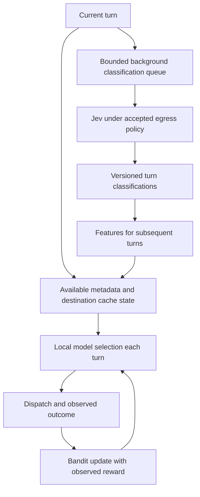
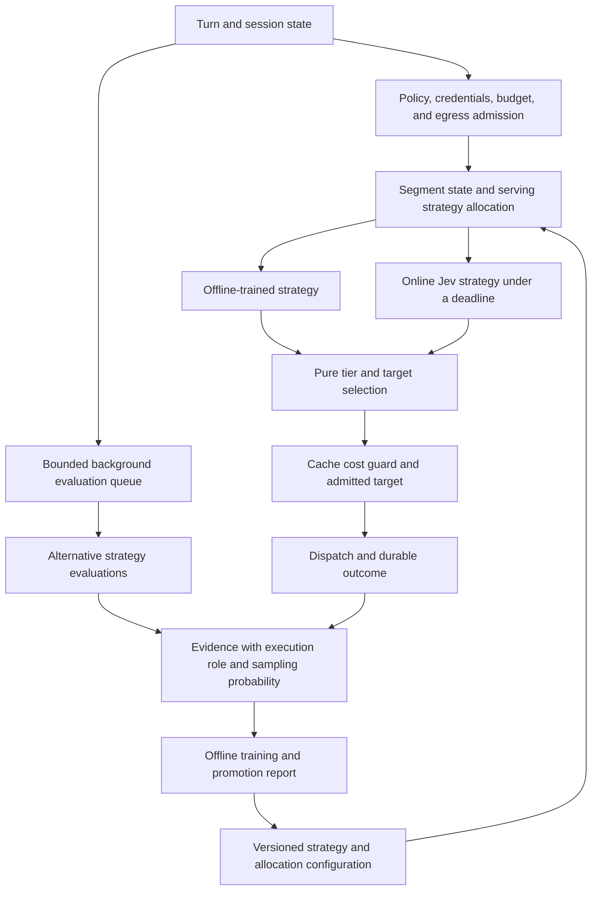

<!--
SPDX-FileCopyrightText: Copyright (c) 2026 NVIDIA CORPORATION & AFFILIATES. All rights reserved.
SPDX-License-Identifier: Apache-2.0
-->

# Routing strategy bandit: serving and background evaluation

> Status: revised direction, 2026-09-21. The owner requires per-turn local routing and asynchronous Jev classification. The following addendum supersedes conflicting proposals in sections 1 through 6. Those sections retain the earlier reasoning and verification evidence.

## Current direction (2026-09-21)

The live selector runs on every turn. Its inputs include the current request, context complexity, prior turn metadata, and cache state at eligible destinations. Jev supplies background classifications that enrich metadata for subsequent turns. It does not choose the current route or add a dependency to the turn path.

The online bandit learns from the classification sequence and observed serving outcomes. Classification is an input feature, not a reward or proof of target quality. The current binary capable-versus-efficient adapter is a transport foundation. Rich turn classification requires a new typed contract.

**Transport checkpoint, 2026-09-21.** Commit `5fba49d` carries a map of choice questions through one prepared TypeSafe request. Each answer is checked against its question's options. Missing or unexpected answer keys and malformed distributions make the answer set unusable. Reported usage remains available for accounting. Empty question maps are refused before credentials, serialization, grants, or HTTP. The server adapter retains its existing tier question. Rich taxonomy, metadata projection, background scheduling, and runtime configuration remain unfinished.

The staged interface retained first-question-only behavior for the initial red run. Six assertions failed, with 43 passing controls. The implementation passed 18 fleet unit tests, 10 HTTP tests, and 21 server adapter tests. The workspace check passed for all targets. Logs: `/tmp/roundhouse-typesafe-multi-red.log` and `/tmp/roundhouse-typesafe-multi-green.log`. The author's pre-commit self-mutations do not satisfy the required independent gate.

All five independent mutations against `5fba49d` failed their intended assertions: omitted questions, incomplete answer validation, unexpected answer keys, empty requests, and discarded usage. Each source restore matched the commit. The restored focused suites passed all 49 tests. Logs: `/tmp/roundhouse-typesafe-multi-refute-M{1,2,3,4,5}.log` and `/tmp/roundhouse-typesafe-multi-refute-restored.log`. No live provider request was made.

The final workspace run at `5fba49d` passed 1801 tests, with 0 failures, 141 existing ignores, and no compiler warnings. It covered 108 test binaries and 7 doc-test suites. Log: `/tmp/roundhouse-typesafe-multi-workspace.log`.

### Completion requirements

The transport and observation checkpoints do not complete the owner's routing vision. Completion requires the following evidence:

| Requirement | Remaining implementation or evidence |
|---|---|
| Per-turn local selection | Current local signals, selector settings, admission results, and the selection cutoff persist in `1c14975`. Candidate records carry cache predictions. Classification references and learned selection remain unfinished. |
| Rich classification | Versioned turn questions and a bounded projection of prior metadata plus the current prompt. Multiple-question transport alone is insufficient. |
| Evaluation accounting | Distinct calls settle once in either completion order. Memory and Redis contracts preserve budgets, hold release, and ordinary serving replay. |
| Background execution | Durable intent before HTTP, bounded queued/running/undelivered work, global expiry, cancellation, safe delivery, and no replayed provider call. |
| Deployment wiring | Explicit opt-in, disabled defaults, required model/rates/limits, separate evaluation accounting, and startup tests. Local-only sessions send no classifier request. |
| Frontier quality feedback | Exact interval coverage across text and tool turns, per-turn instruction versions, snapshot cutoff, unknown outcomes, and once-only learning updates. |
| Online bandit | Local selection uses available classifications and observed outcomes under policy, quality, budget, and latency constraints. The utility tradeoff still needs an owner ruling. |
| Offline learning | Versioned calibration artifacts, reproducible evaluation, and promotion evidence. Background estimates remain distinct from observed serving outcomes. |
| Cache feedback | Prediction error informs destination reuse estimates without inventing cache-pressure causes or counting measured costs twice. C6 return-trip timing remains open. |
| Deployment measurements | C2 live cache evidence, measured local prefill slope, and a production local-fleet attachment. Unit and loopback tests do not prove these. |
| Release verification | Complete documentation, required workspace and backend tests, full PR review cadence, and verified publication. PR #18 remains draft until these requirements are met. |

**Uncommitted runtime checkpoint, 2026-09-22.** The working tree contains rich classification, deployment configuration, background execution, and named classification inputs for later turns. These changes remain an incomplete draft after published commit `1638783`. Independent tests exposed lifetime cancellation and missing reported-model identity. The scoped fixes pass the parent's 15 runtime integration tests and five model-identity tests. Logs: `/tmp/roundhouse-classification-parent-runtime.log` and `/tmp/roundhouse-classification-parent-model.log`. These results do not establish that the runtime satisfies every requirement.

Remaining runtime verification covers imported and rewritten API history, absolute deadlines, and settlement repair. The allocation checkpoint below records the bounded-window and early-admission fixes. Submission after shutdown has a passing control. Passing observations of incorrect behavior are not regression guards. Each demonstrated defect needs a failing assertion for the required behavior before its fix. The runtime still needs complete verification, independent mutation checks, and publication. Local learning, frontier interval feedback, and evaluation metrics remain unfinished.

**Attribution fix, 2026-09-22, uncommitted.** Results must match an outstanding intent's call identity, source response, and source turn before the projection accepts them. An invalid result leaves the valid answer's opportunity intact. Five strengthened tests failed before the fix, with 30 passing controls. The fix passed 454 core-library tests and 26 focused integration tests. Parent verification then passed all 35 session tests and 16 engine classification tests. Logs: `/tmp/roundhouse-classification-attribution-fix.log`, `/tmp/roundhouse-classification-attribution-parent-core.log`, and `/tmp/roundhouse-classification-attribution-parent-engine.log`. This fixes feature attribution; it does not implement settlement repair or complete the runtime gate.

The implementation order is durable per-turn records, bounded background execution, rich classification, feature projection, and online learning. Each decision records the features available at selection time. Replay uses that record, even when later classifications become available. Background work retains source-turn identity, classifier version, and availability order. Retries cannot duplicate outcomes or charges.

The owner also authorizes Roundhouse to inject, modify, or remove cache markers under provider rules. C4 normalizes existing tool markers to the configured target TTL. The earlier cache-marker and segment-cadence questions are settled.

The later 2026-09-21 ruling defines the quality signal: frontier corrections give negative feedback, and a successful review without corrections gives positive feedback. The feedback applies to routing decisions in the reviewed interval since the previous frontier review boundary. Jev classifications supply features, not that reward. The implementation brief must define the bounded classification schema, sampling configuration, learning update, and cost-versus-latency policy. The owner has not authorized a synchronous Jev selector by this clarification.

**Allocation fix, 2026-09-22, uncommitted.** Six assertions failed before the behavioral fixes: window allocation, cutoff search, three unavailable-capture cases, and early admission. Window allocation now measures 204 bytes for both 20 and 2,000 entries. Cutoff search reads 12 keys across 4,096 entries. Saturated and stopped runtimes no longer allocate a prompt capture. Admission now holds capacity across the serving turn, which can reduce classification throughput during long turns.

The worker passed 5 window tests, 6 capture tests, 20 runtime integration tests, 2 engine-history tests, and 12 serialization tests. The engine-history tests were passing correctness controls before the fix. They cover a 400-entry history, failover cutoffs, and serialized replay. Independent parent verification passed all 456 core-library tests and 28 server integration tests. At this checkpoint, the broader classifier suite still failed the two known ledger-deadline assertions. The next checkpoint supersedes that result. Logs: `/tmp/roundhouse-classification-allocation-fix.log` and `/tmp/roundhouse-classification-allocation-parent-core.log`, and `/tmp/roundhouse-classification-allocation-parent-server.log`. Independent mutation checks and publication remain pending.

**Ledger deadline fix, 2026-09-22, uncommitted.** Queue wait, grant, HTTP, and settlement use one absolute execution deadline. Partial-grant cleanup uses the same deadline. Settlement timeout preserves any received answer, reported usage, configured-rate cost, and reported model. The acknowledgement remains unconfirmed. Cancellation does not establish that the backend reversed a ledger operation.

Six assertions failed before the behavioral fix, with 439 passing controls and five existing ignores. The worker then passed 445 server-library tests, 20 classifier integration tests, and 456 core-library tests. Completion and retention tests were passing controls before the fix. Rustdoc checks completed with warnings in other files. Log: `/tmp/roundhouse-classification-deadline-fix.log`. The independent expiry check added three passing cases without a production change. Fresh-client and reused-client calls with expired deadlines produced no observed HTTP request. This is bounded loopback evidence, not proof about socket bytes or every expiry interleaving. Parent verification then passed 448 server-library tests, with five existing ignores. Logs: `/tmp/roundhouse-classification-expiry-check-refinement-run1.log` and `/tmp/roundhouse-classification-deadline-parent-server.log`. Independent mutation checks remain pending. Settlement recovery and evaluation metrics remain unfinished.

**API history coverage checkpoint, 2026-09-22.** Eight passing cases cover Messages and Responses, imported and rewritten histories, and user-text and tool-result endings. Each case inspects the complete outbound classifier body for excluded history and system instructions. User-text cases retain the current prompt. Tool-result cases retain origin metadata without raw tool output. Rewrite cases inspect both stored generations. These tests add coverage against unchanged production code; they do not establish a new defect fix.

The parent independently ran all eight cases: eight passed, with no failures or ignores. A baseline file comparison found only the assigned test file changed. Log: `/tmp/roundhouse-classification-api-parent.log`. Settlement recovery, evaluation metrics, full workspace validation, and mutation checks remain unfinished.

**Settlement recovery draft, 2026-09-22, uncommitted and not accepted.** The draft retries recorded settlements on background workers and appends a separate repair acknowledgement through the session writer. It retains the original call identity and recorded cost. Missing usage remains unknown. The initial recovery fixture required two corrections before its failures reached the intended assertions. The corrected run failed eight assertions with four passing controls; the implementation then passed all twelve tests. One payer case deliberately violates the supported session identity contract and does not establish a supported production defect.

The worker also passed 457 core-library tests, seven classification serialization tests, and 448 server-library tests with five existing ignores. The updated classifier integration suite passed all twenty tests. These results do not establish bounded acknowledgement retention or duplicate-attempt suppression. Independent tests for those properties, failed acknowledgement appends, and large outage backlogs remain in progress. Log: `/tmp/roundhouse-classification-repair.log`.

Clippy remains failing on the current draft. The new repair event has not passed a live Redis round trip. A proposed budget-window drift test passed against the recorded-window implementation unchanged; it does not justify a policy change. Log: `/tmp/roundhouse-classification-window-change-parent.log`. Full runtime validation, mutation checks, evaluation metrics, and publication remain pending.

**Independent recovery findings, 2026-09-22.** Two tests exposed defects in the draft. A parked acknowledgement released its capacity permit before delivery. Overlapping turns started two concurrent repairs for the same call. The parent reproduced both failures with exit code 101. Logs: `/tmp/roundhouse-classification-repair-parent-retention.log` and `/tmp/roundhouse-classification-repair-parent-overlap.log`. A separate fix stage reproduced both failures before changes. Log: `/tmp/roundhouse-classification-repair-fix.log`.

The fix must retain capacity through acknowledgement delivery and suppress duplicate repairs by session and original call identity. Further tests must cover expiry, cancellation, failed appends, and supported nondefault payer recovery. The passing backlog test does not establish bounded work under every completion schedule. The failed-append test also needs an observed refusal and exact availability-sequence assertions. These gaps remain open until the fix and independent checks pass.

**Recovery fix checkpoint, 2026-09-22, not accepted.** The worker passed 27 runtime tests after the capacity and identity changes. These include delivery-handle expiry, idle-session retention, cancellation, shutdown, retry after ledger failure, and duplicate suppression with independent-call progress. The retained-capacity test drops its inspection handle before it checks release after acknowledgement. A separate test covers a handle that survives map expiry. Engine recovery tests, bounded scheduling evidence, and independent checks remain pending. Log: `/tmp/roundhouse-classification-repair-fix.log`.

The parent stopped the worker after it started mutation checks that the stage prohibited before a commit. The parent restored only the three injected edits and checked the file against the worker's pre-mutation backup. The restored source passed 27 runtime tests and 20 recovery integration tests in independent runs, both with exit code zero. Logs: `/tmp/roundhouse-classification-repair-fix-parent-runtime.log` and `/tmp/roundhouse-classification-repair-fix-parent-recovery.log`. The new backlog counter measures delivery handles, not scheduling attempts during fast ledger failures. That scheduling bound remains unverified. The stage remains unaccepted and uncommitted.

**Independent ownership checks, 2026-09-22.** A separate test stage passed 29 runtime tests and 21 recovery integration tests, with no failures or ignores. New tests cover acknowledgement with a live delivery handle and the same call identity in different sessions. The handle retains capacity and the claim until its final release. Different sessions reach the ledger independently, while a duplicate within one session remains suppressed. The parent compared file hashes against the stage baseline and found only the assigned test files changed, apart from its own documented rustdoc correction.

The fast-failure test observed three ledger attempts for both 20-entry and 2000-entry backlogs under capacity three. This is an empirical control, not proof of a fixed scheduling limit. It waits for an unchanged counter sample rather than joining every scheduled worker. The engine loop still relies on capacity exhaustion, so a separate test-first stage will enforce a fixed candidate batch. Logs and report: `/tmp/roundhouse-repair-bounds-independent.log` and `/tmp/roundhouse-repair-bounds-independent-report.md`. No new runtime behavior or mutation check came from this independent stage.

**Fixed repair batch, 2026-09-22, uncommitted.** Candidate selection now returns a borrowed prefix capped at `max_in_flight`. The engine schedules only that prefix and retains its per-candidate capacity check. Selection does not clone or scan the backlog. The test-first extraction exposed 20 candidates against a required limit of three, with 31 passing runtime controls. All 21 recovery tests passed before the bound, so this evidence establishes the candidate-limit requirement rather than a reproduced scheduling overrun. The bounded implementation passed 32 runtime tests, 21 recovery tests, and 463 server-library tests with five existing ignores.

The parent checked the production diff, shortened the new comments, and independently passed the 32 runtime and 21 recovery tests. Server formatting and whitespace checks passed. Logs: `/tmp/roundhouse-repair-batch.log`, `/tmp/roundhouse-repair-batch-parent-runtime.log`, and `/tmp/roundhouse-repair-batch-parent-recovery.log`. Evaluation-spend reporting, full runtime gates, live Redis event coverage, mutation checks after a commit, and publication remain pending.

**Evaluation reporting stage, 2026-09-22, in progress.** The initial serialized-snapshot suite failed 17 assertions with one passing control because evaluation reporting fields were absent. This establishes the missing reporting feature, not 17 separate accounting defects. The stage covers recorded classifier cost, unknown usage, pending intents, refusals, settlement acknowledgements, replay, identity attribution, and existing metrics scopes. Log: `/tmp/roundhouse-evaluation-metrics.log`. Implementation and API/dashboard checks remain in progress. A combined cost view must also disclose incomplete serving measurements or pricing. Classifier completeness alone cannot establish complete serving-plus-evaluation cost.

**Evaluation reporting follow-up, 2026-09-22.** The local-cost disclosure tests failed twice before implementation, with 20 controls passing. The final snapshot run passed 23 tests. Serving gaps now include locally served calls, whose GPU cost remains outside the combined total. The `covers` field states the included cost categories. Forwarded subscription seats retain separate token accounting and contribute no dollar amount. Independent tests are in progress for configured zero prices, real classifier delivery through the engine and API, replay, and historical principal attribution. These checks must finish before acceptance. The parent corrected dashboard claims about unknown billing and event-delivery causes. JavaScript syntax and whitespace checks passed; browser rendering remains unverified.

**Dashboard execution check, 2026-09-22.** The parent executed the dashboard script against empty and incomplete evaluation snapshots in a DOM stub. Both cases passed. Assertions checked model-name escaping, missing model identity, cost exclusions, and the corrected alerts. Script: `/tmp/roundhouse-evaluation-dashboard-smoke.cjs`. This check uses synthetic snapshots and does not verify browser layout or the API-to-browser path.

**Independent reporting checks, 2026-09-22.** Two tests reproduced incorrect missing-price warnings for an explicit zero rate and a configured zero cache-read rate. The initial run failed both assertions, with 23 controls passing. A later control confirmed that unattributed session costs remain outside principal and project totals. The pricing regressions remain ignored for the pending fix and enforce nothing while ignored. Log: `/tmp/roundhouse-evaluation-metrics-independent.log`.

The integration checks now exercise real classifier HTTP, durable result delivery, the engine recorder, and the authenticated metrics API. A successor with classification enabled recovers the recorded cost once. A local-only turn buys no new call, and an eligible-turn control proves the successor can call the classifier. Serving calls, output tokens, and dollars remain separate from evaluation accounting in these fixtures. The parent independently passed all 22 runtime integration tests with no failures or ignores. Log: `/tmp/roundhouse-evaluation-integration-refinement-parent.log`. These checks use loopback HTTP and an in-memory store, not live TypeSafe or Redis. Pricing correction, full workspace gates, mutation checks, and publication remain pending.

**Pricing correction and Redis checks, 2026-09-22.** The fix removes both pricing-test ignores and derives `priced_by_catalog` from the catalog lookup. Missing-price counts and dashboard warnings use that fact rather than a zero-dollar total. The parent independently passed all 26 snapshot tests, with no failures or ignores. Log: `/tmp/roundhouse-evaluation-pricing-fix-parent.log`.

The disposable Redis instance passed fenced append/replay and paginated readback of every event variant, including classifier intent, result, and settlement repair. All three evaluation-ledger backend tests passed, including cross-node sharing and isolation from serving accounts. Logs: `/tmp/roundhouse-runtime-redis-contract.log`, `/tmp/roundhouse-runtime-redis-read-path.log`, and `/tmp/roundhouse-runtime-redis-ledger-boot.log`. These tests establish store round trips and backend wiring, not the full classifier recovery path against Redis. The full workspace suite is running. Strict lint checks, post-commit mutation checks, and publication remain pending.

**Workspace gate failure, 2026-09-22.** The full run exited 101 at `key_builder_convention::every_key_function_calls_the_shared_builder`. Four spend-key functions use an intermediate helper, violating the test's direct-call convention. The helper still calls the shared builder; this failure does not establish incorrect key bytes. A focused correction is in progress. Log: `/tmp/roundhouse-classification-runtime-workspace.log`.

Strict workspace Clippy also exited 101. It reports a 688-byte event variant, two test initializer warnings, and one needless borrow. The representation correction must measure size and preserve serialized events and replay behavior. Log: `/tmp/roundhouse-classification-runtime-clippy.log`. Neither full-workspace validation nor strict lint is complete.

**Gate corrections, 2026-09-22, in progress.** The Redis key functions now call the shared builder directly and share only their key parts. The parent independently passed both convention tests. The worker also passed 12 spend/key unit tests and three ledger-backend tests. Logs: `/tmp/roundhouse-redis-key-convention-fix.log` and `/tmp/roundhouse-redis-key-convention-parent.log`.

The lint stage changed `DecisionRecord.selection` to an optional boxed snapshot. Size probes measured `SessionEventKind` at 688 bytes before and 320 after, and `SessionEvent` at 728 bytes before and 360 after. The worker passed selection serialization, failover/replay, all 459 core-library tests, and 35 relay tests. The revised size guard inspects the actual deserialized selection field. Its assertions measure width, not allocator calls or runtime speed. Strict Clippy still has additional warnings to resolve. Log: `/tmp/roundhouse-classification-lint-fix.log`.

**Strict lint acceptance, 2026-09-22, uncommitted.** The final test-only corrections preserve the provider wire tags, request text, and startup polling behavior. Nine targeted runs passed, including 70 Messages API tests, three binary boot tests, and 44 directory tests. Shared fixture tests run in multiple binaries, so these counts are not disjoint. The parent independently passed strict workspace Clippy with all targets and warnings denied. Log: `/tmp/roundhouse-runtime-parent-final-clippy.log`. The parent full workspace run exited zero: 2109 passed, 0 failed, and 147 ignored, across 123 test binaries and seven doc-test suites. No compiler warnings were emitted. Log: `/tmp/roundhouse-runtime-parent-final-workspace.log`. Post-commit mutation checks, review, and publication remain pending.

**Runtime commit, 2026-09-22.** Commit `438fe2f` records the classifier runtime and evaluation reporting draft described in the preceding checkpoints. The restored full suite passed 2109 tests, with 147 ignored and no failures or compiler warnings. Formatting and strict workspace Clippy passed. Real Redis fenced append/replay and paginated readback passed again after the event representation change. Logs: `/tmp/roundhouse-runtime-final-redis-contract.log` and `/tmp/roundhouse-runtime-final-redis-read.log`. An independent mutation pass is in progress for egress, selection cutoffs, replay, and accounting attribution. Review and publication remain pending. This commit does not implement frontier review intervals or learned routing.

**Attribution mutation acceptance, 2026-09-22.** Independent checks against `438fe2f` caught local-only admission, disabled runtime composition, duplicate measured-call booking, and acceptance of mismatched result identity. Two initial mutations had narrower evidence than their labels claimed. The boundary mutation removed valid data. The replay mutation prevented the first call. Neither established the intended leakage or duplicate-dispatch regression.

Follow-up checks caught changed snapshot cutoffs across failover and a second classification intent on retry. The retry assertion failed before its HTTP-count assertion, so the failure proves duplicate intent creation. A direct availability-filter mutation then exposed one later result where the earlier cutoff permitted zero. A separate delayed-delivery fixture exposed two results where only one was available. Both guards passed after restoration. The parent inspected the diffs and failures, then checked a clean worktree after the worker exited. No code or test changes remained. Log and exact diffs: `/tmp/roundhouse-runtime-attribution-refute.log` and `/tmp/roundhouse-runtime-attribution-mutation-{1-6,A,B,C}.diff`.

Lifecycle mutation checks are now in progress for deadlines, retained capacity, repair claims, candidate limits, acknowledgement delivery, and historical settlement identity. These gates, broader review, and publication remain outstanding. Attribution checks do not establish live provider behavior or complete the learning system.

### Frontier review feedback (2026-09-21)

Each review records its prompt snapshot and covered decision interval. The result labels that interval once. A late result cannot label newer decisions or change their recorded input features. Failed, skipped, malformed, or insufficient-context reviews remain unknown. Missing feedback is not a no-correction verdict.

The tests-first contract includes positive and negative interval labels, duplicate review delivery, replay, late results, missing reviews, and incomplete coverage. The fixture must include several routed turns and a later turn outside the review snapshot. A negative review labels the covered choices together. It does not invent independent evidence that every selected model caused a correction.

The current judge action is not the reward. `map` can return `Continue` for an off-track verdict without a located divergence. Shadow execution can suppress corrections too. The integration must use an explicit frontier review result, rather than infer success from action delivery. Cache-aware review also remains to implement: the existing separate judge key does not supply Messages cache markers or interval coverage.

**Cache-aware judge checkpoint, 2026-09-21.** Commit `e7bc859` supersedes the missing-marker statement. The judge prepares one prompt for token estimation and transport, marks its system prefix on Messages, and requests the target's configured TTL. The judge retains its separate cache key and does not use the conversation's cache ledger or prior breakpoint. The existing reservation already included the configured cold-write rate. Four assertions failed before implementation, with 11 passing controls. The write-premium reservation test was a passing control, not a new pricing fix.

All four independent mutations failed their intended assertions: missing boundaries, missing TTL, separator removal during token counting, and omitted write premium. Source restoration matched the commit. The restored focused suites passed 15 judge tests and 11 Messages integration tests. The full workspace run passed 1793 tests, with 0 failures, 141 existing ignores, and no compiler warnings. It covered 108 test binaries and 7 doc-test suites. Logs: `/tmp/roundhouse-judge-cache-red.log`, `/tmp/roundhouse-judge-cache-refute-M{1,2,3,4}.log`, and `/tmp/roundhouse-judge-cache-workspace.log`. No live provider call was made. A system prefix can be too short for provider caching. Interval coverage and online learning remain unfinished.

### Review integration brief (2026-09-21)

The integration extends the existing validator and judge. It retains their destination, cadence, egress checks, reservation, and settlement paths. A separate paid review service is unnecessary. Cache-aware prompts must reserve possible Messages cache-write cost before execution. The tokenizer and transport must use the same prepared prompt, including separators.

Each review identifies decisions by session ID and the sequence number of their `Routed` event. A failover has multiple decision identities within one turn. The prompt must represent text-only turns as well as tool activity. Counting tool exchanges cannot establish complete turn coverage. Target names, prices, and routing rationales remain outside the judge prompt.

Turn spans use offsets relative to the history region, because replacement of leading configuration items changes absolute item indices. The captured review includes the input associated with each covered decision, even if that input precedes the prior review boundary. The current undecided turn can supply context, including results of earlier tool calls, without receiving a routing label. Advancing a boundary must retain an open turn's input for its later decision.

The review also needs the configuration and objective that applied to each turn. Current instructions cannot silently replace the instructions under which an earlier response was produced. The implementation must preserve those versions or mark the affected coverage incomplete. Tests must change configuration and objective between turns, rather than only check stable history indices.

The review captures its upper sequence boundary before the call. Result delivery cannot extend that boundary. Replay must reject duplicate or overlapping updates, and a later interval cannot skip an unexplained gap. Historical validation events without coverage supply no quality label. Missing context, omitted turns, truncated content, and unrepresentable content must remain explicit. No such review supplies a positive interval label.

An oversized interval needs an explicit recovery policy before the boundary implementation. Retaining the interval preserves the possibility of a larger review, but can prevent further learning under a fixed budget. Recording the interval as unknown permits a new window after a frontier checkpoint, but discards that interval from online quality updates. Silently dropping the oldest turns and labeling the remaining suffix is not an acceptable substitute. This choice remains open.

### Cache prediction feedback (2026-09-21)

The owner identifies lower-than-expected cache reuse as an efficiency signal, especially for destinations without retention guarantees. The observation is a prediction error. It does not establish eviction or cache pressure as its cause. Prefix changes, cache keys, elapsed time, and provider routing can also affect reuse.

The initial observation compares the routed prediction with reported usage for that dispatch. Predicted reuse uses the router's token basis. Observed reuse uses the provider's input-token basis. Their ratios and sample provenance must remain explicit. Missing cache reports and estimated usage must not become measured misses. Cache cost and latency remain separate measurements, so learning must not count a cache miss as an additional independent cost penalty.

The serving bandit still needs durable per-turn features, review-window attribution, and a learning update. Cache observations are one input to that work, not a substitute for it.

**Observation checkpoint, 2026-09-21.** Commit `330cacb` adds cache-reuse observations to the metrics JSON. `Usage.cache_read_source` distinguishes provider reports, locally derived counts, and counts without provenance. Explicit provider zeros supply samples. Missing reports and historical records without provenance do not. The metrics pair the final routed prediction with terminal usage and report both token bases, coverage counters, and mean signed error. Existing numeric accounting remains unchanged.

Two decoder assertions failed before the provenance change. Independent mutations caught missing-data relabeling, bypassed measurement checks, and an incorrect provenance merge. A local-path mutation survived the original integration tests. The added assertion exposed an empty fixture: the purported local test had no attached fleet. Commit `a4766a1` attaches the fleet and requires actual local observations. It also fixes a separately reproduced aggregation defect: zero input tokens did not imply an empty accumulator. Only a default accumulator can now adopt provenance.

Post-commit mutations reproduced both defects and failed their intended assertions. All source was restored. The final workspace run at `a4766a1` passed 1784 tests, with 0 failures, 141 existing ignores, and no compiler warnings. Logs: `/tmp/roundhouse-cachepred-provenance-red-decoders.log`, `/tmp/roundhouse-cachepred-refute-{M1,M2,M3,M4,gap}.log`, `/tmp/roundhouse-cachepred-postfix-{M3,aggregate}.log`, and `/tmp/roundhouse-cachepred-final-workspace.log`. No live provider measurement or routing update is claimed.

### Integration constraints from the current source

**Selection snapshot brief, 2026-09-22.** The next implementation records the current selector evidence in each existing `Routed` event. One optional snapshot groups the exact local signals, extractor revision, control-call dialect, turn index, and pre-selection log cutoff. It also records the original choice, ordered fallback plan, selection source, actual selector branch/configuration, and the admitted target pool. Existing candidate records already carry quotes and cache predictions. Historical records remain unknown instead of receiving fabricated empty features.

Admission evidence comes from the policy's existing `Admitted` value. The engine must not repeat admission with guessed load limits. Affinity, active audit, and stage branches record their actual settings. Delegation preserves the branch that ran. Hand-built custom decisions can explicitly leave evidence unknown. Full typed settings avoid an unresolvable configuration digest. This records admission's result, not every upstream credential, cadence, or budget input.

The engine captures the snapshot once and retains it across failover dispatches. Each dispatch still records its own target, rate card, and failed-attempt history. Tests must exercise nonempty signals, changed configuration on a later turn, store replay, admission filtering, overflow, and several dispatches within one turn. Classification references will be added with their durable event producer. Empty placeholder references do not establish background integration. This brief does not change routing behavior or implement the learning policy.

**Selection snapshot implementation, 2026-09-22.** Commit `1c14975` implements this brief on the existing engine path. The initial runs failed 12 policy-evidence tests and five engine tests, while six serialization controls passed. The implemented snapshot passes all 24 focused tests, including an added unread-recipe control. Additional assertions compare full worker identities and project both a complete log and an earlier prefix through `SessionState::project`. Those assertions are passing controls, not production defect fixes. Logs: `/tmp/roundhouse-routing-snapshot-red.log` and `/tmp/roundhouse-routing-snapshot-green.log`.

The implementation also passed the affected core, server, relay, and MCP controls, formatting, and the workspace check for all targets. All nine independent post-commit mutations failed runtime assertions. They covered missing admission evidence, wrong worker identity, defaulted features, changed failover cutoffs and targets, changed original picks, serialization loss, replay loss, and incorrect selector settings. Each restore matched `1c14975`, and all 24 focused tests passed afterward. Logs: `/tmp/roundhouse-routing-snapshot-refute-M{1,2,3,4,5,6,7,8,9}.log` and `/tmp/roundhouse-routing-snapshot-refute-restored.log`. The replay test uses serialized events and a read-only store double. It does not claim a new live Redis run. No live classifier or provider request was made.

The full workspace run at `1c14975` passed 1831 tests, with 0 failures, 145 existing ignores, and no compiler warnings. It covered 111 test binaries and 7 doc-test suites. Log: `/tmp/roundhouse-routing-snapshot-workspace.log`. This checkpoint records current local selection evidence. Rich classification, durable background execution, frontier interval coverage, and learning remain unfinished.

**Background lifecycle review, 2026-09-21.** The bounded executor needs one admission permit across queued, running, and completed-but-undelivered states. A separate concurrency limit bounds HTTP calls. Completion must not release the admission permit before delivery or expiry. Global expiry must reclaim results from idle sessions. Completed task handles also need collection, so a bounded result map cannot hide an unbounded `JoinSet`.

The intent records an absolute expiry and the model, schema, projection, and configuration versions. Queue wait and HTTP execution must obey that expiry. Replay never dispatches an intent again. An expired intent without a durable result remains unknown, including its cost. A failed append must not discard a pending result before a later drain can retry its delivery. Delivery retries do not repeat HTTP.

**Background delivery brief, 2026-09-22.** A nonblocking capacity check precedes payload construction and durable intent. The engine's current session writer records the intent before a worker can send HTTP. The worker returns bounded structured results and never acquires a session lease. A later engine turn drains results through its existing writer. It acknowledges delivery only after the append succeeds. Failed appends retain the result for another drain, without another provider call.

The admission permit covers the payload through queueing, execution, and delivery. Any delivery handle that retains result bytes also retains that permit. Expiry cannot release capacity while another handle still owns the data. Global expiry reclaims idle-session results, and the supervisor collects completed task handles. Tests must exercise failed append, idle-session expiry, cancellation, executor shutdown, and replay between intent and result. A crash after the intent can lose the classification. Replay records that uncertainty instead of purchasing another answer.

**Open learning-scope question, 2026-09-22.** The owner was asked whether learned behavior stays within each project or is shared across projects. Per-project learning was the recommendation, not an accepted decision. Snapshot and background-execution work can proceed independently. Cross-project learning must not be introduced without that ruling.

The review identified a settlement-order hypothesis that needs a failing test before runtime wiring. `SpendLedger` uses a per-project, per-session sequence watermark. Out-of-order classification completions can therefore lose an earlier settlement, even with a separate evaluation ledger. Separating evaluation from serving accounting is necessary but does not by itself solve ordering between classifications. A result must distinguish observed provider usage from successful ledger settlement. No implementation may treat a rejected settlement as committed spend.

**Settlement regression, 2026-09-21.** The hypothesis is confirmed through `TypeSafeShadow::classify`, loopback HTTP, and a separate real `MemorySpendLedger`. Two calls have the same source session and payer, distinct holds, and intent sequences 10 and 20. Both report usage. In-order completion commits their combined $0.00070 and releases both holds. Reversed completion commits only the newer call's $0.00042. The expected-sum assertion fails, while the in-order control passes. The reversed-order hold assertion follows that failure and therefore does not yet prove a hold leak. Log: `/tmp/roundhouse-classification-settlement-order-red.log`.

This test models completion order with sequential calls carrying reversed intent sequences. It does not test concurrent scheduling. The fix must preserve both charges exactly once regardless of completion order, preserve project and member ceilings, and retain serving-session replay behavior. Warning about a rejected settlement does not correct the missing spend. Runtime wiring remains gated on this regression.

**Settlement identity ruling, 2026-09-21.** Evaluation calls need an explicit call identity independent of the serving session's ordered watermark. An elapsed hold TTL cannot make a completed call chargeable again. The proposed time-limited deduplication was rejected because it permits duplicate charges after expiry. Completed-call identities must survive delayed replay and budget-window resets. The storage cost is one retained identity per completed evaluation call until a durable compaction protocol can prove deletion safe. Runtime concurrency bounds do not bound this history. Membership checks must not scan the accumulated identities.

**Settlement implementation, 2026-09-22.** Commit `42c9991` adds `SettlementKey::SessionWatermark`, which retains serving replay behavior. `OncePerCall` deduplicates evaluation settlements by project and call identity, without expiry. Memory and Redis retain those identities across monthly resets. The TypeSafe adapter and frontier judge use per-call settlement. Their unused settlement-sequence fields are removed. Each external attempt needs a fresh call identity. Replay must reuse the original identity.

The adapter regression now commits both calls' combined $0.00070 and releases both holds in either order. The focused runs passed 19 core spend tests, 23 TypeSafe tests, 21 judge/spend tests, 14 budget-routing tests, and 76 validation/interjection tests. The real Redis spend suite passed all 21 tests. Redis unit tests passed 31 tests, with two unrelated integration tests ignored. Logs: `/tmp/roundhouse-evaluation-settlement-green.log` and `/tmp/roundhouse-evaluation-settlement-redis.log`. No provider request was made.

All five independent post-commit mutations failed runtime assertions: lost Memory deduplication, cleared Memory identities at reset, a session-watermark adapter, lost Redis deduplication, and cleared Redis identities at reset. Each inverse edit restored source identical to `42c9991`. The restored suites passed 19 core spend tests, 23 TypeSafe tests, and all 21 real Redis spend tests. The adapter mutation used a fixed sequence and failed both ordering cases. It verifies the key choice without reproducing every detail of the original defect. Redis reset tests advance ledger time, not Redis wall-clock expiry. Logs: `/tmp/roundhouse-settlement-refute-M{1,2,3,4,5}.log` and `/tmp/roundhouse-settlement-refute-restored.log`. The full workspace run at `42c9991` passed 1807 tests, with 0 failures, 145 ignores, and no compiler warnings. It covered 108 test binaries and 7 doc-test suites. Four new Redis contract instances are ignored in the workspace run and passed in the separate real Redis run. Log: `/tmp/roundhouse-settlement-workspace.log`.

Exact feature identities and extractor versions remain necessary for reproducibility. The review's claim that a later append can acquire a sequence below an earlier cutoff is rejected: log sequence numbers are monotonic. The real concern is a projection that indexes results by source intent rather than settlement availability, or an extractor that changes its interpretation. Tests must exercise those mechanisms.

The owner's later direction permits bounded prior-turn metadata and classifications together with the current prompt. This supersedes the earlier judge-brief-only projection proposal while retaining explicit opt-in, disabled defaults, and no local-only egress. A second approval for that same direction is unnecessary. The implementation must specify and test the exact content and byte limits before using this projection.

Rich classification does not require every TypeSafe primitive. Multiple choice questions can represent intent, reasoning complexity, and context dependence. The initial transport change therefore supports a map of choice questions with a complete validated answer set. Partial or malformed sets retain usage but supply no classification. Boolean and score primitives remain outside scope until a concrete feature needs them. Taxonomy and prompt versions must be explicit, and missing context must remain distinguishable from low complexity.

`Session::open_observed` acquires the session lease. A background classifier must not open another writer and fence an active turn. `SessionState::project` supports reads without a lease. Result delivery must leave session writes with the engine and retain source-turn identity across delays.

`SessionEvent::response_id` excludes internal side-call events from the response stream. Classification records need the same separation. `DecisionRecord` already persists candidates, the chosen target, policy, and pricing. Its classification inputs must name the exact available records, rather than consult mutable history during replay.

`ToolSignals` supplies local activity counts, error severity, and a heuristic `tests_passed` field. These are features. The owner now selects the frontier review result as the quality signal. The current `Verdict` needs explicit interval coverage before it can supply that signal. The first observation tests must distinguish missing classifications, late classifications, duplicate results, and unsupported quality outcomes.

## 1. Outcome and scope

Roundhouse selects a routing strategy under the session policy. Strategies include rules calibrated offline and an online Jev classifier. Background arms evaluate alternatives without changing the live response. Their evidence informs later strategy versions and promotion decisions.

The objective remains function, cost, and time to solution. A cheaper route alone is not a successful outcome. Classifier confidence is not a measure of downstream answer quality.

This changes the original target-arm design in `synergies/typesafe-selector-and-cache-affinity.md`, section 3. The serving bandit selects a strategy. Existing routing code maps its tier signal to an admitted target, with the cache cost guard intact.

## 2. Two execution roles

| Role | Immediate effect | Evidence | Resource limit |
|---|---|---|---|
| Serving strategy | Supplies a tier signal for live routing | Observed outcome of the route actually served | Turn deadline and project grant |
| Background evaluation | Records an alternative recommendation or evaluates a saved case | Agreement, estimated utility, or a separately measured evaluation outcome | Separate evaluation budget and worker concurrency |

These roles share versioned strategy identities. They do not share an undifferentiated reward counter. An unserved recommendation has no observed live outcome.

The serving probability distribution covers serving strategies only. Background sampling has its own probability and budget. A background-only arm cannot consume probability mass without producing a live routing decision.

The first background scheduler can use configured sampling shares. Learning which evaluation to purchase needs an explicit value-of-information objective. That is a separate decision from learning which strategy serves traffic.

## 3. Proposed contracts

### Strategy result

A strategy returns probabilities for `capable` and `efficient`, confidence, and its version. It does not return an unrestricted model identifier. The engine validates finite probabilities, their range and sum, and the expected answer keys before use.

The first serving strategies are the existing rule cascade and a Jev tier classifier. Offline calibration produces a versioned artifact for a serving strategy. Training does not run on the turn path.

The Jev request uses the judge brief format. It contains no prices, candidate list, or target names. A timeout, malformed response, unavailable credential, or exhausted side-call budget leaves the default strategy in control. The decision records the selected strategy, the effective strategy, and the fallback reason separately.

The [TypeSafe API reference](https://docs.typesafe.ai/api), checked on 2026-09-19, defines typed questions, keyed answers, usage, and choice probabilities. The [confidence-routing guide](https://docs.typesafe.ai/patterns/confidence-routing) describes confidence gates and fallback. These support a signal adapter, not a downstream quality claim. The deployment must configure a pinned model version and its rate card.

### Admission and cache boundaries

Arm eligibility precedes allocation. An arm cannot relax target admission, quality floors, budget, tool capability, or the session egress policy. A session restricted to local targets excludes a hosted classifier if T6 adopts the proposed local-only restriction.

Proposed cadence: allocate a serving strategy at a cache-cold segment boundary. Continue to honor severity escalation and mandatory failover within the segment. The segment identity and boundary reason must survive replay. A target switch alone must not silently start a second experiment.

The segment definition needs explicit cases for session start, fork, cache expiry, target failure, and local residency loss. A local target has observed residency rather than an invented Anthropic TTL. C4 and C6 provide the frontier cache inputs.

### Durable attribution

Each allocation needs a segment identifier, strategy version, configuration version, eligible strategies, selected strategy, and selection probability. The durable record also identifies the effective strategy after fallback and the dispatched target after the cache guard.

Use a stable hash and deployment salt to sample a configured distribution. Record the result before dispatch. Replay consumes that record and never repeats a hosted classifier call. Duplicate delivery must not allocate or charge twice.

Background records identify the source session sequence, strategy version, execution role, sampling probability, and completion status. They reference an immutable input snapshot or bounded projection. They do not read a later session state and label it as the earlier case.

Cancellation, failure, and missing observations remain explicit. Missing first-token time is not zero latency. A failed classification still contributes its observed cost and delay to the selected strategy's operational record.

### Reward and promotion

Keep function, cost, and time as separate observations before any scalar utility calculation. Cost includes serving and classifier charges. Background spend is visible separately and included in the total experiment budget.

Observed TTFT and end-to-end completion time answer different questions. R21 in `PLAN-frontier-selection.md` measures first output against turn start. A dispatch-to-first-output interval can supplement it but cannot replace classifier delay in the experiment's latency measure.

Proposed promotion order: enforce a quality constraint, then compare cost and latency within that constraint. The owner must select the quality signal, acceptable regression bound, and cost-versus-latency tradeoff before live learning changes allocation shares. No default utility weights are justified by the current evidence.

Background agreement with the live strategy is a diagnostic. It is not evidence that the alternative target would produce the same outcome. Controlled evaluation results retain their source. Offline policy estimates require logged probabilities and adequate support for the alternative being estimated.

## 4. Source seams inspected

| Existing seam | Use in this design |
|---|---|
| `crates/roundhouse-core/src/routing/stage.rs`, `pick_tier` | Default tier signal and deterministic precedence |
| `crates/roundhouse-core/src/routing/mod.rs`, `RoutingContext::admissible` | Target admission remains authoritative |
| `crates/roundhouse-core/src/validate/brief.rs` | Bounded task projection without routing prices or target names |
| `crates/roundhouse-server/src/judge.rs`, `JudgeConfig` | Side-call deadline and budget precedent |
| `crates/roundhouse-core/src/validate/arm.rs`, `Arm::for_session` | Stable hash and persisted assignment precedent |
| `crates/roundhouse-core/src/event.rs`, `Routed`, `OutputTextDelta`, `ResponseCompleted`, `ValidationDecided` | Inputs for decision and outcome attribution |

The existing validation `Arm` describes intervention experiments. Reusing it for routing strategies would conflate two independent assignments. The implementation needs distinct routing identities, not renamed validation arms.

## 5. Delivery and tests first

Each implementation milestone needs a settled brief, failing tests before its fix, independent mutation checks, and a separate reviewable commit.

| Milestone | Behavior | Required evidence |
|---|---|---|
| B1: observations | First-output checkpoint in `765daf2`, cleanup guard in `1142348`. Terminal timing is committed at `88562f7`. Strategy outcome attribution remains. | Fourteen terminal-timing mutations were caught. The restored focused suites pass 72 core metrics tests and 6 server metrics tests. |
| B2: strategy records | Record eligible serving strategies, versioned allocation, and fallback | Fixed hash vectors. Replay survives configuration changes. Background-only arms cannot enter serving allocation. |
| B3: background evaluation | Execute sampled alternatives with bounded resources and no effect on routing | A stalled worker cannot delay a turn. Cancellation releases capacity. Retry cannot duplicate charges or outcomes. |
| B4: Jev shadow adapter | Standalone transport and budgeted server boundary committed at `51b0fb2` under T6. B2/B3 wiring remains. | All 41 adapter tests pass. Twelve initial mutations and the later scoped review checks were caught. No live quality or latency evidence. |
| B5: offline calibration | Produce a versioned artifact and report from attributable observations | Incomplete cases and unsupported policy estimates remain explicit. Serving and background evidence cannot silently merge. |
| B6: serving bandit | Allocate eligible strategies using approved quality and utility rules | Shadow promotion evidence, deterministic replay, enforced budgets, and cache-boundary tests. |

B4 can proceed under the accepted T6 policy. B6 requires the reward and promotion decisions. A passing unit suite alone does not satisfy the promotion gate.

### B1 first step: observed first-output latency

R21 authorizes a per-target observation from `TurnStarted.at_ms` to the first nonempty `OutputTextDelta.at_ms`. This includes routing and classifier delay. It is distinct from the predicted TTFT in a candidate quote. The fold must produce the same observation during replay.

The accumulator keeps elapsed milliseconds, sample count, and rejected timestamp count. The snapshot exposes a mean with its sample count and event basis. Missing start or output produces no latency value. A backward timestamp contributes no sample and increments the rejection count. Scope totals add elapsed time and counts before computing a mean.

A response that emits text and later fails still has an observed first-output latency. Book that sample on the actual routed target, independently of token billing. Superseded attempts contribute no sample. Terminal and supersession paths remove pending timing state. Duplicate events cannot add a sample twice.

This step does not define a quality reward, promotion threshold, or experiment allocation. It supplies one observation needed by those later decisions.

Checkpoint `765daf2` implements this interval in the metrics fold and publishes it in per-model JSON rows. The basis is `turn_start_to_first_output`. It excludes work before the start event and delivery after the delta append. The HTML dashboard does not yet display the field.

Tests failed before the implementation: 10 assertions failed while absence controls passed. Two additional regressions exposed an empty model row for a silent failure and cross-session supersession when turn IDs match. Both are fixed. Supersession now uses `(SessionId, TurnId)`, which also prevents the existing loss of accounting across concurrent sessions. The final targeted gate passed 53 metrics tests. Broader checks passed 417 core tests and 404 server checks, with 5 pre-existing server ignores. Independent mutations and a new full workspace run remain necessary.

**Verification update, 2026-09-19.** Six B1 mutations failed the intended tests: routing-event timing, empty deltas, overwritten aggregate counters, billing-dependent samples, backward timestamps, and cross-session supersession. Removing timing cleanup initially survived. Commit `1142348` adds the missing map-drain assertion; the same mutation then failed against that committed guard. The restored source passed all 53 metrics tests. The full workspace run at `1142348` passed 1684 tests, with 0 failures and 142 ignores. One ignore belongs to the unresolved C4 tool-marker policy.

### B4 implementation brief: budgeted shadow call

T6 permits a standalone adapter. The binary remains unwired until B2 and B3 provide durable attribution and background execution. A passing adapter test does not authorize serving allocation.

The fleet module owns the HTTP transport and typed response. The server builds the judge brief, checks egress eligibility, and reserves evaluation spend. Both use concrete implementations and loopback tests. No mock-only trait is needed.

The server accepts session items and the objective, then builds `ValidationBrief` internally. Accepting a public `ValidationBrief` value alone does not enforce a bound. Its fields include unrestricted facts, tool names, and a variable number of objective plan steps. Explicit limits must bound those fields and the complete request.

An oversized request produces no HTTP call. Transcript quotation and Unicode boundaries remain intact. The absence of routing metadata fields does not redact model names or prices supplied by a user.

An enabled flag defaults to false. The call also requires an admitted frontier target after policy, cadence, budget, credential, and tool checks. This conservative condition excludes local-only sessions. A catalog identity match alone does not establish admission.

The shadow call requires a separate evaluation budget and ledger. A grant precedes HTTP, and settlement retains reported usage even when the tier signal is invalid. Unknown usage remains explicit. The configured model, rate card, deadline, and size limits have no guessed service values.

The transport sends one request with no retries. It bounds response bytes and the complete request duration. The response must contain the expected question and options, finite probabilities in range, a valid sum, and valid confidence. Unrelated extra fields are allowed. Confidence remains an observation, with no promotion threshold.

The future caller supplies a durable call identity. The 2026-09-21 settlement ruling replaces the proposed settlement sequence with per-call deduplication. Deterministic request bytes do not prevent repeated calls. Replay, cancellation of background work, and duplicate delivery remain B2/B3 responsibilities.

### B4 implementation checkpoint, 2026-09-19

The fleet library now prepares one checked System One request and sends its exact bytes once. The server library builds the brief internally, checks opt-in and admitted frontier availability, and reserves evaluation spend before dispatch. A caller must supply the separate evaluation ledger and budget. No startup path or scheduler constructs the adapter.

The quote uses the complete serialized request with the configured tokenizer plus expected output. This includes framing that a quote from selected strings omits. It does not establish the service's token count or guarantee an upper bound on its bill. Reported usage determines settlement. Missing or partial usage remains unknown, and an invalid tier signal retains usable usage. A failed settlement leaves a warning and a hold that can expire.

Focused tests cover received request bytes, bounded and quoted state, admission removals, zero and short grants, credential refusal before a grant, and unknown accounting. Separate regressions first exposed an incomplete quote and a configured URL in transport errors. Those regressions pass after their fixes. Synthetic credentials and loopback endpoints are the only test inputs.

Two draft-review claims required correction. Reqwest already bounded total duration, so the claimed doubling of the deadline was invalid. The reproduced problem was inconsistent timeout classification across request phases. The wrong-question-type test passed against the initial parser, so its proposed reorder was rejected. These are not production latency improvements.

Some later guard tests first ran green. The author's temporary re-breaks occurred before a commit and do not count as independent mutation evidence. The independent stage below checks committed source. No live TypeSafe call, quality evidence, learned allocation, or durable background record is claimed.

**Independent verification, 2026-09-19.** Twelve mutations against `51b0fb2` failed the intended assertions. They covered opt-in, admitted frontier availability, short grants, retained usage, partial usage, shared deadlines, request size, state size, estimates, URL redaction, probability sums, and credential diagnostics. Every restored source matched the commit. The restored suites passed 14 fleet unit tests, 8 HTTP tests, and 17 server tests. The verifier used exact inverse edits instead of the prescribed `sed` commands. No reset, checkout, or stash restored files. Logs: `/tmp/roundhouse-b4-refute-*.log`.

### B1 terminal timing brief, 2026-09-19

The next observation measures `TurnStarted.at_ms` to the terminal event for the same response. Its basis is `turn_start_to_terminal`. Completed and incomplete responses have separate aggregates. The interval includes routing and failover between the two append stamps. It excludes work before the start event and delivery after the terminal append. It does not measure task success or time to solution.

The last routed target receives the sample. Booking precedes the billing-evidence gate, so an incomplete response with empty usage can have a timing sample and zero calls. A missing start produces no timing or rejection. A terminal timestamp before the start increments the rejection count for its outcome class. Equal timestamps produce a valid zero interval.

A single response clock retains the start through first output. Supersession removes the abandoned clock, scoped by session and turn. Terminal events remove the clock regardless of routing or accounting. Replay and duplicate terminal events cannot add samples.

An unrouted terminal has a clock but no pending routed target. It increments a separate `unrouted_terminals` count for its principal and scope, without creating a model row. Missing-start and superseded responses do not enter this count. The count marks excluded observations without inventing target attribution.

Tests must cover both outcome classes, failover, supersession, cross-session turn IDs, timestamp validity, accounting independence, scope aggregation, replay, duplicate delivery, and state cleanup. The JSON fields carry their basis, sample count, rejection count, and optional mean. The HTML dashboard remains separate work. Reward, quality, and allocation decisions remain open.

**Implementation checkpoint, 2026-09-19.** The first core metrics run produced 15 failures and 58 passes before terminal booking and publishing. One failure was a missing-row lookup panic. The remaining failures compared missing or zero observations with expected values. Five new guards first ran green and require independent mutation evidence. One new test duplicated an existing silent-failure case and was removed.

The existing silent-failure test now checks an incomplete timing sample beside zero calls, zero tokens, and no first-output sample. Its clock-cleanup assertion remains. This changes row presence deliberately: elapsed time is observable even without billing evidence.

The restored implementation passes 72 core metrics tests and 6 server metrics tests. The broader core crate run passed 436 tests. Root repeated the focused gates. The comment pass preserved all non-comment source lines, and formatting and whitespace checks pass. No new ignore was added. Logs: `/tmp/roundhouse-b1-terminal-red-core.log`, `/tmp/roundhouse-b1-terminal-green-core-full.log`, and `/tmp/roundhouse-b1-terminal-root-*.log`. Independent post-commit mutations and a full workspace run remain.

**Independent verification, 2026-09-19.** Fourteen mutations against `88562f7` failed at runtime, and each inverse edit restored the committed source. They covered outcome separation, clock origin, billing independence, timestamp rejection, column presence, aggregation, scope, cleanup, unrouted counts, final-target attribution, and means. The wrong-target mutation caused a missing-row lookup panic. No compile failure counts as a caught mutation. The restored suites passed 72 core metrics tests and 6 server metrics tests, with formatting clean.

The verifier replaced raw run logs with detailed summaries. Actual tool outputs, including all 14 failing exit codes, are retained in `/tmp/roundhouse-b1-terminal-refute-transcript-evidence.json`. Per-mutation summaries and restored-suite logs are under `/tmp/roundhouse-b1-terminal-refute-*.log`.

**Workspace verification, 2026-09-19.** The local full suite at `88562f7` passed 1752 tests, with 0 failures and 142 ignores. It covered 108 test binaries and 7 doc-test suites. The C4 owner-decision ignore remains. Command: `ulimit -Sn 65536 && timeout 900 cargo test --workspace`. Log: `/tmp/roundhouse-b1-terminal-workspace.log`.

## 6. Decisions still needed

The owner accepted T6 and the C4 catalog price guard, and keeps PR #18 as one unit. C6 timing and C3 fleet fail-open behavior remain open.

For the bandit, settle the segment boundary cases, the function-quality observation, the allowed quality regression, and the cost-versus-latency tradeoff. Also decide whether background sampling remains configured or eventually learns a value-of-information policy. This brief recommends configured background sampling for the first measurable deployment.

**Workspace verification, 2026-09-19.** The local full suite at `51b0fb2` passed 1733 tests, with 0 failures and 142 ignores. It covered 108 test binaries and 7 doc-test suites. The C4 owner-decision ignore remains. Command: `ulimit -Sn 65536 && timeout 900 cargo test --workspace`. Log: `/tmp/roundhouse-b4-workspace.log`.

**Scoped review checkpoint, 2026-09-19.** The B1/B4 review is complete in [REVIEW-pr18-observations-and-shadow.md](REVIEW-pr18-observations-and-shadow.md). It corrected the failover fixture and added settlement-warning identifiers. The first-output tests now have a separate file, and server tests share one warning-capture helper. Four post-commit mutations caught the review regressions. The local full suite at `9c56c18` passed 1754 tests, with 0 failures and 142 ignores, across 108 test binaries and 7 doc-test suites. The C4 owner-decision ignore remains. No runtime bandit or live provider evidence is claimed.
