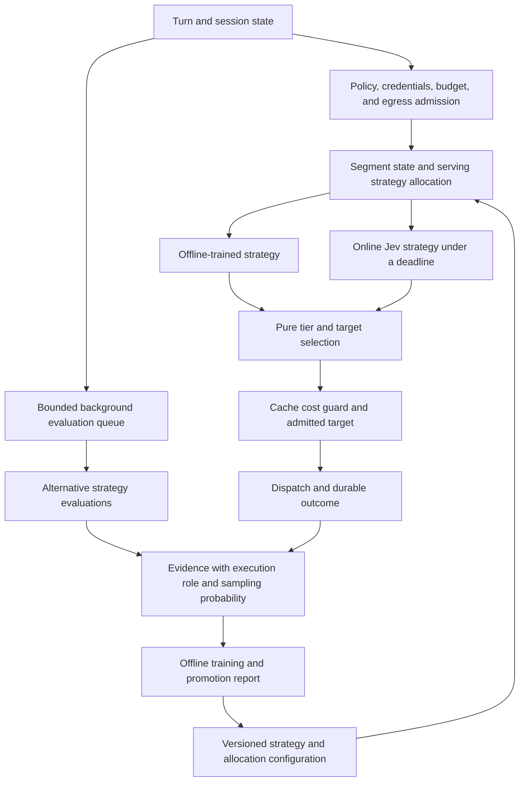

<!--
SPDX-FileCopyrightText: Copyright (c) 2026 NVIDIA CORPORATION & AFFILIATES. All rights reserved.
SPDX-License-Identifier: Apache-2.0
-->

# Routing strategy bandit: serving and background evaluation

> Status: proposed implementation brief, 2026-09-19. The owner requests serving strategies and background evaluation arms, including online TypeSafe/Jev. This brief develops that direction. The owner subsequently accepted T6 in the ruling addendum. The remaining decisions are listed in `PLAN-cache-affinity.md` and section 6 below.

## 1. Outcome and scope

Roundhouse selects a routing strategy under the session policy. Strategies include rules calibrated offline and an online Jev classifier. Background arms evaluate alternatives without changing the live response. Their evidence informs later strategy versions and promotion decisions.

The objective remains function, cost, and time to solution. A cheaper route alone is not a successful outcome. Classifier confidence is not a measure of downstream answer quality.

This changes the original target-arm design in `synergies/typesafe-selector-and-cache-affinity.md`, section 3. The serving bandit selects a strategy. Existing routing code maps its tier signal to an admitted target, with the cache cost guard intact.

## 2. Two execution roles

| Role | Immediate effect | Evidence | Resource limit |
|---|---|---|---|
| Serving strategy | Supplies a tier signal for live routing | Observed outcome of the route actually served | Turn deadline and project grant |
| Background evaluation | Records an alternative recommendation or evaluates a saved case | Agreement, estimated utility, or a separately measured evaluation outcome | Separate evaluation budget and worker concurrency |

These roles share versioned strategy identities. They do not share an undifferentiated reward counter. An unserved recommendation has no observed live outcome.

The serving probability distribution covers serving strategies only. Background sampling has its own probability and budget. A background-only arm cannot consume probability mass without producing a live routing decision.

The first background scheduler can use configured sampling shares. Learning which evaluation to purchase needs an explicit value-of-information objective. That is a separate decision from learning which strategy serves traffic.

## 3. Proposed contracts

### Strategy result

A strategy returns probabilities for `capable` and `efficient`, confidence, and its version. It does not return an unrestricted model identifier. The engine validates finite probabilities, their range and sum, and the expected answer keys before use.

The first serving strategies are the existing rule cascade and a Jev tier classifier. Offline calibration produces a versioned artifact for a serving strategy. Training does not run on the turn path.

The Jev request uses the judge brief format. It contains no prices, candidate list, or target names. A timeout, malformed response, unavailable credential, or exhausted side-call budget leaves the default strategy in control. The decision records the selected strategy, the effective strategy, and the fallback reason separately.

The [TypeSafe API reference](https://docs.typesafe.ai/api), checked on 2026-09-19, defines typed questions, keyed answers, usage, and choice probabilities. The [confidence-routing guide](https://docs.typesafe.ai/patterns/confidence-routing) describes confidence gates and fallback. These support a signal adapter, not a downstream quality claim. The deployment must configure a pinned model version and its rate card.

### Admission and cache boundaries

Arm eligibility precedes allocation. An arm cannot relax target admission, quality floors, budget, tool capability, or the session egress policy. A session restricted to local targets excludes a hosted classifier if T6 adopts the proposed local-only restriction.

Proposed cadence: allocate a serving strategy at a cache-cold segment boundary. Continue to honor severity escalation and mandatory failover within the segment. The segment identity and boundary reason must survive replay. A target switch alone must not silently start a second experiment.

The segment definition needs explicit cases for session start, fork, cache expiry, target failure, and local residency loss. A local target has observed residency rather than an invented Anthropic TTL. C4 and C6 provide the frontier cache inputs.

### Durable attribution

Each allocation needs a segment identifier, strategy version, configuration version, eligible strategies, selected strategy, and selection probability. The durable record also identifies the effective strategy after fallback and the dispatched target after the cache guard.

Use a stable hash and deployment salt to sample a configured distribution. Record the result before dispatch. Replay consumes that record and never repeats a hosted classifier call. Duplicate delivery must not allocate or charge twice.

Background records identify the source session sequence, strategy version, execution role, sampling probability, and completion status. They reference an immutable input snapshot or bounded projection. They do not read a later session state and label it as the earlier case.

Cancellation, failure, and missing observations remain explicit. Missing first-token time is not zero latency. A failed classification still contributes its observed cost and delay to the selected strategy's operational record.

### Reward and promotion

Keep function, cost, and time as separate observations before any scalar utility calculation. Cost includes serving and classifier charges. Background spend is visible separately and included in the total experiment budget.

Observed TTFT and end-to-end completion time answer different questions. R21 in `PLAN-frontier-selection.md` measures first output against turn start. A dispatch-to-first-output interval can supplement it but cannot replace classifier delay in the experiment's latency measure.

Proposed promotion order: enforce a quality constraint, then compare cost and latency within that constraint. The owner must select the quality signal, acceptable regression bound, and cost-versus-latency tradeoff before live learning changes allocation shares. No default utility weights are justified by the current evidence.

Background agreement with the live strategy is a diagnostic. It is not evidence that the alternative target would produce the same outcome. Controlled evaluation results retain their source. Offline policy estimates require logged probabilities and adequate support for the alternative being estimated.

## 4. Source seams inspected

| Existing seam | Use in this design |
|---|---|
| `crates/roundhouse-core/src/routing/stage.rs`, `pick_tier` | Default tier signal and deterministic precedence |
| `crates/roundhouse-core/src/routing/mod.rs`, `RoutingContext::admissible` | Target admission remains authoritative |
| `crates/roundhouse-core/src/validate/brief.rs` | Bounded task projection without routing prices or target names |
| `crates/roundhouse-server/src/judge.rs`, `JudgeConfig` | Side-call deadline and budget precedent |
| `crates/roundhouse-core/src/validate/arm.rs`, `Arm::for_session` | Stable hash and persisted assignment precedent |
| `crates/roundhouse-core/src/event.rs`, `Routed`, `OutputTextDelta`, `ResponseCompleted`, `ValidationDecided` | Inputs for decision and outcome attribution |

The existing validation `Arm` describes intervention experiments. Reusing it for routing strategies would conflate two independent assignments. The implementation needs distinct routing identities, not renamed validation arms.

## 5. Delivery and tests first

Each implementation milestone needs a settled brief, failing tests before its fix, independent mutation checks, and a separate reviewable commit.

| Milestone | Behavior | Required evidence |
|---|---|---|
| B1: observations | First-output checkpoint in `765daf2`, cleanup guard in `1142348`. Terminal timing is committed at `88562f7`. Strategy outcome attribution remains. | Fourteen terminal-timing mutations were caught. The restored focused suites pass 72 core metrics tests and 6 server metrics tests. |
| B2: strategy records | Record eligible serving strategies, versioned allocation, and fallback | Fixed hash vectors. Replay survives configuration changes. Background-only arms cannot enter serving allocation. |
| B3: background evaluation | Execute sampled alternatives with bounded resources and no effect on routing | A stalled worker cannot delay a turn. Cancellation releases capacity. Retry cannot duplicate charges or outcomes. |
| B4: Jev shadow adapter | Standalone transport and budgeted server boundary committed at `51b0fb2` under T6. B2/B3 wiring remains. | All 39 focused tests pass. Twelve independent post-commit mutations were caught. No live quality or latency evidence. |
| B5: offline calibration | Produce a versioned artifact and report from attributable observations | Incomplete cases and unsupported policy estimates remain explicit. Serving and background evidence cannot silently merge. |
| B6: serving bandit | Allocate eligible strategies using approved quality and utility rules | Shadow promotion evidence, deterministic replay, enforced budgets, and cache-boundary tests. |

B4 can proceed under the accepted T6 policy. B6 requires the reward and promotion decisions. A passing unit suite alone does not satisfy the promotion gate.

### B1 first step: observed first-output latency

R21 authorizes a per-target observation from `TurnStarted.at_ms` to the first nonempty `OutputTextDelta.at_ms`. This includes routing and classifier delay. It is distinct from the predicted TTFT in a candidate quote. The fold must produce the same observation during replay.

The accumulator keeps elapsed milliseconds, sample count, and rejected timestamp count. The snapshot exposes a mean with its sample count and event basis. Missing start or output produces no latency value. A backward timestamp contributes no sample and increments the rejection count. Scope totals add elapsed time and counts before computing a mean.

A response that emits text and later fails still has an observed first-output latency. Book that sample on the actual routed target, independently of token billing. Superseded attempts contribute no sample. Terminal and supersession paths remove pending timing state. Duplicate events cannot add a sample twice.

This step does not define a quality reward, promotion threshold, or experiment allocation. It supplies one observation needed by those later decisions.

Checkpoint `765daf2` implements this interval in the metrics fold and publishes it in per-model JSON rows. The basis is `turn_start_to_first_output`. It excludes work before the start event and delivery after the delta append. The HTML dashboard does not yet display the field.

Tests failed before the implementation: 10 assertions failed while absence controls passed. Two additional regressions exposed an empty model row for a silent failure and cross-session supersession when turn IDs match. Both are fixed. Supersession now uses `(SessionId, TurnId)`, which also prevents the existing loss of accounting across concurrent sessions. The final targeted gate passed 53 metrics tests. Broader checks passed 417 core tests and 404 server checks, with 5 pre-existing server ignores. Independent mutations and a new full workspace run remain necessary.

**Verification update, 2026-09-19.** Six B1 mutations failed the intended tests: routing-event timing, empty deltas, overwritten aggregate counters, billing-dependent samples, backward timestamps, and cross-session supersession. Removing timing cleanup initially survived. Commit `1142348` adds the missing map-drain assertion; the same mutation then failed against that committed guard. The restored source passed all 53 metrics tests. The full workspace run at `1142348` passed 1684 tests, with 0 failures and 142 ignores. One ignore belongs to the unresolved C4 tool-marker policy.

### B4 implementation brief: budgeted shadow call

T6 permits a standalone adapter. The binary remains unwired until B2 and B3 provide durable attribution and background execution. A passing adapter test does not authorize serving allocation.

The fleet module owns the HTTP transport and typed response. The server builds the judge brief, checks egress eligibility, and reserves evaluation spend. Both use concrete implementations and loopback tests. No mock-only trait is needed.

The server accepts session items and the objective, then builds `ValidationBrief` internally. Accepting a public `ValidationBrief` value alone does not enforce a bound. Its fields include unrestricted facts, tool names, and a variable number of objective plan steps. Explicit limits must bound those fields and the complete request.

An oversized request produces no HTTP call. Transcript quotation and Unicode boundaries remain intact. The absence of routing metadata fields does not redact model names or prices supplied by a user.

An enabled flag defaults to false. The call also requires an admitted frontier target after policy, cadence, budget, credential, and tool checks. This conservative condition excludes local-only sessions. A catalog identity match alone does not establish admission.

The shadow call requires a separate evaluation budget and ledger. A grant precedes HTTP, and settlement retains reported usage even when the tier signal is invalid. Unknown usage remains explicit. The configured model, rate card, deadline, and size limits have no guessed service values.

The transport sends one request with no retries. It bounds response bytes and the complete request duration. The response must contain the expected question and options, finite probabilities in range, a valid sum, and valid confidence. Unrelated extra fields are allowed. Confidence remains an observation, with no promotion threshold.

The future caller supplies durable call identity and settlement sequence. Deterministic request bytes do not prevent repeated calls. Replay, cancellation of background work, and duplicate delivery remain B2/B3 responsibilities.

### B4 implementation checkpoint, 2026-09-19

The fleet library now prepares one checked System One request and sends its exact bytes once. The server library builds the brief internally, checks opt-in and admitted frontier availability, and reserves evaluation spend before dispatch. A caller must supply the separate evaluation ledger and budget. No startup path or scheduler constructs the adapter.

The quote uses the complete serialized request with the configured tokenizer plus expected output. This includes framing that a quote from selected strings omits. It does not establish the service's token count or guarantee an upper bound on its bill. Reported usage determines settlement. Missing or partial usage remains unknown, and an invalid tier signal retains usable usage. A failed settlement leaves a warning and a hold that can expire.

Focused tests cover received request bytes, bounded and quoted state, admission removals, zero and short grants, credential refusal before a grant, and unknown accounting. Separate regressions first exposed an incomplete quote and a configured URL in transport errors. Those regressions pass after their fixes. Synthetic credentials and loopback endpoints are the only test inputs.

Two draft-review claims required correction. Reqwest already bounded total duration, so the claimed doubling of the deadline was invalid. The reproduced problem was inconsistent timeout classification across request phases. The wrong-question-type test passed against the initial parser, so its proposed reorder was rejected. These are not production latency improvements.

Some later guard tests first ran green. The author's temporary re-breaks occurred before a commit and do not count as independent mutation evidence. The independent stage below checks committed source. No live TypeSafe call, quality evidence, learned allocation, or durable background record is claimed.

**Independent verification, 2026-09-19.** Twelve mutations against `51b0fb2` failed the intended assertions. They covered opt-in, admitted frontier availability, short grants, retained usage, partial usage, shared deadlines, request size, state size, estimates, URL redaction, probability sums, and credential diagnostics. Every restored source matched the commit. The restored suites passed 14 fleet unit tests, 8 HTTP tests, and 17 server tests. The verifier used exact inverse edits instead of the prescribed `sed` commands. No reset, checkout, or stash restored files. Logs: `/tmp/roundhouse-b4-refute-*.log`.

### B1 terminal timing brief, 2026-09-19

The next observation measures `TurnStarted.at_ms` to the terminal event for the same response. Its basis is `turn_start_to_terminal`. Completed and incomplete responses have separate aggregates. The interval includes routing and failover between the two append stamps. It excludes work before the start event and delivery after the terminal append. It does not measure task success or time to solution.

The last routed target receives the sample. Booking precedes the billing-evidence gate, so an incomplete response with empty usage can have a timing sample and zero calls. A missing start produces no timing or rejection. A terminal timestamp before the start increments the rejection count for its outcome class. Equal timestamps produce a valid zero interval.

A single response clock retains the start through first output. Supersession removes the abandoned clock, scoped by session and turn. Terminal events remove the clock regardless of routing or accounting. Replay and duplicate terminal events cannot add samples.

An unrouted terminal has a clock but no pending routed target. It increments a separate `unrouted_terminals` count for its principal and scope, without creating a model row. Missing-start and superseded responses do not enter this count. The count marks excluded observations without inventing target attribution.

Tests must cover both outcome classes, failover, supersession, cross-session turn IDs, timestamp validity, accounting independence, scope aggregation, replay, duplicate delivery, and state cleanup. The JSON fields carry their basis, sample count, rejection count, and optional mean. The HTML dashboard remains separate work. Reward, quality, and allocation decisions remain open.

**Implementation checkpoint, 2026-09-19.** The first core metrics run produced 15 failures and 58 passes before terminal booking and publishing. One failure was a missing-row lookup panic. The remaining failures compared missing or zero observations with expected values. Five new guards first ran green and require independent mutation evidence. One new test duplicated an existing silent-failure case and was removed.

The existing silent-failure test now checks an incomplete timing sample beside zero calls, zero tokens, and no first-output sample. Its clock-cleanup assertion remains. This changes row presence deliberately: elapsed time is observable even without billing evidence.

The restored implementation passes 72 core metrics tests and 6 server metrics tests. The broader core crate run passed 436 tests. Root repeated the focused gates. The comment pass preserved all non-comment source lines, and formatting and whitespace checks pass. No new ignore was added. Logs: `/tmp/roundhouse-b1-terminal-red-core.log`, `/tmp/roundhouse-b1-terminal-green-core-full.log`, and `/tmp/roundhouse-b1-terminal-root-*.log`. Independent post-commit mutations and a full workspace run remain.

**Independent verification, 2026-09-19.** Fourteen mutations against `88562f7` failed at runtime, and each inverse edit restored the committed source. They covered outcome separation, clock origin, billing independence, timestamp rejection, column presence, aggregation, scope, cleanup, unrouted counts, final-target attribution, and means. The wrong-target mutation caused a missing-row lookup panic. No compile failure counts as a caught mutation. The restored suites passed 72 core metrics tests and 6 server metrics tests, with formatting clean.

The verifier replaced raw run logs with detailed summaries. Actual tool outputs, including all 14 failing exit codes, are retained in `/tmp/roundhouse-b1-terminal-refute-transcript-evidence.json`. Per-mutation summaries and restored-suite logs are under `/tmp/roundhouse-b1-terminal-refute-*.log`.

**Workspace verification, 2026-09-19.** The local full suite at `88562f7` passed 1752 tests, with 0 failures and 142 ignores. It covered 108 test binaries and 7 doc-test suites. The C4 owner-decision ignore remains. Command: `ulimit -Sn 65536 && timeout 900 cargo test --workspace`. Log: `/tmp/roundhouse-b1-terminal-workspace.log`.

## 6. Decisions still needed

The owner accepted T6 and the C4 catalog price guard, and keeps PR #18 as one unit. C6 timing and C3 fleet fail-open behavior remain open.

For the bandit, settle the segment boundary cases, the function-quality observation, the allowed quality regression, and the cost-versus-latency tradeoff. Also decide whether background sampling remains configured or eventually learns a value-of-information policy. This brief recommends configured background sampling for the first measurable deployment.

**Workspace verification, 2026-09-19.** The local full suite at `51b0fb2` passed 1733 tests, with 0 failures and 142 ignores. It covered 108 test binaries and 7 doc-test suites. The C4 owner-decision ignore remains. Command: `ulimit -Sn 65536 && timeout 900 cargo test --workspace`. Log: `/tmp/roundhouse-b4-workspace.log`.
