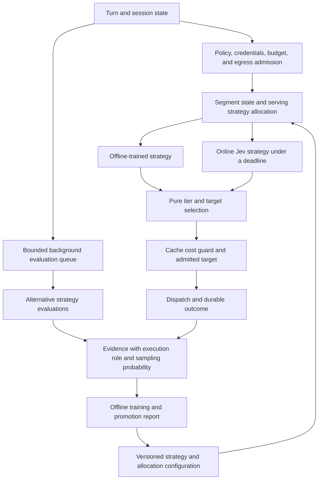

<!--
SPDX-FileCopyrightText: Copyright (c) 2026 NVIDIA CORPORATION & AFFILIATES. All rights reserved.
SPDX-License-Identifier: Apache-2.0
-->

# Routing strategy bandit: serving and background evaluation

> Status: proposed implementation brief, 2026-09-19. The owner requests serving strategies and background evaluation arms, including online TypeSafe/Jev. This brief develops that direction. The owner subsequently accepted T6 in the ruling addendum. The remaining decisions are listed in `PLAN-cache-affinity.md` and section 6 below.

## 1. Outcome and scope

Roundhouse selects a routing strategy under the session policy. Strategies include rules calibrated offline and an online Jev classifier. Background arms evaluate alternatives without changing the live response. Their evidence informs later strategy versions and promotion decisions.

The objective remains function, cost, and time to solution. A cheaper route alone is not a successful outcome. Classifier confidence is not a measure of downstream answer quality.

This changes the original target-arm design in `synergies/typesafe-selector-and-cache-affinity.md`, section 3. The serving bandit selects a strategy. Existing routing code maps its tier signal to an admitted target, with the cache cost guard intact.

## 2. Two execution roles

| Role | Immediate effect | Evidence | Resource limit |
|---|---|---|---|
| Serving strategy | Supplies a tier signal for live routing | Observed outcome of the route actually served | Turn deadline and project grant |
| Background evaluation | Records an alternative recommendation or evaluates a saved case | Agreement, estimated utility, or a separately measured evaluation outcome | Separate evaluation budget and worker concurrency |

These roles share versioned strategy identities. They do not share an undifferentiated reward counter. An unserved recommendation has no observed live outcome.

The serving probability distribution covers serving strategies only. Background sampling has its own probability and budget. A background-only arm cannot consume probability mass without producing a live routing decision.

The first background scheduler can use configured sampling shares. Learning which evaluation to purchase needs an explicit value-of-information objective. That is a separate decision from learning which strategy serves traffic.

## 3. Proposed contracts

### Strategy result

A strategy returns probabilities for `capable` and `efficient`, confidence, and its version. It does not return an unrestricted model identifier. The engine validates finite probabilities, their range and sum, and the expected answer keys before use.

The first serving strategies are the existing rule cascade and a Jev tier classifier. Offline calibration produces a versioned artifact for a serving strategy. Training does not run on the turn path.

The Jev request uses the judge brief format. It contains no prices, candidate list, or target names. A timeout, malformed response, unavailable credential, or exhausted side-call budget leaves the default strategy in control. The decision records the selected strategy, the effective strategy, and the fallback reason separately.

The [TypeSafe API reference](https://docs.typesafe.ai/api), checked on 2026-09-19, defines typed questions, keyed answers, usage, and choice probabilities. The [confidence-routing guide](https://docs.typesafe.ai/patterns/confidence-routing) describes confidence gates and fallback. These support a signal adapter, not a downstream quality claim. The deployment must configure a pinned model version and its rate card.

### Admission and cache boundaries

Arm eligibility precedes allocation. An arm cannot relax target admission, quality floors, budget, tool capability, or the session egress policy. A session restricted to local targets excludes a hosted classifier if T6 adopts the proposed local-only restriction.

Proposed cadence: allocate a serving strategy at a cache-cold segment boundary. Continue to honor severity escalation and mandatory failover within the segment. The segment identity and boundary reason must survive replay. A target switch alone must not silently start a second experiment.

The segment definition needs explicit cases for session start, fork, cache expiry, target failure, and local residency loss. A local target has observed residency rather than an invented Anthropic TTL. C4 and C6 provide the frontier cache inputs.

### Durable attribution

Each allocation needs a segment identifier, strategy version, configuration version, eligible strategies, selected strategy, and selection probability. The durable record also identifies the effective strategy after fallback and the dispatched target after the cache guard.

Use a stable hash and deployment salt to sample a configured distribution. Record the result before dispatch. Replay consumes that record and never repeats a hosted classifier call. Duplicate delivery must not allocate or charge twice.

Background records identify the source session sequence, strategy version, execution role, sampling probability, and completion status. They reference an immutable input snapshot or bounded projection. They do not read a later session state and label it as the earlier case.

Cancellation, failure, and missing observations remain explicit. Missing first-token time is not zero latency. A failed classification still contributes its observed cost and delay to the selected strategy's operational record.

### Reward and promotion

Keep function, cost, and time as separate observations before any scalar utility calculation. Cost includes serving and classifier charges. Background spend is visible separately and included in the total experiment budget.

Observed TTFT and end-to-end completion time answer different questions. R21 in `PLAN-frontier-selection.md` measures first output against turn start. A dispatch-to-first-output interval can supplement it but cannot replace classifier delay in the experiment's latency measure.

Proposed promotion order: enforce a quality constraint, then compare cost and latency within that constraint. The owner must select the quality signal, acceptable regression bound, and cost-versus-latency tradeoff before live learning changes allocation shares. No default utility weights are justified by the current evidence.

Background agreement with the live strategy is a diagnostic. It is not evidence that the alternative target would produce the same outcome. Controlled evaluation results retain their source. Offline policy estimates require logged probabilities and adequate support for the alternative being estimated.

## 4. Source seams inspected

| Existing seam | Use in this design |
|---|---|
| `crates/roundhouse-core/src/routing/stage.rs`, `pick_tier` | Default tier signal and deterministic precedence |
| `crates/roundhouse-core/src/routing/mod.rs`, `RoutingContext::admissible` | Target admission remains authoritative |
| `crates/roundhouse-core/src/validate/brief.rs` | Bounded task projection without routing prices or target names |
| `crates/roundhouse-server/src/judge.rs`, `JudgeConfig` | Side-call deadline and budget precedent |
| `crates/roundhouse-core/src/validate/arm.rs`, `Arm::for_session` | Stable hash and persisted assignment precedent |
| `crates/roundhouse-core/src/event.rs`, `Routed`, `OutputTextDelta`, `ResponseCompleted`, `ValidationDecided` | Inputs for decision and outcome attribution |

The existing validation `Arm` describes intervention experiments. Reusing it for routing strategies would conflate two independent assignments. The implementation needs distinct routing identities, not renamed validation arms.

## 5. Delivery and tests first

Each implementation milestone needs a settled brief, failing tests before its fix, independent mutation checks, and a separate reviewable commit.

| Milestone | Behavior | Required evidence |
|---|---|---|
| B1: observations | First-output checkpoint in `765daf2`, cleanup guard in `1142348`. Completion and strategy outcome attribution remain. | First-output, replay, scope, and failure regressions pass. Independent mutations verified; full suite passes. |
| B2: strategy records | Record eligible serving strategies, versioned allocation, and fallback | Fixed hash vectors. Replay survives configuration changes. Background-only arms cannot enter serving allocation. |
| B3: background evaluation | Execute sampled alternatives with bounded resources and no effect on routing | A stalled worker cannot delay a turn. Cancellation releases capacity. Retry cannot duplicate charges or outcomes. |
| B4: Jev shadow adapter | Produce tier probabilities from the approved digest under T6 | Fake-server request assertions. Malformed probabilities and timeouts fall back. Local-only and disabled egress make zero calls. |
| B5: offline calibration | Produce a versioned artifact and report from attributable observations | Incomplete cases and unsupported policy estimates remain explicit. Serving and background evidence cannot silently merge. |
| B6: serving bandit | Allocate eligible strategies using approved quality and utility rules | Shadow promotion evidence, deterministic replay, enforced budgets, and cache-boundary tests. |

B4 can proceed under the accepted T6 policy. B6 requires the reward and promotion decisions. A passing unit suite alone does not satisfy the promotion gate.

### B1 first step: observed first-output latency

R21 authorizes a per-target observation from `TurnStarted.at_ms` to the first nonempty `OutputTextDelta.at_ms`. This includes routing and classifier delay. It is distinct from the predicted TTFT in a candidate quote. The fold must produce the same observation during replay.

The accumulator keeps elapsed milliseconds, sample count, and rejected timestamp count. The snapshot exposes a mean with its sample count and event basis. Missing start or output produces no latency value. A backward timestamp contributes no sample and increments the rejection count. Scope totals add elapsed time and counts before computing a mean.

A response that emits text and later fails still has an observed first-output latency. Book that sample on the actual routed target, independently of token billing. Superseded attempts contribute no sample. Terminal and supersession paths remove pending timing state. Duplicate events cannot add a sample twice.

This step does not define a quality reward, promotion threshold, or experiment allocation. It supplies one observation needed by those later decisions.

Checkpoint `765daf2` implements this interval in the metrics fold and publishes it in per-model JSON rows. The basis is `turn_start_to_first_output`. It excludes work before the start event and delivery after the delta append. The HTML dashboard does not yet display the field.

Tests failed before the implementation: 10 assertions failed while absence controls passed. Two additional regressions exposed an empty model row for a silent failure and cross-session supersession when turn IDs match. Both are fixed. Supersession now uses `(SessionId, TurnId)`, which also prevents the existing loss of accounting across concurrent sessions. The final targeted gate passed 53 metrics tests. Broader checks passed 417 core tests and 404 server checks, with 5 pre-existing server ignores. Independent mutations and a new full workspace run remain necessary.

**Verification update, 2026-09-19.** Six B1 mutations failed the intended tests: routing-event timing, empty deltas, overwritten aggregate counters, billing-dependent samples, backward timestamps, and cross-session supersession. Removing timing cleanup initially survived. Commit `1142348` adds the missing map-drain assertion; the same mutation then failed against that committed guard. The restored source passed all 53 metrics tests. The full workspace run at `1142348` passed 1684 tests, with 0 failures and 142 ignores. One ignore belongs to the unresolved C4 tool-marker policy.

## 6. Decisions still needed

The owner accepted T6 and the C4 catalog price guard, and keeps PR #18 as one unit. C6 timing and C3 fleet fail-open behavior remain open.

For the bandit, settle the segment boundary cases, the function-quality observation, the allowed quality regression, and the cost-versus-latency tradeoff. Also decide whether background sampling remains configured or eventually learns a value-of-information policy. This brief recommends configured background sampling for the first measurable deployment.
