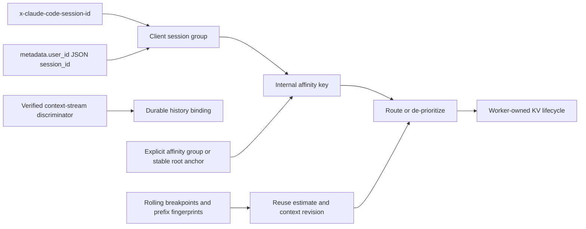

<!--
SPDX-FileCopyrightText: Copyright (c) 2026 NVIDIA CORPORATION & AFFILIATES. All rights reserved.
SPDX-License-Identifier: Apache-2.0
-->

> **Status: dated evidence addendum.** This note adds version-bound Claude Code wire evidence to [agent-session-context.md](agent-session-context.md#3-claude-code-and-claude-messages). It does not revise that snapshot. It was produced on 2026-09-16 in Roundhouse `d9cb657` with Claude Code `2.1.272`, SHA-256 `214a90efdd16ee0ea81132ffecced588dba394d178cc494f285ba04b5288c8de`.

# Claude Code wire signals for cache-aware routing

## 1. Result

Claude Code `2.1.272` completed one synthetic loopback exchange at `POST /v1/messages?beta=true`. The exchange contained four Messages requests. Each sent `x-claude-code-session-id` equal to the synthetic `--session-id`.

Each captured request sent `metadata.user_id` as a JSON-encoded string. Its decoded object had the keys `account_uuid`, `device_id`, and `session_id`. The embedded `session_id` equaled the synthetic `--session-id`.

The request did not send `session-id`, `thread-id`, `x-client-request-id`, or `prompt_cache_key`. The `metadata.user_id` format is a Claude Code client convention. It is not a public Anthropic Messages session field.

Two of the four request shapes used three explicit one-hour `cache_control` breakpoints. Those two also requested the `clear_thinking_20251015` context edit. A request only records client intent. The mock cannot prove that Anthropic applied an edit, created a cache entry, or read one.

`C`, `K`, `R`, and `B` name separate state. A route can use all four. No one state proves the lifetime of a worker KV block.

## 2. Method and boundaries

The reproducible probe is [claude-code-wire-probe.py](claude-code-wire-probe.py). Its matching sanitized fixture is [claude-code-wire-fixture-2.1.272.json](claude-code-wire-fixture-2.1.272.json).

The probe generated a new UUID and used it as `--session-id`. It sent one fixed synthetic prompt through `ANTHROPIC_BASE_URL` to a listener on `127.0.0.1`. Claude Code completed the four-request exchange with exit status zero.

The listener discarded all authorization values and all body text. It emitted only protocol names, metadata key names, content block types, cache controls, and equality checks against the generated UUID. The probe used `--no-session-persistence`, so it created no transcript.

The direct first-party source confirms that `ANTHROPIC_BASE_URL` sends Claude Code traffic through a proxy or gateway. See [Claude Code environment variables](https://code.claude.com/docs/en/env-vars).

This probe proves the request shape for this client version and mode. It does not prove provider cache residency, provider cache hits, a response-side compaction result, or subagent request identity.

## 3. Observed request fields

| Field | Observation | Router meaning | Confidence |
|---|---|---|---|
| Request path | `POST /v1/messages?beta=true` | Select the Anthropic Messages adapter. | Observed in four successful root requests. |
| `x-claude-code-session-id` | Present and equal to `--session-id`. | Use as a version-specific client-session group for soft affinity and correlation. | Observed in four root requests. |
| `metadata.user_id` | Present as a JSON-encoded string. It decodes to `account_uuid`, `device_id`, and `session_id`. The embedded `session_id` equals `--session-id`. | Corroborate the version-specific Claude Code session group. Do not expose or use account or device values as cache keys. | Observed in four root requests. |
| `session-id`, `thread-id`, `x-client-request-id` | Absent. | Do not apply Codex header rules to Claude traffic. | Observed absence in this mode only. |
| `prompt_cache_key` | Absent from the Messages body. | Do not invent an Anthropic equivalent. Build a separate internal affinity key. | Observed absence in this mode only. |
| `cache_control` | Two request shapes use three explicit `ephemeral`, `ttl: "1h"` breakpoints. Two occur in `system`. One occurs in a message block. | The wire declares reusable prefix boundaries. It does not identify an existing cache entry. | Observed request intent. |
| `context_management.edits` | The same two shapes request `clear_thinking_20251015`. | Record `context_edit_requested`. Do not mark context as rewritten. | Observed request intent. |
| `parent_tool_use_id` | Absent. | No parent relationship appeared on the root Messages body. | Observed in the root exchange only. |

The request had `anthropic-version: 2023-06-01` and a Claude Code beta list. The fixture omits the beta list because it changes frequently. The probe still emits it for a local compatibility check.

The four requests had one client-session group but two request shapes. The first and third had only a `user` message and no observed breakpoint or edit. The second and fourth had `user` and `system` messages plus the three one-hour breakpoints and the thinking edit.

The purpose of the mixed shapes is not established. Do not treat one header value as proof of one append-only provider prompt stream. Do not infer compaction from a shape or prefix change.

## 4. Session, resume, fork, and subagent scope

Claude Code documents a session as a local saved conversation. Resume appends to the same session. A fork copies history into a new session ID. See [Manage sessions](https://code.claude.com/docs/en/sessions) and [How Claude Code works](https://code.claude.com/docs/en/how-claude-code-works).

The previous evidence snapshot recorded that a CLI resume and local `/compact` boundary retained one Claude session UUID. It did not capture the provider request. This addendum closes the root wire gap only.

Anthropic documents that a Claude Code subagent has its own context window and separate transcript. A main-session compaction does not modify a subagent transcript. See [Create custom subagents](https://code.claude.com/docs/en/subagents).

One bounded mock attempt returned a synthetic `Agent` tool call after Claude Code exposed the `Agent` tool. The process completed, but all captured Messages requests retained the root session value. No independently identifiable child request appeared.

That attempt does not prove that the mock tool call created a real subagent. It also does not prove that subagents share a root identity on the Messages wire. Keep child conversation identity unresolved until a valid child exchange provides its own fixture.

The CLI option `--forward-subagent-text` describes `parent_tool_use_id` on its stream output. That output convention does not prove a Messages request field. Do not derive child history binding from it.

## 5. Claude cache and context semantics

Anthropic caches the prefix in the order `tools`, then `system`, then `messages`, up to a `cache_control` breakpoint. The provider uses exact cached content. A cache hint is not a cache handle. See [Prompt caching](https://platform.claude.com/docs/en/build-with-claude/prompt-caching).

The standard cache has a minimum five-minute lifetime. A one-hour cache is available when the request sets `ttl: "1h"`. A use refreshes the lifetime, but the provider deletes an expired cache promptly rather than at an exact deadline. Anthropic does not offer a manual cache clear.

The response usage fields `cache_read_input_tokens` and `cache_creation_input_tokens` report cache reads and writes. A zero cache read can mean an uncacheable short prompt, a different prefix, a changed configuration, expiration, or a cold provider. It does not prove compaction.

The request can have at most four explicit breakpoints. Tool definitions, system content, message content, tool use, and tool results can be cached. Changing tools invalidates the full hierarchy. Changing `tool_choice`, images, thinking, or effort can invalidate part or all of it. See [Prompt caching](https://platform.claude.com/docs/en/build-with-claude/prompt-caching) and [Tool use with prompt caching](https://platform.claude.com/docs/en/agents-and-tools/tool-use/tool-use-with-prompt-caching).

The observed `clear_thinking_20251015` request asks the provider to remove eligible thinking blocks before the model reads the prompt. It does not say that the provider removed a tool result or compacted the conversation. The separate `clear_tool_uses_20250919` strategy clears old tool results when its configured threshold is reached. See [Context editing](https://platform.claude.com/docs/en/build-with-claude/context-editing) and [Thinking](https://platform.claude.com/docs/en/about-claude/models/extended-thinking-models).

Server compaction is a beta Messages feature. The client enables it with `context_management.edits: [{"type":"compact_20260112"}]`. The provider creates a `compaction` content block. Later requests retain the block and omit prior content. A paused compaction returns `stop_reason: "compaction"`. See [Compaction](https://platform.claude.com/docs/en/build-with-claude/compaction).

The normal root fixture did not contain `compact_20260112`. It is not evidence that the feature is unavailable. It only says that this short Claude Code request asked for thinking cleanup instead.

## 6. Shared normalized signal model

Use one model for Codex and Claude. Normalize provider fields at ingress, but retain the raw field names for audit.

| State | Meaning | Claude source | Codex source | Required action |
|---|---|---|---|---|
| `conversation_id` | A trusted append-only context-stream name. It is optional. | No stream discriminator is established. | `thread-id` only when request purpose identifies the rendered transcript stream. | Bind durable history and `context_epoch` only here. |
| `client_session_group` | A client grouping value. It is optional. | Observed `x-claude-code-session-id`. The metadata string corroborates it. | `session-id`, plus `thread-id` as an auxiliary correlation value. | Use for soft affinity and correlation. Never bind history by itself. |
| `provider_cache_hint` | Opaque provider input. It is optional. | No Messages equivalent observed. | `prompt_cache_key`. | Preserve raw value. Do not convert it into identity. |
| `affinity_key` | A required Roundhouse routing key. | Explicit group or stable root prefix fallback. | Explicit group or stable root prefix fallback. | Scope to tenant, provider, model family, tokenizer, and backend at candidate realization. |
| `stable_anchor` | The fixed root that backs the affinity key. | Shared tool and initial-system prefix when no explicit group exists. | Stable instruction and root prefix when no explicit group exists. | Never derive it from the latest growing message breakpoint. |
| `prefix_revision` | A rolling content and breakpoint observation. | Tools, system, messages, cache controls, thinking, effort, and images. | Canonical Responses prefix and supported opaque items. | Estimate reuse and retain the common prefix. |
| `context_epoch` | A monotonic revision of a known context stream. | A previously unseen verified compaction artifact or persisted rewrite on a bound stream. | A previously unseen verified opaque compacted context or local checkpoint on a bound stream. | Deduplicate state changes and reject stale events. |

An `affinity_key` is mandatory after normalization. A missing trusted `conversation_id` must not block prefix-aware routing. In that case the content-derived stable anchor can select a warm candidate, but it must not bind durable history or issue conversation-scoped invalidations.

An explicit group is the preferred affinity input. The fallback is a versioned digest of a stable root prefix. A digest of the latest message breakpoint is incorrect because it changes on every append and destroys stickiness.

The internal affinity key is not a provider cache key. Anthropic cache reuse depends on an identical cached prefix and provider scope. OpenAI `prompt_cache_key` has different provider-specific routing behavior. Roundhouse can use one internal key without claiming the providers behave the same.

## 7. Routing and invalidation rules

Use `affinity_key` only after admission chooses compatible candidates. A local worker cache needs the matching model, tokenizer, backend, and block chain. A frontier cache also needs the same provider scope and model. Passing an ID into a request is transport capacity. It does not prove that the current default selector uses the ID for stickiness.

On a verified rewrite, preserve the known common prefix and its valid breakpoints. Clear only reuse estimates that depend on the removed suffix. Rebind affinity only when an explicit group changes or the stable anchor changes.

Treat an unverified edit request, a client `/compact` command, a cache-read miss, and a changed prefix fingerprint as observations. None authorizes a global cache eviction. A provider request can repeat after retry, arrive out of order, or fail after the request reaches Roundhouse.

| Signal | What is known | Router action | Forbidden action |
|---|---|---|---|
| `context_edit_requested` | The request named an edit. | Store pending telemetry. | Advance `context_epoch` or invalidate cache state. |
| Cache read or write usage | The provider reported one request outcome. | Update that target's warm estimate. | Infer compaction or delete local KV. |
| Cache read miss | This request did not read the expected prefix. | Decrease that target's reuse confidence. | Mark the conversation cold globally. |
| Previously unseen compaction artifact on a bound stream | The rendered history has a replacement artifact. | Advance that stream's `context_epoch` once. Deprioritize old suffix estimates. | Evict shared prefix blocks. |
| Verified history rewrite | The bound history changed. | Keep the validated common prefix. Reset stale suffix estimates. | Change the stable anchor without evidence. |
| Fork with a new verified stream discriminator | The child has a new history binding. | Start a new conversation state. Reuse a matching stable anchor only after normal tenant checks. | Treat parent and child as one append-only log. |

Worker KV eviction remains a worker decision. It must check block ownership, shared references or leases, in-flight requests, compatible model and tokenizer namespace, backend state, and pressure. A Roundhouse routing observation can reduce retention priority. It cannot revoke another request's live or shared KV block.

## 8. Open evidence

Capture a real Claude Code child request with a provider-valid `Agent` tool loop. Compare only sanitized header names, session-ID equality predicates, metadata key names, and parent linkage fields.

Capture a successful Claude server-compaction response with `pause_after_compaction: true`. Record the block type, `stop_reason`, and a non-secret artifact digest. Then verify the next request retains that artifact.

Capture real response usage across a known repeated prefix. Record token counts only. This can confirm cache accounting. It cannot establish physical worker KV lifetime.

No production code changed. `jq empty`, the probe option parser, `git diff --check`, and the trailing-whitespace scan exited zero. No Cargo command ran.
