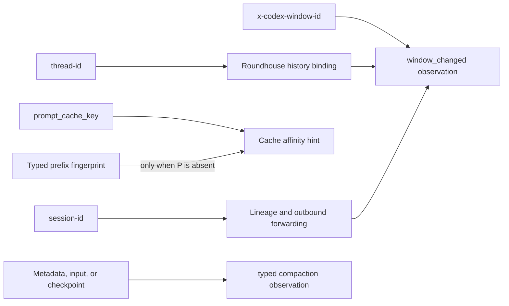

<!--
SPDX-FileCopyrightText: Copyright (c) 2026 NVIDIA CORPORATION & AFFILIATES. All rights reserved.
SPDX-License-Identifier: Apache-2.0
-->

> **Status: evidence base, primary-sourced.** Produced 2026-09-16 against Roundhouse `1daf8d5` plus its uncommitted session-context work. Per `agent-docs/README.md`, add dated notes when an upstream changes. Do not silently revise this snapshot.

# Agent session and context signals

## 0. Result

Use `thread-id` to bind a Roundhouse history when Codex supplies it. Use `session-id` as a stable lineage and forwarding value. Keep a supplied `prompt_cache_key` unchanged. When the key is absent, Roundhouse can derive a fallback cache hint. The typed hash includes instructions, leading system and developer items, and the first user item.

That hash is not proof of compaction. A change says that the observed leading prefix changed. An unchanged hash says only that the observed leading prefix did not change. Either result can occur around a compaction.

Codex signals establish different facts. Compaction request metadata or an observed `/responses/compact` call establishes an attempted operation. A supported opaque input item establishes that a compacted context is present. A local Codex transcript checkpoint establishes that the client installed compacted history (`core/src/session/tests.rs:11109-11115`). A changed `x-codex-window-id` records a new context window, but it is supporting evidence rather than a compaction verdict.

A parsed Claude Messages compaction block is confirmed evidence. With `pause_after_compaction: true`, a `stop_reason: "compaction"` is also confirmed evidence.

Roundhouse currently has an OpenAI Responses handler. It does not have an Anthropic Messages adapter. The Claude findings specify a future adapter. They do not mean that the shipped Responses handler accepts Claude traffic.

## 1. Method and limits

The Codex source of record is the exact Cargo dependency checkout at `/home/ryan/.cargo/git/checkouts/codex-9eee5d47a939c68c/6344a65`, revision `6344a655a5966f92e009a74928fb0559b41f9093`. That is different from the local development checkout at `/home/ryan/repos/codex`, revision `de8bbfee56275bb43ee69f409ddeb2619fd2e682`. Claims marked **pinned Codex** use the first revision only.

The local probes used Codex CLI `0.153.4` and Claude Code `2.1.272`. They used fixed synthetic prompts, no tools, safe or read-only execution, and a bounded budget. The recorded results below contain identifiers, event kinds, counts, and hashes only. They contain no prompt, system prompt, or model output text.

The official sources are [OpenAI conversation state](https://developers.openai.com/api/docs/guides/conversation-state), [OpenAI prompt caching](https://developers.openai.com/api/docs/guides/prompt-caching), [OpenAI compaction](https://developers.openai.com/api/docs/guides/latest-model?model=gpt-5.2), [Claude Code CLI usage](https://code.claude.com/docs/en/cli-usage), [Claude prompt caching](https://platform.claude.com/docs/en/build-with-claude/prompt-caching), and [Claude compaction](https://platform.claude.com/docs/en/build-with-claude/compaction).

The probes prove local CLI behavior. They do not capture each fully rendered provider request. They cannot prove the exact system-plus-first-user hash that a provider received before and after compaction.

## 2. Codex identity and cache affinity

### 2.1 Wire values

**Pinned Codex** sends `session-id` and `thread-id` as independent request headers (`codex-api/src/requests/headers.rs:5-13`). It also uses `thread-id` as `x-client-request-id` when present (`codex-api/src/endpoint/responses.rs:87-96`).

A root resume makes its `session_id` equal its `thread_id` (`core/src/session/tests.rs:6260-6283`). A resumed subagent instead restores the parent's session ID while retaining its own thread ID (`core/src/session/tests.rs:6287-6327`). Therefore session ID is too broad for the append-only history key. It groups related threads. Thread ID names the conversation whose history was rendered.

**Pinned Codex** supplies `prompt_cache_key` on every Responses request (`core/src/client.rs:914-939`). Its default key is `session_id`, with an internal override path (`core/src/client.rs:476-488`). That is a client policy, not a general rule for other Responses clients.

OpenAI documents `prompt_cache_key` as a cache-routing hint. Cache reuse still depends on the full rendered prefix and machine routing. The key does not pin a request to one cache host. The cached prefix can include system instructions, tools, developer messages, and conversation history. See [Prompt caching](https://developers.openai.com/api/docs/guides/prompt-caching).

### 2.2 Context windows and explicit compaction

**Pinned Codex** makes the window ID from `thread_id:window_number` (`core/src/session/mod.rs:3670-3679`). Remote compaction advances the window, then replaces the live compacted history (`core/src/compact_remote.rs:264-304`). Its local compaction test marks the compaction request with `request_kind: "compaction"` and a structured `compaction` object, and then checks that the next ordinary request uses a different window (`core/tests/suite/compact.rs:3783-3837`).

The metadata schema names `session_id`, `thread_id`, `window_id`, `request_kind`, and `compaction` (`core/src/responses_metadata.rs:26-32`). The client writes the window ID and the full turn metadata into `client_metadata` and compatibility headers (`core/src/responses_metadata.rs:274-340`).

An observed changed window is useful because this pinned client changes it on a successful compaction. It does not prove compaction on its own. A new thread, fork, restart, client version change, or an arbitrary compatible client can also present a different value. Roundhouse records the value as `window_changed`, not `compaction_detected`.

The public Responses compaction API returns a new response identifier and a single opaque compaction item after the original user messages. OpenAI says the item is safe to pass to later requests. That explicit operation or input item is the provider-level compaction evidence. See [Conversation state](https://developers.openai.com/api/docs/guides/conversation-state) and [Compaction](https://developers.openai.com/api/docs/guides/latest-model?model=gpt-5.2).

## 3. Claude Code and Claude Messages

Claude Code's `--session-id` creates or selects a CLI conversation. `--resume` continues one, while `--fork-session` makes a different session. The local `claude --help` also exposes `--autocompact` and `--system-prompt-snapshot`. See [CLI usage](https://code.claude.com/docs/en/cli-usage).

This CLI session is separate from Anthropic Messages cache control. Messages caching uses `cache_control` breakpoints over the `tools`, `system`, and `messages` prefix. Anthropic documents ephemeral cache lifetimes. There is no Messages `prompt_cache_key` request field. See [Prompt caching](https://platform.claude.com/docs/en/build-with-claude/prompt-caching).

For the Messages API, compaction is explicit. When `pause_after_compaction: true` pauses a compaction, the response has `stop_reason: "compaction"` and includes one compaction content block. The client passes that block to the next request. Anthropic says content before the block is ignored. Without a pause request, Anthropic can compact and continue generation, so an ordinary final response does not necessarily expose that stop reason. See [Compaction](https://platform.claude.com/docs/en/build-with-claude/compaction).

This research did not confirm one stable Claude Code HTTP session header. The probe did not capture a `metadata.user_id` session mapping. Do not infer one from `cache_control`, a cache key, prompt content, a request ID, or Claude's CLI transcript ID. A future Messages adapter needs a captured wire fixture before it assigns a Claude header precedence rule.

> **2026-09-16 wire addendum.** [Claude Code wire signals for cache-aware routing](agent-session-context-claude-wire-addendum-2026-09-16.md) captures version-specific root-request evidence for `x-claude-code-session-id` and the JSON `metadata.user_id` mapping. It also records mixed request shapes under one root session and leaves child-request identity unresolved.

## 4. Probe results

| Probe | Observation | What it establishes | What it does not establish |
|---|---|---|---|
| Codex `exec`, then `exec resume` | Both JSONL streams emitted the same thread UUID. The resumed turn had continued input accounting. | Codex batch resumption retains its thread identity. | The actual upstream headers, a compaction, or a cache hit. |
| Codex `exec resume ... /compact` | Batch mode returned an ordinary model turn. | `/compact` is not a batch-mode local command. | Codex compaction behavior. |
| Claude `-p --session-id`, then `--resume` | The result records retained the requested session UUID. | Claude CLI resumption retains its session identity. | A provider HTTP session value. |
| Claude `--resume ... /compact` | The local transcript had one `system.compact_boundary` and one `user.isCompactSummary`, both under the same session UUID. | Claude Code preserves session identity across its local compaction boundary. | The fully rendered provider request. |

The Claude transcript held a normal first user record and its compact summary record under the same session. Their canonical JSON SHA-256 values differed, as expected. This is an offline transcript observation. It is not a captured system-plus-first-user hash at the HTTP boundary. It supports the conclusion that a hash can change across compaction. It does not make that change authoritative.

## 5. Consequences for Roundhouse

1. Keep the raw provided `prompt_cache_key`. Forward it unchanged. Do not replace it with an internal session or thread value.
2. If no key is supplied, derive a key from typed canonical JSON with a version prefix. Include `instructions`, leading system and developer items, and the first user item. The typed form prevents ambiguous concatenation.
3. Keep external session and thread IDs independent. Bind local history by thread ID when present. Use the session ID for lineage and forwarding. If no thread ID is present, use an explicit session ID. A cache key may be a final local binding fallback, but it never becomes an inferred session ID.
4. Persist a separate typed prefix fingerprint for observations. On one local binding, report `first_seen`, `prefix_unchanged`, or `prefix_changed`. Continue reporting any full-history result, such as `history_rewritten`, as its own result.
5. Parse `x-codex-window-id` and report `window_changed` separately. Record a valid `x-codex-turn-metadata` compaction request as `compaction_attempted`. Record a supported opaque compaction input as `compacted_context_present`. Unsupported opaque items remain fail-closed.
6. Deduplicate a compaction count by an explicit artifact identity and a per-thread window transition. A request can repeat the same opaque artifact without creating a new compaction event.
7. Do not infer `no_compaction` from `prefix_unchanged`. Compaction can retain the leading instructions and first user item, or replace only later history. Do not infer compaction from `prefix_changed`. Editing instructions, leading system or developer content, or the first user item can change it. Editing tools, settings, or later history can change provider cache reuse without changing this fingerprint.

The regression cases follow from those distinctions: root and child threads with one session and one cache key bind separate histories; an explicit cache key survives forwarding; a derived key is stable for one canonical prefix; an unchanged fingerprint does not suppress a separate window or compaction observation; and an opaque compaction item is rejected until the handler can preserve it exactly.

## 6. Implementation boundary

This change implements identity forwarding, the fallback hash, and node-local context observations on the existing Responses handler. It reports the signal in an HTTP response header and structured logs. It does not persist observations across nodes or restarts. Parsing compaction request metadata, preserving opaque compaction items, and an Anthropic Messages adapter remain future work.
