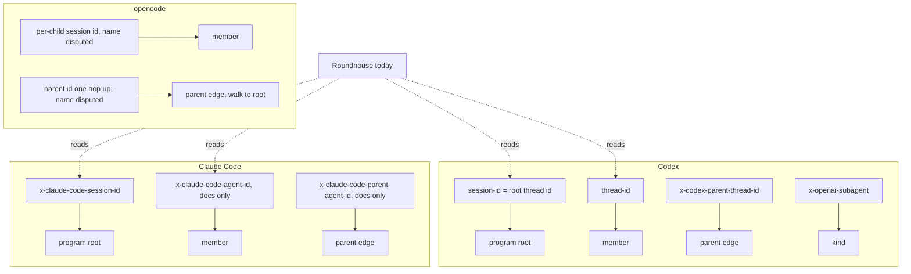
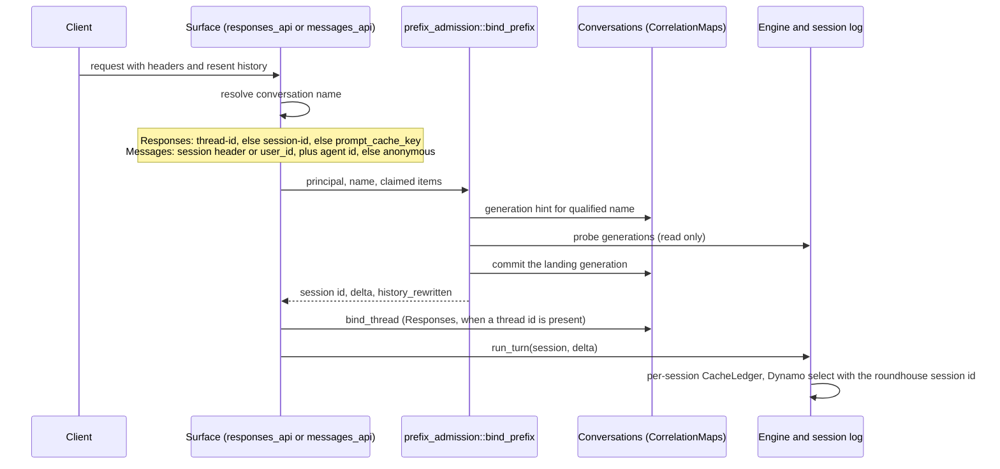

<!--
SPDX-FileCopyrightText: Copyright (c) 2026 NVIDIA CORPORATION & AFFILIATES. All rights reserved.
SPDX-License-Identifier: Apache-2.0
-->

# Program identity signals per client

> **Status: evidence base, 2026-09-29.** Read against Roundhouse `39353e5` (branch `ai/learner-m8-engine`), the Codex Cargo pin `6344a655a5966f92e009a74928fb0559b41f9093`, the Dynamo Cargo pin `ac7b7513790ef1d619b46f805aea03c9f21200ba`, and the llm-d "Flow Control: North Star" proposal (baseline llm-d-router `8bd261f1`, text captured 2026-09-29). No code changed. No Cargo command ran. Add dated notes when an upstream changes. Do not silently revise this snapshot. The ruling that uses this evidence is `../synergies/session-identity-first-proposal.md`.

## 0. Result

A **program** is the tree of conversations that one agent task makes: a root conversation, the sub-agents it spawns or forks, and their turns. A **member** is one conversation in that tree. Roundhouse binds each member to its own append-only log today. It records no link between members, and it has no program identity.

Each client declares part of the tree on the wire, and each client does it differently:

- **Codex** declares the root on every request. `session-id` carries the root thread id for the whole agent family. `thread-id` names the member. `x-codex-parent-thread-id` names the parent. `x-openai-subagent` names the kind of sub-agent. Roundhouse reads `session-id` and `thread-id` only.
- **Claude Code** declares the root on every request of an in-process sub-agent, because the sub-agent inherits `x-claude-code-session-id`. The documented `x-claude-code-agent-id` names the member, and `x-claude-code-parent-agent-id` names a nested parent. Neither header was seen on the wire in a roundhouse capture. Roundhouse reads the session header and the agent header. It does not read the parent header.
- **opencode** mints a new session id per child and sends the parent id one hop up, according to the flow-control document. Two sources disagree on the header names. Roundhouse reads none of them.

Two kinds of child exist, and they need different evidence:

- A **context fork** starts with a copy of part of the parent's history. Its first request resends items that roundhouse emitted for the parent.
- A **fresh spawn** starts with only a task prompt. It shares the client's system prompt and tool preamble with the parent, and with every other session of that client. It shares no parent-specific content, except possibly the task prompt, which the parent's model wrote as a tool-call argument (unverified, see section 10).

## 1. Method and claim tags

Every claim carries one tag:

- **[codex@6344a65 path:line]**: read in the Codex Cargo checkout at `~/.cargo/git/checkouts/codex-9eee5d47a939c68c/6344a65/codex-rs`. This is the wire-conformance oracle. The Codex binary on this box is older and on another line (`codex-0.146.0-vs-pin-vigilance.md`). A live capture can disagree with this pin.
- **[dynamo@ac7b751 path:line]**: read in the Dynamo Cargo checkout at `~/.cargo/git/checkouts/dynamo-66ea943fd73cd568/ac7b751`.
- **[rh path:line]**: Roundhouse source at `39353e5`.
- **[rh-doc file]**: an existing Roundhouse research document. Its own evidence rules apply.
- **[fc section]**: the flow-control document only. Not verified against a harness source here.

No opencode checkout and no llm-d-router checkout exist on this box. Every opencode claim is therefore [fc] or [dynamo]. Every llm-d claim is [fc] or [rh-doc].

## 2. Terms

| Term | Meaning here | Other names |
|---|---|---|
| program | The whole tree of one agent task. | llm-d: program `(tenant, root)` [fc Workload §3]. Dynamo ThunderAgent: `program_id` is one chain, not the tree [dynamo@ac7b751 docs/fern/pages/use-cases/agents/thunderagent-program-scheduler.md "The Scheduler"]. |
| member | One conversation in the tree. It has one append-only history. | Codex: thread. Claude Code: agent. Dynamo: session (one reasoning chain) [dynamo@ac7b751 docs/fern/pages/use-cases/agents/session-ids.mdx]. |
| root | The first member of the tree. | Codex: the root thread, whose id is the family session id. |
| context fork | A child that starts with a copy of parent history. | Codex `fork_context: true` or `fork_turns`. Claude Code `--fork-session`. |
| fresh spawn | A child that starts with only a task prompt. | Codex `fork_context` false or `fork_turns: "none"`. |
| generation | A Roundhouse fork of one conversation key after the client edits its own history (`{key}#g{n}`). | Not a program fork. It stays in the same member lineage. |
| priority band | The flow-control priority class. | Not the learner's complexity `Band` [rh crates/roundhouse-core/src/routing/learn/input.rs:26]. |

## 3. Codex

### 3.1 Wire fields

| Concept | Wire field | Value | Source | Roundhouse reads it |
|---|---|---|---|---|
| Program root | `session-id` header | `responses_metadata.session_id` | [codex@6344a65 core/src/client.rs:622-625, :1134-1137], built by [codex-api/src/requests/headers.rs:5-13] | Yes [rh crates/roundhouse-server/src/request_context.rs:28] |
| Program root, second carrier | `x-codex-turn-metadata` JSON `session_id` | same value | [codex@6344a65 core/src/responses_metadata.rs:27, :355] | MCP surface only, as a name [rh crates/roundhouse-mcp/src/transport.rs:171-176]. Not on the turn path. |
| Member | `thread-id` header, and turn metadata `thread_id` | the member thread id | [codex@6344a65 core/src/client.rs:622-625], [core/src/responses_metadata.rs:28, :356] | Header yes [rh request_context.rs:29]. Metadata yes [rh crates/roundhouse-server/src/responses_api.rs:561-570] |
| Parent (one hop up) | `x-codex-parent-thread-id` header, and turn metadata `parent_thread_id` | parent thread id | [codex@6344a65 core/src/client.rs:147], [core/src/responses_metadata.rs:39, :330-336, :363] | No |
| Fork origin | turn metadata `forked_from_thread_id` | origin thread id | [codex@6344a65 core/src/responses_metadata.rs:38, :362] | No |
| Parent turn, root turn | turn metadata `parent_turn_id`, `root_turn_id` | turn ids | [codex@6344a65 core/src/responses_metadata.rs:40-41, :364-365] | No |
| Sub-agent kind | `x-openai-subagent` header, and turn metadata `subagent_kind` | `review`, `compact`, `memory_consolidation`, `collab_spawn`, or a custom label | [codex@6344a65 core/src/responses_metadata.rs:385-404], [core/src/client.rs:741-747] | No |
| Request kind | turn metadata `request_kind` | `turn`, `prewarm`, `compaction`, `memory` | [codex@6344a65 core/src/responses_metadata.rs:135-150] | No |
| Context window | `x-codex-window-id` | `thread_id:window_number` | [rh-doc agent-session-context.md §2.2] | Yes, as an observation [rh request_context.rs:30] |
| Cache hint | body `prompt_cache_key` | `session_id` unless overridden | [codex@6344a65 core/src/client.rs:484-488] | Yes. It names the conversation when no header is present [rh request_context.rs:32-54] |

### 3.2 How the root value is chosen

- A non-root session takes the family session id from `AgentControl`. A root session uses its own thread id [codex@6344a65 core/src/session/session.rs:671-677].
- `AgentControl` is created once per root tree and shared with every sub-agent. Its comment says that every sub-agent from a common root shares the same session id [codex@6344a65 core/src/agent/control.rs:100-107].
- `is_non_root_agent` is true for `SubAgent` and `Internal` sources [codex@6344a65 protocol/src/protocol.rs:2702-2707]. The flow-control document lists a "Codex memory-consolidation header check" as open [fc Workload §5.1]. This read did not trace which `AgentControl` an internal memory-consolidation session gets.
- The spawn path sets `parent_thread_id` on the spawn request [codex@6344a65 core/src/thread_manager.rs:1625, :1661, :1696]. `TurnMetadataState` copies it into the turn metadata [codex@6344a65 core/src/session/turn_context.rs:618-622], [core/src/turn_metadata.rs:125-165].

### 3.3 What a Codex child carries from its parent

- `spawn_agent` v1 has `fork_context`: "True forks the current thread history into the new agent. False or omitted starts with only the initial prompt" (quoted with punctuation adjusted) [codex@6344a65 core/src/tools/handlers/multi_agents_spec.rs:603-608].
- `spawn_agent` v2 has `fork_turns`: `none`, `all` (the default), or a positive number of most recent turns [codex@6344a65 core/src/tools/handlers/multi_agents_spec.rs:647-651, :768].
- Consequence: a v1 child with default arguments and a v2 child with `fork_turns: "none"` are fresh spawns. A v2 child with a number is a partial fork. It keeps the instructions and the recent turns, and it drops the root user item.
- Default limits: at most 6 agent threads and a maximum depth of 1 [codex@6344a65 core/src/config/mod.rs:209, :281].

## 4. Claude Code

### 4.1 Wire fields

| Concept | Wire field | Source | Roundhouse reads it |
|---|---|---|---|
| Program root | `x-claude-code-session-id` header | Seen on four root requests at 2.1.272 [rh-doc agent-session-context-claude-wire-addendum-2026-09-16.md §3]. Seen at 2.1.247 [rh-doc claude-code-client-surface.md, addendum item 2]. | Yes [rh crates/roundhouse-server/src/messages_api/wire.rs:67, :236-250] |
| Program root, body carrier | `metadata.user_id`, JSON string with `session_id` (2.1.247 and later) or `user_<hex>_account_<uuid>_session_<uuid>` (2.1.42) | [rh-doc claude-code-client-surface.md §4.2, addendum item 1] | Yes [rh wire.rs:299-322] |
| Member (sub-agent) | `x-claude-code-agent-id` header | Documented only. Absent from 2.1.42. Not seen in any capture [rh-doc claude-code-client-surface.md:610, :819-820] | Yes, as part of the member name `anthropic_messages/{session}/agent/{id}` [rh wire.rs:78, :286-291] |
| Parent (nested sub-agent) | `x-claude-code-parent-agent-id` header | Documented only [rh-doc claude-code-client-surface.md:611] | No |
| Emitted call correlation | `_meta["claudecode/toolUseId"]` on MCP `tools/call` | Captured [rh-doc claude-code-client-surface.md §5, item 6] | Yes, for the MCP surface [rh crates/roundhouse-server/src/conversations.rs:637] |

### 4.2 Lifecycle facts

- In-process sub-agents share the parent's session id at 2.1.42. The agent id stays out of the request body [rh-doc claude-code-client-surface.md §4.3].
- Agent-teams teammates run as separate processes with `--parent-session-id <uuid> --agent-id <id>`. Each teammate has its own session value. The parent link exists only on its command line [rh-doc claude-code-client-surface.md §4.3].
- `/clear` mints a new session id. `--remote` adopts a server-minted id. Compaction keeps the id. `--resume` and `--continue` restore it [rh-doc claude-code-client-surface.md §4.3].
- `--fork-session` copies history into a new session id [rh-doc agent-session-context-claude-wire-addendum-2026-09-16.md §4].
- A Claude Code sub-agent has its own context window and transcript [rh-doc agent-session-context-claude-wire-addendum-2026-09-16.md §4]. A Task-tool sub-agent is therefore a fresh spawn in content terms.
- The flow-control document says Claude Code reuses one root session id across the parent and every sub-agent depth [fc Workload §3.2]. That agrees with the in-process finding. It does not cover teammates.

## 5. opencode

- opencode mints a new session id per child, sends the parent id one hop up, and omits the parent id on compaction and title calls [fc Workload §3.2, Client Wire Conventions §2.1].
- Nesting reaches three layers by default "in one harness" [fc Workload §3.2]. The document does not name the harness.
- **The header names are disputed.**
  - llm-d-router's `agent-identity` plugin lists `x-session-affinity` for opencode [rh-doc k8s-gateway-inference-deep-dive.md:302, citing `lldr@e051872`].
  - Dynamo maps opencode's `x-session-id` to the session and `x-parent-session-id` to the parent [dynamo@ac7b751 lib/llm/src/protocols/agents.rs:11-12, :39-44], [docs/fern/pages/use-cases/agents/session-ids.mdx "OpenCode" tab].
  - The flow-control wire example uses `x-session-affinity` for the child session and leaves the parent header unnamed [fc Client Wire Conventions §5 example].
- **Roundhouse reads no opencode header** (grep of `crates/` for `x-session-affinity`, `x-session-id`, `x-parent-session-id` finds nothing).
- **Unverified consequence.** A Responses request with no `thread-id`, no `session-id`, and no `prompt_cache_key` is refused with 422 [rh request_context.rs:35-38]. A Messages request with no Claude session header and no `metadata.user_id` gets a fresh anonymous session on every request [rh crates/roundhouse-server/src/messages_api.rs:370, :546-553]. Whether opencode sends `prompt_cache_key` or `metadata.user_id` is not established. If it sends neither, opencode is not served transparently today.

## 6. Other carriers of lineage

| Carrier | Fields | Source |
|---|---|---|
| Dynamo canonical headers | `x-dynamo-session-id` (one chain), `x-dynamo-parent-session-id`, `x-dynamo-session-final` | [dynamo@ac7b751 lib/llm/src/protocols/agents.rs:14-16], [docs/fern/pages/use-cases/agents/session-ids.mdx]. Dynamo says that session identity is passive metadata and does not change placement unless a session-aware policy is configured. |
| Dynamo agent-header map | Claude Code session, agent, parent-agent. Codex `session-id`. opencode `x-session-id`, `x-parent-session-id`. A top-level Claude child falls back to the session id as its parent. | [dynamo@ac7b751 lib/llm/src/protocols/agents.rs:8-95] |
| Dynamo ThunderAgent | A `ProgramTable` keyed by the header-derived session id, a sticky worker pin from `assigned_worker_id`, real-token accounting, and tool-boundary pause and resume. Experimental. | [dynamo@ac7b751 docs/fern/pages/use-cases/agents/thunderagent-program-scheduler.md "Architecture"] |
| llm-d-router `agent-identity` | First present of `x-claude-code-session-id`, `x-session-affinity`, `session-id`, `session_id` becomes the fairness id when no fairness header is set. | [rh-doc k8s-gateway-inference-deep-dive.md:302], [fc Client Wire Conventions §1.1] |
| llm-d target design | `(tenant, derived_root)`, a per-replica parent map, band inheritance, and six candidate harness fields with no names yet (root session id, parent id, sibling count, kind, retry marker, declared close). | [fc Workload §3.2-§4.2, Client Wire Conventions §2.1] |
| Switchyard `Metadata` | 16 normalized fields from an alias table that covers Codex turn metadata, Claude Code headers, `x-dynamo-*`, and `x-openai-subagent`. | [rh-doc relay-switchyard-dedup-deep-dive.md item 8] |

## 7. How Roundhouse identifies a conversation today

- **Responses name.** `conversation_key` is `thread-id`, else `session-id`, else `prompt_cache_key`. When all three are absent, the request is refused [rh request_context.rs:22-54]. The handler binds the turn metadata thread to the session after admission [rh responses_api.rs:361-373, :499-516].
- **Messages name.** `session_key` is the session header, else `metadata.user_id`, scoped by dialect and by agent id [rh wire.rs:236-291]. With no name, the key is `anonymous-{pid}-{ms}-{counter}` [rh messages_api.rs:370, :546-553]. That key is deliberately not content-derived. The comment says that a content-derived name gives two anonymous callers one shared session log [rh messages_api.rs:533-545].
- **Prefix admission.** A name maps to a family of generations. Admission searches that family for the longest agreeing generation, probes before it commits, and opens a fresh generation only on disagreement [rh crates/roundhouse-server/src/prefix_admission.rs:1-122, :184-260]. It never compares one name's history with another name's history. A fresh generation starts with no ledger state, and "the next turn is priced cold" [rh prefix_admission.rs:227-240].
- **Correlation maps.** Generations, emitted call ids, and thread bindings live in `CorrelationMaps`, with an in-process and a Redis implementation [rh crates/roundhouse-core/src/control/correlation.rs:238-278], [rh crates/roundhouse-server/src/conversations.rs:1-60]. A call id bound to two sessions of one principal becomes ambiguous and resolves to nothing [rh correlation.rs:256-271]. Only the Messages follower writes call bindings [rh crates/roundhouse-server/src/messages_api/follower.rs:270].
- **Content fingerprint.** `prefix_fingerprint` hashes the typed leading system, developer, and first user items under `roundhouse-prefix-v1` [rh request_context.rs:73-90]. It is a cache hint and an observation, and the code states that it "cannot supply the missing identity of an append-only history" [rh request_context.rs:33-34]. `observe_context` reports `first_seen`, `prefix_changed`, `window_changed`, `history_rewritten`, or `prefix_unchanged` [rh conversations.rs:583-614].
- **Cache ledger.** `CacheLedger` is a field of `SessionState` [rh crates/roundhouse-core/src/session.rs:358]. It is a projection of one session's log [rh session.rs:773]. It keeps one `TargetState` per target: last call time, last prefix tokens, segment count, and block marker [rh crates/roundhouse-core/src/routing/ledger.rs:422-483, :494-578].
- **Local fleet.** The engine sends the Roundhouse session id to Dynamo `select` [rh crates/roundhouse-server/src/engine.rs:2184-2190]. The select request always sets `pinned_worker: None` and `allowed_worker_ids: None` [rh crates/roundhouse-fleet/src/local.rs:100-137]. The quote returns `worker_id`, `dp_rank`, `effective_prefill_tokens`, `longest_matched_tokens`, and `load` [rh local.rs:140-160]. Dynamo carries `session_id`, `pinned_worker`, and `allowed_worker_ids` in `SelectRequest` [dynamo@ac7b751 lib/kv-router/src/services/selection/types.rs:411-415]. A grep of `lib/kv-router/src` found no reader of `session_id` beyond struct plumbing. **That negative needs an independent check.**
- **Affinity policy.** `AffinityPolicy` scores candidates on normalized expected prefill, cost, and TTFT. It holds no session or program state [rh crates/roundhouse-core/src/routing/policy.rs:98-200].
- **Outbound identity.** A frontier dispatch forwards the client's own `session-id`, `thread-id`, and `prompt_cache_key` [rh engine.rs:3033-3035], [rh crates/roundhouse-fleet/src/openai_responses.rs:403-413].
- **Learner scope.** Arm assignment is per session [rh crates/roundhouse-core/src/validate/arm.rs:105]. The exploration draw hashes the session and the response [rh crates/roundhouse-core/src/routing/learn/explore.rs:45]. The gate counts `min_sessions` [rh crates/roundhouse-core/src/routing/learn/gate.rs:215]. The estimand report uses a session-clustered bootstrap [rh-doc PLAN-online-routing-learner.md:94].

## 8. Content signals Roundhouse already holds

| Signal | What it proves | What it does not prove |
|---|---|---|
| `prefix_fingerprint` (system, developer, first user item) | Two requests share the leading prefix. | That they belong to one task. Every session of one client version shares the system prompt and tool preamble. |
| Dynamo block and sequence hashes (`TokenBuffer`) | Token-level prefix identity for one tokenizer and block size. | Anything across tokenizers. It is not built for a member before its first turn. |
| An emitted call id in a resent history | The client copied history that this deployment emitted for a known session. | Which member is the nearest parent, when the id appears in several copies. |
| The turn metadata thread binding | The session that served a Codex thread. | Anything for a thread that no node served. |

## 9. What is missing

1. No program identity and no member-to-member link exist anywhere in Roundhouse.
2. Roundhouse reads none of `x-codex-parent-thread-id`, turn metadata `parent_thread_id`, `forked_from_thread_id`, `root_turn_id`, `subagent_kind`, `request_kind`, or `x-openai-subagent`.
3. Roundhouse reads `x-claude-code-agent-id` but not `x-claude-code-parent-agent-id`. A nested Claude sub-agent therefore loses its parent edge. Its program root survives because the session header is shared.
4. Roundhouse reads no opencode or `x-dynamo-*` lineage header.
5. A context fork that arrives under a new name (Claude `--fork-session`, a Codex fork under a new thread) opens a fresh session and is priced cold. Nothing tells the engine that the parent's targets hold its prefix.
6. The Responses surface does not bind the call ids it emits. A fork detector built on the call map therefore covers only Messages traffic today.
7. The Dynamo select request never uses `pinned_worker` or `allowed_worker_ids`. Program-level worker stickiness has an existing lever that nothing pulls.
8. No target kind exists for an llm-d-routed pool. Roundhouse sets no `x-llm-d-*` header and reads no `x-llm-d-request-dropped-reason`.

## 10. Conflicts and open evidence

| Question | What the sources say | What closes it |
|---|---|---|
| opencode header names | `x-session-affinity` (llm-d plugin, fc example) versus `x-session-id` and `x-parent-session-id` (Dynamo). | An opencode source read at a pinned revision, and a sanitized wire fixture. |
| Codex nesting depth | fc cites three layers by default in one harness. Pinned Codex has `DEFAULT_AGENT_MAX_DEPTH = 1` [codex@6344a65 core/src/config/mod.rs:281]. | Name the harness. Check Codex HEAD and a live capture. |
| Codex root precedence | fc says to read turn metadata `session_id` before `session-id` because the header "may be replaced for a root thread". At the pin both values come from `responses_metadata.session_id` [codex@6344a65 core/src/client.rs:622-625, core/src/responses_metadata.rs:355]. | A Codex revision where the two differ. |
| Claude sub-agent headers | Documented. Never captured. | A real Claude Code child request with a provider-valid `Agent` tool loop, as the addendum asks [rh-doc agent-session-context-claude-wire-addendum-2026-09-16.md §8]. |
| Spawn prompt equality | Hypothesis: a fresh spawn's first user item equals, or contains verbatim, an argument of the spawn tool call that the parent's model emitted (Codex `message`, Claude Task `prompt`). | Codex and Claude fixtures that compare a digest of the spawn argument with a digest of each block of the child's first user item. |
| Dynamo `session_id` consumer | Plumbed through `SelectRequest` and `SchedulingRequest`. No reader found in `lib/kv-router/src`. | An independent fact-check of the negative, including `lib/llm`. [2026-09-29: closed, no reader; see section 11.] |
| Log state after an in-stream failure | Unknown. The failover boundary is `execute`, and deltas are durable as they arrive [rh engine.rs:2600-2607]. What a client resend after a mid-stream failure does to prefix admission is not established. | A failing-first test. |

## 11. Fact-check, 2026-09-29

An independent read-only re-derivation checked claims from sections 3, 5, 7 and 10 against the same pins (Codex at `~/.cargo/git/checkouts/codex-9eee5d47a939c68c/6344a65`, Dynamo at `~/.cargo/git/checkouts/dynamo-66ea943fd73cd568/ac7b751`). Every checked claim is verified. The Dynamo `session_id` negative from section 10 is closed: the field travels `SelectRequest` to `SelectionOperation` to `ScheduleRequest` to `SchedulingRequest` to `lib/llm/src/kv_router.rs`, and nothing along that path branches on, hashes, or compares it, while `pinned_worker` and `allowed_worker_ids` in the same structs are read for worker selection. The spawn-prompt hypothesis and the log state after an in-stream failure stay open (P0 and P5).

| # | Claim | Ruling | Evidence read | Correction |
|---|---|---|---|---|
| 1 | Roundhouse reads none of `x-codex-parent-thread-id`, `x-openai-subagent`, `parent_thread_id`, `forked_from_thread_id` | **VERIFIED** | `grep -rni` (case-insensitive, no `--include` filter, excluding `target`/`.git`) for all four strings across the whole worktree finds zero hits in `crates/`. The only hits are in `agent-docs/research/*.md` (documentation, not code). `responses_api.rs:562-569` (`codex_thread_id`) parses the `x-codex-turn-metadata` JSON with `serde_json::Value::get("thread_id")` only — it never deserializes a struct carrying the sibling fields, so there is no unused struct field either. | — |
| 2 | At the Codex pin, a sub-agent with default args starts with only its task prompt; a partial fork (`fork_turns: "2"`) drops the root user item; evidence cites `multi_agents_spec.rs:603` and `:647` | **VERIFIED** | `multi_agents_spec.rs:603-608` — `fork_context` field text: "True forks the current thread history into the new agent; false or omitted starts with only the initial prompt." `multi_agents_spec.rs:647-651` — `fork_turns` field text: "Optional number of turns to fork. Defaults to `all`. Use `none`, `all`, or a positive integer string such as `3`..." The v1/v2 split, defaults, and wording are exactly as cited. The "drops the root user item" behavior is implemented in `thread_rollout_truncation.rs:261-275` (`truncate_rollout_to_last_n_fork_turns`) and exercised by `thread_rollout_truncation_tests.rs:474-489` (`..._drops_startup_prefix_even_when_under_limit`), which asserts that even when `n_from_end` exceeds the turns present, only the item run from the first turn boundary onward survives — the leading pre-turn item is dropped. This is a direct consequence of "keep only the last N turns" semantics, not a separate special case. | — |
| 3 | Codex sends `session-id` for the root and `x-codex-parent-thread-id` for a sub-agent's parent | **VERIFIED** | `codex-api/src/requests/headers.rs:5-13` (`build_session_headers`) sets `session-id` from `responses_metadata.session_id` and `thread-id` from `responses_metadata.thread_id`, called at `core/src/client.rs:622-625` and again at `:1134-1137` (websocket path). `session.rs:671-677`: a non-root session (`is_non_root_agent() == true`) takes `agent_control.session_id()` (the shared family/root id); a root session uses `SessionId::from(thread_id)`. `agent/control.rs:100-107`'s doc comment: "every sub-agents from a common root share the same session ID." The parent header itself is built in `responses_metadata.rs:295-298` (`client_metadata`) and `:330-336` (`compatibility_headers`), both keyed off `self.parent_thread_id`, using the constant `X_CODEX_PARENT_THREAD_ID_HEADER` defined at `core/src/client.rs:147`. `compatibility_headers()` is what actually inserts the `x-codex-parent-thread-id` HTTP header when `parent_thread_id` is `Some`. | — |
| 4 | A Responses request with no conversation name is refused with 422 (`request_context.rs:35-38`); a Messages request with no name gets a new anonymous session every turn | **VERIFIED** | `request_context.rs:35-38` (exact lines): `if session_id.is_none() && thread_id.is_none() && cache_key.is_none() { return Err(ApiError::unprocessable(...)) }`. `ApiError::unprocessable` maps to `StatusCode::UNPROCESSABLE_ENTITY` (422) per `messages_api.rs:785`. `messages_api.rs:546-553` (`anonymous_key`) builds `"anonymous-{pid}-{ms}-{counter}"` with an atomically incremented counter, and the doc comment explicitly rejects content-derivation "so two anonymous callers... don't [share] one session log." Test `an_anonymous_name_is_fresh_on_every_call` (`messages_api.rs:855-863`) asserts two calls never collide. | — |
| 5 | Dynamo's `SelectRequest` has `pinned_worker` and `allowed_worker_ids`, and Roundhouse never sets either (`local.rs:100-137`) | **VERIFIED** | Dynamo: `lib/kv-router/src/services/selection/types.rs:411-414` declares both fields (`Option<WorkerWithDpRank>` and `Option<HashSet<WorkerId>>`). Roundhouse: `roundhouse-fleet/src/local.rs:100-137` (`to_select_request`) literally writes `pinned_worker: None, allowed_worker_ids: None,` at lines 131-132. A repo-wide grep for both identifiers outside `tests/` shows `local.rs:131-132` is the *only* construction site in the whole workspace — there is no second code path that sets either field. | — |
| 6 | Dynamo at `ac7b751` never reads `session_id` for routing (evidence's own grep was scoped to `lib/kv-router/src` only) | **VERIFIED, widened** | Traced the full plumbing chain: `SelectRequest.session_id` → `SelectionOperation.session_id` (`services/selection/core/mod.rs:682,717,741`) → `ScheduleRequest.session_id` (`:806`) → `SchedulingRequest.session_id` (`scheduling/local.rs:79,99`) → `lib/llm/src/kv_router.rs:772-1010` (further pass-through parameters). At every hop the field is destructured and re-packed into the next struct literal; grepping the entire `lib/kv-router` tree for `session_id` occurrences that are *not* a struct-literal assignment, a field declaration, or a `None` default returns **zero** results — i.e., the field is never read in a conditional, hash, comparison, or worker-selection expression anywhere in the crate. By contrast, `pinned_worker`/`allowed_worker_ids` from the very same struct *are* read for real decisions (`filter.rs:79-85,203,239-249`, `queue.rs:75,556,609,800,1244-1266`, `selector/mod.rs:246,301-303`, `selector/default.rs:400`) — confirming the asymmetry is real and not an artifact of an incomplete search. `lib/llm/src/engines.rs`'s `session_id` hits are an unrelated local variable (a mock-engine response-id formatter), not this field. No reader of `SelectRequest.session_id`/`ScheduleRequest.session_id` for a placement decision exists anywhere in the Dynamo tree at this pin. | — |
| 7 | An upstream 429 cannot reach the client as HTTP 429 today because the response stream starts before dispatch returns | **VERIFIED** | `responses_api.rs:397-435`: `state.engine.run_turn(...)` (which performs `execute` against upstream candidates, including the failover loop and any 429 handling described at `engine.rs:2600-2612`) is started inside `tokio::spawn` and **not awaited**. The handler then builds `ResponsesFollower` and, at `responses_api.rs:466-473`, immediately constructs `Sse::new(follower.into_stream())...into_response()` and returns `Ok(response)` with status 200. The HTTP response (and its 200 status) is therefore committed to the client before the spawned turn — and any upstream 429 inside it — resolves. This exactly matches the evidence's `engine.rs:2600-2607`/`responses_api.rs:321-329`-region citations (line numbers shifted slightly by intervening comments but the code path is identical). | — |
| 8 | A fork child today opens a fresh session and is priced cold (`prefix_admission.rs:227-240`) | **VERIFIED** | `prefix_admission.rs:227-240` (`Search::Fresh` arm) — read verbatim, including the comment: "the new session starts with no history — the routing ledger no longer knows any provider is warm for it and the next turn is priced cold." Matches the evidence's citation exactly. | — |
| 9a | Roundhouse reads no opencode header (`x-session-affinity`, `x-session-id`, `x-parent-session-id`) | **VERIFIED** | `grep -rn` for all three strings across `crates/**/*.rs`: zero hits. | — |
| 9b | Roundhouse sets no `x-llm-d-*` / `x-gateway-inference-*` header and no `x-dynamo-*` header | **VERIFIED** | `grep -rn "x-llm-d\|x-gateway-inference"` and `grep -rn "x-dynamo-"` across `crates/**/*.rs`: zero hits for both. Confirms evidence §9 item 8 (no llm-d target kind) and the "Set toward a Dynamo HTTP pool" row in the proposal is describing a *future* state, not current code. | — |
| 9c | Roundhouse reads `x-claude-code-agent-id` but not `x-claude-code-parent-agent-id` | **VERIFIED** | `messages_api/wire.rs:78`: `pub const AGENT_HEADER: &str = "x-claude-code-agent-id";`, used at `:236-250` and `:286-291`. Grep for `x-claude-code-parent-agent-id` / `parent-agent-id` / `parent_agent_id` across `crates/**/*.rs`: zero hits. | — |
| 9d | Only the Messages follower writes call bindings; the Responses surface does not | **VERIFIED** | `messages_api/follower.rs:270` calls `self.conversations.bind_call(...)`. Grep for every `bind_call` call site in the workspace: the only non-test, non-library-definition, non-Redis-script call site is `follower.rs:270`. `responses_api.rs` has no `bind_call` call anywhere. | — |
| 9e | `AffinityPolicy` holds no session or program state (`policy.rs:98-200`) | **VERIFIED** | `routing/policy.rs:98-113`: the struct has exactly two fields, `weights: Weights` and `max_load: Option<f64>` — both static tuning knobs, no session/program identifiers, no mutable per-call state. | — |
| 9f | Today a local target does not fail over at all | **VERIFIED** | `engine.rs:2609`: "**A local target does not fail over**, and that is this rung's stated scope rather than an oversight..." — exact line match to the evidence's `engine.rs:2609-2612` citation. | — |
| 9g | Codex default agent-thread and depth limits: `DEFAULT_AGENT_MAX_THREADS = Some(6)`, `DEFAULT_AGENT_MAX_DEPTH = 1` | **VERIFIED** | `config/mod.rs:209`: `pub(crate) const DEFAULT_AGENT_MAX_THREADS: Option<usize> = Some(6);`. `config/mod.rs:281`: `pub(crate) const DEFAULT_AGENT_MAX_DEPTH: i32 = 1;`. Matches evidence §3.3 exactly (the doc rounds to "at most 6 agent threads and a maximum depth of 1"). | — |

## Summary of anything not VERIFIED

**None.** All nine claims (1–8, plus the seven additional negatives spot-checked under item 9) were
independently re-derived from source and ruled **VERIFIED**, including the two the evidence document
flagged as needing independent confirmation: claim 6 (Dynamo `session_id` routing-read, widened from
`lib/kv-router/src` to the full plumbing chain through `lib/llm/src/kv_router.rs`, with zero reads found
anywhere, versus confirmed real reads of the sibling `pinned_worker`/`allowed_worker_ids` fields in the
same structs — ruling out "the grep was just too narrow" as an explanation), and claim 7 (the 429/stream
ordering, confirmed by reading the actual `tokio::spawn` / `Ok(response)` sequence in
`responses_api.rs:397-473`, not just the surrounding comments). No claim required correction.
