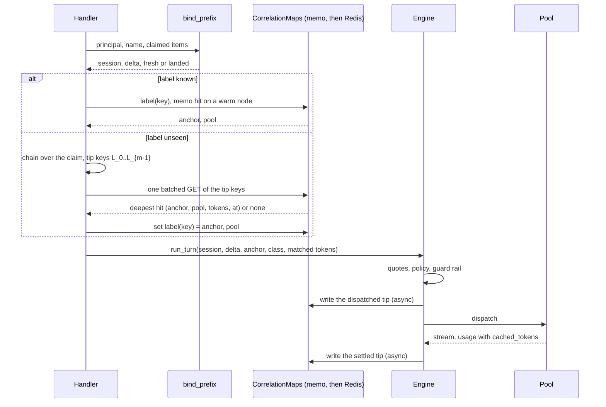
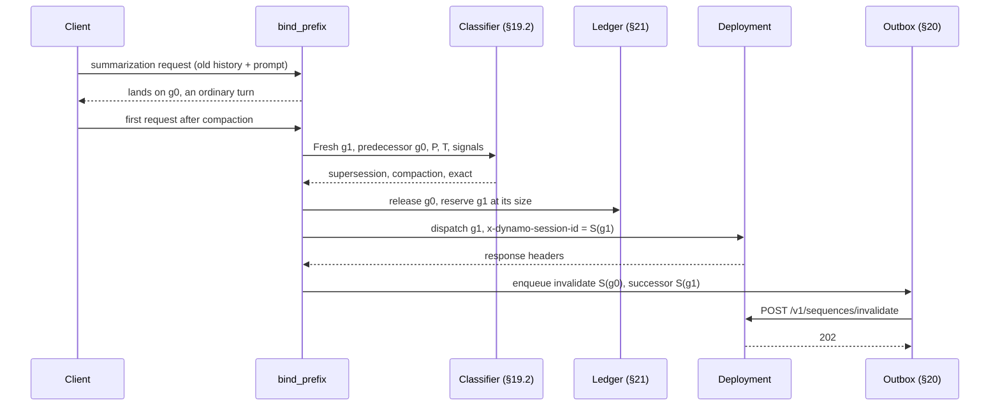

<!--
SPDX-FileCopyrightText: Copyright (c) 2026 NVIDIA CORPORATION & AFFILIATES. All rights reserved.
SPDX-License-Identifier: Apache-2.0
-->

# Prefix-anchored routing to sticky Dynamo pools

> **Status: proposal, 2026-09-29. Not ruled.** Written to the owner's ruling in the addendum of `session-identity-first-proposal.md`, which it replaces. Evidence: `../research/prefix-anchored-routing-evidence.md` (cited as "evidence §n"). Written against Roundhouse `2dd40dd`, Codex pin `6344a65`, and Dynamo pin `ac7b751`. Section 12 lists the questions for the owner. When the owner rules, add a dated addendum. Do not rewrite this text.

## 0. Summary

- **The unit is KV overlap.** Roundhouse computes a chain of digests over the canonical items of the prompt it dispatches, one link per item. It stores the chain value at two points of each turn: the end of the dispatched prompt, and the end of the settled response. These are **tips**.
- **The per-item digest is built on `Item::render()`.** Prefix admission has no digest of its own. It compares items structurally, and structural agreement implies equal renders. The render is also what the turn id, the token buffer, and the admitted token count already use (evidence §2).
- **A session label is the conversation key** that prefix admission already resolves. A known label routes to its bound pool with no content lookup. An unseen label triggers one batched longest-match lookup of its prompt's boundaries against stored tips.
- **The anchor** is the identity of a KV lineage. An unseen label that matches a stored tip inherits that tip's anchor and pool. An unseen label that matches nothing is **new**, and its anchor is the keyed tip of its own first prompt. The anchor is stored once and never recomputed.
- **Why not a fixed first-N hash.** A Claude Code session changed item 2 of its own prompt between two turns (evidence §5). A hash recomputed at any N of 3 or more therefore drifts inside one session. A hash stored once is only the label binding again. Longest match needs no client knowledge and also returns how much overlaps.
- **Pools are sticky.** A pool is a Dynamo deployment with its own router. Roundhouse keeps a label on its pool. It moves a label only when the pool is down, when policy or budget refuses it, or when the guard rail refuses a new session.
- **The guard rail limits net-new prefill per pool per window.** Net-new prefill is admitted input tokens minus the cached tokens that are certain. An uncertain hit counts as net-new. The charge is corrected from the pool's measured `cached_tokens` after the response.
- **First measurable gain (M3):** the measured cache-hit ratio per pool, from Dynamo's `usage.prompt_tokens_details.cached_tokens` recorded as `CacheReadSource::Provider`, in `cache_reuse_evidence`. A two-pool mocker replay compares label stickiness against a load-only pool choice.

## 1. Terms

- **Item**: one canonical conversation item, as the surfaces canonicalize it.
- **Render**: `Item::render()` [rh crates/roundhouse-core/src/item.rs:419].
- **Chain value** `c_i`: the unkeyed digest of items `0..=i`. It stays in process memory.
- **Tip**: the keyed lookup key of a chain value at the end of a dispatched prompt or a settled response. Only tips are stored.
- **Label**: the qualified conversation key, `ControlPlane::qualify(principal, name)`, without the `#g{n}` generation suffix [rh crates/roundhouse-server/src/prefix_admission.rs:184].
- **Anchor**: a 16-byte keyed value that names one KV lineage. Forks that resend a lineage's prompt share its anchor.
- **Pool**: a Dynamo deployment with its own router. The embedded fleet is one pool whose router runs in process.
- **Class** of a first turn: **continuation** (known label), **inherited** (unseen label, tip matched), or **new** (unseen label, no tip matched).

## 2. The anchor: exact form

### 2.1 Reuse, not a second spelling

| Existing encoding | Relation to this design |
|---|---|
| `same_item` (prefix admission) | Not a digest. The chain must not split two claims that admission treats as one conversation. `same_item(a, b)` implies `render(a) == render(b)`, because the render leaves out `namespace` and `response_id` (evidence §2). The first test of M1 pins this. |
| `Item::render()` | **The per-item encoding the chain hashes.** It is already computed per item by `ContextAssembler::push`, `admitted_input_tokens`, and `turn_id_for` [rh crates/roundhouse-core/src/context.rs:216], [rh crates/roundhouse-server/src/engine.rs:1918], [rh crates/roundhouse-server/src/responses_api/wire.rs:221]. |
| `turn_id_for` (FNV-1a) | Unchanged. It is a durable idempotency id, and a change would make an in-flight retry miss its response. FNV is also unkeyed and not collision resistant, so it cannot be a routing key. |
| `prefix_fingerprint` | **A second spelling.** It serializes `(role, content)` with serde and includes `namespace`, so it can split two claims that `same_item` joins. M2 re-derives it from the chain (section 12, question 10). Its value is forwarded upstream as the fallback `prompt_cache_key` [rh engine.rs:3023], so the change moves that value once. |

### 2.2 Definition

```text
d_i  = SHA-256("rh-item-v1\0" || u64be(len(r_i)) || r_i)       r_i = items[i].render()
c_0  = SHA-256("rh-chain-v1\0" || d_0)
c_i  = SHA-256(c_{i-1} || d_i)                                   unkeyed, in memory only
t    = SHA-256(canonical JSON of the declared tools)            zero bytes when none are declared
k_P  = HMAC-SHA256(K, "rh-prefix-scope-v1\0" || namespace(P))   K = deployment secret, P = principal
L_i  = HMAC-SHA256(k_P, "rh-prefix-tip-v1\0" || t || c_i)[..16] the stored tip key
```

- **Where it is computed.** `ContextAssembler::push` already renders each item. It extends the chain from the same string, so the engine gets `c_i` beside `tokens_through(i)` [rh context.rs:231]. The handler uses the same core function over the claim of an unseen label. One function has two callers. There is no second copy.
- **Tools are not in the chain.** Tools are not items, and a tool change must not change the chain that the item history carries. The tools digest `t` enters only the tip key. So a tool change makes a new tip, as it makes a new provider cache prefix (evidence §8). The cost is that a session which appends MCP tools matches nothing that an earlier tool set wrote. That under-claims overlap, which is the safe direction.
- **Configuration is in the chain.** The leading configuration run is part of the dispatched prompt. When a client rewrites it, the KV beyond the edit is lost on every target, so the chain must break there too. A chain that excludes volatile configuration claims overlap that no cache holds.
- **The anchor.** At the first turn of an unseen label, the anchor is the anchor stored on the deepest matched tip. If no tip matches, the anchor is `L_{m-1}` over the first dispatched prompt of `m` items. The anchor is written once, in the label binding and in `SessionCreated`, and is copied to every later generation of the label.

### 2.3 The measured divergence index, per client

| Client | First item that differs between two sessions | Items that make a first request unique | Source |
|---|---|---|---|
| Claude Code 2.1.257 | 0, a 12-bit fingerprint of the typed prompt. Reliable at 4, the typed prompt. | All 6 of the first request | Measured, evidence §3 |
| Codex (pin `6344a65`) | 2 when the working directory or date differ, else 3 (the typed prompt) | All 4 of the first request (5 with multi-agent v2) | Derived from source and tests, evidence §6 |

The first request always ends just after the first typed prompt plus client context. So "the number of items that makes the sequence unique" is, in practice, the whole first request. The tip of the first request is exactly the owner's `hash(cat(message[i]) for i in 0..N)`, and it needs no per-client N.

## 3. Fixed anchor or longest match

| Question | (a) Fixed anchor at a unique boundary N | (b) Longest match over stored tips |
|---|---|---|
| Needs client knowledge | Yes. N is 4 for Codex, 5 or 6 for Claude Code, and moves with versions and features. | No. |
| Stable inside one session | No, if recomputed. Claude Code item 2 changed between turn 1 and turn 2, so any N of 3 or more drifts (evidence §5). If stored once, it is the label binding. | The label binding carries identity. The chain only has to match for unseen labels. |
| Answers "how much overlaps" | No. Yes or no only. | Yes. The matched tip carries its token count. |
| Fork under a new name | Joins only if its first N items equal the parent's. | Joins at the deepest stored tip it resends. |
| Codex v2 full-history fork | Splits at item 2 (evidence §7). | Splits at item 2. Correct for KV. |
| Router state | The anchor per label. | Tips with a TTL (section 4). |
| Reads per turn | 0 | 0 for a known label. One batched read for an unseen label. |

**Recommendation: (b) for placement, with the anchor found by (b) and stored once.** Both need router state. Only (b) is general, and only (b) produces the matched-token count that the price and the guard rail consume.

## 4. Stored state



| Family | Key | Value | Size | Bound and eviction | Where |
|---|---|---|---|---|---|
| `label` | Qualified conversation key, no generation | anchor (16 B), pool id, `bound_at_ms`, `last_turn_at_ms` | About 60 B value | TTL `THREAD_BINDING_STALENESS_MS` (7 days), refreshed per turn [rh crates/roundhouse-core/src/control/correlation.rs:164]. Node memo capped at 4,096, like the generation memo. | Memory or Redis, the implementation the deployment already configures |
| `prefix_tip` | `L_i`, 16 B | anchor (16 B), the dispatch target's `Target::ledger_key` (a pool or a frontier model), `tokens` (u32, the local count through item i), `at_ms` | About 80 B value, about 160 B per Redis entry with overhead (estimate) | TTL 1 hour, refreshed on write. Node memo capped at 65,536 entries (about 6.5 MB), oldest first. | Same |

- **Only tips are stored.** A preamble is never a tip, because no request ends there. So "new" means that no stored tip matched. No "shared" flag and no write race are needed.
- **Growth.** Two tips per turn. At 10,000 turns per hour, about 20,000 live Redis entries, about 3.2 MB (estimate, not measured).
- **The tip names a target, not only a pool.** A fork of a session that was served by a frontier model inherits that model's warm prefix in its ledger seed, and a fork of a pool session inherits the pool.
- **Tip `tokens` leave out the tool declaration.** The ledger's `isl_tokens` include it [rh engine.rs:1918]. So a seed from a tip under-claims the warm prefix by the tool tokens, which is the safe direction.
- **Per-turn cost, known label.** One SHA-256 over the render bytes of each item, inside the assembler rebuild that already renders and tokenizes every item [rh engine.rs:2135]. Zero store reads for identity on a warm node. Two tip writes, pipelined, after dispatch and after the terminal. A turn routed to a pool also pays the guard rail's one window read and one write (section 8.5).
- **Per-turn cost, unseen label.** One chain over the claim (about 26 µs for a fresh Claude Code request at the measured 2.4 GB/s, evidence §11), one HMAC per boundary, and one batched `MGET` of up to 4,096 of the deepest boundaries. The node memo answers first.
- **Loss.** A lost tip costs one cold placement, which is today's behavior. A lost label binding makes the label unseen, and the longest match then finds its own last tip.

## 5. Message boundaries or token blocks

**Recommendation: message boundaries.**

- They are model-agnostic. One chain serves every pool and every frontier target. Provider caches also match exact prefixes, and a message boundary is where Roundhouse already places Anthropic block markers.
- They are computed before a target is chosen. Block hashes need the pool's tokenizer and block size, so a block chain is per pool, and a longest match across pools needs one chain per tokenizer.
- The cost is granularity. An edit inside an item loses the whole item. The Claude Code turn 1 to turn 2 pair shares 5,096 bytes at byte level and 162 bytes at item level (evidence §5). That under-claims, which is the safe direction.

**What Dynamo block hashes add when a pool exposes them.** Inside a pool, the router already matches blocks and can move KV east-west. Roundhouse does not need its own block index for a remote pool. Where a pool answers a residency query (the embedded fleet's `effective_prefill_tokens` [rh crates/roundhouse-fleet/src/local.rs:149]), that answer is the certain cache hit for the guard rail and replaces the message-level prediction for that turn.

## 6. Session labels

- **The label is the name prefix admission already resolves.** Responses: `thread-id`, then `session-id`, then `prompt_cache_key`. Messages: the Claude session header or `metadata.user_id`, scoped by agent id [rh crates/roundhouse-server/src/messages_api/wire.rs:236, :286]. A Claude sub-agent and a Codex sub-agent thread are therefore their own labels, and so new requests, as the owner ruled.
- **Unseen means no `label` entry anywhere.** The generation map cannot answer this question, because `bind_prefix` commits generation zero of a fresh key before the label is read [rh prefix_admission.rs:241, :426-441]. A node that never served the label reads through its memo to the store, as for generations. An expired or lost binding makes the label unseen again, and the longest match then finds the label's own last tip. That restores the same anchor and target.
- **History rewrite.** A new generation (`#g{n}`) or a compaction keeps the label, so it keeps the pool and the anchor. The chain of the new prompt writes new tips under the same anchor. The ledger of the new generation stays cold, as today [rh prefix_admission.rs:227-240]. The pool still holds the configuration prefix.
- **Client resets.** Claude Code `/clear` mints a new session id, so a new label. Its first request matches no tip, so it is new. That agrees with the KV unit.
- **Headerless clients.** An anonymous Messages request gets a fresh key per request [rh crates/roundhouse-server/src/messages_api.rs:546]. Each request is an unseen label, and its longest match finds the previous request's settled tip. So a headerless client gets pool stickiness without a name. Roundhouse writes no `label` entry for an anonymous key, because that key never repeats. Log continuity for such a client is unchanged.

## 7. Pool stickiness

### 7.1 Preference order

1. **Continuation**: the label's pool.
2. **Inherited**: the pool of the deepest matched tip. The label is bound to it.
3. **New**: a pool in its bring-up window with room on its rail (section 8.3). Else the pool with the most room on its rail.

### 7.2 When stickiness yields

| Condition | Action |
|---|---|
| Policy, budget, or the T6 egress rule refuses the pool | The filter wins. Stickiness is a preference inside the admitted set, never an override. |
| Pool unavailable (health check, connect failure, a 503 before the first byte) | Fail over to another pool of the same egress class under the same deadline. Mark the pool down for a cooldown. Rebind the label. |
| The rail refuses a **new** session | Next pool with room. No KV is lost by the move. |
| The rail refuses a **continuation** or **inherited** session | Stay. Wait for room up to a bounded time. A move prefills the whole prefix again elsewhere, which is the load the rail limits. Refuse when the wait ends (section 8.4). |
| A local-only session | Only pools of the local egress class. Never a frontier target. |

After a move, the label is bound to the new pool. The move costs one cold prefill, once.

### 7.3 What the learner and the rules picker see

Quotes, not a new key. A pool candidate's `expected_prefill_tokens` is its input minus the **expected** cached tokens, from the session ledger and the pool's `CacheModel` [rh crates/roundhouse-core/src/routing/ledger.rs:569]. On the first turn of an inherited label, the ledger is seeded with the matched tip's tokens and time for that pool only. The label's pool is warm in the quote and other pools are cold, so stickiness shows in price, TTFT, and cost. `LevelKey` and the rules picker do not change.

Two numbers, two purposes. The **price** uses the expected hit, so that it is unbiased (the cost-signal ruling). The **guard rail** uses only the certain hit, so that it errs toward over-counting load (section 8.1).

## 8. Bring-up and the guard rail

### 8.1 The quantity

```text
net_new(turn, pool) = admitted_input_tokens(turn) - certain_cached(turn, pool)

certain_cached =
    isl - effective_prefill_tokens     when the pool answered a residency query (embedded fleet)
    expected_cached_tokens             when the pool's CacheModel is Deterministic and elapsed < ttl
    0                                  otherwise, including every remote pool without a residency answer
```

- `admitted_input_tokens` is `Engine::admitted_input_tokens`, tools included [rh engine.rs:1918].
- **Reconciliation.** After the response, the window's charge for that turn is replaced by `prompt_tokens - cached_tokens` when the pool's count is `CacheReadSource::Provider` [rh crates/roundhouse-core/src/event.rs:105]. An unmeasured count keeps the full charge.
- **The bound on over-charge.** Before reconciliation, the over-charge is at most the cached prefix of each in-flight request on that pool.
- This mirrors the cost rule. An overstated hit undercounts net-new prefill and can flood a fresh instance. So only a certain hit reduces the charge.

### 8.2 Instance or pool

| Limit | Where it applies | What Roundhouse observes |
|---|---|---|
| Guard rail | **Per pool**, in Roundhouse, before dispatch. Roundhouse controls what enters each pool. | Its own charges. After dispatch, the measured `cached_tokens` and the serving `prefill_worker_id` and `decode_worker_id` from `nvext.extra_fields: ["worker_id"]` (evidence §9). |
| Per-instance prefill load | **Inside the pool**, in the Dynamo router, which books prefill load per worker. | Nothing before dispatch for a remote pool. The embedded fleet quote carries `load` per worker [rh local.rs:158]. |
| Bring-up | **Per pool** in Roundhouse, when a pool is added. Per instance inside a pool is Dynamo's. | The pool's `ready_at_ms` from configuration. Instance membership only after dispatch, from `worker_id`. |

Roundhouse cannot see an instance of a remote pool before dispatch without a worker hint. So this design applies both limits per pool, and asks the owner about hints (section 12, question 1).

### 8.3 Bring-up

- A pool record carries `ready_at_ms`. For a ramp window after it (configured, for example 5 minutes), the pool's rail limit rises in a straight line from a configured start to its full value.
- New sessions prefer a ramping pool while it has room. Continuing and inherited sessions never move to it, because a move re-prefills their prefix.
- The ramp limit is what staggers prefill on the new pool. Without it, every new session in the window lands at once.

### 8.4 When the rail trips

1. A new session goes to the next pool with room.
2. A continuing or inherited session waits for room, up to `min(max_rail_wait_ms, remaining turn deadline)`.
3. When no pool can take the turn, the rail removes all pool candidates. A frontier candidate that policy admits can still serve the turn, unless the session is local-only.
4. When no candidate remains, the turn is refused.

**The tie to D5.** The rail runs at routing, inside the spawned turn. Today a refusal there reaches the client as an in-stream failure, because the surfaces return the stream before the turn routes [rh crates/roundhouse-server/src/responses_api.rs:399, :466]. The recommendation for D5 is to hold the response headers until the engine records its routing decision or refuses, and for a pool also until the pool returns its response headers. The client waits for the first byte in both cases, so time to first token does not change. Then a rail refusal, or a pool's own 429 with no candidate left, can reach the client as HTTP 429 with `Retry-After`. Codex does not retry a 429 on its own (`retry_429: false`) and reads only the `usage_limit_reached` body with `resets_at` (evidence §10). The body for Codex is an owner question (section 12, question 12).

### 8.5 Where the rail's window lives

- **A shared rolling window per pool**, in the store that the deployment already configures, with the fair-use shape: check before dispatch, record after the terminal [rh crates/roundhouse-server/src/http.rs:645], [rh crates/roundhouse-server/src/engine/fair_use.rs:127]. A node-local window lets N nodes admit N times the limit, which defeats the rail.
- **Cost.** One window read at routing and one write at the terminal, per turn routed to a pool. Fair use already pays the same shape per turn.
- **Store outage.** The rail falls back to a node-local window with the limit divided by the configured node count, and logs once per outage. This differs from fair use, which fails closed. A capacity rail that refuses every pool turn during a store outage turns a store fault into a serving outage.

## 9. Scope and privacy

- **Keyed per principal.** `k_P` is derived from a deployment secret and the principal namespace that `ControlPlane::qualify` already uses. Two principals with the same content get unrelated tips. A lookup never crosses a principal.
- **Not reversible.** The store holds only 16-byte HMAC outputs. The unkeyed chain value `c_i` never leaves process memory, so a store reader cannot extend a chain to test guessed content. Without the secret, nobody can compute a tip from content.
- **Never exported.** Tips and anchors never go upstream, into metrics labels, into MCP answers, or into a frontier request. Logs carry at most the first 8 hex characters of an anchor.
- **No secret, no index.** Without the deployment secret, the tip families stay off and labels still work, because a label is a name and not a digest.
- **Rotation.** A new secret changes every tip. Labels survive, so continuing sessions keep their pools. Unseen labels are new until their tips are written again.

## 10. Learner impact (D8)

The learner groups by the anchor, which is the KV lineage that routing uses.

| Site | Today | Change |
|---|---|---|
| Arm assignment | `Arm::for_session` [rh crates/roundhouse-core/src/validate/arm.rs:105] | `Arm::for_anchor`, with `ASSIGNMENT_VERSION` `v2`. A fork that shares its parent's KV shares its parent's arm. |
| `min_sessions` at the gate | Distinct sessions [rh crates/roundhouse-core/src/routing/learn/gate.rs:215] | Distinct anchors. The key name is an owner question (section 12, question 11). |
| Estimand bootstrap | Clustered by session | Clustered by anchor |
| Exploration draw | Per session and response [rh crates/roundhouse-core/src/routing/learn/explore.rs:45] | No change |
| Learning entries | No lineage field | `anchor` with a serde default, for offline analysis |

Arm by anchor works because the anchor is known when the session is created (section 11).

## 11. Durability (D3, D4)

- **D3.** `SessionCreated` gains `anchor: Option<Anchor>` with a serde default. This is the forward-only door that `principal` and `arm` already use. A new event kind would make an older build fail to read the log, because `SessionEventKind` has no catch-all variant. A replay restores the anchor from the first event. The label binding can be rebuilt from it.
- **D4.** Label bindings and tips are soft state in `CorrelationMaps`, memory or Redis. The Redis entry is the shared answer, and the node memo is a write-through cache. A loss costs one cold placement.
- The per-session ledger stays a projection of the session log. The seed on an inherited first turn is recorded on the `Routed` decision that uses it, so a replay prices it the same way.

## 12. Questions for the owner

1. **Worker hints (unruled).** Recommend none toward a remote pool. The pool's router decides and can move KV east-west. The embedded fleet keeps its current in-process selection, which is that pool's router.
2. **Egress class of a pool (D6, unruled).** Recommend an explicit `egress: local | external` per pool in the catalog, with no default. A configuration without it is refused at load. Failover between pools of one class is allowed before the first byte.
3. **Instance or pool for bring-up and the rail (unruled).** Recommend per pool in Roundhouse, per instance in Dynamo (section 8.2). If the owner wants instance-level bring-up for remote pools, the only lever is `x-dynamo-worker-instance-id`, which is a worker hint.
4. **D5.** Recommend holding the response headers until the routing decision or refusal, and for a pool until its response headers (section 8.4).
5. **D7, headers toward a pool.** Recommend `x-dynamo-session-id` set to a keyed digest of the label, derived apart from the anchor. Send no parent header and no llm-d header. The pool is a Dynamo router.
6. **D9, the spawn-argument link.** Recommend dropping it. Fresh spawns are new requests by ruling.
7. **D10, opencode.** Recommend no opencode name in this workstream. Section 6 gives headerless Messages clients pool stickiness through tips. Whether a Responses request with no name is refused stays as is.
8. **New. Identical first requests share an anchor.** Two sessions with byte-identical first requests match each other's tip and share KV, so they share an anchor and an arm. Recommend accepting this.
9. **New. The Claude Code attribution block toward pools.** It is item 0, and it varies with the first prompt, so two sessions share 60 bytes in Roundhouse's item order instead of the system prompt (evidence §3, §8). Recommend dropping it from the dispatch projection toward non-Anthropic targets, only when detected exactly (the literal `x-anthropic-billing-header: cc_version=` block at `system[0]`). The canonical form and admission do not change. This is a client-specific step gated on exact detection, as the owner allowed.
10. **New. `prefix_fingerprint`.** Recommend re-deriving it from the chain in M2. This changes the forwarded fallback `prompt_cache_key` once, for Responses requests that send none.
11. **New. The `min_sessions` key.** Recommend renaming it `min_anchors`, with a load-time refusal of the old key that names the new one.
12. **New. The Codex body for a rail 429.** `usage_limit_reached` is the only 429 that Codex reads, and the rail does clear on its own. Recommend using it with `resets_at` set to the time the window has room.
13. **New. Long warm sessions on a remote pool.** Every turn is charged its full input until reconciliation (section 8.1). Recommend accepting this for M4 and deciding again with the M4 numbers.
14. **New. The deployment secret.** Recommend one secret for all nodes, from the existing secret configuration and never from the catalog.

## 13. Milestones

Each milestone is one PR, cut from `main`. Tests come first. Every run is bounded by a timeout.

**M1: the prefix chain (core, no call site that routes).**

- Tests first:
  - `same_item_agreement_implies_equal_item_digests`: property test over role, content, stamps, and the namespace rule.
  - `a_response_stamp_does_not_move_the_chain`.
  - `an_opaque_block_digests_the_same_in_any_key_order`.
  - `the_assembler_chain_equals_a_chain_recomputed_from_scratch`.
  - `two_principals_never_share_a_tip_key`.
  - `claude_fixture_divergence_is_pinned`: over the pinned 2.1.257 fixtures, two sessions share 0 item links, turn 1 to turn 2 shares 2, turn 2 to turn 3 and the tool loop share all.
- Change: the chain function beside `Item::render`, and the chain in `ContextAssembler`. HMAC-SHA256 through `hmac 0.12`, the RustCrypto crate of the `sha2 0.10` family.
- Done means: the tests pass, and a benchmark reports chain time against tokenization time per 100 KB with `crates/roundhouse-server/tests/data/tinyllama-tokenizer.json`.

**M2: labels and tips, in shadow.**

- Tests first:
  - `a_label_without_a_binding_costs_one_batched_tip_read` and `a_bound_label_costs_no_identity_read` (counters).
  - `an_expired_binding_finds_its_own_last_tip`.
  - `an_anonymous_key_writes_no_label`.
  - `a_fork_under_a_new_name_inherits_the_anchor`: a fixture body resent under a new session header.
  - `a_new_prompt_under_a_new_name_is_new`.
  - `a_history_rewrite_keeps_the_label_pool_and_anchor`.
  - `a_replay_restores_the_anchor_from_session_created`, and a `SessionCreated` written without the field still reads.
  - `an_expired_tip_is_not_matched`.
  - The `CorrelationMaps` contract suite for both new families, memory and Redis.
- Change: the `label` and `prefix_tip` families, `SessionCreated.anchor`, the lookup in the handler, tip writes in the engine, and `prefix_fingerprint` from the chain. Routing does not change.
- Done means: a replay of `use-cases/cache-aware-routing/turns.jsonl` reports class counts and a match-depth histogram, with numbers.

**M3: the Dynamo pool target with label stickiness (first measurable gain).**

- Tests first:
  - Against a stub pool: no client header survives, `nvext.extra_fields` asks for `worker_id`, and `cached_tokens` decodes as `CacheReadSource::Provider`.
  - `a_label_stays_on_its_pool_across_two_nodes` (two engines, one Redis map).
  - `a_policy_refusal_beats_stickiness`.
  - `a_local_only_session_never_leaves_the_local_class`.
  - `a_pool_503_before_the_first_byte_fails_over_and_rebinds`.
  - `an_inherited_first_turn_is_priced_warm_on_the_matched_pool_only`.
- Change: `Target::Pool`, the pool catalog with `egress` and `CacheModel`, the preference order of section 7, and failover between pools of one class.
- First test: `the_pool_reports_cached_tokens`. The Dynamo mocker at the pin does not appear to fill `prompt_tokens_details.cached_tokens` (evidence §9). Either an upstream mocker change fills it from the mocker's own prefill cost, or the run uses a real backend on an owner-approved machine.
- Done means: a two-pool run reports `cache_reuse_evidence` (`observed_total / paired`, measured reads only) per pool row, with stickiness on and with a load-only pool choice. It also reports predicted against observed. The gain is the difference, with numbers.

**M4: the guard rail, bring-up, and D5.**

- Tests first:
  - `an_uncertain_hit_is_charged_as_net_new`.
  - `a_measured_cached_count_reconciles_the_charge`.
  - `a_new_session_moves_when_the_rail_refuses`.
  - `a_continuing_session_waits_then_is_refused_with_retry_after`.
  - `a_ramping_pool_takes_new_sessions_and_never_continuing_ones`.
  - `the_headers_are_held_until_the_routing_decision`, with TTFT unchanged in the stub.
- Done means: a mocker run that brings up a second pool under load shows the net-new prefill per window on the new pool staying under its ramp limit, with numbers.

**M5: learner scope (D8).**

- Tests first: `forks_share_an_arm`, `the_gate_counts_distinct_anchors`, and `the_bootstrap_clusters_by_anchor`.
- Done means: a new assignment version, and the calibrator report names the cluster unit.

## 14. Relation to the rejected proposal

| Rejected text | Now |
|---|---|
| Program id from lineage headers and the emitted-item link | Replaced by the anchor from prefix match. Headers and the link are not used. The owner allows them only as accelerators under exact client detection, and none is needed for M1 to M5. |
| `ProgramRecord`, phases, sibling counts | Dropped. The pool's router owns placement inside the pool. |
| `ProgramBound`, `LedgerSeeded` events | Replaced by `SessionCreated.anchor` and the seed on the `Routed` decision. No new event kind. |
| llm-d trusted-hop headers | Out of scope. A pool is a Dynamo deployment. |
| Worker hints (P4) | Question 1. None by default. |

## 15. Out of scope

- Any change to prefix admission, to the conversation name, or to the refusal for a Responses request with no name.
- A Roundhouse block index for remote pools.
- Queue ordering inside a pool.

## Addendum, 2026-09-29: owner ruling on section 12, first round

- **Question 3 and question 1: accepted as recommended.** Bring-up and the net-new prefill rail apply per pool in Roundhouse and per instance in Dynamo. Roundhouse sends no worker hint toward a remote pool.
- **Question 4 (D5): accepted.** Roundhouse holds the response headers until the routing decision or the refusal, and for a pool until the response headers of the pool. A rail refusal or an upstream 429 then reaches the client as HTTP 429 with `Retry-After`.
- **Question 9: accepted, with a follow-up.** Roundhouse strips the Claude Code attribution block from the dispatch projection toward non-Anthropic targets, and only on the exact match. The owner asked whether the block can serve as a Claude session id. The orchestrator answer: not as an id. It is 12 bits, so two concurrent sessions collide at a probability of 1 in 4,096 per pair, and every prompt that is shorter than 5 characters maps to one value for each version. Exact detection of the block is a reliable signal that the client is Claude Code. Claude Code already sends `x-claude-code-session-id`, which is the exact label.
- **Question 2 (D6, the egress class of a pool): open.** The owner asked for more detail before a ruling.

## Addendum, 2026-09-29: owner ruling on section 12, second round

- **Question 2 (D6): a Dynamo deployment is local.** The layer that this design builds sits above the deployments. It sees several Dynamo deployments, and each session is sticky to one of them.
- **A hash never selects the deployment.** There is no modulo and no rendezvous choice over the deployment set, because operators drain deployments and bring up new ones. The rule is:
  - **A matched session goes to its bound deployment.** The binding is stored. It can be held against an outstanding budget.
  - **A new session goes to the deployment with the lowest total KV load.** New sessions are spread evenly by that measure.
  - **The rail can override that choice.** If the net-new prefill per unit of time on that deployment is over its limit, the new session can go to a different deployment.
- **Session detection is its own crate.** It can depend on some Roundhouse crates, and a later refactor can make it one unified crate. Deriving the session id is the key input to routing.

## Addendum, 2026-09-29: design revision after the second ruling

This addendum applies the first and second owner rulings to the design. It restates in full each section that the rulings change, by section number. Where this addendum and the text above disagree, this addendum wins. Sections 3, 5, 8.1, 8.5, 9, 10, 11, and 14 do not change, except that "pool" reads "deployment". New evidence is in evidence §14.

### §0 (restated). Summary

- **The unit is KV overlap.** Unchanged. A chain of digests over the canonical items gives tips at the end of each dispatched prompt and each settled response.
- **Session detection is its own crate, `roundhouse-session-id`** (§17). It derives the label, detects the client, computes tip keys, and names the anchor. The unkeyed chain primitive stays in `roundhouse-core`, beside `Item::render`, so that the context assembler can extend it with no crate cycle.
- **A deployment is a Dynamo deployment, and it is local** (ruling D6). Roundhouse sees several deployments. Each session is sticky to one.
- **No hash selects a deployment.** A continuation goes to its stored bound deployment. An inherited session goes to the deployment of its deepest matched tip. A new session goes to the eligible deployment with the lowest estimated KV load (§7).
- **The load signal** is the KV utilization of a deployment: in-flight KV blocks over KV capacity, summed over its decode-capable workers (§16). At the Dynamo pin, the only external source is the frontend's `/metrics` scrape of the KV router's own block count (evidence §14.3). Roundhouse corrects the reading for its own placements since the scrape.
- **The rail limits net-new prefill per deployment per window.** Unchanged in its quantity. A continuation waits on the rail and does not move. A new session moves to the next deployment with room.
- **Operators drain and bring up deployments.** A draining deployment takes no new sessions. Its bound sessions stay until idle or until a drain deadline, and then move at their next turn (§8.6).
- **First measurable gain (M4):** the spread of new sessions across two mocker deployments under a burst, and the router-predicted hit rate per deployment. Neither needs the engine's `cached_tokens`, which the mocker does not fill.

### §1 (restated). Terms

- **Item**, **Render**, **Chain value** `c_i`, **Tip**, **Anchor**: unchanged.
- **Label**: the conversation name that `roundhouse-session-id` derives, qualified by `ControlPlane::qualify(principal, name)`, without the `#g{n}` suffix.
- **Deployment**: one Dynamo deployment, reached through its frontend. It replaces "pool" everywhere in this document. The embedded fleet is one deployment whose router runs in process.
- **Deployment state**: `active`, `draining`, or `down` (§8.6).
- **Load reading**: one scrape of a deployment's frontend `/metrics`, with its time.
- **Estimated load** `Û_d`: the load reading plus the tokens that Roundhouse dispatched to deployment `d` since the reading (§16.3).
- **Class** of a first turn: **continuation** (known label), **inherited** (unseen label, tip matched), or **new** (unseen label, no tip matched). Unchanged.
- **Eligible deployment**: a deployment that serves the requested model, passes policy, budget, and egress filters, and is not `down`.

### §2.2 (restated). Definition, and where each part is computed

The formulas do not change:

```text
d_i  = SHA-256("rh-item-v1\0" || u64be(len(r_i)) || r_i)       r_i = items[i].render()
c_0  = SHA-256("rh-chain-v1\0" || d_0)
c_i  = SHA-256(c_{i-1} || d_i)                                   unkeyed, in memory only
t    = SHA-256(canonical JSON of the declared tools)            zero bytes when none are declared
k_P  = HMAC-SHA256(K, "rh-prefix-scope-v1\0" || namespace(P))   K = deployment secret, P = principal
L_i  = HMAC-SHA256(k_P, "rh-prefix-tip-v1\0" || t || c_i)[..16] the stored tip key
```

The parts are split across two crates:

| Part | Crate | Reason |
|---|---|---|
| `d_i`, `c_i` (the chain primitive) | `roundhouse-core`, module `item::chain`, beside `Item::render` | `ContextAssembler::push` extends the chain from the render that it already computes [rh crates/roundhouse-core/src/context.rs:216]. A primitive in the new crate makes core depend on a crate that depends on core. That is a cycle. |
| `t`, `k_P`, `L_i`, the anchor | `roundhouse-session-id` | These are keyed identity. They need a secret and a principal namespace, which the chain does not. |

- The invariant test `same_item_agreement_implies_equal_item_digests` stays in core, next to the primitive it pins.
- **The crate loads no configuration.** The server reads the deployment secret and passes it to `TipKeyer::new` as a value. The crate never reads the environment, a file, or the catalog.
- Tools are not in the chain. Configuration is in the chain. The anchor rule is unchanged: the anchor of the deepest matched tip, else `L_{m-1}` of the first dispatched prompt.

### §4 (restated). Stored state

The sequence is unchanged, except that the handler calls `roundhouse-session-id` for the label, the chain keys, and the anchor, and that the engine places by §7.

| Family | Key | Value | Bound and eviction | Where |
|---|---|---|---|---|
| `label` | Qualified conversation key, no generation | anchor (16 B), bound `deployment_id`, `bound_at_ms`, `last_turn_at_ms` | TTL 7 days, refreshed per turn. Node memo capped at 4,096. | Memory or Redis |
| `prefix_tip` | `L_i`, 16 B | anchor, `Target::ledger_key` (a deployment or a frontier model), `tokens` (u32), `at_ms` | TTL 1 hour, refreshed on write. Node memo capped at 65,536. | Same |
| `deployment_state` (new) | `deployment_id` | `state`, `since_ms`, `drain_deadline_ms` (draining only), `set_by` | No TTL. An operator write replaces it. | Same. The catalog gives the value at startup. |
| `deployment_dispatched` (new) | `deployment_id` | Monotone token counter: admitted input tokens of every turn that Roundhouse dispatched there | No TTL. `INCRBY` at dispatch only. Never decremented. | Same |
| `deployment_inflight` (new) | `deployment_id` | Net token counter: admitted input tokens of turns in flight there | No TTL. `INCRBY` at dispatch, `DECRBY` at the terminal. Used only by the proxy of §16.4. | Same |
| Rail window | `deployment_id` | Rolling net-new prefill window | As §8.5 | Same |

- The `label` value names a **deployment id**, not a worker and not a hash bucket. A drain or a bring-up changes no stored binding.
- The load reading is not stored. Each node scrapes on its own and keeps the last reading in memory (§16.2).
- `deployment_dispatched` cannot drift, because it is never decremented. A node that dies loses nothing that the estimate needs.
- `deployment_inflight` drifts upward when a node dies with turns in flight, because their decrements are lost. It over-counts load on one deployment, which sends new sessions elsewhere. Only the proxy of §16.4 reads it.

### §6 (restated). Session labels

- **The label values do not change.** `roundhouse-session-id` takes over the existing derivation, as a behavior-preserving move (§17). Responses: `thread-id`, then `session-id`, then `prompt_cache_key`, else a 422. Messages: `x-claude-code-session-id` or `metadata.user_id`, scoped by `x-claude-code-agent-id` and the dialect namespace [rh crates/roundhouse-server/src/messages_api/wire.rs:236-291].
- **Claude Code is labeled by `x-claude-code-session-id`** (first ruling, question 9). The attribution block is a detection signal only. It is never a label, because it is 12 bits.
- Unseen, history rewrite, client resets, and headerless clients: unchanged from §6 above.

### §7 (restated). Placement

#### 7.1 Preference order

The order applies only inside the eligible set (§1). Stickiness is a preference inside the admitted set, never an override of policy, budget, or egress.

1. **Continuation**: the bound deployment, if it is not `down`. A `draining` deployment keeps its bound sessions (§8.6).
2. **Inherited**: the deployment of the deepest matched tip, if that deployment is `active`. The label is bound to it. If that deployment is `draining`, the session is placed as new, because a draining deployment takes no new labels. If the tip names a frontier target, the session is placed as new among the deployments, and the ledger keeps the seed for that frontier target, so its quote stays warm.
3. **New**: the `active` deployment with the lowest estimated load `Û_d` (§16.3) among deployments that have a fresh load reading and room on their rail. The label is bound to it.

**What "lowest" means.** Roundhouse takes the minimum `Û_d`. Among deployments whose `Û_d` is within `ε` of that minimum (default 0.02, that is two points of utilization), it picks one uniformly at random. This is not hash selection. No content, label, or deployment id enters the choice, and a change to the deployment set moves no bound session. The band exists so that two nodes that place in the same instant do not both pick one deployment on an exact tie.

**The rail override.** If the lowest deployment's rail has no room, Roundhouse takes the next lowest that has room. This is the ruled override: net-new prefill over the limit sends a new session elsewhere.

#### 7.2 Spread under a burst

The reading lags. A burst of new sessions in one instant must not all land on the deployment that was lowest at the last scrape.

- **Each placement adds its own load before the next one reads.** A node places new sessions one at a time, under one placement lock. Each placement increments `deployment_dispatched` for its deployment by its admitted input tokens before the lock is released (§16.3). The next placement sees that increment in `Û_d`.
- **Across nodes**, the increment is an atomic `INCRBY` in the shared store. Two nodes that read the counter in the same store round trip can both pick one deployment. The bound on that race is one placement per concurrently placing node, per round trip. The `ε` band makes an exact tie between them unlikely.
- **The lock covers only the choice and the increment,** not the dispatch. Its cost is one store round trip per new session. A continuation does not take the lock, because it does not choose.

#### 7.3 When stickiness yields

| Condition | Action |
|---|---|
| Policy, budget, or egress refuses the deployment | The filter wins. Place the turn as new among the remaining eligible deployments. |
| The deployment is `down`, or it fails before the first byte (connect failure, 503, or 529) with no retry left | Mark it `down` for a cooldown if the failure is a connect failure or a 503. Place the turn as new. Rebind the label. The move costs one cold prefill, once. |
| The deployment returns 529 before the first byte | The deployment is overloaded, not down. A **continuation** waits and retries under §8.4, and does not move. A **new** session goes to the next eligible deployment. |
| The rail refuses a **new** session | Next lowest deployment with room. No KV is lost by the move. |
| The rail refuses a **continuation** or an **inherited** session | Stay and wait (§8.4). A move re-prefills the whole prefix elsewhere, which is the load the rail limits. |
| The deployment is `draining` and its drain deadline has passed | Place the next turn as new. Rebind the label (§8.6). |
| A local-only session | Deployments only. Never a frontier target. |

#### 7.4 What the learner and the rules picker see

Unchanged from §7.3 above. The ledger is seeded for the matched deployment only. The price uses the expected hit. The rail uses only the certain hit.

### §8.2 (restated). Deployment or instance

| Limit | Where it applies | What Roundhouse observes |
|---|---|---|
| Rail on net-new prefill | Per deployment, in Roundhouse, before dispatch | Its own charges, then the measured `cached_tokens` and the serving worker ids after dispatch |
| KV load for new-session placement | Per deployment, in Roundhouse | The load reading (§16) and its own in-flight counter |
| Per-instance prefill load and placement | Per instance, inside the deployment, in the Dynamo router | Nothing before dispatch. No worker hint is sent (first ruling). |
| Bring-up | Per deployment in Roundhouse. Per instance in Dynamo. | The deployment state and its first good load reading |

### §8.3 (restated). Bring-up

- An operator adds a deployment to the catalog, or sets its state to `active` through the admin plane (§8.6). It serves no new session until its first good load reading.
- After that reading, its load is the lowest, so it draws new sessions. The lag correction (§7.2) raises its estimate with each placement. So it fills until its utilization reaches the others, and then new sessions spread evenly.
- **Its rail spaces the prefill.** A new deployment has cold caches, so nearly every token that it admits is net-new. The rail caps that at its limit per window. New sessions over the limit go to the next lowest deployment.
- **No ramp by default.** The rail and the reading gate are enough for a deployment whose workers are ready when they register. The optional `ramp_ms` of §8.3 above stays in the configuration, default 0, for engines that warm up slowly after they register. Continuing and inherited sessions never move to a new deployment.

### §8.4 (restated). When the rail trips, and the sticky budget

**The budget a continuation is held against is the rail of its bound deployment,** together with the fair-use and spend budgets of its principal, which already exist. There is no per-session share.

| Option | Why not chosen, or why chosen |
|---|---|
| The deployment rail (chosen) | It limits the one load that a move of the continuation makes worse. It is already shared across nodes (§8.5). |
| A per-session share of the rail | It divides a capacity limit by a count that changes each second. A long agent session with many turns is then refused while the deployment has room. It also needs a new configuration key per session. |
| A KV-load admission budget | The KV load already decides new placement. A continuation's KV is mostly the prefix that it already holds, so refusing it on KV load refuses the cheapest work first. |

When the budget is exhausted:

1. A **new** session goes to the next lowest deployment with room.
2. A **continuing** or **inherited** session waits for room, up to `min(max_rail_wait_ms, remaining turn deadline)`. It does not move.
3. If no deployment can take a new session, the rail removes all deployment candidates. A frontier candidate that policy admits can still serve the turn, unless the session is local-only.
4. When no candidate remains, the turn is refused with HTTP 429 and `Retry-After` (D5, first ruling).

**`Retry-After` is Roundhouse's own number.** A Dynamo frontend refuses an overload with 529 by default and sends no `Retry-After` (evidence §14.8). Roundhouse maps a deployment's 529 or 503 before the first byte, with no candidate left, to 429. For a rail refusal, `Retry-After` is the time until the rail window has room for the turn's charge. For a deployment 529, it is `max_rail_wait_ms`, because Roundhouse cannot see when the deployment clears.

### §8.6 (new). Deployment state, drain, and down

| State | Takes new labels | Keeps bound labels | Set by |
|---|---|---|---|
| `active` | Yes, after the first good load reading | Yes | Catalog at startup, or the admin plane |
| `draining` | No | Until idle, or until `drain_deadline_ms` | The admin plane |
| `down` | No | No. Each bound label moves at its next turn. | The admin plane, or discovered: a connect failure or a 503 before the first byte, for `down_cooldown_ms` |

- **The state is shared.** The catalog gives each deployment its state at startup. An operator changes it with `PUT /v1/admin/deployments/{id}/state`, which writes the `deployment_state` family (§4). Every node reads that family with a short memo (default 1 s). This follows the admin plane rule that a mutation affects the next admission and nothing in flight [rh crates/roundhouse-server/src/admin_api.rs:26-33].
- **A discovered `down` is node-local.** One node's connect failure does not mark the deployment down for all nodes. An operator `down` is shared.
- **Drain: recommended behavior.** Bound sessions stay until they go idle, and move at their next turn after the drain deadline. The default deadline is 30 minutes after the drain starts.
  - Staying until idle costs no re-prefill for a session that ends on its own. The 30-minute default is a design choice, not a measurement. M4 data calibrates it.
  - Moving at the next turn after the deadline bounds the drain time. A move at a turn boundary never interrupts a turn in flight.
  - Moving all bound sessions at once was rejected. It re-prefills every live prefix on the other deployments in one burst, which the rail then refuses.
- **The drain is complete** when no bound label has had a turn on the deployment for `drain_idle_ms` (default 10 minutes), or at the deadline. Roundhouse reports the count of bound labels that had a turn inside `drain_idle_ms`, per deployment, so the operator can see when to remove it.
- A moved session is placed as new, so the rail spaces the moves too.

### §12 (restated). Questions for the owner

Ruled and closed: questions 1, 3, and 4 (first ruling), question 9 (first ruling), and question 2 (second ruling: a deployment is local).

Still open from the first list, with the recommendation unchanged: question 5 (`x-dynamo-session-id` as a keyed digest of the label), 6 (drop the spawn-argument link), 7 (no opencode name), 8 (identical first requests share an anchor), 10 (`prefix_fingerprint` from the chain), 11 (`min_anchors`), 12 (`usage_limit_reached` for Codex on a rail 429), 13 (full charge for warm continuations on a remote deployment until reconciliation), and 14 (one deployment secret).

New questions that the rulings leave open:

15. **The load source when the frontend does not run the KV router.** The router gauge then does not exist (evidence §14.3). Recommend: such a deployment is placed on Roundhouse's own in-flight counter only (§16.4), and Roundhouse logs this once at startup. The alternative is to refuse the catalog entry.
16. **Several frontends in one deployment.** With replica sync off, each frontend sees only its own traffic. Recommend: the catalog accepts one metrics URL per deployment, and a deployment with several frontends must run the KV router with `router_replica_sync` on. The alternative is that Roundhouse scrapes every frontend and sums their views.
17. **The capacity source.** `model_total_kv_blocks` is one worker's value, last writer wins (evidence §14.6). Recommend: the catalog carries `kv_capacity_blocks` per deployment, and it wins. Without it, Roundhouse uses the scraped value times the count of decode worker series, and logs the homogeneity assumption.
18. **The tie band `ε`.** Recommend 0.02. A value of 0 gives the strict minimum, which lets two nodes that place in one instant pick one deployment on an exact tie.
19. **The drain defaults.** Recommend a 30-minute deadline and a 10-minute idle window, both per deployment in the catalog, and the admin call can override the deadline.
20. **An upstream gauge for the engine-reported signal.** Recommend asking Dynamo to export `kv_used_blocks` and `kv_total_blocks` from `WorkerLoadState` as frontend gauges (§16.5). Recommend not switching placement to them until the vLLM question in evidence §14.11 is closed.

### §13 (restated). Milestones

Each milestone is one PR, cut from `main`. Tests come first. Every run is bounded by a timeout. Each PR keeps the tests it adds.

**M1: the `roundhouse-session-id` crate and the chain primitive.**

- Tests first, in `roundhouse-core`:
  - `same_item_agreement_implies_equal_item_digests`, a property test.
  - `a_response_stamp_does_not_move_the_chain`.
  - `an_opaque_block_digests_the_same_in_any_key_order`.
  - `the_assembler_chain_equals_a_chain_recomputed_from_scratch`.
- Tests first, in `roundhouse-session-id`, against the fixtures in place (§17.5):
  - `claude_fixture_labels_match_the_server_labels`: every Claude fixture body with its header capture gives the label that `messages_api::wire::session_key` gives at `2dd40dd`.
  - `codex_header_precedence_is_thread_then_session_then_cache_key`, and `no_name_is_an_unnamed_error`.
  - `the_attribution_block_is_detected_only_on_exact_match`: a changed prefix, a missing `;`, a block not at item 0, and a block with a non-hex fingerprint are not detected.
  - `claude_code_is_detected_exactly_from_the_fixtures`, and `a_user_agent_alone_is_declared_not_exact`.
  - `stripping_the_attribution_block_removes_item_zero_only`.
  - `two_principals_never_share_a_tip_key`.
  - `claude_fixture_divergence_is_pinned`: two sessions share 0 item links, turn 1 to turn 2 shares 2, turn 2 to turn 3 and the tool loop share all.
- Change: the chain primitive in core. The new crate. The server's `session_key`, `scoped`, `session_component`, and the label part of `RequestContext::from_request` become calls into the crate. `the_live_client_body_canonicalizes_block_by_block` [rh wire.rs:814] stays green, because the strip is a dispatch-projection function and canonicalization does not call it.
- Done means: the full server suite is green with every label derived through the crate. A benchmark reports chain time against tokenization time per 100 KB.

**M2: binding and tips, in shadow.**

- Tests first: as M2 above, with `deployment_id` in place of the pool. Add `a_label_binding_names_a_deployment_id_not_a_bucket`.
- Change: the `label` and `prefix_tip` families, `SessionCreated.anchor`, the lookup in the handler, tip writes in the engine, and `prefix_fingerprint` from the chain. Routing does not change.
- Done means: a replay of `use-cases/cache-aware-routing/turns.jsonl` reports class counts and a match-depth histogram, with numbers.

**M3: deployments, their state, and the load signal, in shadow.**

- Tests first:
  - `a_deployment_needs_a_first_good_reading_before_it_takes_new_sessions`.
  - `a_stale_reading_is_never_zero_load`: a failed scrape, an empty series set, and a reading older than the bound each make the deployment ineligible for new sessions.
  - `the_reading_is_parsed_from_a_captured_frontend_exposition`: a Prometheus text body with decode and prefill series and the capacity and block-size gauges gives the expected `U_d`.
  - `the_dispatched_counter_raises_the_estimate_before_the_next_placement`.
  - `a_turn_that_ends_after_the_scrape_never_lowers_the_estimate`.
  - `a_drain_is_shared_across_two_nodes`, `a_discovered_down_is_node_local`.
  - `a_deployment_without_catalog_capacity_uses_the_scraped_capacity` (the recommendation on question 17).
  - `a_deployment_without_a_metrics_url_is_placed_on_the_proxy` (the recommendation on question 15).
- Change: `Target::Deployment { deployment_id, model }`, the deployment catalog (`metrics_url`, `kv_capacity_blocks`, initial state, drain defaults, rail limit), the admin state route, the scraper, `deployment_state`, `deployment_dispatched`, `deployment_inflight`, and the estimator. The engine logs the placement that §7 selects, and dispatches as it does today.
- Done means: against two mocker deployments behind KV-router frontends, the shadow log shows the estimate beside each scraped reading, with the scrape lag in milliseconds. This run also closes the open evidence on whether the mocker fills the router gauge.

**M4: placement and the rail (first measurable gain).**

- Tests first:
  - `a_continuation_goes_to_its_bound_deployment`, `an_inherited_label_goes_to_the_matched_deployment`, `an_inherited_label_on_a_draining_deployment_is_placed_as_new`.
  - `a_new_session_goes_to_the_lowest_estimated_load`, `a_burst_of_new_sessions_spreads_before_the_next_reading`.
  - `a_new_session_moves_when_the_rail_refuses`, `a_continuing_session_waits_and_does_not_move`.
  - `a_policy_refusal_beats_stickiness`, `a_local_only_session_never_leaves_the_deployments`.
  - `a_deployment_503_before_the_first_byte_marks_it_down_and_rebinds`, `a_deployment_529_holds_a_continuation`.
  - `a_drain_deadline_moves_a_bound_session_at_its_next_turn`.
  - `an_uncertain_hit_is_charged_as_net_new`, `a_measured_cached_count_reconciles_the_charge`.
  - Against a stub deployment: no client header survives, the attribution block is stripped only on exact match, `nvext.extra_fields` asks for `worker_id`, and `cached_tokens` decodes as `CacheReadSource::Provider`.
- Change: dispatch to `Target::Deployment` with §7 placement, the rail of §8, and drain. A rail refusal is still an in-stream failure until M5.
- **First measurable gain.** Two mocker deployments, a burst of N new sessions (for example 64) in one second, then continuations:
  - Spread: the largest over the smallest count of new sessions per deployment, and the largest over the smallest peak `U_d`. Compare with the lag correction off.
  - Stickiness: the router's predicted hit rate per deployment, from the `router_kv_hit_rate` histogram (evidence §14.12), with stickiness on and with a load-only choice per turn. This is the router's prediction, not an engine measurement, and the report says so. If M3 finds that the frontend does not expose it, Roundhouse asks for `nvext.extra_fields: ["timing"]` and reads the same predicted ratio per request (evidence §14.12).
  - Report the numbers. The gain is the difference.

**M5: D5, headers held, and 429 with `Retry-After`.**

- Tests first: `the_headers_are_held_until_the_routing_decision` with TTFT unchanged in the stub, `a_rail_refusal_is_a_429_with_retry_after`, `a_deployment_529_with_no_candidate_left_is_a_429`, and, if question 12 is ruled as recommended, `a_codex_client_gets_usage_limit_reached_with_resets_at`.
- Done means: a mocker run under overload reports the count of 429 responses with `Retry-After` and zero in-stream rail failures.

**M6: learner scope (D8).** As M5 above: `forks_share_an_arm`, `the_gate_counts_distinct_anchors`, `the_bootstrap_clusters_by_anchor`.

### §15 (restated). Out of scope

- Any change to prefix admission, to the conversation name, or to the refusal for a Responses request with no name.
- A Roundhouse block index for a remote deployment.
- Queue ordering inside a deployment.
- **Any hash, modulo, or rendezvous choice over the deployment set.**
- **Worker hints toward a remote deployment.**
- A Roundhouse subscription to the Dynamo event plane. It needs `dynamo-runtime` (evidence §14.5).

### §16 (new). The load signal

#### 16.1 The quantity

```text
U_d = Σ_w used_blocks(w) / Σ_w capacity_blocks(w)      w over the decode-capable workers and ranks of deployment d
```

- **Decode-capable** means the aggregated workers, or the decode workers in disaggregated serving. Prefill workers are left out, because their KV is released when the prefill hands off.
- **A fraction, not a count.** Deployments differ in size. With a raw block count, a small deployment fills until its count equals the count of a large one. That overloads the small one.
- **Blocks, not tokens.** Two deployments with different block sizes still compare, because the ratio has no unit.

#### 16.2 The source at the Dynamo pin, and how Roundhouse reads it

Roundhouse pulls each deployment's frontend `/metrics` (evidence §14.3, §14.6):

- `used = Σ dynamo_frontend_worker_active_decode_blocks{worker_type="decode"}` over all its series. Which `worker_type` label the router gives an aggregated worker was not traced. M3 reads it from a captured exposition.
- `capacity = kv_capacity_blocks` from the catalog. Without it, `dynamo_frontend_model_total_kv_blocks{model} × (count of the decode series)`, which assumes identical workers.
- `block_size = dynamo_frontend_model_kv_cache_block_size{model}`, used to convert Roundhouse's token counter into blocks.
- **Scrape interval** 1 s by default. **Staleness bound** 3 intervals.

Biases of this source, stated so that the M4 numbers are read correctly:

- **It under-counts decode growth.** Output blocks are not tracked by default.
- **It counts only traffic through the frontend that is scraped,** unless replica sync is on (question 16).
- **It is the router's prediction.** An engine that evicts or preempts is not seen.
- **It counts shared prefix blocks among in-flight requests once.** This is correct for KV occupancy.

**A missing reading is never zero load.** A failed scrape, a body with no decode series, or a reading older than the staleness bound makes the deployment ineligible for new sessions. Its bound sessions are not affected. If no eligible deployment has a fresh reading, every deployment is placed on the in-flight counter alone (§16.4), and Roundhouse logs this once per outage.

#### 16.3 The lag correction

```text
Û_d(now) = ( used_d(t_r) + (D_d(now) - D_d(t_r)) / block_size_d ) / capacity_d
```

- `t_r` is the time of the last good reading. `D_d` is the `deployment_dispatched` counter (§4). At each scrape, the node records the counter value next to the reading.
- The router gauge moves at dispatch, so a turn that Roundhouse dispatched before `t_r` is already in `used_d(t_r)`. Only the tokens dispatched since `t_r` are added.
- **The correction is never negative.** `D_d` only increases. A turn that ends after `t_r` does not lower the estimate. The next scrape shows its release.
- A net in-flight counter was rejected here. A turn dispatched before `t_r` that ends after `t_r` removes its full input from a net counter, but the gauge counted only its deduplicated blocks. On a deployment with much shared prefix, the estimate then falls below the true load and draws new sessions. That is the unsafe direction.
- The correction counts a turn's full input as new blocks, including a prefix that the deployment already holds. So it can only over-estimate, and only until the next scrape. That sends the next new session elsewhere, which is the safe direction for spread.

#### 16.4 Roundhouse's own ledger as a proxy

- **Use the in-flight counter, not the bound sessions.** A bound session between turns holds warm cache, not load. A proxy on bound sessions pushes new sessions away from deployments that hold many idle sessions. That is the opposite of an even spread of load.
- **The in-flight proxy:** `Û_d = I_d / block_size_d / capacity_d`, where `I_d` is the `deployment_inflight` counter (§4).
- **Its biases:**
  - It misses all traffic that does not come through Roundhouse. It under-counts.
  - It counts a prefix that two in-flight turns share twice. It over-counts.
  - It does not see decode growth. It under-counts.
- It is the fallback of §16.2 and the source for question 15. It is not the primary signal, because a deployment that other clients also use looks empty to it.

#### 16.5 The smallest upstream change

The frontend already holds the engine-reported `kv_used_blocks` and `kv_total_blocks` per worker and rank in `WorkerLoadState` (evidence §14.4). The smallest change exports them as two gauges, labeled like `worker_active_decode_blocks`. They are set where `update_from_active_load` and the runtime-configuration path write the state, and removed in `cleanup_worker_metrics`.

- **What it adds:** all traffic and decode growth, as the engine reports them.
- **What blocks a switch:** if vLLM counts evictable prefix-cached blocks as used, this signal saturates on every warm deployment (evidence §14.11). The switch waits for that answer. Until then, Roundhouse can log both signals side by side.

### §17 (new). The `roundhouse-session-id` crate

#### 17.1 Purpose

The crate turns one request into four facts: the client, the session label, the prefix chain keys, and the anchor. It is pure: no store, no network, no clock, no async in its API. Routing reads its output. It does not route.

#### 17.2 Public API

```rust
pub enum Surface { AnthropicMessages, OpenAiResponses }

/// What the handler already has after canonicalization.
pub struct RequestView<'a> {
    pub surface: Surface,
    pub headers: &'a http::HeaderMap,
    pub items: &'a [roundhouse_core::item::Item],   // canonical items
    pub tools: Option<&'a serde_json::Value>,       // declared tools, as sent
    pub metadata_user_id: Option<&'a str>,           // Messages only
    pub prompt_cache_key: Option<&'a str>,           // Responses only
}

pub enum Client { ClaudeCode { version: Option<String> }, Codex, Unknown }
pub enum Confidence {
    Exact,     // the exact attribution block at item 0
    Declared,  // a client header only (user-agent, x-app, originator). Any client can send it.
    NoSignal,
}
pub struct Detection { pub client: Client, pub confidence: Confidence }
pub fn detect_client(view: &RequestView) -> Detection;

pub enum Label { Named(String), Anonymous }       // unqualified; the server qualifies it
pub enum LabelError { Unnamed, InvalidHeader(&'static str) }
pub fn session_label(view: &RequestView) -> Result<Label, LabelError>;

pub struct AttributionBlock<'a> { pub version: &'a str, pub fingerprint: &'a str, pub entrypoint: &'a str }
pub fn attribution_block(items: &[Item]) -> Option<AttributionBlock<'_>>;
pub fn without_attribution_block(items: &[Item]) -> &[Item];   // for the dispatch projection only

pub struct TipKeyer { /* k_P */ }
impl TipKeyer { pub fn new(deployment_secret: &[u8], principal_namespace: &str) -> Self; }
pub struct TipKey(pub [u8; 16]);
pub struct Anchor(pub [u8; 16]);
pub fn tools_digest(tools: Option<&serde_json::Value>) -> [u8; 32];
impl TipKeyer {
    pub fn tip_keys(&self, chain: &roundhouse_core::item::chain::Chain, tools: &[u8; 32]) -> Vec<TipKey>;
}
pub fn new_anchor(first_prompt_keys: &[TipKey]) -> Anchor;   // L_{m-1}

pub const CLAUDE_SESSION_HEADER: &str = "x-claude-code-session-id";
pub const CLAUDE_AGENT_HEADER: &str = "x-claude-code-agent-id";
```

- **Detection is exact or declared.** `Exact` only for the attribution block at item 0 that matches `x-anthropic-billing-header: cc_version=<a.b.c>.<3 hex>; cc_entrypoint=<name>;` in full. `Declared` for `user-agent: claude-cli/…` or `originator` alone. Routing and the strip act only on `Exact`.
- **The strip applies only on `Exact`, and only toward non-Anthropic targets.** The engine calls `without_attribution_block` in its dispatch projection. Canonical items, admission, and the chain do not change.
- **The label keeps today's precedence and values** (§6). `Label::Anonymous` tells the server to mint `anonymous_key`, which stays in the server because it reads the process id and the clock.

#### 17.3 Dependencies

| Crate | Why |
|---|---|
| `roundhouse-core` | `Item`, `Role`, `ItemContent`, `Item::render`, the chain primitive, and the dialect namespace constant. One spelling of each. |
| `http` (1.x) | `HeaderMap`, the type that axum re-exports. No async. |
| `sha2` 0.10, `hmac` 0.12 | The digests of §2.2. `hmac` is new to the workspace. It is the RustCrypto crate of the `sha2` family. |
| `serde_json` | `metadata.user_id` parsing and the canonical tools JSON. |
| `thiserror` | `LabelError`. |

- `roundhouse-core` brings `tokio` and `dynamo-kv-router` with it (evidence §14.10). The crate uses neither, and its API has no async. A later refactor can move `Item` into a smaller crate. The second ruling allows this.
- **The dialect namespace moves to core.** Today it is spelled twice: `DIALECT_NAMESPACE` in the server [rh wire.rs:101] and `MESSAGES_SESSION_SEGMENT` in core [rh crates/roundhouse-core/src/validate/control_call.rs:197]. The crate needs it to scope a label, and core needs it to read a key. It becomes one constant in core, and both callers use it.

#### 17.4 What stays out

- Stores, `CorrelationMaps`, and the node memos.
- Async and I/O of any kind, including the environment and the catalog.
- Routing, placement, load, and deployment state.
- `ControlPlane::qualify`, the principal, and the anonymous key.
- `ApiError` and HTTP status codes. The server maps `LabelError` to its existing 422 messages.

#### 17.5 What moves in, and what stays as an adapter

| Today | After M1 |
|---|---|
| `SESSION_HEADER`, `AGENT_HEADER` [rh wire.rs:67, :78] | Moved to the crate. The server imports them from the crate. No re-export. |
| `session_key`, `scoped`, `session_component` [rh wire.rs:236-323] | Moved into `session_label`. `session_key` is deleted, and `messages_api.rs` calls the crate with a `RequestView` built from `CreateMessageParams`. |
| The label part of `RequestContext::from_request` and `conversation_key` [rh request_context.rs:23-54] | Moved into `session_label`. `RequestContext` stays in the server as the adapter that carries `prompt_cache_key`, `window_id`, and the forwarded fallback. |
| `prefix_fingerprint` [rh request_context.rs:75-90] | Deleted in M2, when the fallback `prompt_cache_key` comes from the chain (question 10). |
| `anonymous_key` [rh messages_api.rs:546] | Stays in the server. |
| Attribution detection | New. No code reads the block today (evidence §14.10). |

**Fixtures.** The crate's tests read the fixtures where they are, through `concat!(env!("CARGO_MANIFEST_DIR"), "/../roundhouse-server/tests/fixtures/<name>")`. No fixture moves, so no existing `include_str!` changes. The unused `claude-2.1.257-mcp-headers.json` pairs with the MCP body fixtures for the label test.

## Addendum, 2026-09-29: sequence identity, compaction invalidation, and the dispatch ledger

This addendum applies the owner's direction of 2026-09-29 to the design. It restates in full each section that it changes, by number. Where this addendum and any text above disagree, this addendum wins. New evidence is in evidence §15. It was read against Roundhouse `2dd40dd`, Codex `6344a65`, Dynamo `ac7b751`, and the Claude Code 2.1.284 bundle.

**Sections restated here:** §0, §1, §4, §6, §7, §8.2, §8.3, §8.4, §8.6, §9, §11, §12, §13, §15, §16, and §17. **New sections:** §18 (sequence identity), §19 (compaction detection), §20 (the invalidation contract), and §21 (the dispatch ledger). **Unchanged, except that "pool" reads "deployment":** §2, §3, §5, §8.1, §8.5, §10, and §14.

### The owner's direction, 2026-09-29 (binding)

1. **Terms.** The name of this workstream is now **session and sequence identity**.
2. **The forgetting is important.** Roundhouse budgets future work at dispatch level, with no need for an exact KV load. Each request routed to a deployment is an agreement for some future work. A reservation is forgotten when its session does not come back. The ledger has these parts:
   - a reservation per sequence on its deployment, sized as the current context plus the expected growth,
   - a weight by the probability of return, from return curves learned from Roundhouse's own log, split by how the last turn ended,
   - explicit release on close, on disconnect, and on a history rewrite,
   - a virtual LRU per deployment at sequence level, which counts shared prefixes once through the tip chain,
   - an effective capacity learned from the misses between predicted and observed cached tokens, with a multiplicative decrease and an additive increase,
   - a prefill rail that adapts from TTFT inflation,
   - placement: a continuation goes to its bound deployment first, and a new sequence goes to the deployment with the most headroom, subject to the prefill rail. Overbooking comes from the return curve. Bring-up follows from an empty ledger. Drain sets the capacity for new sequences to zero, and the reservations fade.
   - The Dynamo load gauge (evidence §14) is optional calibration only.
3. **Compaction detection and invalidation.** For Codex and Claude Code, Roundhouse detects a compaction and sends an invalidation message to the deployment. Roundhouse does not care how Dynamo invalidates. It only says that one id was compacted and will not be reused.
4. **Codex uses several fields**, so more than one id can be necessary. Claude Code has its own set.

### §0 (restated). Summary

- **A session is the client's root identity. A sequence is one append-only KV lineage.** In Roundhouse, one sequence is one `SessionId`: a label plus its generation, `label#g{n}` (§18).
- **The sequence key** is the principal namespace, the surface, the lineage name, and the generation. For Codex the lineage name is the thread. For Claude Code it is the session header scoped by the agent id (§18.2).
- **Codex `session-id` alone is the wrong key.** Every sub-agent of one root sends the same value. An invalidation keyed by it frees a sibling's live KV (§18.3).
- **Roundhouse sends one id downstream:** `x-dynamo-session-id`, set to a keyed digest of the sequence key. An invalidation names that digest (§18.6).
- **A compaction is confirmed at the first admitted request of the new generation, never at the summarization request.** Admission reports where the new claim left the old history. A claim that leaves it only at the last exchange is a continuation, not a compaction (§19.2).
- **Exact markers exist for both clients.** Codex advances the number in `x-codex-window-id`. Claude Code starts the first message after a compaction with a fixed sentence, and with hint headers on it sends `x-claude-code-context-compacted` (§19.1).
- **The invalidation message** names the superseded sequence, its generation, the successor, and a reason. Delivery is at least once, with bounded retry, off the request path. A lost message costs memory on the deployment, never correctness (§20).
- **The endpoint `POST /v1/sequences/invalidate` is a proposal for Dynamo.** No such endpoint exists at the Dynamo pin (evidence §15.8).
- **The dispatch ledger** holds a weighted reservation per sequence per deployment. It places a new sequence where the headroom is largest, and it learns its own effective capacity from cache misses (§21).
- **First measurable gain (M5):** the number of sequences that one deployment holds warm at an equal miss rate, with the return-curve ledger against a ledger that never forgets (§13).

### §1 (restated). Terms

**Identity.**

- **Session**: the client's root identity. It is the Codex `session-id` header, or the Claude Code `x-claude-code-session-id` header. All sub-agents of one root share it. A session is never a KV key.
- **Sequence**: one append-only KV lineage. In Roundhouse it is exactly one `SessionId`, which is one log. The identifier `SessionId` and the event `SessionCreated` keep their names in code.
- **Label**: the qualified lineage name, `ControlPlane::qualify(principal, name)`, without the `#g{n}` suffix. Its derivation is unchanged (§18.2).
- **Generation**: the `#g{n}` suffix that prefix admission mints when a claim disagrees with every stored generation of a label.
- **Sequence key**: the tuple of §18.2.
- **Sequence digest**: the keyed 16-byte digest of a sequence key (§18.6).
- **Predecessor and successor**: the generation that a claim left (§19.2 says how it is chosen), and the new generation that the claim opened.
- **Supersession**: a confirmed statement that a predecessor will not be reused (§19.2).
- **Retained prefix**: the leading items on which the successor's claim agrees with the predecessor's stored history.

**Placement and ledger.**

- **Item**, **Render**, **Chain value**, **Tip**, **Anchor**, **Deployment**, **Deployment state**, **Eligible deployment**: unchanged from the revision after the second ruling.
- **Class** of a first turn: **continuation**, **inherited**, or **new**. Unchanged.
- **Reservation**: the ledger's entry for one sequence on one deployment (§21.2).
- **Return curve**: the probability that a sequence returns after a given idle time, per client and per end kind (§21.4).
- **End kind**: how the last turn of a sequence ended: `tool_call`, `end_turn`, `incomplete`, or `aborted`.
- **Committed work** `W_d`: the weighted sum of the reservations on deployment `d` (§21.5).
- **Effective capacity** `C_d`: the capacity, in Roundhouse tokens, that the ledger has learned for deployment `d` (§21.6).
- **Headroom** `H_d`: `C_d` minus `W_d` minus a margin (§21.7).
- **Load reading** and **estimated load** `Û_d`: now calibration only (§16).

### §4 (restated). Stored state

The handler calls `roundhouse-sequence-id` for the label, the client signals, the chain keys, the anchor, and the sequence digest. The engine places by §7 and keeps the ledger of §21.

| Family | Key | Value | Bound and eviction | Milestone |
|---|---|---|---|---|
| `label` | Qualified label, no generation | anchor (16 B), bound `deployment_id`, `bound_at_ms`, `last_turn_at_ms` | TTL 7 days, refreshed per turn. Node memo capped at 4,096. | M3 |
| `prefix_tip` | `L_i`, 16 B | anchor, `Target::ledger_key`, `tokens` (u32), `at_ms`, and the `SessionId` of the sequence that wrote it | TTL 1 hour, refreshed on write. Node memo capped at 65,536. | M4 |
| `deployment_state` | `deployment_id` | `state`, `since_ms`, `drain_deadline_ms`, `set_by` | No TTL. An operator write replaces it. | M3 |
| `reservation` (new) | `deployment_id`, then the `SessionId` | The record of §21.2, about 120 B | Deleted on release. Also deleted when its weight falls under 0.01, or 2 hours after its last terminal. | M4 |
| `curve` (new) | client, end kind | Integer counts per time bin (§21.4) | No TTL. Counts only grow. | M4 |
| `ledger_partial` (new) | `deployment_id`, then the node id | This node's share of `W_d`, its variance, its in-flight tokens, `at_ms` | Replaced each second. Removed only when another node adopts it (§21.9). | M4 |
| `capacity` (new) | `deployment_id` | `C_d`, the rail limit, the TTFT model, `epoch` | No TTL. Last writer wins by `epoch`. | M4 |
| Rail window | `deployment_id` | Rolling net-new prefill window, as §8.5 | As §8.5 | M5 |

- **Removed from the placement path:** `deployment_dispatched` and `deployment_inflight`. The ledger carries in-flight work in its reservations. The dispatched counter returns only with the optional gauge calibration of §16.
- **The invalidation outbox is node memory only** (§20.5). It is not stored.
- **Every value is soft state.** A loss costs one cold placement or one missed invalidation. The curves can be rebuilt from a replay of the logs.

### §6 (restated). Session labels

- The label derivation does not change. Its full statement, with the session and sequence parts, is now §18.2.
- Claude Code is labeled by `x-claude-code-session-id`, scoped by `x-claude-code-agent-id` when present. The attribution block is a detection signal only (first ruling, question 9).
- **History rewrite.** A new generation keeps the label, so it keeps the bound deployment and the anchor. It is a new sequence, so it gets a new sequence digest. §19 decides whether it supersedes its predecessor.
- **Client resets.** Claude Code `/clear` mints a new session id, so a new label and a new sequence. Nothing tells Roundhouse that the old one is closed. Its reservation fades by its return curve (§21.4).
- **Headerless clients.** An anonymous Messages request gets a fresh key per request, so each request is its own sequence. The tips carry continuity (§6 of the first text). Roundhouse sends no invalidation for an anonymous key, because nothing confirms that it will not be reused.

### §7 (restated). Placement

#### 7.1 Preference order

The order applies only inside the eligible set. Stickiness is a preference inside the admitted set, never an override of policy, budget, or egress.

1. **Continuation**: the bound deployment, if it is not `down`. A `draining` deployment keeps its bound sequences until the drain deadline (§8.6).
2. **Inherited**: the deployment of the deepest matched tip, if that deployment is `active`. Else the sequence is placed as new. This rule and the tip's frontier seed rule are unchanged.
3. **New**: the `active` deployment with the largest headroom `H_d` (§21.7), among deployments with a fresh ledger (§21.9) and room on their rail. The label is bound to it.

**What "largest" means.** Roundhouse takes the maximum `H_d`. Among deployments within `ε` of that maximum, it picks one uniformly at random. `ε` is 2% of the largest `C_d` by default. No content, label, or deployment id enters the choice. A change to the deployment set moves no bound sequence.

**The rail override.** If the chosen deployment's rail has no room, Roundhouse takes the next largest headroom that has room. This is the ruled override.

**Negative headroom.** When every deployment has negative headroom, the new sequence still goes to the largest one. Overbooking is the ledger's intent (§21.7). The rail, not the ledger, refuses work.

#### 7.2 Spread under a burst

- **Each placement reserves before the next one reads.** A node places new sequences one at a time under one placement lock. Each placement writes its in-flight reservation before the lock is released. The next placement sees it in `W_d`.
- **Across nodes**, each node reads the other nodes' partials, which lag by at most one publish interval (§21.9). Two nodes that place in the same interval can both pick one deployment. The bound is one placement per concurrently placing node per interval. The `ε` band makes an exact tie unlikely.
- **The lock covers only the choice and the reservation,** not the dispatch. A continuation does not take the lock.

#### 7.3 When stickiness yields

Unchanged from the revision after the second ruling, with two additions:

| Condition | Action |
|---|---|
| The sequence was superseded, and its successor is the one that is placed | The successor keeps the label's bound deployment. It is a continuation for placement, because the retained prefix is there. |
| The bound deployment is `down` | Place as new. Release every reservation on that deployment. Its sequences are reserved again where they land. |

#### 7.4 What the learner and the rules picker see

Quotes, not a new key. The expected hit in a quote is the lower of two numbers: the session `CacheLedger` estimate, and the virtual LRU prediction of §21.5. So the ledger can lower a quote's expected hit and never raise it (§21.10).

### §8.2 (restated). Deployment or instance

| Limit | Where it applies | What Roundhouse observes |
|---|---|---|
| Rail on net-new prefill | Per deployment, in Roundhouse, before dispatch. Its limit adapts from TTFT inflation (§21.6). | Its own charges, then the measured `cached_tokens` and the time to first token |
| Headroom for new-sequence placement | Per deployment, in Roundhouse | The ledger (§21). The load gauge is calibration only (§16). |
| Per-instance prefill load and placement | Per instance, inside the deployment, in the Dynamo router | Nothing before dispatch. No worker hint is sent (first ruling). |
| Bring-up | Per deployment in Roundhouse. Per instance in Dynamo. | The deployment state and an empty ledger |
| KV invalidation | Per deployment, by Dynamo | Only the acknowledgement of §20 |

### §8.3 (restated). Bring-up

- An operator adds a deployment to the catalog, or sets it `active` through the admin plane. Its ledger is empty, so its headroom is `C_d`, the largest of all. It draws new sequences.
- Each placement reserves before the next one reads (§7.2). So the new deployment fills until its headroom meets the others, and then new sequences spread evenly.
- **Its rail spaces the prefill.** A new deployment has cold caches, so nearly every admitted token is net-new. The rail caps that per window. New sequences over the limit go to the next largest headroom.
- `C_d` starts at the nominal capacity from the catalog (question 17). The controller corrects it from the first misses (§21.6).
- Continuing and inherited sequences never move to a new deployment. The optional `ramp_ms` stays, default 0.

### §8.4 (restated). When the rail trips, and the sticky budget

The budget that a continuation is held against is the rail of its bound deployment, together with the fair-use and spend budgets of its principal. The ledger is not an admission budget. It decides only where a new sequence goes.

| Option | Why not chosen, or why chosen |
|---|---|
| The deployment rail (chosen) | It limits the one load that a move of the continuation makes worse. It is shared across nodes (§8.5). |
| A per-sequence share of the rail | It divides a capacity limit by a count that changes each second. |
| The ledger's headroom as an admission budget | A continuation's KV is mostly the prefix it already holds. Refusing it on headroom refuses the cheapest work first. |

When the budget is exhausted:

1. A **new** sequence goes to the next largest headroom with room.
2. A **continuing** or **inherited** sequence waits for room, up to `min(max_rail_wait_ms, remaining turn deadline)`. It does not move.
3. If no deployment can take a new sequence, the rail removes all deployment candidates. A frontier candidate that policy admits can still serve the turn, unless the session is local-only.
4. When no candidate remains, the turn is refused with HTTP 429 and `Retry-After` (D5, first ruling).

**The rail limit adapts.** The configured value is the ceiling. §21.6 lowers the working limit when TTFT inflates, and raises it back when TTFT recovers. `Retry-After` for a rail refusal is the time until the window has room under the working limit.

### §8.6 (restated). Deployment state, drain, and down

| State | Capacity for new sequences | Keeps bound sequences | Set by |
|---|---|---|---|
| `active` | `C_d` | Yes | Catalog at startup, or the admin plane |
| `draining` | Zero | Until idle, or until `drain_deadline_ms` | The admin plane |
| `down` | Zero | No. Each bound label moves at its next turn. Its reservations are released. | The admin plane, or discovered for `down_cooldown_ms` |

- **The state is shared**, through the `deployment_state` family, with a 1 s memo. A discovered `down` is node-local. These rules are unchanged.
- **Drain.** A draining deployment takes no new sequence, because its capacity for new sequences is zero. Its reservations are not released. They fade by their return curves, or they are released by the ordinary events of §21.3.
- A bound sequence moves at its next turn after the drain deadline. The default deadline is 30 minutes. A moved sequence is placed as new, so the rail spaces the moves.
- **The drain is complete** when the deployment's committed work `W_d` is under 1% of `C_d` and nothing is in flight, or at the deadline. Roundhouse reports `W_d` per deployment, so the operator can see the reservations fade.
- A drain sends no invalidation. The sequences are not superseded, and the KV on a draining deployment is freed when the operator removes it.

### §9 (restated). Scope and privacy

- **Keyed per principal, not reversible, and no lookup crosses a principal.** Unchanged for tips and anchors.
- **Something keyed now leaves Roundhouse.** Every dispatch to a deployment carries the sequence digest in `x-dynamo-session-id`, and every invalidation carries two digests (§18.6, §20.1).
  - A digest is 16 bytes of HMAC output under the deployment secret. A reader without the secret cannot compute it from a label or test a guessed label against it.
  - It is domain-separated from the tips and the anchor. A digest never matches a stored tip key.
  - What the deployment learns is only which requests belong to one sequence. It already sees that in the content.
- **Tips and anchors are still never exported.** They never go upstream, into metrics labels, into MCP answers, or into a frontier request. Logs carry at most the first 8 hex characters of an anchor or a digest.
- **No secret, no digest.** Without the deployment secret, the tip families stay off, as before. Roundhouse also sends no `x-dynamo-session-id` and no invalidation. Placement and the ledger still work, because they key on the `SessionId` inside Roundhouse.
- **Rotation.** A new secret changes every digest, including those of live sequences. The next dispatch of a live sequence carries a new id, so the deployment sees a new sequence. That costs Dynamo's per-sequence state, such as session affinity, and never correctness.
  - The reservation stores the digest that was sent (§21.2). So an invalidation after a rotation names the id that the deployment actually saw.
  - Labels survive a rotation, so bound sequences keep their deployments.

### §11 (restated). Durability

- `SessionCreated` gains three fields, each with a serde default. This is the forward-only door that `principal` and `arm` already use. A new event kind makes an older build fail to read the log, because `SessionEventKind` has no catch-all variant.
  - `anchor: Option<Anchor>`, as before.
  - `client: Option<ClientKind>`: `codex`, `claude_code`, or `unknown`, from the crate's detection. The return curves need it (evidence §15.9).
  - `supersedes: Option<Supersession>`: the predecessor's `SessionId`, the retained prefix length in items, the reason, and the signal that detected it (§19.2).
- A replay restores the anchor, the client, and the supersession chain from these events.
- The label binding, the tips, the reservations, the curves, and the partials are soft state in the store that the deployment configures.
- The seed on an inherited first turn is recorded on the `Routed` decision that uses it, so a replay prices it the same way.

### §12 (restated). Questions for the owner

**Closed earlier:** 1, 3, 4, and 9 (first ruling), and 2 (second ruling).

**Disposition of each open question.**

| # | Question | Status now |
|---|---|---|
| 5 | `x-dynamo-session-id` as a keyed digest of the label | **Superseded by question 21.** The digest now covers the sequence, not the label. |
| 6 | Drop the spawn-argument link | Open. Recommendation unchanged: drop it. |
| 7 | No opencode name | Open. Recommendation unchanged. |
| 8 | Identical first requests share an anchor | Open. Recommendation unchanged: accept. The anchor is not the sequence digest, so an invalidation never reaches a sibling that shares an anchor. |
| 10 | `prefix_fingerprint` from the chain | Open. Recommendation unchanged. It remains session-level for Codex, because Codex's own `prompt_cache_key` is the family root (evidence §15.3). |
| 11 | `min_anchors` | Open. Recommendation unchanged. |
| 12 | `usage_limit_reached` for a Codex rail 429 | Open. Recommendation unchanged. |
| 13 | Full rail charge for warm continuations until reconciliation | Open. Recommendation unchanged. M5 measures it. |
| 14 | One deployment secret | Open. Recommendation unchanged. The same secret now keys the sequence digest and the invalidation id. |
| 15 | Load source without the KV router | **Closed by the direction.** Placement no longer needs the gauge. A deployment without it has no calibration, and nothing else changes. |
| 16 | Several frontends in one deployment | **Replaced by question 29.** The gauge question is moot. The new question is where the invalidation goes. |
| 17 | The capacity source | Open, and now more important. Recommend the catalog's `kv_capacity_blocks` times the block size as the nominal capacity, the start value and ceiling of `C_d`. |
| 18 | The tie band `ε` | Open. Now applies to headroom. Recommend 2% of the largest `C_d`. |
| 19 | Drain defaults | Open. Recommend a 30-minute deadline. The completion rule is now `W_d` under 1% of `C_d`. |
| 20 | An upstream gauge for the engine-reported signal | Open, lowered to calibration only. Recommendation unchanged. |

**New questions.**

21. **The downstream id.** Recommend `x-dynamo-session-id` set to the sequence digest on every dispatch to a deployment, and no other identity header. No client header survives. With Dynamo's session affinity on, the digest keeps each sequence on its own worker. Codex `session-id` puts a whole family on one worker (evidence §15.7).
22. **Invalidate on a rewrite as well as on a compaction.** An edit that rewinds several turns leaves a dead tail just as a compaction does. Recommend yes, with `reason: "rewrite"`, so that the deployment and the metrics can tell the two apart.
23. **The grace for an inferred supersession.** Recommend holding an inferred invalidation for 120 s, and cancelling it if the predecessor lands again (§19.3). An exact one is sent at once.
24. **What counts as a disconnect.** The direction says to release on disconnect. No client sends a disconnect signal, and the MCP surface is stateless (evidence §15.9). Recommend: a client that closes the response stream before the terminal event, and sends no request on that label within 10 s. The risk is Claude Code's Esc-then-retype, which closes the stream and returns within seconds. The 10 s grace covers most of those. The `aborted` curve learns the rest.
25. **What counts as a close.** No close signal was found from either client. Recommend accepting `x-dynamo-session-final: true` from a client as a close of that label. Roundhouse then releases, invalidates, and does not forward the header.
26. **The Claude Code launch.** Recommend that `claude_launch` sets `CLAUDE_CODE_GATEWAY_HINT_HEADERS=1`. Without it, the compaction headers arrive only when an Anthropic remote flag is on for that user (evidence §15.5). The content marker still works without it.
27. **The retained prefix.** Recommend that the deployment keeps shared blocks by its own reference counts, with the `successor` field as the join key. Recommend against sending a retained-prefix length. Roundhouse counts items and its own tokens, which do not map onto a deployment's chat template, tokenizer, or block size (§19.4).
28. **Authentication of the invalidation.** Recommend a bearer token per deployment from the existing secret configuration, never from the catalog, and TLS for any address that is not loopback.
29. **Several frontends in one deployment.** Recommend one invalidation URL per deployment in the catalog. Dynamo decides how one frontend reaches every worker. The alternative is that Roundhouse sends to every frontend.
30. **Codex remote compaction.** Recommend keeping the generated provider name `Roundhouse`, so that Codex compacts locally through `/v1/responses`. Recommend serving no `/v1/responses/compact` and no `compaction_trigger` item (evidence §15.3). Serving them means a summarizer of Roundhouse's own.
31. **The overbooking margin.** Recommend `z = 1` in §21.7. Zero trusts the curve fully. A larger value holds back capacity for the variance of returns.
32. **The cold-start priors of the return curves** (§21.4). They are design choices, not measurements. Recommend accepting them for M4 and replacing them with M4's own numbers before M5 places on them.

### §13 (restated). Milestones

Each milestone is one PR, cut from `main`. Tests come first, and each PR keeps the tests it adds. Every run is bounded by a timeout.

**Old to new.**

| Before | Now |
|---|---|
| M1, the `roundhouse-session-id` crate | M1, renamed `roundhouse-sequence-id`, with the client signals added |
| M2, binding and tips in shadow | Binding moves to M3. Tips move to M4, where the ledger uses them. |
| M3, deployments and the load signal in shadow | Deployments move to M3. The gauge becomes optional M8. |
| M4, placement and the rail | M5, with the ledger's headroom in place of the gauge |
| M5, D5 | M6, unchanged |
| M6, learner scope | M7, unchanged |

**M1: the `roundhouse-sequence-id` crate and the chain primitive.**

- Tests first, in `roundhouse-core`: the four chain tests of the earlier M1.
- Tests first, in the crate, against the fixtures in place:
  - The nine crate tests of the earlier M1, from `claude_fixture_labels_match_the_server_labels` to `claude_fixture_divergence_is_pinned`.
  - `the_sequence_digest_separates_generations_labels_and_principals`.
  - `a_codex_family_shares_a_session_but_never_a_sequence`: two thread ids under one `session-id` give one session and two sequence keys.
  - `the_codex_window_header_parses_thread_and_number`, and a malformed value parses to nothing.
  - `a_codex_compaction_request_is_read_from_turn_metadata`: `request_kind` and the `compaction` object.
  - `the_claude_hint_headers_are_read_exactly`: `auto`, `manual`, and `reactive`, and any other value reads as none.
  - `the_claude_continuation_sentence_is_detected_exactly`: with and without the Artifact sentence before it. A changed word is not detected.
  - `the_codex_summary_prefix_is_detected_exactly`.
- Change: the chain primitive in core. The new crate, with the API of §17. The label part of both surfaces becomes a call into the crate.
- Done means: the full server suite is green with every label derived through the crate. A benchmark reports chain time against tokenization time per 100 KB.

**M2: supersession detection, in shadow.**

- Tests first:
  - `a_probe_reports_where_the_claim_left_the_history`: `Probe::Disagrees` carries the agreed length and the start of the stored last admitted delta.
  - `an_abandoned_summarization_is_a_continuation_not_a_supersession`.
  - `a_codex_local_compaction_supersedes_on_the_window_advance`: claims built from the pin's compaction snapshots (evidence §15.2).
  - `a_claude_compaction_supersedes_on_the_continuation_sentence`.
  - `a_claude_sibling_without_an_agent_id_is_never_an_exact_supersession`.
  - `an_edit_of_the_message_that_began_the_last_request_is_a_continuation`.
  - `an_edit_before_a_tool_loop_is_an_inferred_rewrite`.
  - `a_root_compaction_beside_a_sibling_without_an_agent_id_is_held_not_sent`: the root's continuation claim ties with the sibling's generation at `P = 0`.
  - `a_rewind_is_an_inferred_rewrite`.
  - `session_created_without_client_or_supersedes_still_reads`.
  - `the_claude_launch_turns_on_gateway_hint_headers` (question 26).
- Change: `Probe::Disagrees { agreed, last_delta_start }` and `Search::Fresh { candidates }`, both additive. The classifier of §19.2. `SessionCreated.client` and `SessionCreated.supersedes`. A log line per classification. The launch variable. Nothing is sent.
- Done means: a replay of the Claude fixtures and of Codex claim pairs built from the pin's snapshots. It reports the class and the signal of every generation change, with counts.

**M3: deployment targets, the sequence header, and the invalidation contract.**

- Tests first, against a stub deployment that records what it receives:
  - `every_dispatch_to_a_deployment_carries_the_sequence_digest_and_no_client_header`.
  - `a_label_binding_names_a_deployment_id_not_a_bucket`.
  - `an_exact_supersession_invalidates_after_the_successor_is_accepted`.
  - `an_inferred_supersession_waits_and_is_cancelled_when_the_predecessor_lands_again`.
  - `a_continuation_class_sends_nothing`.
  - `an_invalidation_is_retried_then_dropped_and_counted`.
  - `a_duplicate_invalidation_is_harmless`: the stub sees one id twice.
  - `a_deployment_without_the_route_is_skipped_after_one_404`.
  - `every_deployment_touched_within_the_tip_ttl_receives_it`.
  - `the_invalidation_carries_the_deployment_token_and_never_the_label`.
  - `session_final_from_a_client_closes_and_invalidates` (question 25).
- Change: `Target::Deployment { deployment_id, model }`, the deployment catalog (URL, invalidation URL, token reference, nominal capacity, state, drain defaults, rail limit), the admin state route, the `label` and `deployment_state` families, dispatch with `x-dynamo-session-id`, and the outbox of §20.5. **Interim placement** for a new sequence: the deployment with the fewest in-flight tokens. M5 replaces it.
- Done means: two mocker deployments behind stub invalidation receivers, with a replay that contains compactions. The run reports invalidations sent, accepted, retried, and dropped, and the delay from the successor's acceptance to the invalidation's acknowledgement, with numbers.

**M4: the dispatch ledger, in shadow.**

- Tests first:
  - `a_reservation_is_made_at_dispatch_and_idles_at_the_terminal`.
  - `a_supersession_releases_the_predecessor_and_reserves_the_successor_at_its_size`.
  - `a_disconnect_releases_only_after_the_grace` (question 24).
  - `the_return_curve_starts_at_its_prior_and_moves_with_observations`.
  - `a_censored_gap_is_never_counted_as_a_return`.
  - `a_shared_prefix_is_charged_once_at_the_larger_weight`.
  - `the_virtual_lru_predicts_a_miss_beyond_effective_capacity`.
  - `a_predicted_hit_observed_as_a_miss_shrinks_capacity_multiplicatively`.
  - `a_predicted_miss_observed_as_a_hit_grows_capacity_additively`.
  - `an_unmeasured_count_falls_back_to_ttft_and_abstains_when_uninformative`.
  - `two_nodes_agree_on_a_reservation_by_last_writer`.
  - `a_dead_nodes_partial_is_kept_and_decays_and_is_never_zero`.
  - `the_ledger_never_raises_a_quote_expected_hit`.
  - The `CorrelationMaps` contract suite for the new families, memory and Redis.
- Change: the `prefix_tip`, `reservation`, `curve`, `ledger_partial`, and `capacity` families. The estimator, the virtual LRU, and the controller. The engine logs the ledger's choice beside the interim choice, and the predicted cached tokens beside the observed ones.
- Done means: a replay of `use-cases/cache-aware-routing/turns.jsonl` reports each return curve with its counts. A two-mocker run reports the prediction error of the virtual LRU against the TTFT-derived hit, with numbers.

**M5: ledger placement and the adaptive rail (first measurable gain).**

- Tests first:
  - `a_continuation_goes_to_its_bound_deployment`, `an_inherited_label_goes_to_the_matched_deployment`, and `an_inherited_label_on_a_draining_deployment_is_placed_as_new`.
  - `a_new_sequence_goes_to_the_most_headroom`, and `a_burst_of_new_sequences_spreads_before_any_terminal`.
  - `a_new_sequence_moves_when_the_rail_refuses`, and `a_continuing_sequence_waits_and_does_not_move`.
  - `a_policy_refusal_beats_stickiness`, and `a_local_only_session_never_leaves_the_deployments`.
  - `a_drain_sets_new_capacity_to_zero_and_the_reservations_fade`.
  - `a_new_deployment_draws_new_sequences_until_its_headroom_matches`.
  - `ttft_inflation_lowers_the_rail_and_recovery_raises_it`.
  - `a_deployment_503_before_the_first_byte_marks_it_down_and_rebinds`, and `a_deployment_529_holds_a_continuation`.
  - `an_uncertain_hit_is_charged_as_net_new`, and `a_measured_cached_count_reconciles_the_charge`.
- Change: placement by §7, the adaptive rail, drain and bring-up by the ledger.
- **First measurable gain.** Two mocker deployments. A replay of agent traffic with idle gaps, tool loops, and compactions.
  - **Held warm.** The largest number of concurrent sequences that each deployment serves at a fixed TTFT-derived miss rate. Compare the return-curve ledger with a ledger that weights every reservation at 1. The difference is the gain from forgetting.
  - **Spread.** The largest over the smallest count of new sequences per deployment under a burst.
  - **Stickiness.** The router's predicted hit rate per deployment (evidence §14.12), with stickiness on and with a headroom-only choice per turn.
  - Report the numbers. The report says that the hit is derived from TTFT, because the mocker reports no cached count.

**M6: D5, headers held, and 429 with `Retry-After`.** Unchanged from the earlier M5.

**M7: learner scope (D8).** Unchanged from the earlier M6.

**M8 (optional): gauge calibration.** The scraper of the earlier M3, logged beside the ledger. It never places.

### §15 (restated). Out of scope

- Any change to the label derivation, or to the refusal of a Responses request with no name.
- How Dynamo invalidates. Roundhouse sends the message of §20 and nothing else.
- A Roundhouse block index for a remote deployment.
- Queue ordering inside a deployment.
- Any hash, modulo, or rendezvous choice over the deployment set.
- Worker hints toward a remote deployment.
- A Roundhouse subscription to the Dynamo event plane.
- Serving `/v1/responses/compact` or a `compaction_trigger` item (question 30).

### §16 (restated). The Dynamo load gauge: optional calibration

- The quantity, the source, the biases, and the smallest upstream change of the earlier §16 stand as a description of the gauge.
- **The gauge no longer places anything.** The direction makes it calibration only. The ledger of §21 places new sequences.
- **What calibration means.** M8 logs `U_d` beside `W_d / C_d` for each deployment. A persistent gap shows traffic that Roundhouse does not see (§21.11). It does not change `C_d`.
- **A missing reading changes nothing,** because nothing reads it for placement.

### §17 (restated). The `roundhouse-sequence-id` crate

#### 17.1 Purpose

The crate turns one request into five facts: the client, the session, the label, the client's compaction signals, and the keyed digests. It is pure: no store, no network, no clock, and no async in its API. It does not route.

#### 17.2 Public API

The API of the earlier §17.2 stays, with three changes. `session_label` is renamed `label`, because a label names a lineage and not a session. `TipKeyer`, `Anchor`, detection, and the attribution functions do not change. The additions:

```rust
/// The client's root identity. Never a KV key.
pub fn client_session(view: &RequestView) -> Option<&str>;   // Codex `session-id`, Claude session header

pub struct SequenceKey<'a> {
    pub namespace: &'a str,   // the principal namespace that `ControlPlane::qualify` uses
    pub label: &'a str,       // unqualified label, as `label()` returns it
    pub generation: u32,
}
pub struct SequenceDigest(pub [u8; 16]);
pub struct SequenceDigester { /* K */ }
impl SequenceDigester {
    pub fn new(deployment_secret: &[u8]) -> Self;
    pub fn digest(&self, key: &SequenceKey) -> SequenceDigest;
    pub fn invalidation_id(&self, predecessor: &SequenceDigest, successor: Option<&SequenceDigest>) -> [u8; 16];
}

pub struct CodexWindow { pub thread: String, pub number: u64 }
pub enum CompactionKind { Auto, Manual, Reactive }
pub enum RequestPurpose { Turn, Compaction(Option<CompactionKind>), Other(String) }
pub struct ClientSignals {
    pub window: Option<CodexWindow>,                     // x-codex-window-id
    pub purpose: RequestPurpose,                         // turn metadata request_kind, or x-claude-code-compaction
    pub context_compacted: Option<CompactionKind>,       // x-claude-code-context-compacted
    pub session_final: bool,                             // x-dynamo-session-final: true
}
pub fn client_signals(view: &RequestView) -> ClientSignals;

pub enum ContentMarker { ClaudeContinuation, ClaudeSummaryRequest, CodexSummary }
pub fn content_marker(item: &Item) -> Option<ContentMarker>;   // exact literal prefixes only
```

- **Every marker is exact.** `content_marker` matches the fixed sentences of evidence §15.2 and §15.5 as literal prefixes. `ClaudeContinuation` also accepts the one fixed Artifact sentence before its sentence. A near match is no match.
- **`client_signals` never fails a request.** A malformed header reads as absent.
- **The digests take the secret as a value.** The crate loads no configuration.

#### 17.3 to 17.5

Unchanged, except for the crate name. `SequenceDigester` uses the `hmac` and `sha2` crates already listed.

### §18 (new). Sequence identity

#### 18.1 Session against sequence

| | Session | Sequence |
|---|---|---|
| What it names | One agent task on one client: a root and its sub-agents | One append-only KV lineage |
| Codex | `session-id` (the root thread id) | One thread, one generation |
| Claude Code | `x-claude-code-session-id` | One agent in that session, one generation |
| In Roundhouse | Not stored today. The crate's `client_session`. | One `SessionId`, which is one log |
| Used for | Grouping, reporting, and the learner's cluster if the owner rules so | Placement, reservations, the downstream id, and invalidation |
| Changes on a compaction | No | Yes. The successor is a new sequence. |

#### 18.2 The sequence key per client

The key is `(principal namespace, surface, lineage, generation)`. Roundhouse already builds all four. The key is exactly the `SessionId` that `bound_session(qualify(principal, name), generation)` mints [rh crates/roundhouse-server/src/conversations.rs:780-785].

| Client | Surface | Lineage (the label before qualification) | Generation |
|---|---|---|---|
| Codex | Responses | `thread-id`. Else `session-id`. Else `prompt_cache_key`. None of the three gives 422. | `#g{n}` from prefix admission |
| Claude Code | Messages | `anthropic_messages/{session}` from `x-claude-code-session-id` or `metadata.user_id`, plus `/agent/{id}` when `x-claude-code-agent-id` is present | Same |
| No headers, Messages | Messages | A fresh anonymous key per request | Always 0 |
| No headers, Responses | Responses | `prompt_cache_key`, else 422 | `#g{n}` |

**The Codex fields and what each one is for.**

| Field | Role in this design |
|---|---|
| `session-id`, turn metadata `session_id` | The session. Never part of the sequence key when a thread id is present. |
| `thread-id`, turn metadata `thread_id` | The lineage. The turn metadata value is the fallback carrier, as today. |
| `x-codex-parent-thread-id`, `forked_from_thread_id` | An edge between sequences. Not used for identity. A context fork is found by the tips. |
| `x-openai-subagent`, `subagent_kind` | A label for reports. Not used for identity. |
| `prompt_cache_key` | The lineage only when no header is present. By default it equals `session_id`, so it is session-level (evidence §15.3). |
| `x-codex-window-id` | The compaction epoch of one thread. An exact supersession signal (§19.1). Not part of the key. |
| turn metadata `request_kind`, `compaction` | The purpose of one request (§19.1). Not part of the key. |

**The Claude Code fields.** `x-claude-code-session-id` is the session. The agent id scopes the lineage. `x-claude-code-parent-agent-id` is an edge and is not used for identity. The two compaction hint headers are signals (§19.1).

#### 18.3 Why Codex `session-id` alone is wrong

1. **It is shared across sub-agents.** Every sub-agent of one root sends the root's `session-id` (`session-identity-evidence.md` §3.2, fact-checked). The siblings hold different histories, so they are different KV lineages.
2. **An invalidation keyed by it frees a sibling's live KV.** When the root compacts, its predecessor dies, but its sub-agents' sequences do not. A message that names the family names them too.
3. **Admission churns generations.** Two histories under one label disagree with each other on every turn. Each request opens or resumes a generation, and every change looks like a rewrite.
4. **Dynamo reads it the same way.** Dynamo's own header map takes Codex `session-id` as its session (evidence §15.7). With session affinity on, a whole family then shares one worker.

The default `prompt_cache_key` has the same flaw, because it equals `session_id`.

#### 18.4 The same hazard for Claude Code

- An in-process Claude Code sub-agent inherits the session header. Roundhouse keeps it apart only through `x-claude-code-agent-id`.
- The 2.1.284 bundle sets that header whenever the client has an agent id (evidence §15.5). It was absent at 2.1.42, and no capture shows it.
- A sub-agent without it lands on the root's label. Its first claim disagrees with the root, so admission opens a generation. The next root request lands back on the root's generation. The two generations alternate.
- **So a Claude Code supersession is exact only with a marker** (§19.1). A bare generation change on a Claude label is at most an inferred rewrite. §19.3 holds it, and cancels it when the predecessor lands again.

#### 18.5 Mapping onto the conversation name and the generation

- The label is the conversation name that prefix admission resolves today. It does not change.
- A generation is a sequence. `label` is generation 0, `label#g1` is generation 1, and so on.
- A compaction successor is a new generation of the same label. It keeps the label's bound deployment and anchor (§6).
- **Admission gains two facts, additively.** When a probe disagrees, it reports how many leading history items agreed, and where the stored last admitted delta began. The fresh-generation result lists the generations that the claim left (§19.2).

#### 18.6 What Roundhouse sends downstream

```text
q   = namespace(P) || 0x00 || surface || 0x00 || label || 0x00 || u32be(generation)
S   = HMAC-SHA256(K, "rh-sequence-v1\0" || q)[..16]          the sequence digest
x-dynamo-session-id: hex(S)                                    32 characters
```

- **Keyed.** Only a holder of `K` can compute a digest from a label, so a deployment's logs do not reveal labels. `K` is the one deployment secret (question 14).
- **Stable across nodes,** because every node has the same `K`. Two nodes that dispatch one sequence send one id.
- **Domain-separated** from the tip keys and from the anchor by its own prefix string.
- **Not the anchor.** A fork shares its parent's anchor. An invalidation by anchor frees the parent too.
- **Not the label.** A label spans generations. An invalidation by label frees the successor's retained prefix too.
- **No other identity header is sent.** No client header survives. No parent header is sent (question 21).

#### 18.7 What an invalidation names

An invalidation names one sequence digest: the predecessor's. It also carries the successor's digest when a successor exists, so that the deployment can keep what the two share (§19.4). It never names a session, a label, or an anchor.

### §19 (new). Compaction detection

#### 19.1 Signals per client

| Client | Signal | Carried on | Exact or inferred | Source |
|---|---|---|---|---|
| Codex | `x-codex-window-id` number larger than the predecessor's last number, same thread | The first request after a successful compaction | **Exact** | Evidence §15.2 |
| Codex | turn metadata `request_kind: "compaction"` | The summarization request | Exact that a compaction was **attempted**. Not a confirmation. | Evidence §15.2 |
| Codex | A user item that starts with `SUMMARY_PREFIX` and a newline | Every request after a local compaction | **Exact** content marker | Evidence §15.2 |
| Claude Code | `x-claude-code-context-compacted` | The first main-thread request after a successful compaction, when hint headers are on | **Exact** | Evidence §15.5 |
| Claude Code | The continuation sentence at the start of the first history user item | Every request after a compaction | **Exact** content marker | Evidence §15.5 |
| Claude Code | `x-claude-code-compaction`, or a last user item that starts with `CRITICAL: Respond with TEXT ONLY.` | The summarization request | Exact that a compaction was **attempted** | Evidence §15.5 |
| Any client | A new generation whose claim leaves the predecessor before its last turn | The first request of the new generation | **Inferred** | §19.2 |

- **Codex's content marker persists.** The summary stays in the history after a compaction, so a later rewrite also sees it. §19.2 uses it only on the first request of a new generation.
- **Claude Code's continuation sentence also persists.** The same rule applies.
- **The window test needs the predecessor's last window, per generation.** The reservation record stores it (§21.2). When the reservation is gone, the test cannot run, and the supersession is inferred.

#### 19.2 The trigger and the classifier

**The trigger is the first admitted request of the new generation.** The summarization request is never the trigger, because a compaction can fail after it (evidence §15.2, §15.6).

When `bind_prefix` opens a fresh generation, it reports every generation that it probed and found disagreeing. For each such candidate it has two numbers:

- `P`: the count of leading history items on which the claim agrees with the candidate's stored history.
- `T`: the start of the candidate's **last admitted delta**, that is, the index of the first item that the candidate's last request appended. In a tool loop, that is the last tool result, not the last user message.

**The predecessor** is the candidate with the largest `P`. A tie goes to the higher generation. That choice is only a best guess when a label holds more than one live lineage (§18.4). So the classifier also asks whether the predecessor is **unambiguous**:

- **Codex:** the label is a `thread-id`, and the predecessor's stored last window has the same thread and a smaller number than the claim's window. With a thread label, one label holds one lineage.
- **Claude Code:** the predecessor's last admitted delta is a summarization request (the `ClaudeSummaryRequest` marker, §17.2). Or the label has exactly one candidate that had a turn in the last 2 hours.
- **Any other case** is ambiguous.

```text
if P >= T:
    class = continuation            the claim resends everything up to the predecessor's last request
else if an exact marker is present (§19.1) and the predecessor is unambiguous:
    class = supersession, reason = compaction, detected_by = the marker          (exact)
else if an exact marker is present:
    class = supersession, reason = compaction, detected_by = the marker          (inferred: held)
else:
    class = supersession, reason = rewrite, detected_by = retained_prefix       (inferred: held)
```

- **Continuation.** Only the predecessor's last request is dead. That covers an abandoned summarization, a failed compaction, and an edit of the user message that began the last request. The KV through `T` is the successor's prefix. So nothing is invalidated. The reservation moves to the successor (§21.3).
- **Supersession.** The claim dropped history before the predecessor's last request. The predecessor's tail will not be reused.
- **A marker alone does not make an invalidation exact.** Take a Claude label that holds a root (g0) and a sibling with no agent id (g1). The root compacts. Its next claim carries the continuation sentence and agrees with neither, so `P = 0` for both and the tie picks g1. The unambiguity test fails, because g1's last request was not a summarization. So the invalidation is held (§19.3), and it is cancelled when the sibling lands on g1 again.

`P` and `T` are computed on the configuration-free history. For Claude Code the configuration run is compared apart and replaced in place [rh crates/roundhouse-server/src/prefix_admission.rs:746-794], so a changed system prompt never counts as a rewrite.



#### 19.3 Timing: exact at once, inferred after a grace

| Class | Ledger | Invalidation |
|---|---|---|
| Continuation | Move the reservation to the successor | None |
| Supersession, exact | Release the predecessor at once. Reserve the successor. | Enqueue after the successor's dispatch is accepted |
| Supersession, inferred | Release the predecessor at once. Reserve the successor. | Hold for 120 s (question 23). Cancel it if a request lands on the predecessor in that time. |

- **Why hold an inferred one.** A Claude sibling without an agent id, or a client that resumes an older branch, looks like a rewrite. Its "predecessor" is alive. The hold turns that mistake into a cancelled message.
- **A release is cheap to undo.** If a request lands on a released predecessor, the ledger reserves it again as a continuation.
- **An invalidation is never undone, and never needs to be.** If a request lands later on an invalidated sequence, the deployment serves it as ordinary work and prefills what it freed. Correctness does not depend on the message.

#### 19.4 The prefix that the predecessor and the successor share

After a compaction, the two sequences still share a leading run. For Codex, that is the instructions and the tools. For a mid-turn compaction it can also include the initial context and a user message (evidence §15.2). For Claude Code it is the tools and the system prompt.

**Recommendation: the deployment keeps shared blocks by its own reference counts. Roundhouse sends the successor's digest and no length** (question 27).

| Option | Why not chosen, or why chosen |
|---|---|
| Reference counts in the deployment, joined by `successor` (chosen) | The successor's first request reaches the deployment before the invalidation (§20.4), so its blocks are already held under the successor's id. The deployment frees only blocks that no live sequence holds. Blocks shared with other sequences, such as a common system prompt, stay too. |
| Roundhouse sends a retained-prefix length | Roundhouse counts items and its own tokens. The deployment counts blocks of its chat template and tokenizer. A length that is too long keeps dead blocks. A length that is too short frees live ones. |

#### 19.5 The ledger at a supersession

- **Release the predecessor's reservation at once**, on every deployment that holds one.
- **Reserve the successor at its compacted size:** its admitted input tokens, in flight, on the bound deployment.
- A compaction shrinks the context. So the deployment's committed work falls by the difference, and its headroom grows at once. It does not wait for a curve to fade.

#### 19.6 Compaction, edit, and retry

| Event | Generation change | Class | Why |
|---|---|---|---|
| A verbatim retry | None. The claim is shorter than or equal to the stored history. | Not seen | `suffix_after` treats it as a retry [rh prefix_admission.rs:796-810] |
| A retry after a failed stream | None. Provisional items are skipped. | Not seen | [rh prefix_admission.rs:577-591] |
| An abandoned summarization | Yes | Continuation | `P >= T` |
| An edit of the user message that began the last request | Yes | Continuation | `P >= T` |
| An edit of a user message before a tool loop in the last turn | Yes | Supersession, rewrite, inferred | `P < T`, because `T` is the last tool result. Held, so it costs nothing if wrong. |
| A rewind of several turns | Yes | Supersession, rewrite, inferred | `P < T`, no marker |
| A compaction with a marker and an unambiguous predecessor | Yes | Supersession, compaction, exact | `P < T`, marker |
| A compaction with a marker beside a Claude sibling with no agent id | Yes | Supersession, compaction, inferred | The predecessor is ambiguous |
| A Claude sibling with no agent id | Yes, and it alternates | Supersession, rewrite, inferred, then cancelled | The predecessor lands again within the hold |

#### 19.7 Codex remote compaction behind Roundhouse

- With the generated configuration, Codex compacts locally, through `/v1/responses` (evidence §15.3). §19.1 covers that path.
- A hand-written configuration named `OpenAI` makes Codex try remote compaction. Roundhouse answers 422 for the v2 trigger item, and no route for v1. The compaction fails, and the Codex turn ends with an error.
- Recommendation: keep it that way, and document it (question 30). Remote compaction needs a server-side summarizer that returns an opaque item, which Roundhouse does not have.

### §20 (new). The invalidation contract

#### 20.1 The message

```json
{
  "version": 1,
  "id": "0f3c9a4e6b21d7c85a90e1f2b3c4d5e6",
  "sequence": "a1b2c3d4e5f60718293a4b5c6d7e8f90",
  "generation": 2,
  "successor": "11223344556677889900aabbccddeeff",
  "reason": "compaction",
  "detected_by": "codex_window",
  "issued_at_ms": 1790000000000
}
```

| Field | Meaning |
|---|---|
| `version` | The contract version. 1. |
| `id` | `invalidation_id(sequence, successor)`, 16 bytes in hex. Deterministic, so a retry carries the same id. |
| `sequence` | The digest of the sequence that will not be reused. The same value that its requests carried in `x-dynamo-session-id`. |
| `generation` | Its generation number. For reports and ordering checks only. |
| `successor` | The digest of the successor, or `null` for a close. |
| `reason` | `compaction`, `rewrite`, or `closed`. |
| `detected_by` | `codex_window`, `codex_summary`, `claude_header`, `claude_continuation`, `retained_prefix`, or `session_final`. |
| `issued_at_ms` | Roundhouse's clock at enqueue. |

- **No label, anchor, session, principal, or content ever enters the message.**
- A batch form carries up to 256 messages as `{"invalidations": [...]}`.

#### 20.2 The endpoint: a proposal for Dynamo

- `POST /v1/sequences/invalidate` on the deployment's frontend. **This endpoint does not exist at the Dynamo pin.** Nothing like it exists there (evidence §15.8):
  - `x-dynamo-session-final` is in-band, on an inference request, and nothing at the pin reads the hint that it produces.
  - `clear_kv_blocks` is per worker, flushes the whole prefix cache, and is not on the frontend.
- **The answer.** `202` with `{"accepted": n}`. An unknown sequence is accepted, because the message is idempotent. `401` for a bad token. `429` or `503` for a retry. `404` means that the deployment does not have the route.
- **What Dynamo does is Dynamo's.** The contract says only that the sequence will not be reused. It does not ask Dynamo to refuse a later request that carries the same id (§19.3).
- A precedent exists for an admin-gated frontend route: `/busy_threshold` is mounted only when the admin API is on (evidence §14.1). The proposal suggests the same gate.

#### 20.3 Idempotency and delivery

- **At least once.** A retry resends the same `id`. The deployment treats a second message with one `id` as a no-op.
- **Bounded retry.** Four attempts: at once, then after 1 s, 4 s, and 16 s. A `404` stops the attempts, and the deployment is marked "no invalidation route" for 10 minutes, with one log line.
- **Then dropped and counted.** A dropped message costs memory on the deployment until its own idle expiry, never correctness.
- **Off the request path.** No turn waits for an invalidation. A full outbox drops its oldest message first.

#### 20.4 Ordering

1. **After the successor is accepted.** The message is enqueued only after the successor's first request received its response headers from that deployment. The successor then holds its prefix under its own id first.
2. **Never while the predecessor is in flight.** The per-session gate serializes one `SessionId`, not a predecessor against its successor. So at send time the outbox asks whether the predecessor's log is leased. If it is, the message waits for the lease to end.
3. **A later request under an invalidated id is ordinary.** It can happen when a client resumes an old branch. The deployment serves it, and Roundhouse reserves it again.
4. **Two messages for one sequence are the same message,** because the pair of predecessor and successor is fixed and the `id` is deterministic.

#### 20.5 The outbox

- One in-memory queue per node, capped at 10,000 messages. It is not stored. A node that dies loses its queue, which costs memory on the deployments only.
- The inferred hold of §19.3 lives in the same queue, with its release time.
- Counters: enqueued, sent, accepted, retried, dropped, cancelled, and the delay from enqueue to acknowledgement.

#### 20.6 Authentication

- `Authorization: Bearer <token>`, one token per deployment, from the existing secret configuration and never from the catalog (question 28). The catalog names the secret. It does not hold it.
- TLS for any address that is not loopback. Roundhouse refuses to load an `http://` invalidation URL that is not loopback.

#### 20.7 Recipients

- Every deployment that the predecessor was dispatched to within the tip TTL (1 hour). The reservation record keeps that list (§21.2).
- Normally that is the bound deployment only. A sequence that moved (a `down` deployment, a drain deadline) also left KV on the deployment it moved away from.
- **A frontier target gets nothing.** No provider API takes such a message.
- **The embedded fleet gets nothing** until it has an endpoint of its own.

### §21 (new). The dispatch ledger

#### 21.1 Purpose

The ledger answers one question: how much future KV work has Roundhouse promised to each deployment? It does not measure KV. It books each dispatch as an agreement for future work. It weights that agreement by the chance that the sequence comes back. It forgets the agreement when the sequence does not come back.

#### 21.2 The data

**Per reservation** (one sequence on one deployment):

| Field | Meaning |
|---|---|
| `sequence` | The `SessionId`, which keys the entry, as the correlation maps already key generations by the qualified label |
| `sent_digest` | The sequence digest that was sent on its last dispatch, or none without a secret (§9) |
| `deployment_id` | Where it is reserved |
| `state` | `in_flight` or `idle` |
| `context_tokens` | Admitted input tokens plus output tokens of the last turn: what the deployment holds at the end of the turn |
| `growth_tokens` | The expected growth before the next dispatch, from the growth table of §21.4 |
| `client` | `codex`, `claude_code`, or `unknown` |
| `end_kind` | `tool_call`, `end_turn`, `incomplete`, or `aborted` |
| `ended_at_ms` | The time of the last terminal event, or the dispatch time while in flight |
| `parent` | Optional: the `SessionId` of a sequence it shares a prefix with on this deployment, and `shared_tokens` (§21.5) |
| `touched` | The deployments it was dispatched to within the tip TTL, each with its last time (§20.7) |
| `codex_window` | The last `x-codex-window-id` number of this sequence, Codex only (§19.2) |
| `last_delta_marker` | Whether this sequence's last admitted delta was a summarization request (§19.2) |
| `version` | `(updated_at_ms, node_id)`, for last-writer-wins (§21.9) |

The size of a reservation is `s = context_tokens + growth_tokens`.

**Per deployment:**

| Field | Meaning |
|---|---|
| `nominal` | The catalog capacity: `kv_capacity_blocks` times the block size (question 17) |
| `C_d` | The effective capacity, learned (§21.6) |
| `W_d`, `V_d` | The committed work and its variance, summed from node partials (§21.9) |
| `in_flight_tokens` | The in-flight part of `W_d` |
| `rail_limit` | The working rail limit, at most the configured one (§21.6) |
| `ttft_model` | `t0` and `k`, the fixed delay and the prefill time per uncached token (§21.6) |
| `state` | From `deployment_state` |

#### 21.3 The life of a reservation

| Event | Effect |
|---|---|
| Dispatch | Create or update the reservation as `in_flight`, weight 1, sized by admitted input plus the expected output |
| Terminal event | Set `idle`, set `context_tokens`, `end_kind`, and `ended_at_ms`, and look up `growth_tokens` |
| Next dispatch of the same sequence | Back to `in_flight` |
| Continuation class at a new generation (§19.2) | Move the reservation to the successor |
| Supersession (§19.2) | **Release** the predecessor. Reserve the successor. |
| Close: `x-dynamo-session-final: true` (question 25) | **Release** every reservation of the label. Invalidate with `reason: closed`. |
| Disconnect: the stream closed before its terminal, and no request on the label within 10 s (question 24) | **Release**. No invalidation, because the sequence can still come back. |
| The weight falls under 0.01, or 2 hours pass after `ended_at_ms` | Delete. This is the forgetting. |
| The deployment goes `down` | Release every reservation on it |

**The end kind** is read from the log, not from the provider's stop reason alone:

- `tool_call` when the last assistant item of the turn is a tool call,
- `incomplete` when the turn ended with `ResponseIncomplete`,
- `aborted` when the client closed the stream before the terminal event,
- `end_turn` otherwise.

`ResponseCompleted.stop_reason` is an open string and is often absent (evidence §15.9). So the item is the primary signal.

#### 21.4 The return curve

**What the log gives.** For each terminal event on a label, the gap until the next `TurnStarted` on the same label, in any generation. A compaction successor counts as a return of the lineage. The client kind comes from `SessionCreated.client` (§11). The end kind comes from §21.3. A gap with no next turn yet is **censored**: the sequence has not returned so far, and it can still return.

**The estimator.** A discrete-time survival estimate with a defective distribution, because some sequences never return.

- Time bins: 24 bins, log-spaced from 1 s to 2 hours. Past 2 hours a sequence counts as not returned.
- Per curve `(client, end_kind)` and per bin `b`: `n_b`, the sequences still waiting at the start of the bin, and `r_b`, the returns in the bin.
- The hazard is `h_b = r_b / n_b`. The survival to bin `b` is `S_b = Π_{j<b} (1 - h_j)`. The chance of any return by 2 hours is `F_∞ = 1 - S_24`.
- **The weight** of an idle reservation at age `t`, in bin `b(t)`, is the chance that it still returns: `w(t) = (S_{b(t)} - S_24) / S_{b(t)}`. It falls with age and reaches zero at the horizon.
- An in-flight reservation has weight 1.

**The cold-start prior.** Each curve starts with 50 pseudo-observations drawn from a prior curve. They are design choices, not measurements (question 32). M4 replaces them with the log's own numbers.

| End kind | Prior chance of return within 2 hours | Prior median gap |
|---|---|---|
| `tool_call` | 0.97 | 8 s |
| `incomplete` | 0.90 | 5 s |
| `aborted` | 0.80 | 20 s |
| `end_turn` | 0.70 | 90 s |

**The update.** A node records each terminal event in memory as pending. When the sequence returns, the node adds 1 to `n` for each bin it waited through and adds 1 to `r` in the return bin. When the horizon passes, it adds 1 to `n` for every bin. It then writes the increments to the shared `curve` counts with `HINCRBY`. Counts from several nodes add up with no conflict. A node that dies loses its pending samples, which costs samples and nothing else.

**The growth table.** Per curve, the 75th percentile of `next admitted input - (context_tokens)` over the observed returns. Its prior is 2,000 tokens after `tool_call` and 1,000 after the other kinds. These are design choices too.

**A later input.** Claude Code's `x-claude-code-prev-tool-durations` hint header reports tool run times. It can sharpen the `tool_call` curve. It is out of scope for M4.

#### 21.5 The virtual LRU and shared prefixes

**Committed work.**

```text
W_d = Σ_in_flight s_i  +  Σ_idle w_i · s'_i  +  Σ_shared max(w over its holders) · shared_tokens
V_d = Σ_idle w_i · (1 - w_i) · s'_i²
```

`s'_i` is the reservation's size minus the part it shares with its parent on the same deployment.

**Shared prefixes are counted once, through the tip chain.**

- A sequence that inherited a tip on the same deployment records a `parent` and `shared_tokens`. The parent is the sequence that wrote the tip. The shared tokens are the tip's token count.
- The shared part is charged once, at the largest weight among the reservations that hold it. A fork and its parent then cost their common prefix once.
- **What the tips do not see.** A tip exists only at the end of a dispatched prompt or response. So two sessions that share only a system prompt share no tip, and both are charged in full. That overstates `W_d`, which is the safe direction for placement.

**The virtual LRU.** The ledger orders a deployment's reservations. In-flight reservations come first, then idle ones by `ended_at_ms`, newest first. It walks that order and adds each reservation's unweighted size, with shared parts counted once.

- A reservation inside `C_d` is **resident**. On its return, the predicted cached tokens are its last dispatched prompt.
- A reservation past `C_d` is **evicted**. On its return, the predicted cached tokens are 0.
- The model is at sequence level. An engine evicts blocks, not sequences, so the model is coarser than the engine. §21.6 corrects its capacity, not its shape.

#### 21.6 The capacity controller

**From measured cached tokens.** On each return of an idle reservation to the same deployment, when the count is `CacheReadSource::Provider`:

- The observation is a **hit** when `cached_tokens` is at least half of the predicted resident prefix. Else it is a **miss**.
- **Resident and miss:** `C_d ← max(0.25 · nominal, 0.9 · C_d)`. The multiplicative decrease.
- **Evicted and hit:** `C_d ← min(nominal, C_d + 0.01 · nominal)`. The additive increase.
- **Resident and hit, evicted and miss:** no change.

The factors 0.9 and 0.01 and the floor of 0.25 are design choices. M4 reports how often each case happens.

**Units.** `C_d` is in Roundhouse tokens, from Roundhouse's own tokenizer. `nominal` is in the deployment's tokens, through its chat template. So the ceiling and the floor are approximate. The controller absorbs the ratio between the two counts, because it learns `C_d` from observations in Roundhouse's units.

**The TTFT fallback, when the count is not measured.** The mocker reports no cached count (evidence §13, claim 8). Its prefill time still depends on the cached prefix (evidence §15.10).

- Per deployment, fit `TTFT ≈ t0 + k · uncached_tokens` from the first turns of new sequences, which have no cached prefix. The fit is an exponentially weighted least squares.
- For a return with predicted resident prefix `p`: the expected TTFT for a hit is `t0 + k · (isl - p)`, and for a miss it is `t0 + k · isl`. The observation is the nearer of the two.
- **Abstain** when `k · p` is less than three times the residual spread of the fit. The two cases then cannot be told apart.
- The classification feeds the same four cases as above.

**The prefill rail from TTFT inflation.**

- The inflation of a turn is the observed TTFT over the expected TTFT for its predicted cached tokens.
- Per deployment and per rail window, take the 90th percentile of the inflation.
- If it is above 1.5, the working rail limit falls by 20%. If it is under 1.1, the limit rises by 5% of the configured value. The limit stays between 10% and 100% of the configured value.
- These numbers are design choices.

**One controller per deployment.** Every node computes updates from its own observations. It writes `C_d` and the rail limit to the `capacity` family with an `epoch` counter, and the higher epoch wins. Updates are small and frequent, so a lost write costs one step.

#### 21.7 Headroom and overbooking

```text
H_d = C_d - W_d - z · sqrt(V_d)          z = 1 by default (question 31)
```

- **Overbooking comes from the return curve.** A reservation that probably will not return has a weight under 1. So the sum of the raw sizes on a deployment can exceed `C_d` while `W_d` does not. No separate overbooking factor exists.
- The variance term holds back capacity for the chance that more sequences return than expected.
- When the curve is too optimistic, sequences that the virtual LRU marked resident miss. The controller then lowers `C_d`. So an overbooking error corrects itself through the misses.

#### 21.8 Placement, bring-up, and drain

- **Placement** is §7. A continuation goes to its bound deployment. A new sequence goes to the largest `H_d`, subject to the rail.
- **Bring-up** is an empty ledger: `W_d = 0`, so `H_d = C_d`, the largest (§8.3).
- **Drain** sets the capacity for new sequences to zero. The reservations fade by their curves (§8.6).

#### 21.9 Several Roundhouse nodes

- **One reservation, last writer wins.** The `reservation` entry carries `version = (updated_at_ms, node_id)`. A write with a lower version is ignored. The compare runs in one Redis script, as the correlation maps already do [rh crates/roundhouse-core/src/control/correlation.rs:238].
- **The node that wrote a reservation last owns it.** A continuation that reaches another node reads the entry and takes it over with its write.
- **Deployment totals are sums of node partials.** Each node sums `W_d`, `V_d`, and in-flight tokens over the reservations it owns. It publishes them to `ledger_partial` each second. Any node reads `W_d` as the sum of the partials.
- **The lag is bounded** by one publish interval plus one read.
- **A partial older than 3 s is stale.** It is kept, never read as zero. Its committed work decays by the pooled return curve from its last publish time.
- **Adoption.** After 10 s, another node scans that node's reservations in the `reservation` family and takes them over. The stale partial is then removed.
- **Store outage.** Each node places on its own reservations plus the last partials it read, decayed as above. It divides `C_d` by the configured node count for new placements, as the rail does (§8.5). It logs once per outage.

#### 21.10 What the ledger can never do

- **Make a route look cheaper than it is.** The ledger never raises a quote's expected hit. The expected hit on a deployment is the lower of the session `CacheLedger` estimate and the virtual LRU prediction. An evicted prediction sets it to zero. A resident prediction leaves the `CacheLedger` value as it is. This is the owner's cost rule.
- **Treat a stale reading as free capacity.** A stale partial is decayed, never dropped. A deployment whose partials cannot be read is placed on the last values it had.
  - After a node restart, the node's old partial is stale. It decays and is then adopted (§21.9). Nothing restarts at zero.
  - Take a deployment with no partial at all. If the `label` family binds a label to it with a turn in the last 2 hours, the deployment is **unknown**. An unknown deployment takes no new sequence, unless every deployment is unknown. Then Roundhouse places on in-flight tokens alone and logs once.
- **Refuse a turn.** The rail refuses. The ledger only chooses among deployments.
- **Free KV.** Only the deployment frees KV, on an invalidation or by its own eviction.

#### 21.11 When other clients share the deployment

| Case | What happens | Direction |
|---|---|---|
| Traffic that does not come through Roundhouse fills the KV | Sequences that the virtual LRU marked resident miss. `C_d` falls until it matches Roundhouse's share. | Safe: fewer new sequences go there |
| That traffic is bursty | `C_d` falls on the burst and rises slowly after it, by the additive step | Safe, but it under-uses the deployment after a burst |
| That traffic delays prefill without evicting | TTFT inflates. The fallback classifies hits as misses, and `C_d` falls. The rail limit falls too. | Safe, and a false signal. M8's gauge shows the foreign load for calibration. |
| A second Roundhouse deployment with its own store shares the Dynamo deployment | Each sees the other as foreign traffic | Safe, as above |
| A client that never returns | Its reservation fades by the curve, over at most 2 hours | Overstates `W_d` until then |
| A client that returns after 2 hours | Its reservation is gone. It is placed as a continuation and reserved again. | The deployment can have evicted it anyway |

#### 21.12 Cost per turn

- **Dispatch and terminal:** one reservation write each, pipelined with the tip writes. No read on a warm node, because the node owns the entry.
- **A new-sequence placement:** one read of each eligible deployment's partials, which a node memo answers for up to one publish interval.
- **Each second, per node:** one partial write per deployment. The curve increments are batched in the same pipeline.
- **Memory:** about 120 B per reservation. At 10,000 live sequences per deployment that is about 1.2 MB per deployment (estimate, not measured).

## Addendum, 2026-09-29: owner ruling on questions 21 to 32

The owner accepted every recommendation of questions 21 to 32 as written above.

For question 26 the owner added a reason. Roundhouse guides users on how to launch their agents (Claude Code, Codex, and others) through NeMo Relay. That launch guidance can therefore set `CLAUDE_CODE_GATEWAY_HINT_HEADERS=1`. The exact compaction header then arrives without an Anthropic remote flag. The content marker stays as the fallback for a client that was launched some other way.

## Addendum, 2026-09-29: readiness review and owner ruling on the remaining questions

A readiness review ran on this document today. Its findings:

- The layered addenda contradict each other. For example, `SequenceKey` has no `surface` field, but §18.6 hashes one. §7.3 says it is "unchanged", but that text places by the load gauge, which a later addendum removed. §7.4 takes a `min()` that biases the price.
- State is read before the milestone that creates it. M2 and M3 need the window, `last_delta_marker` and `touched`, which live in the M4 reservation. M3 binds anchors before M4 writes tips.
- Every `[rh path:line]` citation was read at `2dd40dd`. That commit is on the unmerged stack #18 → #21 → #22 → #23 → #24–#31, not on `main` `e521855`.
- The §19.2 classifier has four defects, listed in item 5 below.
- The M5 gain metric is circular and probably shows no difference on two equal mockers.
- The invalidation endpoint does not exist in Dynamo.
- This workstream was not on the roadmap.

The owner ruled on every point today. **`../PLAN-session-sequence-identity.md` is now the single effective spec.** Milestone briefs are cut from it. Where it and this document disagree, the plan wins. This document and its addenda stay as the record.

1. **Sequencing.** The open stack #18–#31 lands first. M1 may start now on `main`, kept free of conflicts with the stack. Later milestones are briefed after the stack merges, and their citations are derived again then.
2. **A smaller first slice.** The first measured gain is deployment stickiness with least-in-flight placement for new sequences. The §21 dispatch ledger (return curves, virtual LRU, AIMD capacity, adaptive rail, Q31, Q32) is deferred to roadmap K8. It is unlocked when K0's trace corpus exists.
3. **Roadmap.** This work is the concrete K2 identity piece and the K7 "embedded Dynamo first" slice, and it feeds K0's corpus. `ROADMAP-agentic-platform.md` carries the placement as a dated addendum.
4. **Invalidation: in-band now, endpoint later.** The first transport is Dynamo's documented `x-dynamo-session-final: true` on a dedicated minimal request. It is off by default and runs in shadow, because nothing at the Dynamo pin reads `kv_hints.evict_session` (evidence §15.8, §15.12 claim 8a). `POST /v1/sequences/invalidate` becomes an upstream proposal, `dynamo-sequence-lifecycle-upstream.md`. Roundhouse drafts it and the owner files it.
5. **The §19.2 classifier: all four fixes are adopted, each test-first.**
   - The hold on an inferred supersession depends on the predecessor's end kind, not a fixed 120 s.
   - A marker counts only when it is new relative to the predecessor.
   - A label with more than `MAX_PREFIX_PROBES` live lineages, or with `Busy` generations, is ambiguous and never sends.
   - `T = 0` is ambiguous.
6. **PR #17.** The classifier extends `Conversations::observe_context` and `bind_prefix`'s `history_rewritten`, and `x-roundhouse-context-signal` gains the supersession classes. Nothing is replaced.
7. **Measurement.** The gain is measured with ground-truth hits from the in-process mocker KV-event harness. The baseline is load-only placement per turn, and the runs include unequal cases. A hit derived from TTFT is a secondary signal only.
8. **Pricing stays unbiased.** The `min()` of §7.4 is removed. Only the rail uses the certain hit.
9. **Defaults are provisional and wait for the corpus.** Every time constant is a named configuration value, used in shadow until K0 calibrates it. This follows the roadmap's K0 rule.
10. **Owner questions.**
    - Q6, Q7, Q8, Q10, Q11, Q12, Q13, Q18 and Q20 are accepted as recommended. Q18's band applies to least-in-flight placement.
    - Q14, Q17 and Q19 were delegated to the orchestrator, which accepted the recommendations. Q19's values are provisional under item 9.
    - Q28 and Q29 stand for the out-of-band endpoint.
    - No owner question is left open.
