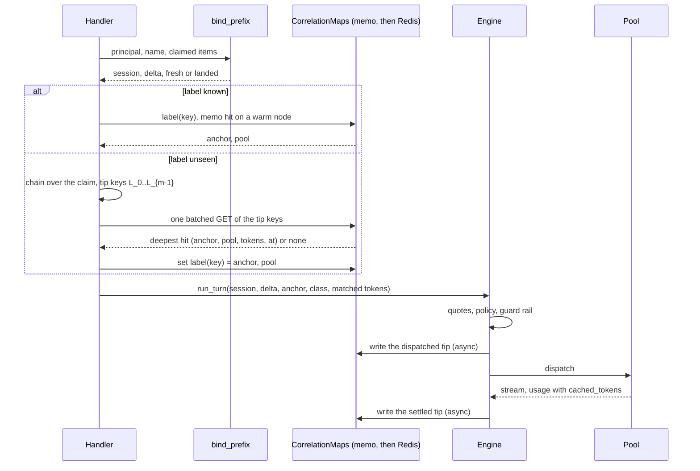

<!--
SPDX-FileCopyrightText: Copyright (c) 2026 NVIDIA CORPORATION & AFFILIATES. All rights reserved.
SPDX-License-Identifier: Apache-2.0
-->

# Prefix-anchored routing to sticky Dynamo pools

> **Status: proposal, 2026-09-29. Not ruled.** Written to the owner's ruling in the addendum of `session-identity-first-proposal.md`, which it replaces. Evidence: `../research/prefix-anchored-routing-evidence.md` (cited as "evidence §n"). Written against Roundhouse `2dd40dd`, Codex pin `6344a65`, and Dynamo pin `ac7b751`. Section 12 lists the questions for the owner. When the owner rules, add a dated addendum. Do not rewrite this text.

## 0. Summary

- **The unit is KV overlap.** Roundhouse computes a chain of digests over the canonical items of the prompt it dispatches, one link per item. It stores the chain value at two points of each turn: the end of the dispatched prompt, and the end of the settled response. These are **tips**.
- **The per-item digest is built on `Item::render()`.** Prefix admission has no digest of its own. It compares items structurally, and structural agreement implies equal renders. The render is also what the turn id, the token buffer, and the admitted token count already use (evidence §2).
- **A session label is the conversation key** that prefix admission already resolves. A known label routes to its bound pool with no content lookup. An unseen label triggers one batched longest-match lookup of its prompt's boundaries against stored tips.
- **The anchor** is the identity of a KV lineage. An unseen label that matches a stored tip inherits that tip's anchor and pool. An unseen label that matches nothing is **new**, and its anchor is the keyed tip of its own first prompt. The anchor is stored once and never recomputed.
- **Why not a fixed first-N hash.** A Claude Code session changed item 2 of its own prompt between two turns (evidence §5). A hash recomputed at any N of 3 or more therefore drifts inside one session. A hash stored once is only the label binding again. Longest match needs no client knowledge and also returns how much overlaps.
- **Pools are sticky.** A pool is a Dynamo deployment with its own router. Roundhouse keeps a label on its pool. It moves a label only when the pool is down, when policy or budget refuses it, or when the guard rail refuses a new session.
- **The guard rail limits net-new prefill per pool per window.** Net-new prefill is admitted input tokens minus the cached tokens that are certain. An uncertain hit counts as net-new. The charge is corrected from the pool's measured `cached_tokens` after the response.
- **First measurable gain (M3):** the measured cache-hit ratio per pool, from Dynamo's `usage.prompt_tokens_details.cached_tokens` recorded as `CacheReadSource::Provider`, in `cache_reuse_evidence`. A two-pool mocker replay compares label stickiness against a load-only pool choice.

## 1. Terms

- **Item**: one canonical conversation item, as the surfaces canonicalize it.
- **Render**: `Item::render()` [rh crates/roundhouse-core/src/item.rs:419].
- **Chain value** `c_i`: the unkeyed digest of items `0..=i`. It stays in process memory.
- **Tip**: the keyed lookup key of a chain value at the end of a dispatched prompt or a settled response. Only tips are stored.
- **Label**: the qualified conversation key, `ControlPlane::qualify(principal, name)`, without the `#g{n}` generation suffix [rh crates/roundhouse-server/src/prefix_admission.rs:184].
- **Anchor**: a 16-byte keyed value that names one KV lineage. Forks that resend a lineage's prompt share its anchor.
- **Pool**: a Dynamo deployment with its own router. The embedded fleet is one pool whose router runs in process.
- **Class** of a first turn: **continuation** (known label), **inherited** (unseen label, tip matched), or **new** (unseen label, no tip matched).

## 2. The anchor: exact form

### 2.1 Reuse, not a second spelling

| Existing encoding | Relation to this design |
|---|---|
| `same_item` (prefix admission) | Not a digest. The chain must not split two claims that admission treats as one conversation. `same_item(a, b)` implies `render(a) == render(b)`, because the render leaves out `namespace` and `response_id` (evidence §2). The first test of M1 pins this. |
| `Item::render()` | **The per-item encoding the chain hashes.** It is already computed per item by `ContextAssembler::push`, `admitted_input_tokens`, and `turn_id_for` [rh crates/roundhouse-core/src/context.rs:216], [rh crates/roundhouse-server/src/engine.rs:1918], [rh crates/roundhouse-server/src/responses_api/wire.rs:221]. |
| `turn_id_for` (FNV-1a) | Unchanged. It is a durable idempotency id, and a change would make an in-flight retry miss its response. FNV is also unkeyed and not collision resistant, so it cannot be a routing key. |
| `prefix_fingerprint` | **A second spelling.** It serializes `(role, content)` with serde and includes `namespace`, so it can split two claims that `same_item` joins. M2 re-derives it from the chain (section 12, question 10). Its value is forwarded upstream as the fallback `prompt_cache_key` [rh engine.rs:3023], so the change moves that value once. |

### 2.2 Definition

```text
d_i  = SHA-256("rh-item-v1\0" || u64be(len(r_i)) || r_i)       r_i = items[i].render()
c_0  = SHA-256("rh-chain-v1\0" || d_0)
c_i  = SHA-256(c_{i-1} || d_i)                                   unkeyed, in memory only
t    = SHA-256(canonical JSON of the declared tools)            zero bytes when none are declared
k_P  = HMAC-SHA256(K, "rh-prefix-scope-v1\0" || namespace(P))   K = deployment secret, P = principal
L_i  = HMAC-SHA256(k_P, "rh-prefix-tip-v1\0" || t || c_i)[..16] the stored tip key
```

- **Where it is computed.** `ContextAssembler::push` already renders each item. It extends the chain from the same string, so the engine gets `c_i` beside `tokens_through(i)` [rh context.rs:231]. The handler uses the same core function over the claim of an unseen label. One function has two callers. There is no second copy.
- **Tools are not in the chain.** Tools are not items, and a tool change must not change the chain that the item history carries. The tools digest `t` enters only the tip key. So a tool change makes a new tip, as it makes a new provider cache prefix (evidence §8). The cost is that a session which appends MCP tools matches nothing that an earlier tool set wrote. That under-claims overlap, which is the safe direction.
- **Configuration is in the chain.** The leading configuration run is part of the dispatched prompt. When a client rewrites it, the KV beyond the edit is lost on every target, so the chain must break there too. A chain that excludes volatile configuration claims overlap that no cache holds.
- **The anchor.** At the first turn of an unseen label, the anchor is the anchor stored on the deepest matched tip. If no tip matches, the anchor is `L_{m-1}` over the first dispatched prompt of `m` items. The anchor is written once, in the label binding and in `SessionCreated`, and is copied to every later generation of the label.

### 2.3 The measured divergence index, per client

| Client | First item that differs between two sessions | Items that make a first request unique | Source |
|---|---|---|---|
| Claude Code 2.1.257 | 0, a 12-bit fingerprint of the typed prompt. Reliable at 4, the typed prompt. | All 6 of the first request | Measured, evidence §3 |
| Codex (pin `6344a65`) | 2 when the working directory or date differ, else 3 (the typed prompt) | All 4 of the first request (5 with multi-agent v2) | Derived from source and tests, evidence §6 |

The first request always ends just after the first typed prompt plus client context. So "the number of items that makes the sequence unique" is, in practice, the whole first request. The tip of the first request is exactly the owner's `hash(cat(message[i]) for i in 0..N)`, and it needs no per-client N.

## 3. Fixed anchor or longest match

| Question | (a) Fixed anchor at a unique boundary N | (b) Longest match over stored tips |
|---|---|---|
| Needs client knowledge | Yes. N is 4 for Codex, 5 or 6 for Claude Code, and moves with versions and features. | No. |
| Stable inside one session | No, if recomputed. Claude Code item 2 changed between turn 1 and turn 2, so any N of 3 or more drifts (evidence §5). If stored once, it is the label binding. | The label binding carries identity. The chain only has to match for unseen labels. |
| Answers "how much overlaps" | No. Yes or no only. | Yes. The matched tip carries its token count. |
| Fork under a new name | Joins only if its first N items equal the parent's. | Joins at the deepest stored tip it resends. |
| Codex v2 full-history fork | Splits at item 2 (evidence §7). | Splits at item 2. Correct for KV. |
| Router state | The anchor per label. | Tips with a TTL (section 4). |
| Reads per turn | 0 | 0 for a known label. One batched read for an unseen label. |

**Recommendation: (b) for placement, with the anchor found by (b) and stored once.** Both need router state. Only (b) is general, and only (b) produces the matched-token count that the price and the guard rail consume.

## 4. Stored state



| Family | Key | Value | Size | Bound and eviction | Where |
|---|---|---|---|---|---|
| `label` | Qualified conversation key, no generation | anchor (16 B), pool id, `bound_at_ms`, `last_turn_at_ms` | About 60 B value | TTL `THREAD_BINDING_STALENESS_MS` (7 days), refreshed per turn [rh crates/roundhouse-core/src/control/correlation.rs:164]. Node memo capped at 4,096, like the generation memo. | Memory or Redis, the implementation the deployment already configures |
| `prefix_tip` | `L_i`, 16 B | anchor (16 B), the dispatch target's `Target::ledger_key` (a pool or a frontier model), `tokens` (u32, the local count through item i), `at_ms` | About 80 B value, about 160 B per Redis entry with overhead (estimate) | TTL 1 hour, refreshed on write. Node memo capped at 65,536 entries (about 6.5 MB), oldest first. | Same |

- **Only tips are stored.** A preamble is never a tip, because no request ends there. So "new" means that no stored tip matched. No "shared" flag and no write race are needed.
- **Growth.** Two tips per turn. At 10,000 turns per hour, about 20,000 live Redis entries, about 3.2 MB (estimate, not measured).
- **The tip names a target, not only a pool.** A fork of a session that was served by a frontier model inherits that model's warm prefix in its ledger seed, and a fork of a pool session inherits the pool.
- **Tip `tokens` leave out the tool declaration.** The ledger's `isl_tokens` include it [rh engine.rs:1918]. So a seed from a tip under-claims the warm prefix by the tool tokens, which is the safe direction.
- **Per-turn cost, known label.** One SHA-256 over the render bytes of each item, inside the assembler rebuild that already renders and tokenizes every item [rh engine.rs:2135]. Zero store reads for identity on a warm node. Two tip writes, pipelined, after dispatch and after the terminal. A turn routed to a pool also pays the guard rail's one window read and one write (section 8.5).
- **Per-turn cost, unseen label.** One chain over the claim (about 26 µs for a fresh Claude Code request at the measured 2.4 GB/s, evidence §11), one HMAC per boundary, and one batched `MGET` of up to 4,096 of the deepest boundaries. The node memo answers first.
- **Loss.** A lost tip costs one cold placement, which is today's behavior. A lost label binding makes the label unseen, and the longest match then finds its own last tip.

## 5. Message boundaries or token blocks

**Recommendation: message boundaries.**

- They are model-agnostic. One chain serves every pool and every frontier target. Provider caches also match exact prefixes, and a message boundary is where Roundhouse already places Anthropic block markers.
- They are computed before a target is chosen. Block hashes need the pool's tokenizer and block size, so a block chain is per pool, and a longest match across pools needs one chain per tokenizer.
- The cost is granularity. An edit inside an item loses the whole item. The Claude Code turn 1 to turn 2 pair shares 5,096 bytes at byte level and 162 bytes at item level (evidence §5). That under-claims, which is the safe direction.

**What Dynamo block hashes add when a pool exposes them.** Inside a pool, the router already matches blocks and can move KV east-west. Roundhouse does not need its own block index for a remote pool. Where a pool answers a residency query (the embedded fleet's `effective_prefill_tokens` [rh crates/roundhouse-fleet/src/local.rs:149]), that answer is the certain cache hit for the guard rail and replaces the message-level prediction for that turn.

## 6. Session labels

- **The label is the name prefix admission already resolves.** Responses: `thread-id`, then `session-id`, then `prompt_cache_key`. Messages: the Claude session header or `metadata.user_id`, scoped by agent id [rh crates/roundhouse-server/src/messages_api/wire.rs:236, :286]. A Claude sub-agent and a Codex sub-agent thread are therefore their own labels, and so new requests, as the owner ruled.
- **Unseen means no `label` entry anywhere.** The generation map cannot answer this question, because `bind_prefix` commits generation zero of a fresh key before the label is read [rh prefix_admission.rs:241, :426-441]. A node that never served the label reads through its memo to the store, as for generations. An expired or lost binding makes the label unseen again, and the longest match then finds the label's own last tip. That restores the same anchor and target.
- **History rewrite.** A new generation (`#g{n}`) or a compaction keeps the label, so it keeps the pool and the anchor. The chain of the new prompt writes new tips under the same anchor. The ledger of the new generation stays cold, as today [rh prefix_admission.rs:227-240]. The pool still holds the configuration prefix.
- **Client resets.** Claude Code `/clear` mints a new session id, so a new label. Its first request matches no tip, so it is new. That agrees with the KV unit.
- **Headerless clients.** An anonymous Messages request gets a fresh key per request [rh crates/roundhouse-server/src/messages_api.rs:546]. Each request is an unseen label, and its longest match finds the previous request's settled tip. So a headerless client gets pool stickiness without a name. Roundhouse writes no `label` entry for an anonymous key, because that key never repeats. Log continuity for such a client is unchanged.

## 7. Pool stickiness

### 7.1 Preference order

1. **Continuation**: the label's pool.
2. **Inherited**: the pool of the deepest matched tip. The label is bound to it.
3. **New**: a pool in its bring-up window with room on its rail (section 8.3). Else the pool with the most room on its rail.

### 7.2 When stickiness yields

| Condition | Action |
|---|---|
| Policy, budget, or the T6 egress rule refuses the pool | The filter wins. Stickiness is a preference inside the admitted set, never an override. |
| Pool unavailable (health check, connect failure, a 503 before the first byte) | Fail over to another pool of the same egress class under the same deadline. Mark the pool down for a cooldown. Rebind the label. |
| The rail refuses a **new** session | Next pool with room. No KV is lost by the move. |
| The rail refuses a **continuation** or **inherited** session | Stay. Wait for room up to a bounded time. A move prefills the whole prefix again elsewhere, which is the load the rail limits. Refuse when the wait ends (section 8.4). |
| A local-only session | Only pools of the local egress class. Never a frontier target. |

After a move, the label is bound to the new pool. The move costs one cold prefill, once.

### 7.3 What the learner and the rules picker see

Quotes, not a new key. A pool candidate's `expected_prefill_tokens` is its input minus the **expected** cached tokens, from the session ledger and the pool's `CacheModel` [rh crates/roundhouse-core/src/routing/ledger.rs:569]. On the first turn of an inherited label, the ledger is seeded with the matched tip's tokens and time for that pool only. The label's pool is warm in the quote and other pools are cold, so stickiness shows in price, TTFT, and cost. `LevelKey` and the rules picker do not change.

Two numbers, two purposes. The **price** uses the expected hit, so that it is unbiased (the cost-signal ruling). The **guard rail** uses only the certain hit, so that it errs toward over-counting load (section 8.1).

## 8. Bring-up and the guard rail

### 8.1 The quantity

```text
net_new(turn, pool) = admitted_input_tokens(turn) - certain_cached(turn, pool)

certain_cached =
    isl - effective_prefill_tokens     when the pool answered a residency query (embedded fleet)
    expected_cached_tokens             when the pool's CacheModel is Deterministic and elapsed < ttl
    0                                  otherwise, including every remote pool without a residency answer
```

- `admitted_input_tokens` is `Engine::admitted_input_tokens`, tools included [rh engine.rs:1918].
- **Reconciliation.** After the response, the window's charge for that turn is replaced by `prompt_tokens - cached_tokens` when the pool's count is `CacheReadSource::Provider` [rh crates/roundhouse-core/src/event.rs:105]. An unmeasured count keeps the full charge.
- **The bound on over-charge.** Before reconciliation, the over-charge is at most the cached prefix of each in-flight request on that pool.
- This mirrors the cost rule. An overstated hit undercounts net-new prefill and can flood a fresh instance. So only a certain hit reduces the charge.

### 8.2 Instance or pool

| Limit | Where it applies | What Roundhouse observes |
|---|---|---|
| Guard rail | **Per pool**, in Roundhouse, before dispatch. Roundhouse controls what enters each pool. | Its own charges. After dispatch, the measured `cached_tokens` and the serving `prefill_worker_id` and `decode_worker_id` from `nvext.extra_fields: ["worker_id"]` (evidence §9). |
| Per-instance prefill load | **Inside the pool**, in the Dynamo router, which books prefill load per worker. | Nothing before dispatch for a remote pool. The embedded fleet quote carries `load` per worker [rh local.rs:158]. |
| Bring-up | **Per pool** in Roundhouse, when a pool is added. Per instance inside a pool is Dynamo's. | The pool's `ready_at_ms` from configuration. Instance membership only after dispatch, from `worker_id`. |

Roundhouse cannot see an instance of a remote pool before dispatch without a worker hint. So this design applies both limits per pool, and asks the owner about hints (section 12, question 1).

### 8.3 Bring-up

- A pool record carries `ready_at_ms`. For a ramp window after it (configured, for example 5 minutes), the pool's rail limit rises in a straight line from a configured start to its full value.
- New sessions prefer a ramping pool while it has room. Continuing and inherited sessions never move to it, because a move re-prefills their prefix.
- The ramp limit is what staggers prefill on the new pool. Without it, every new session in the window lands at once.

### 8.4 When the rail trips

1. A new session goes to the next pool with room.
2. A continuing or inherited session waits for room, up to `min(max_rail_wait_ms, remaining turn deadline)`.
3. When no pool can take the turn, the rail removes all pool candidates. A frontier candidate that policy admits can still serve the turn, unless the session is local-only.
4. When no candidate remains, the turn is refused.

**The tie to D5.** The rail runs at routing, inside the spawned turn. Today a refusal there reaches the client as an in-stream failure, because the surfaces return the stream before the turn routes [rh crates/roundhouse-server/src/responses_api.rs:399, :466]. The recommendation for D5 is to hold the response headers until the engine records its routing decision or refuses, and for a pool also until the pool returns its response headers. The client waits for the first byte in both cases, so time to first token does not change. Then a rail refusal, or a pool's own 429 with no candidate left, can reach the client as HTTP 429 with `Retry-After`. Codex does not retry a 429 on its own (`retry_429: false`) and reads only the `usage_limit_reached` body with `resets_at` (evidence §10). The body for Codex is an owner question (section 12, question 12).

### 8.5 Where the rail's window lives

- **A shared rolling window per pool**, in the store that the deployment already configures, with the fair-use shape: check before dispatch, record after the terminal [rh crates/roundhouse-server/src/http.rs:645], [rh crates/roundhouse-server/src/engine/fair_use.rs:127]. A node-local window lets N nodes admit N times the limit, which defeats the rail.
- **Cost.** One window read at routing and one write at the terminal, per turn routed to a pool. Fair use already pays the same shape per turn.
- **Store outage.** The rail falls back to a node-local window with the limit divided by the configured node count, and logs once per outage. This differs from fair use, which fails closed. A capacity rail that refuses every pool turn during a store outage turns a store fault into a serving outage.

## 9. Scope and privacy

- **Keyed per principal.** `k_P` is derived from a deployment secret and the principal namespace that `ControlPlane::qualify` already uses. Two principals with the same content get unrelated tips. A lookup never crosses a principal.
- **Not reversible.** The store holds only 16-byte HMAC outputs. The unkeyed chain value `c_i` never leaves process memory, so a store reader cannot extend a chain to test guessed content. Without the secret, nobody can compute a tip from content.
- **Never exported.** Tips and anchors never go upstream, into metrics labels, into MCP answers, or into a frontier request. Logs carry at most the first 8 hex characters of an anchor.
- **No secret, no index.** Without the deployment secret, the tip families stay off and labels still work, because a label is a name and not a digest.
- **Rotation.** A new secret changes every tip. Labels survive, so continuing sessions keep their pools. Unseen labels are new until their tips are written again.

## 10. Learner impact (D8)

The learner groups by the anchor, which is the KV lineage that routing uses.

| Site | Today | Change |
|---|---|---|
| Arm assignment | `Arm::for_session` [rh crates/roundhouse-core/src/validate/arm.rs:105] | `Arm::for_anchor`, with `ASSIGNMENT_VERSION` `v2`. A fork that shares its parent's KV shares its parent's arm. |
| `min_sessions` at the gate | Distinct sessions [rh crates/roundhouse-core/src/routing/learn/gate.rs:215] | Distinct anchors. The key name is an owner question (section 12, question 11). |
| Estimand bootstrap | Clustered by session | Clustered by anchor |
| Exploration draw | Per session and response [rh crates/roundhouse-core/src/routing/learn/explore.rs:45] | No change |
| Learning entries | No lineage field | `anchor` with a serde default, for offline analysis |

Arm by anchor works because the anchor is known when the session is created (section 11).

## 11. Durability (D3, D4)

- **D3.** `SessionCreated` gains `anchor: Option<Anchor>` with a serde default. This is the forward-only door that `principal` and `arm` already use. A new event kind would make an older build fail to read the log, because `SessionEventKind` has no catch-all variant. A replay restores the anchor from the first event. The label binding can be rebuilt from it.
- **D4.** Label bindings and tips are soft state in `CorrelationMaps`, memory or Redis. The Redis entry is the shared answer, and the node memo is a write-through cache. A loss costs one cold placement.
- The per-session ledger stays a projection of the session log. The seed on an inherited first turn is recorded on the `Routed` decision that uses it, so a replay prices it the same way.

## 12. Questions for the owner

1. **Worker hints (unruled).** Recommend none toward a remote pool. The pool's router decides and can move KV east-west. The embedded fleet keeps its current in-process selection, which is that pool's router.
2. **Egress class of a pool (D6, unruled).** Recommend an explicit `egress: local | external` per pool in the catalog, with no default. A configuration without it is refused at load. Failover between pools of one class is allowed before the first byte.
3. **Instance or pool for bring-up and the rail (unruled).** Recommend per pool in Roundhouse, per instance in Dynamo (section 8.2). If the owner wants instance-level bring-up for remote pools, the only lever is `x-dynamo-worker-instance-id`, which is a worker hint.
4. **D5.** Recommend holding the response headers until the routing decision or refusal, and for a pool until its response headers (section 8.4).
5. **D7, headers toward a pool.** Recommend `x-dynamo-session-id` set to a keyed digest of the label, derived apart from the anchor. Send no parent header and no llm-d header. The pool is a Dynamo router.
6. **D9, the spawn-argument link.** Recommend dropping it. Fresh spawns are new requests by ruling.
7. **D10, opencode.** Recommend no opencode name in this workstream. Section 6 gives headerless Messages clients pool stickiness through tips. Whether a Responses request with no name is refused stays as is.
8. **New. Identical first requests share an anchor.** Two sessions with byte-identical first requests match each other's tip and share KV, so they share an anchor and an arm. Recommend accepting this.
9. **New. The Claude Code attribution block toward pools.** It is item 0, and it varies with the first prompt, so two sessions share 60 bytes in Roundhouse's item order instead of the system prompt (evidence §3, §8). Recommend dropping it from the dispatch projection toward non-Anthropic targets, only when detected exactly (the literal `x-anthropic-billing-header: cc_version=` block at `system[0]`). The canonical form and admission do not change. This is a client-specific step gated on exact detection, as the owner allowed.
10. **New. `prefix_fingerprint`.** Recommend re-deriving it from the chain in M2. This changes the forwarded fallback `prompt_cache_key` once, for Responses requests that send none.
11. **New. The `min_sessions` key.** Recommend renaming it `min_anchors`, with a load-time refusal of the old key that names the new one.
12. **New. The Codex body for a rail 429.** `usage_limit_reached` is the only 429 that Codex reads, and the rail does clear on its own. Recommend using it with `resets_at` set to the time the window has room.
13. **New. Long warm sessions on a remote pool.** Every turn is charged its full input until reconciliation (section 8.1). Recommend accepting this for M4 and deciding again with the M4 numbers.
14. **New. The deployment secret.** Recommend one secret for all nodes, from the existing secret configuration and never from the catalog.

## 13. Milestones

Each milestone is one PR, cut from `main`. Tests come first. Every run is bounded by a timeout.

**M1: the prefix chain (core, no call site that routes).**

- Tests first:
  - `same_item_agreement_implies_equal_item_digests`: property test over role, content, stamps, and the namespace rule.
  - `a_response_stamp_does_not_move_the_chain`.
  - `an_opaque_block_digests_the_same_in_any_key_order`.
  - `the_assembler_chain_equals_a_chain_recomputed_from_scratch`.
  - `two_principals_never_share_a_tip_key`.
  - `claude_fixture_divergence_is_pinned`: over the pinned 2.1.257 fixtures, two sessions share 0 item links, turn 1 to turn 2 shares 2, turn 2 to turn 3 and the tool loop share all.
- Change: the chain function beside `Item::render`, and the chain in `ContextAssembler`. HMAC-SHA256 through `hmac 0.12`, the RustCrypto crate of the `sha2 0.10` family.
- Done means: the tests pass, and a benchmark reports chain time against tokenization time per 100 KB with `crates/roundhouse-server/tests/data/tinyllama-tokenizer.json`.

**M2: labels and tips, in shadow.**

- Tests first:
  - `a_label_without_a_binding_costs_one_batched_tip_read` and `a_bound_label_costs_no_identity_read` (counters).
  - `an_expired_binding_finds_its_own_last_tip`.
  - `an_anonymous_key_writes_no_label`.
  - `a_fork_under_a_new_name_inherits_the_anchor`: a fixture body resent under a new session header.
  - `a_new_prompt_under_a_new_name_is_new`.
  - `a_history_rewrite_keeps_the_label_pool_and_anchor`.
  - `a_replay_restores_the_anchor_from_session_created`, and a `SessionCreated` written without the field still reads.
  - `an_expired_tip_is_not_matched`.
  - The `CorrelationMaps` contract suite for both new families, memory and Redis.
- Change: the `label` and `prefix_tip` families, `SessionCreated.anchor`, the lookup in the handler, tip writes in the engine, and `prefix_fingerprint` from the chain. Routing does not change.
- Done means: a replay of `use-cases/cache-aware-routing/turns.jsonl` reports class counts and a match-depth histogram, with numbers.

**M3: the Dynamo pool target with label stickiness (first measurable gain).**

- Tests first:
  - Against a stub pool: no client header survives, `nvext.extra_fields` asks for `worker_id`, and `cached_tokens` decodes as `CacheReadSource::Provider`.
  - `a_label_stays_on_its_pool_across_two_nodes` (two engines, one Redis map).
  - `a_policy_refusal_beats_stickiness`.
  - `a_local_only_session_never_leaves_the_local_class`.
  - `a_pool_503_before_the_first_byte_fails_over_and_rebinds`.
  - `an_inherited_first_turn_is_priced_warm_on_the_matched_pool_only`.
- Change: `Target::Pool`, the pool catalog with `egress` and `CacheModel`, the preference order of section 7, and failover between pools of one class.
- First test: `the_pool_reports_cached_tokens`. The Dynamo mocker at the pin does not appear to fill `prompt_tokens_details.cached_tokens` (evidence §9). Either an upstream mocker change fills it from the mocker's own prefill cost, or the run uses a real backend on an owner-approved machine.
- Done means: a two-pool run reports `cache_reuse_evidence` (`observed_total / paired`, measured reads only) per pool row, with stickiness on and with a load-only pool choice. It also reports predicted against observed. The gain is the difference, with numbers.

**M4: the guard rail, bring-up, and D5.**

- Tests first:
  - `an_uncertain_hit_is_charged_as_net_new`.
  - `a_measured_cached_count_reconciles_the_charge`.
  - `a_new_session_moves_when_the_rail_refuses`.
  - `a_continuing_session_waits_then_is_refused_with_retry_after`.
  - `a_ramping_pool_takes_new_sessions_and_never_continuing_ones`.
  - `the_headers_are_held_until_the_routing_decision`, with TTFT unchanged in the stub.
- Done means: a mocker run that brings up a second pool under load shows the net-new prefill per window on the new pool staying under its ramp limit, with numbers.

**M5: learner scope (D8).**

- Tests first: `forks_share_an_arm`, `the_gate_counts_distinct_anchors`, and `the_bootstrap_clusters_by_anchor`.
- Done means: a new assignment version, and the calibrator report names the cluster unit.

## 14. Relation to the rejected proposal

| Rejected text | Now |
|---|---|
| Program id from lineage headers and the emitted-item link | Replaced by the anchor from prefix match. Headers and the link are not used. The owner allows them only as accelerators under exact client detection, and none is needed for M1 to M5. |
| `ProgramRecord`, phases, sibling counts | Dropped. The pool's router owns placement inside the pool. |
| `ProgramBound`, `LedgerSeeded` events | Replaced by `SessionCreated.anchor` and the seed on the `Routed` decision. No new event kind. |
| llm-d trusted-hop headers | Out of scope. A pool is a Dynamo deployment. |
| Worker hints (P4) | Question 1. None by default. |

## 15. Out of scope

- Any change to prefix admission, to the conversation name, or to the refusal for a Responses request with no name.
- A Roundhouse block index for remote pools.
- Queue ordering inside a pool.

## Addendum, 2026-09-29: owner ruling on section 12, first round

- **Question 3 and question 1: accepted as recommended.** Bring-up and the net-new prefill rail apply per pool in Roundhouse and per instance in Dynamo. Roundhouse sends no worker hint toward a remote pool.
- **Question 4 (D5): accepted.** Roundhouse holds the response headers until the routing decision or the refusal, and for a pool until the response headers of the pool. A rail refusal or an upstream 429 then reaches the client as HTTP 429 with `Retry-After`.
- **Question 9: accepted, with a follow-up.** Roundhouse strips the Claude Code attribution block from the dispatch projection toward non-Anthropic targets, and only on the exact match. The owner asked whether the block can serve as a Claude session id. The orchestrator answer: not as an id. It is 12 bits, so two concurrent sessions collide at a probability of 1 in 4,096 per pair, and every prompt that is shorter than 5 characters maps to one value for each version. Exact detection of the block is a reliable signal that the client is Claude Code. Claude Code already sends `x-claude-code-session-id`, which is the exact label.
- **Question 2 (D6, the egress class of a pool): open.** The owner asked for more detail before a ruling.

## Addendum, 2026-09-29: owner ruling on section 12, second round

- **Question 2 (D6): a Dynamo deployment is local.** The layer that this design builds sits above the deployments. It sees several Dynamo deployments, and each session is sticky to one of them.
- **A hash never selects the deployment.** There is no modulo and no rendezvous choice over the deployment set, because operators drain deployments and bring up new ones. The rule is:
  - **A matched session goes to its bound deployment.** The binding is stored. It can be held against an outstanding budget.
  - **A new session goes to the deployment with the lowest total KV load.** New sessions are spread evenly by that measure.
  - **The rail can override that choice.** If the net-new prefill per unit of time on that deployment is over its limit, the new session can go to a different deployment.
- **Session detection is its own crate.** It can depend on some Roundhouse crates, and a later refactor can make it one unified crate. Deriving the session id is the key input to routing.

## Addendum, 2026-09-29: design revision after the second ruling

This addendum applies the first and second owner rulings to the design. It restates in full each section that the rulings change, by section number. Where this addendum and the text above disagree, this addendum wins. Sections 3, 5, 8.1, 8.5, 9, 10, 11, and 14 do not change, except that "pool" reads "deployment". New evidence is in evidence §14.

### §0 (restated). Summary

- **The unit is KV overlap.** Unchanged. A chain of digests over the canonical items gives tips at the end of each dispatched prompt and each settled response.
- **Session detection is its own crate, `roundhouse-session-id`** (§17). It derives the label, detects the client, computes tip keys, and names the anchor. The unkeyed chain primitive stays in `roundhouse-core`, beside `Item::render`, so that the context assembler can extend it with no crate cycle.
- **A deployment is a Dynamo deployment, and it is local** (ruling D6). Roundhouse sees several deployments. Each session is sticky to one.
- **No hash selects a deployment.** A continuation goes to its stored bound deployment. An inherited session goes to the deployment of its deepest matched tip. A new session goes to the eligible deployment with the lowest estimated KV load (§7).
- **The load signal** is the KV utilization of a deployment: in-flight KV blocks over KV capacity, summed over its decode-capable workers (§16). At the Dynamo pin, the only external source is the frontend's `/metrics` scrape of the KV router's own block count (evidence §14.3). Roundhouse corrects the reading for its own placements since the scrape.
- **The rail limits net-new prefill per deployment per window.** Unchanged in its quantity. A continuation waits on the rail and does not move. A new session moves to the next deployment with room.
- **Operators drain and bring up deployments.** A draining deployment takes no new sessions. Its bound sessions stay until idle or until a drain deadline, and then move at their next turn (§8.6).
- **First measurable gain (M4):** the spread of new sessions across two mocker deployments under a burst, and the router-predicted hit rate per deployment. Neither needs the engine's `cached_tokens`, which the mocker does not fill.

### §1 (restated). Terms

- **Item**, **Render**, **Chain value** `c_i`, **Tip**, **Anchor**: unchanged.
- **Label**: the conversation name that `roundhouse-session-id` derives, qualified by `ControlPlane::qualify(principal, name)`, without the `#g{n}` suffix.
- **Deployment**: one Dynamo deployment, reached through its frontend. It replaces "pool" everywhere in this document. The embedded fleet is one deployment whose router runs in process.
- **Deployment state**: `active`, `draining`, or `down` (§8.6).
- **Load reading**: one scrape of a deployment's frontend `/metrics`, with its time.
- **Estimated load** `Û_d`: the load reading plus the tokens that Roundhouse dispatched to deployment `d` since the reading (§16.3).
- **Class** of a first turn: **continuation** (known label), **inherited** (unseen label, tip matched), or **new** (unseen label, no tip matched). Unchanged.
- **Eligible deployment**: a deployment that serves the requested model, passes policy, budget, and egress filters, and is not `down`.

### §2.2 (restated). Definition, and where each part is computed

The formulas do not change:

```text
d_i  = SHA-256("rh-item-v1\0" || u64be(len(r_i)) || r_i)       r_i = items[i].render()
c_0  = SHA-256("rh-chain-v1\0" || d_0)
c_i  = SHA-256(c_{i-1} || d_i)                                   unkeyed, in memory only
t    = SHA-256(canonical JSON of the declared tools)            zero bytes when none are declared
k_P  = HMAC-SHA256(K, "rh-prefix-scope-v1\0" || namespace(P))   K = deployment secret, P = principal
L_i  = HMAC-SHA256(k_P, "rh-prefix-tip-v1\0" || t || c_i)[..16] the stored tip key
```

The parts are split across two crates:

| Part | Crate | Reason |
|---|---|---|
| `d_i`, `c_i` (the chain primitive) | `roundhouse-core`, module `item::chain`, beside `Item::render` | `ContextAssembler::push` extends the chain from the render that it already computes [rh crates/roundhouse-core/src/context.rs:216]. A primitive in the new crate makes core depend on a crate that depends on core. That is a cycle. |
| `t`, `k_P`, `L_i`, the anchor | `roundhouse-session-id` | These are keyed identity. They need a secret and a principal namespace, which the chain does not. |

- The invariant test `same_item_agreement_implies_equal_item_digests` stays in core, next to the primitive it pins.
- **The crate loads no configuration.** The server reads the deployment secret and passes it to `TipKeyer::new` as a value. The crate never reads the environment, a file, or the catalog.
- Tools are not in the chain. Configuration is in the chain. The anchor rule is unchanged: the anchor of the deepest matched tip, else `L_{m-1}` of the first dispatched prompt.

### §4 (restated). Stored state

The sequence is unchanged, except that the handler calls `roundhouse-session-id` for the label, the chain keys, and the anchor, and that the engine places by §7.

| Family | Key | Value | Bound and eviction | Where |
|---|---|---|---|---|
| `label` | Qualified conversation key, no generation | anchor (16 B), bound `deployment_id`, `bound_at_ms`, `last_turn_at_ms` | TTL 7 days, refreshed per turn. Node memo capped at 4,096. | Memory or Redis |
| `prefix_tip` | `L_i`, 16 B | anchor, `Target::ledger_key` (a deployment or a frontier model), `tokens` (u32), `at_ms` | TTL 1 hour, refreshed on write. Node memo capped at 65,536. | Same |
| `deployment_state` (new) | `deployment_id` | `state`, `since_ms`, `drain_deadline_ms` (draining only), `set_by` | No TTL. An operator write replaces it. | Same. The catalog gives the value at startup. |
| `deployment_dispatched` (new) | `deployment_id` | Monotone token counter: admitted input tokens of every turn that Roundhouse dispatched there | No TTL. `INCRBY` at dispatch only. Never decremented. | Same |
| `deployment_inflight` (new) | `deployment_id` | Net token counter: admitted input tokens of turns in flight there | No TTL. `INCRBY` at dispatch, `DECRBY` at the terminal. Used only by the proxy of §16.4. | Same |
| Rail window | `deployment_id` | Rolling net-new prefill window | As §8.5 | Same |

- The `label` value names a **deployment id**, not a worker and not a hash bucket. A drain or a bring-up changes no stored binding.
- The load reading is not stored. Each node scrapes on its own and keeps the last reading in memory (§16.2).
- `deployment_dispatched` cannot drift, because it is never decremented. A node that dies loses nothing that the estimate needs.
- `deployment_inflight` drifts upward when a node dies with turns in flight, because their decrements are lost. It over-counts load on one deployment, which sends new sessions elsewhere. Only the proxy of §16.4 reads it.

### §6 (restated). Session labels

- **The label values do not change.** `roundhouse-session-id` takes over the existing derivation, as a behavior-preserving move (§17). Responses: `thread-id`, then `session-id`, then `prompt_cache_key`, else a 422. Messages: `x-claude-code-session-id` or `metadata.user_id`, scoped by `x-claude-code-agent-id` and the dialect namespace [rh crates/roundhouse-server/src/messages_api/wire.rs:236-291].
- **Claude Code is labeled by `x-claude-code-session-id`** (first ruling, question 9). The attribution block is a detection signal only. It is never a label, because it is 12 bits.
- Unseen, history rewrite, client resets, and headerless clients: unchanged from §6 above.

### §7 (restated). Placement

#### 7.1 Preference order

The order applies only inside the eligible set (§1). Stickiness is a preference inside the admitted set, never an override of policy, budget, or egress.

1. **Continuation**: the bound deployment, if it is not `down`. A `draining` deployment keeps its bound sessions (§8.6).
2. **Inherited**: the deployment of the deepest matched tip, if that deployment is `active`. The label is bound to it. If that deployment is `draining`, the session is placed as new, because a draining deployment takes no new labels. If the tip names a frontier target, the session is placed as new among the deployments, and the ledger keeps the seed for that frontier target, so its quote stays warm.
3. **New**: the `active` deployment with the lowest estimated load `Û_d` (§16.3) among deployments that have a fresh load reading and room on their rail. The label is bound to it.

**What "lowest" means.** Roundhouse takes the minimum `Û_d`. Among deployments whose `Û_d` is within `ε` of that minimum (default 0.02, that is two points of utilization), it picks one uniformly at random. This is not hash selection. No content, label, or deployment id enters the choice, and a change to the deployment set moves no bound session. The band exists so that two nodes that place in the same instant do not both pick one deployment on an exact tie.

**The rail override.** If the lowest deployment's rail has no room, Roundhouse takes the next lowest that has room. This is the ruled override: net-new prefill over the limit sends a new session elsewhere.

#### 7.2 Spread under a burst

The reading lags. A burst of new sessions in one instant must not all land on the deployment that was lowest at the last scrape.

- **Each placement adds its own load before the next one reads.** A node places new sessions one at a time, under one placement lock. Each placement increments `deployment_dispatched` for its deployment by its admitted input tokens before the lock is released (§16.3). The next placement sees that increment in `Û_d`.
- **Across nodes**, the increment is an atomic `INCRBY` in the shared store. Two nodes that read the counter in the same store round trip can both pick one deployment. The bound on that race is one placement per concurrently placing node, per round trip. The `ε` band makes an exact tie between them unlikely.
- **The lock covers only the choice and the increment,** not the dispatch. Its cost is one store round trip per new session. A continuation does not take the lock, because it does not choose.

#### 7.3 When stickiness yields

| Condition | Action |
|---|---|
| Policy, budget, or egress refuses the deployment | The filter wins. Place the turn as new among the remaining eligible deployments. |
| The deployment is `down`, or it fails before the first byte (connect failure, 503, or 529) with no retry left | Mark it `down` for a cooldown if the failure is a connect failure or a 503. Place the turn as new. Rebind the label. The move costs one cold prefill, once. |
| The deployment returns 529 before the first byte | The deployment is overloaded, not down. A **continuation** waits and retries under §8.4, and does not move. A **new** session goes to the next eligible deployment. |
| The rail refuses a **new** session | Next lowest deployment with room. No KV is lost by the move. |
| The rail refuses a **continuation** or an **inherited** session | Stay and wait (§8.4). A move re-prefills the whole prefix elsewhere, which is the load the rail limits. |
| The deployment is `draining` and its drain deadline has passed | Place the next turn as new. Rebind the label (§8.6). |
| A local-only session | Deployments only. Never a frontier target. |

#### 7.4 What the learner and the rules picker see

Unchanged from §7.3 above. The ledger is seeded for the matched deployment only. The price uses the expected hit. The rail uses only the certain hit.

### §8.2 (restated). Deployment or instance

| Limit | Where it applies | What Roundhouse observes |
|---|---|---|
| Rail on net-new prefill | Per deployment, in Roundhouse, before dispatch | Its own charges, then the measured `cached_tokens` and the serving worker ids after dispatch |
| KV load for new-session placement | Per deployment, in Roundhouse | The load reading (§16) and its own in-flight counter |
| Per-instance prefill load and placement | Per instance, inside the deployment, in the Dynamo router | Nothing before dispatch. No worker hint is sent (first ruling). |
| Bring-up | Per deployment in Roundhouse. Per instance in Dynamo. | The deployment state and its first good load reading |

### §8.3 (restated). Bring-up

- An operator adds a deployment to the catalog, or sets its state to `active` through the admin plane (§8.6). It serves no new session until its first good load reading.
- After that reading, its load is the lowest, so it draws new sessions. The lag correction (§7.2) raises its estimate with each placement. So it fills until its utilization reaches the others, and then new sessions spread evenly.
- **Its rail spaces the prefill.** A new deployment has cold caches, so nearly every token that it admits is net-new. The rail caps that at its limit per window. New sessions over the limit go to the next lowest deployment.
- **No ramp by default.** The rail and the reading gate are enough for a deployment whose workers are ready when they register. The optional `ramp_ms` of §8.3 above stays in the configuration, default 0, for engines that warm up slowly after they register. Continuing and inherited sessions never move to a new deployment.

### §8.4 (restated). When the rail trips, and the sticky budget

**The budget a continuation is held against is the rail of its bound deployment,** together with the fair-use and spend budgets of its principal, which already exist. There is no per-session share.

| Option | Why not chosen, or why chosen |
|---|---|
| The deployment rail (chosen) | It limits the one load that a move of the continuation makes worse. It is already shared across nodes (§8.5). |
| A per-session share of the rail | It divides a capacity limit by a count that changes each second. A long agent session with many turns is then refused while the deployment has room. It also needs a new configuration key per session. |
| A KV-load admission budget | The KV load already decides new placement. A continuation's KV is mostly the prefix that it already holds, so refusing it on KV load refuses the cheapest work first. |

When the budget is exhausted:

1. A **new** session goes to the next lowest deployment with room.
2. A **continuing** or **inherited** session waits for room, up to `min(max_rail_wait_ms, remaining turn deadline)`. It does not move.
3. If no deployment can take a new session, the rail removes all deployment candidates. A frontier candidate that policy admits can still serve the turn, unless the session is local-only.
4. When no candidate remains, the turn is refused with HTTP 429 and `Retry-After` (D5, first ruling).

**`Retry-After` is Roundhouse's own number.** A Dynamo frontend refuses an overload with 529 by default and sends no `Retry-After` (evidence §14.8). Roundhouse maps a deployment's 529 or 503 before the first byte, with no candidate left, to 429. For a rail refusal, `Retry-After` is the time until the rail window has room for the turn's charge. For a deployment 529, it is `max_rail_wait_ms`, because Roundhouse cannot see when the deployment clears.

### §8.6 (new). Deployment state, drain, and down

| State | Takes new labels | Keeps bound labels | Set by |
|---|---|---|---|
| `active` | Yes, after the first good load reading | Yes | Catalog at startup, or the admin plane |
| `draining` | No | Until idle, or until `drain_deadline_ms` | The admin plane |
| `down` | No | No. Each bound label moves at its next turn. | The admin plane, or discovered: a connect failure or a 503 before the first byte, for `down_cooldown_ms` |

- **The state is shared.** The catalog gives each deployment its state at startup. An operator changes it with `PUT /v1/admin/deployments/{id}/state`, which writes the `deployment_state` family (§4). Every node reads that family with a short memo (default 1 s). This follows the admin plane rule that a mutation affects the next admission and nothing in flight [rh crates/roundhouse-server/src/admin_api.rs:26-33].
- **A discovered `down` is node-local.** One node's connect failure does not mark the deployment down for all nodes. An operator `down` is shared.
- **Drain: recommended behavior.** Bound sessions stay until they go idle, and move at their next turn after the drain deadline. The default deadline is 30 minutes after the drain starts.
  - Staying until idle costs no re-prefill for a session that ends on its own. The 30-minute default is a design choice, not a measurement. M4 data calibrates it.
  - Moving at the next turn after the deadline bounds the drain time. A move at a turn boundary never interrupts a turn in flight.
  - Moving all bound sessions at once was rejected. It re-prefills every live prefix on the other deployments in one burst, which the rail then refuses.
- **The drain is complete** when no bound label has had a turn on the deployment for `drain_idle_ms` (default 10 minutes), or at the deadline. Roundhouse reports the count of bound labels that had a turn inside `drain_idle_ms`, per deployment, so the operator can see when to remove it.
- A moved session is placed as new, so the rail spaces the moves too.

### §12 (restated). Questions for the owner

Ruled and closed: questions 1, 3, and 4 (first ruling), question 9 (first ruling), and question 2 (second ruling: a deployment is local).

Still open from the first list, with the recommendation unchanged: question 5 (`x-dynamo-session-id` as a keyed digest of the label), 6 (drop the spawn-argument link), 7 (no opencode name), 8 (identical first requests share an anchor), 10 (`prefix_fingerprint` from the chain), 11 (`min_anchors`), 12 (`usage_limit_reached` for Codex on a rail 429), 13 (full charge for warm continuations on a remote deployment until reconciliation), and 14 (one deployment secret).

New questions that the rulings leave open:

15. **The load source when the frontend does not run the KV router.** The router gauge then does not exist (evidence §14.3). Recommend: such a deployment is placed on Roundhouse's own in-flight counter only (§16.4), and Roundhouse logs this once at startup. The alternative is to refuse the catalog entry.
16. **Several frontends in one deployment.** With replica sync off, each frontend sees only its own traffic. Recommend: the catalog accepts one metrics URL per deployment, and a deployment with several frontends must run the KV router with `router_replica_sync` on. The alternative is that Roundhouse scrapes every frontend and sums their views.
17. **The capacity source.** `model_total_kv_blocks` is one worker's value, last writer wins (evidence §14.6). Recommend: the catalog carries `kv_capacity_blocks` per deployment, and it wins. Without it, Roundhouse uses the scraped value times the count of decode worker series, and logs the homogeneity assumption.
18. **The tie band `ε`.** Recommend 0.02. A value of 0 gives the strict minimum, which lets two nodes that place in one instant pick one deployment on an exact tie.
19. **The drain defaults.** Recommend a 30-minute deadline and a 10-minute idle window, both per deployment in the catalog, and the admin call can override the deadline.
20. **An upstream gauge for the engine-reported signal.** Recommend asking Dynamo to export `kv_used_blocks` and `kv_total_blocks` from `WorkerLoadState` as frontend gauges (§16.5). Recommend not switching placement to them until the vLLM question in evidence §14.11 is closed.

### §13 (restated). Milestones

Each milestone is one PR, cut from `main`. Tests come first. Every run is bounded by a timeout. Each PR keeps the tests it adds.

**M1: the `roundhouse-session-id` crate and the chain primitive.**

- Tests first, in `roundhouse-core`:
  - `same_item_agreement_implies_equal_item_digests`, a property test.
  - `a_response_stamp_does_not_move_the_chain`.
  - `an_opaque_block_digests_the_same_in_any_key_order`.
  - `the_assembler_chain_equals_a_chain_recomputed_from_scratch`.
- Tests first, in `roundhouse-session-id`, against the fixtures in place (§17.5):
  - `claude_fixture_labels_match_the_server_labels`: every Claude fixture body with its header capture gives the label that `messages_api::wire::session_key` gives at `2dd40dd`.
  - `codex_header_precedence_is_thread_then_session_then_cache_key`, and `no_name_is_an_unnamed_error`.
  - `the_attribution_block_is_detected_only_on_exact_match`: a changed prefix, a missing `;`, a block not at item 0, and a block with a non-hex fingerprint are not detected.
  - `claude_code_is_detected_exactly_from_the_fixtures`, and `a_user_agent_alone_is_declared_not_exact`.
  - `stripping_the_attribution_block_removes_item_zero_only`.
  - `two_principals_never_share_a_tip_key`.
  - `claude_fixture_divergence_is_pinned`: two sessions share 0 item links, turn 1 to turn 2 shares 2, turn 2 to turn 3 and the tool loop share all.
- Change: the chain primitive in core. The new crate. The server's `session_key`, `scoped`, `session_component`, and the label part of `RequestContext::from_request` become calls into the crate. `the_live_client_body_canonicalizes_block_by_block` [rh wire.rs:814] stays green, because the strip is a dispatch-projection function and canonicalization does not call it.
- Done means: the full server suite is green with every label derived through the crate. A benchmark reports chain time against tokenization time per 100 KB.

**M2: binding and tips, in shadow.**

- Tests first: as M2 above, with `deployment_id` in place of the pool. Add `a_label_binding_names_a_deployment_id_not_a_bucket`.
- Change: the `label` and `prefix_tip` families, `SessionCreated.anchor`, the lookup in the handler, tip writes in the engine, and `prefix_fingerprint` from the chain. Routing does not change.
- Done means: a replay of `use-cases/cache-aware-routing/turns.jsonl` reports class counts and a match-depth histogram, with numbers.

**M3: deployments, their state, and the load signal, in shadow.**

- Tests first:
  - `a_deployment_needs_a_first_good_reading_before_it_takes_new_sessions`.
  - `a_stale_reading_is_never_zero_load`: a failed scrape, an empty series set, and a reading older than the bound each make the deployment ineligible for new sessions.
  - `the_reading_is_parsed_from_a_captured_frontend_exposition`: a Prometheus text body with decode and prefill series and the capacity and block-size gauges gives the expected `U_d`.
  - `the_dispatched_counter_raises_the_estimate_before_the_next_placement`.
  - `a_turn_that_ends_after_the_scrape_never_lowers_the_estimate`.
  - `a_drain_is_shared_across_two_nodes`, `a_discovered_down_is_node_local`.
  - `a_deployment_without_catalog_capacity_uses_the_scraped_capacity` (the recommendation on question 17).
  - `a_deployment_without_a_metrics_url_is_placed_on_the_proxy` (the recommendation on question 15).
- Change: `Target::Deployment { deployment_id, model }`, the deployment catalog (`metrics_url`, `kv_capacity_blocks`, initial state, drain defaults, rail limit), the admin state route, the scraper, `deployment_state`, `deployment_dispatched`, `deployment_inflight`, and the estimator. The engine logs the placement that §7 selects, and dispatches as it does today.
- Done means: against two mocker deployments behind KV-router frontends, the shadow log shows the estimate beside each scraped reading, with the scrape lag in milliseconds. This run also closes the open evidence on whether the mocker fills the router gauge.

**M4: placement and the rail (first measurable gain).**

- Tests first:
  - `a_continuation_goes_to_its_bound_deployment`, `an_inherited_label_goes_to_the_matched_deployment`, `an_inherited_label_on_a_draining_deployment_is_placed_as_new`.
  - `a_new_session_goes_to_the_lowest_estimated_load`, `a_burst_of_new_sessions_spreads_before_the_next_reading`.
  - `a_new_session_moves_when_the_rail_refuses`, `a_continuing_session_waits_and_does_not_move`.
  - `a_policy_refusal_beats_stickiness`, `a_local_only_session_never_leaves_the_deployments`.
  - `a_deployment_503_before_the_first_byte_marks_it_down_and_rebinds`, `a_deployment_529_holds_a_continuation`.
  - `a_drain_deadline_moves_a_bound_session_at_its_next_turn`.
  - `an_uncertain_hit_is_charged_as_net_new`, `a_measured_cached_count_reconciles_the_charge`.
  - Against a stub deployment: no client header survives, the attribution block is stripped only on exact match, `nvext.extra_fields` asks for `worker_id`, and `cached_tokens` decodes as `CacheReadSource::Provider`.
- Change: dispatch to `Target::Deployment` with §7 placement, the rail of §8, and drain. A rail refusal is still an in-stream failure until M5.
- **First measurable gain.** Two mocker deployments, a burst of N new sessions (for example 64) in one second, then continuations:
  - Spread: the largest over the smallest count of new sessions per deployment, and the largest over the smallest peak `U_d`. Compare with the lag correction off.
  - Stickiness: the router's predicted hit rate per deployment, from the `router_kv_hit_rate` histogram (evidence §14.12), with stickiness on and with a load-only choice per turn. This is the router's prediction, not an engine measurement, and the report says so. If M3 finds that the frontend does not expose it, Roundhouse asks for `nvext.extra_fields: ["timing"]` and reads the same predicted ratio per request (evidence §14.12).
  - Report the numbers. The gain is the difference.

**M5: D5, headers held, and 429 with `Retry-After`.**

- Tests first: `the_headers_are_held_until_the_routing_decision` with TTFT unchanged in the stub, `a_rail_refusal_is_a_429_with_retry_after`, `a_deployment_529_with_no_candidate_left_is_a_429`, and, if question 12 is ruled as recommended, `a_codex_client_gets_usage_limit_reached_with_resets_at`.
- Done means: a mocker run under overload reports the count of 429 responses with `Retry-After` and zero in-stream rail failures.

**M6: learner scope (D8).** As M5 above: `forks_share_an_arm`, `the_gate_counts_distinct_anchors`, `the_bootstrap_clusters_by_anchor`.

### §15 (restated). Out of scope

- Any change to prefix admission, to the conversation name, or to the refusal for a Responses request with no name.
- A Roundhouse block index for a remote deployment.
- Queue ordering inside a deployment.
- **Any hash, modulo, or rendezvous choice over the deployment set.**
- **Worker hints toward a remote deployment.**
- A Roundhouse subscription to the Dynamo event plane. It needs `dynamo-runtime` (evidence §14.5).

### §16 (new). The load signal

#### 16.1 The quantity

```text
U_d = Σ_w used_blocks(w) / Σ_w capacity_blocks(w)      w over the decode-capable workers and ranks of deployment d
```

- **Decode-capable** means the aggregated workers, or the decode workers in disaggregated serving. Prefill workers are left out, because their KV is released when the prefill hands off.
- **A fraction, not a count.** Deployments differ in size. With a raw block count, a small deployment fills until its count equals the count of a large one. That overloads the small one.
- **Blocks, not tokens.** Two deployments with different block sizes still compare, because the ratio has no unit.

#### 16.2 The source at the Dynamo pin, and how Roundhouse reads it

Roundhouse pulls each deployment's frontend `/metrics` (evidence §14.3, §14.6):

- `used = Σ dynamo_frontend_worker_active_decode_blocks{worker_type="decode"}` over all its series. Which `worker_type` label the router gives an aggregated worker was not traced. M3 reads it from a captured exposition.
- `capacity = kv_capacity_blocks` from the catalog. Without it, `dynamo_frontend_model_total_kv_blocks{model} × (count of the decode series)`, which assumes identical workers.
- `block_size = dynamo_frontend_model_kv_cache_block_size{model}`, used to convert Roundhouse's token counter into blocks.
- **Scrape interval** 1 s by default. **Staleness bound** 3 intervals.

Biases of this source, stated so that the M4 numbers are read correctly:

- **It under-counts decode growth.** Output blocks are not tracked by default.
- **It counts only traffic through the frontend that is scraped,** unless replica sync is on (question 16).
- **It is the router's prediction.** An engine that evicts or preempts is not seen.
- **It counts shared prefix blocks among in-flight requests once.** This is correct for KV occupancy.

**A missing reading is never zero load.** A failed scrape, a body with no decode series, or a reading older than the staleness bound makes the deployment ineligible for new sessions. Its bound sessions are not affected. If no eligible deployment has a fresh reading, every deployment is placed on the in-flight counter alone (§16.4), and Roundhouse logs this once per outage.

#### 16.3 The lag correction

```text
Û_d(now) = ( used_d(t_r) + (D_d(now) - D_d(t_r)) / block_size_d ) / capacity_d
```

- `t_r` is the time of the last good reading. `D_d` is the `deployment_dispatched` counter (§4). At each scrape, the node records the counter value next to the reading.
- The router gauge moves at dispatch, so a turn that Roundhouse dispatched before `t_r` is already in `used_d(t_r)`. Only the tokens dispatched since `t_r` are added.
- **The correction is never negative.** `D_d` only increases. A turn that ends after `t_r` does not lower the estimate. The next scrape shows its release.
- A net in-flight counter was rejected here. A turn dispatched before `t_r` that ends after `t_r` removes its full input from a net counter, but the gauge counted only its deduplicated blocks. On a deployment with much shared prefix, the estimate then falls below the true load and draws new sessions. That is the unsafe direction.
- The correction counts a turn's full input as new blocks, including a prefix that the deployment already holds. So it can only over-estimate, and only until the next scrape. That sends the next new session elsewhere, which is the safe direction for spread.

#### 16.4 Roundhouse's own ledger as a proxy

- **Use the in-flight counter, not the bound sessions.** A bound session between turns holds warm cache, not load. A proxy on bound sessions pushes new sessions away from deployments that hold many idle sessions. That is the opposite of an even spread of load.
- **The in-flight proxy:** `Û_d = I_d / block_size_d / capacity_d`, where `I_d` is the `deployment_inflight` counter (§4).
- **Its biases:**
  - It misses all traffic that does not come through Roundhouse. It under-counts.
  - It counts a prefix that two in-flight turns share twice. It over-counts.
  - It does not see decode growth. It under-counts.
- It is the fallback of §16.2 and the source for question 15. It is not the primary signal, because a deployment that other clients also use looks empty to it.

#### 16.5 The smallest upstream change

The frontend already holds the engine-reported `kv_used_blocks` and `kv_total_blocks` per worker and rank in `WorkerLoadState` (evidence §14.4). The smallest change exports them as two gauges, labeled like `worker_active_decode_blocks`. They are set where `update_from_active_load` and the runtime-configuration path write the state, and removed in `cleanup_worker_metrics`.

- **What it adds:** all traffic and decode growth, as the engine reports them.
- **What blocks a switch:** if vLLM counts evictable prefix-cached blocks as used, this signal saturates on every warm deployment (evidence §14.11). The switch waits for that answer. Until then, Roundhouse can log both signals side by side.

### §17 (new). The `roundhouse-session-id` crate

#### 17.1 Purpose

The crate turns one request into four facts: the client, the session label, the prefix chain keys, and the anchor. It is pure: no store, no network, no clock, no async in its API. Routing reads its output. It does not route.

#### 17.2 Public API

```rust
pub enum Surface { AnthropicMessages, OpenAiResponses }

/// What the handler already has after canonicalization.
pub struct RequestView<'a> {
    pub surface: Surface,
    pub headers: &'a http::HeaderMap,
    pub items: &'a [roundhouse_core::item::Item],   // canonical items
    pub tools: Option<&'a serde_json::Value>,       // declared tools, as sent
    pub metadata_user_id: Option<&'a str>,           // Messages only
    pub prompt_cache_key: Option<&'a str>,           // Responses only
}

pub enum Client { ClaudeCode { version: Option<String> }, Codex, Unknown }
pub enum Confidence {
    Exact,     // the exact attribution block at item 0
    Declared,  // a client header only (user-agent, x-app, originator). Any client can send it.
    NoSignal,
}
pub struct Detection { pub client: Client, pub confidence: Confidence }
pub fn detect_client(view: &RequestView) -> Detection;

pub enum Label { Named(String), Anonymous }       // unqualified; the server qualifies it
pub enum LabelError { Unnamed, InvalidHeader(&'static str) }
pub fn session_label(view: &RequestView) -> Result<Label, LabelError>;

pub struct AttributionBlock<'a> { pub version: &'a str, pub fingerprint: &'a str, pub entrypoint: &'a str }
pub fn attribution_block(items: &[Item]) -> Option<AttributionBlock<'_>>;
pub fn without_attribution_block(items: &[Item]) -> &[Item];   // for the dispatch projection only

pub struct TipKeyer { /* k_P */ }
impl TipKeyer { pub fn new(deployment_secret: &[u8], principal_namespace: &str) -> Self; }
pub struct TipKey(pub [u8; 16]);
pub struct Anchor(pub [u8; 16]);
pub fn tools_digest(tools: Option<&serde_json::Value>) -> [u8; 32];
impl TipKeyer {
    pub fn tip_keys(&self, chain: &roundhouse_core::item::chain::Chain, tools: &[u8; 32]) -> Vec<TipKey>;
}
pub fn new_anchor(first_prompt_keys: &[TipKey]) -> Anchor;   // L_{m-1}

pub const CLAUDE_SESSION_HEADER: &str = "x-claude-code-session-id";
pub const CLAUDE_AGENT_HEADER: &str = "x-claude-code-agent-id";
```

- **Detection is exact or declared.** `Exact` only for the attribution block at item 0 that matches `x-anthropic-billing-header: cc_version=<a.b.c>.<3 hex>; cc_entrypoint=<name>;` in full. `Declared` for `user-agent: claude-cli/…` or `originator` alone. Routing and the strip act only on `Exact`.
- **The strip applies only on `Exact`, and only toward non-Anthropic targets.** The engine calls `without_attribution_block` in its dispatch projection. Canonical items, admission, and the chain do not change.
- **The label keeps today's precedence and values** (§6). `Label::Anonymous` tells the server to mint `anonymous_key`, which stays in the server because it reads the process id and the clock.

#### 17.3 Dependencies

| Crate | Why |
|---|---|
| `roundhouse-core` | `Item`, `Role`, `ItemContent`, `Item::render`, the chain primitive, and the dialect namespace constant. One spelling of each. |
| `http` (1.x) | `HeaderMap`, the type that axum re-exports. No async. |
| `sha2` 0.10, `hmac` 0.12 | The digests of §2.2. `hmac` is new to the workspace. It is the RustCrypto crate of the `sha2` family. |
| `serde_json` | `metadata.user_id` parsing and the canonical tools JSON. |
| `thiserror` | `LabelError`. |

- `roundhouse-core` brings `tokio` and `dynamo-kv-router` with it (evidence §14.10). The crate uses neither, and its API has no async. A later refactor can move `Item` into a smaller crate. The second ruling allows this.
- **The dialect namespace moves to core.** Today it is spelled twice: `DIALECT_NAMESPACE` in the server [rh wire.rs:101] and `MESSAGES_SESSION_SEGMENT` in core [rh crates/roundhouse-core/src/validate/control_call.rs:197]. The crate needs it to scope a label, and core needs it to read a key. It becomes one constant in core, and both callers use it.

#### 17.4 What stays out

- Stores, `CorrelationMaps`, and the node memos.
- Async and I/O of any kind, including the environment and the catalog.
- Routing, placement, load, and deployment state.
- `ControlPlane::qualify`, the principal, and the anonymous key.
- `ApiError` and HTTP status codes. The server maps `LabelError` to its existing 422 messages.

#### 17.5 What moves in, and what stays as an adapter

| Today | After M1 |
|---|---|
| `SESSION_HEADER`, `AGENT_HEADER` [rh wire.rs:67, :78] | Moved to the crate. The server imports them from the crate. No re-export. |
| `session_key`, `scoped`, `session_component` [rh wire.rs:236-323] | Moved into `session_label`. `session_key` is deleted, and `messages_api.rs` calls the crate with a `RequestView` built from `CreateMessageParams`. |
| The label part of `RequestContext::from_request` and `conversation_key` [rh request_context.rs:23-54] | Moved into `session_label`. `RequestContext` stays in the server as the adapter that carries `prompt_cache_key`, `window_id`, and the forwarded fallback. |
| `prefix_fingerprint` [rh request_context.rs:75-90] | Deleted in M2, when the fallback `prompt_cache_key` comes from the chain (question 10). |
| `anonymous_key` [rh messages_api.rs:546] | Stays in the server. |
| Attribution detection | New. No code reads the block today (evidence §14.10). |

**Fixtures.** The crate's tests read the fixtures where they are, through `concat!(env!("CARGO_MANIFEST_DIR"), "/../roundhouse-server/tests/fixtures/<name>")`. No fixture moves, so no existing `include_str!` changes. The unused `claude-2.1.257-mcp-headers.json` pairs with the MCP body fixtures for the label test.
