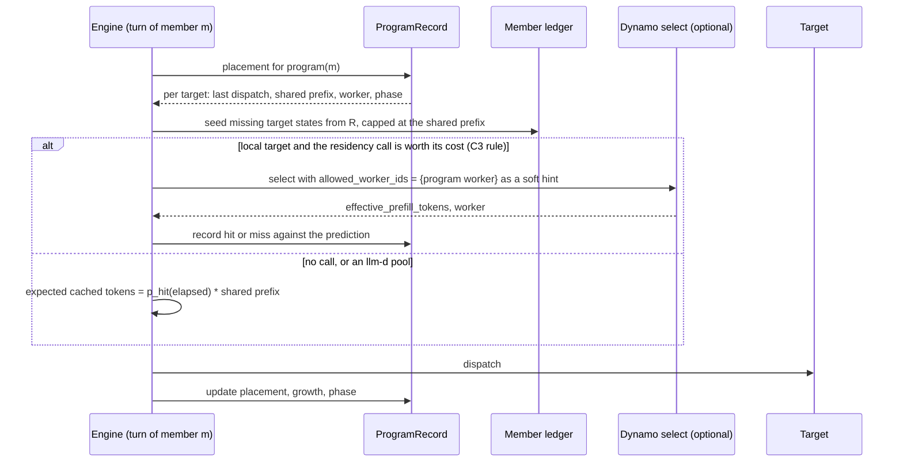

<!--
SPDX-FileCopyrightText: Copyright (c) 2026 NVIDIA CORPORATION & AFFILIATES. All rights reserved.
SPDX-License-Identifier: Apache-2.0
-->

# Program identity and program-level routing

> **Status: proposal, 2026-09-29. Not ruled.** Evidence: `../research/program-identity-evidence.md`. Written against Roundhouse `39353e5`, Codex pin `6344a65`, Dynamo pin `ac7b751`, and the llm-d "Flow Control: North Star" proposal (baseline `8bd261f1`). Section 7 lists the decisions that only the owner can make. When the owner rules, add a dated addendum. Do not rewrite this text.

## 0. Summary

**Recommendation.** Roundhouse derives a program id for every conversation from lineage, not from a hash of the prompt. It reads the lineage that each client already declares (Codex `session-id`, Claude Code `x-claude-code-session-id`, opencode's parent header) as an accelerator. It then links a new conversation to an existing program when the new conversation's first request resends an item that Roundhouse itself emitted for that program. A conversation with neither signal becomes the root of a new program. The program id is an opaque keyed digest of the root's qualified name. Roundhouse records it once per conversation, in the conversation's own log.

**Why not a root-prefix hash.** At the Codex pin, a sub-agent with default arguments starts with only its task prompt, and a partial fork drops the root user item (evidence §3.3). A Claude Code Task sub-agent has its own context window (evidence §4.2). A root-prefix hash therefore misses every fresh spawn and every partial fork. It also joins unrelated sessions that share a system prompt and a tool preamble, which every session of one client version does. The preamble digest keeps one job: a placement hint for a group of programs.

**Program state.** Roundhouse keeps, per program, where each member was routed (target, worker, node), token growth, idle time, the phase of each member, sibling counts, and the priority band. High-level placement reads that state instead of an exact KV index. When Roundhouse does ask Dynamo for residency, Dynamo's answer wins and the program records a miss.

**Trusted hop.** Toward an llm-d-routed pool, Roundhouse sets or strips the four policy headers, sets `session-id` to the program id, and never passes a client policy header through unchanged. It maps each refusal reason to its existing failover classes.

**Main risk.** Fresh spawns carry no content that links them to their parent. Their program membership therefore depends on headers that are version-fragile: the Claude sub-agent headers were never captured, and the opencode names are disputed. Milestone P0 captures that evidence before any code depends on it.

## 1. Terms

- **Program**: the tree of conversations of one agent task. This matches llm-d's `(tenant, root)` program. It does not match Dynamo ThunderAgent's `program_id`, which is one chain.
- **Member**: one conversation in the program. It has one append-only history and one conversation name in Roundhouse. Its generations (`#g{n}`) stay in the same member.
- **Root**: the member that started the program.
- **Context fork**: a child that starts with a copy of part of its parent's history.
- **Fresh spawn**: a child that starts with only a task prompt.
- **Priority band**: the flow-control priority class. This document never uses "band" for the learner's complexity band.

## 2. Program identity

### 2.1 Requirements

1. **Harness-neutral.** One request tree yields one program under the Codex, Claude Code, opencode, and headerless framings. This is the llm-d harness equivalence invariant [fc Workload §3.1, §5.2].
2. **Transparent.** No client change. Only signals that clients already send.
3. **Never a log key.** Program identity is an attribute of a member. It never changes which session or which generation a turn binds to. Prefix admission, `anonymous_key`, and the refusal in `RequestContext::from_request` stay exactly as they are (`messages_api.rs:546`, `request_context.rs:33-38`).
4. **Tenant-scoped.** No input from one principal can place a request in another principal's program.
5. **Cheap on the turn path.** An ordinary turn of a known member does no extra store read.
6. **Durable.** A restart, a failover to another node, and a replay of the log reproduce the same program id.
7. **Contained.** Lineage signals can split or merge a caller's tree. A client that mints a new session id per child and sends no parent splits its tree, today and under this scheme. An emitted link merges. Both effects stay inside the caller's principal, which comes from the bearer key and which the caller cannot choose per request. An emitted link only merges, and a merge only lowers the caller's aggregate share. That agrees with the flow-control trust rule: an untrusted signal can lower standing and never raise it [fc Foundations §2.3].

### 2.2 Options

| Option | Inputs | Catches | Misses | Failure modes |
|---|---|---|---|---|
| (a) Root-prefix hash, with longest-common-prefix match against known programs | Digest of system, developer, tools, and first user item. Block hashes for the match. | Full context forks under a new name. | Fresh spawns. Partial forks (root user item dropped). A child with a different system prompt or tool set. | Joins unrelated sessions of one client version that open with the same first message. Needs a content index across programs, which is the exact-index work the owner wants to remove. Tokenizer-dependent if it uses block hashes. |
| (b) Declared headers | Codex `session-id` and `x-codex-parent-thread-id`. Claude session, agent, and parent-agent headers. opencode session and parent headers. `x-dynamo-*`. | Every in-process sub-agent of Codex and Claude Code. opencode children with a parent header. | Claude teammates and `--fork-session` (new session id, parent only on the command line). opencode calls that omit the parent. Any client without headers. | Version-fragile: header names move between releases. Caller-asserted: a client can claim any root inside its own namespace. |
| (c) Emitted-item link | Call ids that Roundhouse emitted, and optionally a keyed digest of each assistant item it emitted, looked up at a new member's first turn. | Every context fork, full or partial, under any name, from any client. | Fresh spawns. | False link only when an emitted id repeats inside one principal. Ambiguous ids resolve to no link. |
| (d) Spawn-argument link | Keyed digest of long string arguments of emitted tool calls, compared with the blocks of a new member's first user item. | Fresh spawns, if the harness passes the prompt verbatim. | Harnesses that wrap or rewrite the prompt. | Unverified. Gated on P0 evidence. |

### 2.3 Recommended scheme: lineage first, emitted-item link second

**Inputs.**

- `P`: the principal namespace that `ControlPlane::qualify` already uses.
- `D`: the dialect namespace (`openai_responses` or `anthropic_messages`).
- `member_key`: the conversation name that the surface already resolves (Responses `conversation_key`, Messages `session_key`).
- `declared`: a pure per-dialect parse of the request headers into `(root, member, parent, kind)`, each optional:
  - Codex: root from `session-id`, else turn metadata `session_id`. Member from `thread-id`, else turn metadata `thread_id`. Parent from `x-codex-parent-thread-id`, else turn metadata `parent_thread_id`. Kind from `x-openai-subagent`.
  - Claude Code: root from `x-claude-code-session-id`, else the `metadata.user_id` session component. Member from `x-claude-code-agent-id`. Parent from `x-claude-code-parent-agent-id`, else the root when an agent id is present.
  - opencode: member and parent from its session and parent headers, with both disputed names accepted until P0 settles them. No declared root. The root comes from a walk of the parent map.
  - `x-dynamo-session-id` and `x-dynamo-parent-session-id`: member and parent. No declared root.
- `emitted`: the call ids in the claimed history, taken from the tail first, at most 8. They are read only on the first turn of a new key.

**One name space for lineage.** A client names members with its own ids (a Codex thread id, a Claude agent id, an opencode session id). Roundhouse names them with `member_key`. The call map answers with a session id that carries a `#g{n}` suffix. The rule needs all three to meet in one place:

- `name(x) = qualify(P, D, x)` for a client id `x`. A `member_key` is already qualified.
- `program_of_name(name)` is one map family in `CorrelationMaps`. When a member binds, Roundhouse writes its program under its `member_key`, under `name(declared.member)` when present, and under `name(declared.root)` when the member created the program.
- `Conversations` gains `key_of_session`, the inverse of `bound_session`, so an emitted link can map the emitting session back to its key. The `#g{n}` convention stays owned by `Conversations`.
- Each member's program is stored under its own names. A parent lookup is therefore one read, and no walk is necessary. An opencode call that omits its parent finds its own session id already bound.

**Resolution, once per member.** Parent and program resolve separately.

```text
resolve(member):
  if program_of_name(member_key) is bound: return it            # ordinary turn, one memo read

  parent  = name(declared.parent)                                # Codex parent thread, Claude parent agent,
                                                                 # opencode parent, x-dynamo parent
         or emitted_parent                                       # first turn of a new key only
         or name(declared.root) when declared.member is present  # top-level Claude sub-agent
         or none

  program = program_of_name(name(declared.root)), if bound       # an existing family
         or program_of(emitted_parent), if present               # a context fork, including D2
         or program_of_name(parent), if bound                    # a known parent
         or new(root = name(declared.root)), if present          # a new family
         or new(root = parent), if present                       # a stray child roots at its named parent
         or new(root = name(declared.member) or member_key)      # self-root

  depth = depth(parent) + 1, or 0 without a parent
  write ProgramBound, program_of_name entries, and the parent edge
```

- **Tie rule.** An emitted link overrides a declared root only when no program exists yet for that root. Example: Claude Code `--fork-session` sends a new session id and resends the parent's history. No program exists for the new id, so the emitted link places the new session in the parent's program (decision D2).
- **Convergence.** A stray child that roots at its named parent writes the program under the parent's name. When the parent arrives later, `program_of_name` already answers for it, so the split heals. The llm-d document leaves this merge open [fc Workload §5.1].
- **The program id.** `new(root)` computes `"prg_" + base32(HMAC-SHA256(deployment_key, "roundhouse-program-v1\0" + root))[..26]` once. Every later member copies the stored id and never recomputes it. The key is one deployment secret, shared by every node. A key rotation therefore changes only programs created after it.
- **Emitted ids.** The emitted link needs the call map for both dialects. Today only the Messages follower writes it (`follower.rs:270`). Milestone P2 adds the same write on the Responses surface. `emitted_parent` is the session of the most recent claimed id that `session_of_call` resolves unambiguously.
- **Ambiguity.** The call map's ambiguity rule becomes part of this rule. An id bound to two sessions of one principal resolves to nothing, so it gives no link (`correlation.rs:256-271`). Short or sequential ids that repeat therefore fail closed to the next rung.

**What is recorded.**

- A `ProgramBound { program_id, parent_member, method, depth }` event in the member's log, before its first turn event. A replay reads it back, so the program survives restarts without the correlation store (decision D3).
- The `program_of_name` entries and the parent edge in `CorrelationMaps`, next to the generation, call, and thread families. They use the in-process or Redis implementation that the deployment already configures.
- A later generation of the same key reads `program_of_name(member_key)` and keeps the program.

### 2.4 Trust

- All lineage headers are caller-asserted. Roundhouse reads them from any client, as llm-d does [fc Foundations §2.3, "Caller-supplied lineage ... read from any hop"].
- Every lookup is inside `P`. A forged root or parent can only name a program of the same principal, as the thread binding already does (`responses_api.rs:553-561`).
- Lineage never raises standing. The priority band of a member is `min(root band, explicit lower objective)` [fc Workload §3.3]. A declared `kind` (for example Codex `compact` or `memory_consolidation`) orders eviction inside the program only. It never lowers a parented child's priority band.

### 2.5 Why content linking is acceptable here

The flow-control document refuses to infer lineage from prompt text or traffic timing [fc Workload §4.3, Foundations §3]. That refusal fits a router that sees only the request. It cannot tell a copy from a coincidence.

Roundhouse holds different evidence. It emitted the ids and it holds the durable log that contains them. An emitted call id in a resent history is not a guess from similar text. It is proof that the client copied this deployment's output. Roundhouse does not use prompt similarity and does not use timing.

Downstream, Roundhouse emits only declared headers (section 4). llm-d therefore never infers anything. It reads a stamp from a hop that the operator declared trusted.

### 2.6 Failure modes

| Mode | Effect | Control |
|---|---|---|
| Unrelated sessions share a system prompt and tool preamble | None. The preamble is not an identity input. | The preamble digest is only a placement hint (section 3.3). |
| An emitted id repeats inside one principal | No link. The member self-roots. | The call map's ambiguity rule. |
| Two of a principal's tasks merge by mistake | That principal's share drops. The members stay on separate logs. | Requirement 7. No cross-tenant effect. |
| A fresh spawn with no headers | It self-roots. It is its own program. | P0 evidence for option (d). The llm-d document accepts the same outcome for a parentless request [fc Workload §3.2]. |
| Privacy of digests | A digest of a short or guessable string confirms that string. | HMAC with the deployment key. Only emitted ids and model output are indexed. Minimum length for option (d). TTL on every entry. Digests never leave the process or Redis. They never reach metrics, MCP answers, or a frontier request. |
| Cost | Ordinary turn: one memo read. First turn of a new key: at most 8 id reads, batched into one store round trip. | Lookups run only when `bind_prefix` opens generation zero of a new key and the claim holds an emitted id. A fresh root holds none and costs no read. |
| Restart | Program ids reappear from `ProgramBound` on replay. A fork that arrives after a restart and after the call map expired self-roots. That is the behavior of today. | Redis-backed call map where configured. |
| Multi-node | The identity is in Redis and in the log. Aggregate state is soft (section 3.2). | Only the first turn of a member reads the shared store. The flow-control rule against a shared store on the admission path applies to llm-d, and the ordinary turn here stays node-local. |
| A declared root that a client replaces between turns | The member keeps its first binding. | `program_of_name(member_key)` is set once and never advanced. |

### 2.7 Earlier rulings

| Earlier text | Relation |
|---|---|
| `anonymous_key` is not content-derived (`messages_api.rs:533-553`). | Unchanged. An anonymous request still gets a fresh session. It can still join a program through an emitted link, because the link shares no log. |
| A fingerprint "cannot supply the missing identity of an append-only history" (`request_context.rs:33-34`). | Unchanged. The program id is not a history identity. |
| The addendum's signal model (`agent-session-context-claude-wire-addendum-2026-09-16.md` §6). | Extended. `conversation_id` maps to the member. `client_session_group` maps to the declared root. `stable_anchor` stays a placement hint, renamed nowhere. `program_id` is a new row: the lineage root, derived as in section 2.3. |
| The llm-d refusal to infer lineage from text [fc Workload §4.3]. | Respected downstream. Section 2.5 gives the reason for the upstream difference. |

## 3. Program state

### 3.1 The record

```text
ProgramRecord
  program_id, principal, created_at_ms, last_active_at_ms
  priority_band                      resolved once at the root
  phase                              active | acting (tool pause) | idle | closed
  members: bounded map member_key -> MemberState
      parent, depth, kind, first_turn_at_ms, last_turn_at_ms
      last_stop                      tool_call | end | error
      isl_tokens_last, output_tokens_total, turns
      in_flight                      0 or 1
  siblings: parent -> live child count
  placement: per target key -> PlacementState
      last_dispatch_at_ms, last_prefix_tokens, shared_prefix_tokens
      worker (worker_id, dp_rank), node, pool
      residency_answer (effective_prefill_tokens, longest_matched_tokens, at_ms), when asked
      hits, misses                   predicted versus observed
  growth
      isl_growth_per_turn (EWMA), tokens_per_minute, predicted_next_isl
  preamble_digest                    placement hint shared across programs
```

- **Phase.** A member is `acting` when its last response ended on a tool call and no request is in flight. The program is `acting` when every live member is `acting`. It is `idle` after an idle window, and `closed` after the program-end window or a declared close. This is the input a between-turns residency lease needs [fc North Star Event 4].
- **Sibling count.** Observed from live children per parent. It feeds the foreground-join rule when a harness does not declare it [fc Workload §3.3].
- **Priority band.** Roundhouse has no priority bands today. The first version stores the objective name that section 4 stamps, resolved from operator configuration.

### 3.2 Where the record lives

- **Identity is durable.** It is in `ProgramBound` and in `CorrelationMaps` (section 2.3).
- **Aggregate state is soft.** It is a node-local cache keyed by program id, updated at each turn's `Routed` and terminal events. A compact summary goes to Redis after each turn, last writer wins per field by `at_ms`. A lost record costs one cold placement, which is the behavior of today.
- The record is not rebuilt by a replay of every member's log. That cost grows with the program, and a lost aggregate is cheap.

### 3.3 Placement without an exact index

Two tiers, with one owner each:



- **Tier 1 (Roundhouse): which target, which pool, which worker group.** It reads the program record. The expected cached tokens on a target are `p_hit(now - last_dispatch) * min(shared_prefix, cacheable_prefix)`, with the target's existing `CacheModel`. No index is queried. This is what the ledger already does for frontier targets, where no index exists (`ledger.rs:1-24`).
- **Tier 2 (the pool): which exact worker.** Dynamo's embedded selector, or llm-d placement, keeps its own exact prefix index if it has one. Roundhouse sends the program's worker as a hint (`allowed_worker_ids` or `pinned_worker`, both unused today, `local.rs:100-137`). A pinned worker is used only when the program is `acting` and inside its residency window. Otherwise the hint is an allowed set that includes the program's worker, or nothing.
- **Dynamo wins on conflict.** When Roundhouse asks for residency, the answer replaces the prediction for that turn. A prediction of warm with an answer of cold is a miss. The miss rate per target is the measure that says whether tier 1 can stand alone.
- **The preamble digest.** Programs of one client version share a system prompt and a tool preamble. That share is large for Claude Code, where the tool array is 79% of a measured turn's bytes (`messages_api.rs:361`). A cold root can prefer a worker that recently served the same preamble digest. That is a hint across programs, never an identity.

### 3.4 The per-member ledger

- The ledger stays per member, a projection of the member's log (`session.rs:358`, `:773`). Nothing about its replay changes.
- **Identity and price come from different evidence.** The emitted ids prove that a member is a fork. They do not say how much of the parent's cache the fork can read. Provider caches and Dynamo blocks match from the start of the prompt only.
- **Inheritance at the first turn of a linked member.** A fork child today opens a fresh session and is priced cold (`prefix_admission.rs:227-240`). With a program link, each target state that the child lacks is seeded from the parent's state, under four caps:
  - **Leading run.** The shared prefix is the longest common leading run of items between the child's claim and the parent's log. For a full fork that is the copied history. For a partial fork (`fork_turns: "2"`) it is the instructions only.
  - **Tokens.** The item run converts to tokens with the same tokenizer and counting that `Engine::admitted_input_tokens` uses for the child's claim.
  - **Markers.** The seed is at most `min(shared tokens, parent.cacheable_prefix_tokens())`, so an Anthropic block marker is respected (`ledger.rs:465-476`).
  - **Tools.** Tools are not items. A tool change invalidates the whole Anthropic cache hierarchy (`agent-session-context-claude-wire-addendum-2026-09-16.md` §5). The seed applies only when the child's tools digest equals the parent's digest at the parent's last dispatch to that target.
- **Replay.** The seed is a log event, `LedgerSeeded { from_member, target, prefix_tokens, parent_last_call_at_ms, tools_digest }`, so a replay reproduces the price without the parent's log (decision D3).
- **The gain.** This is the first measurable gain. It applies to frontier targets too, because Anthropic and OpenAI caches match exact prefixes, and a fork child that stays on its parent's target reads its parent's cache. The existing predicted-versus-observed cache metrics (`330cacb`) measure it without new instruments.

## 4. Roundhouse as the trusted hop

### 4.1 Topology

- No target kind exists for an llm-d-routed pool today. Local inference goes through the embedded Dynamo selector, where Roundhouse picks the worker. Section 4 applies to a new target kind: an OpenAI-compatible or Messages-compatible endpoint behind an llm-d endpoint picker, where llm-d picks the worker.
- Roundhouse builds every outbound request itself (`openai_responses.rs:403-413`). "Strip" therefore means "do not copy". No client header reaches a pool unless Roundhouse sets it.
- The operator declares the Roundhouse hop trusted in llm-d. That obliges Roundhouse to set or strip all four policy headers on every request [fc Foundations §2.3, Client Wire Conventions §3].

### 4.2 Headers toward an llm-d pool

| Header | Action | Value |
|---|---|---|
| `x-llm-d-inference-fairness-id` | Set | Tenant: a keyed digest of the principal namespace. |
| `x-gateway-inference-fairness-id` | Strip | Deprecated alias. |
| `x-llm-d-inference-objective` | Set | The objective name for the member's priority band, from operator configuration. |
| `x-gateway-inference-objective` | Strip | Deprecated alias. |
| `x-llm-d-slo-ttft-ms`, `x-llm-d-slo-tpot-ms` | Set or strip | The policy target. When a client sent a tighter value through a Roundhouse-defined channel, the minimum of the two. Never the client's value unchanged. |
| `x-slo-ttft-ms`, `x-slo-tpot-ms` | Strip | Deprecated aliases. |
| `x-llm-d-inference-ttl` | Set | The remaining turn deadline. |
| `x-claude-code-session-id`, `x-session-affinity`, `session_id` | Strip | The `agent-identity` plugin reads the first present header [fc Client Wire Conventions §1.1]. Only one is set. |
| `session-id` | Set | The program id. llm-d's Codex rule reads it as the root, so the whole tree forms one `(tenant, root)` program with no parent map in llm-d. |
| Candidate lineage fields (root, parent, sibling count, kind, retry marker, declared close) | Not set yet | The document leaves the names open [fc Client Wire Conventions §2.1]. Roundhouse sets them when names exist (decision D7). |
| `x-dynamo-session-id`, `x-dynamo-parent-session-id`, `x-dynamo-session-final` | Set toward a Dynamo HTTP pool | Member, parent member, and program close. Dynamo's session is one chain, so the values are members, not the program. These names are also a candidate for the open llm-d lineage fields. |

- Roundhouse resolves the priority band itself and stamps the objective per request. A child therefore inherits its parent's band at the Roundhouse hop, and llm-d needs no parent map for band inheritance.
- The program id, the tenant digest, and the lineage headers go to local pools only. A frontier request keeps the client's own ids (`engine.rs:3033-3035`) and never carries a program id or a digest.

### 4.3 Refusals and evictions

The failover boundary is `execute`. A body that fails after its first byte is not retried, because deltas are durable as they arrive (`engine.rs:2600-2607`). Today a local target does not fail over at all (`engine.rs:2609-2612`). Whether an llm-d pool counts as local for that rule is decision D6.

| `x-llm-d-request-dropped-reason` | Status | Roundhouse action |
|---|---|---|
| `rejected-saturated` (with `Retry-After`) | 429 | Before the body: fail over to the next admitted candidate under the same deadline. Record the reason and the retry hint on the attempt. Record a capacity miss on the program's placement for that pool. |
| `rejected-ttl-expired` | 429 | Fail over only if the deadline still allows a turn. Otherwise end the turn with a typed failure. |
| `evicted`, before headers | 429 | Fail over. The next request of the same member to the same pool carries the retry marker when a name exists. |
| `evicted`, in the stream (designed carrier) | 200 | No failover. End the turn with a typed failure that names the reason. Mark the member's placement as evicted. The client's resend passes through prefix admission as usual. P5 first adds a failing test for the log state after a partial answer. |
| `rejected-no-endpoints` | 503 | Fail over. Mark the pool unavailable for a short cooldown. |
| `rejected-context-cancelled` | 503 | No action. Roundhouse cancelled the request. |
| `rejected-shutting-down` | 503 | Fail over. |
| `rejected-internal` | 500 | The existing 5xx class. |
| Any other value | any | Branch on the status, as the document asks. |

- **`Retry-After` to the client.** Today a status code can reach the client only before the turn is spawned. The surface returns the SSE stream right after the spawn (`responses_api.rs:321-329`). An upstream 429 therefore reaches the client as an in-stream failure, never as HTTP 429. If Roundhouse holds the response headers until `execute` returns, it can answer 429 with `Retry-After` when no candidate remains. The client waits for the first byte in both cases, so time to first token does not change (decision D5).
- **Local-only programs.** A program with a local-only member fails over only to another local target. A refusal from a local pool never moves a local-only turn to a frontier model, which is the T6 rule for egress.

## 5. The online learner

| Site | Today | Change |
|---|---|---|
| Learner keys (`LevelKey`, per turn) | `rules_pick`, complexity bands, tool flag (`input.rs:195-280`). | None in revision 1. Program state reaches a strategy through its plan's quotes, the same way cache state does (`input.rs:1-11`). |
| Arm assignment | Per session (`arm.rs:105`). | Siblings of one program in different arms share targets and cache, so each arm's result contaminates the other. Propose `Arm::for_program`, with a new draw version (decision D8). |
| Exploration draw | Per session and response (`explore.rs:45`). | None. A draw per member turn stays exact and reproducible. |
| `min_sessions` at the gate | Counts sessions (`gate.rs:215`). | Five siblings count as five independent sessions. Propose a count of distinct programs (decision D8). |
| Estimand bootstrap | Clustered by session (`PLAN-online-routing-learner.md:94`). | Cluster by program. Correlated siblings otherwise narrow the interval without cause. |
| Credit | Consistent-trajectory credit per interval (`credit.rs:1-13`). | None. |
| Learning entries | No program field. | Add `program_id` with a serde default, for offline analysis. |

## 6. Milestones

Each milestone is one PR, branched from `main`. Tests come first in each.

**P0: evidence capture (documents only).**

- Tests first: none. Each fixture has a probe script in the style of `claude-code-wire-probe.py`.
- Capture: a real Claude Code Task sub-agent request, a nested sub-agent, a teammate, and a `--fork-session` exchange. Codex `spawn_agent` with `fork_turns` `none`, `all`, and `2`, at the pin's line and at the box's binary. An opencode child with and without a parent. For each fresh spawn, compare a keyed digest of the spawn argument with each block of the child's first user item.
- Done means: sanitized fixtures in `agent-docs/research/`, a dated addendum to the evidence document, and the section 10 rows closed or restated.

**P1: lineage parsing.**

- Tests first: a table test per dialect from the P0 fixtures. Absent, blank, oversized, and non-UTF-8 values parse to "absent". Both disputed opencode names parse. A child Claude request yields the session as its parent when the parent header is absent.
- Change: a pure `Lineage` parse per dialect. Logged at `info` beside the existing context signal. No behavior change.
- Done means: the parse is a function with no store access, and every fixture passes.

**P2: program binding.**

- Tests first: the harness equivalence test. One request tree (root, three children, one nested child) goes through the Codex, Claude Code, opencode, and headerless framings, and the test asserts equal program grouping for every framing that carries lineage. Also: a context fork under a new name joins the parent's program. An ambiguous emitted id gives no link. Another principal's emitted id gives no link. A replay reproduces every program id. A history-rewrite generation keeps its program. A fresh root does zero call-map reads (counter). A known member does no store read.
- Change: `ProgramId`, the `ProgramBound` event, the `program_of_name` family and the parent edge in `CorrelationMaps`, `Conversations::key_of_session`, with the in-process and Redis contract tests, call binding on the Responses surface, and resolution after `bind_prefix`.
- Done means: every test above passes, and a mutation of each resolution branch turns its guard red.

**P3: program state and ledger inheritance.**

- Tests first: a fork child's first turn is priced warm on its parent's frontier target, capped at the shared prefix. An unrelated root is still priced cold. The seed never exceeds the shared prefix. A replay reproduces the seeded price. The phase moves to `acting` after a tool-call stop and back on the next request.
- Change: `ProgramRecord`, the `LedgerSeeded` event, and the soft cache with its Redis summary.
- Done means: the predicted-versus-observed metrics show the seeded predictions in a live or mocker run, with numbers.

**P4: program placement on the embedded fleet.**

- Tests first, with the embedded selector and the mocker: the program's worker is sent as an allowed set. A Dynamo answer of cold overrides a warm prediction and records a miss. The pin is used only while the program is `acting` inside its window. The C3 skip rules still hold.
- Done means: a mocker replay of a forked agent trace shows the hit rate and TTFT with and without program placement.

**P5: the llm-d pool target.**

- Tests first: header conformance (no client policy header survives, `session-id` equals the program id, exactly one session header). Each reason in section 4.3 maps to its class. No program id or digest appears on a frontier request. A local-only program never fails over to a frontier target. The log state after an in-stream eviction and a client resend.
- Done means: the tests pass against a stub pool, and the section 4.3 table is the code's table.

**P6: learner scope.**

- Tests first, per the owner's D8 ruling: arm stability across siblings, `min_programs` counts, and a bootstrap clustered by program.
- Done means: a new draw version, and the calibrator report labels the cluster unit.

## 7. Decisions for the owner

1. **D1. The scheme.** Adopt lineage first with the emitted-item link (recommended), or headers only, or a root-prefix hash.
2. **D2. Merging a self-declared new root.** When a new session id resends a known program's emitted items (Claude `--fork-session`, a teammate with copied history), merge it into that program (recommended) or keep it separate.
3. **D3. New log events.** `ProgramBound` and `LedgerSeeded` as new event kinds in the session log (recommended), or the correlation maps only with no replayable seed.
4. **D4. Aggregate state.** Soft node-local cache with a Redis summary (recommended) or Redis as the authority.
5. **D5. `Retry-After` to the client.** Hold response headers until `execute` returns, so an upstream 429 can reach the client as HTTP 429, or keep the in-stream failure.
6. **D6. An llm-d pool as a local target.** This decides the failover rule and the T6 egress rule for the pool.
7. **D7. Lineage header names downstream.** Wait for llm-d to name them, propose Dynamo's `x-dynamo-*` names upstream, or propose new names.
8. **D8. Learner scope.** Arm assignment by program, `min_sessions` as distinct programs, and bootstrap clusters by program. Each change needs a new draw or revision version.
9. **D9. Spawn-argument link.** Build option (d) only if P0 shows that harnesses pass the prompt verbatim.
10. **D10. opencode priority.** opencode is possibly not served transparently today (evidence §5). Decide whether P1 includes an opencode conversation name.

## 8. Out of scope

- Queue ordering, capacity holds, and leases inside Roundhouse. Those belong to the pool's router. Roundhouse supplies the program, the priority band, and the phase.
- An exact KV index in Roundhouse. Tier 2 keeps whatever index the pool has.
- Any change to prefix admission, to the conversation name, or to the refusal for a Responses request with no name.
