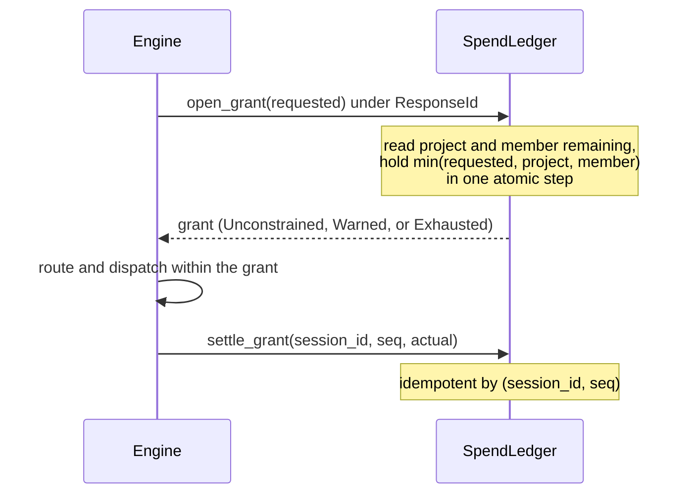

# Control plane

The control plane decides who is asking, what their turns can be routed to, and what those turns can cost. This chapter explains the entities, keys, policy, budgets, fair-use windows, and the admin plane, and why each has its shape. To write the configuration file, see [Configure tenancy and keys](../guides/tenancy.md).

## Projects, users, and memberships

- A **project** has a policy, a budget, and fair-use windows.
- A **user** is a person or an agent identity.
- A **membership** joins one user to one project.

A turn is attributed to a membership, as the `Principal` pair `project/user`. Keys belong to memberships. Each key resolves to exactly one membership, so below the auth extractor there is no `Option<ProjectId>`. A user on five projects holds five keys.

The rejected alternative is one key per user plus a project selector on each request. The session namespace needs the project before the body is parsed, and a selector that changes mid-conversation forks the session and loses the warm prefix. A client-supplied selector is not authenticated. LiteLLM's single key plus `x-litellm-end-user-id` cannot scope a budget to a key and team together (LiteLLM issue #28750). A revocation must also hit the org chart, as with OpenAI `sk-proj-` keys and Anthropic workspace keys.

The key is not the identity. It resolves to a membership, so an SSO or JWT resolver can be added without a schema change.

## Open mode and configured mode

`ROUNDHOUSE_CONTROL_PLANE` names a JSON file, as `ROUNDHOUSE_CATALOG` does. The format is the deserialized types, so no schema document exists to drift from the code. A named file that cannot be read stops the process. Load rejects shapes that would resolve ambiguously at request time. Every entry is `deny_unknown_fields`, because most optional fields widen when absent: a misspelled field would silently mean unrestricted routing or unlimited spend.

When the variable is unset, roundhouse runs in **Open mode**. Every request resolves to the single `default/default` principal, and no surface asks for a key. The offline demo depends on this. When the variable is set, every surface asks for a key.

## Keys

A key is `rh_turn_<43 base62 chars>` or `rh_admin_<43 base62 chars>`. The tail is 32 CSPRNG bytes. The role prefix lets a scope match trust the key kind from its structure.

The file holds only `sha256(secret)`, hex-encoded, and the hash is the lookup key. SHA-256 is used, not a slow KDF such as Argon2. A work factor defends against a dictionary of likely passwords, and none exists for 256 random bits. A KDF would add 50-100 ms to every admission and defend against nothing.

A turn key arrives in `x-roundhouse-key: rh_turn_…` or in `Authorization: Bearer rh_turn_…`. When both are present, the dedicated header wins. Codex fills it from `env_http_headers` when its `Authorization` carries a forwarded upstream login. An admin key uses the same headers on admin routes.

| Code | Status | Meaning |
|---|---|---|
| `missing_key` | 401 | No roundhouse key reached the deployment. An `Authorization` bearer outside the `rh_` namespace counts as no key. |
| `malformed_key` | 401 | The value starts with `rh_` but is not `rh_(turn\|admin)_<43 base62 chars>`, or `Authorization` is not a bearer. |
| `unknown_key` | 401 | No record has this hash. |
| `revoked_key` | 401 | The key was revoked. |
| `project_archived` | 403 | The key is intact, but its project is archived. |
| `wrong_key_kind` | 403 | An admin key on a turn route, or a turn key on an admin route. |
| `session_out_of_namespace` | 403 | The session id belongs to another tenant. |
| `admin_requires_control_plane` | 403 | An admin route in Open mode. |

Revoked and archived keys are checked before `unknown_key`, so an operator can tell theft from a typo. Codex drops an `env_http_headers` entry without an error when its variable is unset, blank, or ends in a newline. So the `missing_key` message names the dedicated header, not `Authorization`.

## Policy narrows and never widens

A project's `"policy"` becomes its `TurnPolicy`, with three axes: `min_quality`, `allow` (globs over `provider/model` or `local/model`), and `frontier_cadence`. [Routing and the selection service](routing.md) explains how routing reads them.

A key's `"overrides"` compose onto the project policy through `TurnPolicy::narrow`, the only composition operator. An agent's MCP overlay and a validator escalation use it too, so no layer can widen what the membership allows. An override wider than its project on any axis is rejected at load, naming both entries, because a file that silently means less than it says is worse than one that fails to load.

## Budgets are grant ledgers

A project `"budget"` is a spend ceiling with a window of `total` or `monthly`. A monthly window resets at the UTC month boundary. A budget is a grant ledger, not a counter.

- `open_grant` reads both ceilings and holds the minimum in one atomic step. With two steps, concurrent grants under one membership can together pass the limit. On Redis, each ledger call is one Lua script and one round trip.
- A hold whose turn died lapses on its TTL: `turn_deadline_ms` plus 30 s. No sweeper exists.
- A settle that a crash lost is repaired when the session next opens. A session that never opens again keeps the loss, limited to its last turn, as negative `drift_usd`.

A grant is an admission ceiling, not a limit on realized spend. It is priced from `expected_output_tokens`, so a reasoning-heavy turn can settle above its hold. The overshoot goes into `committed_usd`, and the next grant sees it. A settle reads its budget draw from `DecisionRecord.budget_draw`, written at decision time, so a budget change governs only turns decided after it lands.

The metrics fold cannot gate a budget. The turn gate is per session, so two concurrent sessions under one membership can both read a stale fold and together overspend, even in one process. The contract test `concurrent_grants_cannot_jointly_exceed_the_limit` proves the reservation holds. So two numbers exist and are never summed: `committed_usd` enforces, and `measured_usd`, folded from logs, is the authority. See [Cost and savings](cost-and-savings.md).

### Allocations

A membership's `"allocation"` is `pooled`, `capped { limit_usd }`, or `share { fraction }`, with the fraction in (0.0, 1.0].

- Both the project ceiling and the member ceiling apply, and the tighter wins. In LiteLLM one ceiling silently overrides the other.
- Shares can sum past 1.0. Allocations are ceilings, not a partition, as in Anthropic's workspace model. The admin view shows the sum and does not refuse it.
- The allocation is on the membership, not the user, because one user can be frugal on one project and unconstrained on another.

### Exhaustion

`on_exhaustion` is `degrade_to_local` or `refuse`. The file must state it.

Degrade-to-local needs no branch. `TurnBudget::admits` admits a local candidate by its target, and a zero ceiling excludes every frontier candidate. It admits local by target and not by quote, because with a `local_capacity_price` in the catalog a local quote has a nonzero cost. That is GPU time the deployment already owns, not granted money, and comparing it with the grant would refuse the one turn that degrade-to-local exists to serve.

A frontier model that the budget excludes stays in `considered`, so its counterfactual saving stays true, and the turn records `budget_state: Exhausted`. `refuse` ends the turn as `ResponseIncomplete { reason: BudgetExhausted }`, a log fact the fold can read. The turn stays retryable, which suits a limit an admin can raise.

`overflow_when_local_saturated` (default `true`) applies only under `degrade_to_local`. When the budget is exhausted and the local pool cannot serve, the turn goes to a frontier model and does not fail. The overspend settles into `committed_usd`, so the ledger visibly passes its limit, and the `DecisionRecord` marks each overflow dispatch for its own dashboard number. Overflow relaxes only the budget axis. The allow filter, quality floor, and cadence still apply. The flag under `refuse` is rejected at load. A degrade-mode budget with overflow off, in a deployment with no local capacity, is refused at boot.

### The budget window cannot change

A `balance()` read that carries the wrong `BudgetWindow` rolls the window: `total` to `monthly` zeroes the account, and `monthly` to `total` reads a month as a lifetime. A probe proved this. So the reconciliation view reads `balance` only with the `BudgetTerms` of the compiled admission, or of `ControlDirectory::membership_terms` when all of a member's keys are revoked. A `PATCH` that changes a budget window is refused with `400 window_change_unsupported`.

## Credentials and who pays

A project's `"credentials"` block decides whose provider key a frontier turn uses. The `mode` is `project_only`, `prefer_user` (the default), `user_only`, or `pass_through`.

- `prefer_user` fits both kinds of member: one who attached a key uses it, and one who did not still gets served.
- Credential availability filters the candidate set before `choose()`. So `payer` (`Deployment`, `Project`, or `User`) is recorded on the `DecisionRecord`, and savings are never priced against a model the caller cannot reach.
- Under `user_only`, a member with no credential loses that provider's models and degrades to local, as with budget exhaustion: a served turn plus a marker, not a 500.
- `budget_counts` decides whether user-paid spend draws the project budget. `all_frontier_spend` (the default) counts it. `project_paid_only` leaves it out.

The credential reaches the transport as a field on `FrontierQuote`, the only argument `execute` receives. The rejected alternative was one client per user, which asks connection-pool code to hold a secret. The quote carries a redacting handle that gives the plaintext only inside `execute` (test `a_quote_never_carries_a_secret_across_a_whole_turn`).

### Pass-through

`pass_through` forwards the credential inside the client's own request. Roundhouse holds it in flight only, never stores it, and redacts it from logs. A locally routed turn never touches it. The design follows Switchyard's `forward_auth`. Four properties hold by construction in `crates/roundhouse-fleet/src/openai_responses.rs` and `anthropic_messages.rs`:

1. A client with redirects disabled carries forwarded credentials. Otherwise, a redirect to another origin would present the user's bearer there. The Responses client keeps an ordinary client for a stored key, because `reqwest` strips the `Authorization` header that a stored OpenAI key rides. It does not strip `x-api-key`, so the Messages client disables redirects on every route.
2. Forwarded headers come from an allowlist. OpenAI admits `authorization`, `chatgpt-account-id`, and `x-openai-fedramp`. Anthropic admits `authorization`, `x-api-key`, and `anthropic-beta`. The `anthropic-beta` value passes unchanged, because dropping `oauth-2025-04-20` from a subscription bearer is a 401.
3. An upstream error body is redacted of any echoed credential before roundhouse returns, logs, or stores it.
4. Forwarding excludes a stored key: `TurnCredential` has one arm for each.

### Stored subscription tokens are refused

Roundhouse does not store a ChatGPT or Claude subscription token to present it again from the server. No vendor approves this, and no gateway precedent exists. Neither client implements MCP sampling, the one client-side way to spend a subscription (see [MCP control surface](mcp.md#what-reaches-the-model)).

`POST /v1/admin/credentials` refuses OAuth-shaped input with `400 oauth_credentials_unsupported`. It refuses all other input with `501 credential_crud_not_available`, which names the config file as the authority. A credential entry in the file names an environment variable and never holds the key.

## Fair-use windows

A fair-use window caps a project's or a member's draw over a rolling `5h`, `24h`, or `7d` window, like a frontier lab's own session limits. It is not a calendar reset like `budget`.

- Each window needs `max_tokens`, `max_usd`, or both. A window with neither reads like a limit and enforces nothing, so load rejects it. A cap of zero is rejected too.
- A project window and a member window are two independent ceilings. Both apply, and the narrower refuses first. A copy of the project window on each member would refuse the second member of a busy project for the first member's traffic.
- The check is at admission, before any grant, so a refused turn leaves no hold.
- Draws are summed in 5-minute buckets, so a window can refuse up to one bucket early and never late.
- If the fair-use ledger is down, admission fails with `503 fair_use_unavailable`. The draw after a turn fails open and logs.

Fair use has its own trait, store, and draws because it has no hold, settle, or money to lose. A rolling window inside `BudgetWindow` would create the wrong-window hazard above.

### The 429

A turn over its window gets HTTP 429 with code `fair_use_exceeded`. The `error` object carries these fields beside `code` and `message`:

| Field | Meaning |
|---|---|
| `type` | `usage_limit_reached` on the Responses surface. `rate_limit_error` on the Messages surface. |
| `scope` | `project` or `member`. |
| `window` | `5h`, `24h`, or `7d`. |
| `quantity` | The cap that ran out: tokens or dollars. |
| `retry_at_ms` | The earliest time the window can have room. It is a floor, not a promise. |
| `resets_at` | `retry_at_ms` in unix seconds, rounded up. |

`type: "usage_limit_reached"` with `resets_at` is the one machine-readable 429 that Codex recognizes (`codex-api::api_bridge::map_api_error` at codex `6344a655` and `e363b08`). Codex turns any other 429 into `CodexErr::RetryLimit`, which names the wrong cause. The Responses surface sends no `Retry-After` header, because at those revisions Codex backoff takes no time from the server and `retry_429` is hard-coded `false`. Only fair use carries `usage_limit_reached`. On a spent budget or a rejected key, it would make Codex wait for a reset that never comes.

The Messages surface adds `roundhouse_code` to the error and a `retry-after` header in whole seconds, because the Claude Code backoff reads that header.

### Where the counters live

With `ROUNDHOUSE_REDIS_URL` set, the counters are rolling buckets in that Redis, so every node shares one ceiling. Without Redis they are in process memory, and the memory ledger logs a warning the first time it enforces a ceiling. The choice follows the deployment's shape and not whether a ceiling is configured, because the admin plane can add a ceiling at runtime.

Both ledgers count tokens and micro-dollars as integers, bounded at `MAX_COUNT = 2^53`, where a Lua double is still exact. A draw past the bound is refused before any write. Draws under one micro-dollar round to zero. Integers fixed a measured divergence: with `f64` dollars, $0.70 plus $0.10 under a $0.80 cap was admitted in memory and refused in Redis, and a differential fuzz put the retry times of the two backends up to 32 hours apart.

The caller supplies the clock, and the scripts never read Redis `TIME`. Each scope keeps a high-water mark of every time it has seen, and a check or draw earlier than the mark is evaluated at the mark. So a clock that steps back across nodes cannot make an admission more permissive.

## The admin plane

The admin plane (`/v1/admin/...`) is the only surface that writes tenancy: projects, users, memberships, and key mint and revoke. [Configure tenancy and keys](../guides/tenancy.md#use-the-admin-api) lists the routes.

In Open mode, it refuses every request with `403 admin_requires_control_plane`, before it reads a header. Where no key exists and none can be issued, "use a different key" is the wrong answer. The first admin key hash always comes from the file.

A minted secret is returned once. The key record keeps only `key_sha256` and `display_tail` (the last four characters), so no field can hold the plaintext. `key_id` is `key_` plus the first 16 hex characters of the hash, so a file-declared key has one too.

### File rows and admin rows

Admin entities join the file's entries in one `ControlPlaneConfig`, which the same `validate` compiles, so the two paths cannot disagree. Every row has one owner, shown as `provenance`: `config` or `admin`.

- File-owned rows are projected from the file on every read, never copied into the store. An edit between restarts is authoritative at the next boot.
- Changing a file-owned entity, or creating one that collides with a file identity, is refused with `409 config_owned`. A key cannot be minted under a membership that the file declared.
- Keys that the file declares, turn or admin, cannot be revoked through the API. So an API lockout cannot happen.

The rejected alternatives were to reconcile file and store at read time, "file as seed", and "store as truth". A reconciliation rule has cases it gets wrong quietly.

### Write order

Nine `DirectoryMutation` arms carry every write: `CreateProject`, `PatchProject`, `ArchiveProject`, `CreateUser`, `UpsertMembership`, `DeleteMembership`, `MintTurnKey`, `MintAdminKey`, and `RevokeKey`. Each write takes the write mutex, loads the records, changes a clone, compiles the resulting control plane (with the boot cross-checks against the catalog and fleet), commits with `store.commit(expected_version, next)`, and swaps this node's snapshot.

Compile before commit is load-bearing. A store that took the write first could persist a configuration that the deployment refuses to start under, a failure far from its cause. `commit` replaces the whole document, so the cascade of `DeleteMembership` (remove the membership, revoke its keys) is one commit. A backend that cannot compare-and-set cannot implement the trait. A project with a policy that nothing can serve is accepted at create and refused at the first mint.

### Archive

`DELETE /v1/admin/projects/{project}` sets `archived_at_ms` and nothing else. The compile step leaves archived projects out and answers their keys with `403 project_archived`, not 401, because the key is intact and the project is closed. No route deletes a project or undoes an archive, because spend history outlives the project. Dropping the row would answer `unknown_key` for a membership that the ledger still has numbers for.

### Revocation is bounded by a snapshot

Every surface holds a `ControlDirectory`, not a compiled plane, and re-resolves each request against an admission cache.

- The node that performs a write swaps its own snapshot at once.
- Another node refreshes when both hold: `admission_cache_ttl_ms` has passed since its last refresh (default 30 s, `DEFAULT_ADMISSION_CACHE_TTL_MS`), and the store's version moved. Nothing watches the directory. There is no pub/sub, only the poll.
- A failed refresh still stamps its time, as a backoff, so a revocation made during a store failure can take up to two TTLs. A refresh that loads a plane that does not compile has the same effect, and records the refused version.
- A TTL of `0` refreshes on every request.

The TTL is in the file with the keys because it is the operator's choice of how long a leaked key survives its revocation. A change affects the next admission and nothing in flight: a key revoked while a turn streams does not interrupt that turn, and a budget raised mid-turn does not raise that turn's ceiling.

Surfaces take a one-method trait, `PlaneSource`. `ControlDirectory` is the only implementation a production build can name. A bare `ControlPlane` serves as its own source only behind the `test-support` feature, so no production site can silently lose revocation. One revocation costs one compile however busy the node is, because the refresh stamps its time before its first store call.

### Divergent nodes and durability

Each writer stamps `compiled_under` with a fingerprint of its inputs: the control-plane file hash, the catalog identities, the routing candidates, the TTL, the judge model, and the learner artifacts. A node whose fingerprint differs logs a `DirectoryDivergence` warning once per stored version, names the input, and keeps serving. A refusal would make a rolling file change impossible. `ControlDirectory::status()` returns the served version, the refused version, and the divergence.

With `ROUNDHOUSE_REDIS_URL` set, the directory is a document in Redis that every node shares. Without it, admin-created rows are in process memory and are lost at restart. A durable ledger with an in-memory directory could, after a restart, reuse an archived project's id and join the new tenant to the old one's spend, so the directory uses the same switch as the ledger. See [Deploy with Redis](../operations/redis.md).

### The reconciliation view

`GET /v1/admin/projects/{project}/budget` shows the budget with each column stamped and never summed. A stamp is `{basis, window, window_start_ms}`.

| Field | Meaning |
|---|---|
| `committed_usd` | What the ledger charged against a ceiling within the budget window. Basis `ledger`. |
| `held_usd` | Live holds not yet settled. Only the project row has it. |
| `measured_usd` | What this process's metrics fold measured since it started. Basis `process-fold`, window `lifetime`. |
| `drift_usd` | `committed − measured`, not clamped in either direction. |
| `provider_reported_usd` | What the upstreams billed, when they report a price. It is never part of `drift_usd`. |
| `seat_tokens` | Tokens served under a forwarded subscription seat. They have no dollar figure. |
| `members` | The same columns for each membership, with `member_remaining_usd` and `allocation_share`. |
| `allocation_share_sum` | The sum of member shares. It can pass 1.0. |

`committed_usd`, `held_usd`, and `drift_usd` are `null` when the basis is `unenforced` (no budget), `no_keys`, or `archived`. A member whose keys are all revoked keeps real figures, stamped `revoked_keys`.

Different machinery produces the committed and measured columns, over different periods, so the view publishes the difference and the reason it is not an error. `measured_usd` cannot be windowed, because the fold keeps no per-interval buckets. Negative drift has three causes: a settle failed and was logged, a process restarted between dispatch and settle, or a turn is between its log write and its settle. The third is ordinary, and a nonzero `held_usd` marks it. [Cost and savings](cost-and-savings.md) covers `provider_reported_usd` and `seat_tokens`.

## Limits

- The admin plane has no audit trail and no pagination.
- A key cannot be rotated without a gap in service.
- No route stores provider credentials, deletes a project or user, or undoes an archive.
- Fair-use windows limit volume. Roundhouse has no request-rate limit.
- A member's fair-use window can only come from the file.
