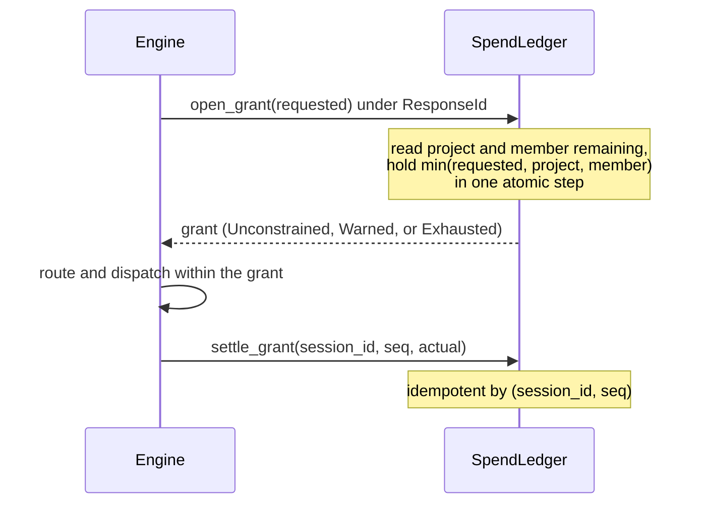

# Control plane

The control plane decides who is asking, what their turns can be routed to, and what those turns can cost. This chapter explains the entities, keys, policy, budgets, fair-use windows, and the admin plane, and why each one has its shape. To write the configuration file, see [Configure tenancy and keys](../guides/tenancy.md).

## Projects, users, and memberships

The control plane has three entities:

- A **project** has a policy, a budget, and fair-use windows.
- A **user** is a person or an agent identity.
- A **membership** joins one user to one project.

A turn is attributed to a membership, as the `Principal` pair `project/user`. Keys belong to memberships.

Each key resolves to exactly one membership. So the resolved caller is always complete: below the auth extractor there is no `Option<ProjectId>`. A user on five projects holds five keys.

The rejected alternative is one key per user plus a project selector sent with each request. It fails in four ways:

1. The session namespace needs the project before the body is parsed. A selector that changes mid-conversation forks the session and loses the warm prefix.
2. A selector that the client supplies is not authenticated.
3. The one production precedent, LiteLLM's single key plus `x-litellm-end-user-id`, cannot scope a budget to a compound of key and team (LiteLLM issue #28750). Roundhouse needs exactly that attribution.
4. The blast radius of a revocation must match the org chart, as with OpenAI `sk-proj-` keys and Anthropic workspace keys.

The key is not the identity. It resolves to a membership, so an SSO or JWT resolver can be added without a schema change.

## Open mode and configured mode

`ROUNDHOUSE_CONTROL_PLANE` names a JSON file. It uses the same idiom as `ROUNDHOUSE_CATALOG`:

- The file format is the deserialized types. No separate schema document exists to drift from the code.
- A named file that cannot be read stops the process.
- A validation boundary rejects, at load time, the shapes that otherwise resolve ambiguously at request time.
- Every entry is `deny_unknown_fields`. A misspelled field refuses the boot. Most optional fields widen when absent, so a dropped field silently means unrestricted routing or unlimited spend.

When the variable is unset, roundhouse runs in **Open mode**. Every request resolves to the single `default/default` principal, and no surface asks for a key. This is what makes the offline demo work. Open mode resolves to a principal for the same reason a key does: no code downstream handles an optional principal.

When the variable is set, every surface asks for a key.

## Keys

A key is `rh_turn_<43 base62 chars>` or `rh_admin_<43 base62 chars>`. The tail is 32 CSPRNG bytes. The role prefix lets a scope match trust the key kind from its structure.

The file holds only `sha256(secret)`, hex-encoded, and never the secret. The hash is also the lookup key. So resolving a presented key is a hash and a lookup, with no comparison against a secret held in memory.

SHA-256 is used, not a slow KDF such as Argon2 or bcrypt. A work factor defends against a dictionary of likely passwords. No such dictionary exists for 256 bits of random data. A KDF adds 50-100 ms to every turn admission and defends against nothing. The module doc in `crates/roundhouse-server/src/control_config/mod.rs` records this so that nobody "fixes" it.

A turn key arrives in one of two headers:

- `x-roundhouse-key: rh_turn_…`, the dedicated header. Codex fills it from `env_http_headers` when its `Authorization` carries a forwarded upstream login. When both headers are present, this one wins.
- `Authorization: Bearer rh_turn_…`.

An admin key uses the same headers on the admin routes.

These are the refusals:

| Code | Status | Meaning |
|---|---|---|
| `missing_key` | 401 | No roundhouse key reached the deployment. |
| `malformed_key` | 401 | The header is not `Bearer rh_(turn\|admin)_<43 base62 chars>`. |
| `unknown_key` | 401 | No record has this hash. |
| `revoked_key` | 401 | The key was revoked. |
| `project_archived` | 403 | The key is intact, but its project is archived. |
| `wrong_key_kind` | 403 | An admin key on a turn route, or a turn key on an admin route. |
| `session_out_of_namespace` | 403 | The session id belongs to another tenant. |
| `admin_requires_control_plane` | 403 | An admin route in Open mode. |

Revoked and archived keys are checked before `unknown_key`. An operator can then tell theft from a typo, and history from absence. The codex `env_http_headers` mechanism drops the header without an error when its variable is unset, blank, or ends in a newline. For this reason the `missing_key` message names the dedicated header, not `Authorization`.

## Policy narrows and never widens

A project's `"policy"` becomes its `TurnPolicy`. It has three axes: `min_quality`, `allow` (globs over `provider/model` or `local/model`), and `frontier_cadence`. [Routing and the selection service](routing.md) explains how routing reads each axis.

A key's `"overrides"` compose onto the project policy through `TurnPolicy::narrow`. This is the only composition operator. The same operator applies an agent's MCP overlay and a validator escalation, so no layer can widen what the membership allows.

An override that is wider than its project on any axis is rejected at load, and the error names both entries. An operator-written file that silently means less than it says is worse than one that fails to load.

## Budgets are grant ledgers

A project `"budget"` is a spend ceiling with a window of `total` or `monthly`. A monthly window resets at the UTC calendar month boundary. A budget is a grant ledger, not a counter.

- `SpendLedger::open_grant` reserves `min(requested, project_remaining, member_remaining)` and holds it under the turn's `ResponseId`. The ledger reads both ceilings and places the hold in one atomic step. Otherwise, concurrent grants under one membership can together pass the limit.
- `settle_grant` is idempotent by `(session_id, seq)`.
- A hold whose turn died lapses on its TTL (`turn_deadline_ms` plus slack). No sweeper exists.
- A settle that a crash lost is repaired by the replay that `open_observed` already does when the session opens again. The same idempotent script runs. The one case that cannot be repaired is a session that never opens again. Its loss is limited to its last turn and shows as negative `drift_usd` on the reconciliation view.
- The hot path is three single-slot Redis round trips, the same class of cost as the session lease.

A grant is an admission ceiling, not a limit on realized spend. The grant is priced from `expected_output_tokens`, so a reasoning-heavy turn can settle above its hold. This is the usual limit of an authorization hold. The overshoot goes into `committed_usd`, and the next grant sees it.

A settle reads its budget draw from the log, not from the live admission. The `DecisionRecord` carries `budget_draw: Option<BudgetCounts>`, written at decision time. It is one field, not a flag plus a basis, because two fields allow a false state such as "not budgeted, drawn project-paid-only". A budget change governs only turns decided after it lands.

### Why a reservation and not the metrics fold

An earlier plan used the process-local metrics fold as the budget gate until a multi-node deployment existed. Review found that the race exists in one process. The turn gate is per session, so two concurrent sessions under one membership can both read a stale fold and together overspend. The contract test `concurrent_grants_cannot_jointly_exceed_the_limit` proves the reservation holds, against the memory ledger with no Redis.

So two numbers exist and are never summed. `committed_usd` is the cheap enforcement number. `measured_usd` is folded from logs and is the authority. [Cost and savings](cost-and-savings.md) explains the measured side.

### Allocations

A membership's `"allocation"` is `pooled`, `capped { limit_usd }`, or `share { fraction }`, with the fraction in (0.0, 1.0].

- Both the project ceiling and the member ceiling apply. The tighter one wins. In LiteLLM one ceiling silently overrides the other, which is a documented problem.
- Shares can sum past 1.0. Allocations are ceilings, not a partition, as in Anthropic's workspace model. The admin view shows the sum and does not refuse it.
- The fraction is on the membership, not the user. A user who is frugal on one project and unconstrained on another is the ordinary case.

### Exhaustion

`on_exhaustion` is `degrade_to_local` (the default) or `refuse`.

Degrade-to-local needs no branch. `TurnBudget::admits` always admits a local candidate by its target, and a zero ceiling excludes every frontier candidate. Local is admitted by target and not by its quote. With a `local_capacity_price` in the catalog, a local quote carries a nonzero capacity cost. That cost is GPU time the deployment already owns, not granted money. A comparison with the grant refuses the one turn that degrade-to-local exists to serve.

A frontier model that the budget excludes stays in `considered`, so its counterfactual saving stays true. The turn records `budget_state: Exhausted` on its `DecisionRecord`. Consider a project that stayed under budget by serving 400 turns on a 7B model. Its month was not the same as that of a project that never needed to.

`refuse` ends the turn as `ResponseIncomplete { reason: BudgetExhausted }`. The refusal is then a log fact that the fold can read, and the turn stays retryable. That is correct for a limit an admin can raise.

`overflow_when_local_saturated` (default `true`) applies only under `degrade_to_local`. When the budget is exhausted and the local pool cannot serve, the turn goes to a frontier model and does not fail. The budget limits choice. It does not stop service. Three rules keep this honest:

- The overspend settles into `committed_usd`, so the ledger visibly passes its limit.
- Each overflow dispatch is marked on its `DecisionRecord` and has its own dashboard number.
- Overflow relaxes only the budget axis. The allow filter, the quality floor, and the frontier cadence still apply.

Setting the flag under `refuse` is rejected at load. A degrade-mode budget with overflow off, in a deployment with no local capacity, is refused at boot.

### The budget window cannot change

A `balance()` read that carries the wrong `BudgetWindow` rolls the window in `settle_time`. From `total` to `monthly`, that sets the account to zero. From `monthly` to `total`, it reads a month as a lifetime. A probe proved this hazard. Two rules follow:

- The reconciliation view calls `balance` only with the membership's `BudgetTerms`, taken from the compiled admission. For a membership whose keys are all revoked, `ControlDirectory::membership_terms` uses the compiler's own pairing of project budget and allocation.
- A `PATCH` that changes a project's budget window is refused with `400 window_change_unsupported`.

## Credentials and who pays

A project's `"credentials"` block decides whose provider key a frontier turn uses. The modes are `project_only`, `prefer_user` (the default), `user_only`, and `pass_through`.

- `prefer_user` is the default because it is correct for both kinds of member. A member who attached a key meant to use it. A member who did not still gets served.
- Credential availability and `ModelAccess` filter the candidate set before `choose()`. So `payer` (`Deployment`, `Project`, or `User`) is recorded on the `DecisionRecord`, and savings are never priced against a model the caller cannot reach.
- Under `user_only`, a member with no credential loses that provider's models and degrades to local. This is the same mechanism as budget exhaustion: a served turn plus a marker, not a 500.
- `budget_counts` decides whether user-paid spend draws the project budget. The default (`AllFrontierSpend`) counts all frontier spend. `project_paid_only` leaves out spend that a member's own key paid for.

The credential reaches the transport as a field on `FrontierQuote`, because the quote is the only argument `execute` receives. The engine keeps one `Arc<dyn FrontierClient>`. The rejected alternative was one client per user, which asks connection-pool code to hold a secret. The quote carries a redacting handle that gives the plaintext only inside the client's `execute`. The test `a_quote_never_carries_a_secret` scans `Debug` output and serialized logs for secrets.

### Pass-through

`pass_through` forwards the credential inside the request that the client itself made. Roundhouse holds it in flight only, never stores it, and redacts it from logs. Locally routed turns never touch it, because roundhouse terminates the API and does not tunnel it.

The design follows Switchyard's `forward_auth`. Four properties hold by construction in `crates/roundhouse-fleet/src/openai_responses.rs`:

1. A separate HTTP client with redirects disabled carries forwarded credentials. Otherwise, a redirect to another origin presents the user's bearer there. The stored-key route keeps the ordinary client, so deployments behind a rewriting proxy still work.
2. Forwarded headers come from an allowlist for each provider. For OpenAI: `authorization`, `chatgpt-account-id`, `x-openai-fedramp`. For Anthropic: `authorization` or `x-api-key`, plus only the `oauth-*` values of `anthropic-beta`.
3. An upstream error body is redacted of any echoed credential before roundhouse returns, logs, or stores it.
4. Forwarding excludes a stored key. `TurnCredential` has one arm for each, not two optional fields.

### Stored subscription tokens are refused

Roundhouse does not store a ChatGPT or Claude subscription token to present it again from the server. No vendor approves this, and no gateway precedent exists. Neither client implements MCP sampling, the one client-side mechanism that can spend a subscription (see [MCP control surface](mcp.md#what-reaches-the-model)). OpenAI's own guidance for programmatic Codex use is to use an API key.

`POST /v1/admin/credentials` refuses input shaped like OAuth with `400 oauth_credentials_unsupported`. It refuses all other input with `501 credential_crud_not_available`, which names the config file as the authority.

## Fair-use windows

A fair-use window caps a project's or a member's draw over a rolling `5h`, `24h`, or `7d` window. This is the shape of a frontier lab's own session limits. It is not a calendar reset like `budget`.

- Each window needs `max_tokens`, `max_usd`, or both. A window with neither is rejected at load, because it reads like a limit and enforces nothing. A cap of zero is also rejected.
- A project window and a member window are two independent ceilings, and both apply. The narrower one refuses first. A member window is not the project window copied down. A copy refuses the second member of a busy project for the first member's traffic.
- Windows are checked in order from cheapest: 5h, then 24h, then 7d.
- The check is at admission, before any grant. A refused turn leaves no hold.

### Why fair use is not a budget window

Fair use asks "has this principal drawn too much in the last 5 hours". It has a rolling window with no hold, no settle, and no money to lose. A `balance()` read under the wrong budget window destroys committed spend (see [above](#the-budget-window-cannot-change)). A rolling window inside `BudgetWindow` creates exactly that hazard. So fair use has its own trait, store, and draws.

### The 429

A turn over its window gets HTTP 429 with code `fair_use_exceeded`. The body `detail` carries:

| Field | Meaning |
|---|---|
| `type` | Always `usage_limit_reached`. |
| `scope` | `project` or `member`. |
| `window` | `5h`, `24h`, or `7d`. |
| `quantity` | The cap that ran out: tokens or dollars. |
| `retry_at_ms` | The earliest time the window can have room. It is a floor, not a promise. |
| `resets_at` | `retry_at_ms` in unix seconds, rounded up. |

`type` and `resets_at` are the one machine-readable 429 that Codex recognizes (`codex-api::api_bridge::map_api_error` at codex `6344a655` and `e363b08`). Codex turns any other 429 into `CodexErr::RetryLimit`, which tells the operator the wrong story. The value is rounded up because truncation gives Codex a time up to 999 ms before the window has room.

No `Retry-After` header is sent. At those Codex revisions, the backoff takes no time from the server, and `retry_429` is hard-coded `false` at every construction site. Only the fair-use refusal carries `usage_limit_reached`. On a spent budget or a rejected key, it makes Codex wait for a reset that never comes.

### Where the counters live

With `ROUNDHOUSE_REDIS_URL` set, the counters are rolling buckets in that Redis, so every node that serves a project shares one ceiling. Without Redis they are in the process's memory, and the memory ledger logs a warning the first time it enforces a ceiling. The choice follows the deployment's shape and not whether a ceiling is configured, because the admin plane can add a ceiling at runtime.

Both ledgers count tokens and micro-dollars as integers. The trait's `f64` is converted once, at the edge, by `DrawCounts::of`, rounding half away from zero. Sums, caps, and retry walks are integer arithmetic. The domain is bounded at `MAX_COUNT = 2^53`:

- Every integer up to 2^53 is exact in a Lua double, and the sum of two is exact below 2^54. So the Redis script can read, add with a clamp, and write back with no command that can fail.
- A single draw past the bound is refused before any write. Window sums saturate at the bound, and a cap above the domain is clamped into it.
- Draws smaller than one micro-dollar round to zero. This is the only information lost.

This design fixed a measured divergence. When the memory ledger summed dollars in `f64`, $0.70 plus $0.10 under a $0.80 cap was admitted in memory and refused in Redis. A differential fuzz put the retry times of the two backends up to 32 hours apart.

The caller supplies the clock (`at_ms`, `now_ms`), and the scripts never read Redis `TIME`. So a test can reach a window boundary without waiting. Each scope keeps a high-water mark of every time it has seen:

- A check earlier than the mark is evaluated at the mark.
- A draw earlier than the mark goes into its own bucket and never widens a window backwards.
- A later draw moves the mark forward.

So a clock that steps back across nodes cannot make an admission more permissive. Without the mark, a check 1 ms behind an earlier one was admitted where the memory ledger refused. The memory ledger is the specification and uses the same rule. The contract asserts that both backends agree under a backwards clock and an out-of-order draw.

## The admin plane

The admin plane (`/v1/admin/...`) is the only surface that writes tenancy: projects, users, memberships, and key mint and revoke. [Configure tenancy and keys](../guides/tenancy.md#use-the-admin-api) lists the routes.

In Open mode, the admin plane refuses every request with `403 admin_requires_control_plane`, before it reads a header. In a deployment where no key exists and none can be issued, "use a different key" is the wrong answer. The first admin key hash always comes from the file.

A minted secret is returned once and never again. The key record keeps only `key_sha256` and `display_tail`, the last four characters of the secret. No field can hold the plaintext. `key_id` is `key_` plus the first 16 hex characters of the hash. It is derived, so a key declared in the file also has one.

### File rows and admin rows

The admin API uses the file's own vocabulary. Admin entities join the file's entries in one `ControlPlaneConfig`, which the same `validate` compiles. So the two paths cannot disagree.

Every row has one owner, shown as `provenance`: `config` or `admin`.

- File-owned rows are projected from the file on every read. The file is never copied into the store. So an edit between restarts is authoritative at the next boot.
- Changing a file-owned entity, or creating one that collides with a file identity, is refused with `409 config_owned`, which names `ROUNDHOUSE_CONTROL_PLANE`. A key cannot be minted under a membership that the file declared.
- File-declared admin keys cannot be revoked through the API. So an API lockout cannot happen.

The rejected alternatives were to reconcile file and store at read time, "file as seed", and "store as truth". A reconciliation rule has cases it gets wrong quietly.

### Write order

Nine `DirectoryMutation` arms (`CreateProject`, `PatchProject`, `ArchiveProject`, `CreateUser`, `UpsertMembership`, `DeleteMembership`, `MintTurnKey`, `MintAdminKey`, `RevokeKey`) carry every write. Each write does these steps:

1. Take the write mutex.
2. `store.load()`, then change a clone of the records.
3. Compile the resulting control plane, including the boot cross-checks against the catalog and fleet.
4. `store.commit(expected_version, next)`.
5. Swap this node's snapshot.

Compile before commit is load-bearing. A store that took the write first can persist a configuration that the deployment refuses to start under. That failure is the one furthest in time from its cause.

`commit` replaces the whole `DirectoryRecords` document. So the cascade of `DeleteMembership` (remove the membership, revoke every key under it) is one commit. A backend that cannot compare-and-set cannot implement the trait.

A key minted at runtime is as validated as one loaded at boot. One result: the admits-nothing check walks turn keys. So a project with a policy nothing can serve is accepted at create, and refused at the first mint.

### Archive

`DELETE /v1/admin/projects/{project}` archives. It sets `archived_at_ms` and nothing else. No key is revoked and no membership changes. The compile step leaves archived projects out and answers their keys with `403 project_archived`. That is 403 and not 401 because the key is intact and the project is closed.

Nothing deletes a project, and no route undoes an archive. Spend history outlives the project, because ledger rows are keyed by principal. Dropping the row answers `unknown_key` for a membership that the ledger still has numbers for.

### Revocation is bounded by a snapshot

Every surface holds a `ControlDirectory`, not a compiled plane, and re-resolves each request against an admission cache.

- The node that performs a write swaps its own snapshot at once.
- Another node refreshes when both conditions are true: `admission_cache_ttl_ms` has passed since its last refresh (default `DEFAULT_ADMISSION_CACHE_TTL_MS`, 30 s), and the store's version moved. Nothing watches the directory. There is no pub/sub, only the poll.
- A failed refresh still stamps its time, as a backoff. So a revocation made during a store failure can take up to two TTLs.
- A refresh that loads but does not compile keeps the last good plane and records the refused version.
- A TTL of `0` refreshes on every request.

The TTL is in the same file as the keys, because it is the operator's choice of how long a leaked key survives its revocation.

A change affects the next admission and nothing in flight. A key revoked while a turn streams does not interrupt that turn. A budget raised mid-turn does not raise that turn's ceiling.

Surfaces take a one-method trait, `PlaneSource` (`plane(now_ms) -> Arc<ControlPlane>`). `ControlDirectory` is the only implementation that a production build can name. A bare `ControlPlane` serves as its own fixed source only behind the `test-support` feature. So a bare plane at a production call site is a compile error, and no site can silently lose revocation.

### Refresh locking

`DirectoryStore` and `PlaneSource` are async behind `#[async_trait]`, because a native `async fn` in a trait is not dyn-compatible on this toolchain. The compiled plane sits under a `std` `RwLock` that is never held across an await. `Managed::compiled` takes the guard in three short windows:

1. A read guard checks the TTL.
2. A write guard checks again and stamps `refreshed_at_ms`. This stamp is the single-flight token: one revocation costs one compile, however busy the node is.
3. A write guard publishes, only if the loaded version is newer. A slower, older refresh cannot overwrite a newer one.

`version()`, `load()`, and compile run between the windows with no guard held. A refresh cancelled mid-flight gives back its stamp if the stamp is still its own.

### Divergent nodes

Each writer stamps `compiled_under` with the SHA-256 of the control-plane file, the sorted catalog identities, the routing candidates, the TTL, and the judge model. A node whose own fingerprint differs logs a `DirectoryDivergence` warning once per stored version, naming the input that differs, and keeps serving. A refusal makes a rolling file change impossible. `ControlDirectory::status()` returns the served version, the refused version, and the divergence.

### Where the directory lives

With `ROUNDHOUSE_REDIS_URL` set, the directory is a document in Redis that every node shares. Without it, admin-created rows are in process memory and are lost at restart. Consider a deployment with a durable ledger and a directory in memory. After a restart, it can grant an archived project's id again and join the new tenant to the old one's spend. This is why the directory uses the same switch as the ledger. See [Deploy with Redis](../operations/redis.md).

### The reconciliation view

`GET /v1/admin/projects/{project}/budget` shows the budget, with each column stamped and never summed:

| Field | Meaning |
|---|---|
| `committed_usd` | What the ledger charged against a ceiling within the budget window. |
| `held_usd` | Live holds not yet settled. |
| `measured_usd` | What this process's metrics fold measured since it started. |
| `drift_usd` | `committed − measured`, not clamped in either direction. |
| `members` | The same columns for each membership. |
| `allocation_share_sum` | The sum of member shares. It can pass 1.0. |

Different machinery produces the committed and measured columns, over different periods. A reader who does not know that reads their difference as an error. So the view publishes the difference and the reason it is not one. `measured_usd` cannot be windowed, because the fold keeps no buckets for each interval. [Cost and savings](cost-and-savings.md) covers `provider_reported_usd` and `seat_tokens`.

## Limits

- The admin plane has no audit trail and no pagination.
- A key cannot be rotated without a gap in service.
- No route stores provider credentials. The file is the only source.
- No route deletes a project, deletes a user, or undoes an archive.
- Fair-use windows limit volume. Roundhouse has no request-rate limit.
- A member's fair-use window can only come from the file. No admin route writes one.
