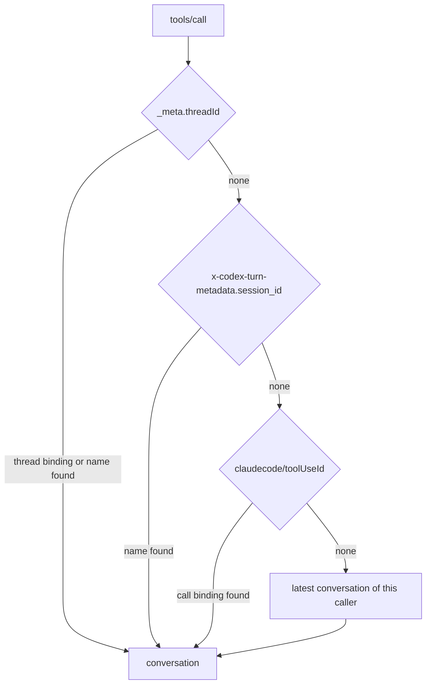

# MCP control surface

An agent that talks to roundhouse over a turn API sees what it is routed to only by inference. `roundhouse-mcp` tells it directly, through eight MCP tools. This chapter covers the tools, their safety rules, the transport, and how a tool call is matched to the right conversation.

## The eight tools

| Tool | Read-only | What it does |
|---|---|---|
| `status` | yes | The effective policy fingerprint, the admissible model names, the budget left, and any standing overlay. |
| `init_session` | no | Mints an id that identifies this conversation to roundhouse. The agent keeps it in its history. |
| `declare_intent` | no | Records the goal, the planned steps, and the done condition. It changes no routing. |
| `prefer` | no | Asks for `local`, `frontier`, or `auto` routing, for one turn or for the session. Requires a `reason`. |
| `set_quality_floor` | no | Raises the minimum model quality for a number of turns. Requires a `reason`. |
| `fetch_steer` | yes | Reads again the most recent correction in this conversation. |
| `report_outcome` | no | Records what the agent did about a correction: `applied`, `rejected`, or `not_applicable`. Advisory. |
| `explain_last_route` | yes | The last turn's chosen model, rationale, considered set, budget state, and policy fingerprint. |

Every listed tool costs context tokens on every turn, so the surface is small. Each choice keeps the agent from arguing with the router:

- `status` returns model names and never prices. An agent that sees what a model costs can argue about it. The budget figures are for the membership, not for each model. "Three dollars left" tells an agent to wrap up. "This model is the most expensive" tells it what to ask for.
- `prefer` and `set_quality_floor` require a `reason` and store it, because a routing change that nobody explained cannot be audited.
- `declare_intent` changes no routing. It helps the judge: with a stated goal, the question changes from "infer the goal, then judge drift" to "name the divergence from this goal". See [Validate and steer](validate-steer.md).

## Overlays narrow and never widen

`prefer` and `set_quality_floor` write an overlay. The overlay composes onto the key's policy through `TurnPolicy::narrow`, which is total and can only shrink the admissible set. A model that reads its own context is one prompt injection away from someone else's instructions, so it cannot widen what the key allows.

An overlay that asks for more than the ceiling is clamped and reported, never honored and never refused. The response says `narrowed: true` and gives a sentence in `narrowed_because`. An agent that gets an error for asking has to guess, and an agent that guesses asks again. Every overlay change shows in `turn_policy_digest` on the next `DecisionRecord`, so its effect is checkable from the audit trail.

## No tool appends to a session log

An MCP request arrives on its own HTTP request, and a session log has exactly one writer at a time. So every tool is one of two kinds: a pure read of committed state, or a write to a node-local control store that the engine reads at the start of the next turn.

`fetch_steer` re-reads a correction and is not how it arrives. The correction arrives in-band, as the text of the steered turn's answer (see [Validate and steer](validate-steer.md#outcome-b-a-text-instruction)). `fetch_steer` is a pure fold of the conversation's own log, so two calls give the same bytes and do no paid work.

### The node-local store

Overlays, intents, outcomes, and `init_session` bindings live in a `HashMap` behind a `Mutex` in one process. An overlay does not survive a restart, and in a multi-node deployment it applies only on the node that took the call. That is acceptable because an overlay only narrows. Losing one widens the turn back to the key's ceiling, never past it, and `turn_policy_digest` shows the change.

`init_session` is a write that a model can call in a loop. So one retention bound, `RETENTION_MS` (24 hours), applies to every family in the store. A sweep on writes enforces it, at most once per `SWEEP_INTERVAL_MS` (60 s). A sweep on every insert would make the cost of holding state quadratic in writes.

## Transport

The surface is mounted at `/mcp` in the same process as the turn surfaces. A separate process would be a second reader of the store and of the principals.

- The transport is streamable HTTP with 2025-06-18 semantics. It is stateless: `NeverSessionManager` with JSON responses issues no `Mcp-Session-Id`.
- `GET /mcp` returns 405. The specification allows this for a server with no stream, and it is honest here, because nothing a server pushes reaches the model.
- `/mcp` uses the same key resolution as every other route, through `ControlPlane::scope`. The turn key arrives the way that client sends it on a turn: a bearer for Codex, the dedicated header for Claude Code.

The server uses the official `rmcp` SDK, because Codex's own client is built on it. It sits behind a hand-written `ControlSurface` trait, so tests call the trait and a change of transport moves no test.

A tool answers with exactly one text block that holds JSON, and no `structuredContent`. The tool result goes back into the session as a conversation item, and the canonicalizer round-trips a string result and a structured object through different branches. A structured answer would change the bytes the client resends and fork the prefix.

A refusal is a `CallToolResult` with `isError: true`, not a JSON-RPC error, so the client's tool loop continues.

### Annotations

Every tool descriptor states `readOnlyHint`, `destructiveHint`, and `openWorldHint`. The last two are `false` on all eight tools, because the tools reach nothing outside this deployment and their writes only narrow.

The annotations are necessary. At codex `e363b08` and `6344a65`, `requires_mcp_tool_approval` reads a missing `readOnlyHint` as `false` and a missing `destructiveHint` or `openWorldHint` as `true`. `codex exec` forces `approval_policy = "never"`, so nobody can give the approval. Codex then cancels the call, and the agent gets a cancellation notice where the output should be.

## Which conversation a call concerns

One principal can have many conversations: a parent agent, its subagents, and older sessions. A tool call must answer about the right one. `ControlReads::resolve_session` resolves the `conversation` argument first, then the client's correlators in a fixed order. Each correlator is tried only if the ones above it found nothing.

1. **The `conversation` argument.** A name the model wrote, resolved in the caller's namespace. It is the only source the agent chose.
2. **`_meta.threadId`.** Codex stamps it on every `tools/call`. Roundhouse first reads the thread binding that the Responses surface wrote from the `x-codex-turn-metadata` header when it served that thread's turn. Only then does it read the thread id as a conversation name.
3. **`_meta["x-codex-turn-metadata"].session_id`.** Codex's own session id, which is the turn's `prompt_cache_key`. It is resolved as a name.
4. **`_meta["claudecode/toolUseId"]`.** Claude Code stamps the id of the `tool_use` block that the call answers. Roundhouse emitted that id into exactly one session.
5. **`latest`.** The caller's most recent conversation. This is a guess and never more.

The correlators (2 to 4) are protocol metadata that the client attaches, and none is a tool argument. An argument invites a model to invent one.

### Why the thread binding comes before the name

A codex root thread and every subagent it starts share one session id, and so one cache key, but each stamps its own thread id. For a root thread, the thread id equals the cache key. For a subagent, it does not. Reading the thread id only as a name would miss exactly the subagents that the feature exists for, and answer them about their parent. The thread binding answers a subagent exactly, and stays correct across every fork of the cache key under it. The name lookup remains for a root thread on a node that recorded no binding. The session id (3) comes after the thread arm for the same reason: a whole agent family shares it.

### Refusals and fall-through

- **A correlator that names no conversation of the caller's falls through.** Unknown, evicted, and another tenant's id all answer alike. Different answers would make the correlator an enumeration oracle.
- **The `conversation` argument refuses.** A foreign name gets `ForeignConversation`, because a model that wrote a name asks about that name and nothing else.
- **An argument that disagrees with the effective correlator is refused**, and both are named (`ContradictoryConversation`). If the argument won, it would be a way to steer past the client's own correlator.
- **Two correlators that disagree are ordered, not refused.** They are one client naming one call in two vocabularies.
- **A store outage is an error, not "unknown".** Answering "unknown" would quietly give the caller its `latest`, a plausible answer about the wrong conversation.
- **A name that no node ever bound is refused.** Resolving it at generation zero serves a session from before a fork.
- A principal with no session at all gets `NoSession`.

Because each arm is lazy, an outage on the call table cannot refuse a call that the thread arm already answered. The contradiction check is the one exception: it resolves the correlator even when the argument alone decides. When the argument and the thread id are the same string, the ordinary Codex case, roundhouse looks up the name once.

On the Messages surface, a session is keyed `anthropic_messages/<id>`. A Claude Code model that passes its own session id as `conversation` resolves to nothing and is refused as foreign. For that client, the tool-use id is the exact answer. The call binding is written as the `tool_use` block is streamed, the one moment both halves are in one place. In a durable deployment, `bind_call` is awaited before the frame that carries the id leaves, because a spawned write would race the client's answer. An id that two of one principal's sessions claimed is remembered as ambiguous and answers as an unknown id does. This correlator needs no cooperation from the model, because it carries an id that roundhouse emitted.

## Correlation state

`CorrelationMaps` in `roundhouse-core` holds three maps:

| Map | Rule | Staleness bound |
|---|---|---|
| Generation hint | The generation a conversation key was last committed at. Only a hint. | None. A wrong hint costs a probe, never a wrong answer. |
| Call binding | `(principal, tool_use_id) -> session`. A second binding to another session becomes ambiguous. | `CALL_BINDING_STALENESS_MS`, 6 h |
| Thread binding | `(principal, thread_id) -> session`. Rebinding is normal, because a thread moves on every fork. | `THREAD_BINDING_STALENESS_MS`, 7 d |

With `ROUNDHOUSE_REDIS_URL` set, all three maps are in Redis. What one node bound, every node reads, and Redis `PEXPIRE` enforces the bounds. Without Redis they are in process memory, capped for each principal at `REMEMBERED_CALLS` (4096) calls and `REMEMBERED_THREADS` (1024) threads. Stored values are tagged, so no session id that a client can spell can pass as the ambiguous marker. The turn path reads a local generation memo, capped at 4096 entries. Control-surface reads always go to the store, because a cached binding goes stale when another node forks. `latest` stays node-local: two nodes that serve one agent would each write their own, and the last writer would speak for both.

## Tool names on each client

- **Codex** sends a bare `name` plus a separate `namespace`, `mcp__roundhouse`. At codex `6344a65` and `e363b08`, `ToolSpec` has no `mcp` arm, and dispatch is an exact lookup of `ToolName { name, namespace }`. A call with the namespace in its name comes back as `unsupported call`. Roundhouse stores the namespace in `ItemContent::ToolCall.namespace` and emits it again on the outbound projection.
- **Claude Code** folds both into one flat name, `mcp__roundhouse__status`, in `tools[]`, in the `tool_use` block, and in `--allowedTools`. The log stores the flat name.

The namespace is `mcp__roundhouse` by construction. A control-plane file that sets the retired `mcp_namespace` field is refused at load. [Hook up Claude Code](../guides/claude-code.md) covers the Claude registration.

### Claude Code 2.1.257 on the wire

A capture of Claude Code 2.1.257 shows:

- `initialize` offers `protocolVersion: "2025-11-25"`. Roundhouse answers `2025-06-18`, and the client stamps that version on later POSTs.
- The client opens the optional `GET` stream even for one tool call. Roundhouse answers 405.
- `tools/call` carries the bare tool name, the parsed arguments, and `_meta: {"claudecode/toolUseId": "<tool_use.id>", "progressToken": <n>}`. MCP headers are fixed for each config file, so `_meta` is the only place for a correlator.
- The tool's `content` array flows unchanged into `tool_result.content`.

One capture cannot show whether the `claudecode/` key is a versioned contract. Check it again when the client version moves. [Hook up Claude Code](../guides/claude-code.md) covers permissions for headless runs.

## What reaches the model

The only channel from server to model on both clients is the result of a tool that the client itself called.

- MCP sampling (`sampling/createMessage`) is supported by neither Codex (no handler at `6344a65`) nor Claude Code (anthropics/claude-code issue #1785). The 2026-07-28 MCP revision deprecates it. So a validator that runs on the client and bills the user's subscription cannot be built. Roundhouse runs the judge itself, as a side call, and never on the user's subscription.
- Notifications never reach the model. Codex logs them and does nothing.
- Elicitation reaches the person, not the model.

## Through a second gateway

The control tools answer about a turn that roundhouse routed. If the turn did not go through roundhouse, no session exists to resolve. A topology where roundhouse is only an MCP server is a handshake test, not a use of the product. agentic-api flattens an MCP tool to `agentic_ns__{ns}__{member}`, capped at 64 characters with a 16-hex FNV tail, so a Codex call reaches roundhouse as `agentic_ns__mcp__roundhouse__<tool>`. That path tests agentic-api's name flattening and its rmcp client.

## Limits

- An overlay is lost at restart and applies only on the node that took the call.
- When a client edits its own history, roundhouse forks the conversation to a new session id. The store is keyed by the old id, so the agent's standing overlay stops applying. The old records wait for the retention sweep.
- A thread whose binding aged past 7 days, and a client that sends no correlator, fall back to `latest`.
- The Codex `threadId` path is proved against a captured `_meta` shape, not against a real `codex` binary. No test makes a real codex dispatch a `tools/call` to `/mcp`. The function `a_real_codex_binary_is_correlated_by_the_thread_id_it_stamps` in `crates/roundhouse-server/tests/codex_e2e.rs` holds the assertions, but nothing calls it, and its doc names the conditions under which it can run. Unit tests pin the order, the dispatch chain, and the `_meta` handling against a Codex-shaped envelope.
