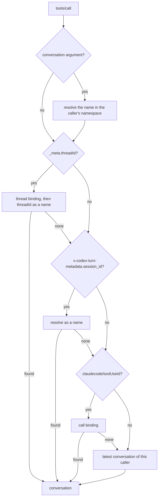

# MCP control surface

An agent that talks to roundhouse over a turn API sees what it is routed to only by inference. `roundhouse-mcp` tells it directly, through eight MCP tools. This chapter covers the tools, their safety rules, the transport, and how a tool call is matched to the right conversation.

## The eight tools

| Tool | Read-only | What it does |
|---|---|---|
| `status` | yes | The effective policy fingerprint, the admissible model names, the budget left, and any standing overlay. |
| `init_session` | no | Mints an id that identifies this conversation to roundhouse. The agent keeps it in its history. |
| `declare_intent` | no | Records the goal, the planned steps, and the done condition. It changes no routing. |
| `prefer` | no | Asks for `local`, `frontier`, or `auto` routing, for one turn or for the session. Requires a `reason`. |
| `set_quality_floor` | no | Raises the minimum model quality for a number of turns. Requires a `reason`. |
| `fetch_steer` | yes | Reads again the most recent correction in this conversation. |
| `report_outcome` | no | Records what the agent did about a correction: `applied`, `rejected`, or `not_applicable`. Advisory. |
| `explain_last_route` | yes | The last turn's chosen model, rationale, considered set, budget state, and policy fingerprint. |

Every listed tool costs context tokens on every turn, so the surface is small. Each design choice keeps the agent from arguing with the router:

- `status` returns model names and never prices. An agent that sees what a model costs can argue about it. The budget figures are for the membership, not for each model. "Three dollars left" tells an agent to wrap up. "This model is the most expensive" tells it what to ask for.
- `prefer` and `set_quality_floor` require a `reason` and store it. A routing change that nobody explained cannot be audited.
- `declare_intent` changes no routing. Its value is to the judge. With a stated goal, the judge's question changes from "infer the goal, then judge drift" to "name the divergence from this goal". See [Validate and steer](validate-steer.md).

## Overlays narrow and never widen

`prefer` and `set_quality_floor` write an overlay. The overlay composes onto the key's policy through `TurnPolicy::narrow`, which is total and can only shrink the admissible set. So a model that reads its own context, and that is one prompt injection away from someone else's instructions, cannot widen what the key allows.

An overlay that asks for more than the ceiling is clamped and reported. It is never honored and never refused. The response says `narrowed: true` and gives a sentence in `narrowed_because`. An agent that gets an error for asking has to guess, and an agent that guesses asks again.

Every overlay change shows in `turn_policy_digest` on the next `DecisionRecord`. So its effect is checkable from the audit trail, not only from the tool.

## No tool appends to a session log

An MCP request arrives on its own HTTP request, and a session log has exactly one writer at a time. So every tool is one of two kinds:

- A pure read of committed state.
- A write to a node-local control store that the engine reads at the start of the next turn.

`fetch_steer` is how a correction is read again, not how it arrives. The correction arrives in-band, as the text of the steered turn's answer (see [Validate and steer](validate-steer.md#outcome-b-a-text-instruction)). `fetch_steer` is a pure fold of the conversation's own log. Two calls give the same bytes and do no paid work. So an agent, or a person who debugs one, can ask "what was I just told" at no cost.

### The node-local store

Overlays, intents, outcomes, and `init_session` bindings live in a `HashMap` behind a `Mutex` in one process. So an overlay does not survive a restart, and in a multi-node deployment it applies only on the node that took the MCP call. That is acceptable because an overlay only narrows. Losing one widens the turn back to the key's ceiling, never past it, and `turn_policy_digest` shows the change.

`init_session` is a write that a model can call in a loop. So one retention bound, `RETENTION_MS` (24 hours), applies to every family in the store. A sweep on writes enforces it. The sweep runs at most once per `SWEEP_INTERVAL_MS` (60 s). A sweep is O(n) over the maps, so a sweep on every insert makes the cost of holding state quadratic in writes.

## Transport

The surface is mounted at `/mcp` in the same process as the turn surfaces. A separate process is a second reader of the store and of the principals.

- The transport is streamable HTTP with 2025-06-18 semantics.
- It is stateless: `NeverSessionManager` with JSON responses issues no `Mcp-Session-Id`.
- `GET /mcp` returns 405. The specification allows 405 for a server with no stream. It is honest here, because nothing a server pushes reaches the model (see [below](#what-reaches-the-model)).
- `/mcp` uses the same key resolution as every other route. The turn key arrives the way that client sends it on a turn: a bearer for Codex, the dedicated header for Claude Code. Both go through the same `ControlPlane::scope`.

The server uses the official `rmcp` SDK, because Codex's own client is built on it. It sits behind a hand-written `ControlSurface` trait with plain serde types for each tool. Tests call the trait directly, so a change of transport moves no test.

A tool answers with exactly one text block that holds JSON, and no `structuredContent`. The tool result goes back into the session as a conversation item. The canonicalizer round-trips a string result and a structured object through different branches. So a structured answer changes the bytes the client resends and forks the prefix.

A refusal is a `CallToolResult` with `isError: true`, not a JSON-RPC error. So the client's tool loop continues. A run through agentic-api saw the same: the error arrived as an ordinary `function_call_output`, and the turn completed with 200.

### Annotations

Every tool descriptor states all three MCP annotations: `readOnlyHint`, `destructiveHint`, and `openWorldHint`. `destructiveHint` and `openWorldHint` are `false` on all eight tools. The tools reach nothing outside this deployment, and their writes only narrow or append records.

The annotations are necessary. At codex `e363b08` and `6344a65`, `requires_mcp_tool_approval` reads a missing `readOnlyHint` as `false` and a missing `destructiveHint` or `openWorldHint` as `true`. `codex exec` forces `approval_policy = "never"`, so the approval cannot be asked of anyone. Codex then cancels the call, and the agent gets a cancellation notice where the output was expected.

## Which conversation a call concerns

One principal can have many conversations: a parent agent, its subagents, and older sessions. A tool call must answer about the right one. `ControlReads::resolve_session` tries these sources in a fixed order and stops at the first answer:

1. **The `conversation` argument.** A name the model wrote, resolved in the caller's namespace. It is first because it is the only source the agent chose.
2. **`_meta.threadId`.** Codex stamps it on every `tools/call`. Roundhouse first reads the thread binding that the Responses surface wrote when it served that thread's turn, from the `x-codex-turn-metadata` header. Only then does it read the thread id as a conversation name.
3. **`_meta["x-codex-turn-metadata"].session_id`.** Codex's own session id, which is the turn's `prompt_cache_key`. It is resolved as a name.
4. **`_meta["claudecode/toolUseId"]`.** Claude Code stamps the id of the `tool_use` block that the call answers. Roundhouse emitted that id into exactly one session.
5. **`latest`.** The caller's most recent conversation. This is a guess and never more.

The correlators (2 to 4) are protocol metadata that the client attaches. None of them is a tool argument. An argument invites a model to invent one.

### Why the thread binding comes before the name

A codex root thread and every subagent it starts share one session id, and so one cache key. Each member stamps its own thread id. For a root thread, the thread id equals the cache key. For a subagent, it does not.

So reading the thread id only as a name misses exactly the subagents that the feature exists for, and answers them about their parent. The thread binding answers a subagent exactly, and it stays correct across every fork of the cache key under it. The name lookup stays as the path for a root thread on a node that recorded no binding.

The session id (3) comes after the thread arm for the same reason: a whole agent family shares it. It helps a member whose binding is missing or aged out. The family's conversation is not the subagent's exactly, but it is not someone else's.

For a conversation that never forked, the roundhouse session id is a pure function of the caller and the codex session id. So a root thread resolves with no table lookup.

### Refusals and fall-through

- **A correlator that names no conversation of the caller's falls through.** Unknown, evicted, and another tenant's id all answer alike. Different answers make the correlator an enumeration oracle.
- **The `conversation` argument refuses.** A foreign name gets `ForeignConversation`. A model that wrote a name asks about that name and nothing else.
- **An argument that disagrees with the effective correlator is refused**, and both are named (`ContradictoryConversation`). This is the caller contradicting itself, so a loud answer reveals nothing. If the argument wins, it is a way to steer past the client's own correlator.
- **Two correlators that disagree are ordered, not refused.** They are one client naming one call in two vocabularies.
- **A store outage is an error, not "unknown".** Answering "unknown" quietly gives the caller its `latest`. That is a plausible answer about the wrong conversation.
- **A name that no node ever bound is refused.** Resolving it at generation zero served a stale session from before a fork, with `isError: false`.
- A principal with no session at all gets `NoSession`.

Each arm is consulted only when the arms above it answered nothing. So an outage on the call table cannot refuse a call that the thread arm already answered. The one cost that is not lazy is the contradiction check. It resolves the correlator even when the argument alone decides. When the argument and the thread id are the same string, the ordinary Codex case, roundhouse compares them first and looks up the name once.

On the Messages surface, a session is keyed `anthropic_messages/<id>`. A Claude Code model that passes its own session id as `conversation` resolves to nothing and is refused as foreign. For that client, the tool-use id is the exact answer.

### The Claude Code tool-use id

The call binding is written as the `tool_use` block is streamed to the client, which is the one moment both halves are in one place. In a durable deployment, `bind_call` is awaited before the frame that carries the id leaves. A spawned write races the client's answer to that same id.

An id that two of one principal's sessions claimed is remembered as ambiguous and is never overwritten. It answers as an unknown id does. It does not resolve to whichever session bound it last.

This correlator needs no cooperation from the model, because it carries an id that roundhouse emitted.

## Correlation state

`CorrelationMaps` in `roundhouse-core` holds three maps:

| Map | Rule | Staleness bound |
|---|---|---|
| Generation hint | The generation a conversation key was last committed at. Only a hint. | None. A wrong hint costs a probe, never a wrong answer. |
| Call binding | `(principal, tool_use_id) -> session`. A second binding to another session becomes ambiguous. | `CALL_BINDING_STALENESS_MS`, 6 h |
| Thread binding | `(principal, thread_id) -> session`. Rebinding is normal, because a thread moves on every fork. | `THREAD_BINDING_STALENESS_MS`, 7 d |

With `ROUNDHOUSE_REDIS_URL` set, all three maps are in Redis. What one node bound, every node reads, and Redis `PEXPIRE` enforces the bounds. Without Redis they are in process memory, capped at `REMEMBERED_CALLS` (4096) entries. The stored values are tagged, so no session id that a client can spell can pass as the ambiguous marker.

Two nodes that commit different generations each leave a value that the other's next search only starts from. So durability needs no atomicity.

The turn path reads a local generation memo, capped at 4096 entries, that `commit` fills. Control-surface reads always go to the store. A cached binding goes stale when another node forks or collides, and a stale binding gives a wrong-conversation answer. A memo entry whose store write was lost is marked dirty and answers the node's own reads until a later write lands.

`latest` stays node-local and is not shared through Redis. Two nodes that serve one agent each write their own `latest`, and the one that wrote last speaks for both.

## Tool names on each client

The two clients spell the same call differently:

- **Codex** sends a bare `name` plus a separate `namespace`, `mcp__roundhouse`. At codex `6344a65` and `e363b08`, `ToolSpec` has no `mcp` arm, and dispatch is an exact lookup of `ToolName { name, namespace }`. Nothing splits a flat `mcp__server__tool` apart, so a call with the namespace in its name comes back as `unsupported call`. Roundhouse stores the namespace in its own field (`ItemContent::ToolCall.namespace`) and emits it again on the outbound projection.
- **Claude Code** folds both into one flat name, `mcp__roundhouse__status`, in `tools[]`, in the `tool_use` block, and in `--allowedTools`. The log stores the flat name.

The namespace is `mcp__roundhouse` by construction. A control-plane file that sets the retired `mcp_namespace` field is refused at load. [Hook up Claude Code](../guides/claude-code.md) covers the Claude registration.

### Claude Code 2.1.257 on the wire

A capture of Claude Code 2.1.257 shows:

- `initialize` offers `protocolVersion: "2025-11-25"`. Roundhouse answers `2025-06-18`, and the client stamps `mcp-protocol-version: 2025-06-18` on later POSTs.
- The client opens the optional server-to-client `GET` stream even for one tool call. Roundhouse answers 405.
- `tools/call` carries the bare tool name, the parsed arguments, and `_meta: {"claudecode/toolUseId": "<tool_use.id>", "progressToken": <n>}`.
- The tool's `content` array flows unchanged into `tool_result.content`, inside a `user` message.
- MCP headers are fixed for each config file. There is no header for each conversation, which is why `_meta` carries the correlator.
- `--permission-mode dontAsk` denies MCP calls.

One capture cannot show whether the `claudecode/` key is a versioned contract. Treat it like the Messages surface, and check it again when the client version moves.

## What reaches the model

The only channel from server to model on both clients is the result of a tool that the client itself called.

- MCP sampling (`sampling/createMessage`) is supported by neither Codex (no handler at `6344a65`) nor Claude Code (anthropics/claude-code issue #1785). The 2026-07-28 MCP revision deprecates it. So a validator that runs on the client and bills the user's subscription cannot be built. Roundhouse pays for the judge with its own frontier key.
- Notifications never reach the model. Codex logs them and does nothing.
- Elicitation reaches the person, not the model.
- The 2026-07-28 revision allows requests that the server starts only while it processes a client request.

## Through a second gateway

The control tools answer about a turn that roundhouse routed. If the turn did not go through roundhouse, no session exists to resolve, and the tools answer about nothing. So a topology where roundhouse is only an MCP server is a handshake test, not a use of the product.

agentic-api flattens an MCP tool to `agentic_ns__{ns}__{member}`, capped at 64 characters with a 16-hex FNV tail. It restores the name through a map for each request. Through it, a Codex call reaches roundhouse as `agentic_ns__mcp__roundhouse__<tool>`. That path tests agentic-api's name flattening and its rmcp client. Roundhouse runs no tool loop, so it does not need the 64-character limit.

## Limits

- An overlay is lost at restart and applies only on the node that took the call.
- When a client edits its own history, roundhouse forks the conversation to a new session id. The store is keyed by the old id, so the agent's standing overlay stops applying. The old records wait for the retention sweep.
- A thread whose binding aged past 7 days, and a client that sends no correlator, fall back to `latest`.
- The Codex `threadId` path is proved against a captured `_meta` shape, not against a real `codex` binary. Nothing in the test tree makes a real codex dispatch a `tools/call` to `/mcp`. The function `a_real_codex_binary_is_correlated_by_the_thread_id_it_stamps` in `crates/roundhouse-server/tests/codex_e2e.rs` holds the assertions, but nothing calls it. Its doc names the conditions under which it can run. Unit tests pin the order, the dispatch chain, and the `_meta` handling against a Codex-shaped envelope.
