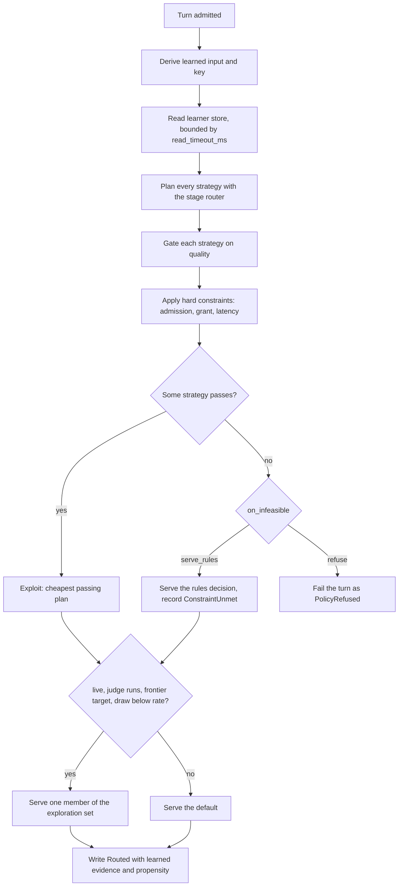
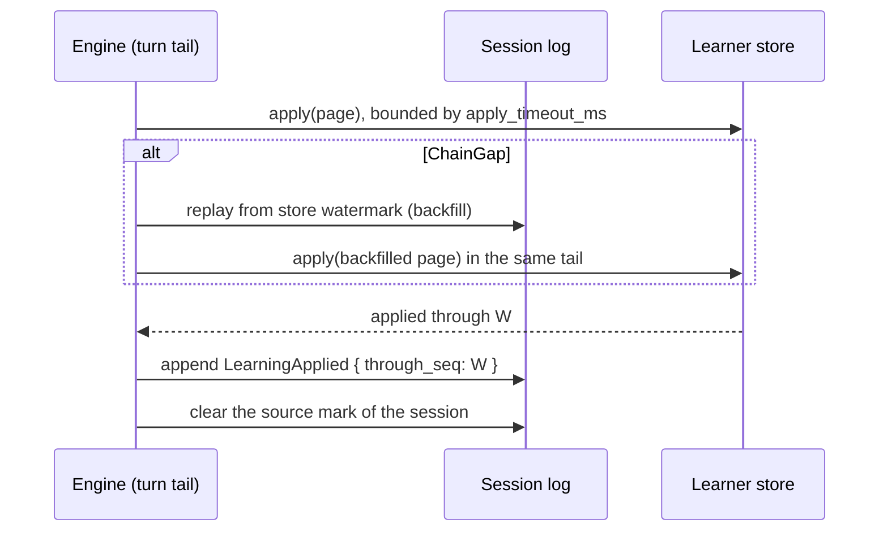

# The routing learner

This chapter describes the online routing learner, which chooses a serving strategy for each turn and learns from frontier reviews which strategy is good enough. It also covers how the learner stores and recovers its state, and how an operator calibrates and promotes a project.

## What the learner chooses

A project with a `"tiers"` recipe can add a `"learner"` block (see [Routing and the selection service](routing.md)). For each turn, the learner chooses one strategy from the configured list:

| Strategy | Tier signal |
|---|---|
| `rules` | The stage router's own tier pick (`pick_tier`). |
| `efficient` | Always the Efficient tier. |
| `capable` | Always the Capable tier. |

The same stage routing code (`StagePolicy::route_pick`) turns each tier signal into a plan. So every strategy keeps admission, recipe order, the dominance cost guard, and degrade-to-local. The learner picks the cheapest strategy whose frontier reviews pass the quality floor, within the latency limit and the budget grant.

The rejected alternative was one strategy per model identity. That design lets the learner route outside the recipe of the operator, and it bypasses the cost guard.

A pick that the learner forces carries `DecisionSource::Strategy`. Its `is_signal_driven()` is false. So a `capable` pick that no signal asked for never opens a handoff note.

A calibrated `rules` strategy (picker and threshold from the artifact) is not built. Its pick is not in the key, so it gains evidence only where it agrees with `rules`. That is selection bias.

## Configuration

```json
"learner": {
  "mode": "shadow",
  "strategies": ["rules", "efficient", "capable"],
  "artifact": "/etc/roundhouse/learner/acme.json",
  "quality": { "floor": 0.8, "z": 1.96, "min_evidence": 5000, "min_sessions": 20 },
  "latency_limit_ms": 10000,
  "latency_min_samples": 20,
  "cache_min_samples": 20,
  "on_infeasible": "serve_rules",
  "read_timeout_ms": 25,
  "apply_timeout_ms": 250
}
```

| Field | Meaning |
|---|---|
| `mode` | `off` (the default), `shadow`, or `live`. |
| `strategies` | The strategy list, in order. At least 2, no repeats, and it must contain `rules`. |
| `artifact` | The path of the calibration artifact. Its bytes decide the epoch. |
| `quality.floor` | The quality floor, in `0.0..=1.0`. |
| `quality.z` | The z value of the Wilson bounds. Must be positive. |
| `quality.min_evidence` | Live credit units that a key level needs before the gate reads it. |
| `quality.min_sessions` | Sessions that a key level needs before a strategy can pass. |
| `latency_limit_ms` | The limit on first output from turn start. Must not be 0. |
| `latency_min_samples` | Samples a latency mean needs before it applies. |
| `cache_min_samples` | Provider-measured cache pairs a target needs before its cost is corrected. |
| `on_infeasible` | `serve_rules` (the default) or `refuse`. |
| `read_timeout_ms` | The bound on one learner-store read per learned turn. Must not be 0. |
| `apply_timeout_ms` | The bound on one learner-store apply. Must not be 0. |
| `exploration.rate` | Accepted only in `live`. Defaults to `0.05` when the block is present. Range `(0, 1]`. |

The modes:

- `off`, or no block: the project routes as the stage router routes. The engine reads no learner store and computes no draw.
- `shadow`: the engine serves the `rules` route and records what the learner chose.
- `live`: the engine serves the choice of the learner.

Only `on_infeasible` and `exploration.rate` have defaults. Every other field is required in `shadow` and `live`, and code supplies none of them. The values above are the starting numbers. So each number that a project runs under is one that an operator wrote down.

The loader checks each field that is present, whatever the mode. A broken floor on an `off` block is refused, because the day the project changes to `shadow` is the worst time to find it. The loader refuses:

- a block on a project without `tiers`,
- a floor outside `0.0..=1.0`, a `z` that is not positive, a zero timeout, or a zero `latency_limit_ms`,
- fewer than 2 strategies, a repeated or unknown strategy, or a list without `rules`,
- an artifact that it cannot read, that is not in the artifact format, or that lists other strategies,
- an `exploration` block on a project that is not `live`, or a rate outside `(0, 1]`,
- an unknown field.

A relative `artifact` path resolves against the working directory of the process, not the directory of the configuration file. Write an absolute path.

An `off` block keeps its `apply_timeout_ms`. A session of a project that is now `off` still delivers its pending entries, and it waits that long for each apply. With no block, or no value in an `off` block, it waits 250 ms (`UNCONFIGURED_APPLY_TIMEOUT_MS`).

## How a learned turn is decided



In `shadow`, the engine serves the `rules` route at the end and keeps the record of the choice.

One function (`turn_input`) derives the learned input for both the store read and the decision. So the read and the decision always name one key. The engine inputs travel as a `LearningTurn` beside `RoutingContext`, because part of the context is built in the credential module.

## Learned input and keys

The learned input has four parts:

- `rules_pick`: `efficient` or `capable`.
- `newest`: the band of the newest classification.
- `prior`: over the older classifications. `absent` (fewer than 2), `no_high`, or `some_high`.
- `tool_turn`: `0` or `1`.

The sequence is the newest 3 classifications (`SEQUENCE_LEN`) in the recorded window. It is ordered by source turn, with ties to the higher `available_seq`. It is never ordered by arrival, because a delayed result for an old turn can land after a newer one.

The bands:

| Band | Meaning |
|---|---|
| `none` | No classification at that position: the classifier is not configured, has not answered, or answered after the cutoff. It is not `unknown` and not `low`. |
| `unknown` | The classifier answered `unknown`. |
| `low` | `trivial` or `routine`. |
| `high` | `involved` or `deep`. |

The key levels:

| Level | Parts | Reachable keys |
|---|---|---|
| L2 | All four parts | 40 (not 48, because `newest == none` forces `prior == absent`) |
| L1 | `rules_pick` and `newest` | |
| L0 | `rules_pick` | |

Only L2 is stored on the record. L1 and L0 are projections of it, so a change to how they are cut must change the selector revision. Key parts are joined with dots, for example `capable.low.no_high.tools`, because the store joins key parts with `:`.

`rules_pick` is in every level for this reason. Within one key, `rules` then picks one tier, so the agreement between `rules` and a fixed-tier strategy is almost constant. Without it, `efficient` evidence comes only from turns where `rules` also picked efficient, which is the easy part of the key. Then the gate can pass `efficient` on the hard turns.

Input size and cache state enter through the quotes of each plan, not through the key. Intent and context dependence are not in the key.

## The quality gate

The gate is `wilson-v1`. For each key level and strategy:

- n = (prior_n + live_n) / `CREDIT_SCALE`, with `CREDIT_SCALE` = 1000.
- p = (prior_pos + live_pos) / (prior_n + live_n).
- L and U are the Wilson score bounds at the configured z. When n = 0, L = 0 and U = 1.

The gate reads the most specific level whose live units meet `min_evidence`. The results:

| Result | Condition |
|---|---|
| Pass | `sessions >= min_sessions` at that level, and L >= floor. |
| BelowFloor | U < floor. |
| Unproven | Every other case, including no level with evidence. |

`min_evidence` counts only live units, so a prior alone never passes. Zero never meets a minimum, even a configured minimum of 0. Otherwise, with zero minimums, a large artifact prior passes alone. An upper bound exactly at the floor is Unproven, not BelowFloor.

The starting values are `z` = 1.96, `min_evidence` = 5000 units (5 intervals), floor 0.8, and `min_sessions` 20.

## Cold-start prior from classifier tier answers

The background classifier (TypeSafe Jev) answers one tier question in the same request as its other questions: `capable` or `efficient`. So the tier answer costs no extra call and no extra latency. The classifier and its configuration are in [Metrics and the dashboard](../operations/metrics.md#background-turn-classification).

The engine computes a prior per turn from the tier answers:

- The prior is `JEV_PRIOR_PSEUDO_INTERVALS` = 3 intervals (3000 units of n) for each strategy on a key.
- Its positive units are `3000 * agree(k, tier(s)) / answers(k)`, in integer arithmetic.
- A key with fewer than `JEV_PRIOR_MIN_ANSWERS` = 3 answers has no prior.

The rules that bound it:

- It applies only where the artifact prior for that key and strategy is zero. An artifact prior is review evidence carried across epochs, so it wins.
- It enters the Wilson bounds only after live evidence meets `min_evidence`.
- It never counts toward `min_evidence` or `min_sessions`.
- It never relaxes a hard constraint, and it is never a reward. The reward is the frontier review interval.
- It is off on turns whose admitted pool holds no frontier target. Local-only sessions never reach the classifier, so they get no prior.
- The tier counts reach the store as `jev_capable` and `jev_efficient` on each of the three keys of the source turn. They never enter the artifact prior.

The classifier is never the sole routing criterion. It sees no price, TTFT, budget, context limit, load, or cache state. So it cannot trade off function, cost, and time.

A list of model ids as options also breaks the rule that a model never sees a price, the candidate list, or a target name. A hosted classifier on the path to first token breaks the rule that routing makes no model calls. The classifier also has no memory, so its answer changes when the last message changes.

The published evidence for the classifier as a router measures label agreement only. See [Measurements](../operations/measurements.md#typesafe-jev-routing-benchmark).

## Hard constraints and the per-turn choice

The first target and every fallback that a turn serves must satisfy four constraints:

1. **Admission.** The same `ctx.admissible(None)` pool that the stage router uses. The learner never runs admission again with other settings.
2. **Grant.** `TurnBudget::admits` on a copy of the candidate at its corrected cost. An overflow-valve admission keeps its status.
3. **Latency.** The modeled first output is at or below `latency_limit_ms`.
4. **Quality.** The strategy that owns the plan passes the gate.

One predicate, `PlanEvidence::meets_hard`, holds the grant and latency constraints for both the exploit path and the exploration set. The dominance cost guard runs inside each strategy on the unchanged quotes. The corrected cost only compares plans with each other and with the grant.

The exploit strategy is the passing plan with the lowest corrected cost. Ties go to the lower modeled latency, then to the configured order. The fallbacks are the first targets of the other passing strategies in exploit order, without duplicates. The own fallbacks of a strategy are excluded, because its quality evidence is about its first target only.

The policy is pure. The engine supplies the store view and the draw.

### Latency model

The limit applies to the first output, measured from turn start. The modeled first output is the sum of three terms:

- the quoted TTFT,
- the mean residual of the target,
- one project-level mean overhead, added once per turn.

Each mean applies only at or above `latency_min_samples`. The samples come from completed turns that have a first output:

- A residual sample is the first non-empty `OutputTextDelta.at_ms`, less the served `Routed.at_ms`, less the quoted TTFT.
- An overhead sample is the served `Routed.at_ms`, less `TurnStarted.at_ms`.

A turn without a first output supplies neither sample, because missing output is not zero latency.

The overhead is a separate term because the time before dispatch does not depend on the target. That time includes the synchronous judge call on review turns, the fleet quote, and the learner-store read. In a per-target residual, it makes the TTFT of every target larger on reviewed sessions.

Means round up, and the result clamps at 0 ms. So both rules can only make the estimate larger. All workers of one local model share one residual.

### Cost correction for measured cache reuse

The cost correction applies only to a frontier target with at least `cache_min_samples` provider-measured pairs. It uses these steps:

1. quoted_cached = isl - expected_prefill, clamped to `0..=isl`.
2. r = observed / predicted, from integer per-mille sums.
3. adjusted_cached = min(floor(quoted_cached * r), matched_prefix, isl, quoted_cached), and at least 0.
4. corrected cost = quote + max(0, price_tokens(isl - adjusted, adjusted) - price_tokens(isl - quoted_cached, quoted_cached)).

The rules that follow from it:

- `price_tokens` charges uncached input at `effective_write_per_mtok_usd`. So a model with a one-hour cache keeps its write premium. The rejected formula, input rate less read rate, priced 100 tokens at input 1, write 2, read 0.1 as 100 instead of 200.
- The cap at the cached count of the quote and the clamp at zero work together. They make sure that a correction never prices a route below its quote.
- When the target has samples but never predicted reuse, the quote is priced again with no cached tokens. That is the conservative bound. Keeping the quote banks a discount that no evidence checked.
- Local targets are never corrected. The checks run in this order: `NotFrontier`, `TooFewSamples`, `NoPredictedReuse`.
- There is no separate cache-miss penalty. TTFT is not scaled by the shortfall. No record names eviction or cache pressure as the cause.

Negative result: a rate card whose cached-read rate is more than its effective write rate let a shortfall lower the quote. A quote of $0.003 became $0.0014. The clamp at zero in code prevents this, and the catalog does not have to refuse such cards. `grant` takes `&CostEvidence`, so a grant check on the bare quote does not compile. A `compile_fail` doc test holds this.

## Infeasible turns and store failures

At cold start in `live`, no strategy satisfies the constraints. The two `on_infeasible` values:

- `serve_rules` serves the whole `rules` decision: its target, its own fallbacks, its budget state, and its admitted list. It records `ConstraintUnmet` with each constraint that some plan failed, in the order quality, latency, grant, then the read failure.
- `refuse` fails the turn with `EngineError::LearnerRefused`. The turn terminates as `IncompleteReason::PolicyRefused` and writes no `Routed`. There is no new wire variant, because an older node cannot decode one.

A failed store read replaces the quality constraint, because quality was not evaluated. The gate then records Unproven with no level. Under `refuse`, every turn during a learner-store outage fails.

A `serve_rules` turn still earns credit. The served trajectory is real and a frontier review covers it. `ConstraintUnmet` says only that the learner did not validate it.

The rejected alternative served the `rules` route on every turn and appended its fallbacks. That bypassed the quality and latency constraints.

## Exploration

A turn can explore only when all of these are true:

- the project is `live` and has an `exploration` block,
- the validation arm of the session runs the judge (the `live` or `shadow` validation arm, see [Validate and steer](validate-steer.md)),
- the admitted pool holds a frontier target,
- the learner-store read succeeded,
- the rate draw is below `exploration.rate`.

The draw is one SHA-256 over this text:

```text
{LEARNER_DRAW_VERSION}\nrouting-explore\nsalt={arm_salt}\nsession={session_id}\nresponse={response_id}\n
```

The `routing-explore` domain keeps the draw apart from the hash of the validation arm. The rate is the top 53 bits of the first 8 bytes, divided by 2^53. Dividing a whole u64 by 2^64 rounds the top 1024 values to exactly 1.0, which is outside `[0, 1)`. The next 8 bytes, modulo the set size, pick the member.

The exploration set:

1. Each Unproven strategy that is cheaper than the reference and meets every hard constraint, in configured order. The reference is the exploit target, or else `rules`.
2. Then `rules`, whenever its plan meets every hard constraint. It is exempt from the Unproven and cheaper filters, because it is the quality baseline.

Under `refuse`, `rules` joins only when some strategy passes. So a turn that nothing passes is still refused, unless a cheaper Unproven strategy explores. BelowFloor strategies never explore. A `rules` plan over the grant or the latency limit never explores.

The member is drawn uniformly. So a live turn whose learned choice differs from `rules` serves the `rules` route with a probability above zero. The calibrator needs this to compare the two over every interval.

The propensity of the served route is:

- `1 - rate + rate * share` for the default target,
- `rate * share` for every other target.

Members are counted by route (`same_route`), not by worker. So two workers of one local model are one route.

`ExplorationEvidence` records the draw, the member, the set, and `on_infeasible`. So the calibrator can derive the set again. A change to the set rule changes `LEARNED_SELECTOR_REVISION`, not `LEARNER_DRAW_VERSION`, because the hash encoding of the draw does not change.

Negative result: the claim "without exploration, a live learner cannot change a route" holds only per admitted pool. Credit from one pool can pass a strategy that routes differently on another pool of the same key. For example, `capable` earns credit on a pool that holds only `frontier/large`, where `rules` also served it. Later it serves when `local/small` is admitted but too slow, and `rules` fails the latency limit. A test (`crates/roundhouse-core/tests/learned_policy_property.rs`) enumerates six pool shapes, two pickers, four operational states, three prior states, and both `on_infeasible` values. That is 70,560 cases. So an evaluation must not assume that a `live` project without exploration serves only `rules` routes.

## Credit from frontier reviews

A frontier review labels one interval of routing decisions (see [Validate and steer](validate-steer.md)). Take an accepted `Positive` or `Negative` interval. A strategy is consistent with it when the first target of its plan equals the served dispatch on every covered turn.

The screen runs in this order, and each failure credits nothing:

1. Any failover in the interval (`failover_in_interval`). The served propensity of a failover turn is not the selection propensity.
2. Any covered decision with no learned row (`missing_row`), another epoch (`mixed_epoch`), or another credit revision (`other_credit_revision`).

Each consistent strategy then gets `CREDIT_SCALE` units per level. The units are split over the level keys that the interval visited, in proportion to covered turns. The remainder goes one unit at a time, by first appearance. `Positive` adds to pos and n. `Negative` adds to n only.

The results of this rule:

- One interval adds at most 1000 units per strategy per level, however many decisions it had. Correlated decisions never count as independent evidence.
- No strategy gets credit for the action of another strategy.
- The split says where the interval ran, not which decision caused the result.

The rejected alternative was a fractional split over the strategies selected. That assumes a shared responsibility that the evidence does not show.

The row stores one agreement bit per strategy, from a structural provider and model comparison. It does not store recipe indices. So a degrade to an unnamed local worker stays comparable. The same `screen` function decides which intervals the calibrator can use.

Negative result: a failover turn writes two `Routed` events to two targets. The plan of a strategy has one first target, so no strategy agrees with both dispatches. Consistency alone already credits nothing. The failover rule still runs first, and only the `failover_in_interval` counter shows it.

## Epochs and the artifact

The learned state is quality counters per key level and strategy, plus operational counters per target. An epoch groups that state. The epoch id is SHA-256 over these inputs, truncated to 16 bytes:

- the SHA-256 of the artifact bytes (never its `.meta.json` sidecar),
- the ordered strategy list,
- `LEARNING_INPUT_REVISION`, `LEARNED_SELECTOR_REVISION`, `STAGE_SELECTOR_REVISION`, and `LEARNING_CREDIT_REVISION`.

The stage revision is in the hash because it versions the `rules` pick that every key contains. So a change to the rules picker starts a new epoch, and credit earned under a different meaning of the key is not used again. The artifact also names `stage_revision`, and the parser refuses a mismatch.

A change to learned input, keys, selection, or credit changes its revision, and so starts a new epoch. Records and artifacts under older revisions are refused. They are not read again under new rules.

Old epochs are never deleted. Each decision records its epoch, so credit lands on the epoch it ran under. A rollback to a previous artifact reads the counters of the previous epoch.

A provider that changes the model behind one identity does not change the epoch. The operator must write a new artifact.

## Delivering learning to the learner store

### Learning entries

A session starts to produce learning entries at its first `Routed` with learned evidence. After that, each of these events produces exactly one entry, even with empty deltas: `ValidationDecided`, `ResponseCompleted`, `ResponseIncomplete`, and `ClassificationRecorded`.

The event kind alone decides that an entry exists. The credit and review rules change only the deltas. So a newer build that replays an older session produces the same chain.

- The identity of an entry is (project, session, seq). `prev_seq` links it to the previous entry.
- Deltas are a pure function of the log prefix, the credit revision, and `REVIEW_RULE_REVISION`. That revision also covers the tracking bounds of the fold: 64 turns and 256 decisions.
- A decision under a foreign credit revision contributes no deltas of any kind, but its entry exists.
- A change to the list of entry-producing events needs a new review-rule revision.

The operational rows are:

- the latency residual and overhead,
- one failover count on the first dispatched target of a turn with more than one dispatch,
- cache reuse, only for provider-measured pairs, in per-mille rounded to the nearest value.

The fold keeps the row of a learned turn from its classification intent until the accepted result. It drops the row sooner only when a later intent is requested at or after the expiry of the first intent. Pruning on the log clock drops answers that arrive late.

### The cursor and the page

The fold keeps a cursor, not a loss policy:

- `hint`: the highest `LearningApplied.through_seq`. It is a hint, because the store watermark is the authority.
- `page`: at most `LEARNING_PAGE` = 64 entries above the hint.
- `beyond`: the entries not held. While it is above zero, no later entry enters the page, so the page never skips one. It is an upper bound, never an undercount.

The rejected alternative evicted the oldest entries.

`SessionState::project_learning(store, session, floor)` is a read-only replay. A backfill fold holds every entry above the floor. `LearningApplied` events in the log move only its hint, and never prune its page. Without this rule, a store watermark below a stale hint skips the entries between the two. That happens when the store lost recent writes, or when the audit finds a watermark below the mark. The store then answers `ChainGap` with the same watermark forever.

`LearningApplied` has no response id and is not terminal. The pairing of dispatch to terminal in the metrics fold ignores it.

### Two-phase apply

`LearnerStore` has three operations: `read` (no write), `apply` (all or nothing), and `watermark`.

The check phase of `apply` writes nothing. For each entry in order:

1. If seq <= wm, skip it.
2. Else, if prev_seq == wm, stage its deltas and set wm = seq.
3. Else, refuse the batch.

The refusals:

- `ChainGap { store_watermark }`: prev_seq is above the watermark. An entry is missing. Backfill from the watermark.
- `ChainDiverged`: prev_seq is below the watermark and seq is above it. The chain of the sender has no entry at the watermark. A backfill resends the same entry forever, so the delivery of that session stops.

The comparison is per entry, not per batch. So a resend after a lost acknowledgement skips old entries by identity and applies new ones once. The prev_seq check stops a batch that starts after a missing entry from moving the watermark past it.

The rule does not depend on the session lease. Entries come from the log, so a late request from a node that lost its lease is equal to any other.

Integer counters make the final state independent of order, so an offline rebuild matches exactly. `sessions` counts each (level, key, strategy) once per session and epoch, through a `seen` set that includes members staged earlier in the same batch.

`read` returns every requested key, strategy, and target, in request order, with zeros for absent rows. The view is recorded on every learned `Routed`. A backend that dropped empty rows writes a different log for the same state.

### Counter ranges and error meanings

Every counter and every sequence is in `0..=2^53-1` (`MAX_EXACT`), the largest integer that a Lua number holds exactly. `lat_sum` and `turn:pre_sum` are signed, in +/-(2^53-1). Counters are range-checked after every entry, not only at the end of the batch. A signed sum can go past the limit and come back.

`LearningBatch::check` runs first in every backend. It makes sure that sequences are in range and strictly ascending from 1, that prev_seq is below seq, and that every delta is in range. A negative delta for an unsigned counter arrives only as a wrapping cast, and it is `Malformed`.

| Error | Meaning | Result |
|---|---|---|
| `ChainGap` | An entry is missing. | Backfill. |
| `ChainDiverged` | The chain of the sender has no entry at the watermark. | Delivery of that session stops. |
| `CounterRange` | The input against stored counters is out of range. | Delivery of that session stops. |
| `Malformed` | The input alone is invalid. | Delivery of that session stops. |
| `Unavailable`, `WrongType`, a timeout | The store did not answer. | Entries stay pending. |

A stop is per session. The other sessions of the project continue. A new epoch does not help a stopped session. The refused entry stays in the page of its session, under the epoch it was written in.

A timeout or a connection error means the result is unknown. The engine sends again later, and entry identity makes that safe.

"Atomic" and "unchanged after failure" are two separate claims. Redis does not undo writes that a script made before an error. So the script writes nothing until every check passes. An out-of-memory or server failure during the write phase is outside the guarantee, and the contract tests cannot inject it.

### Delivery in the turn tail

The engine delivers in the tail of `run_turn`, after the settle and the fair-use draw, and before the lease release. Delivery after release does not compile, because `release` consumes the session. Delivery runs for steered, failed, and dispatched turns, because a review can land on any of them.

The sequence for one tail:



The rules:

- At most one dry-page refill and at most one gap backfill run per tail. A dry-page refill replays the log, but it adds no apply of its own.
- A backfill is applied in the same tail. Sending it on the next turn cannot work. The page of the live fold still starts above the store watermark, so it meets the same gap forever.
- On success, the engine appends `LearningApplied` first, then clears the mark. A failed append skips the clear, so every failure leaves the mark in place.
- A failed delivery leaves the entries marked for the next turn.
- Delivery follows the log, not the current mode of the project. A session with learned history keeps delivering after its project changes to `off`. Its turns then make no store read.
- A stop is held in process memory until a restart.
- Delivery outcomes are not in the log. The engine counts them in process memory as `learning.delivery` (see [Metrics and the dashboard](../operations/metrics.md#learner-decisions-and-delivery)).
- Store read and apply outages log one warning per outage transition, and a debug line every time.

## Startup

When some project in the `learner` blocks of the file is `shadow` or `live`, the binary composes the learner at boot (`routing_composition::compose`). This is also true for a project that no turn key names yet, because the same check makes the `learner_recovery` block required.

- The routing policy is `learned`, which wraps the stage router. Every decision in the process records `policy: "learned"`, as a process with a recipe records `stage`. The record names the policy object of the process, even for `off` projects. Turns of projects with no learner, or an `off` one, route as the stage router routes them.
- The learner store opens with the other shared state. It is `RedisLearnerStore` when `ROUNDHOUSE_REDIS_URL` is set, under the same `ROUNDHOUSE_REDIS_NAMESPACE`. Otherwise it is in memory, and the memory store logs a warning that learner state ends with the process.
- The recovery task starts.

When no project is `shadow` or `live`, the policy is `affinity` or `stage`. No learner store opens, no recovery task runs, and no learner line is logged. The store opens only when a project enables the learner, so a deployment without one gets no new connection and no new log line. In both cases, `serve` logs the engine policy before it serves (`policy=learned`, `policy=stage`, or `policy=affinity`).

An invalid artifact stops the boot, because the loader reads every artifact when it validates the file.

A `learner` block that the admin plane adds to a process that booted with no learner routes as before. The process logs one warning for each such project until a restart composes the learner.

An all-`off` boot composes no recovery task. So marks that earlier `shadow` sessions left stay pending until a learner is enabled again.

Each node reads the artifact from its own path. The fingerprint of the admin directory records the SHA-256 of each artifact, by project, as an `Option`. A node that read other bytes at the same path than the node that wrote a directory version reports a `learner_artifacts` divergence. So two nodes do not silently run two epochs. A version written by a node with no learner records no artifacts (`None`), and this check is skipped for it. Such a directory document stays byte-identical to one without the field (see [Control plane](control-plane.md)).

## Recovery

The recovery task delivers sessions that went idle with entries owed. Examples are a session that never turns again, a session whose learner-store calls all failed, and a session whose node stopped before the apply. Each sweep does three steps:

1. It reads a page of pending sessions from the index of the session store. Each one was marked at least `idle_after_ms` ago, by the clock of the session store.
2. For each session, it reads the learner-store watermark and replays the log above it without a lease. It delivers up to `pages_per_session_per_sweep` pages through the same delivery that the engine runs. Then it clears the mark with the watermark that the store confirmed. The mark goes only when the store holds every entry through it.
3. It audits a page of every session that was ever marked. A session whose learner watermark is below its mark lost state after a clear, and the audit makes it pending again. The audit never clears. It requeues without asking whether the session is pending, because the index has no such query and a requeue of a pending session changes nothing.

The task never appends to a log, never takes a lease, and does not read `is_leased`. The default of that trait method returns true, so a backend that inherits it stalls recovery for every session. Entry identity and the clear predicate make lease checks unnecessary. The applies and outcomes of the task count in the same `learning.delivery` counters as the engine.

### Outage or one session's fault

The rule: a fault in the stored data of one session holds that session, and never stops the sweep. Only a failure of a whole store is an outage. When a per-session fault is treated as an outage, the cursor stays on the same session. Then one session that cannot finish stops delivery and the audit for every project.

On an outage, the sweep stops with the marks in place and its place in the index kept. The next sweep waits twice as long, up to 8 intervals (`MAX_BACKOFF_FACTOR`). One warning covers the whole outage.

A store is down when:

- the learner store answers a watermark read or an apply with `Unavailable`,
- a watermark read times out,
- a session-store call fails with a backend error,
- an index call (a page or a requeue) times out,
- a pending or marked index member is not valid UTF-8. Such a member names no session, so it is corruption of the shared index, like an index key of the wrong type.

A problem with one session is not an outage. The task holds that session and continues with the next one. These are the problems of one session:

- a learner key or watermark field that holds foreign data (`WrongType`),
- a stopped session,
- a gap that the backfill cannot close,
- a log that is gone, that holds entries this store never writes, or whose key a foreign writer replaced with another type (`StoreError::CorruptLog`),
- a stored learning mark that the index cannot read. The index page names it in `LearningPage::unreadable` and continues,
- an apply, replay, gap backfill, or clear of that session that runs past its timeout.

A timeout counts as a problem of the session, because the watermark read of the next session tests whether the store is down.

How often the task logs a held session:

- One warning per session and mark: a foreign watermark, a replay or backfill that cannot replay the log, an apply that meets a foreign key, or a clear that fails. A clear fails when it errors, times out, or cannot read the mark. The session warns again only after it is delivered or marked again, or after a full pass that did not hold it this way.
- A stored mark that the index cannot read: one warning per session, until the mark is readable again.
- A stopped session: one error when it stops. The task does not visit it again until a restart.
- An apply that times out, and a gap that the backfill cannot close: counted in `learning.delivery`, not logged.

### The recovery block

The top-level `learner_recovery` block of the file sets the cadence. It is required when any project is `shadow` or `live`, in the file or through an admin write. An admin write that enables a learner under a file with no block is refused, as the boot is. A block with no learner enabled is accepted, so the admin plane can add a learner later. The values below are the starting values:

```json
"learner_recovery": {
  "sweep_interval_ms": 30000,
  "idle_after_ms": 60000,
  "max_sessions_per_sweep": 64,
  "pages_per_session_per_sweep": 4,
  "audit_sessions_per_sweep": 32,
  "read_timeout_ms": 25,
  "apply_timeout_ms": 250,
  "source_timeout_ms": 1000
}
```

| Field | Bounds |
|---|---|
| `sweep_interval_ms` | The wait between two sweeps when the stores answer. |
| `idle_after_ms` | How long the newest mark of a session must stand before a sweep delivers it. |
| `max_sessions_per_sweep` | Pending sessions that one sweep examines. |
| `pages_per_session_per_sweep` | Pages of entries that one sweep applies for one session. |
| `audit_sessions_per_sweep` | Marked sessions that one sweep audits. |
| `read_timeout_ms` | One learner-store watermark read. |
| `apply_timeout_ms` | One learner-store apply. |
| `source_timeout_ms` | One session-store call: an index page, a replay, a gap backfill, a clear, or a requeue. |

Every field is required, and no field can be 0. A zero timeout times out every call before it is sent. A zero interval sweeps in a busy loop. A zero page examines nothing. A zero idle window makes the task compete with the delivery of every live turn.

## Calibration and the promotion report

The `learner-calibrate` binary writes the artifact of a project and the report that a promotion from `shadow` to `live` uses. It only reads the stores. It never appends, clears, or requeues, and it never takes a lease.

### Run the calibrator

1. Write a manifest.
2. Run the binary with the manifest and an output directory.
3. Read `report.md`.
4. Copy `artifact.json` to the path that `learner.artifact` names on each node.

```text
learner-calibrate <manifest.json> <out-dir>
```

The binary prints the epoch id and the path of each file that it wrote.

```json
{
  "source": { "redis": { "url_env": "ROUNDHOUSE_REDIS_URL", "namespace": "rh" } },
  "drift_check": { "point_in_time_copy": { "url_env": "SNAPSHOT_REDIS_URL", "namespace": "rh" } },
  "calibration": {
    "project": "acme",
    "strategies": ["rules", "efficient", "capable"],
    "prior": "credit",
    "quality": { "min_sessions": 20 },
    "latency_limit_ms": 10000,
    "bootstrap": { "seed": 20260929, "resamples": 1000 }
  }
}
```

| Field | Meaning |
|---|---|
| `source` | A Redis session store, or `{ "dump": { "path": "dump.json" } }`. A dump is a file of marked logs (`LogDump`), resolved against the directory of the manifest. A Redis source names the environment variable that holds its URL, never the URL. |
| `drift_check` | Optional. A point-in-time copy of the learner store, for example a snapshot loaded into a disposable Redis. The report then compares the counters in the copy with the entries that its watermarks cover. Without it, the report says `drift check not run`, because a live store changes while the logs are read. |
| `calibration.prior` | Required. `credit` carries the review credit of the intervals of this manifest into the artifact. `zero` writes no prior units. Classifier tier answers never enter the artifact prior. |
| `calibration.cutoff` | Optional. Without it, every marked session of the project is read to its end. |
| `calibration.bootstrap.resamples` | At least 40 (`MIN_RESAMPLES`). With fewer, the 2.5% tail has no place, and the lower bound is the smallest replicate. The manifest is then refused, and the error names the field. |

The binary lists the sessions of the project from the source marks (`learning_sessions`) and replays each log. It writes four files:

| File | Content |
|---|---|
| `artifact.json` | The artifact that `learner.artifact` names. It holds no clock time. Its bytes decide the epoch. |
| `artifact.json.meta.json` | The sidecar: the creation time, the host, and the digests. Nothing hashes it. |
| `report.md` | The report. |
| `input-manifest.json` | The cutoff that the run read: each session id, its last sequence, and the SHA-256 of its events. Copy its `sessions` into `calibration.cutoff` to repeat the run byte for byte. The report and the artifact name its digest. |

The same manifest gives byte-identical artifact and report files. The report contains the bootstrap seed. The source commit comes from the build environment or the crate version, never from the clock.

### The learned candidate

At each logged turn, the `learned` candidate is what `live` serves without exploration. That is the recorded exploit strategy, recomputed with the `exploit_order` of the policy, or else `rules`. Each configured strategy is also shown as a fixed candidate.

The rejected alternative gated every turn again over counters rebuilt from the manifest. That evaluates a policy on the data that trained it. A held-out frozen-state candidate is not built.

The replay check makes sure that each record is what the policy writes from its own inputs:

- the propensity is in `(0, 1]`, and exactly 1 when the turn cannot explore,
- the served dispatch is the first target of the served plan,
- the exploit strategy equals the recomputed head,
- the explored member equals the draw modulo the recorded set,
- the recorded set equals `eligible` over the recorded plans.

The exploration rate is not recorded, because that changes the wire shape of every learned `Routed`. So a rate draw alone cannot be checked again. A record whose set differs from the set that the current rule derives is excluded as a record that does not replay.

### What the report shows

- **The estimand.** Every weighted number is labeled `conditional interval value`. An evaluation unit is an accepted review with a `Positive` or `Negative` label, no failover, and learned evidence of one epoch on every covered decision. This is the same screen that credit uses. Numbers about the served `rules` route are labeled `factual`.
- **The weight.** The weight of a candidate on an interval is the product over its turns of `1[candidate == served] / propensity`, with the propensity that each turn recorded. So one mismatched turn gives weight zero. The estimate is self-normalized.
- **Candidates.** Each candidate has the support census, the effective sample size, and a bootstrap interval that resamples whole sessions.
- **The cluster unit.** Sessions are clustered by `SessionId`. A compaction starts a new generation, and a new generation is a new cluster. Every clustered number is labeled `sessions (sequence key)`.
- **Exclusions.** The report counts excluded intervals by cause. The causes are an unknown label, a failover, no learned row, a mixed epoch, another credit revision, a record that does not replay, and a trajectory weight that is not finite. The report also lists index members whose mark cannot be read.
- **Measured cost and latency.** Each candidate shows measured cost: the terminal usage at the rate card that each dispatch recorded. A local dispatch records no rate card, so it is `unpriced`, never $0. The usage estimate of Roundhouse (`Accounting::Estimated`) leaves cached input at zero and so overprices, and it is `unpriced` too. The measured p50 first output runs from `TurnStarted` to the first output after the served `Routed`, with a count of turns that had a sample. These lines are shown, not gated.
- **Classifier and judge spend** by strategy stratum. Judge side calls record no rate card, so judge dollars are unpriced.
- **The tier agreement block** and **the drift check**.

The bootstrap uses SplitMix64, written out in the code and pinned by a golden test, because a library generator can change its stream between versions. The replicates resample whole sessions, because intervals of one session are correlated. The interval is `[floor(0.025 B), ceil(0.975 B) - 1]`.

### The promotion tests

A `shadow` project never explores. So the `learned` candidate has weight only where it agreed with `rules`. A comparison of that subset with `rules` over every interval promotes by selection alone. So every test compares both sides on one interval set.

| Test | What it compares | Pass condition |
|---|---|---|
| 1. Quality, agreeing intervals | A paired statistic on the intervals where the learned choice was the `rules` route on every turn: the bootstrap lower bound of learned minus `rules`, both summed over the same resampled sessions. | Lower bound >= -0.02 (`QUALITY_ALLOWANCE`). |
| 1b. Quality, every interval | The learned lower bound against the `rules` estimate less 0.02. | Evaluable only where both sides have logging probability above zero. |
| 2. Cost | The learned choice and `rules`, each priced on every eligible interval from its recorded plan quote as the cost correction left it. Labeled `corrected quote estimate`. | At least 10% lower (`COST_REDUCTION`). |
| 3. Latency | The p50 of the modeled first output of the learned plan from turn start (quote, residual, and overhead, both terms applied). Labeled `corrected quote estimate`. | At or below `latency_limit_ms`. |
| Session count | Sessions that hold an agreeing interval where the learned candidate has weight above zero. | At least `quality.min_sessions`. |

The details:

- A quote without enough cache samples, or a local quote, is `unpriced`, and the cost test is then `not evaluable`. When the history of a target never predicted reuse, the correction prices that quote with no cached tokens, and the report uses that price.
- Test 1 is `not evaluable` in three cases: too few agreeing sessions with learned weight (below `quality.min_sessions`), a side with no weight, or sparse support. Sparse support means more weightless replicates than the 2.5% tail has places.
- The report prints the share of intervals that differed.
- In `shadow`, the learned side of test 1b has no logging probability where it differs, so 1b is `not evaluable`. In `live`, `rules` is in the exploration set. So both sides have logging probability on every interval where the `rules` plan met its hard constraints, and 1b can be evaluated. Under `refuse`, this is also limited to intervals where some strategy passed.
- In `shadow`, the session count is every session with an agreeing interval. In `live`, a session whose agreeing intervals all explored carries no weight, so it does not count.
- A test whose inputs do not exist reads `not evaluable` and gives the reason, never `pass`.

The report ends with two result lines:

- The staged promotion line is `yes` when tests 2, 3, and 1 (on the agreeing intervals) pass.
- The binding line reads tests 2, 3, and 1b. On `live` data, 1b is the binding quality test.

### Promote and roll back

Nothing in Roundhouse promotes or reverts a project automatically. Promotion and rollback are configuration changes that an operator makes.

1. Run the calibrator on a `shadow` project.
2. If the staged promotion line is `yes`, set `mode` to `live` and add an `exploration` block.
3. After the project serves live sessions (for example, 20), run the calibrator again.
4. Read the binding line.
5. If a binding test fails, set `mode` back to `shadow`.

To roll back an artifact, name the previous artifact again. Its bytes give the previous epoch, and the learner store still holds the counters of that epoch.

### Negative results from calibration

**A shadow report cannot show a cost saving from measured cost.** In `shadow`, the propensity of every turn is 1 for the `rules` target and 0 otherwise. The learned candidate has weight only on intervals where it agreed with `rules` on every turn. There, its measured cost is the `rules` cost on that subset. A 10% saving can then come only from which intervals agreed, not from routing.

A test fixture showed this: 10 shadow sessions, 5 that agree at $0.01 (all positive) and 5 that diverge at $0.10 (4 positive). A summary that compared the subset with `rules` over every interval printed "all three tests pass: yes". That is promotion by selection alone.

So the cost and latency tests use corrected quotes on every eligible interval, and measured cost and measured p50 are display lines only.

**The paired quality test on agreeing intervals carries no loss signal.** The rejected quality test compared the learned lower bound with the `rules` point estimate on the same agreeing intervals. With 20 agreeing shadow sessions, 17 positive, it read 0.70 against 0.85. It failed on sample noise for a loss that cannot exist. The paired statistic avoids that failure.

But the difference is zero on the agreeing set in both `shadow` and `live`. The weight of a candidate reads only its action, the served target, and the recorded propensity. So both sides carry the same weight on every agreeing interval, explored or not. The test cannot show a loss in either mode. The comparison over every interval (1b) is the only binding quality test. It is evaluable in `live` only because `rules` is in the exploration set.

**One mismatched turn zeroes a trajectory, and interval value is not session value.** The rejected formula multiplied the weight only over matching turns. Take a uniform A/B logger, a candidate that always picks A, and rewards A = 0 and B = 1. That formula gives IPS 0.5 and SNIPS 1/3, where the true value is 0. The test `one_mismatched_turn_zeroes_the_trajectory_weight` holds the correct rule.

Interval-local weights also estimate at most a conditional interval value, not the value of the candidate over a whole session. In one reviewer fixture, the interval-local value is 0.75 and the session value is 1.0. A session value needs weights from session start, and a ratio of expected positive-interval counts to expected eligible-interval counts. So every weighted number is labeled `conditional interval value`. Both counterexamples come from independent model scripts outside the repository, not from production code.

**A non-finite trajectory weight is excluded, but it is almost unreachable.** A trajectory whose propensity product underflows gives a weight that makes every estimate NaN. So it is excluded and counted as its own cause.

One review covers at most 64 turns. At the default 5% rate over at most three strategies, the smallest recorded propensity is about 0.017. That is far above the ~1.5e-5 per turn that 64 turns need to underflow. Only an extreme configuration or a corrupt record reaches it.

## Upgrades

`SelectorBranch::Learned`, `DecisionSource::Strategy`, and `LearningApplied` are event variants that an older build cannot decode. So every node must run a build that knows them before any project enables `shadow` or `live`. The default `off` writes none of them, so a mixed fleet is safe until a learner is enabled.

A `ProjectEntry.learner` block is boxed and skipped on the wire when absent. So a directory document with no learner block is byte-identical to one written by a build that does not know the block.

A change to learned input, keys, selection, or credit changes its revision, and so starts a new epoch. A change to the store layout is a new key-family version (see [Deploy with Redis](../operations/redis.md)).
