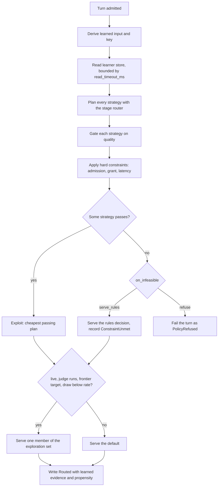
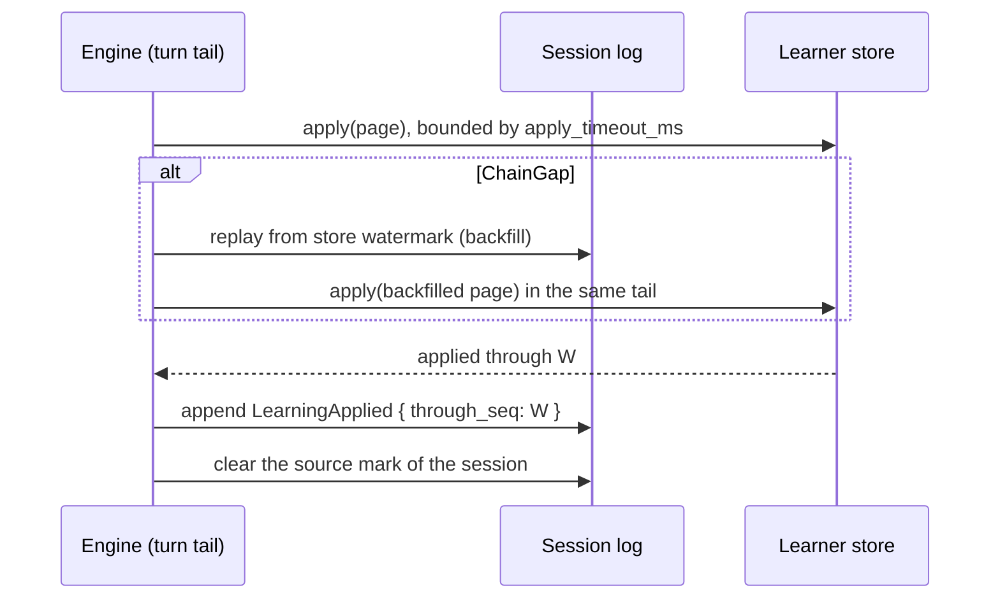

# The routing learner

The learner chooses a serving strategy for each turn and learns from frontier reviews which strategy is good enough. This chapter covers the choice, how the learner stores and recovers its state, and how an operator calibrates and promotes a project.

## What the learner chooses

A project with a `"tiers"` recipe can add a `"learner"` block (see [Routing and the selection service](routing.md)). For each turn, the learner chooses one strategy from the configured list:

| Strategy | Tier signal |
|---|---|
| `rules` | The stage router's own tier pick (`pick_tier`). |
| `efficient` | Always the Efficient tier. |
| `capable` | Always the Capable tier. |

The stage routing code (`StagePolicy::route_pick`) turns each tier signal into a plan. So every strategy keeps admission, recipe order, the dominance cost guard, and degrade-to-local. The learner picks the cheapest strategy whose frontier reviews pass the quality floor, within the latency limit and the budget grant.

Two designs were rejected. One strategy per model identity lets the learner route outside the operator's recipe and bypass the cost guard. A calibrated `rules` strategy has a pick that is not in the key. It would gain evidence only where it agrees with `rules`, which is selection bias.

A forced pick carries `DecisionSource::Strategy`, which is not signal-driven. So a `capable` pick that no signal asked for never opens a handoff note.

## Configuration

```json
"learner": {
  "mode": "shadow",
  "strategies": ["rules", "efficient", "capable"],
  "artifact": "/etc/roundhouse/learner/acme.json",
  "quality": { "floor": 0.8, "z": 1.96, "min_evidence": 5000, "min_sessions": 20 },
  "latency_limit_ms": 10000,
  "latency_min_samples": 20,
  "cache_min_samples": 20,
  "on_infeasible": "serve_rules",
  "read_timeout_ms": 25,
  "apply_timeout_ms": 250
}
```

| Field | Meaning |
|---|---|
| `mode` | `off` (the default), `shadow`, or `live`. |
| `strategies` | The strategy list, in order. Two or three, no repeats, and it must contain `rules`. |
| `artifact` | The calibration artifact. Its bytes decide the epoch. |
| `quality.floor` | The quality floor, in `0.0..=1.0`. |
| `quality.z` | The z value of the Wilson bounds. Positive. |
| `quality.min_evidence` | Live credit units that a key level needs before the gate reads it. |
| `quality.min_sessions` | Sessions that a key level needs before a strategy can pass. |
| `latency_limit_ms` | The limit on first output from turn start. Not 0. |
| `latency_min_samples` | Samples a latency mean needs before it applies. |
| `cache_min_samples` | Provider-measured cache pairs a target needs before its cost is corrected. |
| `on_infeasible` | `serve_rules` (the default) or `refuse`. |
| `read_timeout_ms`, `apply_timeout_ms` | The bound on one learner-store read per learned turn, and on one apply. Not 0. |
| `exploration.rate` | Accepted only in `live`. Defaults to `0.05` when the block is present. Range `(0, 1]`. |

In `off` mode, or with no block, the project routes as the stage router routes, and the engine reads no learner store. In `shadow`, the engine serves the `rules` route and records what the learner chose. In `live`, it serves the choice of the learner.

Only `on_infeasible` and `exploration.rate` have defaults. Every other field is required in `shadow` and `live`, and code supplies none. The values above are starting numbers, so every number that a project runs under is one that an operator wrote down.

The loader checks each present field in every mode. A broken floor on an `off` block is refused, because the day the project changes to `shadow` is the worst time to find it. It also refuses a block on a project without `tiers`, an unknown field, and an `exploration` block outside `live`. In `shadow` and `live`, it also refuses an artifact that it cannot read, that is not in the artifact format, or that lists other strategies. A relative `artifact` path resolves against the working directory of the process, so write an absolute path.

An `off` block keeps its `apply_timeout_ms`. A session of a project that is now `off` still delivers its pending entries under it. With no value, it waits 250 ms (`UNCONFIGURED_APPLY_TIMEOUT_MS`).

## How a learned turn is decided



In `shadow`, the engine serves the `rules` route at the end and keeps the record of the choice. One function (`turn_input`) derives the learned input for both the store read and the decision, so the two always name one key.

## Learned input and keys

The learned input has four parts:

- `rules_pick`: `efficient` or `capable`.
- `newest`: the band of the newest classification.
- `prior`: over the older classifications. `absent` (fewer than 2), `no_high`, or `some_high`.
- `tool_turn`: whether the client declared tools.

The sequence is the newest 3 classifications (`SEQUENCE_LEN`) in the recorded window. It is ordered by source turn, with ties to the later arrival, never by arrival alone. A delayed result for an old turn can land after a newer one.

A band is `none`, `unknown`, `low` (`trivial` or `routine`), or `high` (`involved` or `deep`). `none` means no classification at that position, because the classifier is not configured, has not answered, or answered after the cutoff. It is not `unknown` and not `low`.

| Level | Parts | Reachable keys |
|---|---|---|
| L2 | All four parts | 40 (not 48, because `newest == none` forces `prior == absent`) |
| L1 | `rules_pick` and `newest` | |
| L0 | `rules_pick` | |

Only L2 is stored on the record. L1 and L0 are projections of it, so a change to how they are cut must change the selector revision. Key parts are joined with dots, for example `capable.low.no_high.tools`, because the store joins key parts with `:`.

`rules_pick` is in every level for this reason. Within one key, `rules` then picks one tier, so its agreement with a fixed-tier strategy is almost constant. Without it, `efficient` evidence would come only from turns where `rules` also picked efficient, which are the easy turns. Then the gate could pass `efficient` on the hard turns. Input size and cache state enter through the quotes of each plan, not through the key.

## The quality gate

The gate is `wilson-v1`. For each key level and strategy:

- n = (prior_n + live_n) / `CREDIT_SCALE`, with `CREDIT_SCALE` = 1000.
- p = (prior_pos + live_pos) / (prior_n + live_n).
- L and U are the Wilson score bounds at the configured z. When n = 0, L = 0 and U = 1.

The gate reads the most specific level whose live units meet `min_evidence`.

| Result | Condition |
|---|---|
| Pass | `sessions >= min_sessions` at that level, and L >= floor. |
| BelowFloor | U < floor. |
| Unproven | Every other case, including no level with evidence. |

`min_evidence` counts only live units, so a prior alone never passes. Zero never meets a minimum, even a configured minimum of 0. Otherwise a large artifact prior would pass alone. The starting `min_evidence` of 5000 units is 5 intervals.

## Cold-start prior from classifier tier answers

The background classifier (TypeSafe Jev) answers one tier question, `capable` or `efficient`, in the same request as its other questions. So the tier answer costs no extra call. The classifier configuration is in [Metrics and the dashboard](../operations/metrics.md#background-turn-classification).

The engine computes a prior per turn from the tier answers. The prior is `JEV_PRIOR_PSEUDO_INTERVALS` = 3 intervals (3000 units of n) for each strategy on a key. Its positive units are `3000 * agree(k, tier(s)) / answers(k)`. A key with fewer than `JEV_PRIOR_MIN_ANSWERS` = 3 answers has no prior. The bounds on it:

- It applies only where the artifact prior for that key and strategy is zero, because an artifact prior is review evidence.
- It enters the Wilson bounds only after live evidence meets `min_evidence`. It never counts toward `min_evidence` or `min_sessions`.
- It never relaxes a hard constraint, and it is never a reward. The reward is the frontier review interval.
- It is off on turns whose admitted pool holds no frontier target, because local-only sessions never reach the classifier.
- The tier counts reach the store as `jev_capable` and `jev_efficient` on the three keys of the source turn. They never enter the artifact prior.

The classifier is never the sole routing criterion. It sees no price, TTFT, budget, context limit, load, or cache state, so it cannot trade off function, cost, and time. The only published evidence for it as a router measures label agreement (see [Measurements](../operations/measurements.md#typesafe-jev-routing-benchmark)).

## Hard constraints and the per-turn choice

The first target and every fallback that a turn serves must satisfy four constraints:

1. **Admission.** The same `ctx.admissible(None)` pool that the stage router uses.
2. **Grant.** `TurnBudget::admits` on a copy of the candidate at its corrected cost. An overflow-valve admission keeps its status.
3. **Latency.** The modeled first output is at or below `latency_limit_ms`.
4. **Quality.** The strategy that owns the plan passes the gate.

One predicate, `PlanEvidence::meets_hard`, holds the grant and latency constraints for both the exploit path and the exploration set. The dominance cost guard runs inside each strategy on the unchanged quotes. The corrected cost only ranks plans and checks the grant.

The exploit strategy is the passing plan with the lowest corrected cost. Ties go to the lower modeled latency, then to the configured order. The fallbacks are the first targets of the other passing strategies, in exploit order, without duplicates. A strategy's own fallbacks are excluded, because its quality evidence covers its first target only.

### Latency model

The modeled first output, measured from turn start, is the sum of the quoted TTFT, the mean residual of the target, and one project-level mean overhead. Each mean applies only at or above `latency_min_samples`. A residual sample is the first non-empty `OutputTextDelta.at_ms`, less the served `Routed.at_ms`, less the quoted TTFT. An overhead sample is the served `Routed.at_ms`, less `TurnStarted.at_ms`. A turn without a first output supplies neither, because missing output is not zero latency.

The overhead is separate because the time before dispatch (the synchronous judge call, the fleet quote, and the learner-store read) does not depend on the target. In a per-target residual, it would make every target look slower on reviewed sessions. Means round up and the result clamps at 0 ms, so both rules can only raise the estimate.

### Cost correction for measured cache reuse

The correction applies only to a frontier target with at least `cache_min_samples` provider-measured pairs. Let quoted_cached be the cached tokens that the quote assumed, and r the ratio of observed to predicted reuse (integer per-mille sums). The adjusted cached count is min(floor(quoted_cached * r), matched_prefix, isl, quoted_cached). The corrected cost is the quote plus max(0, price_tokens(isl - adjusted, adjusted) - price_tokens(isl - quoted_cached, quoted_cached)).

- `price_tokens` charges uncached input at `effective_write_per_mtok_usd`, so a one-hour cache keeps its write premium. The rejected formula, input rate less read rate, priced 100 tokens at input 1, write 2, read 0.1 as 100 instead of 200.
- The cap and the clamp at zero make sure that a correction never prices a route below its quote. Without the clamp, a rate card whose read rate exceeds its write rate let a shortfall lower a quote from $0.003 to $0.0014.
- A target with samples but no predicted reuse is priced with no cached tokens. That is the conservative bound, because keeping the quote would bank a discount that no evidence checked.
- Local targets are never corrected. There is no separate cache-miss penalty, because no record names eviction or cache pressure as the cause of a shortfall.
- `grant` takes `&CostEvidence`, so a grant check on the bare quote does not compile. A `compile_fail` doc test holds this.

## Infeasible turns and store failures

At cold start in `live`, no strategy satisfies the constraints. The `on_infeasible` values decide what happens:

- `serve_rules` serves the whole `rules` decision: its target, its own fallbacks, its budget state, and its admitted list. It records `ConstraintUnmet` with each constraint that some plan failed, in the order quality, latency, grant, then the read failure.
- `refuse` fails the turn with `EngineError::LearnerRefused`. The turn terminates as `IncompleteReason::PolicyRefused` and writes no `Routed`. There is no new wire variant, because an older node cannot decode one.

A failed store read replaces the quality constraint, because quality was not evaluated. Under `refuse`, every turn during a learner-store outage fails. A `serve_rules` turn still earns credit, because the served trajectory is real and a frontier review covers it. The rejected alternative served the `rules` route on every turn and appended its fallbacks. That bypassed the quality and latency constraints.

## Exploration

A turn can explore only when all of these are true:

- the project is `live` and has an `exploration` block,
- the validation arm of the session runs the judge (see [Validate and steer](validate-steer.md)),
- the admitted pool holds a frontier target,
- the learner-store read succeeded,
- the rate draw is below `exploration.rate`.

The draw is one SHA-256 over this text:

```text
{LEARNER_DRAW_VERSION}\nrouting-explore\nsalt={arm_salt}\nsession={session_id}\nresponse={response_id}\n
```

The `routing-explore` domain keeps the draw apart from the hash of the validation arm, so which sessions explore does not correlate with their arm. The rate is the top 53 bits of the first 8 bytes, divided by 2^53. Dividing a whole u64 by 2^64 would round the top 1024 values to exactly 1.0. The next 8 bytes, modulo the set size, pick the member.

The exploration set has two parts. First come the Unproven strategies that are cheaper than the reference and meet every hard constraint, in configured order. The reference is the exploit target, or else `rules`. Then comes `rules`, whenever its plan meets every hard constraint. It is exempt from the Unproven and cheaper filters, because it is the quality baseline. Under `refuse`, `rules` joins only when some strategy passes, so a turn that nothing passes is still refused unless a cheaper Unproven strategy explores. BelowFloor strategies never explore.

The member is drawn uniformly. So a live turn whose learned choice differs from `rules` serves the `rules` route with a probability above zero, which the calibrator needs to compare the two. The propensity of the served route is `1 - rate + rate * share` for the default target and `rate * share` for every other target. Members are counted by route (`same_route`), not by worker.

`ExplorationEvidence` records the draw, the member, the set, and `on_infeasible`, so the calibrator can derive the set again. It does not record the rate. A change to the set rule changes `LEARNED_SELECTOR_REVISION`.

Negative result: without exploration, a `live` learner can still serve a route that `rules` would not. The exhaustive test `without_exploration_the_learned_route_equals_rules_or_is_infeasible` holds only per admitted pool. It covers more than 10,000 cases: six pool shapes, two pickers, four operational states, three prior states, and both `on_infeasible` values.

Credit from one pool can pass a strategy that routes differently on another pool of the same key. `credit_earned_on_another_pool_can_change_the_route_through_a_constraint` shows this. `capable` earns credit on a pool that holds only `frontier/large`, where `rules` serves the same target. Later `local/small` is admitted but too slow. `rules` fails the latency limit, and `capable` serves `frontier/large`. An evaluation must not assume that a `live` project without exploration serves only `rules` routes.

## Credit from frontier reviews

A frontier review labels one interval of routing decisions (see [Validate and steer](validate-steer.md)). Take an accepted `Positive` or `Negative` interval. A strategy is consistent with it when the first target of its plan equals the served dispatch on every covered turn. The screen runs in this order, and each failure credits nothing:

1. Any failover in the interval (`failover_in_interval`). The served propensity of a failover turn is not the selection propensity.
2. Any covered decision with no learned row (`missing_row`), another epoch (`mixed_epoch`), or another credit revision (`other_credit_revision`).

Each consistent strategy then gets `CREDIT_SCALE` units per level, split over the level keys that the interval visited in proportion to covered turns. `Positive` adds to pos and n. `Negative` adds to n only. So one interval adds at most 1000 units per strategy per level, however many decisions it had. Correlated decisions never count as independent evidence, and no strategy gets credit for the action of another. The rejected alternative was a fractional split over the strategies selected. That assumes a shared responsibility that the evidence does not show.

The row stores one agreement bit per strategy, from a structural provider and model comparison, and no recipe indices. So a degrade to an unnamed local worker stays comparable. The calibrator uses the same `screen` function. A failover turn writes two `Routed` events to two targets, so consistency alone already credits nothing there. The failover rule still runs first, so that its counter shows it.

## Epochs and the artifact

The learned state is quality counters per key level and strategy, plus operational counters per target. An epoch groups that state. The epoch id is SHA-256 over these inputs, truncated to 16 bytes:

- the SHA-256 of the artifact bytes (never its `.meta.json` sidecar),
- the ordered strategy list,
- `LEARNING_INPUT_REVISION`, `LEARNED_SELECTOR_REVISION`, `STAGE_SELECTOR_REVISION`, and `LEARNING_CREDIT_REVISION`.

The stage revision is in the hash because it versions the `rules` pick that every key contains. The artifact also names `stage_revision`, and the parser refuses a mismatch. A change to learned input, keys, selection, or credit changes its revision and starts a new epoch. Older records and artifacts are refused, not read under new rules. Old epochs are never deleted, and each decision records its epoch, so credit lands on the epoch it ran under. A provider that changes the model behind one identity does not change the epoch, so the operator must write a new artifact.

## Delivering learning to the learner store

A session starts to produce learning entries at its first `Routed` with learned evidence. After that, each `ValidationDecided`, `ResponseCompleted`, `ResponseIncomplete`, and `ClassificationRecorded` event produces exactly one entry, even with empty deltas. An entry is identified by (project, session, seq), and `prev_seq` links it to the previous one. Its deltas are a pure function of the log prefix, the credit revision, and `REVIEW_RULE_REVISION`.

The fold holds at most `LEARNING_PAGE` = 64 entries above the last acknowledged sequence (`LearningApplied.through_seq`, a hint, because the store watermark is the authority). While entries are not held, no later entry enters the page, so the page never skips one. The rejected alternative evicted the oldest entries. A backfill fold holds every entry above a floor, and `LearningApplied` events move only its hint and never prune its page. Otherwise a store that lost recent writes would answer `ChainGap` with the same watermark forever.

`LearnerStore` has three operations: `read`, `apply` (all or nothing), and `watermark`. `apply` skips an entry with seq at or below the watermark, stages an entry whose prev_seq equals it, and refuses the batch otherwise. The check is per entry, so a resend after a lost acknowledgement applies each entry once, and it does not depend on the session lease. Counters are integers in `0..=2^53-1` (`MAX_EXACT`, the largest integer that a Lua number holds exactly), so the final state is independent of order.

| Error | Meaning | Result |
|---|---|---|
| `ChainGap { store_watermark }` | prev_seq is above the watermark, so an entry is missing. | Backfill from the watermark. |
| `ChainDiverged` | prev_seq is below the watermark and seq is above it. The chain of the sender has no entry at the watermark. | Delivery of that session stops. |
| `CounterRange` | The input against stored counters is out of range. | Delivery of that session stops. |
| `Malformed` | The input alone is invalid. | Delivery of that session stops. |
| `Unavailable`, a timeout | The store did not answer. The result is unknown. | Entries stay pending. |
| `WrongType` | A key or watermark field holds foreign data. | Entries stay pending. |

A backfill cannot fix `ChainDiverged`, because it would resend the same entry forever. A stop is per session, and a new epoch does not help it. After a timeout, the engine sends again later, and entry identity makes that safe. The Redis script writes nothing until every check passes, because Redis does not undo writes made before an error. A server failure during the write phase is outside the guarantee, and the contract tests cannot inject it.

### Delivery in the turn tail

The engine delivers in the tail of `run_turn`, after the settle and the fair-use draw, and before the lease release. Delivery after the release does not compile, because `release` consumes the session. Delivery runs for steered, failed, and dispatched turns, because a review can land on any of them.



- At most one dry-page refill and one gap backfill run per tail. The backfill applies in the same tail. On the next turn it could not work, because the live fold page would still start above the store watermark and meet the same gap.
- On success, the engine appends `LearningApplied` first, then clears the mark. A failed append skips the clear. A failed delivery leaves the entries marked for the next turn.
- Delivery follows the log, not the mode of the project. A session with learned history keeps delivering after its project changes to `off`.
- Delivery outcomes are not in the log. The engine counts them in process memory (see [Metrics and the dashboard](../operations/metrics.md#learner-decisions-and-delivery)).

## Startup

When some project in the `learner` blocks of the file is `shadow` or `live`, the binary composes the learner at boot (`routing_composition::compose`). This holds even for a project that no turn key names yet, because the same check makes the `learner_recovery` block required.

- The routing policy is `learned`, which wraps the stage router. Every decision in the process records `policy: "learned"`, even for `off` projects, which route as the stage router routes them.
- The learner store opens with the other shared state: `RedisLearnerStore` when `ROUNDHOUSE_REDIS_URL` is set, under the same namespace. Otherwise it is in memory, and the process logs a warning that learner state ends with it.
- The recovery task starts.

Otherwise the policy is `affinity` or `stage`, no learner store opens, no recovery task runs, and no learner line is logged. In every case, `serve` logs the engine policy before it serves (`policy=learned`, `policy=stage`, or `policy=affinity`).

An invalid artifact stops the boot. An all-`off` boot composes no recovery task, so marks that earlier `shadow` sessions left stay pending until a learner is enabled. Suppose the admin plane adds a `learner` block to a process that booted with no learner. The project routes as before, and the process logs one warning per project until a restart composes the learner.

Each node reads the artifact from its own path. The admin directory fingerprint records the SHA-256 of each artifact. A node that read other bytes than the writer of a directory version reports a `learner_artifacts` divergence. So two nodes do not silently run two epochs (see [Control plane](control-plane.md)).

## Recovery

The recovery task delivers sessions that went idle with entries owed. Three cases are a session that never turns again, a session whose learner-store calls all failed, and a session whose node stopped before the apply. Each sweep does three steps:

1. It reads a page of pending sessions from the session-store index. Each was marked at least `idle_after_ms` ago, by the store's clock.
2. For each session, it reads the learner-store watermark and replays the log above it without a lease. It delivers up to `pages_per_session_per_sweep` pages through the delivery that the engine runs. Then it clears the mark with the watermark that the store confirmed, and only when the store holds every entry through the mark.
3. It audits a page of every session that was ever marked. A session whose learner watermark is below its mark lost state after a clear, and the audit makes it pending again. The audit never clears.

The task never appends to a log, never takes a lease, and does not read `is_leased`. Entry identity and the clear predicate make lease checks unnecessary. The default of that trait method returns true, so a backend that inherits it would stall recovery.

### Outage or one session's fault

A fault in the stored data of one session holds that session and never stops the sweep. Only a failure of a whole store is an outage. If a per-session fault were an outage, the cursor would stay on that session, and it would stop delivery and the audit for every project.

On an outage, the sweep stops with the marks in place and its place in the index kept. The next sweep waits twice as long, up to 8 intervals (`MAX_BACKOFF_FACTOR`). One warning covers the whole outage. A store is down when:

- the learner store answers `Unavailable`,
- a watermark read or an index call (a page or a requeue) times out,
- a session-store call fails with a backend error,
- an index member is not valid UTF-8.

These hold one session only:

- foreign data in a learner key or watermark (`WrongType`),
- a stopped session, or a gap that the backfill cannot close,
- a corrupt or missing log (`StoreError::CorruptLog`),
- a mark that the index cannot read,
- an apply, replay, backfill, or clear that runs past its timeout. The watermark read of the next session tests whether the store is down.

The task warns once per session and mark. It logs one error when a session stops, and it does not visit a stopped session again until a restart. Timed-out applies and unclosable gaps are counted in `learning.delivery`, not logged.

### The recovery block

The top-level `learner_recovery` block of the file sets the cadence. It is required when any project is `shadow` or `live`, in the file or through an admin write. An admin write that enables a learner under a file with no block is refused, as the boot is. A block with no learner enabled is accepted. Every field is required, and no field can be 0. A zero timeout fails every call. A zero interval sweeps in a busy loop. A zero idle window makes the task compete with the delivery of every live turn. The values below are starting values:

```json
"learner_recovery": {
  "sweep_interval_ms": 30000,
  "idle_after_ms": 60000,
  "max_sessions_per_sweep": 64,
  "pages_per_session_per_sweep": 4,
  "audit_sessions_per_sweep": 32,
  "read_timeout_ms": 25,
  "apply_timeout_ms": 250,
  "source_timeout_ms": 1000
}
```

`sweep_interval_ms` is the wait between two sweeps when the stores answer. `idle_after_ms` is how long the newest mark of a session must stand before a sweep delivers it. The three `*_per_sweep` fields bound the work of one sweep. `read_timeout_ms` bounds one learner-store watermark read, `apply_timeout_ms` one apply, and `source_timeout_ms` one session-store call (an index page, a replay, a backfill, a clear, or a requeue).

## Calibration and the promotion report

The `learner-calibrate` binary writes the artifact of a project and the report that a promotion from `shadow` to `live` uses. It only reads the stores. It never appends, clears, or requeues, and it never takes a lease.

### Run the calibrator

1. Write a manifest.
2. Run `learner-calibrate <manifest.json> <out-dir>`.
3. Read `report.md`.
4. Copy `artifact.json` to the path that `learner.artifact` names on each node.

The binary prints the epoch id and the path of each file that it wrote.

```json
{
  "source": { "redis": { "url_env": "ROUNDHOUSE_REDIS_URL", "namespace": "rh" } },
  "drift_check": { "point_in_time_copy": { "url_env": "SNAPSHOT_REDIS_URL", "namespace": "rh" } },
  "calibration": {
    "project": "acme",
    "strategies": ["rules", "efficient", "capable"],
    "prior": "credit",
    "quality": { "min_sessions": 20 },
    "latency_limit_ms": 10000,
    "bootstrap": { "seed": 20260929, "resamples": 1000 }
  }
}
```

| Field | Meaning |
|---|---|
| `source` | A Redis session store, or `{ "dump": { "path": "dump.json" } }`, a file of marked logs (`LogDump`) relative to the manifest. A Redis source names the environment variable that holds its URL, never the URL. |
| `drift_check` | Optional. A point-in-time copy of the learner store, for example a snapshot in a disposable Redis. The report compares its counters with the entries that its watermarks cover. Without it, the report says `drift check not run`, because a live store changes while the logs are read. |
| `calibration.prior` | Required. `credit` carries the review credit of this manifest's intervals into the artifact. `zero` writes no prior units. Classifier tier answers never enter the artifact prior. |
| `calibration.cutoff` | Optional. Without it, every marked session of the project is read to its end. |
| `calibration.bootstrap.resamples` | At least 40 (`MIN_RESAMPLES`). With fewer, the 2.5% tail has no place, and the manifest is refused. |

The binary lists the sessions of the project from the source marks and replays each log. It writes four files:

| File | Content |
|---|---|
| `artifact.json` | The artifact that `learner.artifact` names. It holds no clock time. Its bytes decide the epoch. |
| `artifact.json.meta.json` | The sidecar: creation time, host, and digests. Nothing hashes it. |
| `report.md` | The report. |
| `input-manifest.json` | The cutoff that the run read: each session id, its last sequence, and the SHA-256 of its events. Copy its `sessions` into `calibration.cutoff` to repeat the run byte for byte. |

The same manifest gives byte-identical artifact and report files. The source commit comes from the build environment (`ROUNDHOUSE_SOURCE_COMMIT`) or the crate version, never from the clock.

### The learned candidate

At each logged turn, the `learned` candidate is what `live` serves without exploration: the recorded exploit strategy, recomputed with the policy's `exploit_order`, or else `rules`. Each configured strategy is also shown as a fixed candidate. The rejected alternative gated every turn again over counters rebuilt from the manifest. That evaluates a policy on the data that trained it.

A replay check makes sure that each record is what the policy writes from its own inputs. The propensity is in `(0, 1]`, and exactly 1 when the turn cannot explore. The served dispatch is the first target of the served plan. The exploit strategy equals the recomputed head, the explored member equals the draw modulo the recorded set, and the recorded set equals `eligible` over the recorded plans. A record that fails is excluded as a record that does not replay. The rate draw alone cannot be checked, because the rate is not recorded.

### What the report shows

- **The estimand.** Every weighted number is labeled `conditional interval value`. An evaluation unit is an accepted review with a `Positive` or `Negative` label and no failover. It needs learned evidence of one epoch on every covered decision, as the credit screen does. Numbers about the served `rules` route are labeled `factual`.
- **The weight.** A candidate's weight on an interval is the product over its turns of `1[candidate == served] / propensity`, with the propensity that each turn recorded. One mismatched turn gives weight zero. The estimate is self-normalized, and its bootstrap interval resamples whole sessions. The bootstrap uses SplitMix64, pinned by a golden test, because a library generator can change its stream between versions.
- **Measured cost and latency.** Terminal usage at the rate card that each dispatch recorded. A local dispatch has no rate card, and an estimated usage (`Accounting::Estimated`) leaves cached input at zero and so overprices. Both are `unpriced`, never $0. These lines and the measured p50 first output are shown, not gated.

The report also counts excluded intervals by cause, and it shows classifier and judge spend by strategy, the tier agreement block, and the drift check.

### The promotion tests

A `shadow` project never explores. So the `learned` candidate has weight only where it agreed with `rules`. Comparing that subset with `rules` over every interval would promote by selection alone. So every test compares both sides on one interval set.

| Test | What it compares | Pass condition |
|---|---|---|
| 1. Quality, agreeing intervals | The bootstrap lower bound of learned minus `rules`, both summed over the same resampled sessions, on intervals where the learned choice was the `rules` route on every turn. | Lower bound >= -0.02 (`QUALITY_ALLOWANCE`). |
| 1b. Quality, every interval | The learned lower bound against the `rules` estimate less 0.02. | Evaluable only where both sides have logging probability above zero. |
| 2. Cost | The learned choice and `rules`, each priced on every eligible interval from its recorded plan quote after the cost correction. Labeled `corrected quote estimate`. | At least 10% lower (`COST_REDUCTION`). |
| 3. Latency | The p50 of the modeled first output of the learned plan from turn start. Labeled `corrected quote estimate`. | At or below `latency_limit_ms`. |
| Session count | Sessions that hold an agreeing interval where the learned candidate has weight above zero. | At least `quality.min_sessions`. |

- A quote without enough cache samples, or a local quote, is `unpriced`, and the cost test is then `not evaluable`. Test 1 is `not evaluable` with too few agreeing sessions, a side with no weight, or sparse support (more weightless replicates than the 2.5% tail has places).
- In `shadow`, the learned side of test 1b has no logging probability where it differs, so 1b is `not evaluable`. In `live`, `rules` is in the exploration set, so 1b can be evaluated wherever the `rules` plan met its hard constraints. Under `refuse`, it is also limited to intervals where some strategy passed.
- In `live`, a session whose agreeing intervals all explored carries no weight, so it does not count toward the session count. A test whose inputs do not exist reads `not evaluable` with the reason, never `pass`.

The report ends with two result lines. The staged promotion line is `yes` when tests 2, 3, and 1 pass. The binding line reads tests 2, 3, and 1b. On `live` data, 1b is the binding quality test.

### Promote and roll back

Nothing in Roundhouse promotes or reverts a project automatically. Both are configuration changes that an operator makes.

1. Run the calibrator on a `shadow` project.
2. If the staged promotion line is `yes`, set `mode` to `live` and add an `exploration` block.
3. After the project serves live sessions (the report names 20), run the calibrator again.
4. Read the binding line. If a binding test fails, set `mode` back to `shadow`.

To roll back an artifact, name the previous artifact again. Its bytes give the previous epoch, and the learner store still holds its counters.

### Negative results from calibration

**A shadow report cannot show a cost saving from measured cost.** In `shadow`, the learned candidate has weight only where it agreed with `rules`. Its measured cost there is the `rules` cost, so a 10% saving can come only from which intervals agreed. A fixture showed this: 10 shadow sessions, 5 that agree at $0.01 (all positive) and 5 that diverge at $0.10 (4 positive). A summary that compared the subset with `rules` over every interval printed "all three tests pass: yes". So the cost and latency tests use corrected quotes on every eligible interval.

**The paired quality test on agreeing intervals carries no loss signal.** The rejected test compared the learned lower bound with the `rules` point estimate on the same intervals. With 20 agreeing shadow sessions, 17 positive, it read 0.70 against 0.85 and failed on sample noise for a loss that cannot exist. The paired statistic avoids that failure. But its difference is zero in both modes, because both sides carry the same weight on an agreeing interval. Only test 1b can show a loss.

**One mismatched turn zeroes a trajectory, and interval value is not session value.** The rejected formula multiplied the weight only over matching turns. Take a uniform A/B logger, a candidate that always picks A, and rewards A = 0 and B = 1. The formula gives IPS 0.5 and SNIPS 1/3, where the true value is 0. The test `one_mismatched_turn_zeroes_the_trajectory_weight` holds the correct rule. Interval-local weights also estimate at most a conditional interval value: in one fixture, it is 0.75 and the session value is 1.0. Both counterexamples come from independent scripts outside the repository.

**A non-finite trajectory weight is excluded, but almost unreachable.** A propensity product that underflows makes every estimate NaN, so the report excludes and counts it. One review covers at most 64 turns. At the default 5% rate, the smallest recorded propensity is about 0.017, far above the ~1.5e-5 per turn that 64 turns need to underflow.

## Upgrades

`SelectorBranch::Learned`, `DecisionSource::Strategy`, and `LearningApplied` are event variants that an older build cannot decode. So every node must run a build that knows them before any project enables `shadow` or `live`. The default `off` writes none of them, so a mixed fleet is safe until then. A directory document with no learner block is byte-identical to one from a build that does not know the block. A change to the store layout is a new key-family version (see [Deploy with Redis](../operations/redis.md)).
