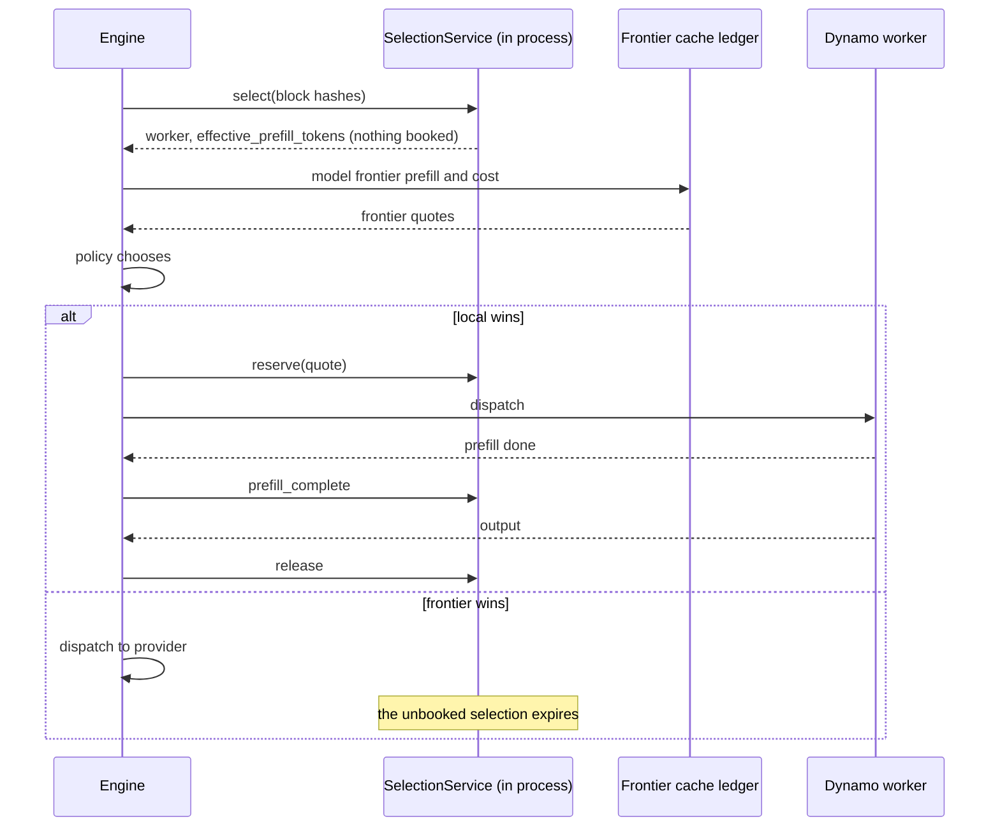

# Routing and the selection service

This chapter describes how Roundhouse compares a local Dynamo worker with a hosted frontier model, and why it embeds Dynamo's selection service to do so. The choice between tiers of models is in [Choosing a model](model-selection.md).

## One comparison axis

"Serve this from our model on worker 7" and "send it to Anthropic" become comparable when both are expressed as cache-adjusted expected prefill. Each candidate also carries an expected cost, an expected time to first token (TTFT), and a quality prior.

**Local.** `SelectionService::select` is a query only. It returns `effective_prefill_tokens`, the scheduler's own cache-weighted prefill cost, and books nothing. Roundhouse takes it unchanged.

**Frontier.** No provider exposes its cache, so Roundhouse models it from the routing ledger: what it sent last, when, and under which cache model. Expected prefill is `isl - p_hit(elapsed) * last_prefix_tokens`, where `isl` is the input length. Each catalog model names one cache model:

| Cache model | Provider shape | `p_hit` |
|---|---|---|
| `deterministic { ttl_ms }` | Anthropic `cache_control` | 1 inside the TTL, else 0. A hit refreshes the TTL. |
| `inactivity_decay { half_life_ms, max_ttl_ms, min_prefix_tokens }` | OpenAI automatic caching | `0.5^(elapsed / half_life)`, and 0 below the minimum prefix or after the maximum TTL. |
| `observed` | local workers | Not modelled. The selection service reports overlap directly. |

A provider that caches only at request markers (Anthropic) is priced from the last marker that request carried. The unmarked final item is priced as uncached input on the next turn. See [Anthropic cache markers](#anthropic-cache-markers).

## The routing policies

The engine holds one routing policy, chosen at boot from the control plane:

| Control plane at boot | Policy on the decision record |
|---|---|
| No project has a `tiers` block | `affinity` |
| A project has `tiers`, and no project enables the learner | `stage` |
| A project's learner is `shadow` or `live` | `learned` |

Each wrapper serves the turns it does not own exactly as the inner policy does, and the record names the object in force. A wrapper is composed only when the plane needs it, so a deployment whose routing did not change keeps its `affinity` label. A `tiers` or `learner` block added through the admin plane after boot has no effect until a restart. The engine warns once per process for `tiers` and once per project for `learner`. See [Choosing a model](model-selection.md) for `stage` and [The routing learner](routing-learner.md) for `learned`.

**`AffinityPolicy`** is the policy without a recipe. It min-max normalizes expected prefill, expected cost, and expected TTFT across the admitted pool, then picks the smallest `1.0 * prefill + 0.5 * cost + 0.25 * ttft` (the defaults in `Weights`). Prefill dominates because it is the cheapest signal to get right. The pull toward a warm target is soft, since cost and TTFT together can outvote it. It minimizes provider switches, because each switch pays one cold prefill of the full prefix.

## Policy is data

A routing policy decides how to choose. A turn policy decides what the turn can choose from. Per-key policy arrives as data, a `TurnPolicy`, resolved at admission and fixed for the turn. It carries the quality floor, the allowed targets, the frontier cadence, and more.

`TurnPolicy::admits` applies every constraint for every routing policy, so a policy that a deployment writes never re-implements tenancy. Every narrowing goes through it: the admin ceiling, the MCP overlay, escalation, and the validator's escalate action. A judge verdict therefore cannot buy a frontier turn for a project limited to local targets. A floor that the server resolves wins over one that the client supplies. `DecisionRecord.turn_policy_digest` changes when an overlay changes the policy mid-session.

**Admission blames in order.** The turn policy filters first. If that empties the pool, the error is `PolicyRefused`: this deployment refused this tenant, and only an operator can fix it. The budget and load filters come next. If they empty the pool, the error is `NoViableCandidate`: a busy fleet or a spent budget. See [Control plane](control-plane.md) for budgets and the overflow valve.

## Why embed the selection service

Dynamo's `SelectionService` exposes each HTTP endpoint of `python -m dynamo.select_service` as a plain async method. Roundhouse calls it in process. This removes the TCP round trip and the JSON serialization of the prompt, which is most of the cost of a call at long context. Queries carry block hashes and sequence hashes, never token ids. For a 100k-token context, that is a few kilobytes instead of a 400 KB array.

### Select, then reserve

The split between `select` and `reserve` is what makes routing across providers possible. The router prices the local option, compares it with a frontier quote, and books only if local wins:



An abandoned quote costs nothing. The reservation lifecycle, `prefill_complete` then `release`, is mandatory. A leaked reservation permanently inflates the router's view of that worker's load. A `Reservation` dropped without `release` logs an error, because a `Drop` cannot await and cannot repair the leak.

**The local quote is skipped when it cannot change the decision.** A local quote is a residency check on the path to the first token. The field `local_quote_skipped` on the decision record says why a turn has none:

| `local_quote_skipped` | Meaning |
|---|---|
| `tools_declared` | The client declared a toolbox, and a local worker cannot carry one. |
| `policy_admits_no_local` | The principal's policy names no local target. |
| `fleet_error` | The quote was asked, and the fleet answered with an error. |
| `fleet_timeout` | The quote was asked, and the fleet did not answer in time. |

The first two mean "never asked", and the last two mean "asked and dropped". A spent budget or cadence never skips the quote, because both make a local route more likely.

**`register_worker` waits until the worker is routable.** Dynamo's `upsert_worker` marks a worker schedulable before the booking table sees it, so a `select` then `reserve` can fail with `WorkerNotFound`. `EmbeddedFleet::register_worker` waits up to 2 seconds, then returns `FleetError::NotRoutable`. Without the wait, the flood test in `crates/roundhouse-fleet/tests/embedded_selection.rs` failed 1 to 18 times per 300 runs under CPU contention. With it, 0.

### Dynamo's cost function

At the pinned Dynamo revision (`ac7b7513`), selection is the argmin of a cost logit over eligible workers:

```text
overlap_credit = overlap_score_credit * decay * device_overlap
               + host_cache_hit_weight * host_overlap
               + disk_cache_hit_weight * disk_overlap
               + shared_cache_multiplier * shared_beyond_device
decay          = 1 / (1 + overlap_score_credit_decay * normalized_excess_prefill_load)
logit          = prefill_load_scale * max(0, raw_prefill_blocks - overlap_credit)
               + decode_cost_blocks
               + decode_active_request_weight * active_requests
```

The defaults are `overlap_score_credit = 1.0`, `overlap_score_credit_decay = 0.0`, `prefill_load_scale = 1.0`, `host_cache_hit_weight = 0.75`, `disk_cache_hit_weight = 0.25`, `shared_cache_multiplier = 0.0`, `decode_active_request_weight = 0.0`, and `router_temperature = 0.0`. Temperature 0 gives a deterministic argmin. Load is booked at reservation time.

## Scaling shape

The selection service is stateful and replicated, not sharded. Every replica holds the complete radix tree and processes the complete stream of KV events. Neither index memory nor event-ingest CPU divides by the replica count N.

Replica sync is best effort, with no sequencing, acknowledgement, replay, or resynchronization. Output-block growth is not synced. Each replica underestimates the load that its peers drive, and the error grows with N. N from 3 to 10 is comfortable when embedded.

At N = 1, `replica_sync` is never called, so no PUB socket is bound and no peer-mesh configuration applies. The only ZMQ left is KV-event ingest from workers.

## Co-location with Dynamo

`EmbeddedFleet` runs `SelectionService` in process and subscribes to Dynamo's ZMQ PUB/SUB streams of KV events. These streams cannot practically go through an SSH tunnel. A deployment with a local tier therefore runs Roundhouse on the same node as the Dynamo workers. Only Roundhouse's HTTP port crosses a tunnel to the client, for example `ssh -L 8080:localhost:8080 user@node`. A deployment wires `EmbeddedFleet` into the engine with `Engine::with_fleet` and adds its local model to the reachable candidates. The shipped `roundhouse` binary does neither.

Three alternatives were rejected:

- **KV events over Redis pub/sub or Streams.** The pinned Dynamo has no Redis publisher, and the path adds latency.
- **An HTTP webhook from Dynamo.** Delivery stops being fire-and-forget, and frequent events can overload the endpoint.
- **Dynamo as a second "frontier" entry in the catalog.** This bypasses the selector and the block-level KV signals. `AffinityPolicy` falls back to TTL-decay estimates, and the dashboard's local and frontier split and `explain_last_route` become wrong.

## Anthropic cache markers

Anthropic caches nothing without an explicit `cache_control` marker. A flat single-message prompt gets a 0% hit rate, while the router keeps pricing the target on a cache prediction that nothing can fulfil. So `FrontierQuote` carries segment boundaries at item boundaries inside the canonical `prompt`, and the Messages client places markers on the blocks they split. The segments join back to `prompt` byte for byte, which keeps `turn_id_for`, the block hashes, and `rendered()` as one projection. A second projection structured by role was rejected, because it can disagree with all three.

Anthropic allows four markers per request. Placement:

- The marker goes on the penultimate block. That block ends the prefix the previous turn sent, so the marker reads that turn's entry and extends it. The final block is new input and stays unmarked.
- A second marker goes on the block that the previous request marked, when the gap is 20 blocks or more (`CACHE_LOOKBACK_BLOCKS`). Anthropic's lookup reaches at most 20 block positions back from a marker.
- The client's own tool markers win when the allowance is spent, because a fifth marker is a 400 that costs the turn.
- With fewer than two segments, there is no stable prefix and no marker.

## One layer per signal

In a Kubernetes inference stack, several layers can schedule the same GPUs. Each layer should be the sole authority for what it uniquely knows:

| Layer | Decides | From |
|---|---|---|
| Gateway | TLS, retries, failover across pools | No token knowledge |
| Endpoint picker (EPP) | Which pod of a homogeneous pool | Scraped metrics and an approximate prefix index |
| Roundhouse | Which provider, under whose budget | The session log, tenant policy and spend, the frontier cache ledger, prices |
| Dynamo | Which worker and DP rank | Real KV residency across tiers, and booked load |

When two layers own one signal, they fight:

- In a Dynamo deployment, the "pod" that an EPP picks is a Dynamo frontend that routes again. The EPP models residency on a fleet whose placement it cannot see.
- An EPP 429 for a request that Roundhouse already granted budget leaks a reservation.
- A data-plane retry moves the request off the reserved worker without telling Roundhouse.
- The Gateway API Inference Extension prefix scorer (at `a70292c^`) hashes characters of the JSON request, not tokens. It uses 16 × 4 characters per block for the HBM tier only, and its index is lost on EPP restart. Dynamo's index is fed by real KV events on real tokens, per tier.

See [Design decisions](../development/design-decisions.md) for why Roundhouse sits in front of a gateway.

A hosted router that does not own the workers must choose between routing freely and keeping a prefix warm. A provider cache is scoped to one provider and model. Router.com, as read on 2026-08-20, uses a five-minute routing-affinity lease, which gives up routing for the lease. Roundhouse owns the workers the prefix lives in, so it does not have to choose. The bytes saved on the client connection are measured. A dollar saving against a stateless baseline that already uses provider caching is not.

## Background classification is not on the routing path

`ROUNDHOUSE_CLASSIFY_CONFIG` enables background turn classification. No classifier call is on the turn path, and its answers enrich only later turns. A classification is an uncertain feature, never a serving reward. The quality signal is the frontier review interval. See [The routing learner](routing-learner.md).

The classifier worker takes no session lease. A later turn appends its results through the existing writer, and replay never dispatches an intent again. Classifier calls spend a separate evaluation budget. See [Cost and savings](cost-and-savings.md).
