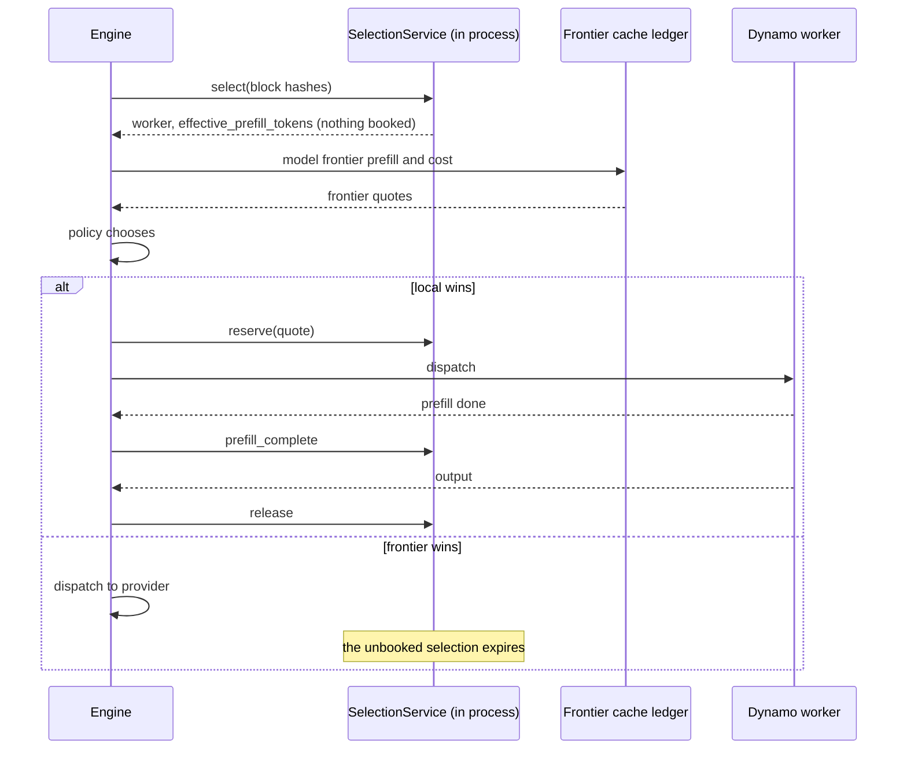

# Routing and the selection service

This chapter describes how Roundhouse compares a local Dynamo worker with a hosted frontier model, and why it embeds Dynamo's selection service to do so. The choice between tiers of models is in [Choosing a model](model-selection.md).

## One comparison axis

"Serve this from our model on worker 7" and "send it to Anthropic" become comparable when both are expressed as cache-adjusted expected prefill. Each candidate also carries an expected cost, an expected time to first token (TTFT), and a quality prior. The two sides compute expected prefill very differently.

**Local.** `SelectionService::select` is a query only. It returns `effective_prefill_tokens`, the scheduler's own prefill cost weighted by cache credit, and it books nothing. Roundhouse takes this number without change.

**Frontier.** No provider exposes its cache. So Roundhouse models it from the routing ledger: what it sent last, when, and under which cache model. Expected prefill is `isl - p_hit(elapsed) * last_prefix_tokens`, where `isl` is the input length. Each catalog model names one cache model:

| Cache model | Provider shape | `p_hit` |
|---|---|---|
| `deterministic { ttl_ms }` | Anthropic `cache_control` | 1 inside the TTL, else 0. A hit refreshes the TTL. |
| `inactivity_decay { half_life_ms, max_ttl_ms, min_prefix_tokens }` | OpenAI automatic caching | `0.5^(elapsed / half_life)`, and 0 below the minimum prefix or after the maximum TTL. |
| `observed` | local workers | Not modelled. The selection service reports overlap directly. |

A provider that caches only where a request places a marker (Anthropic) is priced from the last marker that request carried. The unmarked final item is priced as uncached input on the next turn. See [Anthropic cache markers](#anthropic-cache-markers).

## The routing policies

The engine holds one routing policy. Which one depends on the control plane at boot:

| Control plane at boot | Policy on the decision record |
|---|---|
| No project has a `tiers` block | `affinity` |
| A project has `tiers`, and no project enables the learner | `stage` |
| A project's learner is `shadow` or `live` | `learned` |

Each wrapper serves the turns it does not own exactly as the inner policy does. The record names the object in force, so the audit trail credits the right router. A wrapper is composed only when the plane needs it. An unconditional wrapper relabels every decision of a deployment whose routing did not change. A `tiers` or `learner` block added through the admin plane after boot has no effect until a restart. The engine logs a warning at the project's first turn. The `stage` policy is in [Choosing a model](model-selection.md). The `learned` policy is in [The routing learner](routing-learner.md).

**`AffinityPolicy`** is the policy without a recipe. It min-max normalizes expected prefill, expected cost, and expected TTFT across the admitted pool. It then picks the candidate with the smallest `1.0 * prefill + 0.5 * cost + 0.25 * ttft`. The weights are the defaults in `Weights` and a caller can change them.

The default is prefill-dominant. Prefill is the cheapest signal to get right, and it is the signal the rest of the system exists to exploit. The ledger prices a new target as cold, so the pull toward a warm target is real. It is also soft: cost and TTFT together can outvote it. The pull minimizes provider switches, because each switch pays one cold prefill of the full prefix on the new target.

## Policy is data

A routing policy decides how to choose. A turn policy decides what the turn can choose from. They are separate types.

- The engine holds one `Arc<dyn RoutingPolicy>`.
- Per-key policy arrives as data, a `TurnPolicy`, resolved at admission and fixed for the turn. It carries the quality floor, the allowed targets, the frontier cadence, and more.
- One function, `TurnPolicy::admits`, applies every constraint for every routing policy. A policy that a deployment writes never re-implements tenancy. "A policy that ignored its constraints" is tested once, centrally.

Every narrowing goes through the same function: the admin ceiling, then the MCP overlay, then escalation. The validator's escalate action also goes through it. So a judge verdict cannot buy a frontier turn for a project limited to local targets. The escalation audit path also asks `admits`, so it cannot escalate past a spent budget.

A floor that the server resolves wins over a floor that the client supplies. A floor that the client asserts is a floor the client can lower.

`DecisionRecord.turn_policy_digest` changes when an overlay changes the policy mid-session. The next `Routed` event shows it, with no side channel.

**Admission blames in order.** The turn policy filters first. If that empties the pool, the error is `PolicyRefused`: this deployment refused this tenant, and only an operator can fix it. The budget and load filters come next. If they empty the pool, the error is `NoViableCandidate`: a busy fleet or a spent budget. See [Control plane](control-plane.md) for budgets and the overflow valve.

## Why embed the selection service

Dynamo's `SelectionService` exposes each HTTP endpoint of `python -m dynamo.select_service` as a plain async method. Roundhouse calls it in process. This removes the TCP round trip and the JSON serialization of the prompt. At long context, serialization is most of the cost of a call.

Queries carry block hashes and sequence hashes, never token ids. For a 100k-token context, that is the difference between a 400 KB array and a few kilobytes.

### Select, then reserve

The split between `select` and `reserve` is what makes routing across providers possible:



An abandoned quote costs nothing. The pending selection expires.

The reservation lifecycle, `prefill_complete` then `release`, is mandatory. A leaked reservation permanently inflates the router's view of that worker's load. It then distorts every later decision without a message. A `Reservation` dropped without `release` logs an error, because a `Drop` cannot await and cannot repair the leak.

**The local quote is skipped when it cannot change the decision.** A local quote is a residency check on the path to the first token. The router makes it only when the answer can still move the decision. The field `local_quote_skipped` on the decision record says why a turn has no local quote:

| `local_quote_skipped` | Meaning |
|---|---|
| `tools_declared` | The client declared a toolbox, and a local worker cannot carry one. |
| `policy_admits_no_local` | The principal's policy names no local target. |
| `fleet_error` | The quote was asked, and the fleet answered with an error. |
| `fleet_timeout` | The quote was asked, and the fleet did not answer in time. |

The first two mean "never asked". The last two mean "asked and dropped". A spent budget and a spent cadence never skip the quote. Both make a local route more likely, so a skip then misses the quote exactly when it matters most.

**`register_worker` waits until the worker is routable.** Dynamo's `upsert_worker` marks a worker schedulable and publishes the topology at once. A separate task updates the table that a reservation books against, on its own schedule. So on a busy machine, a `select` followed at once by a `reserve` can name a worker that the booking table has not seen. `EmbeddedFleet::register_worker` therefore waits, with a bound, until the worker is routable on that table. The bound is 2 seconds, and a worker that never becomes routable gives a typed error. In a flood test in `crates/roundhouse-fleet`, between 1 and 18 of 300 reservations got `WorkerNotFound` without the wait. With the wait, none did. The failure appears under the CPU contention of a full workspace test run.

### Dynamo's cost function

At the pinned Dynamo revision (`ac7b7513`), selection is the argmin of a cost logit over eligible workers:

```text
overlap_credit = overlap_score_credit * decay * device_overlap
               + host_cache_hit_weight * host_overlap
               + disk_cache_hit_weight * disk_overlap
               + shared_cache_multiplier * shared_beyond_device
decay          = 1 / (1 + overlap_score_credit_decay * normalized_excess_prefill_load)
logit          = prefill_load_scale * max(0, raw_prefill_blocks - overlap_credit)
               + decode_cost_blocks
               + decode_active_request_weight * active_requests
```

The defaults are `overlap_score_credit = 1.0`, `overlap_score_credit_decay = 0.0`, `prefill_load_scale = 1.0`, `host_cache_hit_weight = 0.75`, `disk_cache_hit_weight = 0.25`, `decode_active_request_weight = 0.0`, and `router_temperature = 0.0`. A temperature of 0 gives a deterministic argmin. A temperature above 0 samples from a softmax. Overlap comes from a radix index that worker KV events feed, per tier: device, host, disk, and shared. Load is booked at reservation time.

## Scaling shape

The selection service is stateful, and it is replicated, not sharded. Every replica holds the complete radix tree and processes the complete stream of KV events. So neither index memory nor event-ingest CPU divides by the replica count N.

Replica sync is best effort by design. It has no sequencing, no acknowledgement, no replay, and no resynchronization. Output-block growth is not synced. So each replica underestimates the load that its peers drive, and the error grows with N.

An embedded service at N from 3 to 10 is comfortable. The `select`-to-`reserve` stickiness that multi-replica HTTP deployments need comes free here, because one process does both.

At N = 1, replica sync is off. `replica_sync` is never called, so no PUB socket is bound and no peer-mesh configuration applies. The only ZMQ left is the KV-event ingest from workers to the selector, which is a wire contract on the engine side.

## Co-location with Dynamo

`EmbeddedFleet` runs `SelectionService` in process and subscribes to Dynamo's ZMQ PUB/SUB streams of KV events. These streams cannot practically go through an SSH tunnel. So a deployment with a local tier runs Roundhouse on the same node as the Dynamo workers. Only Roundhouse's HTTP port crosses a tunnel to the client, for example `ssh -L 8080:localhost:8080 user@node`. Frontier traffic is ordinary outbound HTTPS.

Three alternatives were considered and rejected:

- **KV events over Redis pub/sub or Streams.** Roundhouse can then run away from Dynamo. But the pinned Dynamo has no Redis publisher, and the path adds latency.
- **An HTTP webhook from Dynamo.** No ZMQ is needed. But delivery stops being fire-and-forget, and frequent events can overload the endpoint.
- **Dynamo as a second "frontier" entry in the catalog.** This works with no code. But it bypasses the selector and the block-level KV signals. `AffinityPolicy` falls back to TTL-decay estimates. The dashboard's local and frontier split and `explain_last_route` become wrong.

The shipped `roundhouse` binary attaches no fleet. A deployment wires `EmbeddedFleet` into the engine through `Engine::with_fleet`, and adds its local model to the reachable candidates at the same site.

## Anthropic cache markers

Anthropic caches nothing without an explicit `cache_control` marker. A flat single-message prompt, as the Responses client sends, gets a 0% hit rate on every turn. The router meanwhile keeps pricing the target on a deterministic cache prediction that nothing can fulfil.

So `FrontierQuote` carries segment boundaries at item boundaries inside the canonical `prompt`. The Messages client splits the prompt into blocks at those boundaries and places markers on them. A test pins the invariant that the segments join back to `prompt` byte for byte. This keeps `turn_id_for`, the block hashes, and `rendered()` as one projection. A second projection of the items, structured by role, was rejected. It can disagree with `rendered()`, and so with the turn id and the block hashes.

Placement:

- The marker goes on the penultimate block. That block ends the prefix the previous turn already sent, so the marker reads that turn's cache entry and extends it. The final block is this turn's new input and stays unmarked.
- A second marker goes on the block that the previous request marked, when the gap is 20 blocks or more (`CACHE_LOOKBACK_BLOCKS`). Anthropic's lookup examines at most 20 block positions back from a marker. Without the second marker, a long append puts the previous entry out of reach.
- The client's own tool markers win when the request's marker allowance is spent. The tool preamble is the largest stable block and stays warm either way. Too many markers is a 400 that costs the turn.
- With fewer than two segments, there is no stable prefix and no marker.

## One layer per signal

In a Kubernetes inference stack, several layers can schedule the same GPUs. Each layer is the sole authority for what it uniquely knows:

| Layer | Decides | From |
|---|---|---|
| Gateway | TLS, routing, retries, failover across pools | No token knowledge |
| Endpoint picker (EPP) | Which pod of a homogeneous pool | Scraped metrics and an approximate prefix index |
| Roundhouse | Which provider, under whose budget | The session log, tenant policy and spend, the frontier cache ledger, prices |
| Dynamo | Which worker and DP rank | Real KV residency across tiers, and booked load |

When two layers own one signal, they fight:

- **Prefix locality.** In a Dynamo deployment the "pod" that an EPP picks is a Dynamo frontend that routes again. The EPP models residency on a fleet whose placement it cannot see. Exactly one layer can be prefix-aware, and it is the one that reads KV events.
- **Load.** Scraped load lags. Dynamo books load at reservation time.
- **Admission.** An EPP 429 for a request that Roundhouse already granted budget leaks a reservation.
- **Retry.** A data-plane retry to a fallback endpoint moves the request off the worker that Roundhouse reserved, and nothing tells Roundhouse.
- **Model identity.** Two layers that rewrite the model name break spend attribution, which Roundhouse keys on its own choice.

The Gateway API Inference Extension prefix scorer (at `a70292c^`) hashes characters of the JSON request, not tokens: 16 × 4 characters per block, HBM tier only. Its index is lost on EPP restart. Dynamo's index is fed by real KV events on real tokens, per tier, and incrementally. Mixing the two lets a worse model of the cache override a better one.

**Routing freely and keeping a prefix warm.** A hosted router that does not own the workers must choose between the two. A provider cache is scoped to one provider and model. A router that moves a conversation to another model loses the warm cache. Router.com, as read on 2026-08-20, resolves this with a five-minute routing-affinity lease on multi-candidate routes, which gives up routing for the lease. Roundhouse does not have to choose, because it owns the workers the prefix lives in. The bytes saved on the client connection are measured. A dollar saving against a stateless baseline that already uses provider caching is not.

## Background classification is not on the routing path

A deployment can enable background turn classification with `ROUNDHOUSE_CLASSIFY_CONFIG`. No synchronous classifier call is on the turn path. The classifier runs in the background, and its answers enrich only later turns.

- A classification is an uncertain feature. It is never a serving reward. The quality signal is the frontier review interval. See [The routing learner](routing-learner.md).
- The classifier worker takes no session lease and opens no writer. A later turn of the engine appends its results through the existing writer, and acknowledges them only after the append succeeds. A failed append keeps the result without a second provider call.
- Replay never dispatches an intent again. An intent that expired without a durable result stays unknown, with its cost. A result is accepted only when it matches an outstanding intent's call identity, source response, and source turn.

Classifier calls spend a separate evaluation budget. See [Cost and savings](cost-and-savings.md).
