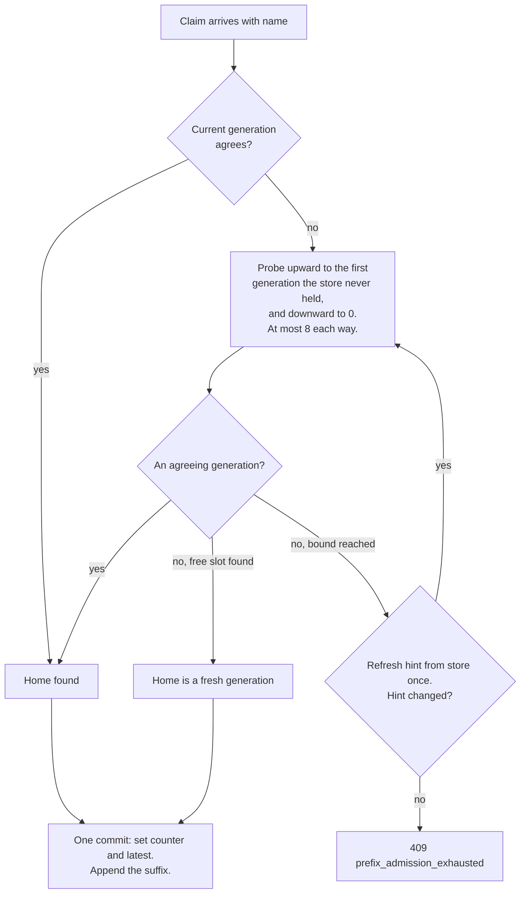

# Sessions and the event log

This chapter describes how Roundhouse stores a conversation. It covers the event log of each session, the projections read from it, and the lease that keeps one writer. It also covers how a client's resent history maps onto a session, and how Roundhouse detects a retry.

## One log per session

Each session has one append-only event log. Each event has a sequence number, `seq`, that increases by one per event. The log is the only durable record of the session.

One structure serves three needs that are otherwise separate:

- **Stream resumption.** A client that lost a stream reopens it after the last `seq` it saw. The native surface takes `?starting_after=N` or a `Last-Event-ID` header. The query parameter wins.
- **Reconnect replay.** A new stream replays the log from any point, then follows new events.
- **Audit.** Each routing decision is an event in the same log, next to the items it routed.

The event kinds are:

| Event | Records |
|---|---|
| `SessionCreated` | The principal, the profile, and the validation arm. |
| `TurnStarted` | A new turn, with its turn id. |
| `ItemAppended` | One conversation item, from the client or from a response. |
| `Routed` | One routing decision for one dispatch. |
| `OutputTextDelta` | A part of the streamed output. |
| `ResponseCompleted`, `ResponseIncomplete` | How the turn ended. |
| `TurnDeduplicated` | A retry that replayed an earlier result. |
| `SideCallCompleted`, `SideCallAbandoned` | A judge call beside the turn. |
| `ValidationDecided` | A validate verdict. See [Validate and steer](validate-steer.md). |
| `ClassificationRequested`, `ClassificationRecorded`, `ClassificationSettlementRepaired` | Background turn classification. |
| `LearningApplied` | A routing-learner update. See [The routing learner](routing-learner.md). |
| `Error` | A failure after the turn was admitted. |

**`SessionCreated` carries attribution.** The engine writes it when a turn opens a session whose log is empty. At that point the engine already holds the lease, so the write has no race, and a log is empty exactly once. Replay starts at `seq` 0, so every fold sees the principal before any other event. Attribution therefore needs no side table and no secondary index. A log with no principal folds under the `Unattributed` key, which is shown separately and never merged.

**An emitted item is an `ItemAppended`.** An item that a response produced carries that response's `response_id`. An input item carries none. `Session::complete_with_item` commits the item and `ResponseCompleted` in one atomic append. A separate event kind for emitted items was rejected. Three readers rebuild the conversation from the log: the prefix comparison, `SessionState::apply`, and `ContextAssembler::rehydrate`. A second kind gives each reader two sources, and the first reader that forgets one forks every affected session without a message.

**Every client block is a log item.** `ItemContent` includes `Thinking` with its `signature`, `RedactedThinking`, and `Opaque`. Resent history, with its thinking blocks, therefore round-trips byte for byte. The signature is kept because a provider refuses resent thinking whose signature is missing or changed.

**Routing evidence is boxed.** `DecisionRecord.selection` is an `Option<Box<SelectionSnapshot>>`, so events without routing evidence stay small. A `size_of` probe measured `SessionEvent` at 360 bytes with the box and 728 bytes without it. The test `event_size.rs` guards the relation, not the byte counts.

## Projections, not collections

Conversation items and the routing ledger are projections of the log. They are not stored separately. So there is exactly one write path, and the log and the state read from it cannot disagree after a crash. A backend only has to supply an append-only log and a lease. `crates/roundhouse-core/src/store.rs` states this rule.

State in Roundhouse falls into three classes:

| Class | Examples | After a restart |
|---|---|---|
| Derivable from the request | Conversation content, because agents resend full history | The next request carries it again. |
| Derivable from the log | `SessionState`, the cache-ledger seed, the metrics fold, the SSE follower | Replay the log through the same fold. A test proves the replay gives the same result. |
| Known only by having watched | The latest conversation per key, call and thread bindings, MCP overlays, intents, outcomes | Lost from memory. With Redis, the bindings are shared. See [Correlation maps](#correlation-maps). |

Committed spend is a separate case, by design. `committed_usd` is an enforcement counter in the spend ledger. `measured_usd` is folded from the logs. The two have different names and are never added together. See [Cost and savings](cost-and-savings.md).

A failure of the third class gives a refusal or a new derivation. It never serves a wrong session without a message.

**Why the log is required.** A proxy with auth, routing, and metering but no durable log keeps some promises and loses others:

- It keeps auth and tenancy, the routing decision without cache warmth, fair use, budget admission, and pass-through auth.
- It degrades to a guess on prefix admission, routing warmth, idempotent retry, the dashboard, and MCP call correlation. Each of these compares a claim against what was stored.
- It loses replay and audit, exact settlement, drift reconciliation, and steering as a log item. The Relay exports come from a cold replay of the finished session log. Settlement is driven from the last settlement event and re-driven when the session opens next.

**The learning index.** The store also keeps a durable index of sessions with undelivered learning entries. An append that carries a learning entry marks its session in the same atomic step. The engine clears the mark after the learner store confirms delivery. A recovery task reads the index for idle sessions and delivers them without the engine.

## One writer: lease and fencing

Every append needs a `Lease`. A lease has a node id, an expiry, and a `fencing_token` that the store mints on each acquisition. The token fences every handle from an earlier tenure.

An owner that stalled, lost its network, or died and came back fails its next append. It does not write behind its successor. This is the only barrier between a failover and a split-brain log.

Acknowledgement and requeue of the learning index check log sequence numbers, not the lease. Recovery can therefore run without owning the writer lease.

In Redis the lease is a `PX` key on the Redis clock, and a Lua script fences each append. See [Session store contract](../development/store-contract.md).

## Incremental tokenization

Routing on cache locality needs the prompt's block hashes before dispatch. A full recompute each turn costs O(context) per turn and O(context × turns) per session. That is more work than the routing decision can save.

The conversation is append-only. Dynamo computes block hashes per fixed-size block from tokens alone. So Roundhouse hashes only the blocks that each turn completes. The test `incremental_hashing_matches_a_full_recompute` compares the result against a full recompute with Dynamo's own hash functions.

## Naming a conversation

A client sends its whole history on each request. Roundhouse first finds which stored conversation the request continues. The name comes from the request, and each surface has its own rules. The derivation is pure code in `crates/roundhouse-sequence-id`. There is one entry point per client, because the two derivations share no rule.

Every name is qualified inside the caller's namespace (`ControlPlane::qualify`). Two principals with the same name never share a session.

### Responses surface (Codex)

The surface binds a conversation to the first of these that is present:

1. The `thread-id` header.
2. The `session-id` header.
3. The `prompt_cache_key` body field.

`thread-id` is first because Codex sends the root thread's `session-id` on every sub-agent. Its default `prompt_cache_key` equals the `session-id`. Both therefore name the whole agent family, not one KV lineage. A key from them interleaves sibling agents on one label, and admission then forks a generation on every turn.

The surface reads `session-id`, `thread-id`, and `x-codex-window-id` strictly, in that order. A blank or non-ASCII value is refused with 422: "`{header}` must be a non-empty ASCII header". Only after all three pass can a request be refused as unnamed: "a `thread-id`, `session-id`, or `prompt_cache_key` is required to name the conversation". `x-codex-window-id` names nothing, but a bad value still refuses the request.

Header values are kept as sent, without trimming, because a trimmed name is a different conversation's key. A `prompt_cache_key` of only whitespace still counts as a name. An empty one is skipped.

A request with no name is refused. A content hash cannot identify a conversation: two different agents can send the same first message.

### Messages surface (Claude Code)

The surface takes the name from the first of these that is present:

1. The `x-claude-code-session-id` header.
2. The session id inside `metadata.user_id`, in either of its two shapes.
3. The whole `metadata.user_id` string, when neither shape parses. An unknown name is still a name, and discarding it loses a warm prefix.

Each value is trimmed, and a blank header counts as absent. A whitespace difference between two turns otherwise binds one conversation to two sessions.

The label is `anthropic_messages/{session}`, or `anthropic_messages/{session}/agent/{agent-id}` when `x-claude-code-agent-id` is present.

- **The dialect segment** keeps Messages names apart from Responses names in one principal's namespace. Without it, two clients that choose the same string fork each other on alternate turns.
- **The agent segment** separates a Task-tool sub-agent from its parent. The sub-agent runs in the parent's process with the parent's session id. Two agents on one log diverge and fork on every turn. With the segment they are sibling conversations, and the parent keeps its name.
- **No `#` in a label**, because generations are spelled `{key}#g{n}`. A client-chosen name that can make that shape can address another conversation's generation.

A request with no name gets a new session named `anonymous-{pid}-{ms}-{counter}`. The pid separates two servers on one store. The millisecond separates two runs of one process. The counter separates two requests in one millisecond. A name derived from content was rejected, because two anonymous callers with the same body then share one log. A bare `curl` is served, not refused.

What Claude Code sends, as read from the client:

| Version | `x-claude-code-session-id` | `metadata.user_id` shape |
|---|---|---|
| 2.1.42 | absent | `user_<installHex32>_account_<accountUuid>_session_<sessionUuid>` |
| 2.1.247, 2.1.257, 2.1.272 | present on every inference request | a JSON object string: `{"device_id":"<64 hex>","account_uuid":"<uuid or empty>","session_id":"<uuid>"}` |

The header equals the session id inside `metadata.user_id`. It stays the same across `--continue` and `--resume`. `/clear` mints a new one. An in-process sub-agent shares its parent's id and adds `x-claude-code-agent-id`. A reader that only splits on `_session_` cannot parse the newer shape. This wire has no `prompt_cache_key` and no `session-id` or `thread-id` header (2.1.272 capture).

## Prefix admission

The client resends its history. Roundhouse compares the resent history, the claim, with the stored log and admits only the new suffix.

Two items agree when role and content agree. For a tool call, `call_id`, name, and arguments must agree. The tool-call `namespace` has its own rule: a stored `None` agrees with any claimed value, and a stored `Some` must match exactly.

- The rule is not blind to the namespace. A client that changes which server a tool name came from has made a different call, and the conversation forks.
- The rule is not symmetric. A conversation stored before the client sent a namespace continues, and does not fork on its next request.

The comparison is a `match`, so a new item kind compares structurally by default. A false agreement admits a claim that is not the stored conversation, without a message. A false disagreement only forks, which is visible.

### Generations

A claim that disagrees with the stored history is a history rewrite. It starts a new generation of the same name. Generation 0 is the qualified name itself. Later generations are `{name}#g{n}`.

Admission finds a claim's home before it commits anything:

- The current generation is probed first, so the common case costs one read.
- Existence is asked through `last_seq`, so a probe writes nothing.
- An empty generation is a home only if no other writer holds its lease. An empty, unleased generation is what a client that hung up leaves behind.
- Among agreeing generations, admission prefers the one with the longest stored history. A tie goes to the lower generation.
- Nothing is committed until the home is known. A refusal changes nothing, and a verbatim retry is refused the same way.
- The refusal is HTTP 409 with code `prefix_admission_exhausted`. Its detail counts disagreeing and busy generations separately. It is a conflict, not an internal error.
- The node keeps a memo of the last generation per name, capped at 4,096 entries. The memo is only where a search starts, never the answer.

**Restart forks nothing.** A restart empties the node-local memo. A naive admission then re-derives generation 0. A client whose history already forked to `#g1` disagrees with generation 0. Admission then forks to `#g1` on the premise that a fresh generation is empty. But `#g1` already holds that history, so the result is a duplicated prefix. Probing before the commit removes this hazard. The cost is one extra read of the generation that the walk passes.

Both surfaces share this code.

### System messages in history

Claude Code 2.1.251 and later send `role: "system"` messages inside `messages` on every request. A surface that refuses a system role there refuses the whole client line.

The leading run of system items is turn configuration: the date, the working directory, the branch, the active betas. The client rebuilds it on each run, so admission compares it loosely, as the `Developer` role. A system message after that run is conversation history and is compared strictly.

The same interior message arrives as a one-block list on the first turn and as a bare string on a `--continue` resend. The text is byte-identical. So canonicalization ignores the container shape. Otherwise every session forks at that item on its second turn.

## Turn identity and retries

Neither client sends an idempotency key on inference:

- A Codex retry rebuilds the request from the same prompt and metadata, so its bytes are identical. Its only per-attempt marker, `x-codex-inference-call-id`, is a new UUID per attempt, and Codex sends it only when rollout tracing is on (Codex at `6344a65`).
- Claude Code's only retry signal is `x-stainless-retry-count`, the SDK attempt counter (Claude Code 2.1.257).

So Roundhouse detects a retry by content. The turn id is `turn_id_for`: FNV-1a over `Item::render` of each canonical item in the claim, formatted as `turn_{hash:016x}`. Each render starts with `<|role|>`, so renders are self-delimiting. The Messages surface uses the same function, so the two dialects agree on a conversation's identity.

When a turn id matches a completed turn, the engine replays the stored result. It does not generate and bill a second answer. A claim shorter than the stored log is also a retry. This needs the stored log. A stateless proxy re-dispatches and bills again.

Anything added to a render changes the turn id of every conversation with that item kind. A changed turn id makes an in-flight retry miss its completed response. For this reason:

- `Thinking::signature` is in the render. Without it, two conversations that differ only by signature hash to one turn id.
- A tool call's `namespace` is not in the render. `call_id` already separates any two calls in one conversation.

## The stored tool-call namespace

`ItemContent::ToolCall` has an optional `namespace` field. A record written without the field deserializes unchanged. An older build that reads a newer record drops the field and sees a plain call.

- The Responses surface sets it from Codex's own `namespace` field.
- The fleet's Responses decoder sets it from an upstream model. The engine stores a decoded namespace only on Responses sessions. On a Messages session the value has no wire field to return through. With the admission rule, it also forks the session on every tool turn.
- The Messages surface sets nothing. Claude Code's flat name, for example `mcp__roundhouse__<tool>`, is stored whole.

A stored `None` means "the client did not send one". It does not mean "the tool has no server". The admission rule is correct only under this reading. The outbound Responses projection sends the stored namespace again. The Relay exporters drop it, because neither Relay format has a field for it.

## Context signals and compaction

The Responses surface returns a response header, `x-roundhouse-context-signal`. The server remembers the last prefix fingerprint and window id for each name, on this node only. It reports the first match in this order:

1. `window_changed`: the previous and current requests both carry an `x-codex-window-id`, and the values differ.
2. `prefix_changed`: the prefix fingerprint changed.
3. `history_rewritten`: admission started a new generation.
4. `prefix_unchanged`
5. `first_seen`

The Messages surface does not compute the signal. The observations reset on restart. Structured logs report the signal without prompt content.

These are context observations, not proof of a compaction. What does establish a compaction, from the client side:

- A Codex `x-codex-turn-metadata` with `request_kind: "compaction"` and a `compaction` object.
- A call to `/responses/compact`, an opaque compaction input item, or a Codex local transcript checkpoint.
- A Claude Messages `compaction` content block, or `stop_reason: "compaction"` when `pause_after_compaction: true` is set. Without the pause, Anthropic can compact and continue.

A window change alone is not proof. In Codex at `6344a65`, `x-codex-window-id` is `thread_id:window_number`, and the number advances only after a successful compaction. But the value also changes on a new thread, a fork, a restart, or a client version change. The prefix fingerprint is neither necessary nor sufficient. A compaction can keep the instructions and the first user item. An edit to the instructions changes the fingerprint with no compaction.

A new generation is not proof either. Both clients summarize with the old history plus one appended user message. Admission therefore lands the summarization request on the old generation as an ordinary turn. The next request forks in both outcomes. After a successful compaction the claim drops history near the start. After a failed one the client resends the old history without the summarization message, so the claim diverges at that message. This analysis is derived from client source, not from a measured run. `bind_prefix` reports only whether history was rewritten, not where.

The Responses surface refuses opaque compaction input items and does not serve `/v1/responses/compact`.

**The forwarded cache key.** Roundhouse forwards `session-id`, `thread-id`, and `prompt_cache_key` to an OpenAI Responses provider. The cache key is independent of the internal generation. If the client sends no `prompt_cache_key`, Roundhouse sends a 64-character SHA-256 fingerprint. Its input is the canonical system and developer items before the first user item, plus that user item, under the domain `roundhouse-prefix-v1`. The fingerprint hashes the serde form of each item, which includes a tool call's namespace. So two claims that admission joins can get two different forwarded cache keys.

## Outbound requests render the log

Every outbound request is a render of the Roundhouse log. No path forwards the client's message array. So a switch to another provider never sends state that the new provider rejects. `ItemAppended` and `SessionCreated` can build a request for any destination.

The render is deterministic. The items are an ordered list, `Item::render` is pure, and `serde_json`'s `preserve_order` is off, so opaque JSON has one key order. Nothing that varies per request enters the prefix. Steer text and handoff notes go at the tail.

Limit: the conversation goes to Anthropic as one `role: "user"` message whose content blocks split at item boundaries. Tool calls, tool results, and thinking signatures therefore travel as text. The effect on answer quality has not been measured.

## Correlation maps

An MCP control call must find the conversation it belongs to. Roundhouse keeps three maps for this. With Redis they are shared by every node. Without Redis they are per process. See [MCP control surface](mcp.md) for how the surface uses them.

The keys below use the default namespace, `rh`. `ROUNDHOUSE_REDIS_NAMESPACE` changes it.

| Redis key | Maps | Expiry |
|---|---|---|
| `rh:v1:corr:gen:{<namespaced cache key>}` | a name to the generation its last turn committed to | none, because an expired generation resets the fork counter and points a live conversation at a log it forked away from |
| `rh:v1:corr:call:{<principal>}:<tool_use_id>` | a tool-use id to its session | 6 hours |
| `rh:v1:corr:thread:{<principal>}:<thread_id>` | a thread id to its session | 7 days |

- **One key per binding**, not one hash per principal. A hash field cannot expire, so a hash needs a sweeper to enforce the staleness bound. `PEXPIRE` enforces it here.
- **Values are tagged `s:<session id>`.** A session id is text that the client spells. A value from a foreign writer fails the read loudly.
- **`Ambiguous` is a stored state, not a deletion.** An id that two sessions claim is remembered as ambiguous. A deleted id reads as never-seen, and the next binding of it looks like a first one.
- **Calls never rebind. Threads rebind.** A thread is the session that its own latest turn decided, and every fork mints a new session for the same thread.
- **Partitioned by principal.** A local backend that numbers calls `call_0`, `call_1` gives the same string to every conversation.
- **The turn path and the reader path fail differently.** On a store failure, a turn warns and continues. For a turn, the binding is only a hint that a probe checks. A reader refuses, because a `None` falls through to "latest", which is a plausible answer about the wrong conversation.
- **A name that no node bound stays `None`**, never generation 0. Generation 0 is a real session id once any node mints it.

NeMo Relay 0.8.2 correlates a call without a log. It uses an explicit client session id if one is present. Else it uses the one session active in the last 30 seconds. When no session is active, it uses a synthetic root. When several are active, it uses a new isolated session. Its hook-to-call match is a best-effort score. Roundhouse and Relay read the same `x-claude-code-session-id` header. Roundhouse binds exact ids to the session that emitted them and refuses a name it never bound. Relay scores and isolates.

## Sequence identity primitives

`crates/roundhouse-core/src/item/chain.rs` and `crates/roundhouse-sequence-id` contain keyed identity functions for a prefix-anchored routing key. No server path calls them. The server does not send `x-dynamo-session-id`. The embedded selection call carries Roundhouse's own `SessionId`.

- **The prefix chain.** One SHA-256 link per canonical item: `d_i = SHA-256("rh-item-v1\0" || u64be(len(r_i)) || r_i)` with `r_i = items[i].render()`, `c_0 = SHA-256("rh-chain-v1\0" || d_0)`, and `c_i = SHA-256(c_{i-1} || d_i)`. The input is the render, not the serde form. Admission's `same_item` implies equal renders, so the chain never splits two claims that admission joins. The test `same_item_agreement_implies_equal_item_digests` pins this.
- **Links stay in memory.** A link is an unkeyed digest of conversation content. A holder can confirm a guess at the prefix by hashing the guess. So `ChainValue` has no `Serialize`, no `Display`, and no hex form, and compile-fail doctests enforce this. Only outputs of HMAC keyed per principal can leave process memory.
- **Keyed values.** Tip keys `L_i` are HMAC-SHA256 values keyed per principal over the tools digest and the chain link. The sequence digest `S` is keyed over the namespace, the surface, the label, and the generation. Each variable field has a u32 length prefix, because a label from `metadata.user_id` can contain any byte. Each value has its own domain prefix, so no two kinds can be equal.
- **Client signals.** The crate reads client signals only as exact literals quoted from client source. A near match is no match. A changed client string therefore fails toward "no signal", never toward a guessed compaction.
