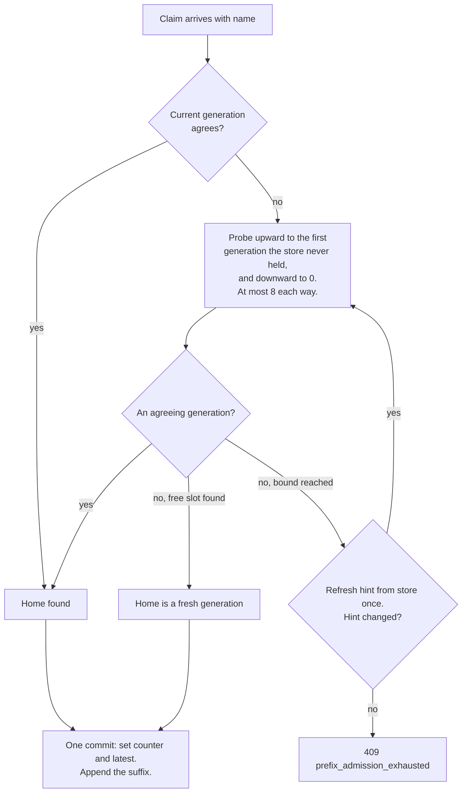

# Sessions and the event log

This chapter describes how Roundhouse stores a conversation. It covers the event log of each session and the lease that keeps one writer. It also covers how a client's resent history maps onto a session, and how a retry is detected.

## One log per session

Each session has one append-only event log. Each event has a sequence number, `seq`, that grows by one. The log is the only durable record of the session. One structure serves three needs:

- **Stream resumption.** A client reopens a stream after the last `seq` it saw. The native surface takes `?starting_after=N` or a `Last-Event-ID` header. The query parameter wins.
- **Reconnect replay.** A new stream replays the log from any point, then follows new events.
- **Audit.** The log records routing decisions, admitted input deltas, and response output. Its conversation projection can differ from a complete client request.

| Event | Records |
|---|---|
| `SessionCreated` | The principal, the model policy, and the validation arm. |
| `TurnStarted` | A new turn, with its turn id. |
| `ItemAppended` | One conversation item, from the client or from a response. |
| `Routed` | One routing decision for one dispatch. |
| `OutputTextDelta` | A part of the streamed output. |
| `ResponseCompleted`, `ResponseIncomplete` | How the turn ended. |
| `TurnDeduplicated` | A retry that replayed an earlier result. |
| `SideCallCompleted`, `SideCallAbandoned`, `ValidationDecided` | A judge call beside the turn, and its verdict. See [Validate and steer](validate-steer.md). |
| `ClassificationRequested`, `ClassificationRecorded`, `ClassificationSettlementRepaired` | Background turn classification. |
| `LearningApplied` | A routing-learner update. See [The routing learner](routing-learner.md). |
| `Error` | A failure after the turn was admitted. |

- **`SessionCreated` carries attribution.** The engine writes it when a turn opens a session with an empty log. It already holds the lease, so the write cannot race, and a log is empty exactly once. Replay starts at `seq` 0, so every fold sees the principal first, with no side table. A log with no principal folds under the `Unattributed` key, never merged with a project.
- **An emitted item is an `ItemAppended`.** It carries the `response_id` of the response that produced it. `Session::complete_with_item` commits the item and `ResponseCompleted` in one atomic append. A separate event kind was rejected: three readers rebuild the conversation (the prefix comparison, `SessionState::apply`, `ContextAssembler::rehydrate`), and a second kind gives each two sources. The first reader that forgets one forks every affected session silently.
- **New client and response blocks use `ItemAppended`**, including `Thinking` with its `signature`, `RedactedThinking`, and `Opaque`. A provider refuses resent thinking whose signature is missing or changed.
- **Routing evidence is boxed.** `DecisionRecord.selection` is an `Option<Box<SelectionSnapshot>>`. A `size_of` probe measured `SessionEvent` at 360 bytes with the box and 728 bytes without it.

## Projections, not collections

The native session API reconstructs conversation content from the log. Complete Messages and Responses requests instead supply the history for their own turn. Operational projections still come from the log. A backend supplies that log and a lease. State falls into three classes:

| Class | Examples | After a restart |
|---|---|---|
| Derivable from the request | Conversation content, because agents resend full history | The next request carries it again. |
| Derivable from the log | `SessionState`, the cache-ledger seed, the metrics fold, the SSE follower | Replay the log through the same fold. |
| Known only by having watched | The latest conversation per key, MCP overlays, intents, outcomes | Lost from memory. The call and thread bindings are shared with Redis. See [Correlation maps](#correlation-maps). |

A failure of the third class gives a refusal or a new derivation, never a wrong session served without a message. Committed spend is a separate counter, not a projection. See [Cost and savings](cost-and-savings.md).

Without the durable log, prefix admission, idempotent retry, and MCP call correlation degrade to guesses, because each compares a claim against what was stored. Replay, audit, and exact settlement are lost.

## One writer: lease and fencing

Every append needs a `Lease`: a node id, an expiry, and a `fencing_token` that the store mints on each acquisition. The token fences every handle from an earlier tenure. An owner that stalled or died and came back fails its next append and cannot write behind its successor. This is the only barrier between a failover and a split-brain log. In Redis the lease is a `PX` key on the Redis clock, and a Lua script fences each append. See [Session store contract](../development/store-contract.md).

Within one engine, a session lock serializes active and waiting turns before lease acquisition. The last caller removes this lock, including on task cancellation. Idle sessions retain no engine lock.

## Complete and reference-only history

Messages and Responses requests are authoritative. Dispatch, routing signals, objective selection, and validation use the supplied conversation. Omitted instructions and interrupted output stay out of the turn. Admission keeps the complete request intact and copies only the selected log delta, after comparing candidate generations.

The native session API is the explicit reference-only path. It accepts new input and reconstructs the earlier conversation from the log. Completed-turn retries still replay their stored result.

The log still retains content. It can contain configuration or interrupted output that a complete request omitted. If the supplied history differs, the validator withholds the stored review section and records an unknown learning label. It does not judge omitted content.

Cache predictions require a conversation that agrees with the log. Otherwise, routing uses a cold estimate, omits remembered cache markers, and records `cache_context_unverified`. Replay discards those predictions too. A replacement configuration also clears previous predictions. Provider-reported cache usage remains unchanged. A request that differs from the log can therefore reuse an upstream cache even though Roundhouse predicts no reuse. This includes histories admitted through namespace wildcard matching or JSON numeric equivalence; admission agreement is weaker than the content check used here. Namespace differences alone do not change the current prompt rendering, so this check can discard a usable cache prediction. After interrupted output is omitted, that output remains in the log; predictions stay cold for subsequent requests that continue to omit it. Restoring warm estimates in this case requires tracking the actual dispatched context separately from the log.

The retained log fold still treats interior Responses `developer` items as configuration. Complete requests preserve those items in the dispatched prompt, but admission can fork such a history into a new generation. The ignored `an_interior_developer_message_keeps_its_generation` test records this unresolved case; it does not enforce a fix.

These changes do not bound retained logs, session counts, or concurrent request memory. The two-hour idle policy and capacity eviction are not implemented.

## Tokenization

The engine rebuilds the context assembler for each turn. The assembler extends token blocks within that turn, but the server still tokenizes the complete conversation. The default `ByteTokenizer` encodes bytes rather than model tokens. This is not yet a tokenizer-free forwarding path.

## Naming a conversation

Roundhouse first finds which stored conversation a request continues. The name comes from the request, and each surface has its own rules, in pure code at `crates/roundhouse-sequence-id`. Every name is qualified inside the caller's namespace (`ControlPlane::qualify`), so two principals with the same name never share a session. In open mode there is no namespace.

### Responses surface (Codex)

The surface binds a conversation to the first of these that is present: the `thread-id` header, the `session-id` header, the `prompt_cache_key` body field.

`thread-id` is first because Codex sends the root thread's `session-id` on every sub-agent, and its default `prompt_cache_key` equals that `session-id`. Both name the whole agent family, not one KV lineage. Sibling agents on one label would fork a generation on every turn.

The surface reads `session-id`, `thread-id`, and `x-codex-window-id` strictly, in that order. A blank or non-ASCII value is refused with 422, "`{header}` must be a non-empty ASCII header", even for `x-codex-window-id`, which names nothing. Values are kept as sent, without trimming, because a trimmed name is another conversation's key. A request with no name is refused with 422, "a `thread-id`, `session-id`, or `prompt_cache_key` is required to name the conversation". A content hash cannot stand in, because two agents can send the same first message.

### Messages surface (Claude Code)

The surface takes the name from the first of these that is present:

1. The `x-claude-code-session-id` header.
2. The session id inside `metadata.user_id`, in either shape.
3. The whole `metadata.user_id` string, when neither shape parses. An unknown name is still a name, and discarding it loses a warm prefix.

Each value is trimmed, and a blank one counts as absent. A whitespace difference therefore cannot bind one conversation to two sessions.

Claude Code 2.1.42 sends no session header, and its `metadata.user_id` is `user_<installHex32>_account_<accountUuid>_session_<sessionUuid>`. Versions 2.1.247 to 2.1.272 send the header and a JSON `metadata.user_id`. See [Hook up Claude Code](../guides/claude-code.md).

The label is `anthropic_messages/{session}`, or `anthropic_messages/{session}/agent/{agent-id}` when `x-claude-code-agent-id` is present.

- **The dialect segment** keeps Messages names apart from Responses names. Without it, two clients that choose one string fork each other on alternate turns.
- **The agent segment** separates a Task-tool sub-agent from its parent. The sub-agent shares the parent's process and session id, so two agents on one log would fork on every turn.
- **The separator is `/agent/`, not `#`.** Generations are spelled `{key}#g{n}`, and a label with `#` could address another conversation's generation.

A request with no name gets a new session named `anonymous-{pid}-{ms}-{counter}`, unique across servers, runs, and requests. A name derived from content was rejected, because two anonymous callers with one body would share a log. A bare `curl` is served, not refused.

## Prefix admission

Roundhouse compares the client's claim, its resent history, with the stored log and admits only the new suffix. Two items agree when role and content agree. For a tool call, `call_id`, name, and arguments must agree. The tool-call `namespace` has its own rule: a stored `None` agrees with any claimed value, and a stored `Some` must match exactly. The rule is not blind, because a client that changes which server a tool name came from has made a different call. It is not symmetric, because a conversation stored before the client sent a namespace must continue, not fork.

Admission hashes each item into a fixed-size fingerprint. It keeps a separate namespace digest to preserve the asymmetric matching rule. Response stamps affect provisional-item filtering, but not content matching. Each item kind has an explicit encoding; a new kind requires an encoding before the code compiles.

The incoming claim is hashed once per admission search. Stored items are hashed as event batches arrive, without a second retained copy of their content. This reduces admission's temporary content retention. It does not bound the event log or the number of retained session records.

### Generations

A claim that disagrees with the stored history is a history rewrite. It starts a new generation of the same name. Generation 0 is the qualified name. Later generations are `{name}#g{n}`. Admission finds a claim's home before it commits anything:

- The current generation wins if it agrees, so the common case costs one read.
- A probe writes nothing. An empty generation is a home only if no other writer holds its lease.
- Among agreeing generations, admission prefers the longest stored history. A tie goes to the lower generation.
- A refusal commits nothing. The response is HTTP 409 `prefix_admission_exhausted`, and `detail` counts disagreeing and busy generations separately.
- Each node memoizes the last generation per name, capped at 4,096 entries. The memo is where a search starts, never the answer.

**A restart forks nothing.** A restart empties the memo, so the counter starts at generation 0. A client whose history already forked to `#g1` disagrees with generation 0, and opening a fresh generation would duplicate the prefix that `#g1` holds. Probing before the commit walks up to `#g1` and continues it, at the cost of one extra read.

### System messages in history

Claude Code 2.1.251 and later send `role: "system"` messages inside `messages` on every request. A surface that refuses them refuses the whole client line.

The leading run of system items is turn configuration: the date, the working directory, the branch, the active betas. It is canonicalized to the `Developer` role. The client rebuilds it on each run, so a changed run never forks the session. The new run replaces the stored one at the head, and the log keeps both. A claim with no configuration does not restore the stored run into its turn. The retained log still contains that run.

A system message after the leading run is history and is compared strictly. The same interior message arrives as a one-block list on the first turn and as a bare string on a `--continue` resend. Canonicalization ignores the container shape.

## Turn identity and retries

Neither client sends an idempotency key on inference. A Codex retry rebuilds the same bytes. Its only per-attempt marker, `x-codex-inference-call-id`, is a new UUID each time and is sent only when rollout tracing is on (Codex at `6344a65`). Claude Code's only retry signal is the SDK counter `x-stainless-retry-count` (2.1.257).

So Roundhouse detects a retry by content. The turn id is FNV-1a over `Item::render` of each canonical item in the claim, formatted `turn_{hash:016x}`. Each render starts with `<|role|>`, so renders are self-delimiting. FNV-1a is written out because the id must be stable across releases and nodes. Both surfaces use the same function.

When a turn id matches a completed turn, the engine replays the stored result and does not bill a second answer. A claim shorter than the stored log is also a retry. A stateless proxy re-dispatches and bills again.

Anything added to a render changes the turn id of every conversation with that item kind, so an in-flight retry would miss its response. `Thinking::signature` is in the render, because otherwise two conversations that differ only by signature share a turn id. A tool call's `namespace` is not, because `call_id` already separates two calls.

## The stored tool-call namespace

A stored `None` namespace means "the client did not send one", not "the tool has no server". The admission rule is correct only under this reading.

The Responses surface sets the namespace from Codex's own field, and the fleet's Responses decoder sets it from an upstream model. The engine stores a decoded namespace only on Responses sessions. A Messages session has no wire field to return it through, so it would fork on every tool turn. The Messages surface sets nothing, and Claude Code's flat name, for example `mcp__roundhouse__<tool>`, is stored whole. The Relay exporters drop the namespace, because neither Relay format has a field for it.

## Context signals and compaction

The Responses surface returns the header `x-roundhouse-context-signal`. The server remembers the last prefix fingerprint and window id per name, on this node only. The header reports the first match, in this order:

1. `window_changed`: both requests carry `x-codex-window-id`, and the values differ.
2. `prefix_changed`: the prefix fingerprint changed.
3. `history_rewritten`: admission started a new generation.
4. `prefix_unchanged`.
5. `first_seen`.

The Messages surface does not compute the signal.

These are observations, not proof of a compaction. In Codex at `6344a65`, `x-codex-window-id` is `thread_id:window_number`. The number advances only after a successful compaction, but the value also changes on a new thread, a fork, or a restart. An instruction edit changes the fingerprint with no compaction.

A new generation is not proof either. Both clients summarize with the old history plus one user message, so the next request forks whether the compaction worked or not. This comes from client source, not from a measured run.

Only the client's own marker establishes a compaction: a Codex `request_kind: "compaction"`, or a Claude Messages `compaction` block. A Claude Messages response also reports `stop_reason: "compaction"` when `pause_after_compaction: true` is set. Without the pause, Anthropic compacts and continues. The Responses surface refuses opaque compaction input items and does not serve `/v1/responses/compact`.

**The forwarded cache key.** Roundhouse forwards `session-id`, `thread-id`, and `prompt_cache_key` to an OpenAI Responses provider, independent of the internal generation. With no client key, it sends a 64-character SHA-256. The input is the canonical system and developer items before the first user item, plus that item (domain `roundhouse-prefix-v1`). A changed configuration run joins the same session but gets a new key. See [Hook up Codex](../guides/codex.md).

## Outbound requests render the log

Every outbound request is a render of the Roundhouse log. No path forwards the client's message array, so a switch to another provider never sends state that the new provider rejects. The render is deterministic. `Item::render` is pure, and `serde_json`'s `preserve_order` is off, so opaque JSON has one key order even behind a chained NeMo Relay that sorts keys. Steer text and handoff notes go at the tail.

Limit: the conversation goes to Anthropic as one `role: "user"` message. Its content blocks split at item boundaries, so tool calls, tool results, and thinking signatures travel as text. The effect on answer quality has not been measured.

## Correlation maps

An MCP control call must find the conversation it belongs to. Three maps serve this: a name to its generation, a tool-use id to its session, and a thread id to its session. With Redis every node shares them. Without Redis they are per process. Key layout and expiry are in [Deploy with Redis](../operations/redis.md#correlation-maps), and the lookup order is in [MCP control surface](mcp.md).

- **`Ambiguous` is a stored state.** An id that two sessions claim is remembered as ambiguous. A deleted id would read as never seen, and its next binding would look like a first one.
- **Calls never rebind. Threads rebind.** Every fork mints a new session for the same thread.
- **Bindings are partitioned by principal**, because a local backend that numbers calls `call_0`, `call_1` gives one string to every conversation.
- **A turn warns on a store failure and continues**, because its binding is only a hint that a probe checks. **A reader refuses**, because a `None` falls through to "latest", a plausible answer about the wrong conversation.
- **A name that no node bound stays `None`**, never generation 0, which is a real session id once any node mints it.

NeMo Relay 0.8.2 correlates a call without a log. It uses an explicit client session id, else the one session active in the last 30 seconds, else a synthetic root or an isolated session. Roundhouse binds exact ids to the session that emitted them and refuses a name it never bound.

## Sequence identity primitives

`crates/roundhouse-core/src/item/chain.rs` and `crates/roundhouse-sequence-id` hold identity functions for a routing key derived from a prefix. No server path calls them, and the server does not send `x-dynamo-session-id`. The chain hashes `Item::render`; admission compares structural fingerprints. These relations differ for signed floating zero inside opaque JSON: admission accepts either spelling, but the chain distinguishes them. The formulas and the rule that links stay in memory are in [Workspace crates](../development/architecture.md#the-prefix-chain).
