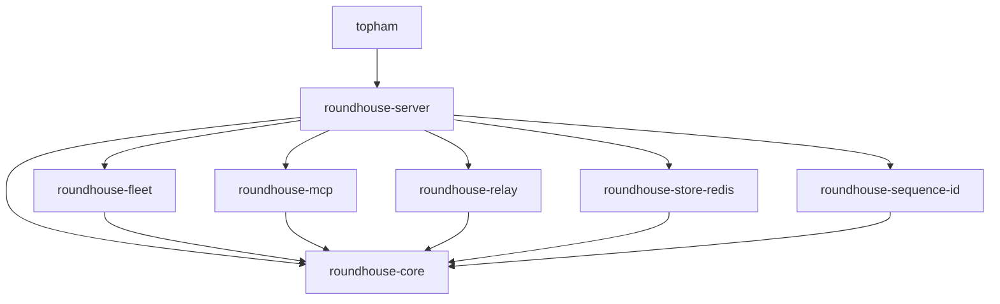

# Workspace crates

This chapter lists the crates in the workspace, the direction of their dependencies, and the crates that hold the session identity code.

## The crates

| Crate | Contents |
|---|---|
| `roundhouse-core` | Session state machine, event log, lease, context assembly, routing vocabulary and policies, the control vocabulary (principals, policy, spend ledger), the validate and steer loop, and the metrics projection |
| `roundhouse-fleet` | The local Dynamo fleet (the embedded selection service) and the frontier providers. It also builds the `import-benchmarks` tool |
| `roundhouse-mcp` | The control surface as an MCP server: eight tools, overlays that only narrow, and one file that knows what JSON-RPC is |
| `roundhouse-relay` | The formats that NeMo Relay publishes (ATOF events, ATIF v1.7 trajectories, `LlmOptimizationSummary`), produced from the same session log |
| `roundhouse-sequence-id` | Session and sequence identity: client detection, conversation labels, client compaction signals, and keyed digests. See [Session identity](#session-identity) |
| `roundhouse-store-redis` | The Redis implementation of every shared family: the session log, the spend ledgers, the fair-use buckets, the correlation maps, the admin directory, and the learner store. The `ROUNDHOUSE_REDIS_URL` variable selects it. Without that variable, all of this state lives in process memory |
| `roundhouse-server` | The turn engine and the surfaces over one log, plus the `roundhouse` binary. See the list below |
| `topham` | The operator entry point. It holds profiles and the `plan`, `launch`, `relay` and `mint` subcommands, and an interactive screen over the first three |

The server crate serves these surfaces over one log:

- Native HTTP and SSE.
- The OpenAI Responses API at `/v1/responses`.
- The Anthropic Messages API at `/v1/messages`.
- The MCP mount at `/mcp`.
- The admin REST plane under `/v1/admin`.
- `/v1/metrics` and its dashboard.
- The three session reads that Relay uses.

The server crate also holds `codex_launch`, `claude_launch` and `relay_handoff`. These produce the configuration that each client needs, and a chained Relay read.

`topham` is the one crate that depends upward on `roundhouse-server`. The `mint` subcommand takes the tenancy arguments (`--project`, `--user`) that a profile does not carry. The `topham` crate reads the generators in the server crate and does not restate them. As a result, `roundhouse-server/src/main.rs` needs no flag parser.

The workspace builds three binaries:

| Binary | Crate | Purpose |
|---|---|---|
| `roundhouse` | `roundhouse-server` | The server. It reads environment variables only |
| `topham` | `topham` | The operator entry point |
| `import-benchmarks` | `roundhouse-fleet` | A generator. It reads OpenRouter's versioned benchmark index and writes a catalog fragment with its provenance. No shipped `roundhouse` binary contains it |

## Dependency graph

The graph shows normal dependencies between workspace crates. Dev-dependencies are left out, because several crates name themselves as a dev-dependency to turn on their `test-support` feature.



Four rules follow from the graph:

- `roundhouse-core` depends on no other workspace crate. It has no HTTP server, no ZMQ and no `reqwest`, so it tests without a network.
- `roundhouse-fleet` owns every transport. Core reaches a provider only through the traits that the fleet implements.
- `roundhouse-mcp` and `roundhouse-relay` depend on core and nothing else of ours. The server mounts a router over each. The server implements the seams that `roundhouse-mcp` declares, such as `ControlReads`.
- `roundhouse-sequence-id` sits beside the server and depends on core only. It has no store, no network, no clock and no environment, and its API has no async. The server passes the deployment secret in as a value.

Core lists `dynamo-kv-router` and `dynamo-tokens` without default features. Only `roundhouse-fleet` turns on `standalone-selection`.

## Feature flags

| Crate | Feature | Effect |
|---|---|---|
| `roundhouse-core` | `test-support` | Exposes `store::contract`, the executable `SessionStore` suite, and `store::doubles`. No production code depends on it |
| `roundhouse-store-redis` | `test-support` | Test helpers for the real-Redis suites |
| `roundhouse-server` | `test-support` | Compiles the `PlaneSource` implementation on `ControlPlane`, a plane that never sees a revocation. A shipped binary must never have it |
| `roundhouse-server` | `e2e-codex`, `e2e-claude`, `e2e-frontier` | Compile the suites that spawn a real client or call a live provider. See [Testing](testing.md) |

Each crate that needs `test-support` in its own integration tests names itself in `dev-dependencies` with the feature on. Integration tests link the library as an outside crate, so `cfg(test)` does not reach them.

## Session identity

The `roundhouse-sequence-id` crate answers one question for each request: which client sent it, and which conversation it belongs to. The code has two parts. One part the server calls today. The other part is library code that no production path calls.

### What the server uses

The server calls the label derivation for both surfaces:

- `messages_label` for the Messages surface.
- `CodexHeaders` and `codex_conversation` for the Responses surface.
- `LabelError`, which the server turns into an HTTP error.

A label names the lineage before the principal qualifies it. A log is stored under its label. A label whose spelling changed would fail no request. It would open a cold session for every live conversation after a deploy. For that reason the label values are pinned byte for byte. See [Testing](testing.md).

Each client has its own entry point, because the two clients share no rung of the derivation. `messages_label(headers, user_id)` cannot fail. `CodexHeaders::read` refuses exactly the three headers that Codex sends.

### Library code that no production path calls

These parts are complete and tested. Nothing in the server calls them. Nothing sends `x-dynamo-session-id`, although a doc comment in `keyed.rs` says the session digest is sent as that header.

- The unkeyed prefix chain in `roundhouse-core/src/item/chain.rs`.
- The keyed digests: tip keys, the sequence digest, the invalidation id, and the anchor.
- Client detection.
- The readers for client compaction signals.

#### The prefix chain

The chain has one link per canonical item. Link `c_i` names items `0..=i` and nothing else. Two histories agree on their first `n` links exactly when they agree on their first `n` renders.

```text
r_i = items[i].render()
d_i = SHA-256("rh-item-v1\0" || u64be(len(r_i)) || r_i)
c_0 = SHA-256("rh-chain-v1\0" || d_0)
c_i = SHA-256(c_{i-1} || d_i)
```

The design has four parts:

- **The input is the render, not the serde form.** The render leaves out the `namespace` of a tool call and the `response_id` stamp. As a result the chain agrees with the `same_item` test in prefix admission. A chain over the serde form would call every stamped assistant item a different lineage. The test `same_item_agreement_implies_equal_item_digests` checks the agreement.
- **The configuration run is in the chain.** A rewritten configuration loses the KV cache after it on every target. Tools are not in the chain. They enter only the keyed tip key.
- **A link cannot be printed or stored.** An unkeyed link lets anyone confirm a guess at a prompt, and two principals with one prompt share every link. `ChainValue` has no `Serialize`, no `Display` and a redacting `Debug`. `compile_fail` doctests enforce this. The per-item digest is not exported.
- **The chain lives in core.** The context assembler extends it from the render that it already computes, and core cannot depend on the identity crate.

#### Keyed digests

Let `K` be the deployment secret. The values are:

```text
t   = SHA-256(tools JSON), or 32 zero bytes when no tools are declared
k_P = HMAC(K, "rh-prefix-scope-v1\0" || ns(P))
L_i = HMAC(k_P, "rh-prefix-tip-v1\0" || t || c_i)[..16]
S   = HMAC(K, "rh-sequence-v1\0" || lp(ns) || lp(surface) || lp(label) || u32be(generation))[..16]
I   = HMAC(K, "rh-invalidation-v1\0" || S_pred || (S_succ or 16 zero bytes))[..16]
```

The design has these rules:

- Every value has its own domain prefix, so no two kinds of value can be equal.
- Tip keys are keyed per principal. No lookup crosses a principal. The store holds nothing that a reader without the secret can test a guessed prompt against.
- A tool change makes a new tip key, as it makes a new provider cache prefix. This under-claims overlap, which is the safe direction.
- Fields are length-prefixed, because a label can come from `metadata.user_id` JSON and can contain a separator. The pairs `("a/b","c")` and `("a","b/c")` must differ.
- `S` is per generation, not per label or per anchor. A fork shares the anchor of its parent, and a label spans generations. An invalidation keyed by either would free live KV cache.
- `Surface::wire_name` returns `"anthropic_messages"`. This string is separate from `MESSAGES_DIALECT_NAMESPACE` on purpose. One is a digest input and the other is a label segment. Tying them together would re-key every sequence if the namespace were renamed.
- Logs carry at most 8 hex characters of a digest (`SequenceDigest::short`).
- `Anchor` and `SequenceDigest` have no serde derive. A `[u8;16]` would serialize as a JSON array of 16 integers, a shape that nobody chose.

The tools digest is `SHA-256(tools.to_string())`. That is sorted-key compact JSON only because `serde_json` has `preserve_order` off across the workspace. A JSON `null` and a missing field both give the zero digest.

#### The anchor

`new_anchor` takes the last tip key of the first dispatched prompt. Only the last tip key commits to the whole prompt. Two lineages share an anchor only when one resent the whole first prompt of the other, which is what a fork is. An earlier tip key would put every session that shares a system prompt into one family.

#### Client detection

`detect_client` returns `Exact { version }` only when canonical item 0 is a `Developer` text item that fully matches this shape:

```text
x-anthropic-billing-header: cc_version=<d>.<d>.<d>.<3 lowercase hex>; cc_entrypoint=<[a-z0-9_-]+>;
```

Any extra field is not a match, so a client change fails toward "no strip". Headers only declare a client:

- For Claude Code, `user-agent: claude-cli/...` or `x-app: cli`.
- For Codex, an `originator` or `user-agent` that starts with `codex_`, or any `x-codex-*` header.
- Declarations that name two different clients cancel to `NoSignal`.

The attribution block is never a label. Its fingerprint has 12 bits, so two unrelated sessions collide at 1 in 4,096 per pair. `without_attribution_block` serves the dispatch projection only. The block stays an ordinary canonical item, so admission and the chain see what the client sent.

The captured fixtures show the effect. Two sessions of one version share 0 chain links, and so do two versions, because item 0 differs. Inside one session, turn 1 and turn 2 share 2 links, because the client rewrote its model-line system block. Turn 2 and turn 3 share all 8 links, because the budget notice is dropped.

#### Compaction signals

The crate reads client compaction signals as exact literals. A near match is no match. When a client changes a sentence, the result is "no signal". The result is never a guessed compaction that frees live KV cache. The readers never fail a request, and each client's headers are read only by that client's reader.

| Client | Signal |
|---|---|
| Codex | The `x-codex-window-id` header, in the form `{thread}:{digits}` |
| Codex | Turn metadata `request_kind: "compaction"` with `compaction.trigger`. This is the primary signal, because a configured `compact_prompt` replaces the summarization prompt |
| Codex | A summary item that starts "Another language model started to solve this problem and produced a summary of its thinking process." and ends "assist with your own analysis:" followed by a newline |
| Codex | The summarization prompt "You are performing a CONTEXT CHECKPOINT COMPACTION." |
| Claude Code | The sentence "This session is being continued from a previous conversation that ran out of context. The summary below covers the earlier portion of the conversation." An `<artifact-content-authored-by-others/>` wrapper can precede it. The wrapper comes from a reading of the 2.1.284 bundle. It was never captured on the wire |
| Claude Code | The summarization request head "CRITICAL: Respond with TEXT ONLY. Do NOT call any tools." |
| Claude Code | The headers `x-claude-code-compaction` and `x-claude-code-context-compacted` (`auto`, `manual`, `reactive`). Claude Code sends them only behind a custom base URL with `CLAUDE_CODE_GATEWAY_HINT_HEADERS=1`. `claude_launch` does not set that variable |
| Any | `x-dynamo-session-final` counts only as the literal `true` |

The Codex literals come from commit `6344a65` (`prompts/templates/compact/summary_prefix.md`, `prompt.md` and `core/src/compact.rs`). The Claude Code literals come from versions 2.1.284 and 2.1.285.

#### Cost of the chain

The measurement ran over the 7 captured Claude Code bodies. Together they hold 52 items, 120,568 rendered bytes and 31,448 TinyLlama tokens. The costs below are per 100 KiB, on the dev profile. The hardware was not recorded.

| Work | Time per 100 KiB |
|---|---|
| Chain over renders | about 83 microseconds |
| Chain over items, render included | 91 to 94 microseconds |
| Tokenization with `tests/data/tinyllama-tokenizer.json` | 33.4 to 34.5 milliseconds |

The chain costs about 0.25% of the tokenization that it runs beside. To reproduce the numbers, run this command:

```bash
timeout 900 cargo test -p roundhouse-server --lib chain_cost -- --ignored --nocapture
```

The test asserts nothing about speed, because a timing assertion is flaky on a loaded machine. It asserts only that the corpus has the claimed size and that the chain agrees with itself.
