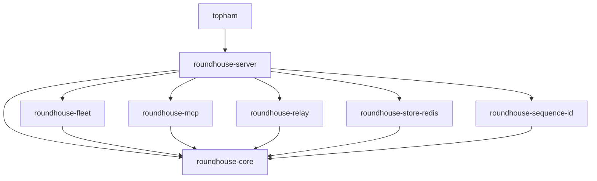

# Workspace crates

This chapter lists the crates in the workspace, the direction of their dependencies, and the code of the session identity crate.

## The crates

| Crate | Contents |
|---|---|
| `roundhouse-core` | Session state machine, event log, lease, context assembly, routing vocabulary and policies, the control vocabulary (principals, policy, spend ledger), the validate and steer loop, and the metrics projection |
| `roundhouse-fleet` | The local Dynamo fleet (the embedded selection service) and the frontier providers |
| `roundhouse-mcp` | The control surface as an MCP server: eight tools, overlays that only narrow, and one file that knows what JSON-RPC is |
| `roundhouse-relay` | The formats that NeMo Relay publishes (ATOF events, ATIF v1.7 trajectories, `LlmOptimizationSummary`), produced from the session log |
| `roundhouse-sequence-id` | Session and sequence identity: conversation labels, client detection, client compaction signals, and keyed digests. See [Session identity](#session-identity) |
| `roundhouse-store-redis` | The Redis implementation of every shared family. `ROUNDHOUSE_REDIS_URL` selects it. See [Deploy with Redis](../operations/redis.md) |
| `roundhouse-server` | The turn engine, the surfaces over one log, and the `roundhouse` binary |
| `topham` | The operator entry point: profiles and the `plan`, `launch`, `relay` and `mint` subcommands, with an interactive screen over the first three |

The server crate serves seven surfaces over one log:

- native HTTP and SSE
- the Responses API at `/v1/responses`
- the Messages API at `/v1/messages`
- MCP at `/mcp`
- the admin plane under `/v1/admin`
- `/v1/metrics` with its dashboard
- the three session reads that Relay uses.

The endpoints are listed in [Configuration reference](../appendix/configuration.md). It also holds `codex_launch`, `claude_launch` and `relay_handoff`, which generate each client's configuration.

`topham` is the one crate that depends upward on `roundhouse-server`. It reads the server's generators instead of restating them, and `mint` takes the tenancy arguments (`--project`, `--user`) that a profile does not carry. As a result, `roundhouse-server/src/main.rs` needs no flag parser.

The workspace builds four binaries:

| Binary | Crate | Purpose |
|---|---|---|
| `roundhouse` | `roundhouse-server` | The server. It reads environment variables only |
| `topham` | `topham` | The operator entry point |
| `learner-calibrate` | `roundhouse-server` | The offline calibrator of the routing learner. See [The routing learner](../concepts/routing-learner.md#calibration-and-the-promotion-report) |
| `import-benchmarks` | `roundhouse-fleet` | Writes a catalog fragment from OpenRouter's versioned benchmark index. See [Configure providers and the catalog](../guides/catalog.md) |

## Dependency graph

The graph shows the `[dependencies]` edges between workspace crates. Dev-dependencies are left out, because several crates name themselves as a dev-dependency to turn on `test-support`.



- `roundhouse-core` depends on no other workspace crate and names no HTTP, ZMQ or `reqwest` crate itself.
- `roundhouse-fleet` owns every transport. Core reaches a provider only through traits that the fleet implements.
- `roundhouse-mcp` and `roundhouse-relay` depend on core only. The server mounts a router over each and implements the seams that `roundhouse-mcp` declares, such as `ControlReads`.
- `roundhouse-sequence-id` depends on core only. It has no store, no network, no clock, no environment and no async API. The server passes the deployment secret in as a value. A digest compared across nodes must be equal on every node, and a stray clock read would break that silently.

The workspace entry for `dynamo-kv-router` in `Cargo.toml` enables `standalone-selection`, and a member that inherits a workspace dependency adds to its features. Core inherits the entry with `default-features = false`, so core also builds with `standalone-selection`, which pulls in ZMQ.

## Feature flags

| Crate | Feature | Effect |
|---|---|---|
| `roundhouse-core` | `test-support` | Exposes `store::contract`, the executable `SessionStore` suite, and `store::doubles`. No production code depends on it |
| `roundhouse-store-redis` | `test-support` | Test helpers for the real-Redis suites, including the `LeaseControl` implementation |
| `roundhouse-server` | `test-support` | Compiles `PlaneSource` on `ControlPlane`, a plane that never sees a revocation. A shipped binary must never have it |
| `roundhouse-server` | `e2e-codex`, `e2e-claude`, `e2e-frontier` | Compile the suites that spawn a real client or call a live provider. See [Testing](testing.md) |

A crate that needs `test-support` in its own integration tests names itself in `[dev-dependencies]` with the feature on. Integration tests link the library as an outside crate, so `cfg(test)` does not reach them. Resolver v3 keeps dev-dependency features out of `cargo build`.

## Session identity

The `roundhouse-sequence-id` crate answers two questions for each request: which conversation it belongs to, and which client sent it. [Sessions and the event log](../concepts/sessions.md#sequence-identity-primitives) summarizes it; this section records the exact definitions.

The server calls only the label derivation: `messages_label(headers, user_id)` for Messages, which cannot fail; `CodexHeaders::read` and `codex_conversation` for Responses; and `LabelError`, which it maps to an HTTP error. Each client has its own entry point, because the two share no rung of the derivation. The label rules are in [Sessions and the event log](../concepts/sessions.md#naming-a-conversation), and the values are pinned byte for byte (see [Testing](testing.md#pin-labels-byte-for-byte)).

Everything else is complete, tested library code that no production path calls: the prefix chain in `crates/roundhouse-core/src/item/chain.rs`, the keyed digests, client detection, and the compaction-signal readers. Nothing sends `x-dynamo-session-id`.

### The prefix chain

```text
r_i = items[i].render()
d_i = SHA-256("rh-item-v1\0" || u64be(len(r_i)) || r_i)
c_0 = SHA-256("rh-chain-v1\0" || d_0)
c_i = SHA-256(c_{i-1} || d_i)
```

- The configuration run is in the chain. Tools are not; they enter only the keyed tip key.
- `ChainValue` has no `Serialize`, no `Display` and a redacting `Debug`, and `compile_fail` doctests enforce this. The per-item digest is not exported. An unkeyed link lets anyone confirm a guess at a prompt.
- The chain lives in core, beside the render it hashes, because core cannot depend on the identity crate. Nothing in production extends the chain.

Why the unit is the item and not a token block is in [Design decisions](design-decisions.md#the-chain-unit-is-the-message-not-the-token-block).

### Keyed digests

`K` is the deployment secret.

```text
t   = SHA-256(tools JSON), or 32 zero bytes when no tools are declared
k_P = HMAC(K, "rh-prefix-scope-v1\0" || ns(P))
L_i = HMAC(k_P, "rh-prefix-tip-v1\0" || t || c_i)[..16]
S   = HMAC(K, "rh-sequence-v1\0" || lp(ns) || lp(surface) || lp(label) || u32be(generation))[..16]
I   = HMAC(K, "rh-invalidation-v1\0" || S_pred || (S_succ or 16 zero bytes))[..16]
```

`lp` is a u32 length prefix. HMAC is HMAC-SHA256.

- Tip keys are keyed per principal, so no lookup crosses a principal. A tool change makes a new tip key, as it makes a new provider cache prefix; this under-claims overlap, the safe direction.
- Fields are length-prefixed, because a label from `metadata.user_id` can contain a separator: `("a/b","c")` and `("a","b/c")` must differ.
- `S` is per generation, not per label or anchor. A fork shares its parent's anchor and a label spans generations, so an invalidation keyed by either would free live KV cache.
- `Surface::wire_name` returns `"anthropic_messages"`, separate from `MESSAGES_DIALECT_NAMESPACE` on purpose, so renaming the label namespace does not re-key every sequence.
- Logs carry at most 8 hex characters of a digest (`SequenceDigest::short`). `Anchor` and `SequenceDigest` (`crates/roundhouse-core/src/sequence.rs`) have no serde derive, which would write a JSON array of 16 integers.
- The tools digest is `SHA-256(tools.to_string())`, sorted-key compact JSON only because `serde_json` has `preserve_order` off across the workspace. JSON `null` and a missing field both give the zero digest.

`new_anchor` takes the last tip key of the first dispatched prompt. Why is in [Design decisions](design-decisions.md#the-anchor-is-not-a-hash-of-the-first-n-items).

### Client detection

`detect_client` returns `Exact { version }` only when canonical item 0 is a `Developer` text item that fully matches:

```text
x-anthropic-billing-header: cc_version=<d>.<d>.<d>.<3 lowercase hex>; cc_entrypoint=<[a-z0-9_-]+>;
```

Any extra field is no match, so a client change fails toward "no strip". Headers only declare a client:

- Claude Code: `user-agent: claude-cli/...` or `x-app: cli`.
- Codex: an `originator` or `user-agent` that starts with `codex_`, or any `x-codex-*` header.
- Declarations of two different clients cancel to `NoSignal`.

The attribution block is never a label. Its fingerprint has 12 bits, so two unrelated sessions collide at 1 in 4,096 per pair. `without_attribution_block` serves the dispatch projection only; admission and the chain see what the client sent.

On the captured fixtures, two sessions of one version share 0 chain links, and so do two versions, because item 0 differs. Inside one session, turn 1 and turn 2 share 2 links, because the client rewrote its model-line system block. Turn 2 and turn 3 share all 8 links, because the budget notice is dropped.

### Compaction signals

The readers match exact literals. A near match is no match, so a changed client sentence gives "no signal", never a guessed compaction. The readers never fail a request, and each client's headers are read only by that client's reader.

| Client | Signal |
|---|---|
| Codex | `x-codex-window-id` in the form `{thread}:{digits}` |
| Codex | Turn metadata `request_kind: "compaction"` with `compaction.trigger`. This is the primary signal, because a configured `compact_prompt` replaces the summarization prompt |
| Codex | A summary item that starts "Another language model started to solve this problem and produced a summary of its thinking process." and ends "assist with your own analysis:" plus a newline |
| Codex | The summarization prompt "You are performing a CONTEXT CHECKPOINT COMPACTION." |
| Claude Code | "This session is being continued from a previous conversation that ran out of context. The summary below covers the earlier portion of the conversation." An `<artifact-content-authored-by-others/>` wrapper can precede it; that wrapper was read from the 2.1.284 bundle and never captured on the wire |
| Claude Code | The summarization request head "CRITICAL: Respond with TEXT ONLY. Do NOT call any tools." |
| Claude Code | `x-claude-code-compaction` and `x-claude-code-context-compacted` (`auto`, `manual`, `reactive`). Claude Code sends them only behind a custom base URL with `CLAUDE_CODE_GATEWAY_HINT_HEADERS=1`, which `claude_launch` does not set |
| Any | `x-dynamo-session-final`, only as the literal `true` |

The Codex literals come from commit `6344a65` (`prompts/templates/compact/summary_prefix.md`, `prompt.md`, `core/src/compact.rs`). The Claude Code literals come from versions 2.1.284 and 2.1.285.

### Cost of the chain

The corpus is the 7 captured Claude Code bodies: 52 items, 120,568 rendered bytes and 31,448 TinyLlama tokens. The costs are per 100 KiB on the dev profile. The hardware was not recorded.

| Work | Time per 100 KiB |
|---|---|
| Chain over renders | about 83 microseconds |
| Chain over items, render included | 91 to 94 microseconds |
| Tokenization with `crates/roundhouse-server/tests/data/tinyllama-tokenizer.json` | 33.4 to 34.5 milliseconds |

The chain costs about 0.25% of tokenizing the same corpus. To reproduce:

```bash
timeout 900 cargo test -p roundhouse-server --lib chain_cost -- --ignored --nocapture
```

The test asserts nothing about speed, because a timing assertion is flaky on a loaded machine. It asserts only the corpus size and that the chain agrees with itself.
