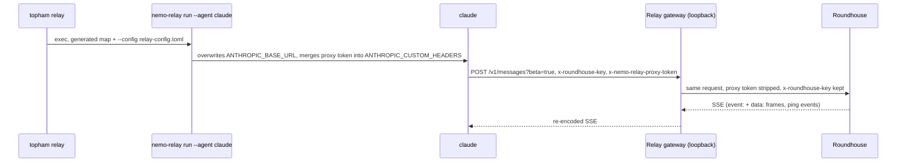

# Hook up Claude Code

This chapter tells how an unmodified Claude Code client connects to Roundhouse, directly or through NeMo Relay. It covers the Messages surface, the launch environment, the control tools, the gated suite, and the client facts behind them, each pinned to a version.

## The Messages surface

`POST /v1/messages` is an Anthropic Messages surface over the same event log as the Responses surface, with the same engine, admission, and prefix check. See [Sessions and the event log](../concepts/sessions.md).

| Endpoint | Behavior |
|---|---|
| `POST /v1/messages` | Serves a turn, streaming or not. A non-streaming request is answered by folding the frames of the same turn. Claude Code posts to `?beta=true` (2.1.247 to 2.1.272), and routing ignores the query. |
| `POST /v1/messages/count_tokens` | Answered from the tokenizer of the deployment, tools included. Without this route, the client falls back to a real one-token create. |
| `GET /v1/models` | Not served. |

Both surfaces accept a request body of up to 32 MB (`MAX_REQUEST_BYTES`), the Anthropic platform limit, because the axum default of 2 MiB is too small for an agent that resends its history. The Messages surface answers a larger body with `request_too_large` in the Anthropic error envelope. The Responses surface keeps the plain-text 413 of axum.

## What the launch generates

`roundhouse_server::claude_launch` is the sibling of the Codex generator. Two differences come from the client:

- **It writes no file.** The whole redirect surface of Claude Code is environment, so the output is an environment map (`ClaudeEnv`) plus leading argv for the control surface.
- **The base URL is the deployment root.** The SDK appends `/v1/messages` itself, so the generator refuses a base URL that ends in `/v1`. The Codex generator refuses the opposite shape.

| Variable | Value |
|---|---|
| `ANTHROPIC_BASE_URL` | The deployment root. An empty value is refused, because the SDK then falls back to `https://api.anthropic.com`. |
| `ANTHROPIC_CUSTOM_HEADERS` | A `x-roundhouse-key: <turn key>` line. The client merges this block after its own auth headers. |
| `ANTHROPIC_API_KEY` | Under `RoundhouseKey` only: the sentinel `rh_sentinel_not_a_credential`. |

`ANTHROPIC_CUSTOM_HEADERS` takes literal lines, so the turn key must be in the map. The generator holds it as a redacting `Secret`: `ClaudeEnv` has no `Serialize` and no `Display`, its `Debug` renders a fingerprint, and only `ClaudeEnv::vars` yields plaintext, to the process that spawns the client. The generator refuses an admin key and any value that is not shaped like a turn key, without echoing the value.

The map sets no model, because the client builds its `anthropic-beta` list from the model string. It sets no deployment policy: `DISABLE_AUTOUPDATER` and `CLAUDE_CODE_DISABLE_NONESSENTIAL_TRAFFIC` belong to whoever spawns the process.

## Authentication kinds

| Kind | `ANTHROPIC_API_KEY` | What reaches Roundhouse |
|---|---|---|
| `ClaudeAuthKind::RoundhouseKey` | the sentinel | The turn key on `x-roundhouse-key`, and the inert sentinel on `x-api-key`. |
| `ClaudeAuthKind::ForwardedClaudeLogin` | not set | The turn key on `x-roundhouse-key`, and the subscription bearer on `Authorization`, which Roundhouse forwards upstream. |

**Why the sentinel exists.** Claude Code suppresses a subscription login only when one of a fixed set of inputs resolves (the table below). `ANTHROPIC_BASE_URL` is not one of them. Without the sentinel, the OAuth bearer of a logged-in user goes to the Roundhouse base URL, because the client has no host check on its inference path.

**Why the sentinel is safe.** The admission boundary treats it as inert and never forwards it. Otherwise it reaches Anthropic as an `x-api-key` beside a real seat, and Anthropic answers that pair with a 401 that reads like a revoked login. The test `the_launchers_api_key_sentinel_is_never_forwarded_as_a_seat` pins the rule.

**The forwarded kind needs a completed `claude` login.** Without one, the client sends no credential. Roundhouse admits the turn and degrades it to local-only routing, and nothing in the run reports it. With a local fleet attached, turns keep answering. The shipped binary attaches none (`crates/roundhouse-server/src/main.rs`).

### The suppressor table

`OAUTH_SUPPRESSORS` in `crates/roundhouse-server/src/claude_launch/suppressors.rs` lists every input that changes how a launched client authenticates, and `ClaudeLaunch::must_be_unset` returns the rows that one auth kind refuses. A row is refused by presence, not by truthiness, because the truth function of the client was not reproduced.

| Input | Site | Defeats | Refused under `RoundhouseKey` | Refused under `ForwardedClaudeLogin` |
|---|---|---|---|---|
| `CLAUDE_CODE_USE_BEDROCK` | env | the redirect | yes | yes |
| `CLAUDE_CODE_USE_VERTEX` | env | the redirect | yes | yes |
| `CLAUDE_CODE_USE_FOUNDRY` | env | the redirect | yes | yes |
| `ANTHROPIC_AUTH_TOKEN` | env | the login | yes | yes |
| `CLAUDE_CODE_API_KEY_FILE_DESCRIPTOR` | env | the login | yes | yes |
| `ANTHROPIC_API_KEY` | env | the login | no | yes |
| `CLAUDE_CODE_REMOTE` | env | the sentinel | yes | no |
| `apiKeyHelper` | settings key | the login | yes | yes |

- **The redirect and the login.** A cloud selector means the client never reaches Roundhouse but still answers. Each login input leaves every request valid under a forwarded login, so the seat never arrives. Under `RoundhouseKey`, the token, the file descriptor, and `apiKeyHelper` are refused too, because the edge captures their credential as a forwarded seat.
- **`CLAUDE_CODE_REMOTE` guards the API-key arm of the client alone.** Inside a Claude Code Remote container, the managed OAuth token goes to the base URL (`SentinelDefeated`).
- **`apiKeyHelper` is a settings key.** A launcher can refuse it but cannot unset it in the child environment. See [Launch with topham](topham.md#refusals).

### The Anthropic pass-through row

The forwarded-credential row for the `anthropic` provider admits three headers: `authorization` (the seat bearer), `x-api-key` (a client's own key), and `anthropic-beta` (passed unchanged). The dispatch client stamps `anthropic-version: 2023-06-01` itself, so a caller's value never reaches the wire. Seat turns resolve to `Payer::User` and count in `seat_tokens`. See [Control plane](../concepts/control-plane.md) for the allowlist and the redirect rule.

## Session naming

The Messages wire has no `prompt_cache_key`. `roundhouse_sequence_id::messages_label` names the session from `x-claude-code-session-id`, then from `metadata.user_id`, and otherwise mints an anonymous session. A Task-tool subagent gets the sibling key `anthropic_messages/{session}/agent/{id}`, and the prefix tells the validate loop which control-call spelling the session uses. A key derived from conversation content was rejected: it re-keys on every edit and forks when a long session compacts, which is when the warm prefix is worth most. See [Sessions and the event log](../concepts/sessions.md).

## Streaming obligations

Claude Code (2.1.42) dispatches SSE frames on the `event:` name and drops a frame without one in silence. A stream it cannot consume triggers a second, non-streaming request for the same turn at full price, so a framing error shows as a turn that costs twice. The emitter (`crates/roundhouse-server/src/messages_api/emit.rs`) makes the ordering errors that the client accumulator throws on unreachable.

- `message_start` carries the admitted input count and `output_tokens: 1` (`PRELUDE_OUTPUT_TOKENS`). The cache split is unknown yet and goes out as zero. The final `message_delta` carries the measured counts.
- The value 1 is the honest floor: a stream that dies before `message_delta` bills as one token, not as a free turn. `message_delta` omits `usage` when the output count is zero.
- Keepalives are `ping` events with a `data:` payload, every 15 s of silence (`KEEPALIVE_INTERVAL`). An SSE comment satisfies the 300 s watchdog, but Relay (0.8.0, 0.8.2) drops frames with no `data:` line.
- The emitter carries no SSE `id:`, because Relay drops `id:` lines. The surface offers no resumption in band.
- Before the stream starts, only HTTP 503 maps to `overloaded_error`. A fair-use check that cannot reach its store answers 503, because a 500 tells the agent to stop and a 503 tells it to come back.
- Mid-stream there is no status, so the error type decides. `UpstreamError` and `OwnerLost` are `overloaded_error`, the only type that Claude Code retries. `BudgetExhausted` is `rate_limit_error`, `PolicyRefused` is `permission_error`, and `ClientCancelled` is `api_error`.

A strict conformance reader written from the pinned spec judges every stream that the suite produces (`tests/common/anthropic.rs`), because both official SDKs are non-validating. Anthropic's three input counters are disjoint, but Roundhouse nests cached and written input inside the total, so the projection subtracts. Getting this backwards reports a warm turn as nearly two cold ones, which flatters the savings figure.

## Client-rewritten items

Claude Code rewrites some items on every request. Roundhouse admits a leading rewritten run loosely as turn configuration. The attribution block and `--append-system-prompt` text become a `Developer` item. Admission compares role and content only, because containers are re-serialized. See [Sessions and the event log](../concepts/sessions.md).

**The remaining-budget notice trails, so Roundhouse drops it.** Canonicalization drops a system message whose whole content is one `<total_tokens>…</total_tokens>` tag, in either container. The match is anchored at both ends, so the same tag inside other text is kept. A counter admitted as history forks the session the first time it counts down. The cost is that the model does not see the budget figure. Each `--continue` turn grows the raw `messages` list by three while the conversation grows by two.

Two client lines are pinned, 2.1.251 and 2.1.257, and every fixture-driven test runs against both. A suite pinned to one line cannot answer the question that a mixed fleet asks. The fixtures are request bodies captured from the shipping binaries through a loopback mock, in `crates/roundhouse-server/tests/fixtures/`. The sanitized capture of 2.1.272 is `claude-2.1.272-wire-shapes.json` there.

## Control tools from Claude Code

Claude Code reaches the same eight control tools as Codex, over `/mcp`. See [MCP control surface](../concepts/mcp.md) for the tools and for how a call finds its session.

**The tool name is flat.** Claude Code folds the server and the tool into one string, `mcp__roundhouse__status`, in `tools[]`, in the `tool_use` block, and in `--allowedTools`. The log stores the name that the client sent and emits it unchanged. **The call carries its correlator:** `_meta["claudecode/toolUseId"]` is the `tool_use.id` that Roundhouse emitted, so a `status` call from a subagent resolves to the log of the subagent.

**The registration is inline argv, and the key rides `${VAR}`.** `claude_launch` generates two arguments in front of the argv of the operator:

| Argument | Content |
|---|---|
| `--mcp-config` | The registration JSON, inline, type `http`. The header value is the literal `${ROUNDHOUSE_API_KEY}` (the `key-env` of the profile), which the client expands from its environment. |
| `--append-system-prompt` | The signage: the eight tools and the occasion for each. |

The secret is in no argv, no file, and no process listing. `topham` refuses a launch whose key variable is not exported, which closes the unexpanded-literal hazard. `--strict-mcp-config` is a profile switch, off by default, because it drops every other MCP configuration and not only a colliding one.

**Config forms at 2.1.257** (captured with stub servers, pinned in `claude-2.1.257-mcp-wire.json`):

- `--mcp-config` wins outright over a project `.mcp.json` server of the same name. The `.mcp.json` stub got 0 requests and the stub of the flag got 5. It is not a merge. This is why the registration cannot be half-overridden.
- `--strict-mcp-config` excludes `.mcp.json` servers even under another name.
- Project-scope servers need no approval in `-p` mode: no pending state, exit 0, and no `projects` key written to `~/.claude.json`. User and local scope share that reader, which was not re-run live.
- `settings.json` `mcpServers` is ignored. `claude doctor` raises no warning, and a live turn shows zero `mcp__*` tools.
- The `x-roundhouse-key` header rode every MCP request under both working forms.

The flag is the only form that writes nothing: a `.mcp.json` lands in the repository of the operator, and a key file cannot be deleted because `topham launch` replaces itself with the agent and leaves no supervisor. The signage is one appended block because the other two places fail. A skill under `$CLAUDE_CONFIG_DIR/skills/` is an interior system message, so editing it forks every live session, and owning `CLAUDE_CONFIG_DIR` moves the login that a forwarded launch must forward. `CLAUDE.md` lands in the first user message, in the repository of the operator. The signage names the occasion for each tool, not its description, because the descriptions already ride in `tools[]`. At 2.1.257, `--append-system-prompt` turns off `--system-prompt-snapshot`, so the leading run is re-rendered on each launch, and loose admission absorbs that.

**Headless runs need a grant.** In `-p` mode the client does not ask about an `mcp__*` tool that its argv does not name. It synthesizes an `is_error` tool result that reads "Claude requested permissions to use mcp__roundhouse__status, but you haven't granted it yet." It still runs `initialize`, `notifications/initialized`, the GET stream, and `tools/list`, but no `tools/call` reaches `/mcp`. A `-p` run needs `--allowedTools mcp__roundhouse__status` and so on. `--permission-mode dontAsk` denies the tool with a different message. Claude Code refuses `--dangerously-skip-permissions` when it runs as root. Server-level wildcards in `--allowedTools` and an MCP result with `isError: true` were not tested. The launcher does not invent the grant.

Roundhouse adds no tool to a Messages request. An injected tool is a name that the loop of the client cannot dispatch, and it changes the input token count that the client was quoted.

## Chained through NeMo Relay

The chained topology is the Direct one with NeMo Relay in the middle, and it takes the same generated map.



At Relay 0.8.2, the map survives the hop. Relay merges its proxy token into `ANTHROPIC_CUSTOM_HEADERS` by replacing one line, forwards headers it does not own untouched, and strips its own token.

**The reference wiring.** Give the client the generated map, under either auth kind. Launch it with `nemo-relay run --agent claude --config <toml>`, which skips the setup wizard of a bare `nemo-relay claude`. Aim `[upstream] anthropic_base_url` at the deployment root, with no `anthropic_auth_header`. `topham relay` does exactly this. See [NeMo Relay formats](../operations/relay-formats.md#aim-a-nemo-relay-at-roundhouse).

**The fallback for a client with no credential.** Relay can carry the turn key as `Authorization: Bearer <turn key>` through `[upstream] anthropic_auth_header`. It injects the header only when the request carries none of `authorization`, `x-api-key`, `api-key`, or `anthropic-api-key`. The sentinel counts, so this arm needs `ANTHROPIC_API_KEY` unset. Such turns are key-authed only, and no seat is captured. This fallback is deliberately untested.

**Two documented refusals, not guards.** Both happen inside Relay, so Roundhouse cannot enforce them:

- A base URL set in a different config layer clears a configured `anthropic_auth_header`, so a base URL on the command line with an auth header in `config.toml` runs unauthenticated. The reference wiring sets no auth header. The test `hazard_4_a_different_base_url_layer_clears_the_configured_auth_header` fails if a Relay release changes this.
- A plugin dispatch override strips provider credentials before it redirects a turn, so the turn arrives key-authed only.

A persistent `nemo-relay install claude-code` writes `env.ANTHROPIC_BASE_URL` into `~/.claude/settings.json`, and a settings `env` block replaces the inherited value (0.8.0, 0.8.2). A launch under that file hangs, with zero turns at Roundhouse and no refusal anywhere. `topham` reads the settings files and refuses. See [Launch with topham](topham.md#refusals).

Relay does not route around Roundhouse on the Anthropic route, because the ChatGPT redirect applies to OpenAI routes only. The chained tests drive a real Relay. The turn key arrives on its dedicated header, the proxy credential never leaves the gateway, `?beta=true` survives the base-URL join, and a `--continue` through the alphabetizing re-encode extends the session.

## The gated real-binary suite

`crates/roundhouse-server/tests/claude_e2e.rs` spawns the real `claude` binary against a loopback Roundhouse with exactly the generated environment.

```bash
timeout 300 cargo test -p roundhouse-server --features e2e-claude \
    --test claude_e2e -- --include-ignored --test-threads=1 --nocapture
```

`ROUNDHOUSE_TEST_CLAUDE_BIN` (verified at 2.1.257), `ROUNDHOUSE_TEST_RELAY_BIN` (0.8.2), and `ROUNDHOUSE_TEST_TOPHAM_BIN` select the binaries. See [Testing](../development/testing.md). Only the frontier is scripted, so the suite decides when a `tool_use` block is emitted. The client, the socket, the log, and the tool that the client chose to run are real.

**The child environment is cleared** and rebuilt from the generated map plus `PATH`, `HOME`, `CLAUDE_CONFIG_DIR`, `DISABLE_AUTOUPDATER`, and `CLAUDE_CODE_DISABLE_NONESSENTIAL_TRAFFIC`. An ambient `CLAUDE_CODE_REMOTE=true` makes the client send a managed OAuth token to the base URL. A test asserts the key set of the constructed command, but `Command::get_envs()` reports explicit additions whether or not the clear ran. So a dropped `env_clear()` shows only on the wire, as an `authorization` header on a request that reached Roundhouse.

**The closure test** (`a_real_client_reaches_the_control_surface_through_the_turn`) launches a real client through a real `topham`. The scripted frontier answers with a `tool_use` for `mcp__roundhouse__status`, and the client dispatches it against `/mcp`. The test asserts five things: the turn key arrived, the flat name was split on the MCP wire, the answer named the conversation of the call, the resend rejoined the session, and the validate loop did not count the call as agent work. A rival conversation takes the most-recent slot first, so a guessing implementation answers about the wrong log.
## Claude Code wire facts by version

| Fact | Version | Roundhouse consequence |
|---|---|---|
| One session carried two request shapes. Two of four requests had three one-hour `cache_control` breakpoints and the `clear_thinking_20251015` edit. `anthropic-beta` dropped `context-1m-2025-08-07` between turns. | 2.1.272 | One session header does not prove one append-only prompt stream. |
| `/clear` mints a new session id. Compaction, `--resume`, and `--continue` keep it. `--fork-session` copies history to a new id, and agent-team teammates have their own ids. A `--continue` turn resends the full history. | 2.1.42, 2.1.247 to 2.1.272 | Session identity follows the client id. Full resend with prefix admission is the serve model. |
| `system[0]` is `x-anthropic-billing-header: cc_version=<ver>.<3 hex>; cc_entrypoint=sdk-cli;` with no `cache_control`. The 3 hex characters are 12 bits of a hash of the first prompt. | 2.1.251, 2.1.257 | Not a session id: two prompts collide with probability 1/4,096. `CLAUDE_CODE_ATTRIBUTION_HEADER=0` suppresses it. |
| The main system prompt (item 2) and the `Bash` tool description lost ` (1M context)` between turn 1 and turn 2 of one session. | 2.1.251, 2.1.257 | Any identity hash that includes item 2 changes inside one session. |
| `claude-code-20250219` is on every non-haiku request. `oauth-2025-04-20` is present only under OAuth. The beta list is built from the model string. | 2.1.42 to 2.1.257 | Forward `anthropic-beta` unchanged, never allowlist its values, and forward header and body pairs together, or the upstream answers 400. |
| SSE consumer: unknown event names are ignored. A mid-stream `event: error` has no status and is terminal unless its body contains `"type":"overloaded_error"`. Non-OAuth clients also retry when the first response had `x-should-retry: true`, and subscription-OAuth clients never do. A stream silent for 300 s is aborted, and every relayed byte counts. The accumulator throws on a delta with no prior `content_block_start`, a delta of the wrong type for its block, a stop at an unknown index, and a stop before `message_start`. The usage merge guards input and cache counts with greater-than-zero, but uses `??` on `output_tokens`. | 2.1.42 (watchdog also in docs) | The emitter makes the throwing cases unreachable. A `rate_limit_error` or `api_error` mid-stream ends the turn. Never send `output_tokens: 0` in a delta. |
| The client matches error wording: `"type":"overloaded_error"`, `"Fast mode is not enabled"`, and ``input length and `max_tokens` exceed context limit: (\d+) \+ (\d+) > (\d+)``. | 2.1.42 | Forward upstream error bodies unchanged. |
| `stream:false` is sent in four places (auth probe, quota probe, token-count fallback, a helper). A stream the client cannot parse is re-issued without `stream`, with `max_tokens` clamped to 21333. | 2.1.42, 2.1.272 | Non-streaming requests are served from the same frames. |
| The vendored SDK reads `ANTHROPIC_BASE_URL` with no validation. It does not redirect OAuth refresh, `/api/*` calls, or telemetry. The one `api.anthropic.com` host check guards settings sync only. | 2.1.42, docs | No host check protects the inference path. |
| Compaction hint headers `x-claude-code-compaction` and `x-claude-code-context-compacted` (values `auto`, `manual`, `reactive`) are sent to a non-first-party base URL only when `CLAUDE_CODE_GATEWAY_HINT_HEADERS` is set. | 2.1.276 to 2.1.284 | `topham` does not set the variable, so these headers do not arrive. |
| With `CLAUDE_CODE_ENABLE_GATEWAY_MODEL_DISCOVERY=1`, the client calls `GET /v1/models?limit=1000` with a 3 s timeout, and a slow or redirecting answer fails silently. | docs | Roundhouse does not serve `/v1/models`, and the launch does not set the variable. |

To read a client claim again when a version moves, run `scripts/ccgrep.py <executable> <pattern> <before> <after>`. It searches an installed binary as bytes and never runs it. `scripts/claude-code-wire-probe.py` captures sanitized requests from a real `claude` through a loopback mock, and its `--agent-tool` flag makes the mock invoke one subagent.

## Limits

- **A control call chained through Relay is untested.** `topham relay` registers the MCP URL directly against the deployment, because Relay proxies the Anthropic route and nothing else. So a control call does not pass through the gateway. This is read from Relay, not tested. Only the Direct control run exists.
- **An interactive session asks once.** Under `-p`, `ANTHROPIC_API_KEY` always wins. Interactively, under a subscription login, a `RoundhouseKey` session asks the user to approve the key first. The same gate asks before a call to an `mcp__roundhouse__*` tool. `topham plan` states both prompts.
- **No real subscription seat has been forwarded.** The three-header Anthropic row is asserted against a mock upstream on a real socket.
