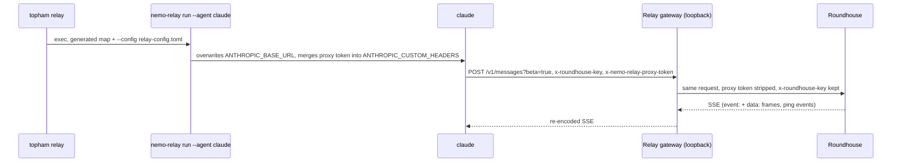

# Hook up Claude Code

This chapter tells how an unmodified Claude Code client connects to Roundhouse, directly or through NeMo Relay. It covers the Messages surface, the launch environment, the control tools, the gated suite, and the client facts behind them, each pinned to a version.

## The Messages surface

`POST /v1/messages` is an Anthropic Messages surface over the same event log as the Responses surface. It uses the same engine, the same admission, and the same prefix check. See [Sessions and the event log](../concepts/sessions.md).

| Endpoint | Behavior |
|---|---|
| `POST /v1/messages` | Serves a turn. Streaming and non-streaming requests are both served. The `?beta=true` query that the client appends is ignored, because routing matches the path only. |
| `POST /v1/messages/count_tokens` | Answered from the deployment's own tokenizer. Without this route, the client falls back to a real one-token create against a model. |
| `GET /v1/models` | Not served. |

Both surfaces accept a request body of up to 32 MB (`MAX_REQUEST_BYTES`), the Anthropic platform limit. The axum default of 2 MiB is too small for an agent that resends its whole history. An oversized body gets an error in the dialect's own envelope.

A non-streaming request is answered by folding the frames that a stream of the same turn carries. Claude Code sends 1-token non-streaming creates as auth and quota probes, and a failure there breaks the client.

## What the launch generates

`roundhouse_server::claude_launch` is the sibling of the Codex generator. Two things differ, and both are facts about the client:

- **It writes no file.** The whole redirect surface of Claude Code is environment. So the output is an environment map, `ClaudeEnv`, plus leading argv for the control surface.
- **The base URL is the deployment root, not the API prefix.** The client's SDK appends `/v1/messages` itself. A base URL that ends in `/v1` is refused by name. This is the inverse of the Codex refusal, and for the same reason: each generator refuses the shape its client cannot use.

| Variable | Value |
|---|---|
| `ANTHROPIC_BASE_URL` | The deployment root. An empty value is refused, because the SDK then falls back to `https://api.anthropic.com`. |
| `ANTHROPIC_CUSTOM_HEADERS` | A `x-roundhouse-key: <turn key>` line. The client merges this block after the SDK's own auth headers. |
| `ANTHROPIC_API_KEY` | Under `RoundhouseKey` only: the sentinel `rh_sentinel_not_a_credential`. |

**The turn key is in the map.** `ANTHROPIC_CUSTOM_HEADERS` takes literal `Name: Value` lines and has no indirection to a variable name. So the generator holds the key as a redacting `Secret`. The map has no `Serialize` and no `Display`. Its `Debug` renders a fingerprint. One documented seam, `ClaudeEnv::vars`, yields plaintext to the process that spawns the client.

The generator refuses an admin key and a value that does not have the shape of a turn key. The error does not echo the value.

**What the map does not set:**

- **No model.** Roundhouse ignores the requested model. The client builds its `anthropic-beta` list from the model string, so a named model changes which betas arrive.
- **No deployment policy.** `DISABLE_AUTOUPDATER` and `CLAUDE_CODE_DISABLE_NONESSENTIAL_TRAFFIC` belong to whoever spawns the process. `topham` and the gated suite both set them.

## Authentication kinds

| Kind | `ANTHROPIC_API_KEY` | What reaches Roundhouse |
|---|---|---|
| `ClaudeAuthKind::RoundhouseKey` | the sentinel | The turn key on `x-roundhouse-key`, and the inert sentinel on `x-api-key`. |
| `ClaudeAuthKind::ForwardedClaudeLogin` | not set | The turn key on `x-roundhouse-key`, and the user's subscription bearer on `Authorization`, which Roundhouse forwards upstream. |

**Why the sentinel exists.** Claude Code suppresses a subscription login only when one of five inputs resolves. `ANTHROPIC_BASE_URL` is not one of them. Without the sentinel, a logged-in user's OAuth bearer goes to the Roundhouse base URL. No host check exists on the client's inference path. The sentinel is the analogue of `env_key` beside `requires_openai_auth = false` in the Codex config.

**Why the sentinel is safe.** The admission boundary treats it as inert and never forwards it upstream. Without that rule, it arrives at Anthropic as an `x-api-key` beside a real seat. Anthropic answers that pair with a 401 that reads like a revoked login. The test `the_launchers_api_key_sentinel_is_never_forwarded_as_a_seat` pins the rule.

**The forwarded kind needs a completed `claude` login.** Without one, the client presents no credential. Roundhouse admits the turn and degrades it to local-only routing, and nothing in the run reports it.

### The suppressor table

`OAUTH_SUPPRESSORS` in `crates/roundhouse-server/src/claude_launch/suppressors.rs` lists every input that changes how a launched client authenticates. `ClaudeLaunch::must_be_unset` returns the rows that one auth kind refuses, in a form a launcher can enforce. Inputs are refused by presence, not by truthiness, because the client's truth function was not reproduced.

| Input | Site | Defeats | Refused under `RoundhouseKey` | Refused under `ForwardedClaudeLogin` |
|---|---|---|---|---|
| `CLAUDE_CODE_USE_BEDROCK` | env | the redirect | yes | yes |
| `CLAUDE_CODE_USE_VERTEX` | env | the redirect | yes | yes |
| `CLAUDE_CODE_USE_FOUNDRY` | env | the redirect | yes | yes |
| `ANTHROPIC_AUTH_TOKEN` | env | the login | yes | yes |
| `CLAUDE_CODE_API_KEY_FILE_DESCRIPTOR` | env | the login | yes | yes |
| `ANTHROPIC_API_KEY` | env | the login | no | yes |
| `CLAUDE_CODE_REMOTE` | env | the sentinel | yes | no |
| `apiKeyHelper` | settings key | the login | yes | yes |

- **The three cloud selectors defeat the redirect.** The client never reads the base URL and never reaches Roundhouse, but it answers anyway. Both kinds refuse them, with their own message.
- **Five inputs suppress the login.** Each leaves every request valid under a forwarded login, so the seat silently never arrives.
- **Three of them are also refused beside the sentinel.** `ANTHROPIC_AUTH_TOKEN`, the key file descriptor, and `apiKeyHelper` put the operator's own credential on `Authorization`. The edge then captures it as a forwarded seat. `ANTHROPIC_API_KEY` stays admitted because the generated sentinel overwrites it.
- **`CLAUDE_CODE_REMOTE` turns the sentinel off.** The client's API-key arm is guarded by that variable alone. Inside a Claude Code Remote container, the container's managed OAuth token goes to the base URL instead. A `RoundhouseKey` launch refuses it (`SentinelDefeated`). A forwarded login is not harmed by it.
- **`apiKeyHelper` is a settings key.** A launcher can refuse it but cannot unset it in the child environment. See [Launch with topham](topham.md) for how the settings files are read.

### The Anthropic pass-through row

The forwarded-credential allowlist row for the `anthropic` provider admits three headers:

| Header | Carries |
|---|---|
| `authorization` | The subscription seat's bearer. |
| `x-api-key` | A client's own Anthropic key. |
| `anthropic-beta` | The feature envelope. Stripping `oauth-2025-04-20` from a seat is a documented 401. |

`anthropic-version` is not in the row. The dispatch client stamps its own value after the forwarded headers, so a caller's value never reaches the wire. The dispatch client also disables redirects, so a credential cannot follow a redirect to another origin.

Seat turns resolve to `Payer::User` and count in `seat_tokens`. Admission takes the turn key only from the dedicated `x-roundhouse-key` header. That rule is what lets the edge capture a forwardable `Authorization`. See [Control plane](../concepts/control-plane.md).

## Session naming

The Messages wire has no `prompt_cache_key` field. `roundhouse_sequence_id::messages_label` resolves the session in this order:

1. the `x-claude-code-session-id` header
2. `metadata.user_id` parsed as a JSON-object string, taking `.session_id`
3. the older `user_<hex>_account_<uuid>_session_<uuid>` form, split on `_session_`
4. the whole `metadata.user_id` string
5. otherwise an anonymous session that the server mints.

Both `user_id` spellings are parsed because a client upgrade that re-keys every session cold-starts every warm prefix. Claude Code always sends `user_id`, so the product path never reaches the anonymous arm. The arm exists so that a bare `curl` client gets a served turn.

The key is qualified into the caller's namespace under the `anthropic_messages/` prefix. A Task-tool subagent gets the sibling key `anthropic_messages/{session}/agent/{id}`. The prefix also tells the validate loop which control-call spelling the session uses.

A key derived from conversation content was rejected. It re-keys on every edit and forks when a long session compacts, which is when the warm prefix is worth most.

## Streaming obligations

Claude Code dispatches SSE frames on the `event:` name and drops a frame without one in silence. A stream it cannot consume triggers a second, non-streaming request for the same turn at full price. So a framing error does not show as an error. It shows as a turn that costs twice. The emitter (`crates/roundhouse-server/src/messages_api/emit.rs`) makes the ordering errors that the client's accumulator throws on unreachable.

- `message_start` carries the input and cache counts. Output tokens go only on the final `message_delta`.
- A delta never carries an explicit `output_tokens: 0`. The client merges `output_tokens` with `??`, so a zero bills the turn as free.
- Start, delta, and stop indexes follow strict order.
- Keepalives are real `ping` events with a `data:` payload, every 15 s of silence (`KEEPALIVE_INTERVAL`). An SSE comment satisfies the client's 300 s watchdog, but a chained Relay drops frames with no `data:` line. One shape survives both topologies.
- The emitter carries no SSE `id:`, because Relay drops `id:` lines. So this surface does not offer resumption in band.
- A mid-stream failure is an `event: error`.
- HTTP 503, and only 503, maps to `overloaded_error`. Under subscription OAuth, that is the one error Claude Code retries mid-stream. On any other status it causes an endless retry. A fair-use check that cannot reach its store answers 503 for this reason, because no client retries a 500.

Every stream the suite produces is judged by a strict conformance reader written from the pinned spec (`tests/common/anthropic.rs`). Both official SDKs are deliberately non-validating and accept anything.

**Accounting axes.** Anthropic's three input counters are disjoint. Roundhouse nests cached and written input inside the total. So the projection subtracts rather than forwards. Getting that backwards reports a warm turn as nearly two cold ones, in the direction that flatters the savings figure.

## Client-rewritten items

Claude Code rewrites some items on every request. An item the client rewrites is loosely admitted when it leads, or dropped when it trails.

- **The leading system run** (the attribution block and `--append-system-prompt` text) becomes a `Developer` item, admitted loosely as turn configuration. An interior `role: system` message is history and is admitted strictly.
- **The remaining-budget notice** trails. Canonicalization drops a system message whose entire content is exactly one `<total_tokens>…</total_tokens>` tag, in either container. The match is anchored at both ends, so the same tag inside other text is kept. A counter admitted as history forks the session the first time it counts down. The cost is that the model does not see the client's budget figure.
- **Containers are re-serialized.** The item that carried the `cache_control` breakpoint on turn n arrives on turn n+1 as a bare string with no `cache_control`. The text stays byte-stable. So admission compares role and content only, never the container.

Two client lines are pinned: 2.1.251 and 2.1.257. Every fixture-driven test runs against both. A suite pinned to one line cannot answer the question a mixed fleet asks. The fixtures are request bodies captured from the shipping binaries through a loopback mock, in `crates/roundhouse-server/tests/fixtures/`.

## Control tools from Claude Code

Claude Code reaches the same eight control tools that Codex reaches over `/mcp`. Everything that differs is a fact about the client. See [MCP control surface](../concepts/mcp.md).

**The tool name is flat, and the log stores it flat.** Codex sends a bare `name` and a separate `namespace`. Claude Code folds them into one string, `mcp__roundhouse__status`, in `tools[]`, in the `tool_use` block, and in the `--allowedTools` grant. `ClientDialect` states which spelling each surface stores. Each surface stores the name its client sent and re-emits the stored call as-is. No name is built on the way out, so there is no replay hazard. The validate loop's control-call test (`is_control_call_on`) accepts each surface's spelling and only that one.

**A call is correlated by the tool-use id it answers.** Claude Code puts `_meta["claudecode/toolUseId"]` on every `tools/call`. That id is the `tool_use.id` that Roundhouse itself emitted, so it names exactly one conversation. A `status` call from a subagent's tool loop resolves to the subagent's log. The binding is written as the call streams to the client. An id that is not the caller's answers like an unknown id. An id that two of one principal's sessions claimed is ambiguous and also answers like an unknown id. A call with no such key falls back to the principal's most recent conversation.

**The registration is inline argv, and the key rides `${VAR}`.** `claude_launch` generates two arguments in front of the operator's own:

| Argument | Content |
|---|---|
| `--mcp-config` | The registration JSON, inline. The header value is the literal `${ROUNDHOUSE_API_KEY}` (the profile's `key-env`), which the client expands from its environment. |
| `--append-system-prompt` | The signage: the eight tools and the occasion for each. |

The secret is in no argv, no file, and no process listing. `topham` refuses a launch whose key variable is not exported, which closes the unexpanded-literal hazard. `--strict-mcp-config` is a profile switch and is off by default, because it drops every other MCP configuration, not only a colliding one.

Rejected places for the registration, at Claude Code 2.1.257:

- A project `.mcp.json` lands in the operator's own repository. It is also "Pending approval" until a person approves it.
- A `settings.json` `mcpServers` key is silently inert.
- A short-lived 0600 key file cannot be deleted, because `topham launch` replaces itself with the agent and leaves no supervisor.

Rejected places for the signage:

- A skill under `$CLAUDE_CONFIG_DIR/skills/` arrives as an interior system message, which is admitted strictly. Editing it forks every live session. Owning `CLAUDE_CONFIG_DIR` also moves the login that a forwarded-login launch exists to forward.
- `CLAUDE.md` lands inside the first user message.

The signage names the occasion for each tool, not its description. The descriptions already ride in `tools[]` on every request. `--append-system-prompt` disables `--system-prompt-snapshot`, so the leading run is re-rendered each launch. Loose admission absorbs that drift.

**Headless runs need a grant.** In `-p` mode, the client synthesizes a permission refusal for an `mcp__*` tool that its own argv does not name. No request reaches `/mcp`. So a `-p` run needs `--allowedTools mcp__roundhouse__status` and so on. Claude Code refuses `--dangerously-skip-permissions` when it runs as root. `topham plan` states this in its notes. An operator argv that repeats a generated flag is refused by name.

**Roundhouse adds no tool to a Messages request.** The client's `tools[]` is forwarded unchanged. An injected tool is a name the client's loop cannot dispatch, and it changes the input token count the client was quoted.

## Chained through NeMo Relay

The chained topology is the Direct one with NeMo Relay in the middle, and it takes the same generated map.



Why the map survives the hop, at Relay 0.8.2:

- Relay merges its proxy token into `ANTHROPIC_CUSTOM_HEADERS` by replacing the matching line only. The `x-roundhouse-key` line survives.
- Relay forwards headers it does not own untouched. It subtracts hop-by-hop names, `Host`, `Content-Length`, `Accept-Encoding`, and its own two credential headers, and nothing else.
- Relay strips its own proxy token before the hop, so Relay's credential never leaves Relay.

**The reference wiring.** Hand the client the generated map, under either auth kind. Launch it through `nemo-relay run --agent claude --config <toml>`. Aim `[upstream] anthropic_base_url` at the deployment root, with no `anthropic_auth_header`. `topham relay` does exactly this. The base URL is the root because Relay appends the inbound path and query whole. A base that carries `/v1` produces `/v1/v1/messages`.

**The fallback for a credential-less client.** Relay can carry the turn key itself, as `Authorization: Bearer <turn key>` through `[upstream] anthropic_auth_header`. Relay injects it only when the request carries none of `authorization`, `x-api-key`, `api-key`, or `anthropic-api-key`. The sentinel on `x-api-key` counts, so this arm requires `ANTHROPIC_API_KEY` unset. Such turns are key-authed only, and no seat is captured. This fallback is deliberately untested.

**Documented refusals, not guards.** These happen inside Relay's process, so Roundhouse cannot enforce them:

- A base URL set in a different config layer clears a configured `anthropic_auth_header`. A base URL on the command line and an auth header in `config.toml` therefore run unauthenticated. The reference wiring is immune, because it sets no auth header. A dry-run test in `claude_e2e.rs` fails if a Relay release changes this.
- A plugin's dispatch override strips provider credentials before it redirects a turn. Such a turn arrives key-authed only.

**Guards that hold on this path:**

- Relay does not route around Roundhouse on the Anthropic route. The ChatGPT redirect applies to OpenAI routes only. The real-Relay tests assert that the request arrives at all.
- A chained turn carries the same attribution as Direct.
- Relay's alphabetizing re-encode of a resent body canonicalizes to the same items. A `--continue` through a real Relay extends the session.
- The Roundhouse event log is the one authority for accounting. Relay's ATOF stream is observability. It disagrees on retried turns and on unreported usage. See [NeMo Relay formats](../operations/relay-formats.md).

## The gated real-binary suite

`crates/roundhouse-server/tests/claude_e2e.rs` spawns the real `claude` binary against a loopback Roundhouse with exactly the generated environment. It doubles nothing on the client side.

```bash
timeout 300 cargo test -p roundhouse-server --features e2e-claude \
    --test claude_e2e -- --include-ignored --test-threads=1 --nocapture
```

| Variable | Purpose |
|---|---|
| `ROUNDHOUSE_TEST_CLAUDE_BIN` | The `claude` binary. Verified version: 2.1.257. |
| `ROUNDHOUSE_TEST_RELAY_BIN` | The `nemo-relay` binary for the chained tests. Verified version: 0.8.2. |
| `ROUNDHOUSE_TEST_TOPHAM_BIN` | A freshly built `topham` for the launcher tests. See [Launch with topham](topham.md#what-proves-it). |

**Real:** the binary, the socket, the surface, and the control directory with its minted turn key. The log, the prefix check, and the tool the client chose to run are also real. **Scripted:** only the frontier, so the suite decides when a `tool_use` block is emitted.

**The child environment is cleared** and rebuilt from the generated map plus five isolation variables: `PATH`, `HOME`, `CLAUDE_CONFIG_DIR`, `DISABLE_AUTOUPDATER`, and `CLAUDE_CODE_DISABLE_NONESSENTIAL_TRAFFIC`. Inside a Claude Code Remote container, an ambient `CLAUDE_CODE_REMOTE=true` makes the client present the container's managed OAuth token to the base URL.

Two guards stand behind the clear, and they catch different things:

- A no-binary test asserts the key set of the constructed command with `==`. `Command::get_envs()` reports the explicit additions identically whether or not the clear ran. So this guard checks the generated map and only that.
- A dropped `env_clear()` or an ambient leak is caught on the wire instead: an `authorization` header on a request that reached Roundhouse.

**The control-call closure test** (`a_real_client_reaches_the_control_surface_through_the_turn`). A real client, launched through a real `topham`, is answered with a `tool_use` for `mcp__roundhouse__status`. It dispatches the call against the deployment's own `/mcp` mount and comes back. The assertions cover both edges:

- the turn key arrived on the control call
- the flat name was split back apart on the MCP wire
- the answer named the conversation the call came from
- the resend rejoined the session
- the validate loop counted none of it as the agent's work.

A rival conversation of the same principal takes the most-recent slot before every control call. An implementation that guesses answers about the wrong log, and this assertion catches it.

**The chained tests** drive a real NeMo Relay (`nemo-relay run --agent claude`). They show these facts:

- The turn key arrives on its dedicated header.
- Relay's proxy credential never leaves the gateway.
- `?beta=true` survives the base-URL join.
- A `--continue` through Relay's re-encode extends the session and does not fork it.

## Claude Code wire facts by version

These are external facts about the client. Each row names the version it was read or captured at.

| Fact | Version | Roundhouse consequence |
|---|---|---|
| Inference posts to `/v1/messages?beta=true`. The body is the beta shape with `context_management`, and betas ride only in the header. | 2.1.247 to 2.1.272 | Routing matches the path. The query survives Relay. |
| `x-claude-code-session-id` equals `--session-id`. `metadata.user_id` is a JSON string with `account_uuid`, `device_id`, and `session_id`. The embedded `session_id` equals the header. | 2.1.272 | The session ladder. Account and device values are never used as keys. |
| The request carries no `session-id`, `thread-id`, `x-client-request-id`, or `prompt_cache_key`. | 2.1.257, 2.1.272 | Codex header rules do not apply. |
| One session carried two request shapes. Two of four requests had three one-hour `cache_control` breakpoints and the `clear_thinking_20251015` edit. `anthropic-beta` dropped `context-1m-2025-08-07` between turns. | 2.1.272 | One session header does not prove one append-only prompt stream. |
| `/clear` mints a new session id. Compaction, `--resume`, and `--continue` keep it. `--fork-session` copies history to a new id. `--remote` adopts a server-minted id. Agent-team teammates are separate processes with their own ids. | 2.1.42, 2.1.247, 2.1.272 | Session identity follows the client id. |
| A `--continue` turn resends the full history. | 2.1.247 to 2.1.257 | Full resend with prefix admission is the serve model. |
| `system[0]` is `x-anthropic-billing-header: cc_version=<ver>.<3 hex>; cc_entrypoint=sdk-cli;` with no `cache_control`. The 3 hex characters are 12 bits of a SHA-256 over characters 4, 7, and 20 of the first prompt plus the version. | 2.1.251, 2.1.257 | Not a session id: two prompts collide with probability 1/4,096. Exact detection is a reliable Claude Code signal. It is stored as a configuration item and rendered first. `CLAUDE_CODE_ATTRIBUTION_HEADER=0` suppresses it. |
| Item 2 (the main system prompt) and the `Bash` tool description lost ` (1M context)` between turn 1 and turn 2 of one session. The working directory and model name also sit in item 2. | 2.1.251, 2.1.257 | Any identity hash that includes item 2 changes inside one session. |
| Each `--continue` turn appends a trailing system message whose only content is `<total_tokens>N tokens left</total_tokens>`, with the ephemeral breakpoint. The previous notice is resent as a bare string. The raw `messages` list grows by three per turn while the conversation grows by two. | 2.1.257 | Dropped at canonicalization. |
| Thinking is `{"type":"adaptive","display":"omitted"}` with `output_config: {"effort":"high"}` and `max_tokens` 64000. At 2.1.247 it was `{budget_tokens, display}` with `max_tokens` 32000. | 2.1.251 onward | None. |
| `claude-code-20250219` is on every non-haiku request. `oauth-2025-04-20` is present only under OAuth. The beta list is built from the model string. | 2.1.42 to 2.1.257 | Forward `anthropic-beta` unchanged. Never allowlist its values. Forward header and body pairs together, or the upstream answers 400. |
| A one-hour `cache_control` TTL appears only under subscription OAuth. | 2.1.42, 2.1.247 | None. |
| The client's usage merge uses a greater-than-zero guard on input and cache counts, but `??` on `output_tokens`. | 2.1.42 | Never send `output_tokens: 0` in a delta. |
| The accumulator throws on a delta before `content_block_start`, a delta of the wrong type for its block, a stop at an unknown index, and a stop before `message_start`. It tolerates index gaps and unknown event names. | 2.1.42 | The emitter makes these errors unreachable. The strict reader encodes them. |
| A stream that is silent for 300 s is aborted. Every relayed byte counts, including `ping` events. | docs, 2.1.42 | 15 s `ping` keepalive. |
| A mid-stream `event: error` is terminal unless its body contains `"type":"overloaded_error"`. Under subscription OAuth, `x-should-retry` is ignored and 429 is not retried. 408, 409, 5xx, and 401 are retried. | 2.1.42 | `overloaded_error` only on 503. |
| The client matches error wording: `"type":"overloaded_error"`, `"Fast mode is not enabled"`, and ``input length and `max_tokens` exceed context limit: (\d+) \+ (\d+) > (\d+)``. | 2.1.42 | Forward upstream error bodies unchanged. |
| `stream:false` is sent in four places (auth probe, quota probe, token-count fallback, a helper). A stream the client cannot parse is re-issued without `stream`, with `max_tokens` clamped to 21333. One capture showed four requests for one prompt. | 2.1.42, 2.1.272 | Non-streaming requests are served from the same frames. |
| `count_tokens` was not called in single non-interactive turns. | 2.1.247 to 2.1.257 | None. |
| `ANTHROPIC_BASE_URL` is read by the vendored SDK, with no validation. It does not redirect OAuth refresh, `/api/oauth/profile`, `/api/claude_code/*`, or telemetry. The one `api.anthropic.com` host check guards settings sync only. A gateway receives a `HEAD /api/hello` connection probe. | 2.1.42, docs | No host check protects the inference path. |
| `ANTHROPIC_CUSTOM_HEADERS` is newline-separated `Name: Value`, split at the first colon, trimmed. It overrides the SDK headers of the same name. | 2.1.42 | The turn-key carrier. |
| Under `-p`, `ANTHROPIC_API_KEY` always wins. Interactively the client asks once to approve it over a subscription. | docs | A stated limit. |
| `--mcp-config` wins over a project `.mcp.json` of the same name. `--strict-mcp-config` excludes `.mcp.json` servers. Without `--allowedTools`, the client still runs `initialize` and `tools/list` but never `tools/call`. `--permission-mode dontAsk` denies an MCP tool that `--allowedTools` does not name. | 2.1.257 | The registration and grant rules above. |
| Compaction hint headers `x-claude-code-compaction` and `x-claude-code-context-compacted` (values `auto`, `manual`, `reactive`) are sent to a non-first-party base URL only when `CLAUDE_CODE_GATEWAY_HINT_HEADERS` is set. | 2.1.276 to 2.1.284 | `topham` does not set the variable, so these headers do not arrive. |
| With `CLAUDE_CODE_ENABLE_GATEWAY_MODEL_DISCOVERY=1`, the client calls `GET /v1/models?limit=1000` with a 3 s timeout. A slow or redirecting answer fails silently. | docs | Roundhouse does not serve `/v1/models`. |
| The client classifies gateways by response-header prefix (`x-litellm-`, `helicone-`, `x-portkey-`, `cf-aig-`). | 2.1.42 | Roundhouse has no such prefix. |

## NeMo Relay facts by version

| Fact | Version | Roundhouse consequence |
|---|---|---|
| `nemo-relay claude` sets `ANTHROPIC_BASE_URL` to its gateway (in the environment and in a `--settings` file), mints an `nrp_` proxy token, and merges it into `ANTHROPIC_CUSTOM_HEADERS`. | 0.8.0, 0.8.2 | The same map serves both topologies. |
| `run` is the wizard-free entry. A bare `nemo-relay claude` runs an interactive wizard on first use and needs a TTY. | 0.8.0, 0.8.2 | `topham relay` uses `run`. |
| The gateway refuses a non-loopback bind. | 0.8.2 | The gateway must bind loopback. |
| Relay re-serializes a body through an alphabetizing map when a plugin intercept changes it. SSE frames are decoded and re-encoded, and frames with no `data:` line, `id:` lines, and comments are dropped. | 0.8.0, 0.8.2 | Admission canonicalizes. Keepalives are `ping` events. No SSE `id:`. |
| Relay exposes two Anthropic routes: `/v1/messages` and `/v1/messages/count_tokens`. Its `/v1/models` is an OpenAI route only. | 0.8.2 | None. |
| Relay stamps identity headers on every dispatched request: `traceparent` and `x-nemo-relay-*` (agent kind, identity quality, parent and root scope ids, request id, session id, source, turn id). | 0.8.2 | Roundhouse ignores them. The suite uses `x-nemo-relay-source` as proof of the hop. |
| `nemo-relay install claude-code` writes `env.ANTHROPIC_BASE_URL` into `~/.claude/settings.json`. A settings `env` block replaces the inherited value. | 0.8.0, 0.8.2 | A launch under that file hangs, with zero turns at Roundhouse and no refusal anywhere. `topham` reads the settings files and refuses. |
| Version gate: Claude Code 2.1.121 or newer, pre-releases rejected. | 0.8.0, 0.8.2 | None. |

## Limits

- **A control call chained through Relay is untested.** The Direct closure run exists. Whether Relay's gateway leaves MCP requests and their `Mcp-Session-Id` framing alone is not tested.
- **An interactive session asks once.** Under a subscription login, an interactive `RoundhouseKey` session asks the user to approve the API key before it uses it. The same gate makes an interactive run ask before it calls an `mcp__roundhouse__*` tool. `topham plan` states both prompts.
- **Headless runs need `--allowedTools`.** The launcher does not invent the grant.
- **No real subscription seat has been forwarded.** The three-header Anthropic row is asserted against a mock upstream on a real socket.
- **The compaction hint headers do not arrive**, because `CLAUDE_CODE_GATEWAY_HINT_HEADERS` is not set.
- **`/v1/models` is not served.**
