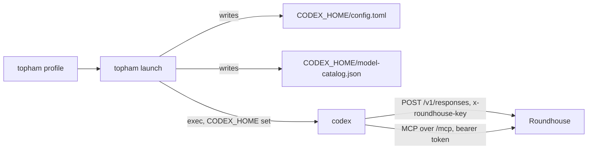

# Hook up Codex

This chapter tells how a stock [Codex CLI](https://github.com/openai/codex) connects to Roundhouse with no change to the client. It covers the generated files, the auth kinds, the real-binary suite, and the Codex facts behind them, each pinned to a revision.

## What the launch writes

`POST /v1/responses` is an OpenAI Responses API surface over the Roundhouse event log. `roundhouse_server::codex_launch` writes two files that point Codex at it: `config.toml` in the `CODEX_HOME` of the client, and the `model-catalog.json` that it names. The client needs no wrapper, patched binary, or forked provider. `topham launch` calls the generator. See [Launch with topham](topham.md). The generator can also emit three skill files under `CODEX_HOME/skills/` that tell the model when to use the control tools. `topham launch` does not write them.



Each entry of `config.toml` prevents a silent failure.

| Entry | Value | Why |
|---|---|---|
| `model` | `roundhouse-local` | Roundhouse ignores the model and routes by policy. A real OpenAI slug resolves client metadata that adds item types which Roundhouse refuses with 422. |
| `model_provider` and the table key | `roundhouse` | Codex resolves `model_provider` as a key into `[model_providers.*]`. |
| `model_catalog_json` | absolute path | A pinned catalog replaces the model fetch. See [The model catalog](#the-model-catalog). |
| `name` | `"Roundhouse"` | Never `"OpenAI"`. That name turns on remote compaction, zstd bodies, and a routing-hint header, and Roundhouse serves none of them. The test `the_provider_name_is_not_openai` pins it. |
| `wire_api`, `supports_websockets` | `"responses"`, `false` | Roundhouse serves SSE over POST and no websocket upgrade. |
| `requires_openai_auth`, `env_key` | set by the auth kind | See [Authentication kinds](#authentication-kinds). |
| `[model_providers.roundhouse.env_http_headers]` | `x-roundhouse-key = <key-env>` | The turn key rides its own header. The name is the router constant `TURN_KEY_HEADER`. |
| `[mcp_servers.roundhouse]` | `url`, `bearer_token_env_var` | The control surface. The table key sets the tool namespace `mcp__roundhouse`. |
| `default_tools_approval_mode` | `"approve"` | See [MCP approval](#mcp-approval). |
| `[features] use_agent_identity` | `false` | Agent identity is an OpenAI-backend credential mode. Roundhouse authenticates by turn key. |

The secret is never in a file. Both auth kinds name an environment variable, `ROUNDHOUSE_API_KEY` by default. The TOML is a template because each stanza carries a comment that records what it costs to get wrong, and a serializer drops comments.

## Authentication kinds

The auth kind is a property of the route. Set `requires_openai_auth = true` only when the upstream receives the caller's own login. Switchyard derives the flag per route from `caller_auth_kind` (`053a61e`), and `CodexAuthKind` mirrors that input.

| Kind | `requires_openai_auth` | `env_key` | Credential on `Authorization` |
|---|---|---|---|
| `CodexAuthKind::RoundhouseKey` | `false` | the key variable | the Roundhouse turn key |
| `CodexAuthKind::ForwardedOpenAiLogin` | `true` | none | the ChatGPT login of the client, forwarded upstream |

**`false` is always written with `env_key`.** At `codex-cli 0.146.0`, the flag does not gate the credential resolver (see the wire facts below). Without `env_key`, the provider sends whatever login sits in `CODEX_HOME` to the Roundhouse `base_url`, or no `Authorization` if there is no login. `env_key` makes the result deterministic.

**`true` is never written with `env_key`.** Codex resolves `env_key` before the login, so the pair silently turns forwarding off. Codex does not reject the pair (`e363b08`), so the generator enforces the rule.

**The forwarded kind needs a completed `codex login` in that `CODEX_HOME`.** The flag only selects a code path. The header comes from the `auth.json` that the login writes. Without it, Roundhouse admits the request and degrades the turn to local-only routing, and the run reports nothing. With a local fleet attached, turns keep answering and no frontier route happens. The shipped binary attaches no local fleet (`crates/roundhouse-server/src/main.rs`). The generated file and `topham plan` state this precondition. Under the forwarded kind, Codex drops an `env_http_headers` entry whose variable is unset, and Roundhouse then refuses the request as `missing_key`. Under `RoundhouseKey`, an unset `env_key` is a loud Codex error.

## The model catalog

The catalog is written under both auth kinds. The `GET {base_url}/models` fetch depends on the auth mode in `CODEX_HOME`, not on `requires_openai_auth`, so a bring-your-own-key client fetches too. A catalog on disk swaps in a static models manager with no network path. The entry follows the `ModelInfo` of the binary that reads it (`e363b08`), not the Cargo pin. The reader ignores unknown keys, so the entry over-specifies.

| Field | Value | Why |
|---|---|---|
| `shell_type` | `"shell_command"` | Decides the shell tool the model sees. A catalog without it does not load. |
| `context_window` | `272000` | Matches the fallback metadata of 0.146.0, so the pin does not change the compaction arithmetic of the client. |
| `auto_compact_token_limit` | `null` | A steered turn reports the context it admitted, not the usage of a model call. With a limit, the client rewrites its history from a number that describes no dispatch. Judge usage on the wire measured 1,147 tokens against a real input of 5,729, which tells the client its context collapsed. |
| `supports_search_tool` | `false` | This field alone gates `tool_search`, and Roundhouse refuses its call items with 422. An upstream flagship entry carries `true`, so a copied entry reopens the 422. |
| `include_skills_usage_instructions` | `true` | With skill files present, Codex adds its own "read the `SKILL.md` first" text. |

`CodexLaunch::new` refuses three inputs whose output loads but fails later:

- **A relative catalog path.** Codex resolves it against the directory of `config.toml`, and the client falls back to invented model metadata.
- **A base URL that does not end in `/v1`.** Every turn returns 404, but the MCP handshake uses the same string and succeeds, so the client looks healthy.
- **A catalog path that is not UTF-8.** TOML holds UTF-8 only, so the written path differs from the real one.

A trailing slash on the base URL is normalized.

## MCP approval

`default_tools_approval_mode = "approve"` is set server-wide. The eight control tools also carry truthful MCP annotations (`destructive_hint: false`, `open_world_hint: false`), so a client with no generated config runs them without a prompt. The config line covers a tool whose annotations are wrong or missing.

A per-tool grant for the read tools only was rejected. `codex exec` forces `approval_policy = "never"`, so an approval that nobody can answer resolves to *cancelled*. Without truthful annotations, that grant makes the writer tools fail. With them, it buys nothing.

## Conversations and compaction

Codex resends the whole conversation on every request. Roundhouse binds it to `thread-id`, then `session-id`, then `prompt_cache_key`, and admits only the suffix. See [Sessions and the event log](../concepts/sessions.md). Roundhouse refuses opaque compaction input items and does not serve `/v1/responses/compact`, and the generated provider name keeps Codex on local compaction.

## The gated real-binary suite

`crates/roundhouse-server/tests/codex_e2e.rs` spawns `codex exec` against a loopback Roundhouse with the generated config and doubles nothing on the client side.

```bash
timeout 300 cargo test -p roundhouse-server --features e2e-codex \
    --test codex_e2e -- --include-ignored --test-threads=1 --nocapture
```

`--test-threads=1` is required: each test owns a `CODEX_HOME`, and `codex exec resume --last` resolves "last" inside it. `ROUNDHOUSE_TEST_CODEX_BIN` overrides the `codex` on `PATH`, and a missing binary is a loud panic. See [Testing](../development/testing.md). The suite needs no network: loopback only, a pinned catalog, no login, and a cleared child environment.

- **The environment guard has a blind spot.** A test asserts the key set of the constructed command, but `Command::get_envs()` reports only explicit additions, so the guard cannot see a dropped `env_clear()`. The Claude Code suite catches that on the wire. Here no credential is consulted, so the wire shows nothing. The gap is documented, not covered.
- **Version.** The binary under test is `codex-cli 0.146.0` (tree `e363b08`, 2026-07-28). The conformance crates are pinned to `6344a65` (2026-08-13), and neither is an ancestor of the other. A version mismatch warns and does not fail.
- **Tool-result wrappers.** Codex wraps each tool result as `Wall time: …\nOutput:\n…` for MCP, or a `Chunk ID` / `Process exited` block for exec. Unhandled, `ToolFailureStreak` and `NoProgressRepeat` never fire on a real transcript. One seam strips the wrapper before either signal reads an output, and the stored item keeps the exact bytes. See [Validate and steer](../concepts/validate-steer.md).
- **Steering.** After a steer, the client resends the conversation extended, with every earlier item byte-identical. That keeps the session from forking.

## Codex as the conformance oracle

The conformance tests drive the endpoint through `codex-api`, the client crate of Codex, pinned by git revision as a dev-dependency. Codex silently drops a known item type that has a malformed body, so only its parser proves that Roundhouse never emits one. The tests check the event sequence, the `output_item.added`-before-delta order, terminal semantics, and the `cached_input_tokens` projection.

## Codex wire facts by revision

`e363b08` is `rust-v0.146.0`, the binary the suite drives. `6344a65` is the Cargo pin. `3b45c29` (2026-08-19) is later. `e363b08` and `6344a65` are siblings off merge-base `95637f7`.

| Fact | Revision | Roundhouse consequence |
|---|---|---|
| `resolve_provider_auth` never reads `requires_openai_auth`. It tries `env_key` or `experimental_bearer_token`, then the cached login, then no auth. `3b45c29` adds a gate: `false` with no `env_key`, token, or `auth` gives an unauthenticated provider. | `e363b08`, `6344a65` (gate at `3b45c29`) | `false` is written only with `env_key`. "Leave the flag unset and Codex attaches nothing" holds only from about `3b45c29`. |
| `load_auth` reads `CODEX_API_KEY`, `CODEX_ACCESS_TOKEN`, and `auth.json`, never `OPENAI_API_KEY`. | `e363b08` | An exported `OPENAI_API_KEY` is inert. Assert the `Authorization` header on the wire, not the flag in the file. |
| `requires_openai_auth = true` with no `env_key` forwards the ChatGPT login as `Authorization: Bearer`, plus `ChatGPT-Account-ID`, plus `X-OpenAI-Fedramp` for fedramp accounts. `use_agent_identity = true` makes `Authorization` an Agent-Identity assertion against `auth.openai.com`. | `3b45c29` | The forwarded kind. `exec` cannot refresh a ChatGPT token. The config sets `use_agent_identity = false`. |
| `is_openai()` is an exact, case-sensitive match on `name == "OpenAI"`. Unknown `config.toml` keys are ignored at load, and only `--strict-config` makes them errors. | `e363b08` | `name = "Roundhouse"`. The suite passes `--strict-config` so that drift is loud. |
| The `/models` fetch has a 5 s timeout, and failures are logged, not fatal. Refresh is on for ChatGPT, token, header, agent-identity, and personal-access-token auth, and off for API keys. A catalog that is not JSON, or has an empty `models` list, is a hard load error. | `e363b08` | The catalog is pinned under both kinds. |
| The catalog schema is `{"models":[ModelInfo,…]}`. Twelve keys have no default: `slug`, `display_name`, `supported_reasoning_levels`, `shell_type`, `visibility`, `supported_in_api`, `priority`, `base_instructions`, `support_verbosity`, `truncation_policy`, `supports_parallel_tool_calls`, `experimental_supported_tools`. `shell_type` is `default`, `local`, `unified_exec`, `disabled`, or `shell_command`. | `e363b08` | A generator test asserts all twelve. The shell tool is `shell_command` with one command string. |
| `session-id` names the whole agent family, and a sub-agent takes the family id. `thread-id` is per thread and is also sent as `x-client-request-id`. `prompt_cache_key` defaults to `session_id`. Sub-agents also send `x-codex-parent-thread-id` and `x-openai-subagent`. | `6344a65` (headers identical at `e363b08`) | History binds to `thread-id` first. Roundhouse reads none of the lineage fields. |
| The request has no `previous_response_id`. Codex sends `store: false`, the whole conversation as `input`, and strips item ids that have no prefix. | `6344a65` | Every turn is self-contained. Roundhouse checks it against its own log. |
| Three compaction paths exist: local (an ordinary `/responses` request), remote v1 (`/responses/compact`), and remote v2 (a `compaction_trigger` item). Remote paths need `is_openai()` or an Azure URL. Auto-compaction triggers at 90% of the context window. `x-codex-window-id` is `{thread_id}:{window_number}`, and the number advances only after a successful compaction. | `6344a65` | Codex compacts locally, at 244,800 tokens of 272,000. A config named `OpenAI` sends items that Roundhouse refuses. The window id feeds `window_changed`. |
| Usage on `response.completed` folds into a session total that drives auto-compaction. | `e363b08` | See `auto_compact_token_limit` above. |
| A `FunctionCall` carries `name` and `namespace` separately, and dispatch keys on the pair. On resend, `arguments` returns character for character and `namespace` survives. `id` is dropped unless it splits on `_` into two non-empty halves. An unanswered call gets a synthetic `"aborted"` output. | `e363b08` | The Responses surface stores the bare name with its namespace and emits both. Tests assert on parsed values, not bytes. |
| The default provider info sets `retry_429: false`. The one 429 body Codex reads is `error.type == "usage_limit_reached"` with `error.resets_at`. | `6344a65` | The fair-use refusal uses that body. |
| `exec` hard-codes `approval_policy: Never`, and a failed turn's stderr carries the error body of the server. | `e363b08` | The revoked-key test asserts on the stderr text. |

## Chaining Codex through NeMo Relay

The chained topology for Codex is unproven. NeMo Relay 0.8.2 launches Codex with `--config` overrides on argv: `model_provider="nemo-relay-openai"` and a provider table with `requires_openai_auth=true`. A Codex `--config` override outranks `config.toml`, so the client presents the proxy token of Relay and not the generated turn-key header. Relay strips its own token, and Roundhouse sees a turn with no credential. It admits the turn and degrades it to local-only routing.

`topham plan` states this and does not refuse it. The remedy is `[upstream] openai_auth_header` in Relay, which is untested. Other Relay facts on the OpenAI route, read at `ca08901` and unchanged at `1a54812`:

- With a ChatGPT login token (`Bearer eyJ` or `Bearer at-`) and no replacement key, Relay sends the turn to `https://chatgpt.com/backend-api/codex`. Roundhouse never sees it.
- With a replacement `OPENAI_API_KEY`, Relay strips the ChatGPT token and the key pays instead of the seat. Nothing on the wire says so.
- Relay re-serializes JSON through an alphabetizing map. `an_opaque_block_is_insensitive_to_key_order` guards admission against it.

## Limits

- Chained Codex is unproven, for the reason above.
- `a_real_codex_launched_through_topham_hooks_up` has never run, because no `codex` binary was available where it was written.
- No test makes a real `codex` dispatch an MCP `tools/call`. The upstream double of the rig emits assistant text only, and the rig has no seam for a scripted tool call. `a_real_codex_binary_is_correlated_by_the_thread_id_it_stamps` is an uncalled function for this reason. See [MCP control surface](../concepts/mcp.md).
- No real ChatGPT login has been forwarded. The forwarded stanza is tested with a crafted `auth.json`.
- The Responses surface refuses eight of the twelve item types that a 0.146.0 client can resend. The suite runs the one conversation shape that contains none of them.
- Roundhouse does not serve `/v1/models` or `/v1/responses/compact`.
