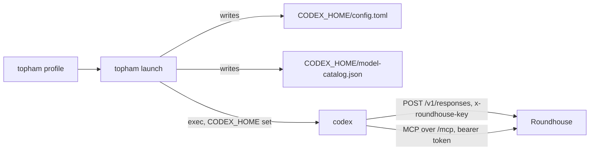

# Hook up Codex

This chapter tells how a stock [Codex CLI](https://github.com/openai/codex) connects to Roundhouse without changes to the client. It covers the generated files, the auth kinds, the gated real-binary suite, and the Codex facts behind them, each pinned to a revision.

## What the launch writes

`POST /v1/responses` is an OpenAI Responses API surface over the Roundhouse event log. The library function `roundhouse_server::codex_launch` writes the two files that point Codex at it:

- `config.toml`, which Codex reads from its `CODEX_HOME`.
- `model-catalog.json`, the model catalog that `config.toml` names.

Nothing else about the client changes. There is no wrapper, no patched binary, and no forked provider. The operator entry point that calls the generator is `topham launch`. See [Launch with topham](topham.md).



The generated `config.toml` holds these entries. Each one prevents a failure that is silent.

| Entry | Value | Why |
|---|---|---|
| `model` | `roundhouse-local` by default | Roundhouse ignores the model and routes by policy. A real OpenAI slug resolves client metadata that puts item types into the request that Roundhouse refuses with 422. |
| `model_provider` and the table key | `roundhouse` | Codex resolves `model_provider` as a key into `[model_providers.*]`. |
| `model_catalog_json` | absolute path | A pinned catalog replaces the model fetch. See [The model catalog](#the-model-catalog). |
| `name` | `"Roundhouse"` | Never `"OpenAI"`. Codex matches this name to turn on its routing-hint header, remote compaction, and zstd request bodies. Roundhouse serves none of the three. The test `the_provider_name_is_not_openai` pins it. |
| `wire_api` | `"responses"` | The only legal value. |
| `supports_websockets` | `false` | Roundhouse serves SSE over POST and no websocket upgrade. |
| `requires_openai_auth`, `env_key` | set by the auth kind | See [Authentication kinds](#authentication-kinds). |
| `[model_providers.roundhouse.env_http_headers]` | `x-roundhouse-key = <key-env>` | The turn key rides its own header. The header name comes from the router constant `TURN_KEY_HEADER`, not from a second literal. |
| `[mcp_servers.roundhouse]` | `url`, `bearer_token_env_var` | The control surface. The table key sets the tool namespace `mcp__roundhouse`. |
| `default_tools_approval_mode` | `"approve"` | See [MCP approval](#mcp-approval). |
| `[features] use_agent_identity` | `false` | Agent identity is an OpenAI-backend credential mode. Roundhouse authenticates by turn key. |

**The secret is never in a file.** Both auth kinds name an environment variable, `ROUNDHOUSE_API_KEY` by default. The turn key travels in the client environment at launch. A generator that took the secret puts an `rh_turn_…` value into a file that ends up in a dotfile repository.

**The TOML is a template, not a serialized struct.** Each stanza carries a comment that says what it costs to get wrong. A serializer drops the comments and reorders the tables.

`codex_launch` can also emit skill files under `CODEX_HOME/skills/`. They tell the model when to use the control tools. `topham launch` does not write them. See [MCP control surface](../concepts/mcp.md).

## Authentication kinds

The auth kind is a property of the route, not of the client version. Set `requires_openai_auth = true` only when the upstream receives the caller's own login. Other launchers agree: NeMo Relay hardcodes `true` (`ca08901`), and Switchyard derived the flag per route from `caller_auth_kind` (`053a61e`). The two `CodexAuthKind` values mirror that input.

| Kind | `requires_openai_auth` | `env_key` | Credential on `Authorization` |
|---|---|---|---|
| `CodexAuthKind::RoundhouseKey` | `false` | the key variable | the roundhouse turn key |
| `CodexAuthKind::ForwardedOpenAiLogin` | `true` | none | the client's own ChatGPT login, forwarded upstream by Roundhouse |

**`false` is always written with `env_key`, never without it.** At `codex-cli 0.146.0`, the flag does not gate the credential resolver. A provider with no `env_key` sends whatever login sits in `CODEX_HOME` to the Roundhouse `base_url`. If `CODEX_HOME` holds no login, the request has no `Authorization` at all. `env_key` makes the resolution deterministic in both cases.

**`true` is never written with `env_key`.** Codex resolves `env_key` before the login. An `env_key` beside `true` silently turns the forwarding off. Codex itself does not reject the pair, so the generator enforces it.

**The forwarded kind needs a completed `codex login` in that `CODEX_HOME`.** The flag only selects a code path. The `Authorization` header comes from the `auth.json` that the login writes, and from nothing else. Without the login, requests arrive with no credential. Roundhouse admits such a request and degrades the turn to local-only routing. Turns keep answering, and no frontier route happens. The generated file and `topham plan` both state this precondition.

Under the forwarded kind, Codex drops an `env_http_headers` entry whose variable is unset or blank. The request then carries only the seat's `Authorization`. Roundhouse refuses it as `missing_key` and names the dedicated header. Under `RoundhouseKey`, an unset `env_key` is a loud Codex error (`CodexErr::EnvVar`).

## The model catalog

The catalog is written under both auth kinds. The `GET {base_url}/models` fetch is gated on the ambient auth mode in `CODEX_HOME`, not on `requires_openai_auth`. So a bring-your-own-key client fetches too. A catalog on disk swaps in a static models manager that has no network path. That also makes the real-binary suite hermetic.

The catalog entry is written against the `ModelInfo` of the binary that reads it (`e363b08`), not the Cargo pin. The two differ. Missing required keys are a hard load error and unknown keys are ignored, so the entry over-specifies.

| Field | Value | Why |
|---|---|---|
| `shell_type` | `"shell_command"` | Decides the shell tool the model sees. A catalog that omits it does not load. |
| `context_window` | `272000` (`CONTEXT_WINDOW_TOKENS`) | Matches the fallback metadata of 0.146.0, so pinning the catalog does not change the client's compaction arithmetic. |
| `auto_compact_token_limit` | `null` | Roundhouse reports the judge's usage on a steered turn. With a limit, the client rewrites its history from a number that describes a side call. |
| `supports_search_tool` | `false` | This field alone gates the `tool_search` tool. Its call items are refused with 422 by the Responses surface. An upstream flagship entry carries `true`, so a copied entry reopens the 422. |
| `include_skills_usage_instructions` | `true` | With skill files present, Codex adds its own "read the `SKILL.md` first" instructions. |

## Refused inputs

`CodexLaunch::new` refuses three inputs whose output loads but fails later:

- **A relative catalog path.** Codex resolves it against the directory of `config.toml`, not the working directory of the generator. The client then falls back to invented model metadata.
- **A base URL that does not end in the API prefix `/v1`.** Every turn returns 404. The MCP handshake uses the same string and still succeeds, so the client looks healthy.
- **A catalog path that is not UTF-8.** TOML holds UTF-8 only, so the written path differs from the one on disk.

A trailing slash on the base URL is normalized, not refused.

## MCP approval

`default_tools_approval_mode = "approve"` is set server-wide. The eight control tools also carry truthful MCP annotations (`destructive_hint: false`, `open_world_hint: false`), so a client with no generated config runs them without a prompt. The config line is the second layer. It admits a tool whose annotations are wrong or missing.

A per-tool grant for the read tools only was rejected. `codex exec` forces `approval_policy = "never"`. Under that policy, an approval that nobody can answer resolves to *cancelled*. Without truthful annotations, that grant makes the writer tools fail permanently. With the annotations, the grant buys nothing.

## Sessions and context signals

Codex resends the complete conversation on every request. The Responses surface binds that history to `thread-id`, then `session-id`, then `prompt_cache_key`, in that order, inside the caller's namespace. It admits only the suffix past the stored prefix. A history rewrite starts a new internal generation. A request with no conversation identity is refused. See [Sessions and the event log](../concepts/sessions.md).

The response header `x-roundhouse-context-signal` reports one of `first_seen`, `prefix_unchanged`, `prefix_changed`, `history_rewritten`, or `window_changed`. The last one compares the `x-codex-window-id` header. These values are observations, not proof of compaction: compaction can keep the first user message, and a prompt edit can change it. They are node-local and reset on restart. Structured logs report the signal without prompt content.

Roundhouse forwards the supplied `session-id`, `thread-id`, and `prompt_cache_key` to its OpenAI Responses provider. The cache key stays independent of the internal history generation. If no cache key is supplied, Roundhouse computes a 64-character SHA-256 digest. Its input is the canonical system and developer messages before the first user message, then that user message.

Roundhouse refuses opaque compaction input items and does not serve `/v1/responses/compact`. The generated provider name keeps Codex on local compaction, which is an ordinary `/v1/responses` request.

A fair-use refusal answers 429 with `error.type = "usage_limit_reached"` and `error.resets_at`. That is the one 429 body Codex reads.

## The gated real-binary suite

`crates/roundhouse-server/tests/codex_e2e.rs` spawns `codex exec` against a loopback Roundhouse with the generated config. It doubles nothing on the client side.

```bash
timeout 300 cargo test -p roundhouse-server --features e2e-codex \
    --test codex_e2e -- --include-ignored --test-threads=1 --nocapture
```

| Part | Purpose |
|---|---|
| `--features e2e-codex` | Compiles the file. |
| `--include-ignored` | Opts in to spawning processes. |
| `--test-threads=1` | Each test owns a `CODEX_HOME`, and `codex exec resume --last` resolves "last" inside it. |
| `ROUNDHOUSE_TEST_CODEX_BIN` | Overrides the `codex` found on `PATH`. |
| `ROUNDHOUSE_TEST_TOPHAM_BIN` | Names a freshly built `topham` for the launcher test. |

When opted in, a missing binary is a loud panic that names the variable, not a silent skip. The suite needs no network: loopback only, a pinned catalog, no login, and a cleared child environment.

**What the environment guard can see.** A test asserts the key set of the constructed command. `Command::get_envs()` reports only the explicit additions. So the guard checks what the harness adds, and it cannot see a dropped `env_clear()` or an ambient variable that rides through. The shared harness in `tests/common/e2e.rs` carries this fact as a test. The Claude Code suite closes the gap on the wire. Here no credential is ever consulted, so the wire has nothing to show. The gap is documented, not covered.

**Version vigilance.** The binary under test is `codex-cli 0.146.0` (tree `e363b08`, 2026-07-28). The conformance crates are pinned to `6344a65` (2026-08-13). Neither is an ancestor of the other. The suite prints the version on every run. A mismatch warns and does not fail, so a new release does not change the meaning of a green run silently.

**Tool-result wrappers.** Codex wraps every tool result before it becomes a `function_call_output`: `Wall time: …\nOutput:\n…` for MCP, and a `Chunk ID` / `Process exited` block for exec. Without handling, the `ToolFailureStreak` and `NoProgressRepeat` signals never fire on a real transcript. One seam strips the wrapper before either signal reads an output. The stored item keeps the client's exact bytes, because prefix admission depends on them. See [Validate and steer](../concepts/validate-steer.md).

The steered-turn test asserts that the turn after a steer resends the conversation *extended*: every earlier item comes back byte-identical, with the new items appended. That is what keeps the session from forking.

## Codex as the conformance oracle

The conformance tests do not re-implement the spec. They depend on Codex's own client crates (`codex-api`, pinned by git revision as dev-dependencies). They drive the Roundhouse endpoint through the parser that a real agent runs.

This catches a failure class that a hand-written spec test cannot. Codex silently drops a known item type that has a malformed body, so only its parser can prove that Roundhouse never emits one. The suite covers:

- the full event sequence
- the `output_item.added`-before-delta order that the client enforces
- terminal semantics: `response.completed` ends the stream, and `response.failed` and `response.incomplete` require the server to close the body
- usage projection: `cached_input_tokens` lands in `input_tokens_details.cached_tokens`
- a real-socket round trip through the Codex HTTP stack.

## Codex wire facts by revision

These are external facts about Codex. Each row names the revision it was read at. Revisions: `e363b08` is `rust-v0.146.0`, the binary the suite drives. `6344a65` is the Cargo pin. `3b45c29` (2026-08-19) is a later revision. `e363b08` and `6344a65` are siblings off merge-base `95637f7`.

| Fact | Revision | Roundhouse consequence |
|---|---|---|
| `resolve_provider_auth` never reads `requires_openai_auth`. It tries `env_key` or `experimental_bearer_token`, then the cached login, then no auth. | `e363b08`, `6344a65` | `false` is written only with `env_key`. |
| `3b45c29` adds a gate: `false` with no `env_key`, token, or `auth` yields an unauthenticated provider. | `3b45c29` | "Leave the flag unset and Codex attaches nothing" is true only from about this revision. The generator rule is safe at all three. |
| `load_auth` reads `CODEX_API_KEY`, `CODEX_ACCESS_TOKEN`, and `auth.json`, never `OPENAI_API_KEY`. | `e363b08` | An exported `OPENAI_API_KEY` is inert for this provider. Assert the `Authorization` header on the wire, not the flag in the file. |
| `requires_openai_auth = true` with no `env_key` forwards the ChatGPT login as `Authorization: Bearer`, plus `ChatGPT-Account-ID`, plus `X-OpenAI-Fedramp` for fedramp accounts. A 401 buys one auth-recovery attempt and one retry. | `3b45c29` | The forwarded kind. `exec` cannot refresh a ChatGPT token. |
| `ModelProviderInfo::validate()` does not reject `env_key` beside `requires_openai_auth = true`. | `e363b08` | The generator enforces the exclusion. |
| With `requires_openai_auth = false`, a non-empty `OPENAI_ACTOR_AUTHORIZATION_HEADER` in `http_headers` turns on actor authorization. | `e363b08` | The generated config never names that header. |
| `use_agent_identity = true` makes `Authorization` an Agent-Identity assertion bootstrapped against `auth.openai.com`. | `3b45c29` | Pinned to `false`. |
| `is_openai()` is an exact, case-sensitive match on `name == "OpenAI"`. It turns on metadata passthrough, zstd compression under ChatGPT auth, and remote compaction. | `e363b08` | `name = "Roundhouse"`. |
| Unknown `config.toml` keys are ignored at load. Only `--strict-config` makes them errors. `request_max_retries` and `stream_max_retries` are provider-scoped. | `e363b08` | The suite passes `--strict-config` so that drift is loud. |
| `model_catalog_json` is an absolute path, relative paths resolve against the config directory. The `/models` fetch has a 5 s timeout and failures are logged, not fatal. Refresh is on for ChatGPT, token, header, agent-identity, and personal-access-token auth, off for API keys. | `e363b08` | The catalog is pinned under both kinds. |
| The catalog schema is `{"models":[ModelInfo,…]}`. Twelve keys have no default: `slug`, `display_name`, `supported_reasoning_levels`, `shell_type`, `visibility`, `supported_in_api`, `priority`, `base_instructions`, `support_verbosity`, `truncation_policy`, `supports_parallel_tool_calls`, `experimental_supported_tools`. | `e363b08` | A generator test asserts all twelve. |
| `session-id` names the whole agent family. A sub-agent takes the family id, and a resumed sub-agent restores its parent's. `thread-id` is per thread and is also sent as `x-client-request-id`. `prompt_cache_key` defaults to `session_id`. | `6344a65`, headers identical at `e363b08` | History binds to `thread-id` first. |
| The HTTP request has no `previous_response_id`. Codex sends `store: false`, the whole conversation as `input`, and strips item ids that have no prefix. | `6344a65` | Every turn is self-contained. Roundhouse checks it against its own log. |
| Sub-agents send `x-codex-parent-thread-id` and `x-openai-subagent`. Turn metadata carries `parent_thread_id`, `forked_from_thread_id`, `root_turn_id`, `subagent_kind`, and `request_kind`. Defaults: at most 6 agent threads, depth 1. | `6344a65` | Roundhouse reads none of these lineage fields. |
| Three compaction paths: local (an ordinary `/responses` request), remote v1 (`/responses/compact`), and remote v2 (a `compaction_trigger` item). Remote paths need `is_openai()` or an Azure URL. Auto-compaction triggers at 90% of the context window. | `6344a65` | Codex compacts locally against Roundhouse. With 272,000 tokens, that is at 244,800. A config named `OpenAI` sends items that Roundhouse refuses. |
| `x-codex-window-id` is `{thread_id}:{window_number}`. The number advances only after a successful compaction. | `6344a65` | Feeds `window_changed`. |
| Usage on `response.completed` folds into a session total that drives auto-compaction. | `e363b08` | Folding judge usage into the reported usage brings compaction forward silently. |
| Default provider info sets `retry_429: false`. The one 429 body Codex reads is `error.type == "usage_limit_reached"` with `error.resets_at`. | `6344a65` | The fair-use refusal uses that body. |
| A `FunctionCall` carries `name` and `namespace` separately. Dispatch keys on the pair. MCP names are `mcp__<server>__<tool>`, sanitized and at most 64 bytes. | `e363b08` | The Responses surface stores the bare name with its namespace and re-emits both. |
| On resend, `arguments` returns character for character and `namespace` survives. `id` is dropped unless it splits on `_` into two non-empty halves. An unanswered call gets a synthetic `"aborted"` output. | `e363b08` | Tests assert on parsed values, not bytes. |
| The shell tool is `shell_command` with a single command string. There is no tool named `shell`. | `e363b08` | Follows from `shell_type = "shell_command"`. |
| `exec` hard-codes `approval_policy: Never`. `-a` is not an `exec` flag. `--full-auto` warns at `e363b08` and is gone at `6344a65`. JSONL events: `thread.started`, `turn.started`, `turn.completed`, `turn.failed`, `item.*`, `error`. | `e363b08` | The suite uses `--json` and `-o <file>`. |
| A failed turn's stderr carries the server's own error body. | `e363b08` | The revoked-key test asserts on that text. |
| `[mcp_servers.*]` with `url` and `bearer_token_env_var` is streamable HTTP with `Authorization: Bearer <$ENV>`. A configured token outranks a ChatGPT login. | `e363b08` | The MCP stanza reuses the key variable. |

## Chaining Codex through NeMo Relay

The chained topology for Codex is unproven. NeMo Relay 0.8.2 launches Codex with `--config` overrides on argv: `model_provider="nemo-relay-openai"` and a provider table with `requires_openai_auth=true`. A Codex `--config` override outranks `config.toml`. So the client presents Relay's proxy token and not the generated turn-key header. Relay strips its own token, and Roundhouse sees a credential-less turn. It admits the turn and degrades it to local-only routing.

`topham plan` states this on a chained Codex profile and does not refuse it. The remedy is Relay's `[upstream] openai_auth_header`, which is the untested fallback wiring. See [Launch with topham](topham.md).

Other Relay facts on the OpenAI route, read at Relay `ca08901` and unchanged at `1a54812`:

- With a ChatGPT login token (`Bearer eyJ` or `Bearer at-`) and no replacement key, Relay sends the turn to `https://chatgpt.com/backend-api/codex`. The configured base URL is not consulted, and Roundhouse never sees the turn.
- With a replacement `OPENAI_API_KEY`, Relay strips the ChatGPT token and the key pays instead of the seat. Nothing on the wire says so.
- Relay decodes and re-serializes JSON through an alphabetizing map. Roundhouse does not enable `serde_json`'s `preserve_order`. The test `an_opaque_block_is_insensitive_to_key_order` guards the admission side.
- Relay gates versions at Codex 0.143.0 or newer.

## Limits

- Chained Codex is unproven, for the reason above.
- The test that launches a real `codex` through a real `topham` (`a_real_codex_launched_through_topham_hooks_up`) has never run. No `codex` binary was available where it was written.
- No test in this tree drives a real `codex` dispatch of an MCP `tools/call`. Nothing here emits a tool call that a Codex client routes to MCP. The thread-id correlation is proved against a captured `_meta` shape. The test `a_real_codex_binary_is_correlated_by_the_thread_id_it_stamps` is written and ignored.
- The forwarded-login stanza is exercised with a crafted `auth.json`. No real ChatGPT login has been forwarded through this code.
- The Responses surface refuses eight of the twelve item types that a 0.146.0 client can resend. The real-binary suite runs the one conversation shape that contains none of them.
- Roundhouse does not serve `/v1/models` or `/v1/responses/compact`.
- `topham launch` does not write the Codex skill files.
