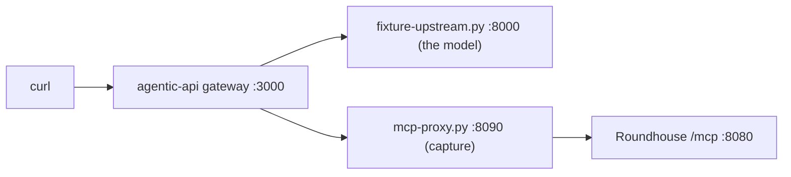

# Run the examples

The `examples/` directory has two configuration files to copy and one compatibility test. This chapter says what each one is for and how to run it.

## Configuration files

| File | Use |
|---|---|
| `examples/catalog.example.json` | The rate card that the router and the dashboard share. Copy it, then set `ROUNDHOUSE_CATALOG` to your copy. See [Configure providers and the catalog](catalog.md). |
| `examples/control-plane.example.json` | The tenancy file. Copy it, then set `ROUNDHOUSE_CONTROL_PLANE` to your copy. See [Configure tenancy and keys](tenancy.md). |

Tests in the workspace parse both files. An example that stops loading turns the suite red.

Both files hold placeholders. Every price in the catalog is zero. Every `key_sha256` in the control-plane file is the hash of a placeholder string, so the file authenticates nobody until you replace the hashes. The file never holds a secret, only the hash of a key.

The control-plane example names a local model in its efficient tier and promises local service when a window is spent. The shipped binary attaches no local fleet. So the binary refuses to boot on the unmodified file, and the error names the keys and the capacity that they lack. Edit the tiers before you start a server with it.

## The agentic-api compatibility test

`examples/agentic-api-mcp/` is a compatibility test. It is not a demonstration of the product. It points the MCP client of [vLLM agentic-api](https://github.com/vllm-project/agentic-api) at the `/mcp` mount of Roundhouse and drives one scripted turn through it. Its full README is at [`examples/agentic-api-mcp/README.md`](https://github.com/ryanolson/roundhouse/blob/main/examples/agentic-api-mcp/README.md).

It proves that the control surface works with a second gateway's MCP client, with its tool-name flattening, and with its bearer forwarding. It proves nothing about routing. In this topology the Responses turn goes to agentic-api, so Roundhouse never sees it.

### Four topologies

| | The Responses turn goes to | The MCP client is | Tool name the model sees | Runs? | Do the control tools mean anything? |
|---|---|---|---|---|---|
| A | Roundhouse | Codex | namespace `mcp__roundhouse` and the bare name `status` | Yes | Yes. Roundhouse owns the turn. |
| A′ | agentic-api | Codex | `agentic_ns__mcp__roundhouse__status` | Yes | No |
| B | agentic-api | agentic-api, from its own config file | `mcp__roundhouse__status` | No. It needs a request-side `type: "mcp"` tool, which Codex never sends. | Not applicable |
| C | agentic-api | agentic-api, from the request body | `mcp__roundhouse__status` | Yes, from a non-Codex client | No |

The example is topology C. Topology A carries the product: an agent hooks up to Roundhouse, and Roundhouse owns the turn. A real `codex` binary tests A elsewhere in this repository. Topology C exists because it is the only way to put a different MCP client in front of the surface. A surface that only one client has ever used carries the bugs of that client.

### What runs



- `fixture-upstream.py` plays the model. It answers `POST /v1/responses` with Responses SSE. On turn 1 it calls whatever MCP tool agentic-api forwarded. On turn 2 it quotes the tool output. No GPU and no vLLM are involved.
- `mcp-proxy.py` records every JSON-RPC exchange. The test needs it because it claims that the bearer from the request body reached Roundhouse. Roundhouse does not log a caller's key. The proxy records `sha256(secret)`, which is the form that `control-plane.json` holds. No credential is written to disk.
- `control-plane.json` makes `/mcp` demand a key. With no control plane, every caller is the open principal, and the forwarding test proves nothing.
- `request.json` is the request. It has a `type: "mcp"` tool with `server_url`, `authorization`, and `require_approval: "never"`. The last field is mandatory for a server that the gateway did not configure. `"never"` is the only value that agentic-api accepts.

The request sets `parallel_tool_calls: true` on purpose. At an earlier pin of agentic-api, that setting was rejected beside a built-in tool. The pinned revision forces it to `false` upstream. The run asserts that the forced `false` arrives at the fixture.

### Run it

agentic-api pins Rust 1.98.0, and this repository pins 1.96.1. So build agentic-api separately, outside this tree, with its own target directory.

```bash
git clone https://github.com/vllm-project/agentic-api /tmp/agentic-api
cd /tmp/agentic-api && git checkout e35fbb2
CARGO_TARGET_DIR=/tmp/agentic-target rustup run 1.98.0 cargo build -p agentic-server
```

Then run the script from any directory.

```bash
export AGENTIC_BIN=/tmp/agentic-target/debug      # holds `agentic` and `agentic-server`
bash examples/agentic-api-mcp/run.sh
```

`run.sh` builds `roundhouse-server` unless `ROUNDHOUSE_BIN` is set. It starts the four processes, posts the request, prints the SSE stream, checks nine assertions, and stops everything on exit. The exit status is 0 only if every assertion passed.

| Variable | Meaning |
|---|---|
| `AGENTIC_BIN` | Directory that holds the `agentic` and `agentic-server` binaries. |
| `ROUNDHOUSE_BIN` | A prebuilt `roundhouse-server`. If unset, the script builds one. |
| `RH_PORT`, `PROXY_PORT`, `UPSTREAM_PORT`, `GATEWAY_PORT` | Ports of the four processes. |
| `WORK` | Directory for the transcript. The default is a temporary directory. |

The transcript stays in `$WORK`: `mcp-capture.jsonl`, `upstream-capture.jsonl`, `sse.txt`, `roundhouse.log`, and `agentic.log`.

### What a passing run proves

1. The agentic-api MCP client (rmcp 1.8.0) completes `initialize`, `tools/list`, and `tools/call` against the Roundhouse server (rmcp 3.1.3). Both settle on protocol version `2025-06-18`.
2. The `authorization` field of the request arrives as `Authorization: Bearer <key>` on every MCP request of the session. It is the key that the control plane knows.
3. `tools/list` answers with all eight tools. The five that `allowed_tools` admits reach the model as `mcp__roundhouse__<tool>`, without hashing, without sanitizing, without collisions, and under the 64-character cap.
4. A tool result, including an error result, goes back into the model's context as an ordinary tool output. The next turn of the model can quote it.

### What it does not prove

The control tools have no session to answer about, and the run shows it. The `status` tool answers: `this key has no conversation yet; start a turn before asking about one`. Every session tool resolves a conversation from the caller's own `prompt_cache_key`. In topology C, Roundhouse never routed the turn, so there is no log to read. The gateway shows the refusal as an `mcp_call` with `status: "failed"`, and the turn still completes.

Also:

- The client is a `curl` script, not a coding agent. Codex cannot send this request. The `ToolSpec` of Codex has five arms (`function`, `namespace`, `tool_search`, `web_search`, `custom`) and no `mcp` arm. This was the same at Codex commits `6344a65` and `e363b08`. So topology B is out of reach through Codex.
- The model is a fixture that always calls the tool. The run is no evidence that a real model chooses to call it.
- Every tool states its MCP annotations, and `status` is read-only. A run that uses the current tool list reports `read_only` as `true` for `status`. agentic-api derives the value from the `read_only_hint` annotation and defaults to `false` when there is none.

### Why agentic-api is not a dependency

Roundhouse does not depend on agentic-api as a crate. The reasons, read at agentic-api commit `d59d4b4`:

- Its default TLS feature pulls OpenSSL into any consumer. The Dynamo `deny.toml` and this manifest ban OpenSSL.
- Its lock file carries two major versions of `reqwest`.
- It uses rmcp 1.8, and Roundhouse uses rmcp 3.1. Both in one process make two MCP stacks.
- It needs Rust 1.98.0, and this repository pins 1.96.1.
- Its `[mcp_servers.*].headers` takes a literal bearer, with no indirection through an environment variable.
- It assumes one upstream. So vLLM behind agentic-api is at most one more local target shape beside Dynamo: one agentic-api for each vLLM deployment. It is never a front for a whole Dynamo fleet.
