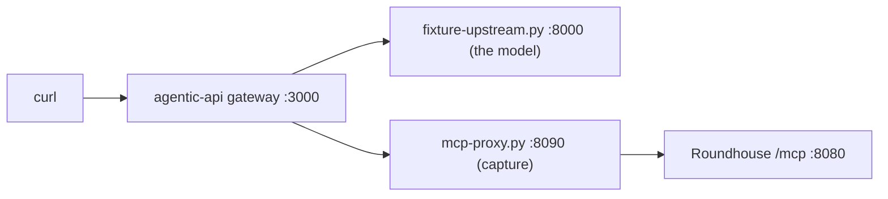

# Run the examples

The `examples/` directory has two configuration files to copy and one compatibility test. This chapter says what each one is for and how to run it.

## Configuration files

| File | Use |
|---|---|
| `examples/catalog.example.json` | The rate card that the router and the dashboard share. Copy it and set `ROUNDHOUSE_CATALOG` to your copy. See [Configure providers and the catalog](catalog.md). |
| `examples/control-plane.example.json` | The tenancy file. Copy it and set `ROUNDHOUSE_CONTROL_PLANE` to your copy. See [Configure tenancy and keys](tenancy.md). |

Tests parse both files, so an example that stops loading turns the suite red. Both hold placeholders. Every catalog price is zero. Every `key_sha256` hashes a placeholder string, so the control-plane file authenticates nobody until you replace the hashes.

The control-plane example promises local service when a window is spent. The shipped binary attaches no local fleet, so it refuses to boot on the unmodified file and names what is missing. Edit the tiers first.

## The agentic-api compatibility test

`examples/agentic-api-mcp/` is a compatibility test, not a demonstration of the product. It points the MCP client of [vLLM agentic-api](https://github.com/vllm-project/agentic-api) at the Roundhouse `/mcp` mount and drives one scripted turn through it. See its [README](https://github.com/ryanolson/roundhouse/blob/main/examples/agentic-api-mcp/README.md).

It proves that the control surface works with a second gateway's MCP client, its tool-name flattening, and its bearer forwarding. It proves nothing about routing: the Responses turn goes to agentic-api, and Roundhouse never sees it.

### Four topologies

| | The Responses turn goes to | The MCP client is | Tool name the model sees | Runs? | Do the control tools mean anything? |
|---|---|---|---|---|---|
| A | Roundhouse | Codex | namespace `mcp__roundhouse` and the bare name `status` | Yes | Yes. Roundhouse owns the turn. |
| A′ | agentic-api | Codex | `agentic_ns__mcp__roundhouse__status` | Yes | No |
| B | agentic-api | agentic-api, from its own config file | `mcp__roundhouse__status` | No. It needs a request-side `type: "mcp"` tool, which Codex never sends. | Not applicable |
| C | agentic-api | agentic-api, from the request body | `mcp__roundhouse__status` | Yes, from a non-Codex client | No |

The example is topology C. Topology A carries the product, and the real-`codex` suite tests its Responses half. C is the only way to put a different MCP client in front of the surface. A surface that only one client has used carries that client's bugs.

### What runs



- `fixture-upstream.py` plays the model with Responses SSE, with no GPU and no vLLM. On turn 1 it calls whatever MCP tool agentic-api forwarded, and on turn 2 it quotes the tool output.
- `mcp-proxy.py` records every JSON-RPC exchange, because Roundhouse does not log a caller's key. It records `sha256(secret)`, the form that `control-plane.json` holds, so no credential reaches disk.
- `control-plane.json` makes `/mcp` demand a key. Without it, every caller is the open principal, and the forwarding check proves nothing.
- `request.json` has a `type: "mcp"` tool with `server_url`, `authorization`, and `require_approval: "never"`, the only value agentic-api accepts for a server it did not configure.

The request sets `parallel_tool_calls: true` on purpose, and the run asserts that the gateway forces it to `false` upstream.

### Run it

agentic-api pins Rust 1.98.0 and this repository pins 1.96.1, so build agentic-api outside this tree.

```bash
git clone https://github.com/vllm-project/agentic-api /tmp/agentic-api
cd /tmp/agentic-api && git checkout e35fbb2
CARGO_TARGET_DIR=/tmp/agentic-target rustup run 1.98.0 cargo build -p agentic-server
```

Then run the script from any directory.

```bash
export AGENTIC_BIN=/tmp/agentic-target/debug      # holds `agentic` and `agentic-server`
bash examples/agentic-api-mcp/run.sh
```

`run.sh` starts the four processes, posts the request, prints the SSE stream, checks nine assertions, and stops everything on exit. It exits 0 only if every assertion passed.

| Variable | Meaning |
|---|---|
| `AGENTIC_BIN` | Directory that holds the `agentic` and `agentic-server` binaries. Required. |
| `ROUNDHOUSE_BIN` | A prebuilt `roundhouse` binary. If unset, the script builds the `roundhouse-server` crate and uses `target/debug/roundhouse`. |
| `RH_PORT`, `PROXY_PORT`, `UPSTREAM_PORT`, `GATEWAY_PORT` | Ports of the four processes. Defaults 8080, 8090, 8000, 3000. |
| `WORK` | Directory for the transcript. Default: a new temporary directory. |

The transcript stays in `$WORK`: `mcp-capture.jsonl`, `upstream-capture.jsonl`, `sse.txt`, `roundhouse.log`, and `agentic.log`.

### What a passing run proves

1. The agentic-api MCP client (rmcp 1.8.0) completes `initialize`, `tools/list`, and `tools/call` against the Roundhouse server (rmcp 3.1.3), on protocol version `2025-06-18`.
2. The request's `authorization` field arrives as `Authorization: Bearer <key>` on every MCP request, and the control plane knows the key.
3. `tools/list` returns all eight tools. The five that `allowed_tools` admits reach the model as `mcp__roundhouse__<tool>`: not hashed, not sanitized, without collisions, and under the 64-character cap.
4. A tool result, including an error result, returns to the model as an ordinary tool output that its next turn can quote.

### What it does not prove

- The control tools have no session to answer about. `status` answers `this key has no conversation yet; start a turn before asking about one`, because Roundhouse never routed the turn. The gateway shows an `mcp_call` with `status: "failed"`, and the turn completes.
- The client is a `curl` script. At Codex `6344a65` and `e363b08`, the Codex `ToolSpec` has five arms (`function`, `namespace`, `tool_search`, `web_search`, `custom`) and no `mcp` arm. So Codex cannot send this request or reach topology B.
- The model is a fixture that always calls the tool, so the run says nothing about whether a real model would.
- `status` publishes `read_only_hint: true`, which agentic-api at `e35fbb2` reports as `read_only` (default `false`).

### Why agentic-api is not a dependency

Read at agentic-api commit `d59d4b4`:

- Its default TLS feature pulls in OpenSSL, which the Dynamo `deny.toml` bans and this workspace also avoids.
- Its lock file carries two major versions of `reqwest`.
- It uses rmcp 1.8 against our 3.1, so one process would hold two MCP stacks.
- It needs Rust 1.98.0 against our 1.96.1.
- Its `[mcp_servers.*].headers` takes a literal bearer, with no environment-variable indirection.
- It assumes one upstream. So vLLM behind it is at most one more local target shape, with one agentic-api per vLLM deployment. It is never a front for a Dynamo fleet.
