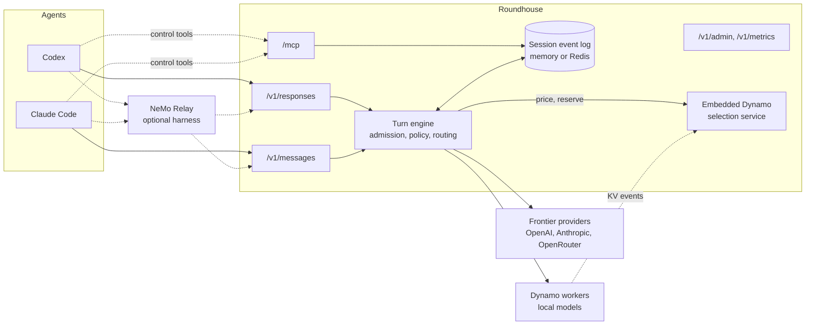

# Introduction

This chapter says what Roundhouse is, why it keeps state, and what it does today. It ends with a map of the rest of this book.

## What Roundhouse is

Roundhouse is a stateful front-end for agentic coding agents. It sits in front of [Dynamo](https://github.com/ai-dynamo/dynamo) and in front of the public endpoints of the frontier labs.

The product in one sentence: agentic coding agents (Codex, Claude Code) transparently hook up to Roundhouse and, through it, take advantage of NeMo Relay and Switchyard. They reach local models that Dynamo serves and frontier-lab models through their public endpoints. Each turn is routed to co-optimize function, cost, and time to solution.

Each part of that sentence has a consequence in the design:

- **Transparently.** The agent's own stack does not change. Pass-through auth, prefix admission of resent history, and the MCP control surface make the hookup invisible to the agent.
- **Through it.** Roundhouse owns the turn: the durable log, the policy, the budgets, the routing, and the steering. NeMo Relay owns the harness. Switchyard contributes routing ideas and judge prompts. Dynamo owns the GPUs.
- **Co-optimize all three.** A router that optimizes only cost ships worse answers. A router that optimizes only quality is a thin proxy to a frontier lab. A router that ignores latency slows the agent loop. So each routing decision carries a quality prior, an exact price, and an expected time to first token (TTFT) together.

## Why state makes routing possible

A coding agent sends its whole conversation again on every turn. At 100k tokens of context or more, and hundreds of turns, that resend is the largest cost of agentic work. It costs bytes on the wire, prefill compute, and money.

Roundhouse keeps the conversation in a durable log. The client continues to send its full history, and Roundhouse admits only the new suffix. See [Sessions and the event log](concepts/sessions.md).

Because Roundhouse holds the exact token prefix, it can ask which engine already has that prefix in its KV cache. It can then route the turn to that engine. Statefulness and routing are not two separate features. The first is what makes the second possible. See [Routing and the selection service](concepts/routing.md).

## How the parts connect

- An agent sends each turn to the surface for its wire dialect. Codex uses the OpenAI Responses API at `/v1/responses`. Claude Code uses the Anthropic Messages API at `/v1/messages`.
- The agent can run directly or under NeMo Relay. Relay can also read a session in its own formats. See [NeMo Relay formats](operations/relay-formats.md).
- The turn engine admits the turn, applies the caller's policy and budget, and prices each admitted target. It then dispatches to a local Dynamo worker or to a frontier provider.
- Every step writes to one append-only log per session. The MCP surface, the metrics, and the Relay exports read that log.

## What it does today

- **Two serve surfaces over one log.** An unmodified Codex points at `/v1/responses`. An unmodified Claude Code points at `/v1/messages`. A native HTTP/SSE surface serves the same engine.
- **Durable sessions.** A Redis Streams store holds the event log, the spend ledger, the fair-use windows, the correlation maps, and the admin directory. Without Redis, all of these live in process memory. See [Deploy with Redis](operations/redis.md).
- **Tenancy and money.** A control plane holds projects, users, memberships, keys, per-key policy, budgets, and rolling fair-use windows. An admin REST plane changes it at runtime. See [Control plane](concepts/control-plane.md).
- **Routing.** An embedded Dynamo selection service prices local workers. A cache ledger models frontier caches. Two-tier model selection moves a turn between an efficient and a capable tier, with failover per dispatch. See [Choosing a model](concepts/model-selection.md) and [The routing learner](concepts/routing-learner.md).
- **Real providers.** Frontier clients speak two wire dialects, OpenAI Responses and Anthropic Messages. Providers are configuration in the catalog. See [Configure providers and the catalog](guides/catalog.md).
- **Agent control.** An MCP control surface lets the agent read its own routing and narrow its own policy. See [MCP control surface](concepts/mcp.md).
- **Validate and steer.** A judge model can check a turn and steer the next one with a text instruction. See [Validate and steer](concepts/validate-steer.md).
- **Measurement.** A metrics API and dashboard report tokens, cost, and savings from the log. See [Metrics and the dashboard](operations/metrics.md) and [Cost and savings](concepts/cost-and-savings.md).
- **Launch.** `topham` turns a saved profile into a running Codex or Claude Code, directly or under Relay. See [Launch with topham](guides/topham.md).

Known limits:

- Roundhouse serves no WebSocket or gRPC transport.
- Roundhouse cannot resume an interrupted generation from the partial output in the log.
- Metrics are per process. No node aggregates the metrics of other nodes.
- The shipped `roundhouse` binary attaches no local Dynamo fleet. It routes among the catalog's hosted models only. A local tier is a library capability that a deployment wires in.
- Without Redis, the maps that tie an MCP control call to its conversation are per process. A control call that lands on a node that served none of the conversation's turns then gets a best guess or a refusal.

The full list is in [Limitations](appendix/limitations.md).

## The Dynamo dependency

Roundhouse depends on Dynamo but is not part of it. It builds independently.

The workspace pins two Dynamo crates to one commit of `ai-dynamo/dynamo` (`ac7b7513790ef1d619b46f805aea03c9f21200ba`):

- `dynamo-kv-router`, with the `standalone-selection` feature. This feature carries no `dynamo-runtime` dependency.
- `dynamo-tokens`, for block hashes.

The pin is a git dependency, not a crates.io version. The newest published `dynamo-kv-router` (1.3.1) does not export the embeddable `SelectionService`, and it does not use `routing_group`. The git pin also resolves `dynamo-truthy`, which the workspace needs and which is not published. See [Upstream dependencies](development/upstream.md).

## Where to go next

- To build Roundhouse and send a first turn, read [Getting started](guides/getting-started.md).
- To connect an agent, read [Hook up Codex](guides/codex.md), [Hook up Claude Code](guides/claude-code.md), or [Launch with topham](guides/topham.md).
- To understand the design, read the Concepts chapters in order, starting at [Sessions and the event log](concepts/sessions.md).
- To run Roundhouse for a team, read [Configure tenancy and keys](guides/tenancy.md), [Deploy with Redis](operations/redis.md), and the [Configuration reference](appendix/configuration.md).
- To change the code, start at [Workspace crates](development/architecture.md) and [Testing](development/testing.md).
