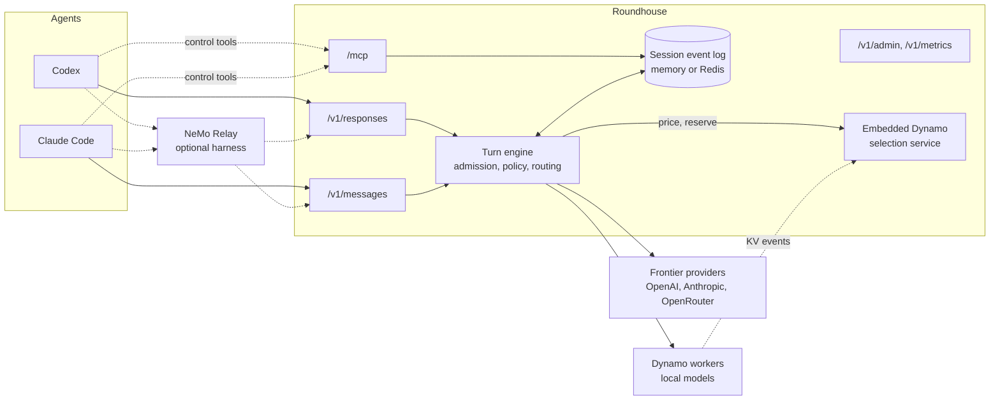

# Introduction

This chapter says what Roundhouse is, why it keeps state, and what it does today. It ends with a map of the rest of this book.

## What Roundhouse is

Roundhouse is a stateful front-end for agentic coding agents. It sits in front of [Dynamo](https://github.com/ai-dynamo/dynamo) and in front of the public endpoints of the frontier labs.

Agentic coding agents (Codex, Claude Code) transparently hook up to Roundhouse and, through it, take advantage of NeMo Relay and Switchyard. They reach local models that Dynamo serves and frontier-lab models through their public endpoints. Each turn is routed to co-optimize function, cost, and time to solution. Each part of that sentence has a consequence in the design:

- **Transparently.** The agent's own stack does not change. Pass-through auth, prefix admission of resent history, and the MCP control surface make the hookup invisible.
- **Through it.** Roundhouse owns the turn: the durable log, the policy, the budgets, the routing, and the steering. NeMo Relay owns the harness. Switchyard contributes routing ideas and judge prompts. Dynamo owns the GPUs.
- **Co-optimize all three.** A router that optimizes only cost ships worse answers. A router that optimizes only quality is a thin proxy to a frontier lab. A router that ignores latency slows the agent loop. So each routing decision carries a quality prior, an exact price, and an expected time to first token (TTFT) together.

## Why state makes routing possible

A coding agent sends its whole conversation again on every turn. At 100k tokens of context and hundreds of turns, that resend is the largest cost of agentic work, in bytes, prefill compute, and money.

Roundhouse keeps the conversation in a durable log. The client still sends its full history, and Roundhouse admits only the new suffix. See [Sessions and the event log](concepts/sessions.md). Because Roundhouse holds the exact token prefix, it can ask which engine already has that prefix in its KV cache and route the turn there. See [Routing and the selection service](concepts/routing.md).

## How the parts connect

Codex sends turns to the OpenAI Responses API at `/v1/responses`, and Claude Code to the Anthropic Messages API at `/v1/messages`. A native HTTP/SSE surface serves the same engine. Either agent can run under NeMo Relay, which can also read a session in its own formats. Every step writes to one append-only log per session, which the MCP surface, the metrics, and the Relay exports read.

## What it does today

- **Durable sessions.** Redis Streams hold the event log, spend ledger, fair-use windows, correlation maps, and admin directory. Without Redis they live in process memory. See [Deploy with Redis](operations/redis.md).
- **Tenancy and money.** A control plane holds projects, users, keys, per-key policy, budgets, and fair-use windows. See [Control plane](concepts/control-plane.md).
- **Routing.** An embedded Dynamo selection service prices local workers, a cache ledger models frontier caches, and two-tier selection fails over per dispatch. See [Choosing a model](concepts/model-selection.md).
- **Providers.** Frontier clients speak OpenAI Responses and Anthropic Messages. See [Configure providers and the catalog](guides/catalog.md).
- **Agent control and steering.** An MCP surface lets the agent read its routing and narrow its policy, and a judge can steer the next turn. See [MCP control surface](concepts/mcp.md) and [Validate and steer](concepts/validate-steer.md).
- **Measurement and launch.** A metrics API and dashboard report tokens, cost, and savings from the log, and `topham` launches Codex or Claude Code from a saved profile. See [Metrics and the dashboard](operations/metrics.md) and [Launch with topham](guides/topham.md).

Known limits:

- Roundhouse serves no WebSocket or gRPC transport.
- Roundhouse cannot resume an interrupted generation from the partial output in the log.
- Metrics are per process. No node aggregates the metrics of other nodes.
- The shipped `roundhouse` binary attaches no local Dynamo fleet. It routes among the catalog's hosted models only. A local tier is a library capability that a deployment wires in.
- Without Redis, the maps that tie an MCP control call to its conversation are per process. A call that lands on a node that served none of the conversation's turns gets a best guess or a refusal.
- Only the Claude Code correlator, `_meta["claudecode/toolUseId"]`, has been seen arriving from a real binary. A control call chained through NeMo Relay is stated, not tested.

The full list is in [Limitations](appendix/limitations.md).

## The Dynamo dependency

Roundhouse depends on Dynamo but is not part of it, and it builds independently. The workspace pins two `ai-dynamo/dynamo` crates to commit `ac7b7513790ef1d619b46f805aea03c9f21200ba`: `dynamo-kv-router` with the `standalone-selection` feature, which carries no `dynamo-runtime` dependency, and `dynamo-tokens` for block hashes. The pin is a git dependency because the newest published `dynamo-kv-router` (1.3.1) does not export the embeddable `SelectionService` and does not use `routing_group`. The git pin also resolves `dynamo-truthy`, which is not published. See [Upstream dependencies](development/upstream.md).

## Where to go next

- To send a first turn, read [Getting started](guides/getting-started.md).
- To connect an agent, read [Hook up Codex](guides/codex.md) or [Hook up Claude Code](guides/claude-code.md).
- To run Roundhouse for a team, read [Configure tenancy and keys](guides/tenancy.md) and the [Configuration reference](appendix/configuration.md).
- To change the code, start at [Workspace crates](development/architecture.md).
