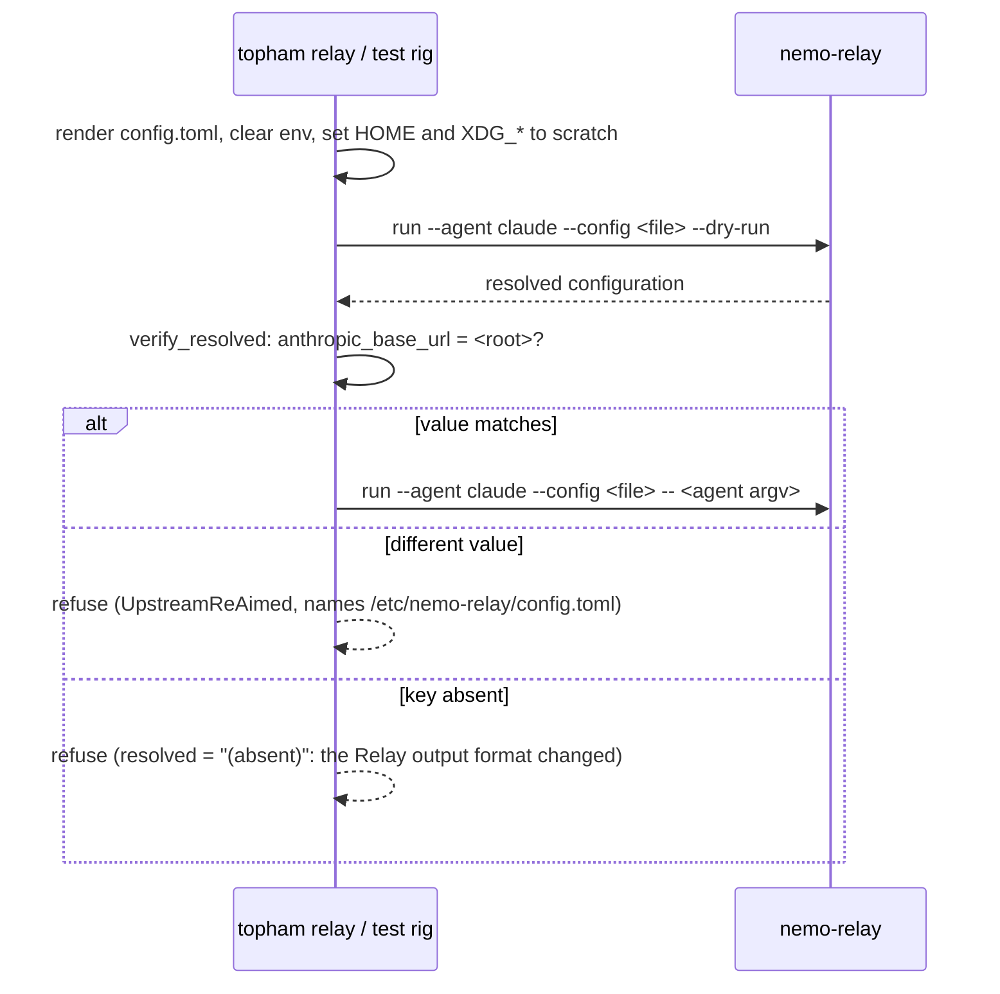

# NeMo Relay formats

Roundhouse publishes each session in the three interchange formats of NeMo Relay: ATOF events, ATIF v1.7 trajectories, and `LlmOptimizationSummary` records. This chapter describes the three reads, what each document contains, and the configuration that aims a NeMo Relay at a Roundhouse deployment.

## Why Roundhouse emits the Relay formats

The session log is a better producer of these formats than the exporter that Relay ships. The log is totally ordered by `seq`, durable, and replayable from cold storage. The ATIF exporter of Relay 0.8.2 keeps its events in memory with no eviction, and the events are lost when the process stops. It also writes the whole trajectory file again at each turn boundary, so each turn costs work in proportion to the conversation. That cost was not measured. So Roundhouse emits the Relay formats and does not invent its own. A shared type lets two systems talk to each other. A copied type is a fork.

The producers live in `crates/roundhouse-relay`. That crate depends on `roundhouse-core` only. It must never depend on `roundhouse-server`, because an emitter that can reach the router can start to read engine state.


## The three reads

| Route | Document | Content type |
|---|---|---|
| `GET /v1/sessions/{id}/atof` | The ATOF event stream, one event per line | `application/x-ndjson` |
| `GET /v1/sessions/{id}/trajectory` | One ATIF v1.7 trajectory | `application/json` |
| `GET /v1/sessions/{id}/optimization` | One `LlmOptimizationSummary` per dispatched turn, in log order | `application/json` |

The routes are mounted by `crates/roundhouse-server/src/relay_api.rs`.

- **Authorization is the namespace check.** It is the same check as `GET /v1/sessions/{id}/events`. It runs before the store is read, so the refusal is the same whether the session exists or not. A namespaced session id is easy to guess, and a refusal that showed existence would let one tenant probe the sessions of another. The control plane is resolved again on each request, so a revoked key stops reading at the same moment it stops spending. See [Control plane](../concepts/control-plane.md).
- **The reads take no lease and do not touch the engine.** A lease makes writes single-writer. A reader that took one would evict the engine it describes. Each document is a function of the stored events and the rate card only, so a replica that never served the session gives the same answer.
- **The read loops over the whole log.** `read_events` returns at most one batch. A single call would silently cut a long session short. A batch that does not advance the cursor ends the read, so a faulty store cannot hang the request.
- **ATOF is NDJSON, not a JSON array.** That is how ATOF is stored, and it is what the converter of NeMo-Agent-Toolkit reads. A consumer can handle the first event before the last one arrives.
- **All three responses carry `Cache-Control: no-store`.** A session is append-only, so a cached copy is a truncated copy.
- **The optimization read is a list, not a sum.** `LlmOptimizationSummary` is per call in the Relay model. A session total is already published by `/v1/metrics`, and a second sum here would compute the same figure a second way. See [Metrics and the dashboard](metrics.md).

## Every export is a pure function of the log

The three producers (`atof::events`, `atif::trajectory`, `summary::for_session`) take a slice of session events and return a value. They read no clock, generate no random id, and read no ambient configuration. Two exports of one finished session are byte-identical. That lets a consumer compare two trajectories to see what a re-run changed.

Every identifier is a UUIDv5 digest of facts already in the log, never a v4 or a v7 (`crates/roundhouse-relay/src/ids.rs`). The crate asks `uuid` for the `v5` feature for this reason. `chrono` is built with `std` only, without `clock`, so the crate cannot read the time by accident.

## ATOF events

The stream has one session-wide `agent` scope. Every other event names that scope as its parent.

```text
scope start  agent          <- the session, the only parentless event
  scope start/end  context  <- one routing decision, data_schema roundhouse/route
  scope start/end  llm      <- one dispatched turn, data_schema openai/chat-completions
  ... per turn ...
scope end    agent
```

Both halves of this shape are necessary for the shipped ATOF-to-ATIF converter:

- The converter finds the trajectory root as the `agent` scope-start with no parent. Without one, it uses the first parentless scope it meets.
- The converter removes repeated input messages per `(parent_uuid, role)`. If turns had different parents, each turn would emit the whole history again as new user steps. A client that resends its history produces exactly that case.

### Why routing decisions are scope-ends and not marks

A routing decision is a `category: "context"` scope-end with `data_schema` `{name: "roundhouse/route", version: "1"}`. A mark would lose the schema. In NeMo-Agent-Toolkit at `c933737` (`packages/nvidia_nat_atif/`, converter `src/nat/atof/scripts/atof_to_atif_converter.py`):

- Dispatch is per event on `data_schema {name, version}`, across three registries.
- `MARK_EXTRACTOR_REGISTRY` and `TOOL_EXTRACTOR_REGISTRY` ship empty.
- An unregistered mark falls through to a default extractor. It lifts a mark to a sourced step only when `data.role` is `user`, `system`, or `agent`.
- Any other mark becomes `{"source": "system", "message": json.dumps(data)}`, with no `extra` and no `data_schema`.
- A context scope-end is the one path that copies the producer's `data_schema` into the ATIF step `extra` verbatim.

As a mark, the routing facts would arrive as an opaque string. A scope is a span, so each decision is a start and end pair that share one uuid. Only the end carries the payload.

### The one hard failure, and how Roundhouse avoids it

The LLM path of the converter raises `ShapeMismatchError` when a non-empty `data` yields no assistant content and no tool call. This is a hard failure, not a silent fallback. Only the mark path fails soft. Roundhouse produces turns with no answer often, for example a turn refused by policy or by a spent budget. Such a turn emits `data: None`, and the payload is built only when there is text or a call to put in it. The guard test is `a_turn_with_no_answer_carries_no_payload_at_all` in `crates/roundhouse-relay/src/atof.rs`.

The LLM scopes declare `data_schema` `openai/chat-completions` version `1`. That is also the default of the converter. It is declared anyway, so a change of the default does not change how an old export is read.

Relay emits ATOF version 0.1 (`ATOF_VERSION`). The version did not change through Relay 0.8.2.

## ATIF v1.7 trajectories

ATIF is not in `nemo-relay-types`. It lives in `crates/core` of Relay, the heavy crate with a runtime, a plugin registry, and a subscriber bus. So `crates/roundhouse-relay/src/atif.rs` carries a field-for-field port of the twelve wire structs, from NeMo Relay rev `1a548124`, file `crates/core/src/observability/atif.rs`, under the Apache-2.0 attribution that file requires. The schema string is `ATIF-v1.7`. There is no v1.8. The exporter of Relay is not ported.

A port is a fork unless drift is visible. The test `the_ported_field_names_match_relays` pins every field name of every struct against a list transcribed from that revision. A field that Relay renames or removes arrives as a failing assertion that names the struct.

The field-level sources of ATIF are the Rust file above plus two NeMo-Agent-Toolkit guides (`atif-step-extra-guide.md`, `atof-to-atif-conversion-guide.md`). There is no normative schema document. `docs/configure-plugins/observability/atif.mdx` in the Relay tree describes plugin configuration, not the schema.

How a session becomes a trajectory:

- **What the client said** becomes `user` or `system` steps.
- **What the deployment answered** becomes exactly one `agent` step per dispatched turn. That step carries `tool_calls`, `observation`, `metrics`, and the routing facts in `extra`.
- `AtifStep` has no field for a prompt, so a turn needs two steps. If a turn were one `agent` step, the trajectory would omit what the user asked. The Relay exporter does the same: an LLM start is a `user` step and an LLM end is an `agent` step.
- **Observations arrive one turn late.** The deployment emits a tool call at the end of one turn. The client runs the tool and sends the result as input to the next turn. So an `observation` is joined forward by `tool_call_id` across the turn boundary, and a call and its result sit on one step.

## LlmOptimizationSummary

Each dispatched turn gets one summary. It answers "what did this routing decision do for this turn". The aggregate for the deployment stays on `/v1/metrics`.

### No money is computed in this crate

Every dollar comes from `roundhouse_core::metrics`, the same code that feeds the dashboard. A second pricing walk would give a second answer to what a turn cost, and the two would disagree the day a rate card was corrected. See [Cost and savings](../concepts/cost-and-savings.md).

- The correlary (the hosted stand-in for a local model) is resolved through `MetricsSnapshot`, as the dashboard resolves it. The counterfactual is `Correlary::shadow_cost_usd`.
- The hosted price and the cache discount use the rate card that the decision recorded, not the catalog this process booted with.
- The local capacity price is the one figure read from the booted catalog, because the dashboard reads it there. With a `local_capacity_price`, a local turn publishes `actual_cost` under `pricing_provider: "roundhouse_local_capacity_price"`. The name is not `dynamo`, because no vendor quoted this price.
- Without a `local_capacity_price`, a local turn publishes no `actual_cost`. A zero would read as free hardware. Unpriced capacity is unknown, not free.
- The correlary is resolved from this session's own events only. A session that never called a hosted model has no observed traffic shape for one. Its local turns come back `Unpriced` and publish no baseline cost. A declared correlary is not affected.

### Seat tokens are never priced

A turn that a pass-through project forwarded on a subscription seat publishes no `baseline_cost`, no `actual_cost`, and no `estimated_cost_saved`. Roundhouse holds no rate card for a seat. The tokens ride the typed payload as a bare count (`seat_tokens`). The spend ledger applies the same rule.

### The capability gate is carried, not computed again

The summary publishes the band that the capability gate used. It has no opinion of its own on whether two models are comparable. Relay has no place for this gate. Its `baseline_model` is whatever a router asserted, and its `ModelPricing` (0.8.2) has no quality prior or band. So nothing in Relay stops a 7B model being priced against a flagship. The band goes into `limitations[]`, so a Roundhouse figure never sits beside an ungated figure with nothing to tell them apart.

### The limitations vocabulary

`limitations[]` is a closed vocabulary, because consumers search it. Each entry names one missing input or one applied gate.

| Entry | When |
|---|---|
| `roundhouse_correlary_unpriced:<reason>` | The correlary of the local model is `Unpriced`. |
| `roundhouse_usage_estimated` | The usage of the turn is estimated, not reported by the provider. |
| `roundhouse_capability_gate:<band>` | The turn has a correlary, priced or not. That is every local turn. The band is the value written in `ROUNDHOUSE_CATALOG`, or the default. |
| `roundhouse_local_capacity_unpriced` | A billed local turn, and the catalog sets no `local_capacity_price`. |
| `roundhouse_seat_forwarded` | A forwarded seat. The summary carries no money, so it must not claim `Complete`. |

`status` is decided in one function (`status` in `crates/roundhouse-relay/src/summary.rs`). It is `Complete` if and only if `limitations` is empty, which is also the rule the Relay builder uses. As a result:

- Every local turn publishes as `Partial`, because every local turn carries the capability-gate entry.
- `Complete` is possible only for a hosted turn, on this deployment's own key, with usage the provider reported, against a recorded rate card.

This is the correct reading of the data, not a defect.

### The typed payload

Roundhouse facts that the summary has no field for ride a typed contribution payload, `RoutingEvidence`, with schema name `roundhouse/routing` and version `2`. It is a different schema from `roundhouse/route`, because it carries money and the route schema carries a decision. Version `2` means `routing_savings_at_decision_usd` is the hosted quote less the local quote of the router (net). Relay consumers keep unknown keys, so only a change of meaning increments the version. The `producer` of every contribution is `roundhouse`. Relay aggregates on that value, so it is a stable identity, not a display name.

Relay bounds contributions at 64 entries, 16 KB each, 256 KB in total, and 64 attempts. Nothing in the published Relay crates produces a contribution. The producers are third-party plugins, and only the OTLP and OpenInference projections consume the summary.

## The routing facts, said once

A routing decision appears three times: as the `data` of the ATOF context scope, in the ATIF step `extra`, and in the optimization payload. `route_facts` in `crates/roundhouse-relay/src/wire.rs` builds it once and all three producers embed it. The facts are read from the decision the log recorded, never from the live deployment, so an edited policy or catalog does not rewrite history. The facts include `considered`, the options that lost, because without them nobody can later ask whether the choice was right. Money is not in the route facts. The cost of a turn belongs to the optimization summary.

## A steered turn

A turn on which the validate loop intervened appears in these documents as what the client received. The documents invent no step kind for it, because a new step kind would make the export unreadable by every other consumer of the format. The routing facts carry `steered: true` for such a turn, so a reader can find it. A Shadow-arm turn is not marked, because that arm takes no action. The session log stays the record of which content the deployment wrote. See [Validate and steer](../concepts/validate-steer.md).

## The type source

`atof` and `summary` use Relay's own types from `nemo-relay-types`, pinned at exactly `=0.7.3`. The ATOF envelope and the optimization surface are byte-identical from 0.7.3 through 0.8.2. The pin, its `uuid` ceiling, and its unlock condition are in [Upstream dependencies](../development/upstream.md#nemo-relay).

## Aim a NeMo Relay at Roundhouse

In the chained topology a NeMo Relay sits between the agent and Roundhouse. `crates/roundhouse-server/src/relay_handoff.rs` renders the Relay side of that chain. `topham relay` uses it (see [Launch with topham](../guides/topham.md)), and so does the gated Claude Code suite. The client side of the chain is the same as the Direct topology. See [Hook up Claude Code](../guides/claude-code.md) and [Hook up Codex](../guides/codex.md).

`RelayHandoff::config_toml` renders four lines:

```toml
[upstream]
anthropic_base_url = "https://roundhouse.example"

[agents.claude]
command = "claude"
```

For Codex the key is `openai_base_url`, the value ends in the API prefix, and the table is `[agents.codex]`. Both constructors take the deployment root and derive the upstream URL. The Anthropic base carries no API prefix, because Relay appends the whole inbound path to it. The OpenAI base carries the prefix.

| Agent | `--agent` | Upstream key | Override variable |
|---|---|---|---|
| Claude Code | `claude` | `anthropic_base_url` | `NEMO_RELAY_ANTHROPIC_BASE_URL` |
| Codex | `codex` | `openai_base_url` | `NEMO_RELAY_OPENAI_BASE_URL` |

The agent and its upstream key are one enum (`RelayAgent`). Relay accepts a config that names one agent but aims the upstream of the other. That config sends every turn to the default upstream of Relay, which is a frontier lab. Nothing in the run reports it.

### What the handoff refuses

- An empty deployment root. Relay would forward to its default upstream with the credential of the client.
- A root that already ends in the API prefix. Relay would forward to a doubled prefix and report an upstream connection error.
- A value with a quote, a backslash, or a control character. TOML would refuse the file or parse a different value.

### What the handoff does not write

- **No `anthropic_auth_header` or `openai_auth_header`.** The reference chained wiring is the client carrying its turn key on a dedicated header, and Relay forwarding it untouched. Also, Relay clears a configured auth header when another layer supplies the base URL.
- **No `[gateway] bind`.** Relay 0.8.2 refuses a non-loopback bind, so the default is the only working value.
- **No comment line.** A guard test pins the bytes against the template that the gated suite used, so the rig and `topham relay` render the same thing.

### The preflight

`--config` replaces only the user layer of the Relay configuration. The system layer, `/etc/nemo-relay/config.toml`, is folded in after it and wins on any key both set. The switch that turns that off is behind a test-only cargo feature. So a system Relay install can aim a chained launch, with a real turn key, somewhere nobody chose.



- The preflight runs with a cleared environment. Only `PATH` is kept. `HOME`, `XDG_CONFIG_HOME`, `XDG_DATA_HOME`, `XDG_STATE_HOME`, and `XDG_CACHE_HOME` all point at one scratch directory. The `NEMO_RELAY_*` environment layer sits above `--config`, so an inherited environment would check a resolution that the real launch does not have.
- Because the preflight clears the environment, it cannot see `NEMO_RELAY_ANTHROPIC_BASE_URL` or `NEMO_RELAY_OPENAI_BASE_URL`. So `topham relay` checks the variable for its agent itself. If the variable is set to a different upstream, `topham relay` refuses to launch.
- The launch uses `run` and not the bare `nemo-relay claude` form, because the bare form starts an interactive setup wizard when no config layer exists. The `--` before the agent argv is required. Without it, Relay parses the flags of the agent as its own.
