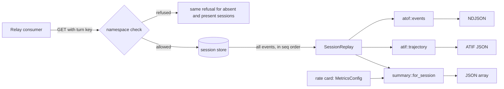
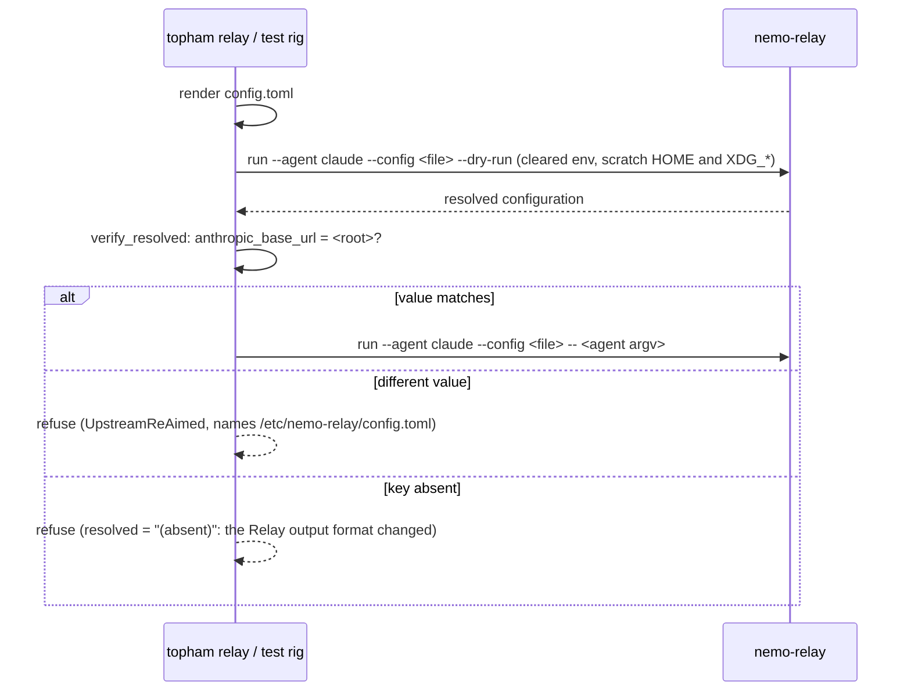

# NeMo Relay formats

Roundhouse publishes each session in the three interchange formats of NeMo Relay: ATOF events, ATIF v1.7 trajectories, and `LlmOptimizationSummary` records. This chapter describes the three reads, what each document contains, and the configuration that aims a NeMo Relay at a Roundhouse deployment.

## Why Roundhouse emits the Relay formats

The session log is a better producer of these formats than the exporter that Relay ships. The log is totally ordered by `seq`, durable, and replayable from cold storage. The ATIF exporter of Relay 0.8.2 keeps its events in memory with no eviction, loses them when the process stops, and writes the whole trajectory file again at each turn boundary (that cost was not measured). A shared type lets two systems talk, and a copied type is a fork, so Roundhouse emits the Relay formats and invents none.

The producers live in `crates/roundhouse-relay`. That crate depends on `roundhouse-core` only. It must never depend on `roundhouse-server`, because an emitter that can reach the router can start to read engine state.



## The three reads

| Route | Document | Content type |
|---|---|---|
| `GET /v1/sessions/{id}/atof` | The ATOF event stream, one event per line | `application/x-ndjson` |
| `GET /v1/sessions/{id}/trajectory` | One ATIF v1.7 trajectory | `application/json` |
| `GET /v1/sessions/{id}/optimization` | One `LlmOptimizationSummary` per dispatched turn, in log order | `application/json` |

The routes are mounted by `crates/roundhouse-server/src/relay_api.rs`.

- **Authorization is the namespace check,** the same as for `GET /v1/sessions/{id}/events`. It runs before the store is read, so the refusal is the same whether the session exists or not. A refusal that showed existence would let one tenant probe the guessable session ids of another. A deployment with no control-plane file has no namespace, so every id passes. The plane is resolved on each request, so a revoked key stops reading when the plane refreshes. See [Control plane](../concepts/control-plane.md).
- **The reads take no lease and do not touch the engine.** A reader that took a lease would evict the engine it describes. A replica that never served the session gives the same answer.
- **The read loops over the whole log.** `read_events` returns at most one batch, and a single call would silently cut a long session short. A batch that does not advance the cursor ends the read, so a faulty store cannot hang the request.
- **ATOF is NDJSON,** the form the converter of NeMo-Agent-Toolkit reads. All three responses carry `Cache-Control: no-store`, because a session is append-only and a cached copy is a truncated copy.
- **The optimization read is a list, not a sum.** `LlmOptimizationSummary` is per call in the Relay model. The session total is on `/v1/metrics`. See [Metrics and the dashboard](metrics.md).

## Every export is a pure function of the log

The three producers take a slice of session events and return a value. They read no clock, generate no random id, and read no ambient configuration. Two exports of one finished session are byte-identical, so a consumer can compare two trajectories to see what a re-run changed. Every identifier is a UUIDv5 digest of facts already in the log, never a v4 or a v7 (`crates/roundhouse-relay/src/ids.rs`). The crate builds `chrono` without `clock`, so it cannot read the time by accident.

## ATOF events

The stream has one session-wide `agent` scope. Every other event names that scope as its parent.

```text
scope start  agent          <- the session, the only parentless event
  scope start/end  context  <- one routing decision, data_schema roundhouse/route
  scope start/end  llm      <- one dispatched turn, data_schema openai/chat-completions
  ... per turn ...
scope end    agent
```

The shipped ATOF-to-ATIF converter needs both halves of this shape. It finds the trajectory root as the `agent` scope-start with no parent. It also removes repeated input messages per `(parent_uuid, role)`, so turns with different parents would each emit the whole history again as new user steps, which is what a client that resends its history produces.

**Why routing decisions are scope-ends and not marks.** A routing decision is a `category: "context"` scope-end with `data_schema` `{name: "roundhouse/route", version: "1"}`. In NeMo-Agent-Toolkit at `c933737` (`src/nat/atof/scripts/atof_to_atif_converter.py`), `MARK_EXTRACTOR_REGISTRY` ships empty, and an unregistered mark becomes `{"source": "system", "message": json.dumps(data)}` with no `extra` and no `data_schema`. A context scope-end is the one path that copies the producer's `data_schema` into the ATIF step `extra` verbatim. As a mark, the routing facts would arrive as an opaque string. A scope is a span, so each decision is a start and end pair that share one uuid, and only the end carries the payload.

**The one hard failure.** The LLM path of the converter raises `ShapeMismatchError` when a non-empty `data` yields no assistant content and no tool call. Only the mark path fails soft. Roundhouse often produces turns with no answer, for example a turn refused by policy or by a spent budget. Such a turn emits `data: None`, and the payload is built only when there is text or a call to put in it (`a_turn_with_no_answer_carries_no_payload_at_all` in `crates/roundhouse-relay/src/atof.rs`).

The LLM scopes declare `data_schema` `openai/chat-completions` version `1`, which is also the converter default, so a change of that default does not change how an old export is read. Relay emits ATOF version 0.1 (`ATOF_VERSION`), unchanged through Relay 0.8.2.

## ATIF v1.7 trajectories

ATIF is not in `nemo-relay-types`. It lives in `crates/core` of Relay, the heavy crate with a runtime, a plugin registry, and a subscriber bus. So `crates/roundhouse-relay/src/atif.rs` carries a field-for-field port of the twelve wire structs, from NeMo Relay rev `1a548124`, file `crates/core/src/observability/atif.rs`, under the Apache-2.0 attribution that file requires. The schema string is `ATIF-v1.7`, and there is no v1.8. The exporter of Relay is not ported.

A port is a fork unless drift is visible. `the_ported_field_names_match_relays` pins every field name of every struct against a list transcribed from that revision, so a renamed or removed field arrives as a failing assertion that names the struct. There is no normative schema document. The sources are the Rust file and two NeMo-Agent-Toolkit guides (`atif-step-extra-guide.md`, `atof-to-atif-conversion-guide.md`).

- **What the client said** becomes `user` or `system` steps.
- **What the deployment answered** becomes exactly one `agent` step per dispatched turn, with `tool_calls`, `observation`, `metrics`, and the routing facts in `extra`. `AtifStep` has no field for a prompt, so a turn needs two steps, as in the Relay exporter.
- **Observations arrive one turn late.** The client sends a tool result as input to the next turn, so an `observation` is joined forward by `tool_call_id` across the turn boundary, and a call and its result sit on one step.

## LlmOptimizationSummary

Each dispatched turn gets one summary. It answers "what did this routing decision do for this turn". The aggregate stays on `/v1/metrics`.

The summary carries `schema_version: "1"` and `calculation_version: "2"`. Version `2` means a priced local turn reports its capacity cost as `actual_cost` and its saving net of that cost.

**No money is computed in this crate.** Every dollar comes from `roundhouse_core::metrics`, the code that feeds the dashboard. A second pricing walk would give a second answer to what a turn cost, and the two would disagree the day a rate card was corrected. See [Cost and savings](../concepts/cost-and-savings.md).

- The correlary (the hosted stand-in for a local model) is resolved through `MetricsSnapshot`, and the counterfactual is `Correlary::shadow_cost_usd`. The hosted price and the cache discount use the rate card that the decision recorded, not the catalog this process booted with.
- The local capacity price is the one figure read from the booted catalog. With a `local_capacity_price`, a local turn publishes `actual_cost` under `pricing_provider: "roundhouse_local_capacity_price"`, not `dynamo`, because no vendor quoted this price. Without one, a local turn publishes no `actual_cost`, because a zero would read as free hardware.
- The correlary is resolved from this session's own events only. A session that never called a hosted model has no observed traffic shape, so its local turns are `Unpriced` and publish no baseline cost. A declared correlary is not affected.

**Seat tokens are never priced.** A turn forwarded on a subscription seat publishes no `baseline_cost`, no `actual_cost`, and no `estimated_cost_saved`. The tokens ride the typed payload as a bare count (`seat_tokens`). See [Cost and savings](../concepts/cost-and-savings.md).

**The capability gate is carried, not computed again.** Relay has no place for this gate. Its `baseline_model` is whatever a router asserted, and its `ModelPricing` (0.8.2) has no quality prior or band, so nothing in Relay stops a 7B model being priced against a flagship. The summary publishes the band that the gate used in `limitations[]`, so a Roundhouse figure never sits beside an ungated one without a way to tell them apart.

### The limitations vocabulary

`limitations[]` is a closed vocabulary, because consumers search it. Each entry names one missing input or one applied gate.

| Entry | When |
|---|---|
| `roundhouse_correlary_unpriced:<reason>` | The correlary of the local model is `Unpriced`. |
| `roundhouse_usage_estimated` | The usage of the turn is estimated, not reported by the provider. |
| `roundhouse_capability_gate:<band>` | The turn has a correlary, priced or not, which is every local turn. The band is the value in `ROUNDHOUSE_CATALOG`, or the default. |
| `roundhouse_local_capacity_unpriced` | A billed local turn, and the catalog sets no `local_capacity_price`. |
| `roundhouse_seat_forwarded` | A forwarded seat. The summary carries no money, so it must not claim `Complete`. |

`status` is `Complete` if and only if `limitations` is empty (`status` in `crates/roundhouse-relay/src/summary.rs`), which is also the Relay builder rule. So every local turn publishes as `Partial`, and `Complete` is possible only for a hosted turn on this deployment's own key, with usage the provider reported, against a recorded rate card. That is the correct reading of the data, not a defect.

### The typed payload

Facts that the summary has no field for ride a typed contribution payload, `RoutingEvidence`, with schema name `roundhouse/routing` and version `2`. It is a different schema from `roundhouse/route`, because it carries money and the route schema carries a decision. Version `2` means `routing_savings_at_decision_usd` is the hosted quote less the local quote of the router (net). Relay consumers keep unknown keys, so only a change of meaning increments the version. The `producer` of every contribution is `roundhouse`, a stable identity that Relay aggregates on. In Relay 0.8.2 the per-call recorder seals itself after 64 contributions, 16 KB each, 256 KB in total, or 64 attempts (`core/src/api/optimization.rs`). Nothing shipped in the 0.8.2 CLI, adaptive, or plugin crates produces a contribution. The producers are third-party plugins, and the only consumers of the summary are the OTLP and OpenInference projections.

## The routing facts, said once

A routing decision appears three times: as the `data` of the ATOF context scope, in the ATIF step `extra`, and in the optimization payload. `route_facts` in `crates/roundhouse-relay/src/wire.rs` builds it once and all three producers embed it. The facts come from the decision the log recorded, never from the live deployment, so an edited policy or catalog does not rewrite history. They include `considered`, the options that lost, because without them nobody can later ask whether the choice was right. Money is not in the route facts.

## A steered turn

A turn on which the validate loop intervened appears as what the client received. The documents invent no step kind for it, because a new step kind would make the export unreadable by every other consumer of the format. The routing facts carry `steered: true` for such a turn, so a reader can find it. A Shadow-arm turn is not marked, because that arm takes no action. Only a judged verdict marks a turn. A Placebo-arm intervention consults no judge, so its turn is not marked either. See [Validate and steer](../concepts/validate-steer.md).

## The type source

`atof` and `summary` use the types of `nemo-relay-types`, pinned at exactly `=0.7.3`. The ATOF envelope and the optimization surface are byte-identical from 0.7.3 through 0.8.2. The pin, its `uuid` ceiling, and its unlock condition are in [Upstream dependencies](../development/upstream.md#nemo-relay).

## Aim a NeMo Relay at Roundhouse

In the chained topology a NeMo Relay sits between the agent and Roundhouse. `crates/roundhouse-server/src/relay_handoff.rs` renders the Relay side of that chain for `topham relay` (see [Launch with topham](../guides/topham.md)) and for the gated Claude Code suite. The client side is the same as the Direct topology (see [Hook up Claude Code](../guides/claude-code.md) and [Hook up Codex](../guides/codex.md)).

`RelayHandoff::config_toml` renders four lines:

```toml
[upstream]
anthropic_base_url = "https://roundhouse.example"

[agents.claude]
command = "claude"
```

For Codex the key is `openai_base_url`, the value ends in the API prefix (`/v1`), and the table is `[agents.codex]`. Both constructors take the deployment root and derive the upstream URL. The Anthropic base has no API prefix, because Relay appends the whole inbound path to it.

| Agent | `--agent` | Upstream key | Override variable |
|---|---|---|---|
| Claude Code | `claude` | `anthropic_base_url` | `NEMO_RELAY_ANTHROPIC_BASE_URL` |
| Codex | `codex` | `openai_base_url` | `NEMO_RELAY_OPENAI_BASE_URL` |

The agent and its upstream key are one enum (`RelayAgent`). Relay accepts a config that names one agent but aims the upstream of the other, and that config sends every turn to the default upstream of Relay, a frontier lab, with nothing in the run to report it.

**The handoff refuses:**

- An empty deployment root. Relay would forward to its default upstream with the credential of the client.
- A root that already ends in the API prefix. Relay would forward to a doubled prefix and report an upstream connection error.
- A value with a quote, a backslash, or a control character. TOML would refuse the file or parse a different value.

**The handoff does not write:**

- `anthropic_auth_header` or `openai_auth_header`. The client carries its turn key on a dedicated header, and Relay forwards it untouched. Relay also clears a configured auth header when another layer supplies the base URL.
- `[gateway] bind`. Relay 0.8.2 refuses a non-loopback bind, so the default is the only working value.
- A comment line. A guard test pins the bytes, so the rig and `topham relay` render the same thing.

### The preflight

`--config` replaces only the user layer of the Relay configuration. The system layer, `/etc/nemo-relay/config.toml`, is folded in after it and wins on any key both set. The switch that turns that off is behind a test-only cargo feature. So a system Relay install can aim a chained launch, with a real turn key, somewhere nobody chose. A `--dry-run` preflight asks Relay what it resolved.



- The preflight clears the environment and keeps only `PATH`. `HOME` and the four `XDG_*` variables point at one scratch directory. The `NEMO_RELAY_*` environment layer sits above `--config`, so an inherited environment would check a resolution that the real launch does not have.
- The preflight cannot see the `NEMO_RELAY_*` override variables, and the real launch is not isolated. [topham relay](../guides/topham.md#topham-relay) covers both.
- A Relay that exits non-zero on the preflight is reported with its own stderr, not as a re-aim.
- The launch uses `run`, not the bare `nemo-relay claude` form, which starts an interactive setup wizard when no config layer exists. The `--` before the agent argv is required. Without it, Relay parses the flags of the agent as its own.
