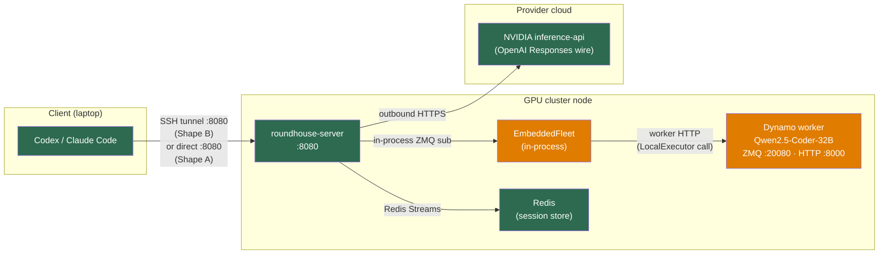
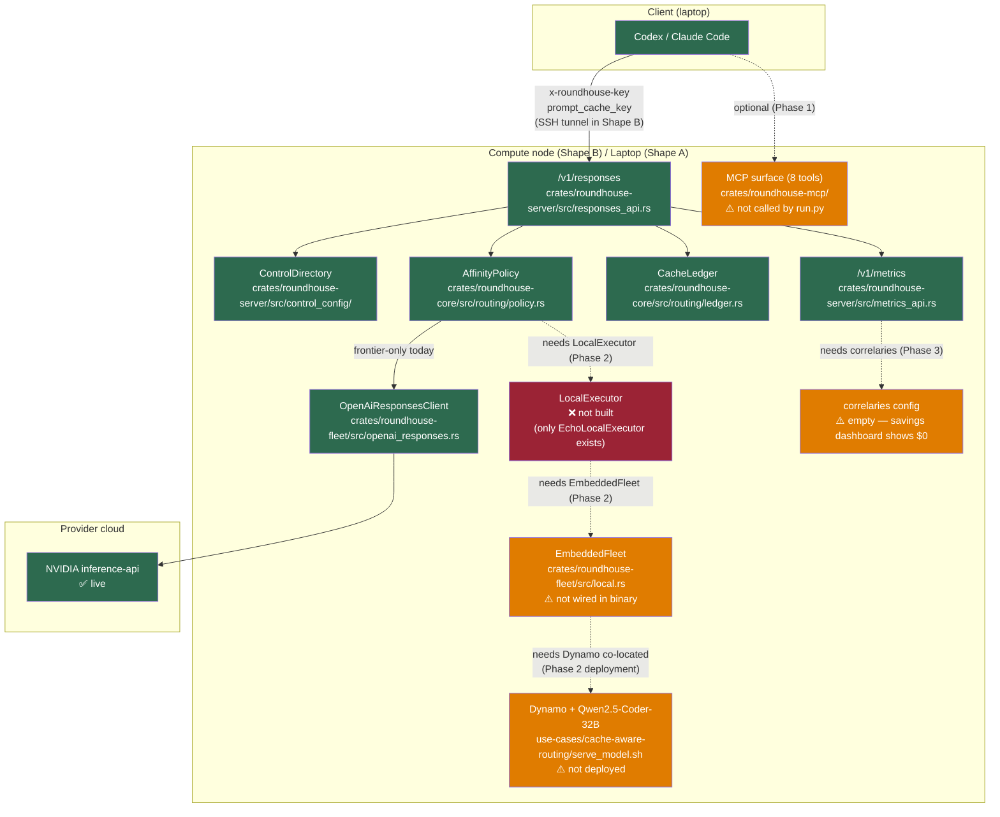

<!--
SPDX-FileCopyrightText: Copyright (c) 2026 NVIDIA CORPORATION & AFFILIATES. All rights reserved.
SPDX-License-Identifier: Apache-2.0
-->

# Gap Analysis — cache-aware-routing

---

## Deployment topology

This use case has two operational shapes. Phase 0–1 use Shape A. Phase 2–3 require Shape B.

| Component | Shape A (frontier-only) | Shape B (mixed local + frontier) |
|---|---|---|
| Agent (Codex / Claude Code) | Laptop | Laptop |
| roundhouse-server | Laptop (same machine) | GPU cluster node |
| Dynamo worker (Qwen) | Not needed | GPU cluster node (co-located with roundhouse) |
| Redis | Laptop | GPU cluster node or shared |
| Frontier API (NVIDIA) | Outbound HTTPS from laptop | Outbound HTTPS from cluster node |

**Why co-location is required for Shape B:** `EmbeddedFleet` runs `SelectionService` in-process
(`crates/roundhouse-fleet/src/local.rs`) and subscribes to Dynamo's ZMQ KV-event streams. Those
streams are ZMQ PUB/SUB — tunneling them over SSH is not viable. Only roundhouse's single HTTP
port (`:8080`) needs to cross the tunnel back to the laptop.

**SSH tunnel for Shape B:**
```bash
# On your laptop — forwards roundhouse's port to localhost:8080
ssh -L 8080:localhost:8080 user@your-gpu-cluster-node
```



---

## What works today (Shape A — frontier-only)

| Component | File / module |
|---|---|
| OpenAI Responses API endpoint | `crates/roundhouse-server/src/responses_api.rs` |
| Prefix admission (resent history → suffix delta) | `crates/roundhouse-server/src/responses_api.rs` |
| `prompt_cache_key` tracking → `CacheLedger` | `crates/roundhouse-core/src/routing/ledger.rs` |
| Control plane (project / user / key resolution) | `crates/roundhouse-server/src/control_config/` |
| Frontier client (OpenAI Responses wire) | `crates/roundhouse-fleet/src/openai_responses.rs` |
| `AffinityPolicy` routing (cache-hit-first, load-aware) | `crates/roundhouse-core/src/routing/policy.rs` |
| `DecisionRecord` written to session log | `crates/roundhouse-core/src/routing/mod.rs` |
| `MetricsFold` → `/v1/metrics` + HTML dashboard | `crates/roundhouse-server/src/metrics_api.rs` |
| `inactivity_decay` cache model | `crates/roundhouse-fleet/src/frontier.rs` |
| SSE streaming, per-turn `cached_tokens` reported | `crates/roundhouse-server/src/responses_api.rs` |

---

## Gaps

| Gap | Type | Severity | Where it lives | Unblocked by |
|---|---|---|---|---|
| Real `LocalExecutor` not implemented | Not built | P1 | `crates/roundhouse-fleet/src/local.rs` — trait exists; only `EchoLocalExecutor` and mocks implement it | Phase 2 Rust work |
| `roundhouse-server` binary does not wire `LocalFleet` | Not wired | P1 | `crates/roundhouse-server/src/main.rs` — `serve()` attaches no `EmbeddedFleet` | Phase 2 custom binary |
| Dynamo worker not running + roundhouse not co-located on cluster | Needs deployment | P1 | GPU cluster node — requires etcd + nats, Dynamo from pinned rev `ac7b7513`, Qwen weights, roundhouse running on same node | Phase 2 cluster setup |
| `correlaries: []` — savings dashboard shows $0 | Needs config | P1 | `use-cases/cache-aware-routing/catalog.json` | Phase 3 |
| Placeholder pricing in `catalog.json` | Needs config | P1 | `use-cases/cache-aware-routing/catalog.json` | Phase 3 |
| Only one user in `control-plane.json` (Tax B invisible) | Needs config | P2 | `use-cases/cache-aware-routing/control-plane.json` — add second user + key entry | Phase 1 |
| Driver (`run.py`) does not call MCP tools | Not wired | P2 | `use-cases/cache-aware-routing/run.py` | Phase 1 |
| `local_quality: {}` — no quality prior for local model | Needs config | P2 | `use-cases/cache-aware-routing/catalog.json` | Phase 3 |
| No baseline assertions in `run.py` | Not wired | P2 | `use-cases/cache-aware-routing/run.py` | Phase 1 |

Severity:
- **P0** — blocks the demo from running at all (none currently for Shape A)
- **P1** — demo runs on Shape A but Shape B / savings / local routing are missing
- **P2** — demo runs and core numbers are visible, but improvements remain

---

## Architecture diagram

Color key:
- **Green** — implemented and wired for this use case
- **Orange** — implemented but not wired / needs config / needs deployment
- **Red** — not built yet


