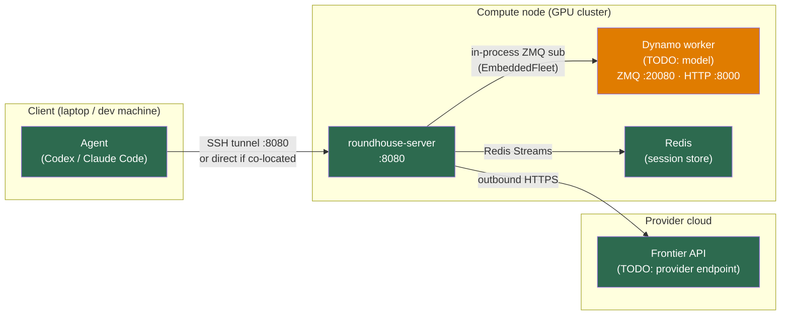
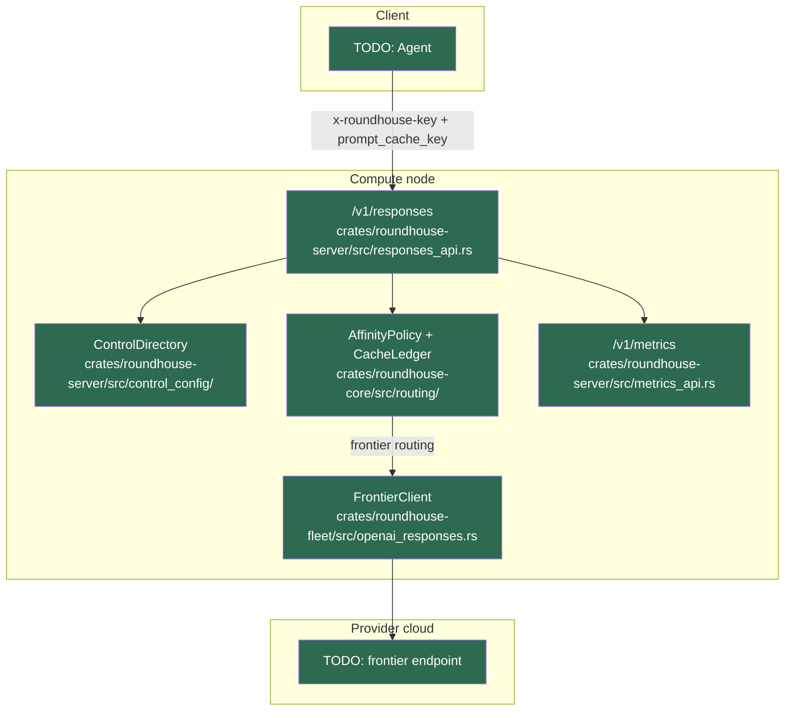

<!--
SPDX-FileCopyrightText: Copyright (c) 2026 NVIDIA CORPORATION & AFFILIATES. All rights reserved.
SPDX-License-Identifier: Apache-2.0
-->

# Gap Analysis — TODO: Use Case Name

---

## Deployment topology

<!-- TODO: Before listing gaps, state where each component runs and what network connections
  are required. This determines which "Needs deployment" gaps exist and how to resolve them.

  Fill in the table and draw the topology diagram below.

  Key rules from the architecture:
  - roundhouse-server must run CO-LOCATED with Dynamo on the same node (EmbeddedFleet runs
    SelectionService in-process and subscribes to ZMQ KV-event streams — tunneling ZMQ is
    not viable).
  - The agent (Codex / Claude Code) can run anywhere that can reach roundhouse's :8080 port.
    An SSH port-forward (`ssh -L 8080:localhost:8080 user@cluster`) is sufficient.
  - Frontier traffic is outbound HTTPS from roundhouse to the provider — no special topology.
-->

| Component | Runs on | Network connection |
|---|---|---|
| Agent (Codex / Claude Code) | TODO: laptop / CI / cloud | TODO: localhost / SSH tunnel |
| roundhouse-server | TODO: laptop / cluster node | TODO: listens on :8080 |
| Dynamo worker + local model | TODO: GPU cluster node | TODO: ZMQ :20080 (in-process), HTTP :8000 |
| Redis (session store) | TODO: same node / remote | TODO: localhost / network |
| Frontier API | TODO: provider cloud | TODO: outbound HTTPS from roundhouse |

---

## What works today

<!-- TODO: List roundhouse components exercised with zero changes needed.
  For each, cite the exact file/module.
  Example:
  - `/v1/responses` prefix admission — `crates/roundhouse-server/src/responses_api.rs`
  - `prompt_cache_key` tracking → CacheLedger — `crates/roundhouse-core/src/routing/ledger.rs`
  - Control plane (project/user/key resolution) — `crates/roundhouse-server/src/control_config/`
  - `/v1/metrics` + dashboard — `crates/roundhouse-server/src/metrics_api.rs`
-->

---

## Gaps

Gap types:
- **Not built** — does not exist anywhere in the repo
- **Not wired** — built but not connected for this use case (code or config change needed)
- **Needs config** — built and wired but requires a config value that is currently a placeholder
- **Needs deployment** — code is built and wired, but requires specific compute / network
  topology to be set up (e.g., GPU cluster, SSH tunnel, etcd + nats, co-location with Dynamo)

| Gap | Type | Severity | Where it lives | Unblocked by |
|---|---|---|---|---|
| TODO gap description | Not built / Not wired / Needs config / Needs deployment | P0 / P1 / P2 | TODO file or crate | TODO milestone, PR, or infra step |

Severity:
- **P0** — blocks the demo from running at all
- **P1** — demo runs but a key feature is missing or shows incorrect numbers
- **P2** — demo runs and numbers are visible, but an improvement remains

---

## Architecture diagram

Color key:
- **Green** (`style fill:#2d6a4f,color:#fff`) — implemented and wired for this use case
- **Orange** (`style fill:#e07c00,color:#fff`) — implemented but not wired / needs config / needs deployment
- **Red** (`style fill:#9b2335,color:#fff`) — not built yet

<!-- TODO: Expand the deployment topology diagram above with component-level detail.
  Show the data flow within the compute node (roundhouse → EmbeddedFleet → Dynamo worker)
  and label each node with its file/crate. Use subgraphs to preserve the
  client / cluster / cloud boundary.

  KV cache cold-start note: when AffinityPolicy switches providers (frontier → local or
  local → frontier), the new provider processes the full conversation prefix cold on the
  first turn. Add a note on any edge where this switch can occur, so the diagram makes
  the cost visible.

  Example structure: -->

